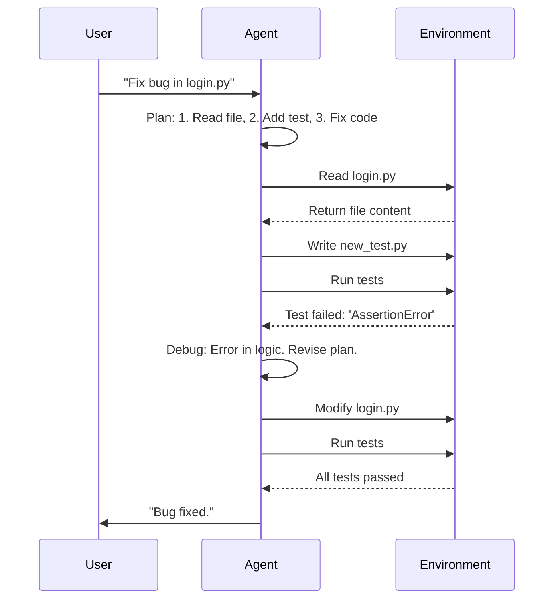
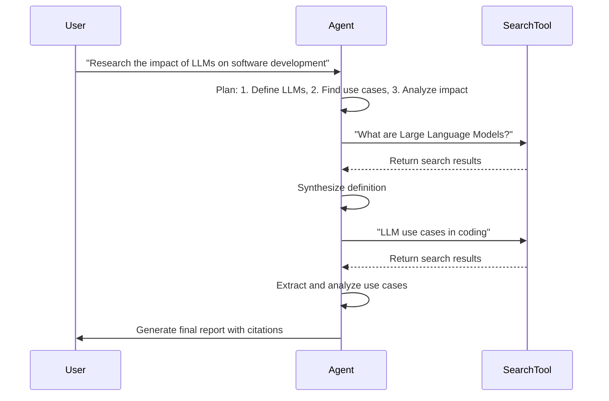

# LLM Workflows vs. Agentic Systems
### Workflows vs. Agents: The AI Showdown

## Introduction

The term "AI agent" is everywhere, often portrayed as the next frontier—a magical black box that can autonomously perform complex tasks. From a practical engineering perspective, however, much of what we label an "agent" is little more than a well-structured script. The hype has outpaced the reality, creating confusion about what we are actually building.

This article cuts through that hype. We'll provide a clear, engineering-focused distinction between two fundamental approaches for building with Large Language Models (LLMs): LLM Workflows and Agentic Systems. Understanding this difference isn't just academic; it's a critical architectural decision that will dictate your project's complexity, flexibility, and ultimate success.

We will explore the definitions, core mechanics, and ideal use cases for both. We'll also deconstruct some of the most advanced so-called agents of 2025 to see what makes them tick. By the end, you’ll have a practical framework for choosing the right approach and a clear-eyed view of the challenges that remain.

## LLM Workflows vs. Agentic Systems: Understanding the Core Distinction

To build robust AI systems, we first need to agree on what we are talking about. The distinction between a workflow and an agent boils down to a single question: who is in control? Is it the developer, or is it the Large Language Model?

### LLM Workflows: The Assembly Line
An LLM Workflow is a system where the sequence of tasks is predefined and orchestrated by developer-written code. The LLM acts as a component within this structure, called upon to perform specific, well-defined jobs like summarizing text or extracting data. The path the system takes is deterministic and predictable because the developer has hardcoded the logic.

It is an assembly line. Each station performs a specific function in a set order to build a final product. The developer designs the assembly line, and the LLM is a sophisticated new machine placed at one of the stations. It is powerful, but it only does what the overarching process tells it to do, when it tells it to do it. In these systems, LLMs and tools are orchestrated through predefined code paths [1]. This approach is perfect for tasks that can be broken down into a fixed sequence of steps.


### Agentic Systems: The Skilled Expert
An Agentic System, in contrast, places the LLM in the driver's seat. Instead of following a script, the agent uses the LLM's reasoning capabilities to dynamically decide the sequence of steps needed to achieve a goal. The developer provides the agent with a goal and a set of tools, but the agent itself determines which tools to use, in what order, and how to interpret the results.

This is less like an assembly line and more like a skilled expert tackling an unfamiliar problem. Give an expert a goal, and they will use their knowledge and the tools at their disposal to formulate a plan, execute it, adapt to unforeseen issues, and eventually solve the problem. The process is not fixed; it is adaptive and driven by the expert's judgment. In these systems, LLMs dynamically direct their own processes and tool usage, maintaining control over how they accomplish their tasks [1]. This autonomy allows them to handle novelty and ambiguity in ways that rigid workflows cannot.


### The Core Difference and the Role of Orchestration
The fundamental distinction is the locus of control. In an LLM Workflow, the developer defines the logic and control flow. In an Agentic System, the LLM drives the reasoning and action selection.

It is important to understand that both approaches require an orchestration layer. This layer is the control logic that manages the system's operations. However, its role is different in each paradigm. In a workflow, the orchestrator is like a foreman on the assembly line, ensuring each step is executed according to a fixed plan. In an agentic system, the orchestrator acts more like a facilitator, providing the LLM with the resources it needs to execute its own dynamically generated plan and managing the feedback loop between the agent's actions and its observations [3].

## Workflows vs. Agents: When to Use Which

Now that we have defined the two ends of the spectrum, the practical question is: when should you build a workflow, and when do you need an agent? The answer depends entirely on the nature of the problem you are trying to solve. Choosing the wrong path can lead to an overly complex, unreliable system or, conversely, a system too rigid to be useful.

### When to Use LLM Workflows
LLM Workflows excel at tasks that are structured, repeatable, and have a predictable path to completion. Their strength lies in reliability and consistency. If you can clearly map out the steps required to solve a problem, a workflow is almost always the right choice. It is easier to build, debug, and maintain, and it is often more cost-effective since you can use smaller, specialized models for different steps.

Common use cases for LLM Workflows include:
*   **Structured Data Extraction:** Pulling specific information from documents like invoices or legal contracts and formatting it into a structured output like JavaScript Object Notation (JSON). The process is always the same: receive a document, identify the fields, extract the data, and format it.
*   **Automated Report Generation:** Creating reports from a template by populating it with data from various sources. For example, a weekly sales report that pulls data from a Customer Relationship Management (CRM) system, summarizes key metrics, and inserts them into a predefined document.
*   **Content Processing Chains:** A common example is summarizing an article and then translating that summary into multiple languages. This is a classic "prompt chaining" workflow where the output of one LLM call becomes the input for the next [1].
*   **Form and Application Processing:** Systems that take user input from a form, process it according to business rules, and generate a standardized response or action.

### When to Use Agentic Systems
Agentic Systems are best suited for open-ended, complex problems where the solution path is unknown and requires adaptation. Their power comes from flexibility and the ability to handle novelty. However, this autonomy often comes at a higher operational cost and increased latency, as agents may perform numerous LLM calls and tool invocations to complete a single complex task [3]. If a task requires reasoning, exploration, and dynamic decision-making, you are entering the realm of agents.

Scenarios suited for Agentic Systems include:
*   **Open-Ended Research and Synthesis:** Asking an agent to research a complex topic, gather information from multiple sources, synthesize findings, and produce a comprehensive report. The agent must decide which search queries to use, which sources are credible, and how to combine the information.
*   **Dynamic Problem-Solving:** Tasks like debugging a complex software issue. An agent might need to understand the bug report, set up a testing environment, read through multiple files, write code, run tests, analyze the output, and repeat the process until the bug is fixed [2]. There is no fixed script for this.
*   **Complex Customer Support:** Handling a customer issue that requires diagnosing a problem, interacting with multiple internal systems (e.g., billing, shipping, technical support), and making decisions based on the customer's specific situation.
*   **Interactive Task Completion:** An agent designed to operate a computer's graphical user interface (GUI) to complete a task, like booking a flight or ordering groceries. It must visually interpret the screen and decide on a sequence of clicks and keyboard inputs to achieve the user's goal.

### The Reality: A Hybrid Spectrum
In practice, the line between workflows and agents is often blurred. Most sophisticated, real-world applications exist on a spectrum, blending predictable, workflow-driven components with agentic, decision-making modules. A system might use a rigid workflow to ingest and preprocess data, then hand it off to an agent to perform complex analysis and reasoning.

Think of it as a gradient. On one end, you have pure, hardcoded workflows with minimal LLM involvement. On the other, you have fully autonomous agents with maximum decision-making power. Most production systems find their sweet spot somewhere in the middle, leveraging the reliability of workflows for the known parts of a problem and the flexibility of agents for the unknown.


The key takeaway for an engineer is to start simple. Default to a workflow unless the problem explicitly demands the dynamic, adaptive capabilities of an agent. Do not build an agent just for the sake of it; build one because the problem's complexity leaves you with no other choice.

## State-of-the-Art Agent Examples (2025): A Closer Look

To make the distinction more concrete, let's look at a few state-of-the-art systems from 2025 that exemplify agentic principles. These are not just theoretical concepts; they are real systems tackling complex problems by giving LLMs a significant degree of autonomy.

### Deep Research Agents
Systems like OpenAI's Deep Research agent tackle complex research tasks beyond simple web searches. Given a high-level topic, these agents autonomously formulate a research plan. They execute iterative search queries, browse and analyze content from multiple sources, synthesize findings, and generate structured reports with citations. This self-directed nature makes them agentic, as they reason about information and dynamically adjust their strategy to build a comprehensive understanding [4].

### Advanced Coding Agents (Devin)
Cognition Labs' Devin is a prominent coding agent aiming to be a fully autonomous AI software engineer. Given a GitHub issue, Devin can set up the development environment, reproduce the bug, plan a fix, write code, run tests, and submit a pull request. It resolves 13.86% of real-world issues on the Software Engineering Benchmark (SWE-bench) unassisted, showcasing its ability to orchestrate a complex, multi-step engineering workflow that requires planning, tool use, and self-correction [2].

### Computer Control Agents
Another emerging class of agents operates a computer's GUI. Concepts like OpenAI's Operator or Anthropic's computer-use demos show agents that interpret screens. They execute mouse clicks and keyboard inputs to complete tasks in standard applications. This is agentic because the agent plans actions based on visual input. It translates a user's goal into low-level actions within an environment it has never seen before. These examples show that true agentic systems plan and execute complex, multi-step tasks in dynamic environments, moving far beyond the reactive, single-shot capabilities of simple LLM calls.

## Operational Flows of Agentic LLM Systems

To truly understand what makes an agent "agentic," we need to look under the hood. While the specific implementations vary, most advanced agents operate on a similar loop of planning, acting, and learning from feedback. Let's deconstruct the likely operational flows for the agent archetypes we just discussed.

### Advanced Coding Agent (e.g., Devin)
A coding agent's job is to solve a software engineering task. This requires a continuous cycle of interaction with a development environment. The operational loop likely looks something like this:
1.  **Goal Understanding & Planning:** The agent first parses the high-level task (e.g., "fix this bug in the login flow"). It then breaks this down into a sequence of smaller, actionable steps.
2.  **Environment Interaction:** The agent uses tools to interact with the file system to read existing code and understand the project's structure.
3.  **Code Generation/Modification:** Based on its plan and understanding, it writes or edits the necessary code.
4.  **Execution & Testing:** It uses a code interpreter or shell to run the code, execute test suites, and use tools like linters to check for errors.
5.  **Debugging & Iteration:** If tests fail or errors occur, the agent analyzes the output, revises its plan, and tries a new approach. This loop continues until the tests pass and the goal is achieved.

Devin, for instance, can learn unfamiliar technologies, build and deploy applications end-to-end, and autonomously find and fix bugs by setting up its own environment and reproducing issues. It correctly resolves 13.86% of real-world GitHub issues unassisted, significantly outperforming previous models [2].


### Deep Research Agent
A research agent must navigate the vast and unstructured world of information to synthesize a coherent answer. Its process is an iterative cycle of discovery and refinement:
1.  **Query Formulation & Planning:** The agent starts with a broad topic and breaks it down into specific research questions.
2.  **Iterative Search:** It uses a search engine tool to execute queries, refining them based on results.
3.  **Information Extraction & Filtering:** It browses sources, extracts relevant information, and filters out noise.
4.  **Synthesis & Analysis:** The agent aggregates the information, looks for patterns, and builds a coherent narrative.
5.  **Citation & Reporting:** Finally, it generates a structured report, ensuring all claims are backed by citations.

Deep Research agents are designed to autonomously synthesize large amounts of online information. They continuously gather and analyze new information, mitigating compounding errors by verifying their understanding. These agents also document their research process with explicit citations and detail their thought process to enhance transparency [4]. Some can operate fully autonomously, while others incorporate human-in-the-loop (HITL) stages, pausing for human review to catch potential errors early [5].


### Computer Control Agent (e.g., OpenAI's Operator)
This type of agent interacts with the world through a GUI, just like a human. Its loop is a tight cycle of perception and action. These agents interpret screens and execute mouse clicks and keyboard inputs to complete tasks. This is agentic because the agent plans actions based on visual input, translating a user's goal into low-level actions within an environment it has never seen before.

The key mechanisms are:
1.  **Observe:** The agent captures an image of the current screen.
2.  **Understand:** It uses a multimodal vision model to interpret the screenshot, identifying elements like buttons and text fields.
3.  **Plan:** Based on the user's goal, the agent decides on the next single action to take.
4.  **Act:** It executes the action using Operating System (OS)-level commands to control the mouse and keyboard.
5.  **Verify:** The loop repeats. The agent observes the new state of the screen to confirm its action had the intended effect and then plans its next move.
```mermaid
sequenceDiagram
    participant User
    participant Agent
    participant GUI

    User->>Agent: "Order a pizza"
    Agent->>GUI: Capture screen
    GUI-->>Agent: Return screenshot
    Agent->>Agent: Plan: Click on 'Pizza' category
    Agent->>GUI: Execute mouse click on 'Pizza' coordinates
    Agent->>GUI: Capture screen
    GUI-->>Agent: Return new screenshot
    Agent->>Agent: Plan: Click on 'Pepperoni'
    Agent->>GUI: Execute mouse click
    ...
```
Across all these examples, the common thread is a loop where the agent plans, acts, observes the result, and then refines its plan. This iterative, feedback-driven process is the essence of agentic behavior.

## Common Patterns and Enduring Challenges in Agent Design

As we deconstruct these advanced agents, you will see common architectural patterns emerge. Building an agent is not about finding a magical new algorithm; it is about engineering a system that effectively combines several core components. Understanding these patterns gives you an intuition for what it takes to build an agent, while also highlighting the significant challenges that still stand in the way of creating truly robust and reliable autonomous systems.

You build a typical agentic architecture around an LLM that acts as a reasoning engine, orchestrated with four fundamental components: Planning, Tool Use, Memory, and an Iterative Refinement loop.
```mermaid
graph TD
    A[User Goal] --> B{Reasoning Engine (LLM)};
    B --> C[Planning Module];
    C --> B;
    B --> D[Tool Use];
    D --> E[External Environment];
    E --> B;
    B --> F[Memory];
    F --> B;

    subgraph Agent Core
        B;
        C;
        D;
        F;
    end

    style B fill:#f9f,stroke:#333,stroke-width:2px
```

### Planning
Before an agent acts, it must have a plan. The planning module is responsible for breaking down a high-level, ambiguous goal into a sequence of smaller, concrete steps. This process, often called task decomposition, is critical. An agent might use techniques like Chain-of-Thought or Tree-of-Thought prompting to reason through the problem and generate a step-by-step plan. This plan is rarely static; it is a living document that the agent revisits and revises based on the outcomes of its actions.

### Tool Use
Tools are the agent's hands and eyes, allowing it to interact with the world beyond its internal knowledge. A tool can be anything from a simple calculator to a web search API, a file system interface, or a connection to a database. For an agent, tool use is fundamental. It is how the agent gathers new information (observation) and affects change in its environment (action). The quality of an agent is often limited by the quality and design of its tools. A well-designed tool has a clear purpose, a simple interface, and a descriptive name that the LLM can easily understand and decide to use.

### Memory
An agent without memory is like an agent with amnesia, incapable of learning from its experiences or maintaining context over time. Agentic systems typically break memory into two types:
*   **Short-Term Memory:** This is the agent's working memory, holding the context of the current task. It includes the user's initial request, the agent's current plan, the history of recent actions, and observations. The LLM's context window often manages this.
*   **Long-Term Memory:** This is where the agent stores information for future use, allowing it to learn and improve over time. Engineers commonly implement this using external databases, often vector databases, where the agent can store and retrieve past experiences. Agentic systems use knowledge graphs and vector stores to maintain context, enabling them to reason across sessions and tasks [6]. Advanced agents employ techniques like multi-hop search to combine micro and macro context for grounded outputs [7]. Multi-agent collaboration also supports persistent context across tasks [8].
```mermaid
graph LR
    subgraph Agent
        A[Reasoning Engine]
    end

    subgraph Memory
        B[Short-Term Memory <br>(Context Window)]
        C[Long-Term Memory <br>(Vector DB)]
    end

    A <--> B
    A <--> C
```

### Iterative Refinement / Self-Correction
This loop ties everything together. A Reason-Act (ReAct) loop is the most common pattern. The agent reasons about its goal and current state to form a plan. It then acts by using a tool. It observes the outcome of that action and feeds this new information back into its reasoning process. This feedback allows the agent to perform self-correction. If an action fails or produces an unexpected result, the agent can analyze the error, update its understanding of the world, and try a different approach. This iterative refinement enables agents to navigate complex and unpredictable environments.

### Enduring Challenges
While these patterns provide a blueprint for building agents, implementing them in a robust, reliable, and scalable way is a massive engineering challenge. The hype often glosses over these very real and difficult problems.

*   **Compounding Errors:** The autonomy of an agent is a double-edged sword. Because the agent makes many sequential decisions, a single small error in reasoning early on can compound, sending the agent down a completely wrong and unrecoverable path. Ensuring reliability becomes incredibly difficult.
*   **Long-Context Coherence:** While memory helps, maintaining a coherent strategy and understanding over dozens or hundreds of steps is a major challenge for current LLMs. Models can "forget" their original goal or get sidetracked by irrelevant details.
*   **Effective Error Detection and Recovery:** How does an agent know when it is stuck in a loop or has made a critical mistake? Designing robust mechanisms for error detection and graceful recovery remains largely unsolved. Most agents today are brittle and fail silently or ungracefully. Best practices for mitigation include system monitoring, resilience via microservices, and chaos engineering [9]. HITL stages can also act as quality control checkpoints to catch errors early [5].
*   **Scalability and Cost:** An agent might make tens or even hundreds of LLM calls to complete a single task. This can make agentic systems incredibly slow and expensive to run at scale, a far cry from the sub-second response time of a single API call [3].
*   **Security:** Giving an autonomous system access to powerful tools like file systems, APIs, and code interpreters opens up significant security vulnerabilities. Ensuring that an agent cannot be tricked into performing malicious actions is paramount. Strong permissioning is essential, where each tool enforces authentication and authorization, tying the agent's identity to a role that only permits intended actions [3].
*   **Evaluation:** How do you evaluate an agent designed for open-ended tasks? Traditional accuracy metrics do not apply. Evaluating agent performance is a new and complex field, requiring new benchmarks and methodologies to measure things like task success, efficiency, and robustness.

## Conclusion

The discourse around AI is filled with buzzwords, but as engineers, our job is to look past the hype and focus on what we can actually build. The distinction between LLM Workflows and Agentic Systems is a crucial piece of that clarity.

We have seen that LLM Workflows, with their developer-defined logic, offer predictability and reliability for structured tasks. In contrast, Agentic Systems hand the reins to the LLM, enabling dynamic, autonomous problem-solving for complex, open-ended challenges. The reality for most production systems lies on a spectrum between these two poles, blending the strengths of both.

We also deconstructed the common architectural patterns that underpin today's most advanced agents—Planning, Tool Use, Memory, and Iterative Refinement. These are the building blocks of autonomy. However, we must also be clear-eyed about the immense challenges that remain. Issues like compounding errors, cost, security, and the difficulty of evaluation are not minor details; they are the central engineering problems of the agentic era.

By understanding this landscape—the definitions, the use cases, the patterns, and the problems—you are better equipped to make informed architectural decisions. You can choose the right level of autonomy for your project and focus your engineering efforts on tackling the challenges that truly matter.

## References

- [1] [Building effective agents](https://www.anthropic.com/research/building-effective-agents)
- [2] [Introducing Devin, the first AI software engineer](https://cognition.ai/blog/introducing-devin)
- [3] [Agentic LLM Architecture: A Comprehensive Guide](https://sam-solutions.com/blog/llm-agent-architecture/)
- [4] [Introducing Deep Research](https://openai.com/index/introducing-deep-research/)
- [5] [A Comparison of Deep Research AI Agents](https://aisecuritychronicles.org/a-comparison-of-deep-research-ai-agents-52492ee47ca7)
- [6] [Agentic AI Architecture: A Deep Dive into the Future of AI](https://markovate.com/blog/agentic-ai-architecture)
- [7] [Devin: The World's First AI Software Engineer - A Deep Dive](https://youtube.com/watch?v=KfXq9s96tPU)
- [8] [Agentic Coding & Emerging Tools](https://hyperdev.substack.com/p/agentic-coding-emerging-tools)
- [9] [Effective Error Mitigation: Techniques, Strategies, and Best Practices](https://blog.kodezi.com/effective-error-mitigation-techniques-strategies-and-best-practices/)