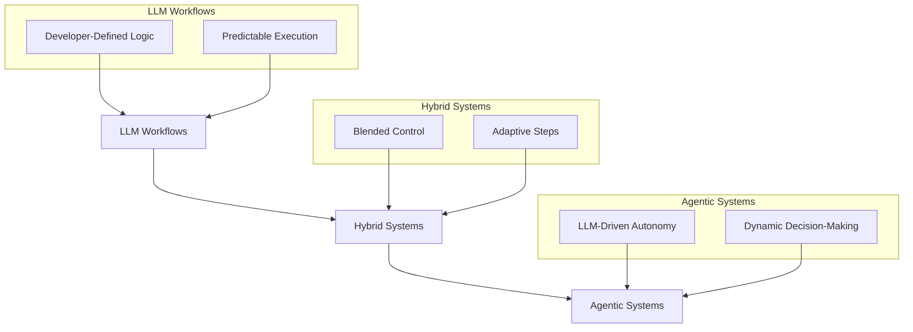
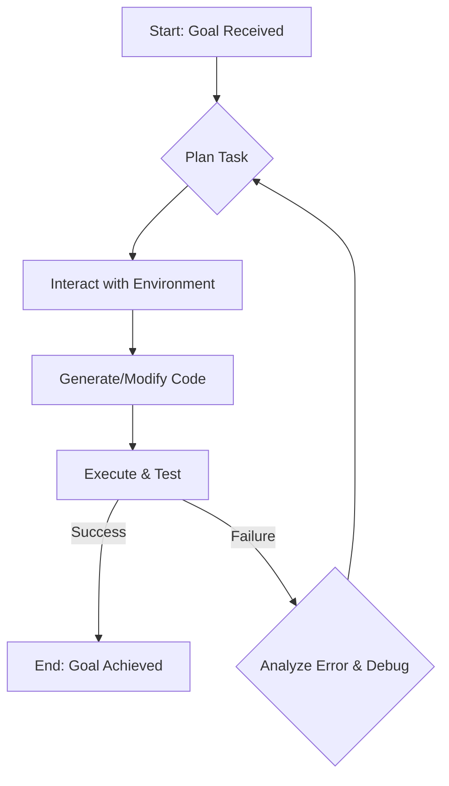
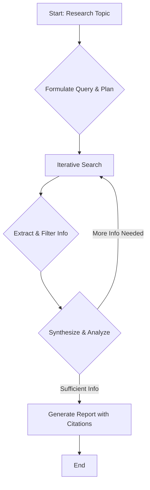
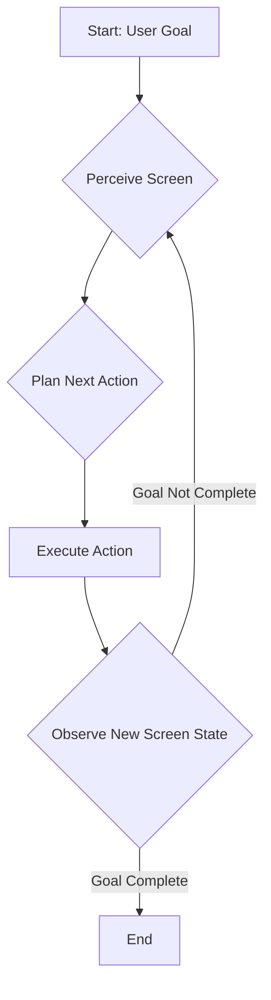
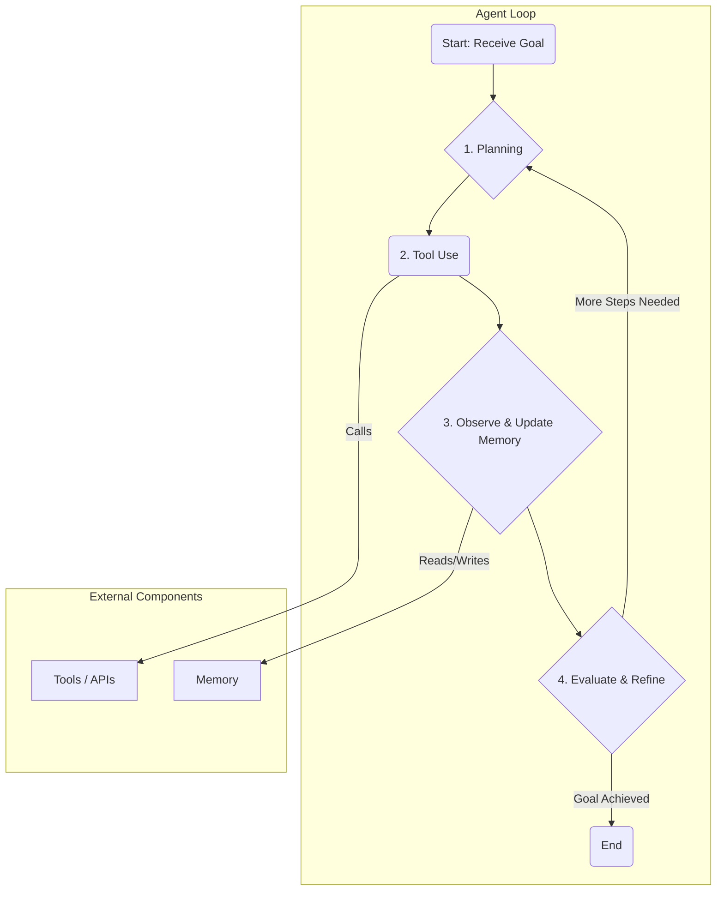

# AI Agents: Hype vs. Reality
### Workflows vs. Agents: The AI Engineer's Guide

## Introduction

The hype around AI agents is impossible to ignore. Every week, a new demo promises a fully autonomous system that can code, research, or even run your business. But as engineers, we know that demos are not production systems. The gap between a flashy proof-of-concept and a reliable, scalable application is vast. To bridge that gap, we need to cut through the noise and talk about real engineering.

This article provides a practical engineering guide to the two fundamental ways of building with Large Language Models (LLMs)
: LLM Workflows and Agentic Systems. Understanding the distinction between these two is not just academic; it’s a critical architectural decision that will define your project's complexity, flexibility, and ultimate chance of success.

We will deconstruct the definitions, explore real-world use cases, and analyze the architectural mechanics of both approaches. By the end, you’ll have a clear framework for choosing the right path for your project and an understanding of how the most advanced agents of 2025 actually work under the hood.

## Defining the Spectrum: LLM Workflows vs. Agentic Systems

Before we can build robust systems, we need a shared vocabulary. People often use the terms "workflow" and "agent" interchangeably, which leads to confusion. Let's establish a clear, engineering-focused distinction.

A **Large Language Model (LLM) Workflow** is a system where developer-written code predefines and orchestrates the sequence of tasks. It’s like an assembly line: each step is a discrete function, and your code determines the path from start to finish. The LLM acts as a component within this fixed structure, but it doesn’t decide the overall process.

This approach is ideal for predictable tasks. For example, a workflow might extract data, summarize it with an LLM, and then translate the summary. The flow is controlled, often using prompt chaining where each step processes the output of the previous one. This fixed sequence makes workflows reliable but rigid, much like classic programming [1, 2].

An **Agentic System**, in contrast, is one where the LLM dynamically decides the sequence of steps to achieve a goal. Instead of following a script, the agent plans, acts, and adapts using its reasoning capabilities, like a skilled expert tackling a new problem. As a developer, you provide the goal, tools, and environment; the LLM is in the driver's seat, directing its own process [1].

This approach allows for flexibility and emergent behavior, as the agent optimizes its actions in real time. Agentic systems operate in a continuous cycle of planning, action, observation, and reflection. This gives the LLM a structured way to act autonomously and break down complex problems [3].

The core difference is **developer-defined logic versus LLM-driven autonomy**. In a workflow, you code the "if this, then that" logic for a predictable path. In an agentic system, the LLM generates this logic on the fly, adapting as needed. This distinction impacts everything from design to maintenance, trading the stability of workflows for the flexibility of agents [1, 2].

Both approaches require an orchestration layer, but its role differs. For workflows, the orchestrator is an executor, following a fixed blueprint. For agents, it's a facilitator, managing the dynamic loop of planning, acting, and reflecting that the LLM directs [3]. This is crucial because it determines where complexity and failures will emerge in your system.

## Choosing Your Path: Use Cases and Considerations

With clear definitions in place, the next question is practical: when should you build a workflow, and when do you need an agent? The answer depends entirely on the problem you are trying to solve. Choosing the wrong approach leads to over-engineered, unreliable systems or, conversely, systems that are too rigid to be useful.

LLM Workflows are the right choice for predictable and repeatable tasks. If you can map out the steps in a flowchart, a workflow is likely your best bet. Their strength is reliability and consistency. This approach is generally simpler to orchestrate, scale, and maintain, with more predictable costs than agentic systems [3]. A predefined path also makes debugging straightforward.

Good use cases include structured data extraction from invoices, automated report generation from various data sources, and content processing chains like summarization and translation. These tasks can be broken down into fixed subtasks where predictable control is a requirement.

Agentic Systems are for open-ended problems where the solution path is unknown. You need an agent when the system must adapt and make decisions in real time, iterating toward a goal with minimal human intervention. This flexibility allows the agent to optimize its actions as it goes, rather than following a static script [1].

Use cases include open-ended research, where an agent can formulate queries, browse sources, and synthesize a report. Dynamic problem-solving is another fit; an agent can debug a codebase by forming hypotheses, running tests, and iterating on a fix. Complex customer support, automated legal research, and dynamic marketing campaigns are also strong candidates for agentic systems [4].

In reality, the line between workflows and agents is blurry. Most production systems exist on a spectrum, blending elements of both. You might use a predefined workflow that calls an "agentic step" for a complex task. For example, a support workflow could handle standard tickets but route complex issues to an agent for diagnosis.

This hybrid approach balances the reliability of workflows with the flexibility of agents. It acknowledges that real-world problems rarely fit neatly into one box. We often see workflows where an LLM "overseer" delegates subtasks to smaller, specialized agents, which is effective for managing resources or privacy [5]. The key is to start with the simplest solution—usually a workflow—and add agentic complexity only where necessary.

Figure 3: A conceptual diagram illustrating a spectrum from LLM Workflows to Agentic Systems, showing the transition from developer-defined logic to LLM-driven autonomy.

## State-of-the-Art Agent Examples (2025): A Closer Look

To make the concept of agents more concrete, let's look at a few state-of-the-art examples from 2025. These systems showcase what becomes possible when you move from predefined workflows to dynamic, LLM-driven autonomy.

### Devin: The AI Software Engineer
Developed by Cognition AI, Devin is designed as an autonomous AI software engineer. Given a GitHub issue, it can set up an environment, reproduce the bug, write code, and run tests to verify the fix [6].

What makes Devin an agent is its autonomous planning and execution loop. It doesn't follow a script; it makes thousands of decisions to achieve its goal. Its performance on the SWE-bench benchmark, resolving 13.86% of issues end-to-end, far exceeds previous workflow-like models [6].

### Deep Research Agents
Companies like OpenAI and Google are developing agents specifically for complex research tasks. These agents go far beyond simple web search. They can take a high-level research question, break it down into a multi-step research plan, autonomously browse the web, synthesize information from dozens of sources, and generate a comprehensive report with citations [7]. This is agentic because the research process is iterative and unpredictable. The agent decides which queries to run, which links to follow, and how to combine disparate pieces of information to form a coherent narrative.

### Computer Control Agents (Operator-like Systems)
Another emerging category is agents designed to operate computer applications just like a human would. These systems use vision models to see the screen and then map a user's goal (e.g., "book a flight to New York") into a sequence of mouse clicks and keyboard inputs. This is highly agentic because the agent must navigate unfamiliar user interfaces, adapt to changes, and plan its actions based on visual feedback. The core functionality is not pre-programmed for a specific website but is generalized to operate any application.

These examples show that true agentic systems are not just about chaining LLM calls. They are about granting the LLM the autonomy to reason, plan, and act to solve complex, open-ended problems.

## Deconstructing Advanced Agent Mechanisms

Advanced agents like Devin do not work by magic. They are built using specific, repeatable engineering patterns that combine planning, tool use, and iteration. By deconstructing these mechanisms, you can understand how to build similar capabilities.

### Advanced Coding Agents
A coding agent like Devin operates in a continuous loop to solve software engineering tasks. We can break down its process into a few key stages:

1.  **Planning:** The agent first analyzes the high-level goal, such as "fix this bug," and decomposes it into a sequence of smaller, actionable steps.
2.  **Environment Interaction:** It uses tools to read files, list directories, and understand the existing project structure. This builds the context needed to make informed changes.
3.  **Code Generation:** Based on its plan and context, the agent writes or modifies code.
4.  **Testing & Execution:** It uses a code interpreter or shell to run the code, execute tests, or use a linter. This provides crucial feedback on whether the changes are working.
5.  **Debugging & Iteration:** If the tests fail or an error occurs, the agent analyzes the output, revises its plan, and tries a new approach. This loop continues until the goal is achieved or a stop condition is met.

Beyond coding, agents are also revolutionizing how we gather and synthesize information. Let's explore how Deep Research Agents operate.

### Deep Research Agents
Research agents follow a similar iterative process, but they focus their tools and actions on information gathering and synthesis:

1.  **Query Formulation:** The agent starts with a broad topic and breaks it down into specific research questions. It plans a strategy for which questions to tackle first.
2.  **Iterative Search:** It uses tools like a web search engine or a database query interface to find relevant information.
3.  **Information Extraction:** The agent reads the search results, identifies the most relevant passages, and extracts key facts and figures.
4.  **Synthesis & Analysis:** It combines information from multiple sources, looks for patterns, identifies contradictions, and builds a coherent understanding of the topic.
5.  **Reporting:** Finally, it generates a structured output, like a report or summary, complete with citations to the sources it used.

While coding and research agents operate in digital environments, another powerful category of agents interacts directly with computer interfaces, much like a human user.

### Computer Control Agents
Agents that operate graphical user interfaces (GUIs) heavily rely on vision and action mapping:

1.  **Goal Understanding:** The agent receives a high-level goal from the user, such as "send an email to my team."
2.  **Visual Perception:** It uses a vision model to capture an image of the current screen and understand the layout, identifying elements like buttons, text fields, and menus.
3.  **Action Planning:** The agent maps the user's goal to a sequence of GUI actions, for example, "click on the 'Compose' button," "type the recipient's address," or "click 'Send'."
4.  **Execution & Observation:** It executes the action, such as a mouse click, and then observes the new screen state to confirm the action was successful and plan the next step.

These diagrams simplify the process, but they reveal a common foundation: a loop of planning, acting, observing, and refining. This is the fundamental engine of agentic behavior.

## Common Patterns and Enduring Challenges in Agent Design

State-of-the-art agents are not black boxes. They are complex systems built from common architectural patterns. Understanding these patterns gives you the building blocks to design your own agents. However, building with them is far from simple and comes with persistent challenges that every engineer in this space must confront.

### Planning
This is the agent's "brain." Before taking any action, the agent decomposes a complex goal into a series of smaller, manageable sub-tasks [3]. This might involve a simple "chain-of-thought" process or more sophisticated strategies where an "orchestrator" LLM delegates tasks to specialized "worker" LLMs [1]. The plan is not static; it is a living document that the agent updates based on new information.

### Tool Use
Agents are useless without the ability to act. Tools are the agent's "hands," allowing it to interact with the outside world. Tool integration is a core component of agentic systems [3]. A tool can be anything from a web search API, a code interpreter, a database query engine, or even another AI model. The ability to select and use the right tool for the right sub-task is a fundamental capability of any effective agent.

### Memory
To perform multi-step tasks, an agent needs memory. We can break this down into two types. **Short-Term Memory** is the context for the current task, like a scratchpad holding recent actions and results, often managed within the LLM's context window. **Long-Term Memory** is a persistent knowledge store, like a vector database, that the agent accesses across sessions. This allows it to retrieve past experiences to inform current decisions [3, 8, 9].

### Iterative Refinement (Self-Correction)
No agent gets everything right on the first try. A critical pattern is the ability to observe the outcome of an action, evaluate its success, and correct course if necessary. This feedback loop is crucial for recovering from errors and adapting to unexpected situations [3]. It can be as simple as re-trying a failed API call or as complex as a separate "evaluator" LLM providing critiques on the work of a "generator" LLM [1].

These four patterns—Planning, Tool Use, Memory, and Refinement—are orchestrated in a continuous loop.

Figure 5: The common architectural patterns of an AI agent, showing the continuous loop of planning, tool use, memory, and iterative refinement.

While this architecture provides a powerful framework, building and deploying reliable agents is fraught with challenges. These are not edge cases; they are fundamental problems you will encounter.

**Compounding Errors:** An agent's autonomy is a double-edged sword. A small error in an early step can cascade into a completely wrong outcome. Unlike a workflow where you can debug a specific step, an agent's failure might result from a long chain of subtle misjudgments [3, 10].

**Long-Context Coherence:** As an agent performs more steps, its context grows. Maintaining focus and coherence over dozens or hundreds of steps is incredibly difficult for current LLMs. The agent can get "lost" or forget its original goal [4].

**Error Recovery:** What happens when a tool fails? Building robust error detection and recovery is critical but complex. The agent must know not only that something went wrong but also how to fix it. Orchestration must account for state management and recovery from partial failures, which is a much bigger problem than in simple workflows [3, 11, 12, 13].

**Scalability and Cost:** Agentic systems can be incredibly expensive. A single user query might trigger dozens of powerful LLM calls and tool invocations, leading to high latency and significant operational costs. An autonomous agent may perform dozens of model calls to accomplish a complex task, which significantly impacts scalability [3].

**Security:** Giving an autonomous agent access to powerful tools, like file systems or production APIs, creates significant security risks. You need robust sandboxing, permissions, and monitoring to prevent unintended or malicious actions. Each tool must enforce authentication and authorization to ensure the agent only performs intended actions [3].

**Evaluation:** How do you even measure the performance of an open-ended agent? Traditional metrics do not apply. Evaluating agents often requires complex, multi-faceted frameworks and, in many cases, human judgment, making it a major bottleneck in the development cycle [3].

## Conclusion

We've journeyed from simple definitions to the complex machinery of advanced AI systems. The key takeaway is that "agent" is not a marketing buzzword; it's a specific engineering paradigm with clear trade-offs.

We established the core distinction between developer-defined **LLM Workflows** and LLM-driven **Agentic Systems**. Workflows offer predictability and are ideal for structured tasks, while agents provide the flexibility to tackle open-ended, dynamic problems. We also saw that these two concepts exist on a spectrum, and the most practical solutions often blend elements of both.

By deconstructing state-of-the-art agents, we uncovered a set of common architectural patterns—Planning, Tool Use, Memory, and Iterative Refinement—that form the foundation of autonomous AI. However, we also confronted the significant challenges, from compounding errors to security risks, that make building reliable agents a difficult engineering feat.

As an engineer, your job is to choose the right architecture for the problem at hand. Don't build an agent when a simple workflow will do. Start simple, measure everything, and only add complexity when it's justified by a clear improvement in performance. With this pragmatic mindset, you can move beyond the hype and build AI systems that actually work.

### References
- [1] [Building effective agents](https://www.anthropic.com/research/building-effective-agents)
- [2] [LLMOps for Production: Agentic RAG](https://decodingml.substack.com/p/llmops-for-production-agentic-rag)
- [3] [LLM Agent Architecture: A Comprehensive Guide](https://sam-solutions.com/blog/llm-agent-architecture/)
- [4] [Seizing the agentic AI advantage](https://www.mckinsey.com/capabilities/quantumblack/our-insights/seizing-the-agentic-ai-advantage/)
- [5] [Overseer: An LLM-based Multi-Agent System for Autonomous Scientific Discovery](https://arxiv.org/html/2506.02153v1)
- [6] [Introducing Devin, the first AI software engineer](https://cognition.ai/blog/introducing-devin/)
- [7] [Introducing Deep Research](https://openai.com/index/introducing-deep-research/)
- [8] [Agentic AI Architecture: A Comprehensive Guide](https://markovate.com/blog/agentic-ai-architecture/)
- [9] [Agentic Coding: Emerging Tools](https://hyperdev.substack.com/p/agentic-coding-emerging-tools)
- [10] [A Comparison of Deep Research AI Agents](https://aisecuritychronicles.org/a-comparison-of-deep-research-ai-agents-52492ee47ca7)
- [11] [Effective Error Mitigation Techniques: Strategies and Best Practices](https://blog.kodezi.com/effective-error-mitigation-techniques-strategies-and-best-practices/)
- [12] [Securing Robotics and Autonomous Systems](https://www.numberanalytics.com/blog/securing-robotics-and-autonomous-systems/)
- [13] [Ghost in the Machine: A Review of Autonomous Agents for Process Control with Large Language Models](https://arxiv.org/pdf/2307.05203)