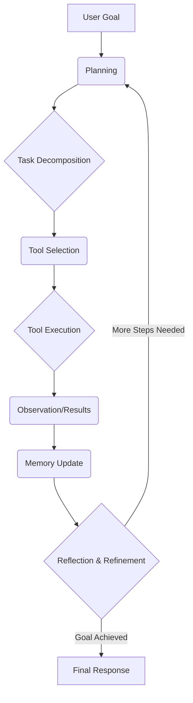

# AI Workflows vs. Agents
### Workflows vs. Agents: The AI Engineer's Dilemma

## Introduction: The AI Engineer's Core Dilemma - Workflows vs. Agents

As an AI engineer, one of the most fundamental architectural decisions you'll make is choosing between predictable, developer-defined Large Language Model (LLM) Workflows and dynamic, LLM-driven Agentic Systems. This isn't just a technical detail; it's a choice that dictates your application's complexity, cost, reliability, and scalability. Getting it wrong means building a system that's either too rigid to be useful or too chaotic to be production-ready.

The hype around AI agents often pushes us to build complex, autonomous systems before we've even asked if we need them. We see demos of agents building entire applications and get tempted to apply that same level of autonomy everywhere. But the engineering reality is often far less glamorous. Most of the time, a well-structured, deterministic workflow is not only sufficient but superior.

Understanding the spectrum between these two methodologies is critical. It’s about knowing when to impose structure and when to grant autonomy. This article will cut through the noise to give you a practical, engineering-focused guide. We will define both workflows and agents, explore their pros and cons, and look at real-world examples to understand their architecture. Ultimately, you'll see that the choice isn't binary—the future of most production-grade AI is hybrid.

## Understanding the Spectrum: From Workflows to Agents

Before we get into the weeds of when to use which, let's establish clear definitions. The distinction between a workflow and an agent isn't just a matter of complexity; it's about who is in control: the developer or the LLM.

In LLM Workflows, developer-written code predefines and orchestrates the sequence of tasks. It is a well-defined assembly line. An input comes in, and it moves through a series of fixed stations—perhaps retrieving data, calling a tool, and then passing the results to an LLM for summarization or classification. Each step is explicit, and the control flow is deterministic. The developer meticulously designs the entire process, confining the LLM's role to a specific, hardcoded step. This predictability makes workflows highly reliable and easy to debug, as the developer, not the model, defines the "what" and "when" [[2]](https://research.aimultiple.com/agentic-ai/).


**Figure 1**: An automated workflow is a predefined, rule-based process [[2]](https://research.aimultiple.com/agentic-ai/).

In Agentic Systems, on the other hand, an LLM dynamically decides the sequence of steps to achieve a goal. Instead of following a rigid script, the agent reasons about the task, plans its actions, selects tools from a given set, and iterates until it determines the goal is met. This is not an assembly line but a skilled human expert tackling an unfamiliar problem. The LLM is in the driver's seat, adapting its approach based on intermediate results and making real-time decisions. This dynamic nature allows agents to handle open-ended problems and unexpected situations that would break a fixed workflow [[1]](https://www.anthropic.com/engineering/building-effective-agents).


**Figure 2**: An agentic workflow involves dynamic decision-making [[2]](https://research.aimultiple.com/agentic-ai/).

Both approaches require an orchestration layer, but its role is fundamentally different. In a workflow, the orchestrator executes a fixed plan, ensuring each step runs in the correct order. In an agentic system, the orchestrator acts as a facilitator, providing the agent with the tools and environment it needs to execute its own dynamically generated plan. This distinction is the key to understanding the trade-offs in reliability, cost, and flexibility that we will explore next.

## Choosing Your Path: PROs and CONs

The core difference between workflows and agents comes down to developer-defined logic versus LLM-driven autonomy. This is not just a philosophical distinction; it has practical consequences for what you can build and how you can maintain it. Choosing the right path means being honest about what your use case truly requires.

Workflows are the backbone of most production AI systems today, especially in enterprise settings. They excel at repeatable operational tasks where predictability and reliability are non-negotiable. For example, consider structured data extraction, automated report generation, or content summarization. Because the steps are fixed, workflows are easier to debug, their costs are predictable, and their outputs are consistent. They typically have low latency and cost, making them the right choice for high-frequency, low-complexity scenarios and regulated environments where every step must be traceable [[3]](https://towardsdatascience.com/a-developer-s-guide-to-building-scalable-ai-workflows-vs-agents/), [[4]](https://www.lyzr.ai/blog/agentic-ai-vs-llm/).

Agents, however, excel at handling the unpredictable. They are best suited for open-ended research, dynamic problem-solving like debugging code, or complex customer support interactions where the path to resolution is not known in advance. Their strength is adaptability. This flexibility comes at a price: higher operational costs, increased latency, and greater complexity in monitoring. Agentic systems are also more prone to failure, with open-ended goals sometimes seeing high task failure rates. You lose the deterministic control that makes workflows so appealing for production systems [[3]](https://towardsdatascience.com/a-developer-s-guide-to-building-scalable-ai-workflows-vs-agents/), [[4]](https://www.lyzr.ai/blog/agentic-ai-vs-llm/).


**Figure 3**: AI Agents vs. Workflows [[3]](https://towardsdatascience.com/a-developer-s-guide-to-building-scalable-ai-workflows-vs-agents/).

In reality, most mature AI applications are not purely one or the other. They exist on a spectrum, blending both approaches into hybrid systems. As a developer, you control an "autonomy slider." At one end, you have manual control with simple LLM calls. At the other, you have a fully autonomous agent. Products like Cursor and Perplexity exemplify this, offering different modes from simple completion (low autonomy) to deep research (high autonomy) [[5]](https://www.youtube.com/watch?v=LCEmiRjPEtQ). The goal is to design a system that speeds up the generation-verification loop between the AI and the human. The best engineers know how to choose the right level of autonomy for the job.

## A Look at State-of-the-Art (SOTA) Examples (2025)

To make these concepts more concrete, let's look at some state-of-the-art (SOTA) examples from 2025. These real-world applications illustrate how we deploy workflows and agents, showing the practical use of the architectural patterns we have discussed.

For LLM workflows, document summarization is a common use case. For example, Gemini in Google Workspace processes and summarizes long email threads and documents. This is a classic workflow: it takes input data, applies a fixed summarization process, and produces a structured output [[6]](https://cloud.google.com/transform/101-real-world-generative-ai-use-cases-from-industry-leaders). We also see powerful workflow applications in data-driven decision-making, content creation, and legal automation, where companies use LLMs to analyze data, generate marketing visuals, or draft contracts with high accuracy and reduced manual effort [[6]](https://cloud.google.com/transform/101-real-world-generative-ai-use-cases-from-industry-leaders).

On the agentic side, we see more dynamic systems. Perplexity's Deep Research mode is a prime example of a research agent. It autonomously breaks down complex queries, conducts multiple web searches, synthesizes information, and compiles a comprehensive report with citations. This is an agent because the LLM, not the developer, plans and executes the multi-step research process [[7]](https://www.perplexity.ai/hub/blog/introducing-perplexity-deep-research). In the developer space, coding assistants like Google's Gemini Command Line Interface (CLI) function as agents. They understand a high-level task, read files, write or modify code, and debug errors in a loop until the task is complete [[8]](https://www.helpnetsecurity.com/2025/06/26/google-gemini-cli-open-source-ai-agents/).

Finally, task automation agents like OpenAI's Operator interact with graphical user interfaces (GUIs) on a computer. Operator can "see" the screen and "use" a mouse and keyboard to perform tasks like filling out forms. This demonstrates a high degree of autonomy in a complex environment [[9]](https://openai.com/index/introducing-operator/). These examples highlight the core distinction: workflows excel at structured, repeatable processes, while agents are designed for open-ended, dynamic tasks.

## Zooming In: How SOTA Systems Blend Workflows and Agents

While some applications are pure workflows or agents, many of the most powerful systems are hybrids. We will deconstruct some examples from the previous section to see how they combine these patterns.

### Document Summarization in Google Workspace (Pure Workflow)
A feature like summarizing a document in Google Workspace is a classic, pure workflow. The process is linear and predictable: the user selects a document, the system extracts the text, passes it to an LLM with a summarization prompt, and displays the result. There is no dynamic decision-making by the LLM about *how* to perform the task; it simply executes a predefined function.
```mermaid
graph TD
    A[User selects "Summarize Document"] --> B{Extract Text from Document};
    B --> C[Pass Text to LLM with Summarization Prompt];
    C --> D[LLM Generates Summary];
    D --> E[Display Summary to User];
```

### Gemini CLI Coding Assistant (Hybrid)
Google's Gemini CLI is a hybrid system that leans heavily toward being an agent. It serves as an open-source, local AI assistant for complex developer workflows, built upon the Gemini 1.5 Pro model [[8]](https://www.helpnetsecurity.com/2025/06/26/google-gemini-cli-open-source-ai-agents/), [[10]](https://blog.google/technology/developers/introducing-gemini-cli-open-source-ai-agent/). While it operates within a developer's terminal, its core loop is agentic. It takes a high-level goal and dynamically plans and executes a series of steps, which typically involves planning, tool use (interacting with the file system and code interpreters), and an iterative refinement loop to self-correct based on errors or test failures [[8]](https://www.helpnetsecurity.com/2025/06/26/google-gemini-cli-open-source-ai-agents/), [[10]](https://blog.google/technology/developers/introducing-gemini-cli-open-source-ai-agent/). The system's extensibility is enhanced through the Model Context Protocol (MCP), allowing for custom behaviors [[8]](https://www.helpnetsecurity.com/2025/06/26/google-gemini-cli-open-source-ai-agents/).
```mermaid
graph TD
    A[User Prompt: "Refactor function X"] --> B{Plan: Decompose Task};
    B --> C{Tool: Read File};
    C --> D{Tool: Analyze Code};
    D --> E{Tool: Write/Modify Code};
    E --> F{Tool: Run Tests};
    F -- Tests Pass --> G[Show Diff to User];
    F -- Tests Fail --> H{Reflection: Analyze Error};
    H --> B;
```

### Perplexity Deep Research (Hybrid)
Perplexity's Deep Research feature is another powerful hybrid. It automates an exploratory task by deconstructing a user's query, formulating a search strategy, and executing iterative web searches where the results from one search inform the next [[7]](https://www.perplexity.ai/hub/blog/introducing-perplexity-deep-research/), [[11]](https://arxiv.org/html/2506.18959v2). After gathering information, the agent synthesizes the findings and compiles a structured, well-cited report. While the final output is structured (a workflow element), the process to get there is dynamic and LLM-driven, often completing expert-level research in under three minutes [[7]](https://www.perplexity.ai/hub/blog/introducing-perplexity-deep-research/), [[12]](https://www.helicone.ai/blog/openai-deep-research).
```mermaid
graph TD
    A[User Prompt: "Research topic Y"] --> B{Plan: Formulate Research Questions};
    B --> C{Tool: Web Search};
    C --> D{Analyze Search Results};
    D -- More Info Needed --> C;
    D -- Sufficient Info --> E{Synthesize Findings};
    E --> F[Generate Cited Report];
```

### OpenAI's Operator (Pure Agent)
OpenAI's Operator is a "computer-using agent" that interacts with GUIs by "seeing" the screen and "acting" with the mouse and keyboard. Its mechanism is almost entirely agentic: it perceives its environment, plans a sequence of actions to achieve a user's goal, and executes them. Powered by a model trained for GUI interaction, Operator can self-correct when it makes mistakes or hand control back to the user if it gets stuck. This makes it a clear example of an autonomous agent designed for unpredictable environments [[9]](https://openai.com/index/introducing-operator/).
```mermaid
graph TD
    A[Perceive Environment (Screenshots)] --> B{Plan Actions (Clicks, Typing)};
    B --> C[Execute Actions];
    C --> D{Observe Results};
    D -- Goal Achieved --> E[Task Complete];
    D -- Error/Stuck --> F{Self-Correct or Hand Control to User};
    F --> B;
```

## Designing Agents: Common Patterns and Challenges

As we have seen, agents are powerful but complex. Building a reliable agentic system requires designing a cognitive architecture that allows the agent to reason and act effectively. A few common architectural patterns have emerged as foundational: Planning, Tool Use, Memory, and Reflection loops.

Planning is the agent's ability to break down a high-level goal into a sequence of smaller, manageable sub-tasks, creating a roadmap that can be revised as needed [[2]](https://research.aimultiple.com/agentic-ai/). Tool Use allows the agent to interact with the outside world via APIs, databases, or code interpreters, enabling it to act beyond its internal knowledge [[13]](https://mlnotes.substack.com/p/4-agentic-design-patterns-and-4-key/). Agents also need Memory—both short-term for current context and long-term for future use—to learn from past interactions [[14]](https://arxiv.org/html/2505.12786v2). Finally, Reflection is an iterative loop where the agent assesses its own work, identifies errors, and refines its approach, which is crucial for tackling complex problems [[15]](https://www.deeplearning.ai/the-batch/agentic-design-patterns-part-2-reflection/).

These components work together in a cyclical process, often referred to as a reason-act loop.


Despite the power of this architecture, building robust agents comes with significant challenges. Reliability is a major concern; since agents make decisions at each step, errors can compound, making debugging far more difficult than with predictable workflows [[16]](https://openreview.net/pdf?id=kFrqoVtMIy). Managing long-term context is another hurdle, as agents can "forget" crucial information. Scalability and cost are also major considerations, as agentic loops can consume significant compute resources [[4]](https://www.lyzr.ai/blog/agentic-ai-vs-llm/). Finally, security is a critical risk. Giving an autonomous agent access to powerful tools creates a massive security risk that could lead to data breaches or system compromises if not properly managed [[17]](https://arxiv.org/html/2505.13076v1).

## Conclusion: The Hybrid Future of AI Applications

The debate between LLM Workflows and Agentic Systems isn't about picking a winner; it's about understanding the right tool for the right job. You've seen that workflows offer predictability, reliability, and cost-effectiveness, making them ideal for structured, repeatable tasks. Agents, in contrast, provide the flexibility and autonomy needed to tackle complex, unpredictable problems.

The key takeaway is clear: this isn't a binary choice. The most effective and production-ready AI applications often live on a spectrum, blending the stability of workflows with the dynamic reasoning of agents. This hybrid approach allows you to build systems that are both powerful and resilient, leveraging predefined paths for the 80% of tasks that are predictable, while reserving agentic autonomy for the 20% that truly require it.

For you, as an AI engineer, mastering these architectural patterns is becoming a fundamental skill. It's about moving beyond the hype and making pragmatic decisions based on the real-world needs of your application. It requires understanding the trade-offs between control and flexibility, and knowing how to build systems that can be monitored, debugged, and scaled safely. The future of AI isn't just about building smarter models; it's about building smarter systems around them.

## References

- [1] [Building effective agents](https://www.anthropic.com/engineering/building-effective-agents)
- [2] [4 Agentic AI Design Patterns & Real-World Examples [2025]](https://research.aimultiple.com/agentic-ai/)
- [3] [A Developer’s Guide to Building Scalable AI: Workflows vs Agents](https://towardsdatascience.com/a-developer-s-guide-to-building-scalable-ai-workflows-vs-agents/)
- [4] [Agentic AI vs LLM: Comparing What Scales Better in Task Runners](https://www.lyzr.ai/blog/agentic-ai-vs-llm/)
- [5] [Andrej Karpathy: Software Is Changing (Again)](https://www.youtube.com/watch?v=LCEmiRjPEtQ)
- [6] [601 real-world gen AI use cases from the world's leading organizations](https://cloud.google.com/transform/101-real-world-generative-ai-use-cases-from-industry-leaders)
- [7] [Introducing Perplexity Deep Research](https://www.perplexity.ai/hub/blog/introducing-perplexity-deep-research)
- [8] [Gemini CLI: your open-source AI agent](https://www.helpnetsecurity.com/2025/06/26/google-gemini-cli-open-source-ai-agents/)
- [9] [Introducing Operator](https://openai.com/index/introducing-operator/)
- [10] [Introducing Gemini CLI, an open-source, local AI agent for developers](https://blog.google/technology/developers/introducing-gemini-cli-open-source-ai-agent/)
- [11] [From Web Search towards Agentic Deep Research: Incentivizing Search with Reasoning Agents](https://arxiv.org/html/2506.18959v2)
- [12] [Perplexity AI Deep Research: An In-Depth Analysis](https://www.helicone.ai/blog/openai-deep-research)
- [13] [4 Agentic Design Patterns and 4 Key Components of AI Agents](https://mlnotes.substack.com/p/4-agentic-design-patterns-and-4-key/)
- [14] [Survey on Large Language Model-based Autonomous Agents for Cybersecurity](https://arxiv.org/html/2505.12786v2)
- [15] [Agentic Design Patterns, Part 2: Reflection](https://www.deeplearning.ai/the-batch/agentic-design-patterns-part-2-reflection/)
- [16] [A Tale of Two Planners: A Comparative Study of LLM-modulo and Agentic Approaches for Task Planning](https://openreview.net/pdf?id=kFrqoVtMIy)
- [17] [Agentic Security: Towards a Principled Framework for Securing AI Agents](https://arxiv.org/html/2505.13076v1)