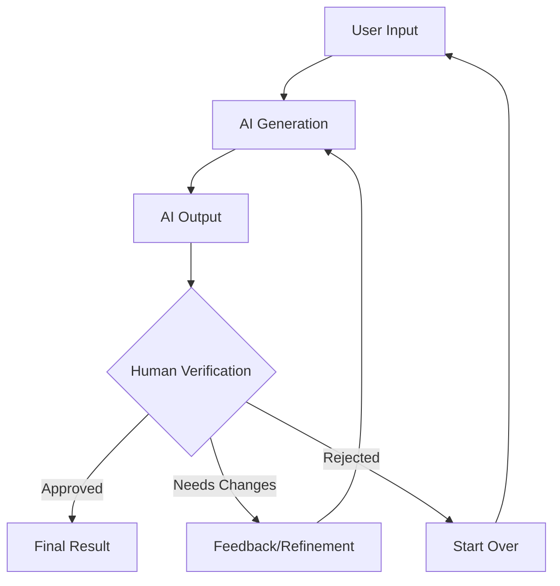
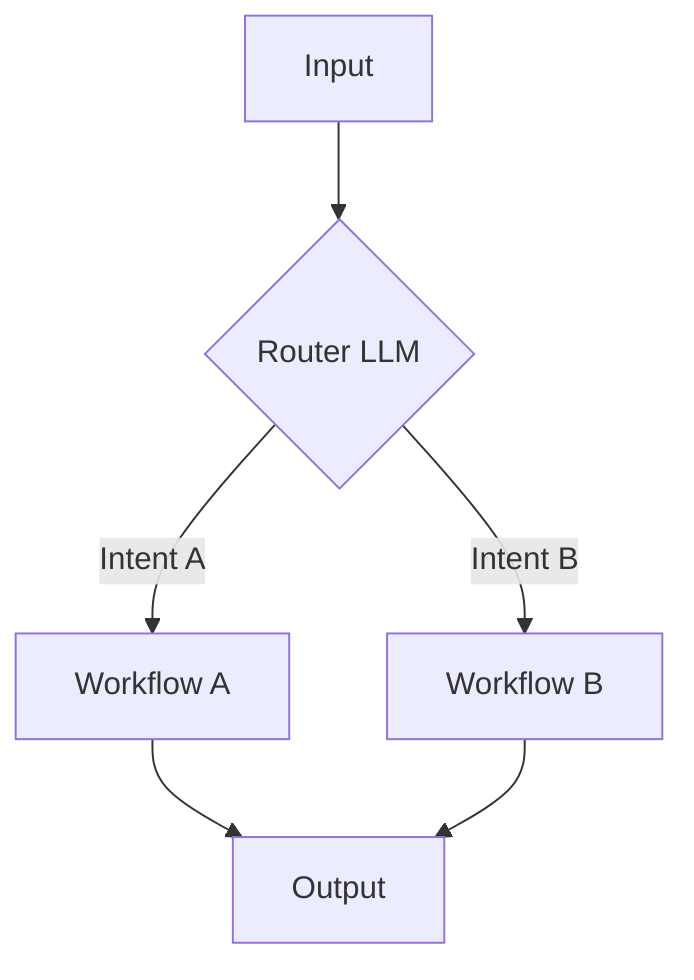
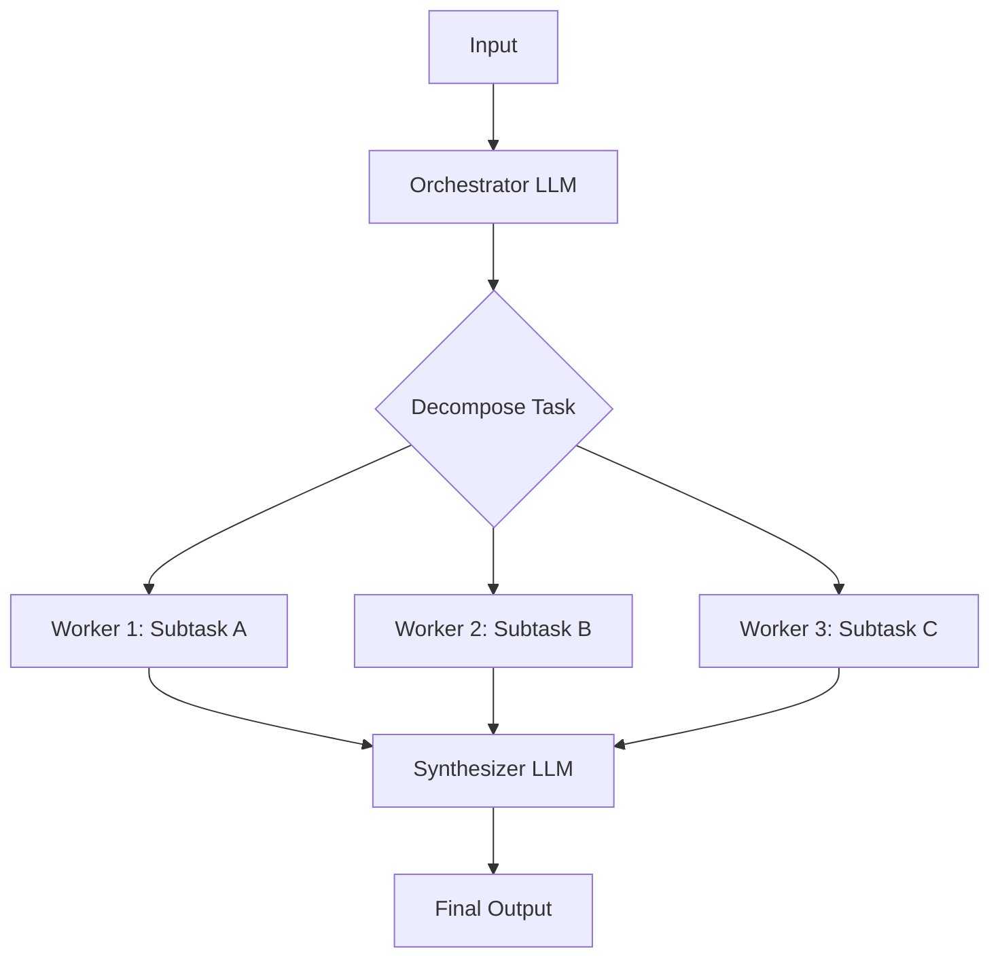
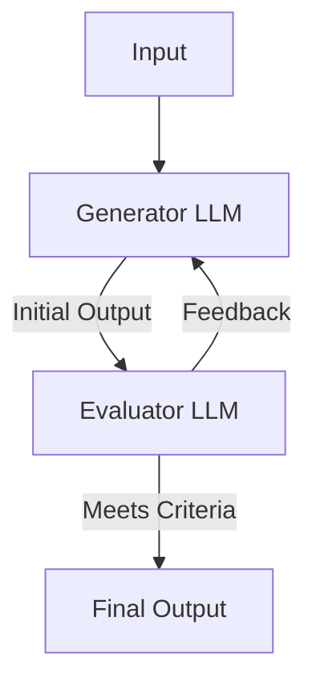
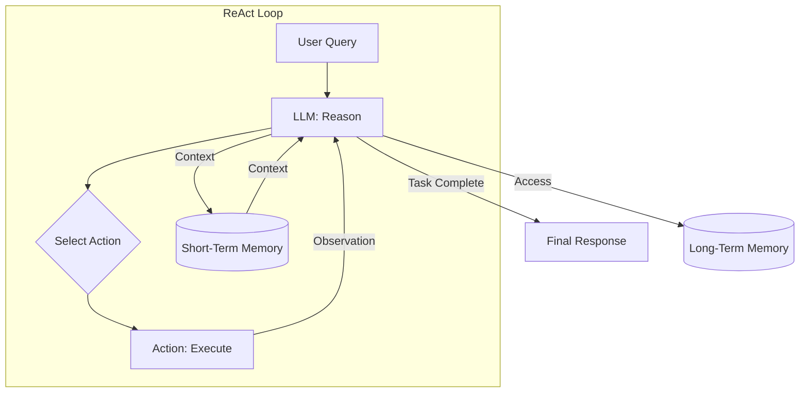
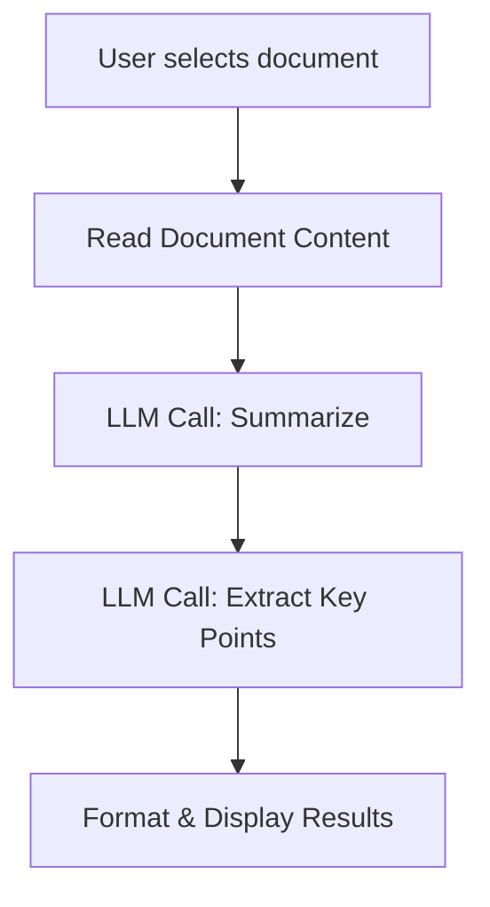
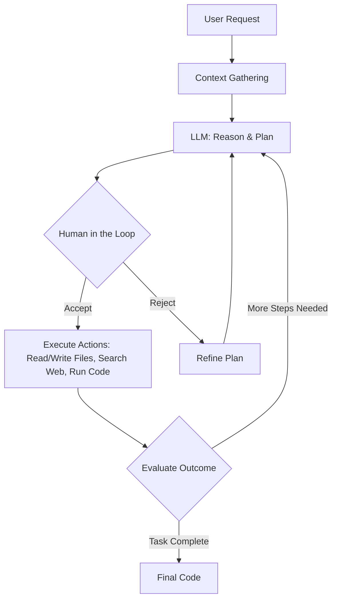
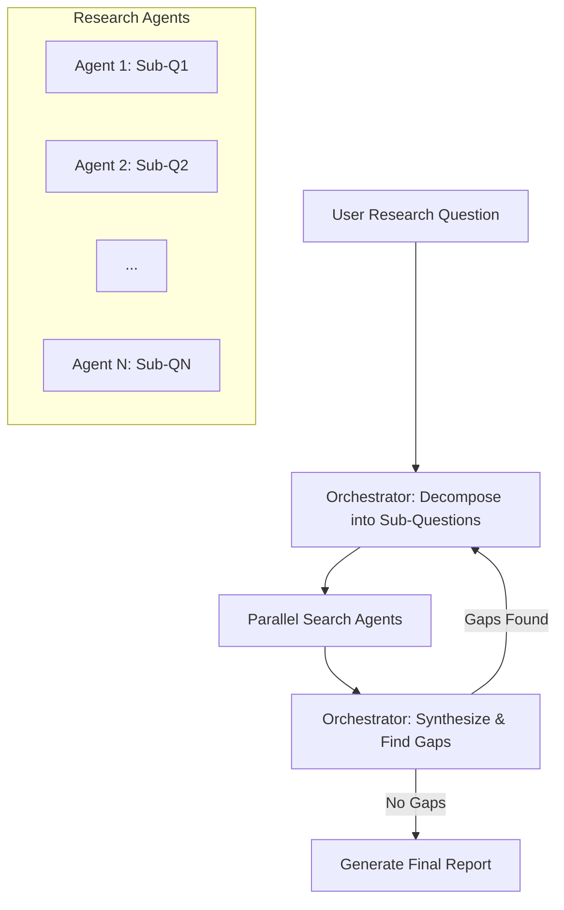

# AI Workflows vs. Agents: Choose Wisely
### Workflows vs. Agents: The AI Engineer's Dilemma

## Introduction

As an AI engineer preparing to build your first real AI application, after narrowing down the problem you want to solve, you face a critical decision: How should you design your AI solution? This architectural choice, made early in development, determines whether your AI application follows a predictable, step-by-step workflow or demands a more autonomous approach where the LLM makes self-directed decisions. This fundamental question impacts development time, cost, reliability, and user experience, ultimately determining your project's success or failure. Choosing the wrong path can lead to an overly rigid system that breaks when users deviate from expected patterns or an unpredictable agent that fails when it matters most and is too expensive to run.

This is one core decision every AI engineer has to make. For example, In 2024 and 2025, the success of billion-dollar AI startups often depends on this decision. Companies like Glean and Anysphere (the AI research lab behind the AI coding tool Cursor), which have raised hundreds of millions, built their success on knowing when to use workflow-centric architectures that deliver consistent results in the enterprise versus more flexible AI agents that can navigate unpredictable territories [[1]](https://techcrunch.com/2025/06/18/here-are-the-24-us-ai-startups-that-have-raised-100m-or-more-in-2025/).

This lesson provides a framework for making this decision. We will cover the spectrum from workflows to agents, explain the trade-offs, and show you how to design systems using real-world examples from leading AI companies.

## Understanding the Spectrum: From Workflows to Agents

As highlighted in the introduction, when you start building an AI application, one of the first architectural decisions you face involves understanding the core differences between LLM workflows and AI agents. While these terms often get used interchangeably, they represent distinct approaches to designing AI systems. We will not focus on deep technical specifics yet, but rather on their fundamental properties and how they are typically used.

LLM workflows are systems where developers largely predefine and orchestrate a sequence of tasks. These tasks involve calls to an LLM or other operations such as reading/writing data to a database or file system. The key idea is that the overall flow remains fixed. For example, a factory assembly line is a good way to think about it: each stop performs a specific, repeatable task in a set order. Every step is explicitly coded by the developer, ensuring a clear and controlled process from start to finish.

This results in a predictable AI product which is essential for applications requiring consistent output and clear error handling. In future sections, we will explore common workflow patterns like chaining, routing, and orchestrator-worker models that help you build these reliable systems.

Figure 1: A simple LLM workflow follows a predefined, developer-controlled path to execute a given task - Source [[12]](https://www.anthropic.com/research/building-effective-agents)

AI agents, on the other hand, are systems where an LLM plays a central role in dynamically deciding the sequence of steps, reasoning, and actions required to achieve a goal. The path is not fixed in advance. Instead, the agent plans its actions based on the task and its environment, making decisions on the fly as it progresses. This dynamic decision-making allows for greater flexibility.

This is less like an assembly line and more like a skilled human expert tackling an unfamiliar problem, adapting their approach with each new piece of information. These systems are more flexible and handle novelty, allowing them to navigate complex and ambiguous situations. However, this autonomy reduces predictability, making their behavior harder to foresee. We will later see how agents use actions, memory, and reasoning patterns like ReAct to achieve their goals.

Figure 2: Autonomous agents taking actions into an external environment and adapting based on feedback from it - Source [[12]](https://www.anthropic.com/research/building-effective-agents)

Both architectures require an orchestration layer, but its function differs significantly. In a workflow, the orchestrator executes a fixed, predefined plan, ensuring tasks run in a specific order. In an agent, the orchestrator is a dynamic planning and action loop, controlled by an LLM, which allows the agent to adapt its strategy as needed. Understanding this difference helps you build effective AI solutions.

## Choosing Your Path

The core difference between these two approaches comes down to a trade-off between developer-defined logic and LLM-driven autonomy. Your choice will depend entirely on the nature of the problem you are solving.

LLM workflows work best for well-defined, structured tasks where the desired outcome is predictable. These include use cases like pipelines for data extraction and transformation from sources such as the web, messaging tools like Slack, video calls from Zoom, project management tools like Notion, and cloud storage tools like Google Drive. Out of this, you can automate report or emails generation. Also, you can take this even further, and automatically understand the requirements of a given project and create or update tasks in your Notion project management tools.

Other applications include document summarization followed by translation, repetitive daily tasks like sending emails or posting social media updates, and content generation or repurposing, such as transforming articles into social media posts. 

Their primary strength is reliability. Because the path is fixed, they are easier to debug, their costs and latency are more predictable, and their outputs are consistent [[3]](https://www.lyzr.ai/blog/agentic-ai-vs-llm/), [[4]](https://www.louisbouchard.ai/agents-vs-workflows/). All key factors for enterprise-level applications. Additionally, you can build workflows with lower operational costs as you can leverage simpler and smaller models specialized in given sub-tasks, which require smaller infrastructure overhead.

Enterprises prefer workflows, especially in regulated industries like finance and healthcare, where a mistake can have serious consequences. For example, when a financial advisor asks for a financial report, it should contain the right information every time, as it directly impacts people's money and life. In the health space, AI tools used in production require high accuracy consistently, as they directly impact people's lives. 

On the other side of the spectrum, when building Minimum Viable Products (MVPs) that require rapid deployment, workflows allow you to quickly hardcode a few critical paths required to get your product to the market.

Workflows are also ideal for scenarios where cost per request matters more than sophisticated reasoning. If you need to handle thousands of requests per minute at predictable costs and latency, a structured workflow is often better. 

The main weaknesses of workflows are rigidity and development time. Since you manually engineer every step, the system cannot handle unexpected scenarios, and adding new features can be as complex as in traditional software development.

AI agents are a better choice for open-ended problems that require adaptability and dynamic problem-solving. For example, popular use cases are doing deep research on a novel topic, such as the history of World War II, debugging a complex codebase, providing interactive customer support for non-standard issues, or even booking a flight without specifying the exact websites to use. The agent's strength lies in its flexibility to handle ambiguity by dynamically planning its steps based on what happens in the environment.

However, this comes with clear weaknesses. Agents are less reliable, and their non-deterministic nature means performance, latency, and costs vary with each run [[5]](https://blog.gopenai.com/agentic-workflows-vs-autonomous-ai-agents-do-you-know-the-difference-c21c9bfb20ac). They often require more powerful and more expensive LLMs to perform tasks effectively. They also introduce security risks, especially with write permissions where they can accidently send innapropiate emails, delete database records or even your entire codebase. A common joke among engineers is about agents deleting code, with comments like, "Anyway, I wanted to start a new project." Last one of the most challenging aspects of deploying AI agents is to debug and evaluate them. Their randomness makes this extremely complicated. As this is a huge topic in it self, we will cover it in details in future lessons. [[6]](https://ardor.cloud/blog/common-ai-agent-deployment-issues-and-solutions/), [[7]](https://www.strata.io/blog/agentic-identity/hidden-identity-challenges-ai-agents-hybrid-environment-1a/)

Figure 3: A fundamental trade-off exists between an agent's autonomous control and the system's overall reliability [[2]](https://decodingml.substack.com/p/llmops-for-production-agentic-rag).

In reality, most production systems are not purely one or the other. They exist on a spectrum, blending the stability of workflows with the flexibility of agents. When you build an application, you are effectively setting an "autonomy slider," deciding how much control to give the LLM versus the user.

Figure 4: The AI generation and human verification loop, showing how AI outputs are validated and refined through human feedback.

For instance, the AI code editor **Cursor** offers different levels of autonomy: simple tab-completion (low autonomy), refactoring a selected block of code with `Cmd+K` (medium autonomy), or letting the AI modify the entire repository with `Cmd+I` (high autonomy) [[8]](https://www.youtube.com/watch?v=LCEmiRjPEtQ). Similarly, **Perplexity** offers a quick "search" (a simple workflow), a more involved "research" mode, and a "deep research" function that deploys a complex agentic system [[8]](https://www.youtube.com/watch?v=LCEmiRjPEtQ). As you can see, for most applications, the goal is to create a fast, effective loop between AI generation and human verification, which you often achieve through a thoughtful combination of architecture and user interface design.

## Exploring Common Patterns

To give you a better intuition for how these AI systems are built, let's briefly look at some of the most common patterns for both workflows and agents. This is only a high-level preview, as we will dive deep into each of these patterns in future lessons.

### LLM Workflow Patterns
We will look over the three most common LLM workflow patterns used across the industry.

**Chaining and Routing** is the simplest pattern. You use chaining to glue together multiple LLM calls sequentially, where the output of one step becomes the input for the next. This helps break down complex tasks into smaller, manageable subtasks. Routing, on the other hand, allows you to choose between different predefined paths. A router, often an LLM itself, acts as a decision-maker, guiding the workflow between multiple decisions and directing the input to the most appropriate specialized model or sub-workflow based on the user's intent. This pattern is useful for branching requests across various tasks like search, summarization, or calculations [[9]](https://www.revanthquicklearn.com/post/understanding-workflow-design-patterns-in-ai-systems), [[10]](https://www.philschmid.de/agentic-pattern), [[11]](https://docs.aws.amazon.com/prescriptive-guidance/latest/agentic-ai-patterns/workflow-for-routing.html).

Figure 5: A routing workflow, where an initial LLM directs the task to a specialized path.

The **Orchestrator-Worker** pattern introduces a way to dynamically plan and execute multiple actions. A central "orchestrator" LLM analyzes a complex task, breaks it down into subtasks, and delegates them to specialized workers, which can be other LLMs or classic code. Ultimately, the orchestrator synthesizes the results into a final answer [[12]](https://www.anthropic.com/research/building-effective-agents). This pattern is well-suited for complex tasks where you cannot predict the exact subtasks needed in advance, such as making changes across multiple files in a coding project or generating multiple images for a blog post. It provides a smooth transition from rigid workflows to more adaptive, agent-like behavior. Still, it's not an agentic pattern, because there is a clear path between the input and output, as the logic always ends at the final output.

Figure 6: The orchestrator-worker pattern, where a main LLM delegates subtasks to specialized workers.

The last workflow pattern we want to present is the **Evaluator-Optimizer Loop** which is used to iteratively improve an LLM's output quality. After an initial response is generated, an "evaluator" LLM assesses it against predefined criteria and provides feedback. This feedback then goes back to the "optimizer" (often the original generator) to refine the response. This loop continues until the output meets the quality standard or reaches a set number of iterations [[13]](https://javaaidev.com/docs/agentic-patterns/patterns/evaluator-optimizer/). This pattern is particularly effective when you have clear evaluation criteria and when iterative refinement provides measurable value, similar to how a human writer might refine a document based on feedback [[12]](https://www.anthropic.com/research/building-effective-agents).

Figure 7: The evaluator-optimizer loop, which uses feedback to iteratively refine an LLM's output.

### Core Components of a ReAct AI Agent
While workflows provide structured, predictable paths for AI applications, agents introduce a different paradigm: dynamic, autonomous decision-making. Let's now explore the core components that enable this agentic behavior.

Nearly all modern agents build on a foundational pattern that enables them to reason and take action in a loop. This is the core of the **ReAct (Reason and Act)** pattern, which we will explore in detail in Lessons 7 and 8. For now, we want to provide a quick intuition on how it works. 

In ReAct, the agent automatically decides what action(s) to take, interprets the result of that action, and repeats the cycle until the task is complete. 

A ReAct agent has a few key components:
*   **A Reasoning LLM**: This is the "brain" of the agent. It analyzes the task, reasons about the next steps, and interprets the outputs from its actions.
*   **Actions**: These are the "hands" of the agent, allowing it to perform operations in an external environment, like searching the web, reading a file, or running code. These are usually knowns as tools which we will cover in Lesson 6.
*   **Short-Term Memory**: This is the agent's working memory, comparable to RAM in a computer. It holds the context of the current task, which is passed to the LLM, including components such as the conversation history and recent actions.
*   **Long-Term Memory**: This provides the agent with access to factual knowledge, such as information from the internet or private company databases. Also, it is often used to help the agent remember user preferences over time. You will learn more on memory in Lesson 9.

Figure 8: A high-level view of the ReAct agent loop, where the LLM reasons, selects an action, executes it, and observes the result.

This is just a brief introduction to these powerful patterns. The goal here is not to understand them fully but to build an intuition for the different ways you can architect AI systems.

## Zooming In on Our Favorite Examples

To help you understand these ideas, let's look at how they appear in real-world applications. We will start with a simple workflow, then move to a single-agent system built on top of ReAct, and finally, explore a complex hybrid solution.

### Simple Workflow: Google Workspace Document Summarization
**The Problem:** In any team setting, finding the right information can take a lot of time. Documents are often long, making it hard to quickly see if they contain what you need. A built-in summarization tool can help guide your search.

**The Solution:** The summarization feature in Google Workspace is a clear example of a simple, step-by-step LLM workflow [[14]](https://www.cnet.com/tech/services-and-software/how-to-summarize-text-using-googles-ai-tool/), [[15]](https://workspace.google.com/blog/product-announcements/may-workspace-feature-drop-new-ai-features). It does not need complex thinking or dynamic planning. Instead, it follows a set order of steps managed by the application.

Figure 9: A simple workflow for document summarization in Google Workspace.

A typical workflow works like this:
1.  You select a document or highlight text.
2.  The application reads the chosen content.
3.  An LLM call is made to summarize the text.
4.  Another LLM call might pull out key points or action items.
5.  The results are put into a clear format and shown to you.

This is a pure workflow because each step is set beforehand and runs in order.

### Single Agent System: Gemini CLI Coding Assistant
**The Problem:** Writing code is a slow process that often means switching between reading guides, searching for answers, and understanding existing code. An AI coding assistant can make this process faster.

**The Solution:** The **Gemini CLI**, an open-source coding assistant from Google, is a perfect example of how a single-agent based on ReAct works[[16]](https://cloud.google.com/gemini/docs/codeassist/gemini-cli), [[17]](https://blog.google/technology/developers/introducing-gemini-cli-open-source-ai-agent/). The agents core features are writing new code, updating existing code, creating documentation, or quickly understanding a new project.

Here is a simplified step-by-step guide on how it works:
1.  **Context Gathering:** The system loads the folder structure of the codebase, available actions, and the conversation history into its working memory.
2.  **LLM Reasoning:** The Gemini model looks at your input and the current working memory to figure out what actions it needs to take to change the code as you asked.
3.  **Human in the Loop:** Before it takes any actions, it checks the plan with you.
4.  **Action Execution:** If you accept, the chosen actions are performed. These can be file operations to read the current code, web requests to get information, and finally generating the code. The agent processes the action outputs and adds the results to the short-term memory for later use.
5.  **Evaluation:** The agent checks if the generated code is correct by running or compiling it.
6.  **Loop Decision:** Based on the results, the agent decides if the task is finished or if it needs another round of thinking and action.

Figure 10: The operational loop of the Gemini CLI, a single-agent coding assistant.

More action examples include:
*   File system access: Using functions like `grep` to read specific parts of the codebase, or listing the folder structure of the code.
*   Coding: Interpreting code, showing code changes, and running the generated code to check it.
*   Web search: Finding documentation, articles, or solutions online.
*   Version control: Using tools like Git to automatically save your code to platforms like GitHub or GitLab.

### Hybrid System: Perplexity's Deep Research Agent
**The Problem:** Conducting in-depth research on a new or complex topic can be challenging and time-consuming. We often lack the time to read numerous resources, and it's unclear where to start, which sources are trustworthy, and how to combine a lot of information into a clear report.

**The Solution:** Perplexity's Deep Research feature is the perfect use case to understand how hybrid system work.
It combines the orchestrator-worker pattern with ReAct agents to do autonomous research on a given topic [[18]](https://arxiv.org/html/2506.18096v1), [[19]](https://www.perplexity.ai/hub/blog/introducing-perplexity-deep-research). Unlike single-agent systems, like the Gemini CLI, this system uses many specialized agents to research sub-topics in parallel.

The exact way it works is not public, so we make assumptions about its design based on available information, but here is a simplified view of how it likely works:
1.  **Research Planning & Decomposition:** A core orchestrator looks at the main research question (for example, "What is the impact of AI on the job market?") and breaks it into smaller, focused sub-questions. The orchestrator uses the orchestrator-worker pattern we introduced earlier to send these sub-questions to many research agents.
2.  **Parallel Information Gathering:** For each sub-question, specialized search agents run at the same time to find the right information. These agents use actions like web searches and document retrieval to gather as much information as possible for their specific question. Because these research agents work separately, the amount of input information for each LLM is smaller, helping the LLM stay focused on their task.
3.  **Analysis & Synthesis:** After gathering many sources, each agent checks and scores each source. They use strategies like checking how trustworthy the source is or how well it matches the question. Then, each source is ranked by importance. Finally, the best sources are summarized into a report.
4.  **Iterative Refinement & Gap Analysis:** The orchestrator collects the reports from all the search agents and looks for any missing information. If there are gaps, it creates new questions by repeating steps 1, 2 and 3. This continues until all missing information is found or a maximum number of steps is reached to avoid endless loops.
5.  **Report Generation:** The orchestrator takes all the results from the AI agents and creates a final report with citations.

Figure 11: The iterative, multi-agent process used by Perplexity's Deep Research agent.

To conclude, this system is a hybrid because it uses a master orchestrator to interpret the user request, divide it into smaller units of work, and delegate them to multiple agents. The workflow uses the orchestrator-worker pattern to supervise and call many specialized ReAct agents that run in parallel on their specialized tasks. Like this, it can easily perform hundreds of searches to create full research reports in 2-4 minutes instead of hours.

## The Challenges of Every AI Engineer

Now that you understand the spectrum from LLM workflows to AI agents, it is clear that every AI engineer, whether at a startup or a Fortune 500 company, faces these fundamental challenges daily. This architectural decision is a core factor determining whether an AI application succeeds in production or fails.

AI engineers constantly deal with several issues. Reliability is a major concern. An agent might work perfectly in a demo but become unpredictable with real users. Reasoning failures can compound through multi-step processes, leading to unexpected and costly outcomes.

You also constantly battle context limits. Systems struggle to maintain coherence across long conversations, gradually losing track of their purpose. Ensuring consistent output quality across different agent specializations, like coding assistance or research, presents a continuous and complex challenge.

Integrating data from various sources often proves difficult. You pull information from Slack, web APIs, SQL databases, and data lakes. Yet, your system struggles to process this multimodal information coherently, impacting overall performance.

The cost-performance trap is another hurdle. A sophisticated agent might deliver impressive results but cost a fortune per user interaction. This makes it economically unfeasible for many applications, demanding careful resource management.

Finally, security is a constant worry. Autonomous agents with powerful write permissions could send the wrong email, delete critical files, or expose sensitive data. This demands careful design and robust safeguards to prevent unintended actions.

These challenges are solvable, and this course is designed to address them. In upcoming lessons, we will cover patterns for building reliable systems, strategies for managing context, and approaches for handling multimodal data. We will also explore context engineering, memory systems, structured outputs, and robust evaluation techniques.

Your path forward as an AI engineer involves mastering these realities. By the end of this course, you will have the knowledge to architect AI systems that are not only powerful but also robust, efficient, and safe. You will know when to use a workflow, when to deploy an agent, and how to build effective hybrid systems that work in the real world.

## References

- [1] [Here are the 24 US AI startups that have raised $100M or more in 2025](https://techcrunch.com/2025/06/18/here-are-the-24-us-ai-startups-that-have-raised-100m-or-more-in-2025/)
- [2] [LLMOps for Production: Build a Production-Ready Agentic RAG with LLMOps at its Core](https://decodingml.substack.com/p/llmops-for-production-agentic-rag)
- [3] [Agentic AI vs LLM Task Runner: What's the Difference?](https://www.lyzr.ai/blog/agentic-ai-vs-llm/)
- [4] [The difference between AI Agents and Workflows](https://www.louisbouchard.ai/agents-vs-workflows/)
- [5] [Agentic Workflows vs. Autonomous AI Agents, Do You Know the Difference?](https://blog.gopenai.com/agentic-workflows-vs-autonomous-ai-agents-do-you-know-the-difference-c21c9bfb20ac)
- [6] [Common AI Agent Deployment Issues and Solutions](https://ardor.cloud/blog/common-ai-agent-deployment-issues-and-solutions)
- [7] [The Hidden Identity Challenges of AI Agents in a Hybrid World](https://www.strata.io/blog/agentic-identity/hidden-identity-challenges-ai-agents-hybrid-environment-1a/)
- [8] [Andrej Karpathy: Software in the Era of AI](https://www.youtube.com/watch?v=LCEmiRjPEtQ)
- [9] [Understanding Workflow Design Patterns in AI Systems](https://www.revanthquicklearn.com/post/understanding-workflow-design-patterns-in-ai-systems)
- [10] [Agentic AI Patterns & Systems with LLMs](https://www.philschmid.de/agentic-pattern)
- [11] [Agentic AI patterns: Workflow for routing](https://docs.aws.amazon.com/prescriptive-guidance/latest/agentic-ai-patterns/workflow-for-routing.html)
- [12] [Building effective agents](https://www.anthropic.com/research/building-effective-agents)
- [13] [Agentic Design Patterns: Evaluator-Optimizer](https://javaaidev.com/docs/agentic-patterns/patterns/evaluator-optimizer/)
- [14] [How to Summarize Text Using Google's Gemini AI](https://www.cnet.com/tech/services-and-software/how-to-summarize-text-using-googles-ai-tool/)
- [15] [New AI features in Google Workspace to help you save time](https://workspace.google.com/blog/product-announcements/may-workspace-feature-drop-new-ai-features)
- [16] [Gemini CLI Documentation](https://cloud.google.com/gemini/docs/codeassist/gemini-cli)
- [17] [Introducing Gemini CLI: Your open-source AI agent](https://blog.google/technology/developers/introducing-gemini-cli-open-source-ai-agent/)
- [18] [Deep Research: A new class of retrieval-augmented generation agents](https://arxiv.org/html/2506.18096v1)
- [19] [Introducing Perplexity Deep Research](https://www.perplexity.ai/hub/blog/introducing-perplexity-deep-research)
- [20] [ChatGPT agents explained: The next step in AI evolution](https://www.techtarget.com/whatis/feature/ChatGPT-agents-explained)