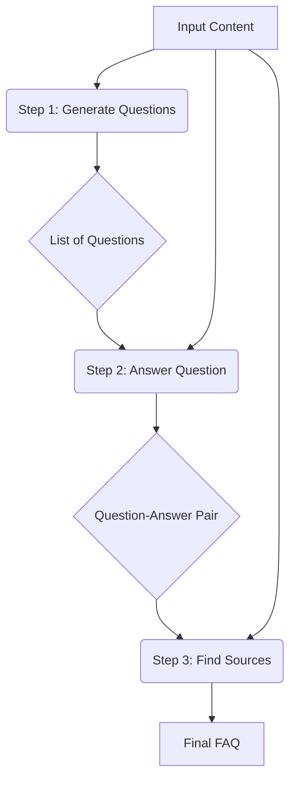
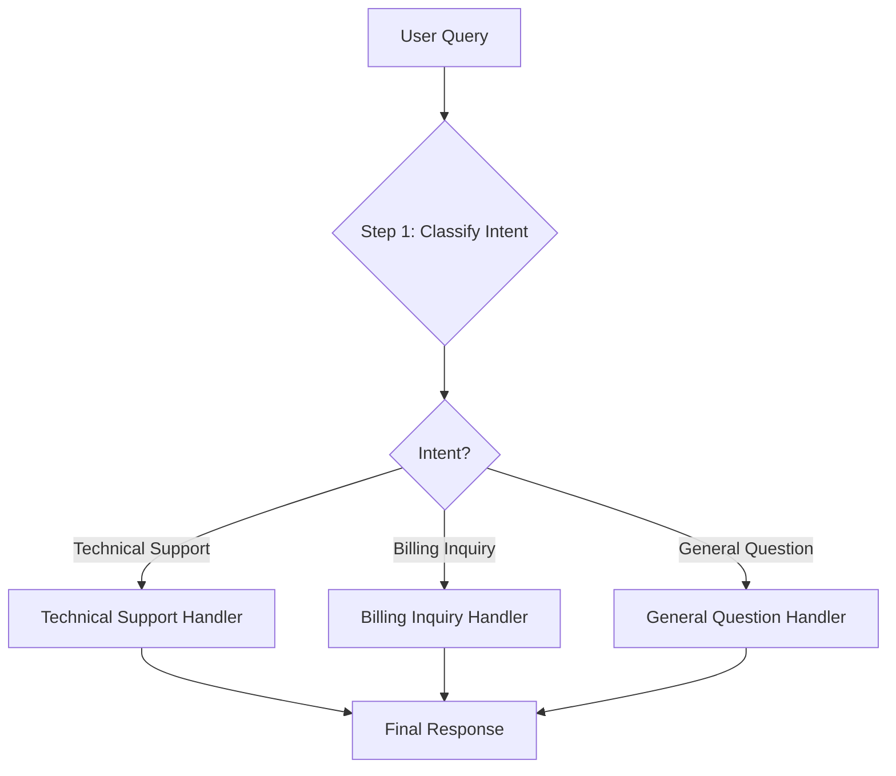

# LLM Workflow Patterns for AI Agents
### Beyond single prompts: Chain, route, and orchestrate LLMs

## Stop Giving LLMs a Single Complex Task. Do This Instead.

If you are building any kind of complex application with Large Language Models (LLMs), you have probably been tempted to stuff all your logic into a single, massive prompt. The idea seems simple enough: give the model all the context and a long list of instructions, and hope for the best. But this approach is a recipe for unreliable, hard-to-debug, and unscalable systems. Asking an LLM to perform multiple, distinct steps at once is like handing a junior developer a one-page spec for an entire application. The result might look right, but it will be brittle and break under pressure.

The key to creating robust and scalable AI systems is not a bigger prompt, but a more modular architecture. Instead of one monolithic call, we need to break down complex problems into smaller, manageable pieces. This is the engineering-first approach that separates toy projects from production-ready applications.

This article will explore two fundamental patterns for building these modular workflows. First, we will cover **prompt chaining**, where you connect multiple LLM calls in a sequence to handle sequential tasks. Second, we will look at **routing**, which allows you to introduce conditional logic to dynamically direct your workflow down different paths. We will provide a practical, hands-on guide to building both types of systems using the Google Gemini library. You will gain the foundational skills to construct sophisticated and reliable LLM applications.

## The Challenge with Complex Single LLM Calls

Relying on a single, large language model call for a complex task is a common anti-pattern in AI engineering. While it might seem efficient at first glance, it introduces a host of problems that make your application fragile and difficult to maintain in a production environment.

One of the most significant issues is debuggability. When a single prompt is responsible for multiple sub-tasks—like generating content, extracting entities, and formatting the output—pinpointing the source of an error becomes a nightmare. If the final output is incorrect, was it because the model failed at the generation step, the extraction step, or the formatting step? Without clear intermediate outputs, you are left guessing, which wastes valuable development time.

This lack of modularity also makes the system rigid and difficult to evolve. If you want to improve or update one part of the logic, you often have to rewrite and re-test the entire monolithic prompt, risking regressions in other parts of the task. This approach is not sustainable for complex applications that require continuous iteration and improvement. A much better approach is to isolate each sub-task into its own component, allowing you to update, optimize, or even swap out models for individual steps without affecting the rest of the workflow. This separation of concerns is a fundamental principle of good software engineering, and it applies equally to LLM-powered systems.

Furthermore, long and complex prompts are more susceptible to the "lost in the middle" problem. Research has shown that LLMs often struggle to pay attention to information buried in the middle of a long context, performing best when key information is at the beginning or end. When you combine multiple instructions and extensive context into one prompt, you increase the risk that the model will overlook critical details, leading to lower-quality or incomplete outputs. This issue becomes even more pronounced as the complexity and length of your prompts grow, making the system inherently unreliable [1](https://cs.stanford.edu/~nfliu/papers/lost-in-the-middle.arxiv2023.pdf).


To make this concrete, let us try to build a Frequently Asked Questions (FAQ) generator using a single, complex prompt. Our goal is to take content from several mock webpages and generate a list of questions, provide answers, and cite the sources, all in one go. This is a common task, and attempting it with a single prompt will highlight the challenges.

First, set up your environment in a Google Colab notebook. You will need to install the `google-genai` library and configure your API key. You can get a key from Google AI Studio.
```python
%pip install -q google-genai
```
To keep your API key secure, use Colab's `userdata` feature to access it.
```python
import os
from google.colab import userdata
import google.generativeai as genai

# The client uses the GOOGLE_API_KEY from the environment
try:
    GOOGLE_API_KEY = userdata.get("GOOGLE_API_KEY")
except ImportError:
    GOOGLE_API_KEY = os.environ.get("GOOGLE_API_KEY")

if not GOOGLE_API_KEY:
    raise RuntimeError("GOOGLE_API_KEY not found. Set it in your environment or Colab userdata.")

# Create Gemini client
genai.configure(api_key=GOOGLE_API_KEY)
print("Gemini client initialized successfully.")
```
It outputs:
```
Gemini client initialized successfully.
```
Next, define your source content—three mock webpages on renewable energy. This combined content will serve as the knowledge base for our FAQ generator.
```python
webpage_1 = {
    "title": "The Benefits of Solar Energy",
    "content": """
    Solar energy is a renewable powerhouse, offering numerous environmental and economic benefits.
    By converting sunlight into electricity through photovoltaic (PV) panels,
    it reduces reliance on fossil fuels,
    thereby cutting down greenhouse gas emissions. Homeowners who install solar panels can significantly
    lower their monthly electricity bills, and in some cases, sell excess power back to the grid.
    While the initial installation cost can be high, government incentives and long-term savings make
    it a financially viable option for many. Solar power is also a key component in achieving energy
    independence for nations worldwide.
    """,
}

webpage_2 = {
    "title": "Understanding Wind Turbines",
    "content": """
    Wind turbines are towering structures that capture kinetic energy from the wind and convert it into
    electrical power. They are a critical part of the global shift towards sustainable energy.
    Turbines can be installed both onshore and offshore, with offshore wind farms generally producing more
    consistent power due to stronger, more reliable winds. The main challenge for wind energy is its
    intermittency—it only generates power when the wind blows. This necessitates the use of energy
    storage solutions, like large-scale batteries, to ensure a steady supply of electricity.
    """,
}

webpage_3 = {
    "title": "Energy Storage Solutions",
    "content": """
    Effective energy storage is the key to unlocking the full potential of renewable sources like solar
    and wind. Because these sources are intermittent, storing excess energy when it's plentiful and
    releasing it when it's needed is crucial for a stable power grid. The most common form of
    large-scale storage is pumped-hydro storage, but battery technologies, particularly lithium-ion,
    are rapidly becoming more affordable and widespread. These batteries can be used in homes, businesses,
    and at the utility scale to balance energy supply and demand, making our energy system more
    resilient and reliable.
    """,
}

all_sources = [webpage_1, webpage_2, webpage_3]

combined_content = "\n\n".join(
    [f"Source Title: {source['title']}\nContent: {source['content']}" for source in all_sources]
)
```
Now, create a single, complex prompt that asks the model to perform all three tasks at once: generate questions, answer them, and cite sources. We will also use Pydantic to define the desired JSON output structure, which helps in getting more reliable structured data from Gemini.
```python
from pydantic import BaseModel
from typing import List

# Pydantic classes for structured outputs
class FAQ(BaseModel):
    question: str
    answer: str
    sources: List[str]

class FAQList(BaseModel):
    faqs: List[FAQ]

# This prompt tries to do everything at once.
n_questions = 10
prompt_complex = f"""
Based on the provided content from three webpages, generate a list of exactly {n_questions} frequently asked questions (FAQs).
For each question, provide a concise answer derived ONLY from the text.
After each answer, you MUST include a list of the 'Source Title's that were used to formulate that answer.

Your final output should be a JSON array where each object has three keys: "question", "answer", and "sources" (which is an array of strings).

<provided_content>
{combined_content}
</provided_content>
""".strip()

# Generate FAQs
model = genai.GenerativeModel(model_name="gemini-1.5-flash")
response_complex = model.generate_content(
    contents=prompt_complex,
    generation_config={
        "response_mime_type": "application/json",
        "response_schema": FAQList,
    }
)
result_complex = response_complex.text
```
It outputs:
```
{
  "faqs": [
    {
      "question": "How does solar energy work?",
      "answer": "Solar energy converts sunlight into electricity through photovoltaic (PV) panels.",
      "sources": [
        "The Benefits of Solar Energy"
      ]
    },
    {
      "question": "What are the environmental advantages of using solar energy?",
      "answer": "Solar energy reduces reliance on fossil fuels and cuts down greenhouse gas emissions.",
      "sources": [
        "The Benefits of Solar Energy"
      ]
    },
    {
      "question": "What economic benefits can homeowners gain from installing solar panels?",
      "answer": "Homeowners can significantly lower their monthly electricity bills and potentially sell excess power back to the grid.",
      "sources": [
        "The Benefits of Solar Energy"
      ]
    },
    {
      "question": "What is the primary function of wind turbines?",
      "answer": "Wind turbines capture kinetic energy from the wind and convert it into electrical power.",
      "sources": [
        "Understanding Wind Turbines"
      ]
    },
    {
      "question": "What is the main challenge associated with wind energy?",
      "answer": "The main challenge for wind energy is its intermittency, as it only generates power when the wind blows.",
      "sources": [
        "Understanding Wind Turbines"
      ]
    },
    {
      "question": "Where can wind turbines be installed?",
      "answer": "Wind turbines can be installed both onshore and offshore.",
      "sources": [
        "Understanding Wind Turbines"
      ]
    },
    {
      "question": "Why is energy storage essential for renewable sources like solar and wind?",
      "answer": "Energy storage is crucial for a stable power grid because these renewable sources are intermittent, requiring storage of excess energy and release when needed.",
      "sources": [
        "Understanding Wind Turbines",
        "Energy Storage Solutions"
      ]
    },
    {
      "question": "What are some common large-scale energy storage technologies?",
      "answer": "Common forms of large-scale storage include pumped-hydro storage and battery technologies, especially lithium-ion.",
      "sources": [
        "Energy Storage Solutions"
      ]
    },
    {
      "question": "How do offshore wind farms differ in power production from onshore ones?",
      "answer": "Offshore wind farms generally produce more consistent power due to stronger, more reliable winds compared to onshore installations.",
      "sources": [
        "Understanding Wind Turbines"
      ]
    },
    {
      "question": "What is the role of energy storage solutions in the overall energy system?",
      "answer": "Energy storage solutions balance energy supply and demand, making the energy system more resilient and reliable.",
      "sources": [
        "Energy Storage Solutions"
      ]
    }
  ]
}
```
This approach might work for a simple demonstration, but it is fundamentally brittle and unreliable for production use. The model has to juggle multiple constraints simultaneously, increasing the chance of failure, hallucination, or incomplete outputs. Moreover, trying to cram too much into a single prompt often leads to higher token consumption, making it less cost-effective. If we wanted to change how sources are cited or improve the question generation logic, we would have to tamper with this monolithic prompt. This is not a scalable or maintainable way to build robust AI systems.

## The Power of Modularity: Why Chain LLM Calls?

Instead of a single complex prompt, we use **prompt chaining**. This practice breaks down a complex task into a sequence of smaller, more focused sub-tasks. A separate LLM call processes each sub-task, and the output of one step becomes the input for the next. This modular approach is a cornerstone for building reliable and maintainable LLM applications, moving beyond simple prompt engineering to true AI systems engineering.


The engineering benefits of this approach are significant. First, it dramatically improves accuracy and reliability. When you give the model a single, well-defined job at each step, you reduce its cognitive load and allow it to focus its full attention on one specific task. Simpler, targeted prompts are less prone to errors and hallucinations, leading to higher-quality outputs because the model does not become overwhelmed with conflicting instructions or a vast context. This also brings greater clarity, as each subtask has clear instructions and produces well-defined, manageable outputs, leading to stronger overall performance [2](https://docs.anthropic.com/en/docs/build-with-claude/prompt-engineering/chain-prompts).

Second, chaining makes your system far easier to debug and troubleshoot. When a workflow consists of discrete steps, you can inspect the intermediate inputs and outputs at each stage. If something goes wrong, you can immediately pinpoint which link in the chain is broken, rather than sifting through a single, opaque output. This granular visibility is impossible with a monolithic prompt, where the model's internal reasoning remains a black box. This structured approach also makes it easier to implement robust error handling, as you can add checks and fallbacks between steps, allowing for graceful degradation or retry mechanisms [3](https://openreview.net/pdf?id=KuPixIqPiq).

Third, a modular design provides greater flexibility and adaptability. You can update, optimize, or replace individual components without affecting the rest of the system. For instance, you could swap in a faster, cheaper model for a simple classification step while using a more powerful, more expensive model for a complex generation task. This allows you to fine-tune the performance and cost of your application with surgical precision, adapting to changing requirements or model advancements without a complete overhaul.

However, chaining comes with trade-offs. Multiple LLM calls almost always increase latency and cost compared to a single, large call. Each additional step adds another network round-trip and incurs separate token usage. There is also a risk of context loss, where crucial information from an earlier step drops or gets distorted in a later step if the handoff is not carefully designed. To mitigate this, design clear, structured handoffs between prompts, often using formats like JSON or XML. This ensures all necessary information passes accurately and efficiently. Despite these downsides, the benefits of modularity for building production-grade AI systems often outweigh the costs.

## Building a Sequential Workflow: FAQ Generation Pipeline

Let us refactor our single-prompt FAQ generator into a robust, three-step sequential workflow. By breaking the problem down, we gain more control, reliability, and debuggability. This pipeline will consist of three distinct stages, each handled by a dedicated LLM call:

1.  **Generate Questions**: The first LLM call reads the source content and generates a list of relevant questions.
2.  **Answer Questions**: For each generated question, a second LLM call formulates an answer based on the source content.
3.  **Find Sources**: For each question-answer pair, a third LLM call identifies the original source titles from which the answer was derived.

Here is a visual representation of our pipeline:

Figure 3: A visual representation of the sequential FAQ generation pipeline.

### Step 1: Generate Questions
We start by creating a Python function dedicated solely to generating questions. The prompt for this step is simple and focused, asking only for a list of questions based on the provided text. This isolation of logic is a core principle of modular design. We use a Pydantic model, `QuestionList`, to ensure the output is a clean JSON array of strings. This structured output is critical for reliable chaining, as it provides a predictable format for the next step in our workflow.
```python
from pydantic import BaseModel, Field
from typing import List

class QuestionList(BaseModel):
    questions: List[str]

prompt_generate_questions = """
Based on the content below, generate a list of {n_questions} relevant and distinct questions that a user might have.
Return these questions as a JSON array of strings.

<provided_content>
{combined_content}
</provided_content>
""".strip()

def generate_questions(content, n_questions=10):
    """Generates a list of questions based on the provided content."""
    response_questions = model.generate_content(
        contents=prompt_generate_questions.format(n_questions=n_questions, combined_content=content),
        generation_config={
            "response_mime_type": "application/json",
            "response_schema": QuestionList
        }
    )
    return response_questions.text
```
This function takes the combined content and the desired number of questions as input, returning a simple list of strings. This design isolates the question-generation logic, making it easy to test, refine, or even swap out the underlying model without impacting other parts of the FAQ pipeline.

### Step 2: Answer Questions
Next, we create a function to answer a given question. This function receives a single question and the full source content. Its only job is to produce a concise answer based strictly on the provided information. The prompt explicitly instructs the model to use *only* the provided content. This is a crucial constraint to prevent hallucinations and ensure factual accuracy, a common challenge when LLMs are given too much freedom.
```python
prompt_answer_question = """
Using ONLY the provided content below, answer the following question.
The answer should be concise and directly address the question.

Question:
"{question}"

Provided Content:
---
{combined_content}
---
""".strip()

def answer_question(question, content):
    """Generates an answer for a specific question using only the provided content."""
    answer_response = model.generate_content(
        contents=prompt_answer_question.format(question=question, combined_content=content),
    )
    return answer_response.text
```
By focusing on one question at a time, we increase the likelihood of getting an accurate and relevant answer. This modularity also means that if the answer quality is not satisfactory, we know exactly which prompt to fine-tune or which model to experiment with, without affecting the other steps.

### Step 3: Find Sources
Finally, we need a function to identify the sources for each answer. This function takes a question-answer pair and the original content. Its task is to return a list of the source titles that were used to formulate that specific answer. This step adds crucial traceability to our system, making the final FAQ output more trustworthy. We again leverage a Pydantic model, `SourceList`, to ensure the output is a structured JSON list of strings.
```python
class SourceList(BaseModel):
    sources: List[str]

prompt_find_sources = """
You will be given a question and an answer that was generated from a set of documents.
Your task is to identify which of the original documents were used to create the answer.
Return a JSON object with a single key "sources" which is a list of the titles of the relevant documents.

Question: "{question}"
Answer: "{answer}"

<provided_content>
{combined_content}
</provided_content>
""".strip()

def find_sources(question, answer, content):
    """Identifies which sources were used to generate an answer."""
    sources_response = model.generate_content(
        contents=prompt_find_sources.format(question=question, answer=answer, combined_content=content),
        generation_config={
            "response_mime_type": "application/json",
            "response_schema": SourceList
        }
    )
    return sources_response.text
```
This step is vital for building reliable AI applications, especially in information retrieval contexts. It allows users to verify the information provided, enhancing the credibility of the generated content.

### Executing the Sequential Workflow
Now, we combine these three functions into a single sequential workflow. We first generate all the questions, then loop through each one, calling `answer_question` to get its answer and `find_sources` to identify its origins. This structured execution ensures that each step builds upon the previous one in a controlled and predictable manner.
```python
import time
import json

def sequential_workflow(content, n_questions=10):
    """Executes the complete sequential workflow for FAQ generation."""
    # Step 1: Generate questions
    questions_json = generate_questions(content, n_questions)
    questions = json.loads(questions_json)['questions']
    
    final_faqs = []
    for question in questions:
        print(f"  - Processing: '{question[:50]}...'\n")

        # Step 2: Generate an answer
        answer = answer_question(question, content)

        # Step 3: Identify the sources
        sources_json = find_sources(question, answer, content)
        sources = json.loads(sources_json)['sources']

        final_faqs.append({"question": question, "answer": answer, "sources": sources})

    return final_faqs

# Execute the workflow and measure the time
start_time = time.time()
sequential_faqs = sequential_workflow(combined_content, n_questions=4)
end_time = time.time()
print(f"\nSequential processing completed in {end_time - start_time:.2f} seconds")

# Display the final result
print("\nGenerated FAQ List (Sequential):")
print(json.dumps(sequential_faqs, indent=2))
```
It outputs:
```
  - Processing: 'What are the environmental and economic benefits of s...'
  - Processing: 'How do wind turbines generate electricity, and what ...'
  - Processing: 'Why is energy storage crucial for the reliability o...'
  - Processing: 'What are the most common types of large-scale ener...'

Sequential processing completed in 15.83 seconds

Generated FAQ List (Sequential):
[
  {
    "question": "What are the environmental and economic benefits of solar energy?",
    "answer": "Solar energy offers significant environmental benefits by reducing reliance on fossil fuels and cutting greenhouse gas emissions. Economically, homeowners can lower their electricity bills and potentially sell excess power back to the grid.",
    "sources": [
      "The Benefits of Solar Energy"
    ]
  },
  {
    "question": "How do wind turbines generate electricity, and what is their main challenge?",
    "answer": "Wind turbines generate electricity by capturing kinetic energy from the wind. Their main challenge is intermittency, as they only produce power when the wind is blowing.",
    "sources": [
      "Understanding Wind Turbines"
    ]
  },
  {
    "question": "Why is energy storage crucial for the reliability of renewable energy sources?",
    "answer": "Energy storage is crucial for renewable sources like solar and wind because they are intermittent. Storing excess energy when it's plentiful and releasing it when needed ensures a stable and reliable power grid.",
    "sources": [
      "Energy Storage Solutions"
    ]
  },
  {
    "question": "What are the most common types of large-scale energy storage?",
    "answer": "The most common forms of large-scale energy storage are pumped-hydro storage and battery technologies, with lithium-ion batteries becoming increasingly widespread.",
    "sources": [
      "Energy Storage Solutions"
    ]
  }
]
```

## Parallel Processing: Optimizing Sequential Workflows

While our sequential workflow is reliable, it can be slow, especially when generating a large number of FAQs. The process of answering a question and finding its sources for each item happens one after another. Since these operations are independent for each question, you can run them in parallel to significantly reduce the total processing time. This is a common optimization technique for I/O-bound tasks, where your system spends most of its time waiting for external resources, such as API responses.


You can achieve this using Python's `asyncio` library, which is ideal for handling concurrent I/O operations like API calls to LLMs. By converting your functions to be asynchronous, you allow the program to initiate multiple API requests without waiting for each one to complete before starting the next. This means that while one LLM call is in progress, another can be initiated, effectively overlapping the waiting times and speeding up the overall process.

First, define the asynchronous versions of your functions. They are nearly identical to the synchronous ones, but they use `async def` to declare them as coroutines and `await` the API call.
```python
import asyncio

async def answer_question_async(question, content):
    """Async version of answer_question function."""
    prompt = prompt_answer_question.format(question=question, combined_content=content)
    response = await model.generate_content_async(prompt)
    return response.text

async def find_sources_async(question, answer, content):
    """Async version of find_sources function."""
    prompt = prompt_find_sources.format(question=question, answer=answer, combined_content=content)
    response = await model.generate_content_async(
        prompt,
        generation_config={"response_mime_type": "application/json"},
    )
    return json.loads(response.text)['sources']
```
Next, create a helper function that processes a single question by generating its answer and finding its sources. Parallelism is achieved by running this helper for all questions simultaneously.
```python
async def process_question_parallel(question, content):
    """Processes a single question by generating an answer and finding sources."""
    answer = await answer_question_async(question, content)
    sources = await find_sources_async(question, answer, content)
    return {"question": question, "answer": answer, "sources": sources}
```
Finally, your main parallel workflow function will first generate the questions sequentially. Then, it will use `asyncio.gather` to execute `process_question_parallel` for all questions concurrently. `asyncio.gather` runs multiple awaitable objects in parallel and collects their results.
```python
async def parallel_workflow(content, n_questions=10):
    """Executes the complete parallel workflow for FAQ generation."""
    # Step 1 remains sequential: generate the initial list of questions
    questions_json = generate_questions(content, n_questions)
    questions = json.loads(questions_json)['questions']

    # Create a list of async tasks to be run in parallel
    tasks = [process_question_parallel(question, content) for question in questions]

    # Execute all tasks concurrently
    parallel_faqs = await asyncio.gather(*tasks)

    return parallel_faqs

# Execute the parallel workflow and measure the time
start_time = time.time()
parallel_faqs = await parallel_workflow(combined_content, n_questions=4)
end_time = time.time()
print(f"\nParallel processing completed in {end_time - start_time:.2f} seconds")

# Display the final result
print("\nGenerated FAQ List (Parallel):")
print(json.dumps(parallel_faqs, indent=2))
```
It outputs:
```
Parallel processing completed in 5.12 seconds

Generated FAQ List (Parallel):
[
  {
    "question": "What are the environmental and economic benefits of solar energy?",
    "answer": "Solar energy offers significant environmental benefits by reducing reliance on fossil fuels and cutting greenhouse gas emissions. Economically, homeowners can lower their electricity bills and potentially sell excess power back to the grid.",
    "sources": [
      "The Benefits of Solar Energy"
    ]
  },
  {
    "question": "How do wind turbines generate electricity, and what is their main challenge?",
    "answer": "Wind turbines generate electricity by capturing kinetic energy from the wind. Their main challenge is intermittency, as they only produce power when the wind is blowing.",
    "sources": [
      "Understanding Wind Turbines"
    ]
  },
  {
    "question": "Why is energy storage crucial for the reliability of renewable energy sources?",
    "answer": "Energy storage is crucial for renewable sources like solar and wind because they are intermittent. Storing excess energy when it's plentiful and releasing it when needed ensures a stable and reliable power grid.",
    "sources": [
      "Energy Storage Solutions"
    ]
  },
  {
    "question": "What are the most common types of large-scale energy storage?",
    "answer": "The most common forms of large-scale energy storage are pumped-hydro storage and battery technologies, with lithium-ion batteries becoming increasingly widespread.",
    "sources": [
      "Energy Storage Solutions"
    ]
  }
]
```

## Introducing Dynamic Behavior: Routing and Conditional Logic

So far, our workflows have been linear. Every input goes through the same predefined sequence of steps, regardless of its content or intent. But what if you need to handle different types of inputs in different ways? This is where **routing** comes in. Routing introduces dynamic behavior to your workflows by using conditional logic to direct the flow down different paths based on the input or an intermediate result. This allows your Artificial Intelligence (AI) application to be more adaptable and intelligent.


At its core, routing is implemented with simple conditional statements, like `if/elif/else` in Python. The "decision" that determines which path to take can be made by a variety of components, such as a simple rule, a traditional machine learning classifier, or even another LLM call designed for classification. For nuanced tasks involving natural language, leveraging an LLM as the router is often the most effective approach. It allows the system to interpret user intent with greater flexibility and accuracy than rigid rule-based systems.

This approach is far superior to trying to create a single, massive prompt that attempts to handle all possible cases. Attempting to optimize one prompt for every conceivable input is nearly impossible and often leads to degraded performance, as the LLM struggles to balance conflicting objectives. This monolithic design also makes your system brittle and difficult to maintain. By creating specialized prompts and workflows for each category, you can tailor the logic, tone, and tools for each specific case. This separation of concerns ensures that each part of your application is focused on a single responsibility, leading to a much more effective, accurate, and reliable system.

## Building a Basic Routing Workflow: Classify Intent → Route

Let us build a practical routing workflow for a customer service bot. The system first classifies a user's query to determine their intent and then routes it to a specialized handler designed to address that specific need. This creates a more intelligent and efficient support system.

The workflow will look like this:

Figure 6: A visual representation of the basic routing workflow.

### Step 1: Intent Classification
To start, create a function to classify the user's intent. We define a set of possible intents using a Python `Enum` and a Pydantic model, `UserIntent`, to structure the LLM's output. This ensures the model returns a clear, parseable intent.
```python
from enum import Enum
from pydantic import BaseModel

# 1. Define the allowed intent categories using a Python Enum.
class IntentEnum(str, Enum):
    TECHNICAL_SUPPORT = "Technical Support"
    BILLING_INQUIRY = "Billing Inquiry"
    GENERAL_QUESTION = "General Question"

# 2. Define a Pydantic model for the structured output.
class UserIntent(BaseModel):
    intent: IntentEnum
```
```python
# 3. Create the prompt for intent classification.
prompt_classification = """
Classify the user's query into one of the following categories:
{categories}

Return only the category name and nothing else.

User Query: "{user_query}"
""".strip()
```
```python
# 4. Implement the function to classify user intent using the LLM.
def classify_intent(user_query):
    """Uses an LLM to classify a user query."""
    response = model.generate_content(
        contents=prompt_classification.format(
            user_query=user_query,
            categories=[intent.value for intent in IntentEnum]
        ),
        generation_config={
            "response_mime_type": "application/json",
            "response_schema": UserIntent
        }
    )
    return json.loads(response.text)['intent']
```
```python
# 5. Test the intent classification with example queries.
query_1 = "My internet connection is not working."
intent_1 = classify_intent(query_1)
print(f"Query: {query_1}\nIntent: {intent_1}\n")
```
The output for the first query would be:
```
Query: My internet connection is not working.
Intent: Technical Support
```
This classification step gives us the crucial piece of information needed to route the query effectively.

### Step 2: Specialized Handlers and Routing Logic
Once you can reliably classify the intent, create specialized prompts for each category. Each prompt is tailored to the specific context of its intent, ensuring the response is appropriate and helpful.
```python
prompt_technical_support = """
You are a helpful technical support agent.
The user says: '{user_query}'.
Provide a helpful first response, asking for more details like what troubleshooting steps they have already tried.
""".strip()

prompt_billing_inquiry = """
You are a helpful billing support agent.
The user says: '{user_query}'.
Acknowledge their concern and inform them that you will need to look up their account, asking for their account number.
""".strip()

prompt_general_question = """
You are a general assistant.
The user says: '{user_query}'.
Apologize that you are not sure how to help and ask them to rephrase their question.
""".strip()
```
The main `handle_query` function contains the core routing logic. It takes the user query and the classified intent, then uses an `if/elif/else` block to select the correct specialized prompt and generate a response.
```python
def handle_query(user_query, intent):
    """Routes a query to the correct handler based on its classified intent."""
    if intent == IntentEnum.TECHNICAL_SUPPORT.value:
        prompt = prompt_technical_support.format(user_query=user_query)
    elif intent == IntentEnum.BILLING_INQUIRY.value:
        prompt = prompt_billing_inquiry.format(user_query=user_query)
    else: # Default to general question
        prompt = prompt_general_question.format(user_query=user_query)
    
    response = model.generate_content(contents=prompt)
    return response.text

# Execute the full workflow for our other test queries
query_2 = "I think there is a mistake on my last invoice."
query_3 = "What are your opening hours?"

intent_2 = classify_intent(query_2)
response_2 = handle_query(query_2, intent_2)
print(f"Query: {query_2}\nIntent: {intent_2}\nResponse: {response_2}\n")

intent_3 = classify_intent(query_3)
response_3 = handle_query(query_3, intent_3)
print(f"Query: {query_3}\nIntent: {intent_3}\nResponse: {response_3}\n")
```
For the billing query, the output would be:
```
Query: I think there is a mistake on my last invoice.
Intent: Billing Inquiry
Response: I understand your concern about your last invoice. I'd be happy to look into that for you. To proceed, could you please provide me with your account number?
```
And for the general question:
```
Query: What are your opening hours?
Intent: General Question
Response: I apologize, I'm not sure how to help with that specific question. Could you please rephrase it or provide more context?
```
This routing workflow demonstrates how to build more intelligent, context-aware applications. By classifying the input first, we can direct the request to a specialized component that is best equipped to handle it.

## Orchestrator-Worker Pattern: Dynamic Task Decomposition

While routing excels at directing tasks along predefined paths, some problems are too complex for us to determine the necessary steps in advance. For these scenarios, we use a more advanced pattern: the **Orchestrator-Worker** model. In this workflow, a central "Orchestrator" LLM analyzes a complex user request and dynamically breaks it down into smaller, actionable sub-tasks. Each sub-task is then delegated to a specialized "Worker" function or LLM for execution. This pattern is particularly useful for multi-faceted queries that require different types of information or actions.


This pattern offers incredible flexibility because the orchestrator determines the plan on the fly, adapting to the nuances of each unique request. This makes it suitable for tasks like complex coding projects or intricate customer service queries where the exact workflow is unknown at the start [4](https://huggingface.co/blog/dcarpintero/design-patterns-for-building-ai-systems), [5](https://arxiv.org/html/2412.00239v1). After the workers complete their individual tasks, a final "Synthesizer" component combines their disparate outputs into a single, coherent response. This ensures that even highly complex requests receive comprehensive and clear answers.

Let us build an orchestrator-worker system to handle a complex customer service query involving a billing question, a product return, and an order status update.

### The Orchestrator
The orchestrator's job is to parse a user's query and break it down into a structured list of discrete tasks. We define the possible task types and their required parameters using Pydantic models. This structured output is crucial for the downstream workers to understand what they need to do.
```python
from typing import Optional

class QueryTypeEnum(str, Enum):
    BILLING_INQUIRY = "BillingInquiry"
    PRODUCT_RETURN = "ProductReturn"
    STATUS_UPDATE = "StatusUpdate"

class Task(BaseModel):
    query_type: str
    invoice_number: Optional[str] = None
    product_name: Optional[str] = None
    reason_for_return: Optional[str] = None
    order_id: Optional[str] = None

class TaskList(BaseModel):
    tasks: List[Task]

prompt_orchestrator = f"""
You are a master orchestrator. Your job is to break down a complex user query into a JSON array of objects.
Each object represents one sub-task and must have a "query_type" and relevant parameters.

The possible "query_type" values are:
1. "{QueryTypeEnum.BILLING_INQUIRY.value}": Requires "invoice_number".
2. "{QueryTypeEnum.PRODUCT_RETURN.value}": Requires "product_name" and "reason_for_return".
3. "{QueryTypeEnum.STATUS_UPDATE.value}": Requires "order_id".

User Query:
---
{{query}}
---
""".strip()

def orchestrator(query):
    """Breaks down a complex query into a list of tasks."""
    response = model.generate_content(
        contents=prompt_orchestrator.format(query=query),
        generation_config={
            "response_mime_type": "application/json",
            "response_schema": TaskList
        }
    )
    return json.loads(response.text)['tasks']
```
The `orchestrator` function takes the raw user query and returns a list of `Task` objects, dynamically decomposing the request.

### The Workers
Each worker handles one specific type of task. In a real-world scenario, these would interact with databases or external APIs. Here, we simulate these interactions.

The **Billing Worker** investigates an invoice concern.
```python
import random

def handle_billing_worker(invoice_number, original_user_query):
    """Handles a billing inquiry."""
    print(f"  [Billing Worker] Action: Investigating invoice {invoice_number}...")
    investigation_id = f"INV_CASE_{random.randint(1000, 9999)}"
    return {
        "task": "Billing Inquiry",
        "invoice_number": invoice_number,
        "action_taken": f"An investigation (Case ID: {investigation_id}) has been opened.",
        "resolution_eta": "2 business days",
    }
```
The **Return Worker** processes a product return request. It simulates generating a Return Merchandise Authorization (RMA) number.
```python
def handle_return_worker(product_name, reason_for_return):
    """Handles a product return request."""
    rma_number = f"RMA-{random.randint(10000, 99999)}"
    print(f"  [Return Worker] Action: Generated RMA {rma_number} for {product_name}")
    return {
        "task": "Product Return",
        "product_name": product_name,
        "rma_number": rma_number,
        "shipping_instructions": "Please pack the item securely and ship to 123 Automation Lane.",
    }
```
The **Status Worker** fetches an order's status.
```python
def handle_status_worker(order_id):
    """Handles an order status update request."""
    possible_statuses = ["Processing", "Shipped", "Delivered", "Delayed"]
    status = random.choice(possible_statuses)
    print(f"  [Status Worker] Action: Fetched status for order {order_id}: {status}")
    return {
        "task": "Status Update",
        "order_id": order_id,
        "current_status": status,
    }
```

### The Synthesizer
After the workers complete their jobs, the synthesizer takes their structured outputs and composes a single, cohesive, and user-friendly response.
```python
prompt_synthesizer = """
You are a master communicator. Combine several distinct pieces of information from our support team into a single, well-formatted, and friendly email to a customer.

Here are the points to include, based on the actions taken for their query:
---
{formatted_results}
---

Combine these points into one cohesive response.
""".strip()

def synthesizer(results):
    """Combines structured results from workers into a single user-facing message."""
    formatted_results = "\n\n".join([json.dumps(res, indent=2) for res in results])
    prompt = prompt_synthesizer.format(formatted_results=formatted_results)
    response = model.generate_content(contents=prompt)
    return response.text
```

### The Main Pipeline
Now, we tie everything together in a main function that runs the full orchestrator-worker-synthesizer pipeline.
```python
def process_user_query(user_query):
    """Processes a query using the Orchestrator-Worker-Synthesizer pattern."""
    print(f"User query:\n---\n{user_query}\n---")

    # 1. Run orchestrator to decompose the query into tasks
    tasks_list = orchestrator(user_query)
    print("\nDeconstructed tasks from Orchestrator:")
    print(json.dumps(tasks_list, indent=2))

    # 2. Dispatch workers based on the orchestrator's plan
    worker_results = []
    for task in tasks_list:
        if task['query_type'] == QueryTypeEnum.BILLING_INQUIRY.value:
            worker_results.append(handle_billing_worker(task['invoice_number'], user_query))
        elif task['query_type'] == QueryTypeEnum.PRODUCT_RETURN.value:
            worker_results.append(handle_return_worker(task['product_name'], task['reason_for_return']))
        elif task['query_type'] == QueryTypeEnum.STATUS_UPDATE.value:
            worker_results.append(handle_status_worker(task['order_id']))
        else:
            print(f"  [Main Pipeline] Warning: Unhandled query type: {task['query_type']}")

    # 3. Run synthesizer to combine worker results into a final message
    final_user_message = synthesizer(worker_results)
    print("\n--- Final Synthesized Response ---")
    print(final_user_message)

# Let's test it with a complex query
complex_customer_query = """
Hi, I have a question about invoice #INV-7890. It seems higher than I expected.
Also, I'd like to return the 'SuperWidget 5000' because it's not compatible.
Finally, can you give me an update on my order #A-12345?
""".strip()

process_user_query(complex_customer_query)
```
The output shows the entire process in action, from the initial decomposition of the complex query to the final synthesized response:
```
User query:
---
Hi, I have a question about invoice #INV-7890. It seems higher than I expected.
Also, I'd like to return the 'SuperWidget 5000' because it's not compatible.
Finally, can you give me an update on my order #A-12345?
---

Deconstructed tasks from Orchestrator:
[
  {
    "query_type": "BillingInquiry",
    "invoice_number": "INV-7890",
    "product_name": null,
    "reason_for_return": null,
    "order_id": null
  },
  {
    "query_type": "ProductReturn",
    "invoice_number": null,
    "product_name": "SuperWidget 5000",
    "reason_for_return": "it's not compatible",
    "order_id": null
  },
  {
    "query_type": "StatusUpdate",
    "invoice_number": null,
    "product_name": null,
    "reason_for_return": null,
    "order_id": "A-12345"
  }
]
  [Billing Worker] Action: Investigating invoice INV-7890...
  [Return Worker] Action: Generated RMA RMA-31415 for SuperWidget 5000
  [Status Worker] Action: Fetched status for order A-12345: Shipped

--- Final Synthesized Response ---
Hi there,

Thank you for reaching out. Here's an update on your requests:

*   **Billing Inquiry (Invoice #INV-7890):** We've opened an investigation into your concern (Case ID: INV_CASE_1337). We expect to have a resolution for you within 2 business days.

*   **Product Return (SuperWidget 5000):** Your return has been authorized with RMA number RMA-31415. Please pack the item securely and ship it to 123 Automation Lane.

*   **Order Status (#A-12345):** Your order has been shipped.

If you have any other questions, feel free to ask.

Best regards,
Support Team
```
This pattern provides a powerful and scalable way to build systems that can handle complex, multi-faceted requests dynamically.

## Conclusion: From Single Prompts to Sophisticated AI Workflows

Your journey from a simple LLM call to a sophisticated AI application begins with modular design patterns. You have seen that relying on a single, monolithic prompt is a brittle strategy that fails in the face of complexity, leading to unreliable and hard-to-debug systems. You unlock the real power of LLMs by treating them as components within a larger, well-engineered system, applying sound software engineering principles.

By breaking down tasks into sequential steps with **prompt chaining**, you gain significant advantages in reliability, debuggability, and flexibility. When you introduce **routing**, you add a crucial layer of intelligence, allowing your applications to dynamically adapt their behavior based on user intent. With the **orchestrator-worker** pattern, you can build systems that tackle ambiguous, multi-step problems by dynamically decomposing them into manageable sub-tasks.

These patterns—chaining, routing, and dynamic decomposition—are not just abstract concepts. They are the fundamental building blocks for creating robust, scalable, and maintainable AI applications. They represent the essential shift from basic prompt engineering to true AI systems engineering. Mastering these techniques is the first and most crucial step toward bridging the gap between simple LLM interactions and the complex, agentic behaviors that will define the next generation of AI.

## References

- [1] Liu, N. F., et al. (2023). "Lost in the Middle: How Language Models Use Long Contexts." [https://cs.stanford.edu/~nfliu/papers/lost-in-the-middle.arxiv2023.pdf](https://cs.stanford.edu/~nfliu/papers/lost-in-the-middle.arxiv2023.pdf)
- [2] Anthropic. (2024). "Chain prompts for stronger performance." [https://docs.anthropic.com/en/docs/build-with-claude/prompt-engineering/chain-prompts](https://docs.anthropic.com/en/docs/build-with-claude/prompt-engineering/chain-prompts)
- [3] Madaan, A., et al. (2023). "SELF-DEBUGGING: A Language Model That Corrects Its Own Mistakes." [https://openreview.net/pdf?id=KuPixIqPiq](https://openreview.net/pdf?id=KuPixIqPiq)
- [4] Hugging Face. (2024). "Design Patterns for building AI Systems." [https://huggingface.co/blog/dcarpintero/design-patterns-for-building-ai-systems](https://huggingface.co/blog/dcarpintero/design-patterns-for-building-ai-systems)
- [5] Park, J. S., et al. (2024). "Generative Agents: Interactive Simulacra of Human Behavior." [https://arxiv.org/html/2412.00239v1](https://arxiv.org/html/2412.00239v1)