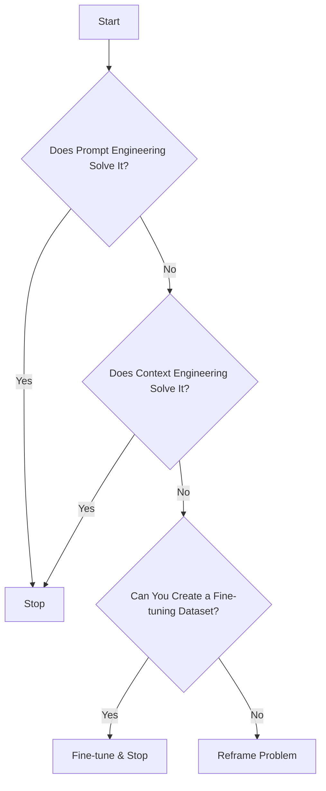
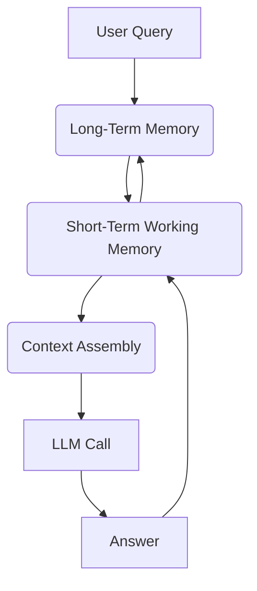

# Context Engineering: The New Frontier
### Beyond prompt engineering for LLMs

## From Prompt to Context Engineering

If you're building artificial intelligence (AI) applications, you’ve probably heard that prompt engineering is the key to unlocking performance. This advice is quickly becoming outdated. While essential, focusing solely on crafting the perfect prompt is like trying to win a race by only polishing the car's hood. It misses the bigger picture.

The AI landscape has evolved rapidly. We started with simple chatbots in 2022, where a single, well-phrased question was enough. Then came Retrieval-Augmented Generation (RAG) systems in 2023, which required us to feed domain-specific knowledge into the prompt. By 2024, tool-using agents emerged, forcing us to include application programming interface (API) schemas and function calls. Now, we build memory-enabled agents that manage state and build relationships over time.

This evolution has exposed the limits of pure prompt engineering. It optimizes for single interactions, not sustained, multi-turn conversations. As context grows, performance degrades—a problem known as context decay. The Large Language Model (LLM) gets lost in the noise, leading to hallucinations and misguided answers. Furthermore, every token adds to the cost and latency of an LLM call. The naive approach of just stuffing everything into the context window is a recipe for a slow and expensive system. I learned this the hard way on a project where my attempt to include all my research, guidelines, and examples resulted in a workflow that took 30 minutes to run.

This is where **Context Engineering** comes in. It’s the necessary evolution, a discipline focused on orchestrating the entire information ecosystem—past conversations, databases, tools, and memory—to make AI applications accurate, fast, and cost-effective. It’s about being deliberate with what you feed the model, ensuring it gets exactly what it needs, and nothing it doesn’t.

## Understanding Context Engineering

So, what is context engineering? Formally, it’s an optimization problem. You are trying to find the best way to assemble the right information at the right time to get the most accurate answer from an LLM. This involves optimizing a set of functions that retrieve, filter, and format information to maximize the LLM's output quality for a given task, all while respecting the model's context window limits [[1]](https://arxiv.org/pdf/2507.13334). In simple terms, context engineering is managing an AI's memory. It’s about deciding which pieces of short-term and long-term memory to pull into the prompt to solve a task effectively, without confusing the model.

Andrej Karpathy provides a powerful analogy, stating that LLMs are like a new kind of operating system where the model is the central processing unit (CPU) and its context window is the random access memory (RAM). He notes, "context engineering is the art and science of filling the context window with the right information for the next step" [[2]](https://www.llamaindex.ai/blog/context-engineering-what-it-is-and-techniques-to-consider). This highlights that the context you provide is a carefully selected subset of the AI's working memory, not the entire thing. Just as an operating system manages RAM to ensure efficient program execution, context engineering ensures the LLM receives precisely what it needs to perform optimally.

This doesn't mean prompt engineering is dead. Instead, context engineering subsumes it. You still need to write clear instructions and craft effective prompts, but now you must also manage the dynamic information that surrounds those instructions. Prompt engineering focuses on the *how* to phrase tasks, while context engineering broadens the scope to the *what* information to provide.

**Table 1**: Comparison of Prompt Engineering and Context Engineering
| Dimension | Prompt Engineering | Context Engineering |
|-----------|-------------------|---------------------|
| Scope | Single interaction optimization | Entire information ecosystem |
| Complexity | O(1) context assembly | O(n) multi-component optimization |
| State Management | Stateless function | Stateful with memory |
| Focus | How to phrase tasks | What information to provide |

This shift also redefines our relationship with fine-tuning. As modern LLMs become better generalists, fine-tuning—which is expensive, slow, and inflexible—should be the last resort. Fine-tuning requires significant computational resources and specialized datasets for retraining, and any update to domain knowledge necessitates retraining the model. For most use cases, context engineering is the new fine-tuning, offering a more agile and cost-effective approach that allows for real-time updates to knowledge without retraining the model [[3]](https://www.glean.com/blog/retrieval-augemented-generation-vs-fine-tuning), [[4]](https://fabrix.ai/blog/fine-tuning-or-retrieval-augmented-generation-when-dealing-with-multi-domain-datasets/). Your development workflow should follow a clear path from simple to complex.

Most production-grade problems can be solved with robust context engineering, saving you the significant overhead of fine-tuning. Now that we understand what context engineering is, let's explore its core components.

## What Makes Up the Context

The context you pass to an LLM is not a static block of text. Instead, we dynamically assemble different information types, each serving a distinct purpose and mapping to various forms of AI memory. We pull these components together for every single interaction.
![A Venn diagram shows a large blue circle labeled "Context Engineering" that encompasses four smaller, overlapping circles. The smaller circles are labeled "RAG" (purple)

, "Prompt Engineering" (yellow), "State / History" (pink), and "Memory" (green). A fifth, smaller circle labeled "Structured Outputs" (orange) overlaps with "Prompt Engineering" and "Memory" but is partially outside the main "Context Engineering" circle. The text "Everything is Context Engineering!" is written in the top left corner.](https://i.imgur.com/G5g2mJp.png)
**Figure 1**: The components of context engineering, showing how different techniques overlap to form the full context [[5]](https://github.com/humanlayer/12-factor-agents/blob/main/content/factor-03-own-your-context-window.md).

Here are the core components:

### Procedural Memory
This includes the foundational rules of operation. The system prompt sets the agent's persona and high-level instructions. Tool schemas and structured output schemas define the functions the agent can call and the formats it must adhere to.

### Short-Term / Working Memory
This is the most dynamic component, capturing the immediate flow of a conversation. It includes your latest input and the agent's internal monologue, often following a Reasoning and Acting (ReAct) loop: thought, action (tool call), and observation (tool result).

### Episodic Memory
This is the AI's memory of past experiences and user-specific data. It stores user preferences and historical interactions, often in a vector or graph database, allowing for personalized responses [[6]](https://ragwalla.com/blog/the-ai-memory-revolution-how-rag-powered-memory-systems-will-transform-enterprise-ai-in-2025).

### Semantic Memory
This is the agent's knowledge base. It can be internal, like information retrieved from company documents via RAG, or external, like real-time data from an API call [[7]](https://techsee.com/blog/understanding-ai-memory-a-deep-dive-into-the-cognitive-layers-of-service-automation/).

This entire process is a continuous cycle. Information flows from your query to the agent's memory systems, gets assembled into context for the LLM, and the resulting output updates the memory, preparing for the next turn.

Understanding these components is the first step toward mastering how you can orchestrate them effectively.

## Production Implementation Challenges

While powerful, implementing context engineering in production introduces significant technical hurdles. Simply having a large context window doesn't solve these problems; in fact, it can sometimes make them worse.

**Figure 2**: Model correctness often drops as context length increases, a phenomenon known as context distraction or the "lost-in-the-middle" problem [[8]](https://www.datacamp.com/blog/context-engineering).

Here are the key challenges you'll face:

### The Context Window Limit
Every model has a finite context window, which is the maximum amount of information it can process simultaneously. While models with million-token windows exist, this space fills up fast with chat history, RAG documents, and tool definitions. It’s a hard constraint that forces you to be selective.

### Information Overload (Context Decay)
More context is not always better. As the context window fills, models can get distracted by the accumulated history, leading to a drop in performance. This is the "needle in a haystack" problem, where relevant information gets lost in a sea of noise. A study found that model correctness can start to decline significantly after just 32,000 tokens, long before the theoretical limit is reached [[8]](https://www.datacamp.com/blog/context-engineering).

### Context Drift
This occurs when the context accumulates conflicting information over time. For instance, the memory might contain both "the user's flight is on Tuesday" and a later update, "the user's flight was moved to Wednesday." This creates a confused state of truth that can derail the agent's reasoning.

### Tool Confusion
Providing an agent with too many tools, especially if their descriptions are vague or overlapping, can cause it to fail. The model struggles to select the correct tool for the job, leading to incorrect actions or complete paralysis. Research has shown that model performance degrades as the number of available tools increases [[8]](https://www.datacamp.com/blog/context-engineering).

## Context Optimization Strategies

To manage the complexity of modern AI applications, you need deliberate strategies for optimizing the context. A common mistake is providing all available context to the LLM at every step. This not only risks hitting the context window limit but also invites performance issues like context decay. Instead, you need to be more strategic.

### Advanced Retrieval and Ranking
Do not just dump retrieved documents into the prompt. Use a re-ranking step to prioritize the most relevant chunks of information. This ensures the model sees the most critical facts first, mitigating the "lost-in-the-middle" problem and helping the LLM focus on what truly matters for the task at hand [[1]](https://arxiv.org/pdf/2507.13334).

### Context Compression
As a conversation grows, the chat history can quickly consume the context window. To manage this, you can use an LLM to periodically create summaries of past interactions, preserving key facts while freeing up tokens [[9]](https://www.datacamp.com/tutorial/prompt-compression). Another technique is to move important details from short-term working memory into a long-term episodic memory store. Research shows that moderate compression can even improve LLM performance by abstracting and retaining critical information more effectively [[10]](https://arxiv.org/pdf/2505.00019).

### Deliberate Ordering
The position of information within the prompt matters. LLMs typically pay more attention to the beginning and end of the context. Place the most critical information, such as the main instruction and key data points, in these high-attention zones. For time-sensitive tasks, prioritize recent information and trim older, less relevant history.

### Isolating Context
For complex tasks, a single agent can become overwhelmed. A more effective architectural pattern is to use multiple, specialized agents. Each agent has its own isolated context window focused on a specific sub-task. They collaborate and hand off information, preventing any single agent from being overloaded and improving overall system performance [[11]](https://blog.langchain.com/context-engineering-for-agents/).

### Format Optimization
Use structured formats like Extensible Markup Language (XML) or YAML Ain't Markup Language (YAML) to clearly delineate different parts of the context. This helps the model distinguish between instructions, user input, retrieved documents, and tool outputs, leading to more reliable parsing and reasoning [[5]](https://github.com/humanlayer/12-factor-agents/blob/main/content/factor-03-own-your-context-window.md).

## Context Engineering in Action: A Healthcare Use Case

Let's make this concrete with a real-world use case in healthcare. Imagine building an AI assistant to help patients with minor health concerns. Your goal is to provide safe, personalized advice based on their history and reliable medical knowledge.

Consider this user query: `I have a headache. What can I do to stop it? I would prefer not to take any medicine.`

A simple prompt-engineered chatbot might give a generic list of remedies. A context-engineered system does much more. Before the LLM even sees the query, the system performs several steps:
1.  **Retrieves Episodic Memory:** It queries a database to get the patient's history, noting any allergies, pre-existing conditions, and personal preferences [[6]](https://ragwalla.com/blog/the-ai-memory-revolution-how-rag-powered-memory-systems-will-transform-enterprise-ai-in-2025).
2.  **Retrieves Semantic Memory:** It consults a trusted medical knowledge base (a form of RAG) to find non-medicinal treatments for headaches that are appropriate for the patient's profile [[7]](https://techsee.com/blog/understanding-ai-memory-a-deep-dive-into-the-cognitive-layers-of-service-automation/).
3.  **Assembles Context:** It formats this information into a structured prompt, ensuring the most critical data is placed optimally.
4.  **Calls the LLM:** It sends the curated context to the LLM to generate a personalized, safe, and relevant recommendation.
5.  **Updates Memory:** The system logs the interaction, potentially updating the patient's preferences for future queries [[12]](https://arxiv.org/pdf/2504.19413), [[13]](https://www.ibm.com/think/topics/ai-agent-memory).

Here’s a simplified Python snippet showing what the final system prompt might look like. Notice the clear structure and ordering of information.
```python
def create_system_prompt(user_query, patient_history, medical_knowledge):
    """
    Assembles a structured prompt for the healthcare AI assistant.
    """
    system_prompt = f"""
<role>
You are a helpful and cautious AI healthcare assistant. Your goal is to provide safe, non-medicinal advice. You must not provide a diagnosis. Always advise the user to consult a doctor for serious issues.
</role>

<patient_history>
{patient_history}
</patient_history>

<retrieved_knowledge>
{medical_knowledge}
</retrieved_knowledge>

<user_query>
{user_query}
</user_query>

<instructions>
Based on the provided history and knowledge, answer the user's query. Prioritize information from the patient history. Do not suggest any medications.
</instructions>
"""
    return system_prompt

# Example usage:
patient_data = "No known allergies. Prefers holistic remedies. Reports occasional stress-related headaches."
retrieved_docs = "For tension headaches, recommend relaxation techniques, hydration, and applying a cold compress."
query = "I have a headache. What can I do to stop it? I would prefer not to take any medicine."

final_prompt = create_system_prompt(query, patient_data, retrieved_docs)
print(final_prompt)
```
It outputs:
```
<role>
You are a helpful and cautious AI healthcare assistant. Your goal is to provide safe, non-medicinal advice. You must not provide a diagnosis. Always advise the user to consult a doctor for serious issues.
</role>

<patient_history>
No known allergies. Prefers holistic remedies. Reports occasional stress-related headaches.
</patient_history>

<retrieved_knowledge>
For tension headaches, recommend relaxation techniques, hydration, and applying a cold compress.
</retrieved_knowledge>

<user_query>
I have a headache. What can I do to stop it? I would prefer not to take any medicine.
</user_query>

<instructions>
Based on the provided history and knowledge, answer the user's query. Prioritize information from the patient history. Do not suggest any medications.
</instructions>
```
You can apply this approach across many domains. Imagine financial services agents that access Customer Relationship Management (CRM) systems and market data, or project managers who integrate with Slack, Zoom, and task management tools. The key tools in this stack often include a powerful LLM like Gemini, an orchestrator like LangChain, various databases (PostgreSQL, Neo4j, Qdrant), and specialized memory libraries like Mem0.

## Connecting Context Engineering to AI Engineering

Context engineering is more than a set of techniques; it's a mindset. It blends art and intuition, guiding you to structure prompts, pass information, and order components for optimal AI system performance.

You cannot master context engineering in isolation. This multidisciplinary field blends several engineering domains:
*   **AI Engineering:** Master LLMs, RAG, and agentic architectures.
*   **Software Engineering:** Build scalable, maintainable systems to aggregate context, manage state, and wrap agents in robust APIs.
*   **Data Engineering:** Construct data pipelines for RAG systems and LLM workflows.
*   **Ops:** Deploy reproducible, observable, and scalable agents on the right infrastructure, leveraging Continuous Integration/Continuous Delivery (CI/CD).
*   **AI Research:** Explore fine-tuning when context engineering reaches its limits.

To truly develop your context engineering skills, practice is essential. Build AI agents that integrate RAG for semantic memory, tools for procedural memory, and user preferences for episodic memory. Wrestling with real-world context management challenges will build the intuition you need to create intelligent, reliable AI applications.

## References

- [1] [A Survey of Context Engineering for Large Language Models](https://arxiv.org/pdf/2507.13334)
- [2] [Context Engineering - What it is, and techniques to consider](https://www.llamaindex.ai/blog/context-engineering-what-it-is-and-techniques-to-consider)
- [3] [Retrieval-Augmented Generation vs. Fine-Tuning](https://www.glean.com/blog/retrieval-augemented-generation-vs-fine-tuning)
- [4] [Fine-Tuning or Retrieval-Augmented Generation?](https://fabrix.ai/blog/fine-tuning-or-retrieval-augmented-generation-when-dealing-with-multi-domain-datasets/)
- [5] [Own your context window](https://github.com/humanlayer/12-factor-agents/blob/main/content/factor-03-own-your-context-window.md)
- [6] [The AI Memory Revolution: How RAG-Powered Memory Systems Will Transform Enterprise AI in 2025](https://ragwalla.com/blog/the-ai-memory-revolution-how-rag-powered-memory-systems-will-transform-enterprise-ai-in-2025)
- [7] [Understanding AI Memory: A Deep Dive Into the Cognitive Layers of Service Automation](https://techsee.com/blog/understanding-ai-memory-a-deep-dive-into-the-cognitive-layers-of-service-automation/)
- [8] [Context Engineering: A Guide With Examples](https://www.datacamp.com/blog/context-engineering)
- [9] [Prompt Compression](https://www.datacamp.com/tutorial/prompt-compression)
- [10] [Compressing LLM Context to Accelerate Self-Attention](https://arxiv.org/pdf/2505.00019)
- [11] [Context Engineering for Agents](https://blog.langchain.com/context-engineering-for-agents/)
- [12] [Memory-augmented RAG for Personalized Response](https://arxiv.org/pdf/2504.19413)
- [13] [What is AI agent memory?](https://www.ibm.com/think/topics/ai-agent-memory)