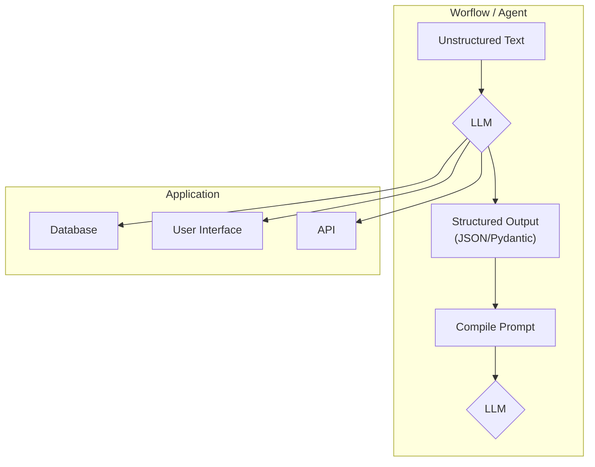

# LLM Structured Outputs: A Deep Dive
### Bridge LLMs to apps with structured data

## Introduction

In our previous lessons, we laid the groundwork for AI Engineering. We explored the AI agent landscape, distinguished between rule-based workflows and autonomous agents, and covered context engineering—the art of feeding the right information to a LLM. Now, we are ready to tackle a fundamental challenge: getting reliable information *out* of an LLM.

Large Language Models operate in a world of probabilities, often called "Software 3.0". Our applications, however, rely on deterministic code and predictable data structures—the world of "Software 1.0". This lesson explores structured outputs, the bridge between these two worlds. Structured outputs are a fundamental technique for forcing LLMs to return consistent, machine-readable data. Mastering this is essential for any AI Engineer building production-grade systems.

## Understanding why structured outputs are critical

Before we start coding, it is important to understand why structured outputs are a cornerstone of reliable AI applications. When an LLM returns a free-form string, you face the messy task of parsing it. This often involves fragile regular expressions or string-splitting logic. These methods easily break if the model changes its phrasing even slightly [[1]](https://pmc.ncbi.nlm.nih.gov/articles/PMC11751965/), [[2]](https://arxiv.org/html/2506.21585v1). Structured outputs solve this by forcing the model’s response into a predictable format like JSON.

This approach offers several key benefits. First, structured outputs are easy to parse, manipulate, and debug. Instead of wrestling with raw text, you work with clean Python objects like dictionaries or, even better, Pydantic models. This allows you to programmatically access the data you need without guesswork, making your code cleaner and more predictable.

Second, using libraries like Pydantic adds a layer of data and type validation [[3]](https://www.speakeasy.com/blog/pydantic-vs-dataclasses), [[4]](https://codetain.com/blog/validators-approach-in-python-pydantic-vs-dataclasses/). If the LLM returns a string where an integer is expected, your application will not crash silently with a `TypeError` down the line; it will raise a clear validation error immediately. This "fail-fast" behavior is essential for building reliable systems, preventing bad data from propagating through your application.

Structured outputs create a formal contract between the LLM and your application code, making your system far more reliable. Engineers use this pattern everywhere. For example, they extract entities like names and dates to build knowledge graphs for advanced Retrieval-Augmented Generation (RAG). As seen in Figure 1, they also format outputs for the next LLM workflow step or other downstream systems like databases, user interfaces or APIs. [[5]](https://www.prompts.ai/en/blog-details/automating-knowledge-graphs-with-llm-outputs), [[6]](https://humanloop.com/blog/structured-outputs), [[7]](https://developers.redhat.com/articles/2025/06/03/structured-outputs-vllm-guiding-ai-responses).

Figure 1: A simplified flow showing how structured outputs bridge the gap between LLMs and downstream applications.

Now that we understand the theory, let us move to practice. We will explore three ways to implement structured outputs: from scratch with JSON, from scratch with Pydantic, and natively with the Gemini API.

## Implementing structured outputs from scratch using JSON

To understand what modern LLM APIs offer, we will first build a structured output pipeline from the ground up. This hands-on approach will show you the underlying mechanics. Our goal is to prompt the model to return a JSON object and then parse it into a Python dictionary.

1.  We begin by setting up our environment. This involves initializing the Gemini client, defining the model we will use, and preparing a sample document for analysis.

    ```python
    import json
    
    from google import genai
    from google.genai import types
    from pydantic import BaseModel, Field
    
    from lessons.utils import env
    
    env.load(required_env_vars=["GOOGLE_API_KEY"])
    
    client = genai.Client()
    
    MODEL_ID = "gemini-2.5-flash"
    
    DOCUMENT = """
    # Q3 2023 Financial Performance Analysis
    
    The Q3 earnings report shows a 20% increase in revenue and a 15% growth in user engagement, 
    beating market expectations. These impressive results reflect our successful product strategy 
    and strong market positioning.
    
    Our core business segments demonstrated remarkable resilience, with digital services leading 
    the growth at 25% year-over-year. The expansion into new markets has proven particularly 
    successful, contributing to 30% of the total revenue increase.
    
    Customer acquisition costs decreased by 10% while retention rates improved to 92%, 
    marking our best performance to date. These metrics, combined with our healthy cash flow 
    position, provide a strong foundation for continued growth into Q4 and beyond.
    """
    ```

2.  Next, we craft a prompt that instructs the LLM to extract metadata and format it as JSON. Notice how we provide a clear example of the desired structure and use XML tags like `<document>` and `<json>` to separate the input data from the formatting instructions. This is a common and effective prompt engineering technique to improve clarity and guide the model's output [[8]](https://help.openai.com/en/articles/6654000-best-practices-for-prompt-engineering-with-the-openai-api), [[9]](https://aws.amazon.com/blogs/machine-learning/structured-data-response-with-amazon-bedrock-prompt-engineering-and-tool-use/).

    ```python
    prompt = f"""
    Analyze the following document and extract metadata from it. 
    The output must be a single, valid JSON object with the following structure:
    <json>
    {{ 
        "summary": "A concise summary of the article.", 
        "tags": ["list", "of", "relevant", "tags"], 
        "keywords": ["list", "of", "key", "concepts"],
        "quarter": "Q...",
        "growth_rate": "...%",
    }}
    </json>
    
    Here is the document:
    <document>
    {DOCUMENT}
    </document>
    """
    ```

3.  We send the prompt to the model and inspect the raw response. As expected, the model returns a JSON object, but it is often wrapped in markdown code blocks.

    ```python
    response = client.models.generate_content(model=MODEL_ID, contents=prompt)
    ```

    It outputs:

    ```
    ```json
    {
        "summary": "The Q3 2023 financial report highlights a strong performance with a 20% increase in revenue and 15% growth in user engagement, surpassing market expectations. This success is attributed to effective product strategy, strong market positioning, and successful expansion into new markets. The company also improved efficiency, reducing customer acquisition costs by 10% and achieving a 92% customer retention rate.",
        "tags": [
            "Financial Performance",
            "Q3 2023",
            "Earnings Report",
            "Revenue Growth",
            "User Engagement",
            "Market Expansion",
            "Customer Retention",
            "Business Strategy"
        ],
        "keywords": [
            "Q3",
            "Revenue",
            "Growth",
            "User engagement",
            "Digital services",
            "New markets",
            "Customer acquisition cost",
            "Retention rate",
            "Financial results"
        ],
        "quarter": "Q3",
        "growth_rate": "20%"
    }
    ```
    ```

4.  To handle this, we create a simple helper function to strip the markdown and XML tags, leaving us with a clean JSON string.

    ```python
    def extract_json_from_response(response: str) -> dict:
        """
        Extracts JSON from a response string that is wrapped in <json> or ```json tags.
        """
    
        response = response.replace("<json>", "").replace("</json>", "")
        response = response.replace("```json", "").replace("```", "")
    
        return json.loads(response)
    ```

5.  Finally, we parse the string into a Python dictionary, which can now be used in our application.

    ```python
    parsed_response = extract_json_from_response(response.text)
    ```

    It outputs:

    ```json
    {
      "summary": "The Q3 2023 financial report highlights a strong performance with a 20% increase in revenue and 15% growth in user engagement, surpassing market expectations. This success is attributed to effective product strategy, strong market positioning, and successful expansion into new markets. The company also improved efficiency, reducing customer acquisition costs by 10% and achieving a 92% customer retention rate.",
      "tags": [
        "Financial Performance",
        "Q3 2023",
        "Earnings Report",
        "Revenue Growth",
        "User Engagement",
        "Market Expansion",
        "Customer Retention",
        "Business Strategy"
      ],
      "keywords": [
        "Q3",
        "Revenue",
        "Growth",
        "User engagement",
        "Digital services",
        "New markets",
        "Customer acquisition cost",
        "Retention rate",
        "Financial results"
      ],
      "quarter": "Q3",
      "growth_rate": "20%"
    }
    ```

This "from scratch" method works, but it relies on manual parsing and lacks data validation. If the LLM makes a mistake, our application might fail. Next, we will see how Pydantic solves this problem.

## Implementing structured outputs from scratch using Pydantic

While forcing JSON output is an improvement over parsing raw text, it still leaves you with a plain Python dictionary. You cannot be sure what is inside that dictionary, if the keys are correct, or if the values have the right type. This uncertainty can lead to bugs and make your code difficult to maintain. This is where Pydantic helps. Pydantic is a data validation library that enforces type hints at runtime, ensuring data integrity from the moment data enters your application [[3]](https://www.speakeasy.com/blog/pydantic-vs-dataclasses). It provides a single, clear source of truth for your data structure and can automatically generate a JSON Schema from your Python class.

When an LLM produces output that does not match the structure and types defined in your Pydantic model, the library raises a `ValidationError`. This error clearly explains what went wrong, allowing you to quickly identify and fix issues. This "fail-fast" behavior is essential for building reliable systems, preventing bad data from moving through your application and causing hard-to-debug errors later.

Let's refactor our previous example to use Pydantic.

1.  We define our desired data structure as a Pydantic class. This class acts as a single source of truth for your output format. We use standard Python type hints to define the expected type for each field. Pydantic works with Python’s `typing` module. Since Python 3.9, you can use built-in types like `list` directly, making the code cleaner. For example, `tags: list[str]` is now preferred over importing `List` from `typing`.

    ```python
    class DocumentMetadata(BaseModel):
        """A class to hold structured metadata for a document."""
    
        summary: str = Field(description="A concise, 1-2 sentence summary of the document.")
        tags: list[str] = Field(description="A list of 3-5 high-level tags relevant to the document.")
        keywords: list[str] = Field(description="A list of specific keywords or concepts mentioned.")
        quarter: str = Field(description="The quarter of the financial year described in the document (e.g, Q3 2023).")
        growth_rate: str = Field(description="The growth rate of the company described in the document (e.g, 10%).")
    ```

    You can also nest Pydantic models to represent more complex, hierarchical data. This allows you to define intricate relationships between different pieces of information, such as a `DocumentMetadata` model containing a `Summary` object and a list of `Tag` objects. Nesting helps organize your data logically and reflects the real-world complexity of information. However, it is a good practice to keep schemas from becoming overly complex, as overly intricate structures can sometimes confuse the LLM and lead to more formatting errors.

    ```python
    class Summary(BaseModel):
        text: str
        sentiment: float

    class Tag(BaseModel):
        label: str
        relevance: float

    class ComplexDocumentMetadata(BaseModel):
        summary: Summary
        tags: list[Tag]
    ```

2.  With our Pydantic model defined, we can automatically generate a JSON Schema from it. A schema is the standard term for defining the structure and constraints of your data. Think of it as a formal contract between your application and the LLM. This contract precisely dictates the expected fields, their types, and any validation rules. We provide this generated schema to the LLM to guide its output, giving the model a clear blueprint for its response. This is similar to the technique used internally by APIs like Gemini and OpenAI to enforce a specific output format, ensuring their models adhere to predefined structures [[10]](https://ai.google.dev/gemini-api/docs/structured-output).

    ```python
    schema = DocumentMetadata.model_json_schema()
    ```

    The generated schema looks like this:

    ```json
    {'description': 'A class to hold structured metadata for a document.',
     'properties': {'summary': {'description': 'A concise, 1-2 sentence summary of the document.',
       'title': 'Summary',
       'type': 'string'},
      'tags': {'description': 'A list of 3-5 high-level tags relevant to the document.',
       'items': {'type': 'string'},
       'title': 'Tags',
       'type': 'array'},
      'keywords': {'description': 'A list of specific keywords or concepts mentioned.',
       'items': {'type': 'string'},
       'title': 'Keywords',
       'type': 'array'},
      'quarter': {'description': 'The quarter of the financial year described in the document (e.g, Q3 2023).',
       'title': 'Quarter',
       'type': 'string'},
      'growth_rate': {'description': 'The growth rate of the company described in the document (e.g, 10%).',
       'title': 'Growth Rate',
       'type': 'string'}},
     'required': ['summary', 'tags', 'keywords', 'quarter', 'growth_rate'],
     'title': 'DocumentMetadata',
     'type': 'object'}
    ```

3.  We update our prompt to include this JSON Schema. This gives the model a much more precise set of instructions than our previous plain-text example.

    ```python
    prompt = f"""
    Please analyze the following document and extract metadata from it. 
    The output must be a single, valid JSON object that conforms to the following JSON Schema:
    <json>
    {json.dumps(schema, indent=2)}
    </json>
    
    Here is the document:
    <document>
    {DOCUMENT}
    </document>
    """
    ```

4.  After calling the model and extracting the JSON string, we validate and parse it directly into our `DocumentMetadata` object.

    ```python
    response = client.models.generate_content(model=MODEL_ID, contents=prompt)
    parsed_response = extract_json_from_response(response.text)
    
    try:
        document_metadata = DocumentMetadata.model_validate(parsed_response)
        print("\nValidation successful!")
    except Exception as e:
        print(f"\nValidation failed: {e}")
    ```

    The validated Pydantic object can now be safely used throughout your application, with full type-hinting and attribute access. This is the main advantage: you move away from unclear dictionaries, where you constantly check for missing keys or incorrect types, to clean, predictable Python objects.

Python’s built-in `dataclasses` or `TypedDict` can define structure, but they only provide type hints for static analysis tools [[3]](https://www.speakeasy.com/blog/pydantic-vs-dataclasses), [[4]](https://codetain.com/blog/validators-approach-in-python-pydantic-vs-dataclasses/), [[11]](https://dev.to/meeshkan/typeddict-vs-dataclasses-in-python-epic-typing-battle-onb). They do not perform runtime validation. This means if the LLM returns a string where an integer is expected, or if a required field is missing, a `dataclass` or `TypedDict` will not catch this error immediately. A type mismatch will go unnoticed until it causes an error during execution, potentially leading to difficult-to-debug issues later.

Pydantic, with its out-of-the-box runtime validation and type coercion, directly addresses these challenges [[12]](https://www.youtube.com/watch?v=WRiQD4lmnUk). While `TypedDict` can be faster for simple cases without validation, Pydantic's overhead is minimal for the robust data integrity it provides [[13]](https://docs.pydantic.dev/latest/concepts/performance/). This makes Pydantic the industry standard for moving data reliably in LLM workflows and AI agents, providing the robustness needed for production-grade systems.

## Implementing structured outputs using Gemini and Pydantic

We have manually engineered prompts to guide the LLM so far. Now, we will explore how to use the native structured output features offered by modern LLM APIs like Gemini and OpenAI. This built-in functionality is simpler, more accurate, and often more cost-effective than manual prompt engineering. The model is constrained at the generation level, which reduces the likelihood of formatting errors and ensures more consistent, reliable data. This allows you to focus on your application's logic instead of data wrangling [[10]](https://ai.google.dev/gemini-api/docs/structured-output), [[14]](https://www.vellum.ai/blog/when-should-i-use-function-calling-structured-outputs-or-json-mode), [[15]](https://www.googlecloudcommunity.com/gc/AI-ML/Structured-Output-in-vertexAI-BatchPredictionJob/m-p/866640), [[16]](https://news.ycombinator.com/item?id=41173223).

Let us see how to achieve the same result using the Gemini API's native capabilities. The process becomes much simpler.

1.  We define a `GenerateContentConfig` object, instructing the Gemini API to set the `response_mime_type` to `"application/json"` and the `response_schema` to our `DocumentMetadata` Pydantic model. The Gemini SDK automatically converts the Pydantic model into a JSON Schema [[10]](https://ai.google.dev/gemini-api/docs/structured-output).

    ```python
    config = types.GenerateContentConfig(response_mime_type="application/json", response_schema=DocumentMetadata)
    ```

2.  This configuration makes our prompt significantly shorter and cleaner, eliminating the need to manually inject JSON examples or full schemas; we simply ask the model to perform the task.

    ```python
    prompt = f"""
    Analyze the following document and extract its metadata.
    
    Document:
    --- 
    {DOCUMENT}
    --- 
    """
    ```

3.  Now, we call the model, passing our simplified prompt and the new configuration object.

    ```python
    response = client.models.generate_content(model=MODEL_ID, contents=prompt, config=config)
    ```

4.  The Gemini client automatically parses the output for us. By accessing the `response.parsed` attribute, we receive a ready-to-use instance of our `DocumentMetadata` Pydantic model. This eliminates the need for custom parsing functions or manual validation steps.

    ```python
    # response.parsed is a DocumentMetadata object
    document_metadata = response.parsed
    print(document_metadata.model_dump_json(indent=2))
    ```

    It outputs:

    ```json
    {
      "summary": "The Q3 2023 earnings report reveals a strong financial performance with a 20% increase in revenue and 15% growth in user engagement, surpassing market expectations. This success is attributed to effective product strategy, market expansion, reduced customer acquisition costs, and improved retention rates.",
      "tags": [
        "Financial Performance",
        "Earnings Report",
        "Business Growth",
        "Market Expansion",
        "Q3 Results"
      ],
      "keywords": [
        "Q3 2023",
        "revenue increase",
        "user engagement",
        "product strategy",
        "market positioning",
        "digital services",
        "new markets",
        "customer acquisition costs",
        "retention rates",
        "cash flow"
      ],
      "quarter": "Q3 2023",
      "growth_rate": "20%"
    }
    ```

This native approach is the recommended way to generate structured outputs. It is robust, efficient, and requires less code, allowing you to focus on your application's logic instead of data wrangling.

## Conclusion: Structured Outputs Are Everywhere

We have covered the why and how of structured outputs, from manual prompting to native API integration. This technique is more than just a convenience; it is a fundamental pattern in AI Engineering. It is the essential bridge connecting the probabilistic, free-form nature of LLMs with the deterministic, structured world of software applications. Whether you are building a simple workflow to summarize articles or a complex agent that analyzes financial data, you will use structured outputs. This ensures reliability and control.

This pattern will be a recurring theme throughout this course. In our next lesson, we will explore the basic ingredients of LLM workflows, where we will see how structured data flows between different components. Later, when we build agents that can take action or reason about the world, structured outputs will be how they parse information and decide what to do next. Mastering this technique is a key step toward building powerful and predictable AI systems.

## References

- [1] [Systematic evaluation of large language models for data extraction from unstructured and semi-structured electronic health records](https://pmc.ncbi.nlm.nih.gov/articles/PMC11751965/)
- [2] [Direct vs. Indirect Information Extraction using LLM-based Function Generation](https://arxiv.org/html/2506.21585v1)
- [3] [Pydantic vs. Dataclasses: A Clear Winner for SDKs](https://www.speakeasy.com/blog/pydantic-vs-dataclasses)
- [4] [Pydantic vs. Dataclasses: a battle of validators in Python](https://codetain.com/blog/validators-approach-in-python-pydantic-vs-dataclasses/)
- [5] [Automating Knowledge Graphs with LLM Outputs](https://www.prompts.ai/en/blog-details/automating-knowledge-graphs-with-llm-outputs)
- [6] [Structured Outputs](https://humanloop.com/blog/structured-outputs)
- [7] [Structured Outputs in vLLM: Guiding AI Responses with Precision](https://developers.redhat.com/articles/2025/06/03/structured-outputs-vllm-guiding-ai-responses)
- [8] [Best practices for prompt engineering with the OpenAI API](https://help.openai.com/en/articles/6654000-best-practices-for-prompt-engineering-with-the-openai-api)
- [9] [Structured data response with Amazon Bedrock: Prompt engineering and tool use](https://aws.amazon.com/blogs/machine-learning/structured-data-response-with-amazon-bedrock-prompt-engineering-and-tool-use/)
- [10] [Structured output](https://ai.google.dev/gemini-api/docs/structured-output)
- [11] [TypedDict vs. dataclasses in Python: an epic typing battle](https://dev.to/meeshkan/typeddict-vs-dataclasses-in-python-epic-typing-battle-onb)
- [12] [OpenAI Function Calling & Structured Prompting with Pydantic](https://www.youtube.com/watch?v=WRiQD4lmnUk)
- [13] [Performance](https://docs.pydantic.dev/latest/concepts/performance/)
- [14] [When should I use Function Calling, Structured Outputs or JSON Mode?](https://www.vellum.ai/blog/when-should-i-use-function-calling-structured-outputs-or-json-mode)
- [15] [Structured Output in vertexAI BatchPredictionJob](https://www.googlecloudcommunity.com/gc/AI-ML/Structured-Output-in-vertexAI-BatchPredictionJob/m-p/866640)
- [16] [Hacker News Discussion on Structured Output](https://news.ycombinator.com/item?id=41173223)