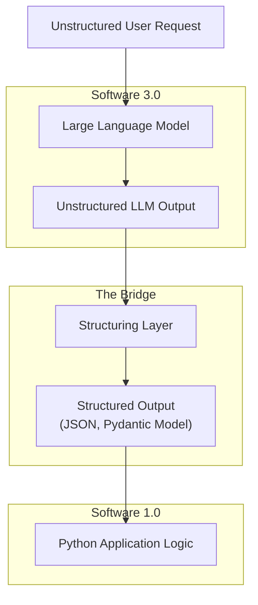

# Structured Outputs for AI/ML
### From chaos to control: Taming LLM outputs

## Why Structured Outputs are the Key to Production-Ready AI

Large Language Models (LLMs) are powerful, but they have a fundamental problem when it comes to building real-world applications: they communicate in unstructured text. While this is great for chatbots and creative writing, it is a nightmare for traditional software systems that run on predictable, structured data like JSON or specific data objects.

This creates a disconnect between the probabilistic world of LLMs—what some call "Software 3.0"—and the deterministic world of a Python backend, or "Software 1.0."

So, how do we bridge this gap? The answer is structured outputs. By forcing an LLM to respond in a predefined format, we can create a reliable interface between the model and our application logic. This is not just a nice-to-have; it is an essential component for building anything that needs to be reliable, maintainable, and production-ready.

Mastering structured outputs is a critical skill for any AI Engineer. It is the difference between a cool demo and a robust system that handles real-world tasks. In this article, we cut through the hype to show you the engineering required. We start from first principles: forcing an LLM to generate JSON. Then, we level up with Pydantic for validation. Finally, we show you how to use a native API like Gemini for a production-grade implementation.

## The Critical Role of Structured Outputs in AI Engineering

Before we dive into the code, it's crucial to understand why structured outputs are essential for building AI systems. When an LLM returns raw text, you face the challenge of parsing it. This often means writing fragile logic with regular expressions or string splitting. Such methods can easily break if the model's output changes, even slightly. This approach is not scalable and often leads to production failures. Imagine a minor change in the LLM's phrasing crashing your entire application. That is the reality without structured outputs [1](https://faktion.com/blog/guided-text-generation-with-large-language-models/), [2](https://arxiv.org/html/2408.11061v1).

Structured outputs solve this problem by providing a predictable, machine-readable format. Instead of unpredictable text, you get a clean data structure—like a Python dictionary or a Pydantic object—that your application can work with directly. This makes the entire system easier to parse, manipulate programmatically, and debug. When an error occurs, you know exactly where to look, rather than trying to figure out why your regex failed. This predictability is crucial for building robust and maintainable AI applications [3](https://betterprogramming.pub/yaml-vs-json-which-is-more-efficient-for-language-models-5bc11dd0f6df/), [4](https://celerdata.com/glossary/yaml-json-and-xml-a-practical-guide-to-choosing-the-right-format), [5](https://www.snaplogic.com/blog/json-vs-yaml-whats-the-difference-and-which-one-is-right-for-your-enterprise).

The real power move, however, is using Pydantic models to define your output structure. Pydantic is the de-facto standard for data validation in the Python ecosystem for a reason. It provides out-of-the-box data and type validation, which is critical for maintaining data quality and preventing bugs [6](https://xebia.com/blog/enforce-and-validate-llm-output-with-pydantic/), [7](https://pydantic.dev/articles/llm-validation/), [8](https://www.leocon.dev/blog/2024/11/from-chaos-to-control-mastering-llm-outputs-with-langchain-and-pydantic/).

If the LLM returns a value with the wrong data type or misses a required field, Pydantic immediately raises a validation error. This simple act of validation brings a necessary layer of determinism to the probabilistic nature of LLMs. Beyond validation, Pydantic also offers automatic serialization and clear documentation of your data models, which streamlines development and collaboration [9](https://www.youtube.com/watch?v=gjxZ4AGRMLk/), [10](https://pydantic.dev/articles/llm-intro/).

This entire process acts as a bridge between the LLM and your application, as shown in Figure 1.

Figure 1: The role of structured outputs as a bridge between LLMs and traditional software.

The use cases for structured outputs are vast and practical. For example, in a Retrieval-Augmented Generation (RAG) system, you might need to extract specific entities like names, dates, and locations from a document. This is crucial for building a knowledge graph. Structured outputs ensure this extracted data is consistently formatted for your graph database [11](https://www.instill-ai.com/blog/llm-structured-outputs/), [12](https://haystack.deepset.ai/tutorials/28_structured_output_with_loop).

They are also essential for formatting LLM outputs for downstream tasks. This includes populating a database, generating reports, or integrating with other APIs. Consider a scenario where an LLM summarizes a customer review; structured output ensures the summary includes specific fields like sentiment, key topics, and action items [13](https://www.youtube.com/watch?v=zuXW0Hwpme4/).

This approach is also a more robust alternative to function calling when your only goal is to extract data, not to trigger an action. By separating the model’s reasoning from the final formatting, you can build more reliable and specialized pipelines [11](https://www.instill-ai.com/blog/llm-structured-outputs/).

Ultimately, using structured outputs means you’re building on a solid foundation. You’re creating a clear contract between your AI and your code, which is the only way to ship production-ready systems that don't fall apart at the first sign of an unexpected output. This approach moves you from fragile hacks to robust engineering.

## From Scratch: Forcing LLM Outputs to JSON

To truly understand what happens behind the scenes, we will start by implementing structured outputs from scratch. The goal is to force an LLM to generate a valid JSON object using nothing but careful prompt engineering. This first-principles approach shows you the core mechanics before we move on to more robust, library-based methods. It highlights the fundamental challenge: LLMs are text generators, so we must guide them precisely.

The basic idea is to tell the model exactly what we want. We provide a user query and, in the same prompt, give explicit instructions for the model to format its response as a JSON object with specific keys and data types. This guides the model’s generation process toward our desired structure. Once the model responds, we can parse the JSON string into a standard Python dictionary, making it immediately usable in our code. This manual approach gives you full control over the prompt, which is essential for debugging and understanding model behavior. However, relying solely on prompt engineering for strict format adherence can be inconsistent and unreliable, especially with smaller models, often leading to syntactic or semantic errors in the output [1](https://faktion.com/blog/guided-text-generation-with-large-language-models/), [2](https://arxiv.org/html/2408.11061v1).

Let's walk through an example. We want to extract a user's name and age from a piece of text. A best practice is to wrap the user's input text in XML tags, like `<text>`, to clearly separate it from the instructions. This makes it easier for the model to distinguish between the content it needs to analyze and the commands it needs to follow, reducing the chance of the model getting confused or ignoring your formatting instructions.
```python
# The user's query
query = "My name is Paul and I am 30 years old."

# The prompt template with instructions
prompt = f"""
Please extract the name and age from the following text and return it as a valid JSON object.

<text>
{query}
</text>

Return a JSON object with the following keys:
- name
- age
"""
```
Next, we send this prompt to an LLM. For this example, we are using a local Ollama model, but this technique works with any capable LLM. The key is the prompt's clarity, not the specific model.
```python
import ollama
import json

# Send the prompt to the LLM
response = ollama.chat(
    model="llama3",
    messages=[
        {
            "role": "user",
            "content": prompt,
        },
    ],
)

# Extract the content from the response
response_content = response["message"]["content"]
print(response_content)
```
The model returns a string that looks like a JSON object. Notice how the model often wraps the JSON in markdown code blocks, which we need to account for when parsing.
```text
```json
{
    "name": "Paul",
    "age": 30
}```
```
The final step is to parse this string into a Python dictionary using the `json` library. This transforms the unstructured text output from the LLM into a structured object we can easily work with. We include error handling to catch cases where the LLM might not return valid JSON.
```python
# Parse the JSON string into a Python dictionary
try:
    json_response = json.loads(response_content)
    print(json_response)
    # Now you can access the data like a normal dictionary
    print(f"Name: {json_response['name']}, Age: {json_response['age']}")
except json.JSONDecodeError:
    print("Error: The response was not valid JSON.")
```
This gives us a clean Python dictionary.
```python
{'name': 'Paul', 'age': 30}
Name: Paul, Age: 30
```
While this method works, it is worth noting that JSON can be quite verbose, consuming more tokens and increasing costs. For many use cases, formats like YAML or even XML can be more token-efficient. Studies have shown that YAML can reduce token counts by up to 50% compared to JSON for identical data, which can lead to significant cost and latency savings [3](https://betterprogramming.pub/yaml-vs-json-which-is-more-efficient-for-language-models-5bc11dd0f6df/). While JSON is widely supported and easy to work with in Python, consider YAML or XML if token efficiency is a critical concern for your application.

This from-scratch approach is a great starting point, but it relies on the model perfectly following our instructions. ⚠️ It lacks built-in validation and can be fragile. In the next section, we will see how to make this process far more robust by adding a layer of validation and type safety with Pydantic.

## From Scratch with Pydantic: Adding Validation and Type Safety

While forcing JSON output is a good first step, it still leaves you vulnerable. What if the model returns an age as a string instead of an integer, or omits a required field entirely? Relying on simple Python dictionaries means you have to write manual checks for all these potential issues.

This is where Pydantic comes in. It provides a robust solution to these common problems, ensuring data integrity and preventing subtle bugs from creeping into your system [6](https://xebia.com/blog/enforce-and-validate-llm-output-with-pydantic/).

Pydantic allows you to define your desired data structure as a Python class with type hints and validation rules. It acts as the perfect bridge between the LLM's raw output and your application's domain logic. Instead of just hoping for the best, you can enforce a strict schema, ensuring the data is not only structured but also valid.

This is why Pydantic has become the de-facto standard for data modeling in modern Python applications, especially in the AI space. Its simplicity and powerful runtime validation make it indispensable for production systems, offering significant advantages over plain dictionaries or dataclasses [8](https://www.leocon.dev/blog/2024/11/from-chaos-to-control-mastering-llm-outputs-with-langchain-and-pydantic/), [9](https://www.youtube.com/watch?v=gjxZ4AGRMLk/), [10](https://pydantic.dev/articles/llm-intro/). Pydantic even supports advanced, context-aware validation that goes beyond simple type checking [7](https://pydantic.dev/articles/llm-validation/).

Let's rebuild our previous example using a Pydantic model. First, define a `User` class that inherits from `pydantic.BaseModel`. This class clearly defines the expected fields and their types.
```python
from pydantic import BaseModel, Field

# Define the Pydantic model for a User
class User(BaseModel):
    name: str = Field(description="The user's name")
    age: int = Field(description="The user's age")
```
Now, instead of manually writing out the JSON format in the prompt, you can programmatically generate a schema from your Pydantic model. Pydantic automatically creates JSON schemas that describe the model's structure, types, and constraints. This schema provides the LLM with a detailed blueprint of the exact output format you expect, including field names, types, and descriptions [14](https://docs.pydantic.dev/1.10/usage/schema/), [15](https://docs.pydantic.dev/latest/concepts/json_schema/), [16](https://docs.pydantic.dev/latest/api/json_schema/). This is the same underlying technique used by major APIs like OpenAI and Gemini to ensure reliable structured outputs [17](https://ai.google.dev/gemini-api/docs/structured-output/), [18](https://platform.openai.com/docs/guides/structured-outputs/). This approach is far less error-prone than manually crafting JSON instructions in the prompt.
```python
# Get the JSON schema from the Pydantic model
json_schema = User.model_json_schema()

# The user's query
query = "My name is Paul and I am 30 years old."

# Create a more robust prompt using the schema
prompt = f"""
Please extract the information from the following text and return it as a valid JSON object that adheres to the following schema.

<text>
{query}
</text>

Return a JSON object that follows this schema:
{json_schema}
"""
```
You send this new prompt to the LLM, just as before. The model now has much clearer instructions and is more likely to return a correctly formatted response because it understands the precise structure required.
```python
import ollama

# Send the prompt to the LLM
response = ollama.chat(
    model="llama3",
    messages=[
        {
            "role": "user",
            "content": prompt,
        },
    ],
)

# Extract the content
response_content = response["message"]["content"]
```
Here’s the magic. Instead of just parsing the JSON into a dictionary, you now validate it against your `User` model. Pydantic handles all the type checking and validation automatically. If the `age` were a string instead of an integer, or if the `name` were missing, Pydantic would immediately raise a `ValidationError`. This prevents bad data from propagating through your system, catching issues at the earliest possible stage.
```python
import json
import re
from pydantic import ValidationError

# Parse and validate the JSON response using the Pydantic model
try:
    # Find the JSON part of the response
    json_str_match = re.search(r"```json\n(.*?)\n```", response_content, re.S)
    if json_str_match:
        json_str = json_str_match.group(1)
        # Validate the data against the Pydantic model
        user = User.model_validate_json(json_str)
        print(user)
        # Now you can access the data with type safety
        print(f"Name: {user.name}, Age: {user.age}")
    else:
        print("Error: No JSON object found in the response.")
except ValidationError as e:
    print(f"Validation Error: {e}")
```
The output is a fully validated `User` object, giving you confidence in the data's integrity.
```python
name='Paul' age=30
Name: Paul, Age: 30
```
By using Pydantic, you've shifted from simply hoping the LLM gets it right to enforcing a contract. This adds a crucial layer of robustness, bypassing the ambiguity of dictionaries and making your AI application significantly more reliable. While we've built this from scratch, most modern LLM APIs offer native support for this, which we'll explore next for a truly production-grade solution.

## Using The Gemini API for Reliable and Cheaper Structured Outputs

So far, we've focused on implementing structured outputs from scratch to understand the core principles. While this is a valuable exercise for learning, in a production environment, you will almost always want to use a model's native capabilities when available. Major providers like Google and OpenAI have built-in support for structured outputs, which is generally more reliable, accurate, and cost-effective.

When you force a model to generate JSON through prompting alone, you use tokens to spell out the entire structure, including brackets, quotes, and keys. Native integrations, like Google Gemini's `response_schema` feature, handle this far more efficiently. You simply provide the schema, which can be derived from a Pydantic model, and the API ensures the output conforms to it without wasting tokens on generating boilerplate [17](https://ai.google.dev/gemini-api/docs/structured-output/). This directly reduces costs by minimizing token usage, as the model does not need to generate the structural elements itself.

Beyond cost savings, native structured output improves reliability significantly. The API uses your schema as a blueprint, ensuring the output always conforms to the specified structure and data types. This eliminates the need for fragile post-processing with regular expressions or manual parsing, which are common pitfalls with prompt-only methods. It also simplifies your application code by offloading the parsing and initial validation directly to the API [19](https://cloud.google.com/vertex-ai/generative-ai/docs/multimodal/control-generated-output), [20](https://firebase.google.com/docs/ai-logic/generate-structured-output), [21](https://ai.google.dev/api/generate-content).

Let's see how to achieve the same result as before, but this time using the Gemini API and its direct integration with Pydantic. First, we define our `User` Pydantic model, just as we did in the previous section. This model serves as the blueprint for the expected structured output.
```python
from pydantic import BaseModel, Field

# Define the Pydantic model for a User
class User(BaseModel):
    name: str = Field(description="The user's name")
    age: int = Field(description="The user's age")
```
Next, we configure our Gemini client. The key is to specify the `response_mime_type` as `"application/json"` and pass our `User` class directly to the `response_schema` parameter. The Gemini library handles the conversion of the Pydantic model into the required JSON schema automatically, abstracting away the complexity.
```python
import google.generativeai as genai

# The user's query
query = "My name is Paul and I am 30 years old."

# Configure the Gemini model for structured output
model = genai.GenerativeModel(
    "gemini-1.5-flash",
    generation_config=genai.GenerationConfig(
        response_mime_type="application/json",
        response_schema=User,
    ),
)
```
Finally, we send our request. We no longer need complex prompt engineering with schema instructions. We just provide the text and let the API handle the rest, receiving a clean, structured response.
```python
# Generate the content
response = model.generate_content(query)

# The response.text contains the raw JSON string
print(response.text)

# The response.candidates[0].content.parts[0].function_call contains the structured data
# which can be easily converted to a dictionary
from google.protobuf.json_format import MessageToDict
user_dict = MessageToDict(response.candidates[0].content.parts[0].function_call)

# Validate the dictionary with our Pydantic model
user = User.model_validate(user_dict['args'])
print(user)
```
The output is, once again, a validated Pydantic object, but this time achieved with less code, fewer tokens, and higher reliability.
```text
{
"name": "Paul",
"age": 30
}
name='Paul' age=30
```
While building from scratch is great for learning and for models that lack native support, leveraging an API's built-in features is the clear winner for production systems. It simplifies your code, lowers your operational costs, and gives you a more robust and dependable solution that scales.

## Conclusion

Large Language Models, for all their power, produce unstructured text that is inherently difficult for traditional software to handle. Structured outputs are the essential bridge that connects the probabilistic world of AI with the deterministic logic of your Python applications. Without them, you build fragile systems on a shaky foundation.

Throughout this article, we journeyed from the ground up. We started by implementing structured outputs from scratch, using prompt engineering to force a model to generate JSON. We then elevated this approach with Pydantic, adding a critical layer of validation and type safety. Finally, we demonstrated the industry-standard method of using a native API like Gemini, which provides a more reliable, efficient, and cost-effective solution.

Mastering structured outputs is not an optional or advanced skill. It is a fundamental, non-negotiable requirement for any engineer serious about building production-grade AI systems. It’s how you turn a promising AI demo into a robust, scalable, and maintainable application that you can trust in the real world.

## References

- [1] [Guided Text Generation with Large Language Models](https://faktion.com/blog/guided-text-generation-with-large-language-models/)
- [2] [Let Me Speak Freely? A Study on the Impact of Format Restrictions on Performance of Large Language Models](https://arxiv.org/html/2408.11061v1)
- [3] [YAML vs. JSON: Which Is More Efficient for Language Models?](https://betterprogramming.pub/yaml-vs-json-which-is-more-efficient-for-language-models-5bc11dd0f6df/)
- [4] [YAML, JSON, and XML: A Practical Guide to Choosing the Right Format](https://celerdata.com/glossary/yaml-json-and-xml-a-practical-guide-to-choosing-the-right-format)
- [5] [JSON vs. YAML: What’s the difference and which one is right for your enterprise](https://www.snaplogic.com/blog/json-vs-yaml-whats-the-difference-and-which-one-is-right-for-your-enterprise)
- [6] [Enforce and Validate LLM output with Pydantic](https://xebia.com/blog/enforce-and-validate-llm-output-with-pydantic/)
- [7] [Using Pydantic for context-aware validation](https://pydantic.dev/articles/llm-validation/)
- [8] [From Chaos to Control: Mastering LLM Outputs with LangChain and Pydantic](https://www.leocon.dev/blog/2024/11/from-chaos-to-control-mastering-llm-outputs-with-langchain-and-pydantic/)
- [9] [Pydantic V2 for AI & LLMs](https://www.youtube.com/watch?v=gjxZ4AGRMLk/)
- [10] [Steering Large Language Models with Pydantic](https://pydantic.dev/articles/llm-intro/)
- [11] [The Best Way to Generate Structured Output from LLMs](https://www.instill-ai.com/blog/llm-structured-outputs/)
- [12] [Structured output with loop](https://haystack.deepset.ai/tutorials/28_structured_output_with_loop)
- [13] [Using LLMs to generate structured data for data annotation](https://www.youtube.com/watch?v=zuXW0Hwpme4/)
- [14] [Pydantic V1 Schema](https://docs.pydantic.dev/1.10/usage/schema/)
- [15] [Pydantic JSON Schema Concepts](https://docs.pydantic.dev/latest/concepts/json_schema/)
- [16] [Pydantic JSON Schema API](https://docs.pydantic.dev/latest/api/json_schema/)
- [17] [Structured output (Gemini)](https://ai.google.dev/gemini-api/docs/structured-output)
- [18] [Structured Outputs (OpenAI)](https://platform.openai.com/docs/guides/structured-outputs)
- [19] [Control generated output](https://cloud.google.com/vertex-ai/generative-ai/docs/multimodal/control-generated-output)
- [20] [Generate structured output](https://firebase.google.com/docs/ai-logic/generate-structured-output)
- [21] [Generate Content](https://ai.google.dev/api/generate-content)