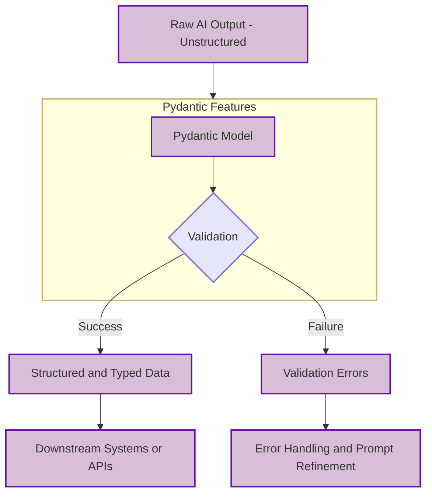

# Structured outputs: A must-have skill
### Mastering LLM outputs for reliable AI apps

## Why Structured Outputs are a Must-Have Skill for AI Engineers

Building reliable AI applications demands structured outputs. We explore why forcing a Large Language Model (LLM) to respond in specific formats, like JSON or a Pydantic model, is not just good practice, but essential.

This approach creates a robust bridge between the probabilistic nature of LLMs and the deterministic world of Python. It ensures your AI outputs are predictable, programmatically usable, and ready for downstream systems.

You will learn the core theory behind structured outputs, how to implement them from scratch, and how to leverage the native capabilities of modern APIs like Gemini. This isn't about basic prompts; it's about building production-ready AI systems.

## The Case for Structured Outputs

Let’s be direct: raw, unstructured text from an LLM is a liability in a production application. While LLMs excel at generating human-like text, their probabilistic nature means their output is inherently unpredictable. This can lead to malformed data structures, type mismatches, and unexpected formatting [3](https://www.tamingllms.com/notebooks/structured_output.html).

Relying on this raw output leads to fragile systems that break when the model deviates even slightly from an expected format. This forces engineers to write complex and brittle string parsing logic or regular expressions, which are a nightmare to maintain and prone to silent failures. Such inconsistencies can lead to costly errors, data corruption, or application crashes in live environments [1](https://xebia.com/blog/enforce-and-validate-llm-output-with-pydantic/), [2](https://blog.kusho.ai/from-chaos-to-order-structured-json-with-pydantic-and-instructor-in-llms/).

Structured outputs solve this by forcing the model's response into a predefined format, most commonly JSON. The output becomes programmatically accessible, allowing you to work with a clean Python dictionary or object. This makes it simple to access specific fields, monitor data quality, and debug issues. This consistency is the foundation for building reliable downstream processes, enabling seamless integration with databases, APIs, and other application components.

The real power is unlocked when you pair structured outputs with a validation library like Pydantic. Pydantic allows you to define your desired data structure as a Python class, complete with precise type hints and validation rules. This acts as a clear data contract, ensuring the LLM's output not only has the correct structure but also contains the right type of data [4](https://www.arecadata.com/pydanticai-for-building-agentic-ai-based-llm-applications/), [5](https://www.leocon.dev/blog/2024/11/from-chaos-to-control-mastering-llm-outputs-with-langchain-and-pydantic/).

This out-of-the-box validation is critical for maintaining data integrity, preventing crashes caused by malformed data, and reducing the need for manual error checking [1](https://xebia.com/blog/enforce-and-validate-llm-output-with-pydantic/), [6](https://docs.pydantic.dev/1.10/usage/models/), [7](https://betterstack.com/community/guides/scaling-python/pydantic-explained/), [8](https://dev.to/devasservice/best-practices-for-using-pydantic-in-python-2021/), [9](https://www.couchbase.com/blog/validate-json-documents-in-python-using-pydantic/). Pydantic also simplifies schema generation, making it easier to communicate the desired output format to the LLM and simplifying prompting [3](https://www.tamingllms.com/notebooks/structured_output.html).

The use cases are extensive. A common application is entity extraction, where you pull specific information—like names, dates, or keywords—from text. This is a foundational step for advanced systems like GraphRAG, where extracted entities and relationships build a knowledge graph that enhances retrieval accuracy, scalability, and interpretability [10](https://arxiv.org/html/2402.04437v3), [11](https://learn.microsoft.com/en-us/azure/developer/ai/how-to/extract-entities-using-structured-outputs), [12](https://ragaboutit.com/building-a-graph-rag-system-with-llm-router-a-comprehensive-coding-walkthrough/). For tasks that primarily require data extraction, structured outputs are a simpler, more direct alternative to complex function calling, streamlining your application logic [14](https://www.vellum.ai/blog/when-should-i-use-function-calling-structured-outputs-or-json-mode/). They also help mitigate security risks like prompt injection by ensuring data conforms to expected schemas [7](https://betterstack.com/community/guides/scaling-python/pydantic-explained/), [8](https://dev.to/devasservice/best-practices-for-using-pydantic-in-python-2021/).

The diagram below illustrates how Pydantic acts as a validation bridge between the unstructured output of an AI and the structured data needed by downstream systems.

Figure 1: Pydantic as a validation bridge between LLM output and structured data.

## From Scratch: Forcing LLM Outputs to JSON

Before you jump into advanced methods, it’s important to understand the fundamentals. The most basic way to get structured data from an LLM is to simply ask for it. By using clear, explicit instructions in your prompt, you can guide the model to generate a JSON object. This from-scratch approach clarifies what happens under the hood before you introduce more sophisticated tools and native API features.

Let’s walk through a practical example. Imagine you need to extract specific metadata from a financial document. First, you define the document you want to analyze.
```python
DOCUMENT = """
# Q3 2023 Financial Performance Analysis

The Q3 earnings report shows a 20% increase in revenue and a 15% growth in user engagement, 
beating market expectations. These impressive results reflect our successful product strategy 
and strong market positioning.

Our core business segments demonstrated remarkable resilience, with digital services leading 
the growth at 25% year-over-year. The expansion into new markets has proven particularly 
successful, contributing to 30% of the total revenue increase.

Customer acquisition costs decreased by 10% while retention rates improved to 92%,
marking our best performance to date. These metrics, combined with our healthy cash flow 
position, provide a strong foundation for continued growth into Q4 and beyond.
"""
```
Next, you create a prompt that includes your instructions and the document. A robust practice is to wrap distinct parts of the prompt, like the schema example and the document content, in XML tags (`<json>` and `<document>`). This helps the model clearly distinguish between the instructions, the desired output format, and the content it needs to process.
```python
prompt = f"""
Analyze the following document and extract metadata from it. 
The output must be a single, valid JSON object with the following structure:
<json>
{{
    "summary": "A concise summary of the article.", 
    "tags": ["list", "of", "relevant", "tags"], 
    "keywords": ["list", "of", "key", "concepts"],
    "quarter": "Q3",
    "growth_rate": "15%",
}}
</json>

Here is the document:
<document>
{DOCUMENT}
</document>
"""
```
You then send this prompt to the Gemini model. The LLM processes the instructions and the document, attempting to generate a JSON string that matches your specified format.
```python
response = client.models.generate_content(model=MODEL_ID, contents=prompt)
```
The model often wraps its JSON output in markdown code blocks, so the raw response might look like this. You need to account for this in your parsing logic.
```
```json
{
    "summary": "The Q3 2023 earnings report showcases strong financial performance...",
    "tags": ["Financial Performance", "Q3 2023", ...],
    "keywords": ["revenue increase", "user engagement growth", ...],
    "quarter": "Q3",
    "growth_rate": "15%"
}
```
```
To handle this, a simple helper function can strip away the extra characters and parse the clean JSON string into a Python dictionary. This step bridges the gap between the LLM's text output and a usable Python data structure.
```python
def extract_json_from_response(response: str) -> dict:
    """
    Extracts JSON from a response string that is wrapped in <json> or ```json tags.
    """
    response = response.replace("<json>", "").replace("</json>", "")
    response = response.replace("```json", "").replace("```", "")
    return json.loads(response)

parsed_repsonse = extract_json_from_response(response.text)
print(type(parsed_repsonse))
```
This outputs:
```
<class 'dict'>
```
You now have a Python dictionary to work with. While this method works, JSON can be verbose. For applications sensitive to token count and latency, alternatives like YAML or XML can be more efficient. YAML, for instance, can reduce token usage compared to JSON because its indentation-based structure is often more token-efficient than JSON's brackets and commas. However, JSON is generally faster to parse and more widely supported.

## The Pydantic Advantage: Adding Validation and Type Safety

Using raw JSON is an improvement over unstructured text, but it has its own problems. A plain Python dictionary offers no guarantees about the presence of specific keys or their data types. This ambiguity means that if the LLM's output doesn't perfectly match what your code expects, you face potential runtime errors and difficult-to-debug issues [1](https://xebia.com/blog/enforce-and-validate-llm-output-with-pydantic/), [8](https://dev.to/devasservice/best-practices-for-using-pydantic-in-python-2021/). This is where Pydantic becomes indispensable.

Pydantic allows you to define precise data schemas as Python classes, providing a single source of truth for your data structures [6](https://docs.pydantic.dev/1.10/usage/models/). It is the de-facto standard for data modeling in modern Python and serves as the perfect, type-safe bridge between the probabilistic world of LLMs and the deterministic world of your application code [8](https://dev.to/devasservice/best-practices-for-using-pydantic-in-python-2021/). By defining your schema upfront, you establish a clear contract for the LLM's output, ensuring data integrity and reliability [7](https://betterstack.com/community/guides/scaling-python/pydantic-explained/), [9](https://www.couchbase.com/blog/validate-json-documents-in-python-using-pydantic/).

Let's refactor our previous example to use a Pydantic model. First, we define a class `DocumentMetadata` that mirrors our desired JSON structure. Notice how we use the `Field` function to add detailed descriptions. These descriptions provide crucial context to the LLM, helping it generate more accurate data.
```python
class DocumentMetadata(BaseModel):
    """A class to hold structured metadata for a document."""

    summary: str = Field(description="A concise, 1-2 sentence summary of the document.")
    tags: list[str] = Field(description="A list of 3-5 high-level tags relevant to the document.")
    keywords: list[str] = Field(description="A list of specific keywords or concepts mentioned.")
    quarter: str = Field(description="The quarter of the financial year described in the document (e.g, Q3 2023).")
    growth_rate: str = Field(description="The growth rate of the company described in the document (e.g, 10%).")
```
Instead of manually writing a JSON example, we can now programmatically generate a JSON Schema from our Pydantic model using `model_json_schema()`. Major LLM APIs like Gemini and OpenAI use this technique internally to handle structured outputs, ensuring the model understands the exact format required [11](https://learn.microsoft.com/en-us/azure/developer/ai/how-to/extract-entities-using-structured-outputs), [16](https://ai.google.dev/gemini-api/docs/structured-output).
```python
schema = DocumentMetadata.model_json_schema()
prompt = f"""
Please analyze the following document and extract metadata from it. 
The output must be a single, valid JSON object that conforms to the following JSON Schema:
<json>
{json.dumps(schema, indent=2)}
</json>

Here is the document:
<document>
{DOCUMENT}
</document>
"""
response = client.models.generate_content(model=MODEL_ID, contents=prompt)
parsed_repsonse = extract_json_from_response(response.text)
```
The key advantage comes after parsing. We now validate the dictionary against our Pydantic model using `model_validate()`. This step is critical: it ensures the LLM's output conforms precisely to our schema. If validation fails, Pydantic raises a `ValidationError`, preventing malformed data from causing downstream crashes [1](https://xebia.com/blog/enforce-and-validate-llm-output-with-pydantic/), [6](https://docs.pydantic.dev/1.10/usage/models/), [8](https://dev.to/devasservice/best-practices-for-using-pydantic-in-python-2021/).
```python
try:
    document_metadata = DocumentMetadata.model_validate(parsed_repsonse)
    print("\nValidation successful!")
    print(f"Type of the validated response: {type(document_metadata)}")
except Exception as e:
    print(f"\nValidation failed: {e}")
```
This outputs:
```
Validation successful!
Type of the validated response: <class '__main__.DocumentMetadata'>
```
If validation succeeds, we get a `DocumentMetadata` object, not just a raw dictionary. This object is fully type-safe and provides features like autocompletion, making your application code cleaner and more reliable.

## Production-Grade Structured Outputs with the Gemini API

Implementing structured outputs from scratch is a good learning exercise, but for production systems, you should use the native features of your LLM provider. APIs like Gemini have built-in support for structured outputs, which is more reliable, accurate, and cost-effective than crafting prompts manually [3](https://www.tamingllms.com/notebooks/structured_output.html). Manual JSON prompting can be wasteful in token usage, impacting both cost and latency [15](https://www.boundaryml.com/blog/schema-aligned-parsing).

You can configure the Gemini API to return a response that directly conforms to a Pydantic model. This eliminates the need for manual schema injection, parsing, and validation. The Gemini Python library handles the conversion from the Pydantic model to a JSON schema automatically [16](https://ai.google.dev/gemini-api/docs/structured-output).

See how simple this is. First, define a generation configuration, setting the `response_mime_type` to `"application/json"` and passing your `DocumentMetadata` class directly to the `response_schema`.
```python
config = types.GenerateContentConfig(response_mime_type="application/json", response_schema=DocumentMetadata)
```
Your prompt now becomes much simpler. You only need to provide the document and the instruction.
```python
prompt = f"""
Analyze the following document and extract its metadata.

Document:
--- 
{DOCUMENT}
--- 
"""
```
Then, make the API call, passing your new `config`.
```python
response = client.models.generate_content(model=MODEL_ID, contents=prompt, config=config)
```
The magic happens in the response. The `response.parsed` attribute already contains a fully validated `DocumentMetadata` object. No manual parsing or validation is needed.
```python
# The response.parsed attribute contains the Pydantic object
document_metadata = response.parsed
print(f"Type of the response: {type(document_metadata)}")
```
This outputs:
```
Type of the response: <class '__main__.DocumentMetadata'>
```
This streamlined approach is the most robust and efficient way to work with structured outputs in a production environment. It offloads the complexity to the API provider, allowing you to focus on your application's logic.

## Conclusion

We've seen that forcing an LLM to produce structured output is a non-negotiable skill for building reliable AI applications. It's the essential bridge connecting the flexible, probabilistic nature of language models to the rigid, deterministic requirements of software.

Our journey started with the basics: manually prompting an LLM to return JSON. We then elevated this approach by incorporating Pydantic, which introduced a powerful layer of validation and type safety, transforming ambiguous dictionaries into dependable Python objects. Finally, we demonstrated the production-grade method of using the native structured output capabilities of the Gemini API, which simplifies the entire process and delivers the most robust results.

Mastering these techniques—from the ground-up implementation to leveraging advanced API features—is what separates hobbyist-level experiments from production-ready systems. As an AI Engineer, your ability to enforce structure on LLM outputs will be a cornerstone of the reliable, scalable, and maintainable applications you build.

## References

- [1] [Enforce and Validate LLM Output with Pydantic](https://xebia.com/blog/enforce-and-validate-llm-output-with-pydantic/)
- [2] [From Chaos to Order: Structured JSON with Pydantic and Instructor in LLMs](https://blog.kusho.ai/from-chaos-to-order-structured-json-with-pydantic-and-instructor-in-llms/)
- [3] [Structured Output - Taming LLMs](https://www.tamingllms.com/notebooks/structured_output.html)
- [4] [PydanticAI for Building Agentic AI-based LLM Applications](https://www.arecadata.com/pydanticai-for-building-agentic-ai-based-llm-applications/)
- [5] [From Chaos to Control: Mastering LLM Outputs with LangChain and Pydantic](https://www.leocon.dev/blog/2024/11/from-chaos-to-control-mastering-llm-outputs-with-langchain-and-pydantic/)
- [6] [Pydantic Models Usage](https://docs.pydantic.dev/1.10/usage/models/)
- [7] [Pydantic Explained: The Developer's Guide to Data Validation](https://betterstack.com/community/guides/scaling-python/pydantic-explained/)
- [8] [Best Practices for Using Pydantic in Python](https://dev.to/devasservice/best-practices-for-using-pydantic-in-python-2021/)
- [9] [Validate JSON Documents in Python Using Pydantic](https://www.couchbase.com/blog/validate-json-documents-in-python-using-pydantic/)
- [10] [MuSEE: A Multi-stage Structured Entity Extraction Method using Large Language Models](https://arxiv.org/html/2402.04437v3)
- [11] [Extract entities from text or image files using structured outputs](https://learn.microsoft.com/en-us/azure/developer/ai/how-to/extract-entities-using-structured-outputs)
- [12] [Building a Graph RAG System with LLM Router: A Comprehensive Coding Walkthrough](https://ragaboutit.com/building-a-graph-rag-system-with-llm-router-a-comprehensive-coding-walkthrough/)
- [13] [When Should I Use Function Calling, Structured Outputs, or JSON Mode?](https://www.vellum.ai/blog/when-should-i-use-function-calling-structured-outputs-or-json-mode/)
- [14] [Schema-Aligned Parsing: The Secret to Reliable LLM Output](https://www.boundaryml.com/blog/schema-aligned-parsing)
- [15] [Structured output with the Gemini API](https://ai.google.dev/gemini-api/docs/structured-output)