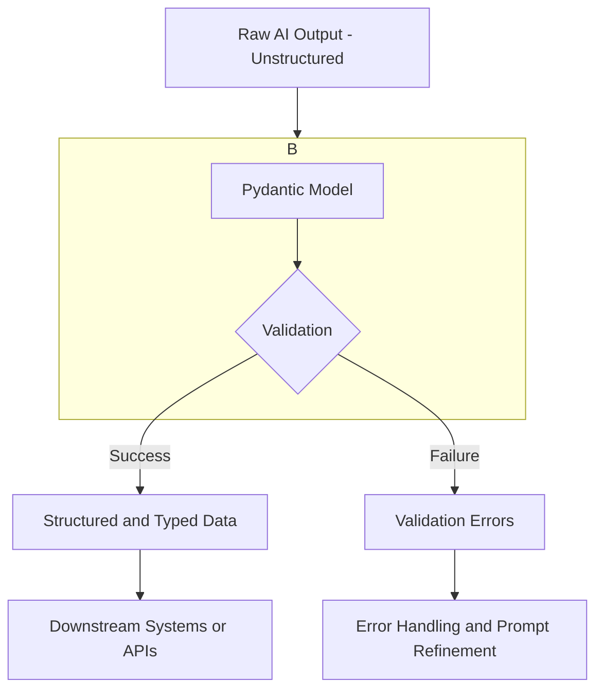

# LLM Structured Outputs: A Deep Dive
### Tame LLM chaos with structured outputs

## Why Structured Outputs are the Key to Reliable LLM Applications

Large Language Models (LLMs) are powerful, but they operate in a world of probabilities. Ask for the same thing twice, and you might get two different answers. This unpredictability creates a major headache when you integrate LLMs into traditional software. Your applications expect deterministic and reliable behavior. If your system needs to parse an LLM's output for another component, you cannot just hope it's in the right format.

This is where structured outputs become essential. By forcing an LLM to respond in a predefined format like JSON or YAML, we build a reliable bridge. This bridge connects the model's probabilistic nature with the deterministic world of our applications. Using structured data formats, which can be easily parsed into Pydantic models, allows us to validate information, check data types, and handle it programmatically. This avoids writing fragile parsers.

Mastering structured outputs is not just a convenience; it's a fundamental skill for any AI Engineer building production-grade applications. It’s how we tame the chaos of LLMs and make them dependable components in a larger software system.

## Understanding Why Structured Outputs Are Critical

Relying on raw, unstructured LLM output is a recipe for production failures. It often involves writing complex and brittle regular expressions or string-parsing logic, which can easily break if the model slightly changes its phrasing. This approach is neither scalable nor reliable.

Structured outputs provide a consistent and machine-readable format, making the LLM’s output easy to parse and integrate with downstream systems like databases or APIs [3, 4]. Instead of dealing with a blob of text, you can work with clean Python objects, accessing the data you need through simple attribute lookups. This consistency also significantly improves the maintainability of your code, reducing the time spent on debugging minor LLM output variations.

The key advantage comes from combining structured outputs with a validation library like Pydantic. Pydantic allows you to define your desired data structure as a Python class, complete with type hints and validation rules [1, 6]. This gives you out-of-the-box data and type validation, ensuring the LLM's output not only has the right structure but also contains the right kind of data [3]. If the output is malformed or contains incorrect types, Pydantic raises a clear error, preventing bad data from corrupting your system.

This capability unlocks several critical use cases. For example, you can perform reliable entity extraction from text to populate a knowledge graph, a key step in building advanced Retrieval-Augmented Generation (GraphRAG) systems. Structured outputs also allow you to format LLM outputs for specific downstream tasks, such as populating dashboards or generating reports. You can also use them as a more robust alternative to function calling when your primary goal is pure data extraction rather than executing an action [5].

The following diagram illustrates how raw, unstructured AI output is transformed into validated, structured data that can be safely used by other systems.


*Figure 1: Transforming raw AI output into validated, structured data using Pydantic.*

## Implementing Structured Outputs from Scratch Using JSON

To fully grasp how structured outputs work, let's start by implementing them from scratch. This approach is crucial for situations where you work with models lacking native features or when you need more granular control. The most straightforward method involves prompt engineering to instruct an LLM to return its response in JSON format.

The core idea is to be explicit in your prompt. You must tell the model not only what information to extract but also to format that information as a single, valid JSON object [4]. Providing an example of the desired JSON schema directly in the prompt is a highly effective technique, as it gives the model a clear template to follow and increases the chance of getting a well-formed output.

Let's walk through a practical example. Imagine we have a financial document and want to extract key metadata. First, we define the document that will serve as the input for our LLM.

```python
DOCUMENT = """
# Q3 2023 Financial Performance Analysis

The Q3 earnings report shows a 20% increase in revenue and a 15% growth in user engagement, 
beating market expectations. These impressive results reflect our successful product strategy 
and strong market positioning.

Our core business segments demonstrated remarkable resilience, with digital services leading 
the growth at 25% year-over-year. The expansion into new markets has proven particularly 
successful, contributing to 30% of the total revenue increase.

Customer acquisition costs decreased by 10% while retention rates improved to 92%, 
marking our best performance to date. These metrics, combined with our healthy cash flow 
position, provide a strong foundation for continued growth into Q4 and beyond.
"""
```

Next, we construct a prompt with clear instructions to output a JSON object. A good practice is to wrap distinct parts of your prompt, like the schema example and the document, in XML tags (e.g., `<json>` and `<document>`). This helps the model differentiate between instructions and the content it needs to process.

```python
prompt = f"""
Analyze the following document and extract metadata from it. 
The output must be a single, valid JSON object with the following structure:
<json>
{{
    "summary": "A concise summary of the article.", 
    "tags": ["list", "of", "relevant", "tags"], 
    "keywords": ["list", "of", "key", "concepts"],
    "quarter": "Q3",
    "growth_rate": "15%",
}}
</json>

Here is the document:
<document>
{DOCUMENT}
</document>
"""
```

After sending the prompt, the model's response will contain a JSON string, often wrapped in markdown code blocks. We need a simple helper function to clean this up before parsing.

```python
import json

def extract_json_from_response(response: str) -> dict:
    """
    Extracts JSON from a response string that is wrapped in <json> or ```json tags.
    """
    response = response.replace("<json>", "").replace("</json>", "")
    response = response.replace("```json", "").replace("```", "")
    return json.loads(response)

# Assuming 'response' is the object returned from the LLM call
parsed_response = extract_json_from_response(response.text)
print(type(parsed_response))
# <class 'dict'>
```

With the cleaned string, we use Python's built-in `json.loads()` to parse it into a dictionary. The LLM's output is now in a structured format that we can work with in our code.

💡 **A quick note on formats:** While JSON is universally supported, it can be verbose. For applications where token count is a concern, consider a more concise format like YAML. YAML can be significantly more token-efficient for LLM generation, leading to faster and cheaper responses [2]. This is because its indentation-based structure is more efficient for models to tokenize than JSON's brackets. You can ask the model for YAML output and then convert it to JSON in your application code to get the best of both worlds.

Here's a comparison of JSON and YAML efficiency in LLM outputs:


*Figure 2: JSON vs. YAML response time comparison.*


*Figure 3: JSON vs. YAML token count comparison.*


*Figure 4: Runtime and token usage table.*


*Figure 5: Runtime and token usage charts.*

## Upgrading to Pydantic for Automatic Validation

Using raw JSON dictionaries is a good start, but they have significant limits. Dictionaries don't enforce data types or a fixed schema, demanding manual validation that is prone to errors.

Pydantic provides a robust, industry-standard solution for data validation in Python [3]. It allows you to define data structures as type-hinted classes, which serve as a single source of truth for your schema. Pydantic's out-of-the-box validation automatically raises errors if the LLM's output deviates from your defined types or constraints, protecting downstream systems from invalid data and ensuring the reliability of your application [1, 6].

Let's refactor our previous example using a Pydantic model. We define a `DocumentMetadata` class that mirrors our desired JSON structure. Adding field descriptions provides clearer instructions to the LLM, guiding it to generate more accurate data.

```python
from pydantic import BaseModel, Field

class DocumentMetadata(BaseModel):
    """A class to hold structured metadata for a document."""
    summary: str = Field(description="A concise, 1-2 sentence summary of the document.")
    tags: list[str] = Field(description="A list of 3-5 high-level tags relevant to the document.")
    keywords: list[str] = Field(description="A list of specific keywords or concepts mentioned.")
    quarter: str = Field(description="The quarter of the financial year described in the document (e.g, Q3 2023).")
    growth_rate: str = Field(description="The growth rate of the company described in the document (e.g, 10%).")
```

Instead of manually writing a JSON example, we can programmatically generate a JSON Schema from our `DocumentMetadata` model and inject it into the prompt. This technique is similar to how native APIs like Gemini or OpenAI ensure structured output.

```python
import json

schema = DocumentMetadata.model_json_schema()

prompt = f"""
Please analyze the following document and extract metadata from it. 
The output must be a single, valid JSON object that conforms to the following JSON Schema:
<json>
{json.dumps(schema, indent=2)}
</json>

Here is the document:
<document>
{DOCUMENT}
</document>
"""
```

After receiving the response and parsing the JSON into a dictionary, we validate it against our Pydantic model. This step immediately catches any deviations from the expected schema.

```python
# Assuming 'parsed_response' is the dictionary from the LLM
try:
    document_metadata = DocumentMetadata.model_validate(parsed_response)
    print("Validation successful!")
    print(type(document_metadata))
    # <class '__main__.DocumentMetadata'>
except Exception as e:
    print(f"Validation failed: {e}")
```

If validation succeeds, we get a `DocumentMetadata` object with neatly organized and type-checked data. This Pydantic object acts as the perfect, reliable bridge between the LLM and your Python application, ready for further processing.

## Using Native Structured Outputs with Gemini and Pydantic

So far, we have implemented structured outputs from scratch. While this is a great way to understand the mechanics, leveraging the native features of LLM APIs is a better approach for production systems. Modern models like Google's Gemini offer built-in capabilities to enforce structured outputs, which is more reliable and efficient than manual prompt engineering.

Using a native API is more accurate because the model is specifically designed to handle these requests. When you configure a schema directly on the model, it constrains the output to strictly adhere to your defined structure, leading to more deterministic responses [7].

This approach is also more cost-effective. You no longer need to include lengthy JSON examples or schemas in your prompt. Instead, the schema is passed as a configuration parameter, which reduces input token usage and leads to efficiency gains at scale [7].

Let's see how to achieve this with the Gemini API and our Pydantic model. The `google-generativeai` library allows you to pass your Pydantic class directly into the generation configuration. The library automatically converts the model to a JSON schema and instructs the API to return a conforming response.

The prompt becomes much simpler, as we no longer need to include schema instructions.

```python
from google.generativeai import types

config = types.GenerateContentConfig(response_mime_type="application/json", response_schema=DocumentMetadata)

prompt = f"""
Analyze the following document and extract its metadata.

Document:
--- 
{DOCUMENT}
--- 
"""
```

When we make the API call with this configuration, the Gemini client handles the rest. The response object will contain a `parsed` attribute, which is already a validated Pydantic object. This eliminates the need for manual parsing and validation steps.

```python
# Assuming 'client' is an initialized Gemini client
response = client.models.generate_content(model="gemini-1.5-flash", contents=prompt, generation_config=config)

# The response is already a Pydantic object, no parsing or validation needed
document_metadata = response.parsed
print(type(document_metadata))
# <class '__main__.DocumentMetadata'>
```

This approach is far more direct and robust. For building reliable AI applications, leveraging the native structured output capabilities of your chosen LLM provider is almost always the best path forward.

## Conclusion

Building reliable applications on top of LLMs requires bridging their probabilistic nature with the deterministic needs of software. Structured outputs are the most effective tool we have for creating that bridge.

We've walked through the entire process, starting from the ground up by forcing JSON output with careful prompt engineering. We then leveled up by using Pydantic to define schemas and automatically validate the model's output, creating a robust and type-safe data pipeline. Finally, we saw how to leverage the native capabilities of modern APIs like Gemini to achieve the same result with less effort and greater reliability.

Whether you're implementing it from scratch to gain a deeper understanding or using a native API for production efficiency, mastering structured outputs is a non-negotiable skill. It’s what separates a fragile prototype from a scalable, production-ready AI system.

## References

- [1] [From Chaos to Order: Structured JSON with Pydantic and Instructor in LLMs](https://blog.kusho.ai/from-chaos-to-order-structured-json-with-pydantic-in-llms/)
- [2] [YAML vs. JSON: Which Is More Efficient for Language Models?](https://betterprogramming.pub/yaml-vs-json-which-is-more-efficient-for-language-models-5bc11dd0f6df)
- [3] [Enforce and validate LLM output with Pydantic](https://xebia.com/blog/enforce-and-validate-llm-output-with-pydantic/)
- [4] [Prompts Masterclass: Output Formatting (JSON)](https://pub.aimind.so/prompts-masterclass-output-formatting-json-5-3a5c177a9095)
- [5] [Extract entities by using structured outputs in Azure OpenAI Service](https://learn.microsoft.com/en-us/azure/developer/ai/how-to/extract-entities-using-structured-outputs)
- [6] [Pydantic Models Usage](https://docs.pydantic.dev/1.10/usage/models/)
- [7] [Structured output - Gemini API](https://ai.google.dev/gemini-api/docs/structured-output)