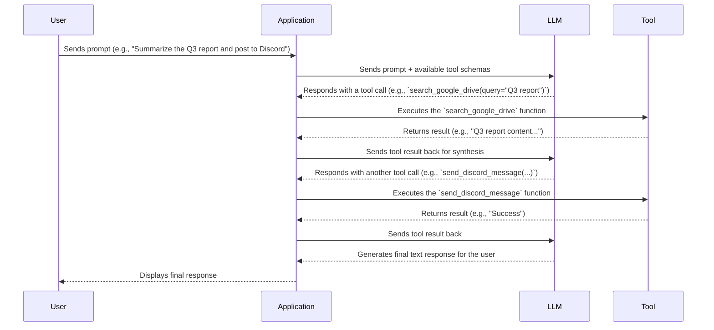
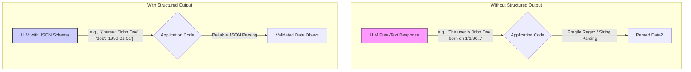

# Agent Tools, Function Calling & Structured Outputs
### From scratch

## From Text Generators to Action Takers: A Guide to LLM Tools and Structured Outputs

This article will explore how to transform Large Language Models (LLMs) from passive text generators into active agents that can interact with the world. We'll examine why LLMs need 'tools' to access real-time information, execute code, and connect to external systems. You will learn the fundamental mechanics of how an LLM decides to use a tool and how to implement this capability from scratch. Furthermore, we will cover the critical concept of 'structured outputs,' ensuring the data you get back from the LLM is reliable, predictable, and ready for programmatic use in your applications.

## Understanding Why Agents Need Tools

At their core, LLMs are sophisticated text generators. They are trained on vast datasets to predict the next word in a sequence, which makes them excellent at tasks like writing, summarizing, and translation. However, this is also their fundamental limitation. An LLM, by itself, is a closed system. It has no awareness of events that occurred after its training data was collected, no ability to browse the internet for today's weather, and no capacity to execute a single line of code or query your company's database [1](https://dev.to/ahikmah/limitations-of-large-language-models-unpacking-the-challenges-1g16). Without a connection to the outside world, an LLM is just a well-read conversationalist locked in a room.

This is where tools come in. Tools are the essential bridge that connects an agent's reasoning capabilities to the real world. They are simply functions or APIs that the agent's orchestrator can execute on the LLM's behalf. Think of tools as the agent's hands and senses. While the LLM acts as the brain, making decisions and formulating plans, the tools are what allow it to perceive new information and take action. For instance, a `get_weather` tool allows the agent to "sense" the current weather, and a `send_email` tool gives it "hands" to communicate externally.

Without tools, an LLM can only talk about what it knows from its training data. It might know what a weather report looks like, but it can't give you a real one. It can generate code, but it can't run it to see the result. Tools overcome these limitations by allowing the LLM to delegate tasks it cannot perform. The LLM determines *what* needs to be done, selects the appropriate tool, and specifies the necessary parameters. Your application then executes that tool and feeds the result back to the LLM, completing the loop and empowering it to act on real-time, external information [2](https://hatchworks.com/blog/gen-ai/large-language-models-guide/).

## Implementing Tool Calls From Scratch

To truly understand how agents use tools, we need to open the black box and see the mechanics for ourselves. The process isn't magic; it's a straightforward request-execute-respond flow between the LLM and your application code. The LLM suggests a tool to use, your code runs it, and the result is sent back to the LLM for the final response.

Here is a diagram illustrating this fundamental loop:



Let's break down this process step-by-step with a from-scratch implementation.

First, we define the tools our agent can use. These are just regular Python functions.

```python
import json

def search_google_drive(query: str) -> str:
    """
    Searches for a file on Google Drive and returns its content or a summary.

    Args:
        query (str): The search query to find the file, e.g., 'Q3 earnings report'.

    Returns:
        str: A JSON string representing the search results.
    """
    print(f"---> Searching Google Drive for: '{query}'")
    if "q3 earnings report" in query.lower():
        return json.dumps({
            "files": [{
                "name": "Q3_Earnings_Report_2024.pdf",
                "summary": "The Q3 earnings report shows a 20% increase in revenue...",
            }]
        })
    return json.dumps({"files": []})

def send_discord_message(channel_id: str, message: str) -> str:
    """
    Sends a message to a specific Discord channel.

    Args:
        channel_id (str): The ID of the channel to send the message to.
        message (str): The content of the message to send.

    Returns:
        str: A JSON string confirming the action.
    """
    print(f"---> Sending message to Discord channel '{channel_id}': '{message}'")
    return json.dumps({"status": "success"})
```

Next, we create a schema—a structured description—for each tool. This schema is what the LLM will see, and it's critical for helping the model understand what the tool does and what parameters it requires. A clear and descriptive schema is the most important factor in ensuring the LLM selects the right tool for the job [3](https://platform.openai.com/docs/guides/function-calling).

```python
# Create schemas for the LLM
search_google_drive_declaration = {
    "name": "search_google_drive",
    "description": "Searches for a file on Google Drive and returns its content or a summary.",
    "parameters": {
        "type": "object",
        "properties": {
            "query": {
                "type": "string",
                "description": "The search query to find the file, e.g., 'Q3 earnings report'.",
            }
        },
        "required": ["query"],
    },
}

send_discord_message_declaration = {
    "name": "send_discord_message",
    "description": "Sends a message to a specific Discord channel.",
    "parameters": {
        "type": "object",
        "properties": {
            "channel_id": {"type": "string", "description": "The ID of the channel..."},
            "message": {"type": "string", "description": "The content of the message..."},
        },
        "required": ["channel_id", "message"],
    },
}

TOOLS_SCHEMA = [search_google_drive_declaration, send_discord_message_declaration]
TOOLS_BY_NAME = {
    "search_google_drive": search_google_drive,
    "send_discord_message": send_discord_message,
}
```

Now, the LLM decides which tool to use. We send the user's prompt along with the tool schemas to the model. The LLM analyzes the request and, if it determines a tool is needed, it will generate a structured response—typically a JSON object—containing the name of the function to call and the arguments to pass to it. It does not execute the function; it only tells us *what* to execute.

When we ask the LLM to find the Q3 earnings report and send a summary to the `#finance` channel, it correctly identifies that it first needs to call `search_google_drive`.

```python
# The LLM's response will be a string containing a JSON object
llm_response_text = '{"name": "search_google_drive", "args": {"query": "Q3 earnings report"}}'

# We parse this string to get the tool call information
tool_call = json.loads(llm_response_text)
print(tool_call)
# Output: {'name': 'search_google_drive', 'args': {'query': 'Q3 earnings report'}}
```

It's our application's turn to act. We parse the JSON from the LLM, identify the function name (`search_google_drive`), and look up the corresponding Python function in our `TOOLS_BY_NAME` dictionary. We then execute that function using the arguments provided by the LLM.

```python
# Execute the tool call
tool_name = tool_call["name"]
tool_args = tool_call["args"]
tool_handler = TOOLS_BY_NAME[tool_name]
tool_result = tool_handler(**tool_args)

print(tool_result)
# Output: ---> Searching Google Drive for: 'Q3 earnings report'
# {"files": [{"name": "Q3_Earnings_Report_2024.pdf", "summary": "The Q3 earnings report shows a 20% increase in revenue..."}]}
```

Finally, we send the result from the tool back to the LLM. This gives the model the information it needs to complete the user's original request. The LLM now has the content of the earnings report and can proceed to the next step: calling the `send_discord_message` tool or formulating a final answer for the user. This loop continues until the entire task is complete.

## Implementing Tool Calls with Gemini

Implementing the tool-calling loop from scratch is a great way to understand the mechanics, but in practice, you'll use a library that streamlines the process. Major model providers like Google, OpenAI, and Anthropic offer APIs that handle much of the boilerplate for you [4](https://leehanchung.github.io/blogs/2024/05/09/tools-for-llms/).

Let's refactor our previous example using the `google-genai` library for Gemini. The core logic remains the same—define tools, let the LLM choose, execute, and return the result—but the implementation is much cleaner. The library handles the formatting of tool schemas, parsing the LLM's response, and managing the conversation history.

First, we define our tools and configuration. Instead of manually creating JSON schemas, we can pass our Python functions directly, and the library can often infer the schema from the function signature and docstring.

```python
from google.genai import types

# The Python functions (search_google_drive, send_discord_message) are the same
# The library can generate declarations from the functions themselves
tools = types.Tool.from_functions([search_google_drive, send_discord_message])

config = types.GenerateContentConfig(
    tools=[tools],
    tool_config=types.ToolConfig(
        function_calling_config=types.FunctionCallingConfig(mode="ANY")
    ),
)
```

Next, we start the conversation loop. We send the user's prompt to the model. The Gemini API returns a response object that contains a `function_call` attribute if the model decides to use a tool. This object gives us the tool name and arguments directly, so we don't need to parse JSON strings.

```python
import google.generativeai as genai
client = genai.GenerativeAIClient() # Authenticated client

USER_PROMPT = "Please find the Q3 earnings report on Google Drive and send a summary of it to the #finance channel on Discord."

# Start the conversation
model = client.get_generative_model(model="gemini-1.5-flash-latest")
chat = model.start_chat(enable_automatic_function_calling=True)
response = chat.send_message(USER_PROMPT)

# The library handles the loop automatically.
# It detects the tool call, executes our Python function,
# sends the result back to the model, and gets the final answer.

print(response.text)
# Output: ---> Searching Google Drive for: 'q3 earnings report'
# ---> Sending message to Discord channel '#finance': 'The Q3 earnings report shows a 20% increase in revenue...'
# I have found the Q3 earnings report and sent a summary to the #finance channel on Discord.
```

By setting `enable_automatic_function_calling=True`, the `google-genai` library manages the entire multi-step execution loop for us. It detects the first tool call (`search_google_drive`), executes our local Python function, sends the result back to the model, detects the second tool call (`send_discord_message`), executes it, and finally synthesizes the final text response. This declarative approach significantly simplifies the code while following the same underlying principles we implemented from scratch.

## Why Agents Need Structured Outputs

While tools allow an LLM to perform actions, we often just need it to extract information in a predictable, machine-readable format. Relying on an LLM's free-text output for data extraction is a recipe for failure. The model might change its wording slightly, add extra conversational text, or omit a piece of information, breaking any string parsing or regular expressions you have in place.

Structured outputs solve this problem by forcing the LLM to return its response in a specific format, most commonly JSON. This ensures the output is reliable and can be directly consumed by your application without fragile post-processing [5](https://platform.openai.com/docs/guides/structured-outputs).

The concept is simple: instead of getting a messy, unpredictable string, you get a clean, validated data object.



The primary use case for structured outputs is entity extraction. For example, you can give the model a raw text document, like an invoice or a resume, and a JSON schema defining the fields you want to extract (e.g., `invoice_number`, `total_amount`, `candidate_name`, `years_of_experience`). The model will then read the document and populate the JSON object with the extracted data. This is far more robust than trying to find these values yourself in the text.

You can also use structured outputs to format data for downstream tasks. If you need to populate a database, render a UI component, or call another API, you can define a schema that matches the required input format. This turns the LLM into a reliable data transformation engine, bridging the gap between unstructured text and the structured systems your application relies on [6](https://openai.com/index/introducing-structured-outputs-in-the-api/).

## Implementing Structured Outputs From Scratch with JSON

The most direct way to implement structured outputs is by explicitly telling the LLM to generate JSON. This involves two key steps: modifying the prompt to include instructions and the desired JSON schema, and configuring the model to enforce a JSON output format. This "from-scratch" method gives you a clear understanding of what's happening under the hood.

First, we'll start with a piece of unstructured text, like an article, that we want to analyze. Our goal is to extract a summary, a list of tags, and relevant keywords.

```python
document = """
# Article: The Rise of AI Agents

This article discusses the recent advancements in AI, focusing on autonomous agents. 
We explore how Large Language Models (LLMs) are moving beyond simple text generation 
to perform complex, multi-step tasks. Key topics include the ReAct framework, 
the importance of tool use, and the challenges of long-term planning.
"""
```

Next, we construct a detailed prompt. This is the most critical part. We must clearly instruct the model that its output *must* be a single, valid JSON object. To guide it, we provide an example of the schema we expect, defining the keys (`summary`, `tags`, `keywords`) and the type of data for each. This prompt engineering is essential to coax the model into generating the correct structure.

```python
prompt = f"""
Please analyze the following document and extract metadata from it. 
The output must be a single, valid JSON object with the following structure:
{{ "summary": "A concise summary of the article.", "tags": ["list", "of", "relevant", "tags"], "keywords": ["list", "of", "key", "concepts"] }}

Document:
--- 
{document}
--- 
"""
```

Finally, we make the API call. To ensure the output is actually JSON, we use a specific configuration parameter. For instance, with Google's Gemini API, we set `response_mime_type="application/json"`. This tells the model to constrain its output to be a syntactically correct JSON string. Without this, the model might still add conversational text around the JSON object, which would break our parsing logic.

```python
import google.generativeai as genai
from google.genai import types
import json

client = genai.GenerativeAIClient()
model = client.get_generative_model(model="gemini-1.5-flash-latest")

# Configure the model to output JSON
config = types.GenerateContentConfig(response_mime_type="application/json")

response = model.generate_content(contents=prompt, generation_config=config)

print("--- Raw LLM Output ---")
print(response.text)

# You can now reliably parse the JSON string
metadata_obj = json.loads(response.text)

print("\n--- Parsed JSON Object ---")
print(metadata_obj)
```

The output from the LLM will be a clean JSON string, which we can then easily load into a Python dictionary using `json.loads()`. This dictionary is a reliable, structured object that can be used programmatically in the rest of our application. This approach is simple and effective for many use cases, but as we'll see next, we can make it even more robust and maintainable using dedicated data validation libraries.

## A Better Approach: Structured Outputs with Pydantic

While manually crafting JSON schemas in prompts works, it has its drawbacks. The schema is just a string in a prompt, disconnected from your application's data model. A more robust and Pythonic way to handle structured data is with Pydantic, the standard library for data validation in Python.

Pydantic allows you to define your data structures as classes, providing a single source of truth for your schema. This approach offers automatic type checking and validation, making your code safer and easier to maintain. Let's refactor our metadata extraction example using a Pydantic model.

First, we define our `DocumentMetadata` class. The class attributes, types, and field descriptions serve as a clear, executable schema.

```python
from pydantic import BaseModel, Field
from typing import List

class DocumentMetadata(BaseModel):
    """A class to hold structured metadata for a document."""
    summary: str = Field(description="A concise, 1-2 sentence summary of the document.")
    tags: List[str] = Field(description="A list of 3-5 high-level tags.")
    keywords: List[str] = Field(description="A list of specific keywords mentioned.")
```

Now we have two powerful ways to use this Pydantic model to enforce structured output.

The first technique is to inject the Pydantic model's JSON Schema directly into the prompt. Pydantic can automatically generate a schema from our class. We then place this schema in the prompt, just as we did manually, to guide the LLM. The key benefit is that after getting the response, we can use `DocumentMetadata.model_validate_json()` to parse and validate the output in one step. If the LLM's output doesn't conform to the schema, Pydantic will raise an error.

A second, more elegant technique is to register the Pydantic model as a tool. This is especially useful in agentic workflows where you want the agent's *final* output to be a structured object. We create a "tool" whose sole purpose is to hold our structured data. We then ask the LLM to call this tool with the extracted information. The arguments of the function call become our validated Pydantic object.

```python
# The Pydantic class 'DocumentMetadata' is now our 'tool'
extraction_tool = types.Tool.from_model(DocumentMetadata)

config = types.GenerateContentConfig(
    tools=[extraction_tool],
    tool_config=types.ToolConfig(
        function_calling_config=types.FunctionCallingConfig(mode="ANY")
    ),
)
# The rest of the API call is similar to the tool-calling example
```

This method combines the best of both worlds: the action-oriented nature of tools and the validation power of Pydantic. It provides a clean, reliable way to ensure the data you extract from an LLM is always in the exact format your application expects.

## Industry-Grade Structured Outputs: Gemini with Pydantic

Modern LLM APIs have started to offer native support for Pydantic, providing the most streamlined and reliable way to enforce structured outputs. With the Gemini API, you can directly pass a Pydantic model as the desired `response_schema`.

This approach removes the need for manual prompt injection or tool-based workarounds. You simply define your Pydantic class and tell the API to use it as the output format. The library handles the schema generation, prompting, and validation for you, returning a parsed Pydantic object directly. This is the current best practice for production-grade AI systems.

```python
from google.genai import types

# The Pydantic model is the same as before
# class DocumentMetadata(BaseModel): ...

config = types.GenerateContentConfig(
    response_mime_type="application/json",
    response_schema=DocumentMetadata # Pass the Pydantic class directly
)

prompt = f"""
Please analyze the following document and extract its metadata.

Document:
--- 
{document}
--- 
"""

response = client.models.generate_content(
    model="gemini-1.5-flash-latest",
    contents=prompt,
    config=config
)

# The response.parsed attribute will contain the validated Pydantic object
validated_metadata = response.parsed
print(validated_metadata)
```

## An Overview of Essential Agent Tools

As you build more complex agents, you'll encounter several categories of tools that are commonly used across the industry. Understanding these categories will help you equip your agents with the right capabilities for a wide range of tasks.

The first and most fundamental category is **Knowledge & Memory Access**. LLMs have knowledge cutoffs and lack access to your private data. Retrieval-Augmented Generation (RAG) tools solve this by connecting the agent to external knowledge bases. When a user asks a question, a RAG tool can query a vector database or document store to find relevant information and provide it to the LLM as context [7](https://sam-solutions.com/blog/llm-agent-architecture/). Similarly, database query tools allow an agent to construct and execute SQL queries, enabling it to interact with structured data in traditional databases.

Next are tools for **Web Search & Browsing**. These are essential for any task that requires up-to-date information. By integrating with a search engine API like Google Search or SerpAPI, an agent can find information on current events, look up facts, or research topics in real time. More advanced browsing tools can even fetch and parse the content of web pages, allowing the agent to "read" articles or documentation directly from the internet [8](https://www.truefoundry.com/blog/llm-agents/). This capability transforms the agent from a static knowledge repository into a dynamic researcher.

Perhaps the most powerful category is **Code Execution**. A code interpreter tool, typically a sandboxed Python environment, gives an agent the ability to write and execute code. This is invaluable for tasks that LLMs struggle with, such as precise mathematical calculations, data analysis, or file manipulation. For example, an agent could write a Python script to analyze a CSV file, generate a plot, and save the result. However, this power comes with significant security risks. It is absolutely critical that any code execution happens in a secure, isolated sandbox to prevent the agent from performing malicious actions on the host system [9](https://dida.do/blog/setting-up-a-secure-python-sandbox-for-llm-agents/).

## Conclusion

The true potential of Large Language Models is unlocked when we move them beyond simple text generation and empower them to interact with the world. Tools are the critical component that makes this transformation possible, serving as the hands and senses for an AI agent. They allow an LLM to access real-time data, connect to external APIs, and execute code, turning it into an active participant in digital workflows.

Throughout this article, we've explored the journey from understanding *why* agents need tools to implementing them in practice. We started from scratch to reveal the fundamental request-execute-respond loop and then demonstrated how modern libraries like Gemini streamline this process. Alongside tools, we covered structured outputs, a vital technique for ensuring the data we get from LLMs is reliable and machine-readable, using both basic JSON and the more robust Pydantic for validation. Mastering these concepts is a fundamental step for any engineer looking to build robust, production-ready AI applications that can reason, act, and deliver tangible value.

## References

- [1] [Limitations of Large Language Models: Unpacking the Challenges](https://dev.to/ahikmah/limitations-of-large-language-models-unpacking-the-challenges-1g16)
- [2] [A Developer's Guide to Large Language Models](https://hatchworks.com/blog/gen-ai/large-language-models-guide/)
- [3] [Function calling - OpenAI API](https://platform.openai.com/docs/guides/function-calling)
- [4] [Tools for Large Language Model Agents](https://leehanchung.github.io/blogs/2024/05/09/tools-for-llms/)
- [5] [Structured Outputs - OpenAI API](https://platform.openai.com/docs/guides/structured-outputs)
- [6] [Introducing Structured Outputs in the API | OpenAI](https://openai.com/index/introducing-structured-outputs-in-the-api/)
- [7] [LLM Agent Architecture: A Developer’s Guide](https://sam-solutions.com/blog/llm-agent-architecture/)
- [8] [What are LLM Agents? A Guide to Autonomous AI](https://www.truefoundry.com/blog/llm-agents)
- [9] [Setting Up a Secure Python Sandbox for LLM Agents](https://dida.do/blog/setting-up-a-secure-python-sandbox-for-llm-agents/)