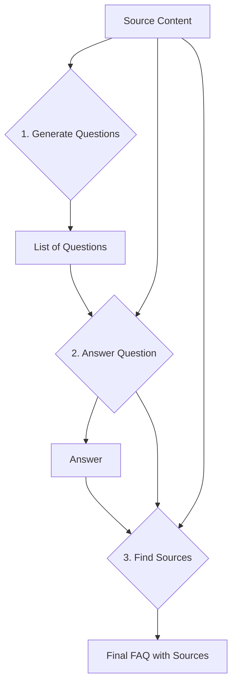
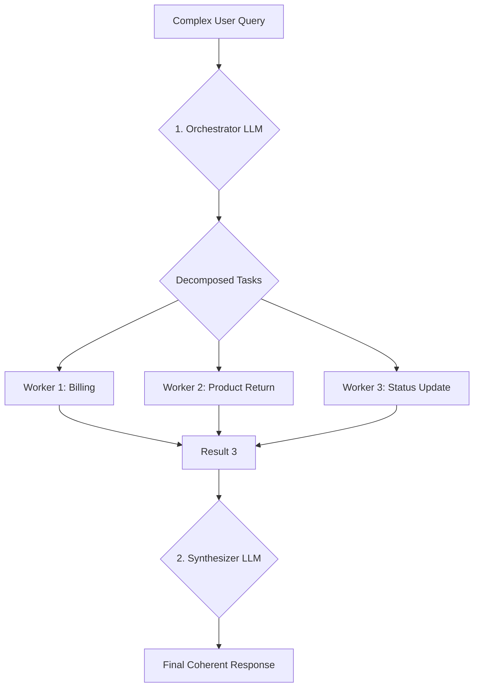

# LLM Workflow Patterns
### Mastering LLM workflows for AI apps

## Introduction

If you have spent any time building with Large Language Models (LLMs), you have likely been tempted to write a single, massive prompt to solve a complex problem. We have certainly encountered this. In the early days, we thought prompt chaining was a unique, state-of-the-art technique for building complex JSON objects. The reality check came when we saw API bills climb rapidly. A system we thought was clever was actually a great way to spend money for worse accuracy.

The truth that many in the AI space are afraid to admit is that treating LLMs as magical black boxes that can solve any complex task with one giant prompt is a recipe for failure. This approach is brittle, hard to debug, and unreliable. To build sophisticated, production-ready AI applications, you must master the art of breaking down problems into smaller, manageable steps—a core principle of good software engineering.

This lesson is about that engineering discipline. We will move away from the hype and focus on the fundamental patterns for building robust LLM workflows. We will start by deconstructing the single-prompt fallacy and then introduce the core building blocks: sequential chaining, parallelization, routing, and the orchestrator-worker pattern. Mastering these techniques is the first real step toward building everything from simple, deterministic workflows to the advanced AI agents we will explore later in this course.

## The Challenge with Complex Single LLM Calls

Attempting to solve a multi-step problem with a single, complex Large Language Model (LLM) call is an anti-pattern. While it might seem efficient, it introduces a host of engineering challenges that make your system fragile and difficult to maintain. When the LLM inevitably fails, where do you start debugging? A monolithic prompt gives you no visibility into the intermediate steps, making it nearly impossible to pinpoint the source of an error. This lack of modularity means a small change to one part of the instruction can have unpredictable effects on the entire output.

Furthermore, long prompts are susceptible to the "lost in the middle" problem. The model pays less attention to instructions buried deep in a large context window, leading to parts of your request being ignored [[1]](https://arxiv.org/html/2410.23884v1). Models can also struggle with output consistency, hallucinating formats or labels that were not requested, which undermines any downstream automation [[2]](https://arxiv.org/pdf/2309.08181). In short, you trade control and reliability for a false sense of simplicity.

Let's make this concrete with a practical example. Imagine we want to generate a Frequently Asked Questions (FAQ) page from a few documents about renewable energy.

First, let's set up our environment. We will use the Google Gemini library throughout this lesson.
```python
# Import key packages
import asyncio
from enum import Enum
import random
import time

from pydantic import BaseModel, Field
from google import genai
from google.genai import types

# Initialize the Gemini Client
client = genai.Client()

# Define model constant
MODEL_ID = "gemini-2.5-flash"
```
Next, we will define our source documents. For brevity, we will just show the titles and a high-level description.
```python
# Mock data for our sources
webpage_1 = {
    "title": "The Benefits of Solar Energy",
    "content": "Content about environmental and economic benefits of solar power...",
}

webpage_2 = {
    "title": "Understanding Wind Turbines",
    "content": "Content about how wind turbines work, and their challenges like intermittency...",
}

webpage_3 = {
    "title": "Energy Storage Solutions",
    "content": "Content about the importance of energy storage like batteries for renewables...",
}

all_sources = [webpage_1, webpage_2, webpage_3]

# Combine the content for the LLM to process
combined_content = "\n\n".join(
    [f"Source Title: {source['title']}\nContent: {source['content']}" for source in all_sources]
)
```
Now, let's build our single, complex prompt. We will ask the model to generate questions, provide answers, and cite the sources, all in one go. We will use Pydantic for structured output, a concept we covered in Lesson 4.
```python
# Pydantic classes for structured outputs
class FAQ(BaseModel):
    """A FAQ is a question and answer pair, with a list of sources used to answer the question."""
    question: str = Field(description="The question to be answered")
    answer: str = Field(description="The answer to the question")
    sources: list[str] = Field(description="The sources used to answer the question")

class FAQList(BaseModel):
    """A list of FAQs"""
    faqs: list[FAQ] = Field(description="A list of FAQs")

# The complex prompt that tries to do everything at once
n_questions = 10
prompt_complex = f"""
Based on the provided content from three webpages, generate a list of exactly {n_questions} frequently asked questions (FAQs).
For each question, provide a concise answer derived ONLY from the text.
After each answer, you MUST include a list of the 'Source Title's that were used to formulate that answer.

<provided_content>
{combined_content}
</provided_content>
""".strip()

# Generate FAQs
config = types.GenerateContentConfig(
    response_mime_type="application/json",
    response_schema=FAQList
)
response_complex = client.models.generate_content(
    model=MODEL_ID,
    contents=prompt_complex,
    config=config
)
result_complex = response_complex.parsed
```
Here’s a sample of the output we might get:
```json
{
  "question": "Why is energy storage essential for renewable energy sources like solar and wind, and what are the common types of large-scale storage solutions?",
  "answer": "Effective energy storage is key to unlocking the full potential of renewable sources because it allows storing excess energy when plentiful and releasing it when needed, which is essential for a stable power grid.",
  "sources": [
    "Energy Storage Solutions"
  ]
}
```
At first glance, this output looks pretty good. The question is relevant, and the answer is accurate. However, looking closer, we can spot a subtle but significant failure. The answer mentions that storage is key for "solar and wind," but it only cites "Energy Storage Solutions" as the source.

The context about wind energy's intermittency, which makes storage so important, actually comes from the "Understanding Wind Turbines" document. The LLM missed a source.

This is a classic example of why single-prompt solutions are unreliable. In a simple FAQ, a missed citation is a minor error. In a production system handling legal documents or financial reports, such an inaccuracy could have serious consequences. To build robust systems, we need a more disciplined, modular approach.

## The Power of Modularity: Why Chain LLM Calls?

The engineering solution to the unreliability of complex prompts is a "divide-and-conquer" strategy known as prompt chaining. Instead of asking a Large Language Model (LLM) to perform multiple distinct tasks at once, we break down the problem into a sequence of smaller, simpler steps. Each step is a focused LLM call, and the output of one step becomes the input for the next, forming a chain. This approach mirrors how we, as humans, tackle complex problems: by breaking them into manageable sub-problems and solving them one by one. This systematic decomposition is a fundamental principle of good software engineering, now applied to LLM workflows.

This modular approach brings several key benefits, moving us from hopeful prompting to deliberate engineering. It transforms an unpredictable process into a structured, controllable pipeline [[3]](https://www.vellum.ai/blog/what-is-prompt-chaining).

First, it dramatically improves **modularity and debuggability**. Each link in the chain is an isolated component with a clear, single responsibility. If the final output is wrong, you do not have to guess what went wrong in a massive prompt. You can inspect the output of each intermediate step, pinpoint the exact point of failure, and fix it. This makes the system far easier to maintain and improve over time, as changes to one step are less likely to break others [[4]](https://dev.to/kapusto/enhancing-large-language-model-performance-with-prompt-chaining-2p84).

Second, accuracy often increases. A simpler, more focused prompt is easier for the LLM to understand and execute correctly. By asking the model to do one thing at a time, like generating questions first, then answering them, then finding sources, we reduce the cognitive load and minimize the chance of instructions being missed or misinterpreted. This leads to more reliable and consistent outputs [[5]](https://www.voiceflow.com/blog/prompt-chaining).

Third, chaining offers greater **flexibility**. You can use different models or configurations for different steps in the chain. For a simple classification task, a fast, inexpensive model like Haiku might be sufficient. For a complex reasoning step, you can switch to a more powerful model like Opus. This allows you to optimize your workflow for cost, latency, and quality, using the right tool for the right job [[3]](https://www.vellum.ai/blog/what-is-prompt-chaining).

However, prompt chaining is not a silver bullet. It introduces its own set of trade-offs. The most obvious are increased **latency and cost**; you are making multiple API calls instead of one. Each call adds to the total execution time and the final bill, which can quickly accumulate for high-volume applications [[6]](https://blog.promptlayer.com/what-is-prompt-chaining/).

There is also a risk of **information loss** between steps. If an early step in the chain produces a summary, for example, important details might be dropped, leading to a degraded final output that lacks the richness of the original information. This can also manifest as "cascading undesired responses" if an unpredictable output from one step propagates errors downstream [[7]](https://www.humanfirst.ai/blog/prompt-chaining).

Finally, managing the "glue code" that connects the steps can add engineering complexity, especially as chains become longer and more intricate [[8]](https://ai.plainenglish.io/prompt-chaining-is-dead-long-live-prompt-stuffing-58a1c08820c5). This requires careful design and maintenance to ensure smooth data flow and error handling between distinct LLM calls, increasing the overall management difficulty of the system [[9]](https://aisdr.com/blog/what-is-prompt-chaining/). Despite these drawbacks, the control, reliability, and debuggability gained from a modular approach almost always outweigh the convenience of a single prompt for any non-trivial task.

## Building a Sequential Workflow: FAQ Generation Pipeline

Now, let's apply the theory of prompt chaining to our FAQ generation problem. We will refactor the single, complex prompt into a clean, three-step sequential workflow. This hands-on example will demonstrate how modularity leads to more reliable and traceable results.

Our pipeline will consist of three distinct functions, each responsible for one part of the task:
1.  **Generate Questions**: Takes the source content and generates a list of relevant questions.
2.  **Answer Questions**: Takes a single question and the source content, and generates a concise answer.
3.  **Find Sources**: Takes a question-answer pair and the source content, and identifies all relevant source documents.

Here is the Mermaid diagram illustrating this flow:

Figure 1: A sequential workflow for generating FAQs. The process is broken into three distinct, chained steps.

Let's implement each of these steps in code.

### Step 1: Generate Questions

First, we create a function dedicated solely to generating questions. The prompt is simple and focused: given the content, produce a list of questions.
```python
class QuestionList(BaseModel):
    """A list of questions"""
    questions: list[str] = Field(description="A list of questions")

prompt_generate_questions = """
Based on the content below, generate a list of {n_questions} relevant and distinct questions that a user might have.

<provided_content>
{combined_content}
</provided_content>
""".strip()

def generate_questions(content: str, n_questions: int = 10) -> list[str]:
    """
    Generate a list of questions based on the provided content.
    """
    config = types.GenerateContentConfig(
        response_mime_type="application/json",
        response_schema=QuestionList
    )
    response_questions = client.models.generate_content(
        model=MODEL_ID,
        contents=prompt_generate_questions.format(n_questions=n_questions, combined_content=content),
        config=config
    )

    return response_questions.parsed.questions

# Test the function
questions = generate_questions(combined_content, n_questions=10)
```
This function gives us a clean list of questions to work with, isolating the first part of our problem.

### Step 2: Answer a Single Question

Next, we build a function to answer one question at a time. Its only job is to generate a concise answer based on the provided content.
```python
prompt_answer_question = """
Using ONLY the provided content below, answer the following question.
The answer should be concise and directly address the question.

<question>
{question}
</question>

<provided_content>
{combined_content}
</provided_content>
""".strip()

def answer_question(question: str, content: str) -> str:
    """
    Generate an answer for a specific question using only the provided content.
    """
    answer_response = client.models.generate_content(
        model=MODEL_ID,
        contents=prompt_answer_question.format(question=question, combined_content=content),
    )
    return answer_response.text

# Test the function with the first generated question
test_question = questions[0]
test_answer = answer_question(test_question, combined_content)
```
This gives us a focused answer for a single question, which we can then pass to the final step.

### Step 3: Find the Sources

Finally, we create a function to identify the sources for a given question-answer pair. This function's prompt asks the model to act as a fact-checker, linking the generated answer back to the original documents.
```python
class SourceList(BaseModel):
    """A list of source titles that were used to answer the question"""
    sources: list[str] = Field(description="A list of source titles that were used to answer the question")

prompt_find_sources = """
You will be given a question and an answer that was generated from a set of documents.
Your task is to identify which of the original documents were used to create the answer.

<question>
{question}
</question>

<answer>
{answer}
</answer>

<provided_content>
{combined_content}
</provided_content>
""".strip()

def find_sources(question: str, answer: str, content: str) -> list[str]:
    """
    Identify which sources were used to generate an answer.
    """
    config = types.GenerateContentConfig(
        response_mime_type="application/json",
        response_schema=SourceList
    )
    sources_response = client.models.generate_content(
        model=MODEL_ID,
        contents=prompt_find_sources.format(question=question, answer=answer, combined_content=content),
        config=config
    )
    return sources_response.parsed.sources

# Test the function
test_sources = find_sources(test_question, test_answer, combined_content)
```
### Executing the Full Sequential Workflow

With our three modular components ready, we can now chain them together in a single pipeline. We'll iterate through each generated question, answer it, find its sources, and then assemble the final FAQ object.
```python
def sequential_workflow(content, n_questions=10) -> list[FAQ]:
    """
    Execute the complete sequential workflow for FAQ generation.
    """
    # 1. Generate questions
    questions = generate_questions(content, n_questions)

    # 2. Answer and find sources for each question sequentially
    final_faqs = []
    for question in questions:
        # Generate an answer for the current question
        answer = answer_question(question, content)

        # Identify the sources for the generated answer
        sources = find_sources(question, answer, content)

        faq = FAQ(
            question=question,
            answer=answer,
            sources=sources
        )
        final_faqs.append(faq)

    return final_faqs

# Execute the workflow and measure its execution time
start_time = time.monotonic()
sequential_faqs = sequential_workflow(combined_content, n_questions=4)
end_time = time.monotonic()
print(f"Sequential processing completed in {end_time - start_time:.2f} seconds")
```
Running this code gives us a result like this:
```
Sequential processing completed in 22.20 seconds
```
And here's one of the resulting FAQ objects, demonstrating the improved accuracy:
```json
{
  "question": "Why is energy storage essential for renewable energy sources like solar and wind, and what are the common types of large-scale storage solutions?",
  "answer": "Energy storage is essential for renewable sources like solar and wind because these sources are intermittent... Storing excess energy... is vital for ensuring a stable and steady supply of electricity... Common types of large-scale storage solutions include pumped-hydro storage and battery technologies, particularly lithium-ion.",
  "sources": [
    "Understanding Wind Turbines",
    "Energy Storage Solutions"
  ]
}
```
Notice the difference. By breaking the problem down, our `find_sources` step correctly identified both "Understanding Wind Turbines" and "Energy Storage Solutions" as sources for the answer. The output is more accurate and, because we can inspect the result of each step, the entire process is more transparent and debuggable. The trade-off is execution time; it took over 20 seconds to process just four questions. This sets the stage for our next topic: optimization.

## Optimizing Sequential Workflows With Parallel Processing

Our sequential workflow, while reliable and easy to trace, comes with a significant drawback: it is slow. The total execution time is the sum of the latencies of all individual Large Language Model (LLM) calls. For tasks where intermediate steps are independent of each other, you can significantly speed things up by running them in parallel. In our FAQ example, once you have the initial list of questions, the process of answering and sourcing for each question is entirely independent of the others. This means you do not need to finish answering Question 1 before you start on Question 2, opening the door for concurrent execution.

Parallelization allows you to execute multiple independent LLM calls concurrently. This dramatically reduces the total processing time from the sum of all calls to the time of the longest single call in a batch. This approach not only boosts speed but also improves resource utilization by keeping your system busy with multiple tasks simultaneously. You can also use parallel processing for ensemble methods, where you generate multiple candidate outputs in parallel. Then, you use a "voting" or aggregation mechanism to select the best, most robust, or most confident answer [[10]](https://arxiv.org/html/2503.15838v2), [[11]](https://cameronrwolfe.substack.com/p/prompt-ensembles-make-llms-more-reliable), [[12]](https://arxiv.org/html/2502.18036v1), [[13]](https://openreview.net/forum?id=OIEczoib6t).

We will refactor our workflow to use parallel processing. First, we need asynchronous versions of our `answer_question` and `find_sources` functions. The core logic remains the same, but we will use `async def` and `await` with the `aio` version of the Gemini client to enable concurrent operations.
```python
async def answer_question_async(question: str, content: str) -> str:
    """
    Async version of answer_question function.
    """
    prompt = prompt_answer_question.format(question=question, combined_content=content)
    response = await client.aio.models.generate_content(
        model=MODEL_ID,
        contents=prompt
    )
    return response.text

async def find_sources_async(question: str, answer: str, content: str) -> list[str]:
    """
    Async version of find_sources function.
    """
    prompt = prompt_find_sources.format(question=question, answer=answer, combined_content=content)
    config = types.GenerateContentConfig(
        response_mime_type="application/json",
        response_schema=SourceList
    )
    response = await client.aio.models.generate_content(
        model=MODEL_ID,
        contents=prompt,
        config=config
    )
    return response.parsed.sources
```
Next, we will create a new processing function that handles a single question by generating its answer and sourcing steps. While finding the sources depends on the answer, these two specific steps must remain sequential for a given question. The true parallelization happens across different questions, allowing you to process many questions at once.
```python
async def process_question_parallel(question: str, content: str) -> FAQ:
    """
    Process a single question by generating an answer and then finding its sources.
    This function will be run in parallel for multiple questions.
    """
    answer = await answer_question_async(question, content)
    sources = await find_sources_async(question, answer, content)
    return FAQ(
        question=question,
        answer=answer,
        sources=sources
    )
```
Now, we can build our main parallel workflow. It starts by synchronously generating the list of questions. Then, it creates a list of asynchronous tasks—one `process_question_parallel` call for each question—and runs them all concurrently using `asyncio.gather()`.
```python
async def parallel_workflow(content: str, n_questions: int = 10) -> list[FAQ]:
    """
    Execute the complete parallel workflow for FAQ generation.
    """
    # Generate questions (this step remains synchronous)
    questions = generate_questions(content, n_questions)

    # Create a list of async tasks to process all questions in parallel
    tasks = [process_question_parallel(question, content) for question in questions]
    parallel_faqs = await asyncio.gather(*tasks)

    return parallel_faqs

# Execute the parallel workflow and measure its execution time
start_time = time.monotonic()
parallel_faqs = await parallel_workflow(combined_content, n_questions=4)
end_time = time.monotonic()
print(f"Parallel processing completed in {end_time - start_time:.2f} seconds")
```
When you run this, the output is striking:
```
Parallel processing completed in 8.98 seconds
```
By parallelizing the independent tasks, we cut the execution time from 22.2 seconds to just under 9 seconds, a more than 2x speedup. For a larger number of questions, the improvement would be even more dramatic. This demonstrates the power of parallelization for optimizing workflows and improving throughput, making your LLM applications more responsive and efficient.

To summarize the trade-offs, sequential processing offers a predictable execution order and is generally easier to debug. However, this comes at the cost of higher total processing time. In contrast, parallel processing significantly reduces overall execution time and makes better use of computational resources. The trade-off is increased complexity in managing concurrent operations and handling potential errors.

⚠️ **A Note on Rate Limits:** This speed comes with new considerations. You must be mindful of the rate limits imposed by your LLM provider, such as requests per minute (RPM) or tokens per minute (TPM). Hitting these limits can lead to `429 Too Many Requests` errors, which production systems must handle gracefully. Best practices include implementing an exponential backoff strategy with jitter, monitoring your quota usage, and managing a request queue to stay within your account's limits [[14]](https://platform.openai.com/docs/guides/rate-limits), [[15]](https://cloud.google.com/vertex-ai/generative-ai/docs/quotas), [[16]](https://learn.microsoft.com/azure/ai-services/openai/quotas-limits), [[17]](https://docs.anthropic.com/en/docs/build-with-claude/rate-limits), [[18]](https://platform.openai.com/docs/guides/error-codes).

## Introducing Dynamic Behavior: Routing and Conditional Logic

Our workflows have been linear so far. Whether sequential or parallel, they follow a fixed path from start to finish. But what if the processing logic needs to change based on the input? For example, in a customer support system, we handle a query about a billing issue differently from a technical support question. Creating a single, massive prompt to handle all possible user intents would be incredibly complex and brittle.

This is where **routing** comes in. Routing is a workflow pattern that introduces conditional logic, or branching. It uses an initial Large Language Model (LLM) call to classify the input and then directs, or "routes," it to a specialized handler or sub-workflow designed for that specific category [[19]](https://docs.aws.amazon.com/prescriptive-guidance/latest/agentic-ai-patterns/workflow-for-routing.html).

Routing is another application of the "divide-and-conquer" principle. Instead of one complex prompt that tries to be a jack-of-all-trades, we create multiple, smaller, expert prompts. A "router" prompt acts as a dispatcher, analyzing the incoming request and deciding which expert is best suited for the job [[20]](https://arize.com/blog/best-practices-for-building-an-ai-agent-router/).

This approach keeps our components modular and specialized. When we optimize the prompt for handling billing inquiries, it will not accidentally degrade performance for technical questions [[21]](https://spring.io/blog/2025/01/21/spring-ai-agentic-patterns). Routing also allows us to direct inputs to different LLM models, leveraging their specific strengths for different tasks. We will explore model routing in more detail in future lessons. This provides a structured way to manage complexity as your application's capabilities grow, forming a foundational pattern for building more sophisticated, multi-turn conversational agents [[19]](https://docs.aws.amazon.com/prescriptive-guidance/latest/agentic-ai-patterns/workflow-for-routing.html).

## Building a Basic Routing Workflow

Let's build a practical routing workflow for a customer service use case. Our system will take a user query, classify its intent, and then route it to one of three specialized handlers:
1.  **Technical Support**: For issues like "My internet is not working."
2.  **Billing Inquiry**: For questions about invoices.
3.  **General Question**: A fallback for everything else.

The workflow is illustrated in the diagram below:
```mermaid
graph TD
    A[User Query] --> B{Router (Intent Classification)};
    B -- "Technical Support" --> D[Technical Support Handler];
    B -- "Billing Inquiry" --> E[Billing Inquiry Handler];
    B -- "General Question" --> F[General Question Handler];
    D --> G[Response];
    E --> G;
    F --> G;
```
Figure 2: A routing workflow for customer service. A router first classifies the intent, then directs the query to a specialized handler.

Here's how we implement this in code.

### Step 1: Intent Classification

First, we define the possible intents and create a classifier function. The prompt asks the Large Language Model (LLM) to categorize the user's query into one of our predefined intents, returning a structured output.
```python
class IntentEnum(str, Enum):
    """Defines the allowed values for the 'intent' field."""
    TECHNICAL_SUPPORT = "Technical Support"
    BILLING_INQUIRY = "Billing Inquiry"
    GENERAL_QUESTION = "General Question"

class UserIntent(BaseModel):
    """Defines the expected response schema for the intent classification."""
    intent: IntentEnum = Field(description="The intent of the user's query")

prompt_classification = """
Classify the user's query into one of the following categories.

<categories>
{categories}
</categories>

<user_query>
{user_query}
</user_query>
""".strip()

def classify_intent(user_query: str) -> IntentEnum:
    """Uses an LLM to classify a user query."""
    prompt = prompt_classification.format(
        user_query=user_query,
        categories=[intent.value for intent in IntentEnum]
    )
    config = types.GenerateContentConfig(
        response_mime_type="application/json",
        response_schema=UserIntent
    )
    response = client.models.generate_content(
        model=MODEL_ID,
        contents=prompt,
        config=config
    )
    return response.parsed.intent
```
### Step 2: Define Specialized Handlers

Next, we create a specific prompt for each intent. The technical support prompt asks for troubleshooting details, while the billing prompt asks for an account number. This specialization allows us to craft the perfect response for each scenario.
```python
prompt_technical_support = """
You are a helpful technical support agent.

Here's the user's query:
<user_query>
{user_query}
</user_query>

Provide a helpful first response, asking for more details like what troubleshooting steps they have already tried.
""".strip()

prompt_billing_inquiry = """
You are a helpful billing support agent.

Here's the user's query:
<user_query>
{user_query}
</user_query>

Acknowledge their concern and inform them that you will need to look up their account, asking for their account number.
""".strip()

prompt_general_question = """
You are a general assistant.

Here's the user's query:
<user_query>
{user_query}
</user_query>

Apologize that you are not sure how to help.
""".strip()
```
### Step 3: The Routing Logic

Finally, we create the main handler function. It takes the user query and the classified intent, and uses a simple `if/elif/else` block to select the correct prompt and generate the final response.
```python
def handle_query(user_query: str, intent: str) -> str:
    """Routes a query to the correct handler based on its classified intent."""
    if intent == IntentEnum.TECHNICAL_SUPPORT:
        prompt = prompt_technical_support.format(user_query=user_query)
    elif intent == IntentEnum.BILLING_INQUIRY:
        prompt = prompt_billing_inquiry.format(user_query=user_query)
    else: # Fallback to general question
        prompt = prompt_general_question.format(user_query=user_query)
    
    response = client.models.generate_content(
        model=MODEL_ID,
        contents=prompt
    )
    return response.text
```
Let's test it with a few different queries:
```python
# Define queries
query_1 = "My internet connection is not working."
query_2 = "I think there is a mistake on my last invoice."

# Classify and handle each query
intent_1 = classify_intent(query_1)
response_1 = handle_query(query_1, intent_1)

intent_2 = classify_intent(query_2)
response_2 = handle_query(query_2, intent_2)
```
For the first query, the output is:
**Intent:** `TECHNICAL_SUPPORT`
**Response:** `Hello there! I'm sorry to hear you're having trouble with your internet connection... could you please provide a few more details? ... Have you already tried any troubleshooting steps yourself?`

For the second query, the output is:
**Intent:** `BILLING_INQUIRY`
**Response:** `I'm sorry to hear you think there might be a mistake on your last invoice. I can definitely help you look into that! To access your account and investigate the charges, could you please provide your account number?`

The workflow correctly classified each query and routed it to the specialized handler, resulting in a perfectly tailored response for each case. This is the power of routing: creating structured, predictable, and specialized logic within your AI applications.

## Orchestrator-Worker Pattern: Dynamic Task Decomposition

We have seen how to build linear and branching workflows. But what happens when a task is so complex that the necessary steps cannot be predicted in advance? Consider a customer query like: "I think invoice #INV-7890 is wrong, I want to return the 'SuperWidget 5000', and can I get an update on order #A-12345?"

A simple routing workflow is not enough here. This single query contains three distinct sub-tasks: a billing inquiry, a product return, and a status update. This is where the **orchestrator-worker** pattern comes in. It is a more advanced workflow designed for dynamic task decomposition [[22]](https://huggingface.co/blog/dcarpintero/design-patterns-for-building-agentic-workflows).

In this pattern, a central "orchestrator" Large Language Model (LLM) acts as a project manager. Its job is to analyze a complex input, break it down into a list of smaller, independent sub-tasks, and delegate each sub-task to a specialized "worker." These workers can run in parallel. Finally, a "synthesizer" component gathers the results from all workers and combines them into a single, coherent response [[23]](https://www.anthropic.com/research/building-effective-agents).

The key difference from simple parallelization is its flexibility; subtasks are not predefined. The orchestrator determines them on the fly based on the specific input. This makes the pattern powerful for handling unpredictable, multi-faceted requests [[24]](https://fme.safe.com/guides/ai-agent-architecture/ai-agentic-workflows/).

Here is a diagram of the pattern:

Figure 3: The orchestrator-worker pattern. An orchestrator decomposes the task, workers execute in parallel, and a synthesizer combines the results.

Let's implement this pattern.

### Step 1: The Orchestrator

The orchestrator's prompt instructs it to break down a query into a list of tasks, each with a type and the necessary parameters.
```python
class QueryTypeEnum(str, Enum):
    BILLING_INQUIRY = "BillingInquiry"
    PRODUCT_RETURN = "ProductReturn"
    STATUS_UPDATE = "StatusUpdate"

class Task(BaseModel):
    query_type: QueryTypeEnum
    invoice_number: str | None = None
    product_name: str | None = None
    reason_for_return: str | None = None
    order_id: str | None = None

class TaskList(BaseModel):
    tasks: list[Task]

prompt_orchestrator = f"""
You are a master orchestrator. Your job is to break down a complex user query into a list of sub-tasks.
Each sub-task must have a "query_type" and its necessary parameters.

The possible "query_type" values and their required parameters are:
1. "{QueryTypeEnum.BILLING_INQUIRY.value}": Requires "invoice_number".
2. "{QueryTypeEnum.PRODUCT_RETURN.value}": Requires "product_name" and "reason_for_return".
3. "{QueryTypeEnum.STATUS_UPDATE.value}": Requires "order_id".

Here's the user's query.
<user_query>
{{query}}
</user_query>
""".strip()

def orchestrator(query: str) -> list[Task]:
    """Breaks down a complex query into a list of tasks."""
    prompt = prompt_orchestrator.format(query=query)
    config = types.GenerateContentConfig(
        response_mime_type="application/json",
        response_schema=TaskList
    )
    response = client.models.generate_content(
        model=MODEL_ID, contents=prompt, config=config
    )
    return response.parsed.tasks
```
### Step 2: The Workers

We then define a worker for each task type. These are simple Python functions that simulate interacting with backend systems, such as fetching an order status or generating a return authorization. They do not necessarily need to be LLM-based, but they can be. For our billing worker, we will use an LLM to extract the specific user concern.

The `handle_billing_worker` function simulates handling a billing inquiry. It uses an LLM to extract the user's specific concern from the original query and then generates a simulated investigation ID and resolution estimate.
```python
class BillingTask(BaseModel):
    query_type: QueryTypeEnum = Field(default=QueryTypeEnum.BILLING_INQUIRY)
    invoice_number: str
    user_concern: str
    action_taken: str
    resolution_eta: str

def handle_billing_worker(invoice_number: str, original_user_query: str) -> BillingTask:
    prompt_billing_worker_extractor = """
    You are a specialized assistant. A user has a query regarding invoice '{invoice_number}'.
    From the full user query provided below, extract the specific concern or question the user has voiced about this particular invoice.
    Respond with ONLY the extracted concern/question.
    """.strip()
    
    extraction_prompt = prompt_billing_worker_extractor.format(
        invoice_number=invoice_number, original_user_query=original_user_query
    )
    response = client.models.generate_content(model=MODEL_ID, contents=extraction_prompt)
    extracted_concern = response.text

    investigation_id = f"INV_CASE_{random.randint(1000, 9999)}"
    eta_days = 2

    task = BillingTask(
        invoice_number=invoice_number,
        user_concern=extracted_concern,
        action_taken=f"An investigation (Case ID: {investigation_id}) has been opened regarding your concern.",
        resolution_eta=f"{eta_days} business days",
    )
    return task
```
The `handle_return_worker` function simulates generating a Return Merchandise Authorization (RMA) number and providing shipping instructions.
```python
class ReturnTask(BaseModel):
    query_type: QueryTypeEnum = Field(default=QueryTypeEnum.PRODUCT_RETURN)
    product_name: str
    reason_for_return: str
    rma_number: str
    shipping_instructions: str

def handle_return_worker(product_name: str, reason_for_return: str) -> ReturnTask:
    rma_number = f"RMA-{random.randint(10000, 99999)}"
    shipping_instructions = (
        f"Please pack the '{product_name}' securely. "
        f"Write the RMA number ({rma_number}) clearly on the outside of the package. "
        "Ship to: Returns Department, 123 Automation Lane, Tech City, TC 98765."
    )

    task = ReturnTask(
        product_name=product_name,
        reason_for_return=reason_for_return,
        rma_number=rma_number,
        shipping_instructions=shipping_instructions,
    )
    return task
```
The `handle_status_worker` function simulates fetching order status details from a backend system.
```python
class StatusTask(BaseModel):
    query_type: QueryTypeEnum = Field(default=QueryTypeEnum.STATUS_UPDATE)
    order_id: str
    current_status: str
    carrier: str
    tracking_number: str
    expected_delivery: str

def handle_status_worker(order_id: str) -> StatusTask:
    possible_statuses = [
        {"status": "Shipped", "carrier": "SuperFast Shipping", "tracking": f"SF{random.randint(100000, 999999)}", "delivery_estimate": "Tomorrow"},
        {"status": "Delivered", "carrier": "Local Courier", "tracking": f"LC{random.randint(10000, 99999)}", "delivery_estimate": "Delivered yesterday"},
    ]
    status_details = random.choice(possible_statuses)

    task = StatusTask(
        order_id=order_id,
        current_status=status_details["status"],
        carrier=status_details["carrier"],
        tracking_number=status_details["tracking"],
        expected_delivery=status_details["delivery_estimate"],
    )
    return task
```
### Step 3: The Synthesizer

The synthesizer is another LLM call. Its prompt takes the structured outputs from all the workers and asks the model to combine them into a single, friendly, and well-formatted email to the customer.
```python
prompt_synthesizer = """
You are a master communicator. Combine several distinct pieces of information from our support team into a single, well-formatted, and friendly email to a customer.

Here are the points to include, based on the actions taken for their query:
<points>
{formatted_results}
</points>

Combine these points into one cohesive response.
Start with a friendly greeting and end with a polite closing.
Ensure the tone is helpful and professional.
""".strip()

def synthesizer(results: list[Task]) -> str:
    """Combines structured results from workers into a single user-facing message."""
    bullet_points = []
    for res in results:
        point = f"Regarding your {res.query_type}:\n"
        if res.query_type == QueryTypeEnum.BILLING_INQUIRY:
            res: BillingTask = res
            point += f"  - Invoice Number: {res.invoice_number}\n"
            point += f'  - Your Stated Concern: "{res.user_concern}"\n'
            point += f"  - Our Action: {res.action_taken}\n"
            point += f"  - Expected Resolution: We will get back to you within {res.resolution_eta}."
        elif res.query_type == QueryTypeEnum.PRODUCT_RETURN:
            res: ReturnTask = res
            point += f"  - Product: {res.product_name}\n"
            point += f'  - Reason for Return: "{res.reason_for_return}"\n'
            point += f"  - Return Authorization (RMA): {res.rma_number}\n"
            point += f"  - Instructions: {res.shipping_instructions}"
        elif res.query_type == QueryTypeEnum.STATUS_UPDATE:
            res: StatusTask = res
            point += f"  - Order ID: {res.order_id}\n"
            point += f"  - Current Status: {res.current_status}\n"
            if res.carrier != "N/A":
                point += f"  - Carrier: {res.carrier}\n"
            if res.tracking_number != "N/A":
                point += f"  - Tracking Number: {res.tracking_number}\n"
            point += f"  - Delivery Estimate: {res.expected_delivery}"
        bullet_points.append(point)

    formatted_results = "\n\n".join(bullet_points)
    prompt = prompt_synthesizer.format(formatted_results=formatted_results)
    response = client.models.generate_content(model=MODEL_ID, contents=prompt)
    return response.text
```
### Executing the Full Pipeline

Now, let's test the entire workflow with our complex query. The `process_user_query` function orchestrates the entire flow, from task decomposition to synthesizing the final response.
```python
complex_customer_query = """
Hi, I'm writing to you because I have a question about invoice #INV-7890. It seems higher than I expected.
Also, I would like to return the 'SuperWidget 5000' I bought because it's not compatible with my system.
Finally, can you give me an update on my order #A-12345?
""".strip()

def process_user_query(user_query):
    # 1. Run orchestrator to decompose the query into tasks
    tasks_list = orchestrator(user_query)
    if not tasks_list:
        print("Orchestrator did not return any tasks. Exiting.")
        return

    # 2. Dispatch tasks to the appropriate workers
    worker_results = []
    for task in tasks_list:
        if task.query_type == QueryTypeEnum.BILLING_INQUIRY:
            # For a billing inquiry, call the billing worker
            worker_results.append(handle_billing_worker(task.invoice_number, user_query))
        elif task.query_type == QueryTypeEnum.PRODUCT_RETURN:
            # For a product return, call the return worker
            worker_results.append(handle_return_worker(task.product_name, task.reason_for_return))
        elif task.query_type == QueryTypeEnum.STATUS_UPDATE:
            # For a status update, call the status worker
            worker_results.append(handle_status_worker(task.order_id))
        else:
            # Handle unknown task types
            print(f"Warning: Unknown query_type '{task.query_type}' found.")

    # 3. Run synthesizer to combine worker results into a coherent response
    if worker_results:
        final_user_message = synthesizer(worker_results)
        print(final_user_message)
    else:
        print("Skipping synthesis because there were no worker results.")

process_user_query(complex_customer_query)
```
The orchestrator first deconstructs the query into three tasks:
1.  `BillingInquiry` for `INV-7890`
2.  `ProductReturn` for `SuperWidget 5000`
3.  `StatusUpdate` for `A-12345`

The workers process these tasks, and the synthesizer then crafts the final response:
```
Dear Customer,

Thank you for reaching out. Here is an update on your requests:

Regarding your BillingInquiry:
  - Invoice Number: INV-7890
  - Your Stated Concern: "It seems higher than I expected."
  - Our Action: An investigation (Case ID: INV_CASE_4921) has been opened regarding your concern.
  - Expected Resolution: We will get back to you within 2 business days.

Regarding your ProductReturn:
  - Product: SuperWidget 5000
  - Reason for Return: "it's not compatible with my system"
  - Return Authorization (RMA): RMA-64291
  - Instructions: Please pack the 'SuperWidget 5000' securely...

Regarding your StatusUpdate:
  - Order ID: A-12345
  - Current Status: Shipped
  - Carrier: SuperFast Shipping
  - Tracking Number: SF291847
  - Delivery Estimate: Tomorrow

Best regards,
The Support Team
```
This pattern elegantly handles complex, unpredictable inputs by dynamically decomposing the problem and synthesizing a complete solution, showcasing a significant step up in building sophisticated AI systems.

## Conclusion

We have moved from the naive approach of a single, complex prompt to a more disciplined, engineering-driven methodology for building Large Language Model (LLM) applications. The core idea is simple but powerful: break down complex problems. By mastering the fundamental workflow patterns—sequential chaining, parallelization, routing, and the orchestrator-worker model—you gain the tools to build robust, scalable, and reliable AI systems.

These patterns are not just abstract concepts; they are the practical building blocks for virtually any application you will create.
-   **Chaining** gives you control and debuggability for sequential tasks.
-   **Parallelization** gives you speed for independent tasks.
-   **Routing** gives you specialization for handling diverse inputs.
-   **Orchestrator-Worker** gives you dynamic flexibility for the most complex problems.

Mastering these workflows forms the foundation for building more advanced agentic systems. In upcoming lessons, we will build directly on these concepts.

In **Lesson 6 - Agent Tools & Function Calling**, we will see how to give our workflows the ability to take 'actions' in the real world. Following that, in **Lesson 7 - Planning & Reasoning**, we will explore how to implement reasoning capabilities, allowing our agents to think and plan their steps. Your journey into building true AI agents has just begun.

## References

- [1] [Narrative-Driven Causal Analysis in Large Language Models](https://arxiv.org/html/2410.23884v1)
- [2] [Failure-Mode-Guided Failure Discovery in Video Recognition Models](https://arxiv.org/pdf/2309.08181)
- [3] [What Is Prompt Chaining?](https://www.vellum.ai/blog/what-is-prompt-chaining)
- [4] [Enhancing Large Language Model Performance with Prompt Chaining](https://dev.to/kapusto/enhancing-large-language-model-performance-with-prompt-chaining-2p84)
- [5] [What is Prompt Chaining?](https://www.voiceflow.com/blog/prompt-chaining)
- [6] [What is Prompt Chaining?](https://blog.promptlayer.com/what-is-prompt-chaining/)
- [7] [Prompt Chaining: An Introduction](https://www.humanfirst.ai/blog/prompt-chaining)
- [8] [Prompt Chaining Is Dead, Long Live Prompt Stuffing](https://ai.plainenglish.io/prompt-chaining-is-dead-long-live-prompt-stuffing-58a1c08820c5)
- [9] [What is Prompt Chaining?](https://aisdr.com/blog/what-is-prompt-chaining/)
- [10] [Ensemble-Based Code Generation with Large Language Models](https://arxiv.org/html/2503.15838v2)
- [11] [Prompt Ensembles Make LLMs More Reliable](https://cameronrwolfe.substack.com/p/prompt-ensembles-make-llms-more-reliable)
- [12] [A Taxonomy of LLM Ensembles](https://arxiv.org/html/2502.18036v1)
- [13] [Ensemble of LLMs can be better than single LLMs](https://openreview.net/forum?id=OIEczoib6t)
- [14] [Rate limits](https://platform.openai.com/docs/guides/rate-limits)
- [15] [Quotas and limits in Vertex AI](https://cloud.google.com/vertex-ai/generative-ai/docs/quotas)
- [16] [Azure OpenAI Service quotas and limits](https://learn.microsoft.com/azure/ai-services/openai/quotas-limits)
- [17] [Rate Limits](https://docs.anthropic.com/en/docs/build-with-claude/rate-limits)
- [18] [API error codes](https://platform.openai.com/docs/guides/error-codes)
- [19] [Routing workflow](https://docs.aws.amazon.com/prescriptive-guidance/latest/agentic-ai-patterns/workflow-for-routing.html)
- [20] [Best Practices For Building An AI Agent Router](https://arize.com/blog/best-practices-for-building-an-ai-agent-router/)
- [21] [Spring AI - Agentic Patterns](https://spring.io/blog/2025/01/21/spring-ai-agentic-patterns)
- [22] [Design Patterns for Building Agentic Workflows with LLMs](https://huggingface.co/blog/dcarpintero/design-patterns-for-building-agentic-workflows)
- [23] [Building effective agents](https://www.anthropic.com/research/building-effective-agents)
- [24] [AI Agentic Workflows](https://fme.safe.com/guides/ai-agent-architecture/ai-agentic-workflows/)