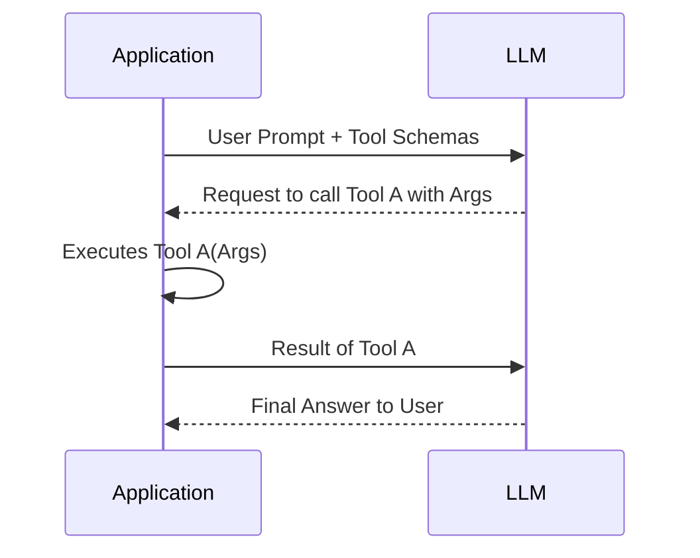
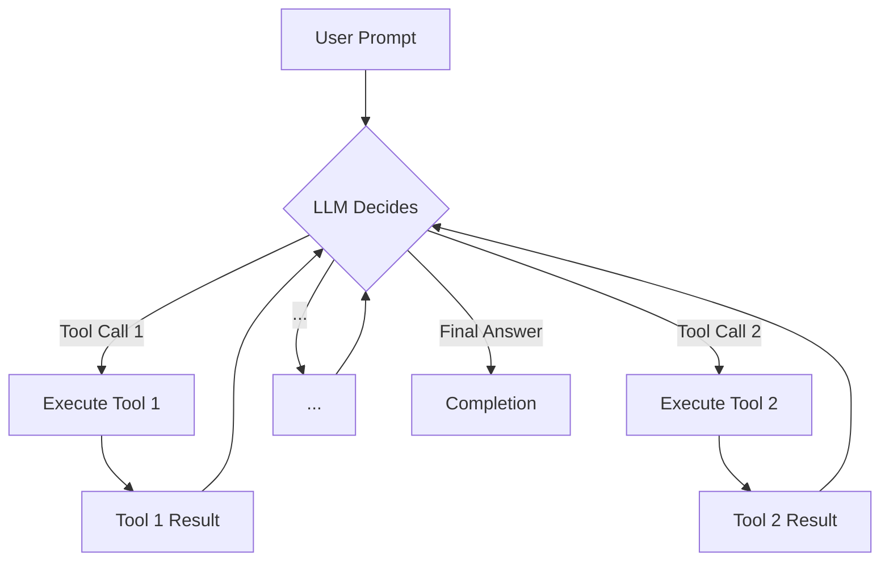

# LLM Agent Tools: The Full Guide
### Empower LLMs to act, see, and think!

## Introduction

Large Language Models (LLMs) are powerful text generators, but they are inherently limited. They cannot, by themselves, interact with the real world. This article explores agent tools, which are the essential mechanisms enabling LLMs to perform actions, access real-time information, or use external services. Tools transform an LLM from a passive text generator into a capable agent.

You will learn how to empower an LLM to become an agent by implementing tool calling from the ground up. We will show you how an agent decides which tool to use and with what parameters. We then transition from our manual implementation to using production-grade APIs like Gemini. This provides a complete picture of how to work with tools in real-world scenarios.

## Why Agents Need Tools to Interact With the World

LLMs are powerful text generators. However, their native capabilities are limited. LLMs train on fixed datasets, so their knowledge is frozen in time. They lack direct access to real-time information. This means they cannot check current weather or browse a website. They also cannot query a database.

At their core, LLMs are pattern-matching engines. They are confined to the text they were trained on. LLMs cannot execute code or perform complex calculations reliably. They also cannot interact with external APIs on their own [6](https://pmc.ncbi.nlm.nih.gov/articles/PMC11756841/), [7](https://direct.mit.edu/opmi/article/doi/10.1162/opmi_a_00160/124234/The-Limitations-of-Large-Language-Models-for). This inherent limitation makes an LLM more of a sophisticated parrot than an active participant in the world [18](http://www.mobihealthnews.com/news/apple-study-highlights-limitations-llms), [19](https://lims.ac.uk/documents/undefined-1.pdf).

This is where tools become essential. Tools are the bridge connecting the LLM's reasoning to the outside world. They transform a passive text generator into a functional agent. The LLM is the agent's "brain," handling planning and decision-making. The tools act as the agent's "hands and senses." They allow it to perceive new information and take action. This combination of a core reasoning engine and capabilities forms a true AI agent. As shown in the figure below, tools are a core component of an AI agent.


Consider this: an LLM cannot answer "What's the weather like in London right now?" Its training data is outdated. However, provide it with a `get_weather` tool. This tool can call a weather API. The LLM then reasons that this tool is needed. It requests execution with "London" as the parameter. The tool returns real-time data, and the LLM uses this data to give you an accurate answer. This simple interaction is how agents perform complex tasks, from searching the web to managing your calendar or analyzing database data.

## How to Implement Tool Calls From Scratch

Let's open the black box and see how tool calling actually works. This entire process is a communication cycle between your application and the LLM. The LLM decides what to do, and your application executes the action. We often manage this cycle through carefully crafted prompts and structured data formats like JSON. Understanding this low-level mechanism is key to debugging and optimizing agent behavior, even when you use higher-level APIs.

You do not just send a user's question to the LLM. You also send a description of the tools the LLM can use. The LLM analyzes the user's request and, if necessary, responds with a structured message indicating which tool to call and which arguments to use. Your application then parses this message, runs the corresponding function, and sends the result back to the LLM. The LLM uses this new information to formulate a final answer.

This request-execute-respond cycle can be visualized as a continuous loop:

Figure 1: The Request-Execute-Respond Cycle for Tool Calling

Let's break down each step of this process with a practical example. We start with a simple Python function to get the current weather.
```python
import json

def get_current_weather(location: str, unit: str = "celsius"):
    """Get the current weather in a given location."""
    if "madrid" in location.lower():
        return json.dumps({"location": "Madrid", "temperature": "25", "unit": unit})
    elif "berlin" in location.lower():
        return json.dumps({"location": "Berlin", "temperature": "15", "unit": unit})
    else:
        return json.dumps({"location": location, "temperature": "unknown"})
```
To make this function available to an LLM, we describe it using a **tool schema**, typically in JSON format. The schema includes the function's name, a description of what it does, and a definition of its parameters. This schema-based approach is the industry standard when you work with LLM providers like OpenAI or Gemini [3](https://datasciencesouth.com/blog/openai-functions/), [10](https://ai.google.dev/gemini-api/docs/function-calling).
```python
tools = [
    {
        "name": "get_current_weather",
        "description": "Get the current weather in a given location",
        "parameters": {
            "type": "object",
            "properties": {
                "location": {
                    "type": "string",
                    "description": "The city, e.g., Madrid",
                },
                "unit": {"type": "string", "enum": ["celsius", "fahrenheit"]},
            },
            "required": ["location"],
        },
    }
]
```
The description is critical; it is how the LLM determines *when* to use the tool. Next, we craft a system prompt that tells the LLM how to behave. This prompt instructs the model to act as a function-calling AI, providing it with the available tool schemas and defining the format for its response. LLMs are often specifically fine-tuned on vast datasets to interpret tool schema inputs and output tool calls, making them adept at this task [19](https://lims.ac.uk/documents/undefined-1.pdf).
```python
# For brevity, the full system prompt is omitted. 
# It instructs the LLM to use the provided tools and respond in a specific format.
system_prompt = f"""
You are a function-calling AI model. You are provided with function signatures...
<tools>
{json.dumps(tools, indent=2)}
</tools>
...
Respond with a function call inside <tool_code> XML tags.
"""
```
When a user asks a question, we send it to the LLM along with this system prompt. If the LLM decides a tool call is appropriate, it generates the function name and arguments in a structured format. This structured output is crucial because it provides a machine-readable instruction for your application, ensuring that only valid, schema-conformant data is acted upon for reliable execution and data extraction [3](https://datasciencesouth.com/blog/openai-functions/), [18](http://www.mobihealthnews.com/news/apple-study-highlights-limitations-llms).
```python
# Simplified call to an LLM
user_message = "What's the current temperature in Madrid in Celsius?"
# response = call_llm(system_prompt, user_message)
# print(response)
# Expected LLM output:
# <tool_code>
# {"name": "get_current_weather", "arguments": {"location": "Madrid", "unit": "celsius"}}
# </tool_code>
```
Our application then parses this response, extracts the tool name and arguments, and executes the function.
```python
llm_output = "<tool_code>{\"name\": \"get_current_weather\", \"arguments\": {\"location\": \"Madrid\", \"unit\": \"celsius\"}}</tool_code>"
tool_call_str = parse_xml(llm_output, "tool_code") 
tool_call = json.loads(tool_call_str)

function_name = tool_call["name"]
args = tool_call["arguments"]

result = get_current_weather(**args)
print(result)
# Output: {"location": "Madrid", "temperature": "25", "unit": "celsius"}
```
Finally, we send this result back to the LLM. The model now has the context it needs to generate a natural language answer for the user. This manual approach provides a clear understanding of the underlying mechanics before we move to more automated solutions.

## Automating Tool Schema Generation with a @tool Decorator

Manually creating JSON schemas for every function is tedious and violates the Don't Repeat Yourself (DRY) principle. A cleaner solution is to automate this process with a Python `@tool` decorator. This pattern is widely adopted in production frameworks like LangGraph because it simplifies tool management and scales efficiently [4](https://python.langchain.com/docs/concepts/tools/).

The decorator works by introspecting the Python function it wraps. It automatically extracts the function's name, description, and parameter types to build the JSON schema, ensuring your tool definitions stay synchronized with your code [5](https://book.pythontips.com/en/latest/decorators.html).

First, we can define a simple class to hold our function and its schema.
```python
import inspect
from typing import Callable, Any, Dict

class Tool:
    """A simple class to hold our function and its schema"""
    def __init__(self, func: Callable, schema: Dict):
        self.func = func
        self.schema = schema
```
Next, we implement the `@tool` decorator. It takes a function and converts it into a `Tool` object, which holds both the callable function and its auto-generated schema.
```python
def tool(func: Callable[..., Any]) -> Tool:
    """A decorator to convert a Python function into a Tool."""
    name = func.__name__
    description = inspect.getdoc(func)

    sig = inspect.signature(func)
    parameters = {
        "type": "object",
        "properties": {},
        "required": [],
    }
    for param_name, param in sig.parameters.items():
        param_type = "string" # Default to string
        if param.annotation == int:
            param_type = "integer"
        elif param.annotation == float:
            param_type = "number"
        elif param.annotation == bool:
            param_type = "boolean"
        
        parameters["properties"][param_name] = {
            "type": param_type,
            "description": f"The {param_name} for the function.",
        }
        if param.default == inspect.Parameter.empty:
            parameters["required"].append(param_name)

    schema = {
        "name": name,
        "description": description,
        "parameters": parameters,
    }
    return Tool(func, schema)
```
With this decorator, defining a new tool becomes incredibly straightforward. We can refactor our `get_current_weather` function by simply adding `@tool` on top of it.
```python
@tool
def get_current_weather(location: str, unit: str = "celsius"):
    """Get the current weather in a given location."""
    if "madrid" in location.lower():
        return json.dumps({"location": "Madrid", "temperature": "25", "unit": unit})
    elif "berlin" in location.lower():
        return json.dumps({"location": "Berlin", "temperature": "15", "unit": unit})
    else:
        return json.dumps({"location": location, "temperature": "unknown"})
```
Now, `get_current_weather` is a `Tool` object, and we can access its schema directly without any manual definition.
```python
# weather_tool = get_current_weather
print(json.dumps(weather_tool.schema, indent=2))
```
It outputs:
```json
{
  "name": "get_current_weather",
  "description": "Get the current weather in a given location.",
  "parameters": {
    "type": "object",
    "properties": {
      "location": {
        "type": "string",
        "description": "The location for the function."
      },
      "unit": {
        "type": "string",
        "description": "The unit for the function."
      }
    },
    "required": [
      "location"
    ]
  }
}
```
This approach automatically generates the same JSON schema we wrote by hand earlier. It is far more scalable and less prone to errors. This is the kind of engineering practice that makes shipping production-ready AI applications feasible.

## Tool Calling with Gemini API

Understanding tool calling from scratch provides a strong foundation. However, for production environments, you will use the native tool-calling capabilities offered by major LLM providers like Google, OpenAI, or Anthropic. These APIs are optimized for performance and reliability, handling much of the complex prompt engineering internally.

Let's refactor our example to use Google's Gemini API. The key difference is that instead of manually crafting a system prompt, we pass the tool definitions directly to the API as a dedicated parameter [8](https://codelabs.developers.google.com/codelabs/gemini-function-calling), [10](https://ai.google.dev/gemini-api/docs/function-calling). The Gemini API then handles the complex logic of when and how to call a tool internally.

The figure below illustrates the structured interaction between your application, the Gemini model, and external functions.


First, we define our Python function and its corresponding schema, just as before. The schema format is largely consistent across providers.
```python
import google.generativeai as genai

# Assume genai is configured with an API key
# genai.configure(api_key="YOUR_API_KEY")

def get_current_weather(location: str, unit: str = "celsius"):
    """Get the current weather in a given location."""
    # Function body is the same as before
    ...

tools = [
    {
        "name": "get_current_weather",
        "description": "Get the current weather in a given location",
        "parameters": { ... }, # Schema is the same as before
    }
]
```
Next, we create a Gemini model instance and pass our tool schemas to it. When we send a prompt, Gemini decides whether to respond with text or a `function_call` object.
```python
model = genai.GenerativeModel(
    model_name="gemini-1.5-flash",
    tools=tools
)

chat = model.start_chat()
response = chat.send_message("What's the current temperature in Madrid in Celsius?")
function_call = response.candidates[0].content.parts[0].function_call
```
If the model decides to use a tool, we execute it and send the result back in the next turn of the conversation. This completes the loop, allowing the LLM to incorporate the real-world information into its final response.
```python
if function_call.name == "get_current_weather":
    args = {key: value for key, value in function_call.args.items()}
    result = get_current_weather(**args)
    
    # Send the result back to the model
    response = chat.send_message(
        part=genai.types.Part(
            function_response=genai.types.FunctionResponse(
                name="get_current_weather",
                response={"result": result}
            )
        )
    )
    print(response.text)
```
This approach is far more robust and efficient than manual prompt engineering. It leverages the model provider's purpose-built infrastructure for tool use. This schema-based method is the industry standard and is used by all major LLM providers, making it a critical skill for building production-grade AI applications [9](https://cloud.google.com/vertex-ai/generative-ai/docs/multimodal/function-calling), [11](https://firebase.google.com/docs/ai-logic/function-calling).

## How to Use Pydantic Models as Tools for On-Demand Structured Outputs

While native APIs streamline tool execution, the way you define those tools can be made even more powerful. A practical pattern for this is using Pydantic models to generate structured outputs on demand. In many agentic workflows, an agent might perform several intermediate steps using unstructured text. However, for the final output, you often need a clean, structured format that downstream systems can easily parse.

By defining a Pydantic model and providing it to the agent as a tool, you can instruct the LLM to format its final answer according to a specific schema [2](https://python.useinstructor.com/concepts/models/). The agent can reason freely and then, only when it has all the necessary information, call the Pydantic "tool" to formalize its conclusion. This allows for flexible reasoning while ensuring strict data formats when needed.

Let's see an example. Suppose you want to extract user information from a sentence. You can define a `UserInfo` Pydantic model.
```python
from pydantic import BaseModel, Field

class UserInfo(BaseModel):
    """A model to hold user information."""
    name: str = Field(..., description="The name of the user")
    age: int = Field(..., description="The age of the user")
```
You can then convert this Pydantic model into a tool schema and provide it to your agent. When the agent has identified the user's name and age, it can call the `UserInfo` tool to format the data correctly. This technique ensures data validation and provides a clear communication schema, which is especially beneficial in multi-agent systems where different agents need to exchange data in a predictable format [1](https://openai.github.io/openai-agents-python/ref/function_schema/), [3](https://datasciencesouth.com/blog/openai-functions/).

## The Downsides of Running Tools in a Loop

To handle complex tasks, an agent often chains multiple tool calls, where the output of one tool becomes the input for the next. We achieve this by running the tool-calling process in a loop. This allows the LLM to decide which tool to use at each step until the task completes.

Figure 2: Sequential Tool Chaining in a Loop

This approach offers great flexibility. If tools are independent, we can even call them in parallel to reduce latency. For example, an agent can fetch a user's profile and recent orders simultaneously before deciding on the next action.

However, a simple, open-ended loop has significant downsides. One common failure mode is the agent getting stuck in an **infinite loop**, repeatedly calling the same tool without making progress [15](https://blog.gdeltproject.org/llm-infinite-loops-failure-modes-the-current-state-of-llm-entity_extraction/), [16](https://www.prompthub.us/blog/using-llms-for-code-generation-a-guide-to-improving-accuracy-and-addressing-common-issues). Such loops quickly escalate costs and render the agent useless. Research shows that even top models like GPT-4 fall into these loops, with baseline failure rates around 9-15% in some agent frameworks [17](https://arxiv.org/html/2407.20859v1). These failures often occur within control flow statements or entire code blocks, leading to error propagation [20](https://arxiv.org/html/2406.08731v1).

Furthermore, a simple loop lacks the ability to reason or reflect between steps. The agent executes one tool after another without a higher-level plan and cannot easily backtrack from a bad decision. These limitations are precisely why more sophisticated agentic patterns like **ReAct (Reasoning and Acting)** were developed. ReAct interleaves reasoning steps with actions, allowing the agent to think about its plan, act, observe the outcome, and then adjust its plan accordingly, leading to much more robust behavior [17](https://arxiv.org/html/2407.20859v1).

## Common Tool Categories for AI Agents

As you build more advanced agents, you will encounter several common categories of tools that are essential for creating capable systems. Understanding these toolsets gives you a clear picture of what is possible.

First, we have tools for **Knowledge and Memory Access**. One popular pattern here is agentic **Retrieval-Augmented Generation (RAG)**. An agent can use a RAG tool to query a vector database or document store to retrieve relevant context before answering a question. Another common tool in this category is for database interaction, often called **text-to-SQL**, which allows an agent to construct and execute SQL queries on traditional databases.

Next are tools for **Web Search and Browsing**. These are critical for any agent that needs access to real-time information. These tools typically interface with search engine APIs like Google Search or SerpAPI to get the latest search results. More advanced versions can even perform simplified web browsing to fetch and parse the content of web pages.

Finally, one of the most powerful tool categories is **Code Execution**. A common implementation is a **Python Interpreter tool**, which gives an agent the ability to write and execute Python code in a sandboxed environment. This is invaluable for tasks like performing complex mathematical calculations or manipulating data with libraries like Pandas.
⚠️ However, this power comes with significant security risks. You must run any code generated by an LLM in a secure sandbox, such as a Docker container or a microVM, to prevent it from accessing the host system or causing harm [12](https://huggingface.co/docs/smolagents/en/tutorials/secure_code_execution), [13](https://checkmarx.com/zero-post/glass-sandbox-complexity-of-python-sandboxing/), [14](https://healeycodes.com/running-untrusted-python-code). Implementing robust sandboxing is a non-negotiable requirement for deploying agents with code execution capabilities in production.

These tool categories—knowledge access, web search, and code execution—form the building blocks for most sophisticated agents. By chaining these tools together, an agent can accomplish complex, multi-step tasks that would be impossible for an LLM alone.

## Conclusion

In this article, we journeyed through the world of agent tools, the essential mechanisms that allow LLMs to interact with the external world. We saw that tools are the bridge that transforms a text-generating model into a practical agent capable of taking action.

We started by implementing tool calling from scratch to demystify the core mechanics of how an agent decides which function to use. We then progressed to more robust, production-level approaches using native APIs like Gemini. We also explored advanced patterns, such as using Pydantic models for on-demand structured outputs and chaining multiple tools together in a loop. Finally, we surveyed the diverse ecosystem of popular tools, from RAG and text-to-SQL for knowledge access to code interpreters for complex computations.

Mastering the design and implementation of tools is a fundamental skill for any AI engineer. It is the key to unlocking the full potential of LLMs and building AI applications that are not just intelligent, but truly capable and useful in the real world.

## References

- [1] Function schema (https://openai.github.io/openai-agents-python/ref/function_schema/)
- [2] Models (https://python.useinstructor.com/concepts/models/)
- [3] Function Calling with Pydantic (https://datasciencesouth.com/blog/openai-functions/)
- [4] Tools (https://python.langchain.com/docs/concepts/tools/)
- [5] Decorators (https://book.pythontips.com/en/latest/decorators.html)
- [6] Limitations of LLMs in Healthcare (https://pmc.ncbi.nlm.nih.gov/articles/PMC11756841/)
- [7] The Limitations of Large Language Models for Clinical Text Processing (https://direct.mit.edu/opmi/article/doi/10.1162/opmi_a_00160/124234/The-Limitations-of-Large-Language-Models-for)
- [8] Function calling with Gemini (https://codelabs.developers.google.com/codelabs/gemini-function-calling)
- [9] Function calling (https://cloud.google.com/vertex-ai/generative-ai/docs/multimodal/function-calling)
- [10] Function calling with the Gemini API (https://ai.google.dev/gemini-api/docs/function-calling)
- [11] Function calling (https://firebase.google.com/docs/ai-logic/function-calling)
- [12] Secure code execution (https://huggingface.co/docs/smolagents/en/tutorials/secure_code_execution)
- [13] The Glass Sandbox: On the Complexity of Python Sandboxing (https://checkmarx.com/zero-post/glass-sandbox-complexity-of-python-sandboxing/)
- [14] Running Untrusted Python Code (https://healeycodes.com/running-untrusted-python-code)
- [15] LLM Infinite Loops & Failure Modes: The Current State Of LLM Entity Extraction (https://blog.gdeltproject.org/llm-infinite-loops-failure-modes-the-current-state-of-llm-entity_extraction/)
- [16] Using LLMs for Code Generation: A Guide to Improving Accuracy and Addressing Common Issues (https://www.prompthub.us/blog/using-llms-for-code-generation-a-guide-to-improving-accuracy-and-addressing-common-issues)
- [17] Breaking Agents: Compromising Autonomous LLM Agents Through Malfunction Amplification (https://arxiv.org/html/2407.20859v1)
- [18] Apple study highlights limitations of LLMs for health applications (http://www.mobihealthnews.com/news/apple-study-highlights-limitations-llms)
- [19] On the Dangers of Stochastic Parrots: Can Language Models Be Too Big? (https://lims.ac.uk/documents/undefined-1.pdf)
- [20] AgentBench-Zero: A Benchmark for Evaluating LLM-as-Agent in Open-Ended Tool-Integrated Scenarios (https://arxiv.org/html/2406.08731v1)