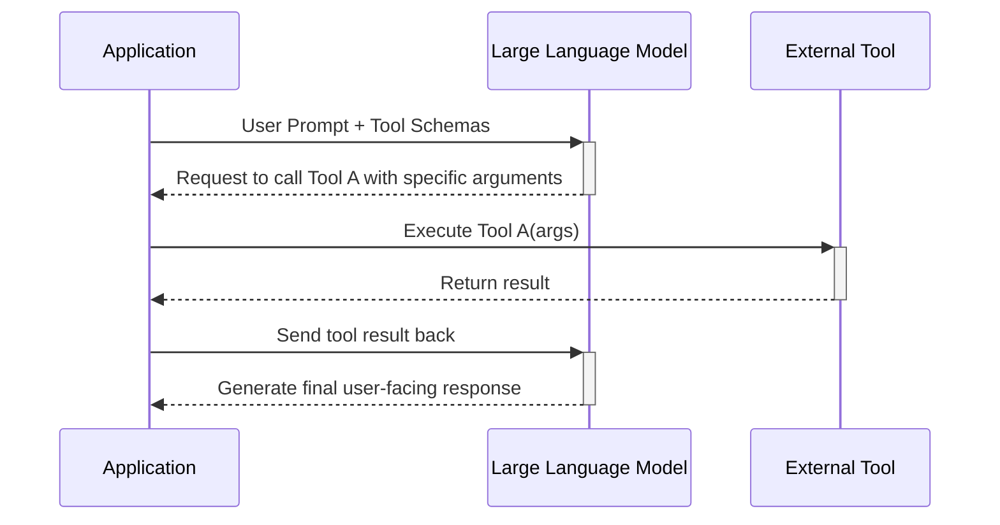
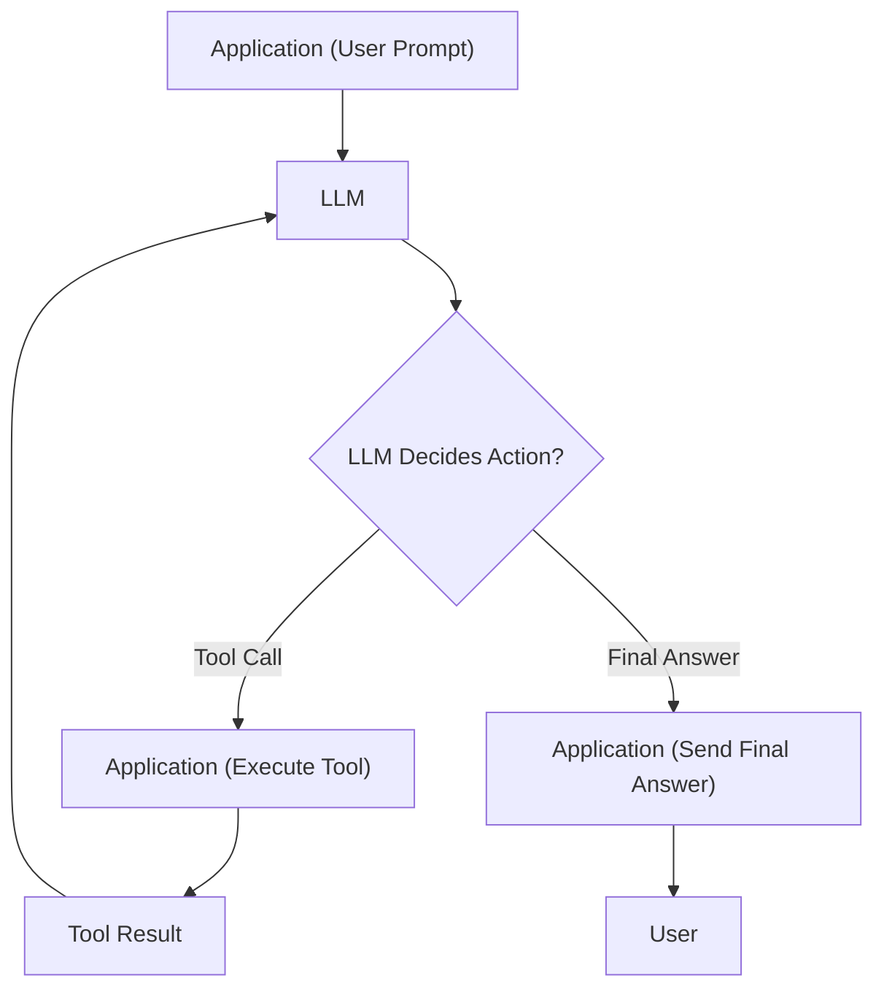

# LLM Agents: Tools, not Hype
### From text to action: LLMs as agents

## Introduction

AI agents are everywhere, but the hype often obscures what they really are. Most of the talk is about complex reasoning and planning, but it all starts with a much simpler engineering concept: tools. Large Language Models (LLMs) are, at their core, sophisticated text generators. They are powerful pattern matchers, but they are fundamentally disconnected from the real world. This article will cut through the noise and focus on how we bridge that gap.

We will explore why an LLM needs tools to become an agent capable of meaningful actions. You will learn to empower an LLM with tools by implementing tool calling from the ground up, seeing exactly how a model chooses a tool, generates parameters, and executes a function. By the end, you will gain a practical, no-fluff understanding of transforming an LLM from a text processor into an agent that can act.

## Why Agents Need Tools to Act

Large Language Models (LLMs) are incredibly capable at processing and generating text, but their native abilities end there. At their core, they are powerful pattern matchers trained on static datasets. This means their knowledge is frozen in time, typically ending months or even years before deployment, preventing them from accessing up-to-date information.

This fundamental design confines them to their training data and context window. Their architecture is optimized for text generation within a closed system, not for interacting with external environments or APIs. They lack built-in mechanisms for long-term memory, continuous knowledge updates, or even interpreting nuance without external context [[1]](https://www.projectpro.io/article/llm-limitations/1045), [[2]](https://www.decodable.co/blog/llms-need-real-time-data-to-deliver-contextual-results), [[3]](https://www.intuitivedataanalytics.com/gne-blogs/the-limitations-and-challenges-of-large-language-models-llms/), [[4]](https://arxiv.org/html/2412.04503v1). For example, an LLM cannot tell you today's weather, check your calendar, or perform a precise calculation like `4.1^2.1` with guaranteed accuracy. It can only generate text that *looks like* an answer based on patterns it has seen before. This is a critical distinction for any engineer building AI applications. You cannot rely on an LLM to perform tasks that require interaction with the outside world.

This is where tools come in. Tools are the essential bridge that connects the LLM's reasoning capabilities to external environments. They are functions or APIs that your application code can execute on the LLM's behalf. In this setup, the LLM acts as the agent's "brain," deciding what needs to be done. The tools act as its "hands and senses," allowing it to perceive new information and manipulate its environment.

An agent without tools is just a chatbot. By giving an agent a calculator, a web search API, or access to a database, you transform it from a passive text generator into a system that can take concrete actions and solve real-world problems. Tools enable LLMs to fetch data, such as retrieving up-to-date information for Retrieval-Augmented Generation (RAG), or to take actions, like submitting a form. This agentic architecture is what allows LLMs to move beyond simple Q&A and into the domain of complex, multi-step tasks [[4]](https://arxiv.org/html/2412.04503v1).

Let's visualize this relationship:


Figure 1: High-level diagram showing how an agent uses an LLM as its brain to interact with an external environment using tools. Media from [[5]](https://ai.google.dev/gemini-api/docs/function-calling).

## Opening the Black Box: How Tool Calling Works From Scratch

To understand how agents work, we need to look past the abstractions of popular frameworks and see the core mechanics. Implementing tool calling from scratch reveals that it is a straightforward, multi-step process orchestrated between your application and the LLM. The LLM does not run any code; it just tells your application what code to run.

We can break down the entire flow into a simple loop: your application sends a prompt and tool definitions to the LLM, the LLM requests a tool to be called, your application executes it, and sends the result back.

Figure 2: The request-execute-respond flow of a single tool call.

Let's walk through this process step-by-step with code.

### 1. Defining a Tool and its Schema
First, we need a Python function that we want our agent to use. The function itself is just standard Python, but for the LLM to use it, we must also create a **JSON schema**. This schema is the instruction manual the LLM reads to understand what the tool does, what parameters it needs, and how to format them. This contract ensures the LLM can reliably provide the correct arguments, and defining clear names and descriptions is essential for robust tool use [[6]](https://wandb.ai/onlineinference/genai-research/reports/Mastering-function-calling-with-OpenAI--VmlldzoxMzQ1MDk1NQ).

Here is a mock function and its manually defined schema.
```python
def search_google_drive(query: str) -> dict:
    """
    Searches for a file on Google Drive and returns its content or a summary.

    Args:
        query (str): The search query to find the file, e.g., 'Q3 earnings report'.

    Returns:
        dict: A dictionary representing the search results, including file names and summaries.
    """
    # In a real scenario, this would interact with the Google Drive API.
    return {
        "files": [
            {
                "name": "Q3_Earnings_Report_2024.pdf",
                "content": "The Q3 earnings report shows a 20% increase in revenue...",
            }
        ]
    }

search_google_drive_schema = {
    "name": "search_google_drive",
    "description": "Searches for a file on Google Drive and returns its content or a summary.",
    "parameters": {
        "type": "object",
        "properties": {
            "query": {
                "type": "string",
                "description": "The search query to find the file, e.g., 'Q3 earnings report'.",
            }
        },
        "required": ["query"],
    },
}
```
This schema-based approach is the industry standard used by major providers like OpenAI and Google Gemini [[7]](https://www.datacamp.com/tutorial/open-ai-function-calling-tutorial).

### 2. Prompting the LLM to Call the Tool
Next, we construct a system prompt that tells the LLM how to behave. This prompt includes guidelines on when to use tools and, most importantly, the schemas of all available tools. The LLM is specifically instruction-tuned to recognize these schemas and generate a structured output requesting a function call [[8]](https://proceedings.neurips.cc/paper_files/paper/2024/file/e4c61f578ff07830f5c37378dd3ecb0d-Paper-Conference.pdf). The structured output format, typically JSON, is crucial for your application to reliably parse and execute the requested tool call.

Here’s a simplified system prompt that includes our tool schema. Notice how we embed the tool schemas directly into the prompt within the `<tool_definitions>` tag.
```python
TOOLS_SCHEMA = [search_google_drive_schema]

TOOL_CALLING_SYSTEM_PROMPT = """
You are a helpful AI assistant with access to tools.

<tool_definitions>
{tools}
</tool_definitions>

When you need to use a tool, output ONLY the tool call in this exact format:
<tool_call>
{{"name": "tool_name", "args": {{"param1": "value1"}}}}
</tool_call>
"""

USER_PROMPT = "Can you help me find the latest quarterly report?"

messages = [TOOL_CALLING_SYSTEM_PROMPT.format(tools=str(TOOLS_SCHEMA)), USER_PROMPT]

# This is a placeholder for the actual API call
# response = client.models.generate_content(model=MODEL_ID, contents=messages)
```

When we send this to the LLM, it does not answer the user directly. Instead, it recognizes that the `search_google_drive` tool is needed and generates a structured response asking us to call it. The LLM's response would look like this:
```
<tool_call>
{"name": "search_google_drive", "args": {"query": "latest quarterly report"}}
</tool_call>
```

### 3. Executing the Tool in Your Application
Our application code now needs to parse this response, identify the requested tool and its arguments, and execute the corresponding Python function. The LLM only *suggests* the action; your application is responsible for safely parsing the structured output and calling the real-world function. In a production system, you would use a more robust parser than a simple `split()` to handle potential variations in the LLM's output.
```python
import json

def extract_tool_call(response_text: str) -> dict:
    """Extracts the tool call JSON from the response text."""
    # In a real implementation, use a more robust parser than split()
    tool_call_str = response_text.split("```tool_call")[1].split("```")[0].strip()
    return json.loads(tool_call_str)

# Assume `response.text` contains the LLM's output from the previous step
# llm_response_text = '```tool_call\n{"name": "search_google_drive", "args": {"query": "latest quarterly report"}}\n```'
# tool_call = extract_tool_call(llm_response_text)

# Let's hardcode the tool_call for this example to demonstrate the execution
tool_call = {"name": "search_google_drive", "args": {"query": "latest quarterly report"}}

# Map tool names to their actual Python functions
TOOLS_BY_NAME = {"search_google_drive": search_google_drive}

tool_handler = TOOLS_BY_NAME[tool_call["name"]]
tool_result = tool_handler(**tool_call["args"])

print(tool_result)
```
The output of running this code would be the result from our mock `search_google_drive` function:
```
{'files': [{'name': 'Q3_Earnings_Report_2024.pdf', 'content': 'The Q3 earnings report shows a 20% increase in revenue...'}]}
```

### 4. Sending the Result Back to the LLM
The final step is to feed this result back to the LLM so it can formulate a natural language response for the user. We append the tool result to our conversation history and make another API call. This feedback mechanism is crucial for the LLM to understand the outcome of its suggested action and synthesize that information into a coherent, user-facing response.
```python
# new_prompt = f"Interpret the tool result: {json.dumps(tool_result, indent=2)}"
# final_response = client.models.generate_content(model=MODEL_ID, contents=new_prompt)

# The LLM would then generate a user-facing response like:
# "I found the Q3 earnings report. It shows a 20% increase in revenue..."
```
This four-step cycle—define, prompt, execute, and respond—is the fundamental pattern behind all agentic tool use. By building it from scratch, we see there is no magic, just a clear, structured conversation between our application and the LLM.

## Automating Tool Definitions with a Decorator Framework

Manually writing and maintaining JSON schemas for every tool is tedious and error-prone. This violates the "Don't Repeat Yourself" (DRY) principle of software engineering, as you define a function's description and parameters in two places. A more robust, production-oriented approach automatically generates these schemas.

You can create a simple yet powerful tool-calling framework using a Python `@tool` decorator. This decorator inspects a function's signature and docstring to automatically generate the corresponding JSON schema. Popular frameworks like LangChain, LangGraph, and the Model Context Protocol (MCP) use this approach to streamline tool creation and provide a modular way to manage tool schemas [[9]](https://python.langchain.com/docs/concepts/tools/), [[10]](https://langchain-ai.github.io/langgraph/how-tos/graph-api/), [[11]](https://github.com/modelcontextprotocol/python-sdk/).

Let's refactor our previous implementation to use a decorator.

### Creating the `ToolFunction` Class
The `@tool` decorator wraps your original Python function within a `ToolFunction` class. This class acts as a container, holding both the original callable function and its auto-generated JSON schema.
```python
from inspect import Parameter, signature
from typing import Any, Callable, Dict, Optional

class ToolFunction:
    def __init__(self, func: Callable, schema: Dict[str, Any]) -> None:
        self.func = func
        self.schema = schema
        self.__name__ = func.__name__
        self.__doc__ = func.__doc__

    def __call__(self, *args: Any, **kwargs: Any) -> Any:
        return self.func(*args, **kwargs)
```

### Creating the `@tool` Decorator
The `tool` decorator itself is a function that takes your Python function as input. It uses Python's built-in `inspect` module to examine the function's signature and docstring. Based on this introspection, the decorator constructs a JSON schema that accurately reflects the function's definition.
```python
def tool(description: Optional[str] = None) -> Callable[[Callable], ToolFunction]:
    """
    A decorator that creates a tool schema from a function.

    Args:
        description: Optional override for the function's docstring

    Returns:
        A decorator function that wraps the original function and adds a schema
    """

    def decorator(func: Callable) -> ToolFunction:
        sig = signature(func)
        properties = {}
        required = []

        for param_name, param in sig.parameters.items():
            if param_name == "self":
                continue

            param_schema = {
                "type": "string",
                "description": f"The {param_name} parameter",
            }

            if param.default == Parameter.empty:
                required.append(param_name)

            properties[param_name] = param_schema

        schema = {
            "name": func.__name__,
            "description": description or func.__doc__ or f"Executes the {func.__name__} function.",
            "parameters": {
                "type": "object",
                "properties": properties,
                "required": required,
            },
        }

        return ToolFunction(func, schema)

    return decorator
```

### Using the Decorator
Now, you can define your tools much more cleanly. The decorator infers the schema directly from your Python code, making it modular and easier to maintain [[12]](https://langchain-cn.readthedocs.io/en/latest/modules/agents/tools/custom_tools.html). This approach significantly reduces boilerplate and the chance of errors when you update tool definitions.
```python
@tool()
def search_google_drive(query: str) -> dict:
    """Searches for a file on Google Drive and returns its content or a summary."""
    # Mock implementation
    return {"files": ["Q3 earnings report"]}

@tool()
def send_discord_message(channel_id: str, message: str) -> dict:
    """Sends a message to a specific Discord channel."""
    # Mock implementation
    return {"status": "success"}
```
The decorated `search_google_drive` object is now a `ToolFunction` instance that contains both the callable function and its schema.
```python
print(search_google_drive.schema)
```
This prints the automatically generated schema:
```json
{
  "name": "search_google_drive",
  "description": "Searches for a file on Google Drive and returns its content or a summary.",
  "parameters": {
    "type": "object",
    "properties": {
      "query": {
        "type": "string",
        "description": "The query parameter"
      }
    },
    "required": [
      "query"
    ]
  }
}
```
This approach not only simplifies development but also makes your agent's capabilities more modular and maintainable. This is the standard practice for building scalable agentic systems.

## From Scratch to Production with the Gemini API

While building a tool-calling mechanism from scratch is great for understanding the fundamentals, production systems rely on native APIs provided by LLM vendors like Google and OpenAI. These APIs are optimized for performance and reliability, handling the complexities of tool-use prompting internally. Let's see how to transition our custom implementation to Google's Gemini API.

The core logic remains the same: you define your tools, and your application is responsible for executing them. The main difference is that you pass the tool schemas directly to the API, rather than manually formatting them inside a system prompt. The Gemini API then takes care of deciding when to call a tool, abstracting away the prompt engineering details [[5]](https://ai.google.dev/gemini-api/docs/function-calling). This approach makes your application code cleaner and more robust.

First, we define our tool schemas in the format expected by the Gemini API.
```python
from google.genai import types

# Schemas from previous sections
search_google_drive_schema = {
    "name": "search_google_drive",
    "description": "Searches for a file on Google Drive...",
    "parameters": {"type": "object", "properties": {"query": {"type": "string"}}, "required": ["query"]},
}

send_discord_message_schema = {
    "name": "send_discord_message",
    "description": "Sends a message to a specific Discord channel...",
    "parameters": {"type": "object", "properties": {"channel_id": {"type": "string"}, "message": {"type": "string"}}, "required": ["channel_id", "message"]},
}

# Create a Tool object for the API
gemini_tools = types.Tool(
    function_declarations=[
        types.FunctionDeclaration(**search_google_drive_schema),
        types.FunctionDeclaration(**send_discord_message_schema),
    ]
)
```
Next, we make the API call, providing the user prompt and our `gemini_tools` object. We no longer need our custom system prompt, as the API handles the internal representation and injection of the tool schemas.
```python
# client = genai.Client() # Assuming client is initialized
USER_PROMPT = "Please find the Q3 earnings report and send a summary to the #finance channel."

# response = client.models.generate_content(
#     model="gemini-2.5-flash",
#     contents=USER_PROMPT,
#     config=types.GenerateContentConfig(tools=[gemini_tools]),
# )
```
The API response will contain a `function_call` object if the model decides a tool is needed. Your application is still responsible for executing the function. This separation of concerns is what makes tool-calling a robust and scalable architecture.
```python
# response_part = response.candidates[0].content.parts[0]
# if hasattr(response_part, "function_call"):
#     function_call = response_part.function_call
#     # Now, execute the function using its name and arguments
#     # tool_result = execute_my_function(function_call.name, **function_call.args)
```
This pattern is standard across all major LLM providers, including OpenAI and Anthropic, with only minimal interface differences [[7]](https://www.datacamp.com/tutorial/open-ai-function-calling-tutorial). While the API handles the "reasoning" part of deciding *what* to do, your code is always responsible for the "acting" part of *doing* it.

## Using Pydantic Models as Tools for On-Demand Structured Output

One of the most powerful applications of tool calling is generating structured data on demand. Instead of just calling functions that perform actions, you can treat a data schema itself as a tool. By defining a Pydantic model and presenting it to the agent as a tool, you can instruct the LLM to format its output into a clean, validated, and structured object whenever needed.

This technique is invaluable in agentic workflows where you might have several intermediate, unstructured reasoning steps. The agent can process information, think in natural language, and then, once it has gathered all the necessary details, call the Pydantic "tool" to package the final answer. This ensures high data quality and is particularly useful for reliable agent-to-agent communication [[13]](https://ai.pydantic.dev/models/).

Let's define a Pydantic model for extracting metadata from a financial document.
```python
from pydantic import BaseModel, Field

class DocumentMetadata(BaseModel):
    """A class to hold structured metadata for a document."""
    summary: str = Field(description="A concise, 1-2 sentence summary of the document.")
    quarter: str = Field(description="The financial quarter, e.g., Q3 2023.")
    growth_rate: str = Field(description="The revenue growth rate, e.g., 20%.")
```
We can convert this Pydantic model into a JSON schema and provide it to the Gemini API as a tool.
```python
from google.genai import types

extraction_tool = types.Tool(
    function_declarations=[
        types.FunctionDeclaration(
            name="extract_metadata",
            description="Extracts structured metadata from a financial document.",
            parameters=DocumentMetadata.model_json_schema(),
        )
    ]
)
```
When the LLM analyzes a document, it calls the `extract_metadata` tool, populating its arguments with the extracted information. Your application then receives this structured data, which is instantly validated and parsed into a `DocumentMetadata` object. This approach neatly separates unstructured reasoning from structured output generation, making your agent's outputs reliable and easy to consume by other systems [[14]](https://ai.google.dev/gemini-api/docs/structured-output).

## The Limits of Chaining: When Simple Tool Loops Fall Short

Once your agent can use a single tool, you will naturally want it to use multiple tools in sequence to solve more complex problems. We typically achieve this by running the tool-calling process in a loop. After each tool execution, we feed the result back to the LLM, which then decides on the next action—either calling another tool or generating a final response.

Figure 3: A loop allowing an agent to chain multiple tool calls.

This looping mechanism gives your agent flexibility. It allows you to break down a high-level goal like "Find the latest earnings report and share a summary on Discord" into a series of discrete steps:
1. Call `search_google_drive` to find the report.
2. Call `summarize_financial_report` with the report's content.
3. Call `send_discord_message` with the summary.

While this approach is powerful, it has significant limitations. The core problem is that it creates a simple, reactive loop. Your agent executes one action at a time without any higher-level reasoning or planning between steps [[15]](https://queue.acm.org/detail.cfm?id=3676287).

This can lead to several issues. Your agent might get stuck in inefficient or repetitive loops if it misinterprets a tool's output or fails to make progress [[16]](https://huggingface.co/papers?q=tool-invocation+success). The model doesn't "think" about what it has learned before deciding on the next action; it just reacts. This can cause it to mis-order calls or fail to self-correct when an early step goes wrong [[17]](https://aclanthology.org/2024.lrec-main.1427.pdf).

Furthermore, each turn in the loop adds latency. For tasks where tools are independent, a sequential loop is inefficient. A better approach is **parallel tool calls**, where the model requests multiple independent tool executions in a single turn. Both OpenAI and Gemini support this feature to improve efficiency [[18]](https://python.useinstructor.com/concepts/parallel/).

These shortcomings expose the naivety of simple tool chaining. Your agent is acting, but it is not truly reasoning about its actions. This is why more sophisticated agentic patterns like **ReAct (Reasoning and Acting)** were developed. ReAct explicitly prompts the model to generate a "thought"—a reasoning step where it analyzes the situation and plans its next action—before generating a tool call. This makes your agent's process more transparent and robust, addressing many of the failures of a simple loop [[15]](https://queue.acm.org/detail.cfm?id=3676287), [[16]](https://huggingface.co/papers?q=tool-invocation+success), [[19]](https://blog.promptlayer.com/llm-agents-vs-function-calling/).

## An Overview of Essential Industry-Standard Tools

Now that we have explored the mechanics of tool use, let's examine the most common tool categories that empower production AI agents. While you can build a tool for virtually any function, a few key capabilities form the backbone of most agentic systems.

### Knowledge and Memory Access
This is perhaps the most critical tool category. Since LLMs have no memory beyond their context window and their knowledge is static, they require tools to access external information. RAG tools represent the most common pattern here. An agent uses the "Retrieve" step of RAG as a tool to query a vector database or document store. This process is often called "agentic RAG" and forms a foundational pattern for building knowledge-intensive applications [[20]](https://www.pinecone.io/learn/retrieval-augmented-generation/), [[21]](https://northernlight.com/the-case-for-using-retrieval-augmented-generation-in-generative-ai-applications-within-the-enterprise/). For structured data, agents use database query tools that construct and execute SQL or NoSQL queries, often referred to as a "text-to-SQL" tool [[22]](https://www.superannotate.com/blog/llm-agents).

### Web Search and Browsing
To access real-time information, agents must connect to the internet. Web search tools interface with search engine APIs like Google Search or SerpAPI to answer questions about current events or verify facts. More advanced browsing or scraping tools go beyond simple search results to directly fetch and parse the content of web pages. This enables agents to extract specific information from websites, read articles, or summarize online content [[23]](https://research.aimultiple.com/ai-agent-tools/).

### Sandboxed Code Execution
LLMs struggle with precise mathematical or logical operations. A code execution tool solves this by giving the agent access to a programming language interpreter, almost always in a secure, sandboxed environment. The Python interpreter is the most common, allowing the agent to run code to perform calculations or manipulate data. Security is paramount here; you must execute the code in a sandboxed environment like a Docker container to prevent it from accessing the host system [[24]](https://amirmalik.net/2025/03/07/code-sandboxes-for-llm-ai-agents).

These three categories—knowledge access, web search, and code execution—form the foundation of most capable AI agents today [[25]](https://apxml.com/courses/intro-llm-agents/chapter-4-equipping-agents-with-tools/survey-of-available-tool-categories). Combining these tools allows agents to tackle complex, multi-step problems that go far beyond simple text generation.

## Conclusion

This article cut through the hype to focus on a core engineering principle of AI agents: tools. We've seen that tools are the essential bridge that connects an LLM's reasoning capabilities to the external world, transforming it from a text generator into a system that can act.

We started by implementing tool calling from scratch to open the black box and understand the fundamental mechanics. We then progressed to more robust, production-ready patterns, using decorators to automate schema generation and leveraging native APIs like Gemini for efficiency. We also explored how to use Pydantic models as tools for on-demand structured output, a powerful technique for ensuring data quality.

However, we also saw the limitations of simply chaining tools in a loop, which motivates the need for more advanced agentic patterns like ReAct that interleave reasoning with action. Finally, we surveyed the industry-standard tools for knowledge access (RAG), web search, and code execution that form the foundation of most modern agents. Understanding these concepts is the first step to building practical, effective, and production-ready AI systems.

## References

- [1] [LLM Limitations: 10 Major Limitations of Large Language Models](https://www.projectpro.io/article/llm-limitations/1045)
- [2] [Why LLMs Need Real-Time Data to Deliver Contextual Results](https://www.decodable.co/blog/llms-need-real-time-data-to-deliver-contextual-results)
- [3] [The Limitations and Challenges of Large Language Models (LLMs)](https://www.intuitivedataanalytics.com/gne-blogs/the-limitations-and-challenges-of-large-language-models-llms/)
- [4] [A Technical Primer on Causality in Large Language Models](https://arxiv.org/html/2412.04503v1)
- [5] [Function calling](https://ai.google.dev/gemini-api/docs/function-calling)
- [6] [Mastering function calling with OpenAI](https://wandb.ai/onlineinference/genai-research/reports/Mastering-function-calling-with-OpenAI--VmlldzoxMzQ1MDk1NQ)
- [7] [OpenAI Function Calling Tutorial: A Guide for Developers](https://www.datacamp.com/tutorial/open-ai-function-calling-tutorial)
- [8] [Gorilla: Large Language Models Connected to Massive APIs](https://proceedings.neurips.cc/paper_files/paper/2024/file/e4c61f578ff07830f5c37378dd3ecb0d-Paper-Conference.pdf)
- [9] [Tools](https://python.langchain.com/docs/concepts/tools/)
- [10] [LangGraph How-Tos: Graph API](https://langchain-ai.github.io/langgraph/how-tos/graph-api/)
- [11] [Model Context Protocol (MCP) Python SDK](https://github.com/modelcontextprotocol/python-sdk/)
- [12] [Custom Tools](https://langchain-cn.readthedocs.io/en/latest/modules/agents/tools/custom_tools.html)
- [13] [Model Providers](https://ai.pydantic.dev/models/)
- [14] [Function calling with structured output](https://ai.google.dev/gemini-api/docs/structured-output)
- [15] [Building and Evaluating AI Chains and Agents](https://queue.acm.org/detail.cfm?id=3676287)
- [16] [Search results for "tool-invocation success"](https://huggingface.co/papers?q=tool-invocation+success)
- [17] [Autonomous Tool Utilization of Large Language Models: A Survey](https://aclanthology.org/2024.lrec-main.1427.pdf)
- [18] [Parallel Function Calling](https://python.useinstructor.com/concepts/parallel/)
- [19] [LLM Agents vs. Function Calling: A Guide](https://blog.promptlayer.com/llm-agents-vs-function-calling/)
- [20] [Retrieval Augmented Generation (RAG)](https://www.pinecone.io/learn/retrieval-augmented-generation/)
- [21] [The Case for Using Retrieval Augmented Generation in Generative AI Applications within the Enterprise](https://northernlight.com/the-case-for-using-retrieval-augmented-generation-in-generative-ai-applications-within-the-enterprise/)
- [22] [LLM Agents: A Guide to the Next Generation of AI](https://www.superannotate.com/blog/llm-agents)
- [23] [AI Agent Tools: An In-depth Look at 15 Leading Solutions](https://research.aimultiple.com/ai-agent-tools/)
- [24] [Code Sandboxes for LLM AI Agents](https://amirmalik.net/2025/03/07/code-sandboxes-for-llm-ai-agents)
- [25] [Survey of Available Tool Categories](https://apxml.com/courses/intro-llm-agents/chapter-4-equipping-agents-with-tools/survey-of-available-tool-categories)
