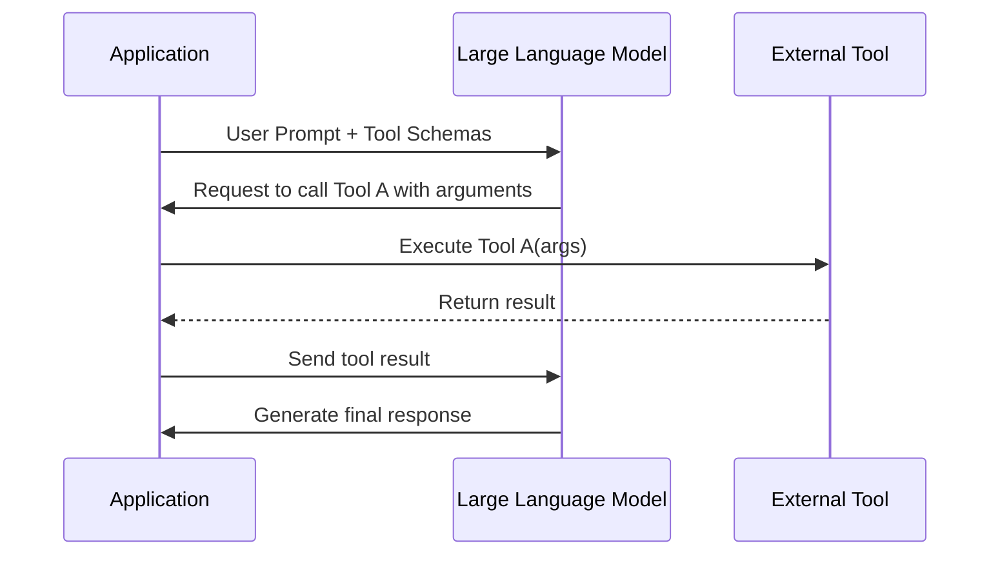
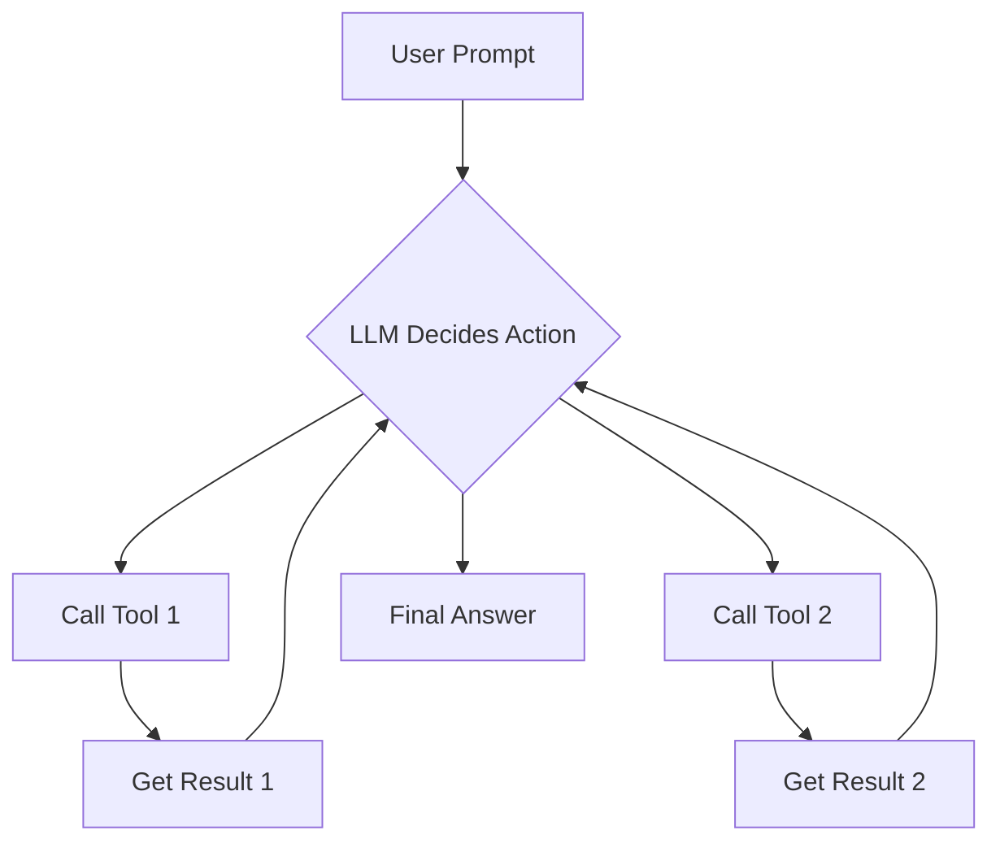

# LLM Agents: The Power of Tools
### Give your LLM 'hands and senses'

## Introduction

AI agents are everywhere, but most of the talk is hype. The engineering reality is that a Large Language Model (LLM) by itself is just a text generator. It’s a powerful brain in a jar, but it has no hands, no senses, and no way to interact with the outside world. This is the single biggest misconception people have—that an LLM can inherently browse the web, run code, or check your database. It can't.

To build a true agent that can take meaningful action, we need to give it "hands and senses." In the world of AI engineering, we call these **tools**. Tools are the bridge that connects the LLM’s reasoning capabilities to external systems, allowing it to fetch real-time data, execute code, and interact with APIs. Without tools, an agent is just a chatbot. With them, it can become a powerful assistant capable of solving real-world problems.

This article will cut through the noise and show you the engineering truth behind how agents use tools. We will demystify the entire mechanism by building it from scratch, exploring how to implement it with production-grade APIs, and surveying the most common types of tools you'll encounter in the wild. By the end, you'll have a foundational understanding of one of the most critical components of any AI agent.

## Why Agents Need Tools to Interact With the World

Large Language Models excel at processing and generating human-like text. However, they operate within a closed box, confined by their training data and context window. This means an LLM's knowledge is static; it cannot access real-time information like today's weather or the latest stock prices. They are primarily pattern matchers, trained to predict the next word based on patterns in vast, static datasets, not to interact with dynamic external environments or execute code [[1]](https://www.decodable.co/blog/llms-need-real-time-data-to-deliver-contextual-results), [[2]](https://www.intuitivedataanalytics.com/gne-blogs/the-limitations-and-challenges-of-large-language-models-llms/), [[3]](https://www.arxiv.org/html/2412.04503v1).

For example, if you ask an LLM to calculate `4.1^2.1`, it often hallucinates an approximate answer because it performs pattern matching, not actual computation. Figure **2**, from SuperAnnotate, illustrates an LLM attempting such a calculation. Furthermore, LLMs struggle with long-term memory, making it difficult for them to reliably remember information beyond their immediate context window for extended periods [[4]](https://www.projectpro.io/article/llm-limitations/1045). These fundamental constraints prevent LLMs from providing current, contextual, or actionable insights on their own.


Figure **1**: An overview of an LLM agent [[5]](https://www.superannotate.com/blog/llm-agents).


Figure **2**: An LLM failing a simple calculation [[5]](https://www.superannotate.com/blog/llm-agents).

This is precisely where tools come in. Tools are external functions or APIs that an agent can call to break out of its digital confinement. They act as the essential bridge that connects an LLM's reasoning capabilities to the real world. Think of the LLM as the "brain" of the agent—it decides what to do. The tools are its "hands and senses," allowing it to perceive new information and take action [[6]](https://www.newsletter.swirlai.com/p/building-ai-agents-from-scratch-part). This fundamental connection is what transforms a powerful but isolated LLM into a capable AI agent, as shown in Figure **1**.


Figure **3**: The core components of an agent's architecture [[5]](https://www.superannotate.com/blog/llm-agents).

Tools are a fundamental component of an agent's architecture, alongside planning and memory, as you can see in Figure **3**. When you make a request, the agent analyzes it and determines if it needs to use a tool. If so, the LLM generates precise instructions to call that tool. Your application code then executes this call, gets the result, and feeds it back to the LLM. The LLM uses this new information to generate a final, accurate response. This loop makes an agent truly useful [[5]](https://www.superannotate.com/blog/llm-agents).

## Building a Tool-Calling Mechanism from Scratch

To truly grasp how tool calling functions, you're going to build the entire mechanism from the ground up, without relying on any existing frameworks. The concept is straightforward: you define a set of functions your agent can use, describe them to the LLM, and let the LLM determine which function to call based on the user's input. This hands-on approach will demystify the interaction between the LLM and external capabilities.

The entire process follows a clear, logical flow. Your application sends a user's prompt and a list of available tool definitions to the LLM. The LLM analyzes this input and responds with a specific tool to call, including the necessary arguments. Your application code then executes that tool. Once the tool completes its operation, its output is sent back to the LLM, which uses this new information to generate a final answer for the user [[7]](https://github.com/towardsai/course-ai-agents/blob/main/lessons/06_tools/notebook.ipynb).


Figure **4**: The request-execute-respond flow of a tool call.

Let's walk through this step-by-step with code.

### 1. Defining the Tools and Their Schemas
First, you define your Python functions, which represent the actions your agent can take. For this example, you'll create a mock function to search Google Drive. The function's name, its parameters, and especially its docstring are crucial. The LLM relies heavily on this descriptive information to understand what the tool does, when to use it, and how to provide its inputs correctly [[7]](https://github.com/towardsai/course-ai-agents/blob/main/lessons/06_tools/notebook.ipynb).

```python
DOCUMENT = """
# Q3 2023 Financial Performance Analysis

The Q3 earnings report shows a 20% increase in revenue and a 15% growth in user engagement, 
beating market expectations...
"""

def search_google_drive(query: str) -> dict:
    """
    Searches for a file on Google Drive and returns its content or a summary.

    Args:
        query (str): The search query to find the file, e.g., 'Q3 earnings report'.

    Returns:
        dict: A dictionary representing the search results.
    """
    # In a real scenario, this would interact with the Google Drive API.
    return {
        "files": [
            {
                "name": "Q3_Earnings_Report_2024.pdf",
                "content": DOCUMENT,
            }
        ]
    }
```
Next, you need to create a schema that formally describes this function in a format the LLM can understand. This is typically a JSON object that details the function's name, a clear description, and the structure of its parameters. This schema-based approach is the industry standard for function calling across major LLM providers like OpenAI and Google Gemini, ensuring consistency and interoperability [[8]](https://platform.openai.com/docs/guides/function-calling), [[9]](https://ai.google.dev/gemini-api/docs/function-calling).

```python
search_google_drive_schema = {
    "name": "search_google_drive",
    "description": "Searches for a file on Google Drive and returns its content or a summary.",
    "parameters": {
        "type": "object",
        "properties": {
            "query": {
                "type": "string",
                "description": "The search query to find the file, e.g., 'Q3 earnings report'.",
            }
        },
        "required": ["query"],
    },
}
```

### 2. Instructing the LLM to Use the Tool
Now, you need to tell the LLM about the capabilities at its disposal. You do this by including the tool schemas within a system prompt, along with instructions on how the LLM should format its output when it decides to call a tool. LLMs with tool-calling capabilities are specifically fine-tuned to recognize these structured schemas and reliably generate structured JSON output for function calls [[6]](https://www.newsletter.swirlai.com/p/building-ai-agents-from-scratch-part).

When the LLM determines a tool is necessary, it will select the most appropriate one and generate all required parameters. It is crucial that the LLM outputs *only* the tool call in a precise, structured format. For our example, you'll instruct it to use this exact format:
```tool_call
{{"name": "tool_name", "args": {{"param1": "value1"}}}}
```
Here’s a simplified system prompt that includes these guidelines and the available tool definitions:
```python
TOOL_CALLING_SYSTEM_PROMPT = """
You are a helpful AI assistant with access to tools.
- When you need to use a tool, choose the most appropriate one based on the user's request.
- Provide all required parameters with accurate values.
When you need to use a tool, output ONLY the tool call in this exact format:
```tool_call
{{"name": "tool_name", "args": {{"param1": "value1"}}}}```
<tool_definitions>
{tools}
</tool_definitions>
"""
```
When you combine this system prompt with a user query, the LLM will analyze the request and, if needed, generate a tool call in the specified format.
```python
USER_PROMPT = "Can you help me find the latest quarterly report?"

messages = [
    TOOL_CALLING_SYSTEM_PROMPT.format(tools=str([search_google_drive_schema])), 
    USER_PROMPT
]

# This is a simplified representation of the API call
# response = client.models.generate_content(model=MODEL_ID, contents=messages)
# print(response.text)
```
The LLM would respond with a structured string like this:
```
```tool_call
{"name": "search_google_drive", "args": {"query": "latest quarterly report"}}```
```

### 3. Executing the Tool in Your Application
Your application code now takes over. It needs to parse the LLM's structured response, extract the function name and its arguments, and then execute the actual Python function. This step highlights why a structured output from the LLM is so important—it makes parsing and execution reliable and programmatic.

```python
import json

def call_tool(response_text: str, tools_by_name: dict) -> any:
    # 1. Extract the JSON string from the markdown block
    tool_call_str = response_text.split("```tool_call")[1].split("```")[0].strip()
    
    # 2. Parse the JSON string into a Python dictionary
    tool_call = json.loads(tool_call_str)
    
    # 3. Get the function handler and arguments
    tool_name = tool_call["name"]
    tool_args = tool_call["args"]
    tool_handler = tools_by_name[tool_name]
    
    # 4. Execute the function
    return tool_handler(**tool_args)

# A dictionary mapping tool names to their function handlers
TOOLS_BY_NAME = {"search_google_drive": search_google_drive}

# Assuming `response.text` contains the LLM's tool call
# tool_result = call_tool(response.text, tools_by_name=TOOLS_BY_NAME)
# print(tool_result)
```

### 4. Sending the Result Back to the LLM
Finally, you take the result from your tool execution and send it back to the LLM. This crucial step closes the loop, providing the model with the real-world information it needed to formulate a complete and helpful answer.

```python
# Fictional response from the previous step
tool_result = {
    "files": [{
        "name": "Q3_Earnings_Report_2024.pdf",
        "content": "# Q3 2023 Financial Performance Analysis..."
    }]
}

# Send the result back to the LLM
# final_response = client.models.generate_content(
#     model=MODEL_ID,
#     contents=f"Interpret the tool result: {json.dumps(tool_result)}"
# )
# print(final_response.text)
```
The LLM would then generate a user-facing response, such as: "I found the Q3 2023 Financial Performance Analysis. It shows a 20% increase in revenue..." And that’s it. You've just opened the black box of tool use and seen the entire mechanism in action.

## From Manual to Automated: Building a Tool-Calling Framework

Manually creating a JSON schema for every function is tedious and violates a core software engineering principle: Don't Repeat Yourself (DRY). A much cleaner approach is to automate the schema generation. This is what production-grade frameworks like LangChain, LangGraph, and those implementing the Model Context Protocol (MCP) do, and you can build a simplified version yourself using a Python decorator [[10]](https://python.langchain.com/docs/concepts/tools/), [[11]](https://langchain-ai.github.io/langgraph/concepts/low_level/), [[12]](https://modelcontextprotocol.io/introduction).

You'll create a `@tool` decorator that inspects a Python function's signature and docstring to automatically generate its schema. This automation is vital because it eliminates manual JSON creation, which is time-consuming and a common source of bugs. By leveraging Python's introspection capabilities, your code becomes cleaner, more maintainable, and less prone to errors.

Here’s the implementation of your `@tool` decorator. It wraps your function in a `ToolFunction` class, which attaches a `schema` attribute to the function while ensuring it remains callable.
```python
from inspect import Parameter, signature
from typing import Any, Callable, Dict, Optional

class ToolFunction:
    """A wrapper class to hold the function and its schema."""
    def __init__(self, func: Callable, schema: Dict[str, Any]) -> None:
        self.func = func
        self.schema = schema

    def __call__(self, *args: Any, **kwargs: Any) -> Any:
        return self.func(*args, **kwargs)

def tool() -> Callable[[Callable], ToolFunction]:
    """A decorator that creates a tool schema from a function."""
    def decorator(func: Callable) -> ToolFunction:
        sig = signature(func)
        properties = {}
        required = []

        for param_name, param in sig.parameters.items():
            properties[param_name] = {
                "type": "string",  # Simplified for this example
                "description": f"The {param_name} parameter",
            }
            if param.default == Parameter.empty:
                required.append(param_name)

        schema = {
            "name": func.__name__,
            "description": func.__doc__ or f"Executes the {func.__name__} function.",
            "parameters": {
                "type": "object",
                "properties": properties,
                "required": required,
            },
        }
        return ToolFunction(func, schema)
    return decorator
```
The `tool` decorator uses Python's `inspect` module to examine the function's signature and docstring. It extracts parameter names, checks for required arguments, and uses the docstring as the tool's description. This process automatically constructs a valid JSON schema, saving you from writing repetitive boilerplate code.

Now, you can refactor your previous example by simply applying the `@tool` decorator to your function. The decorator handles all the schema boilerplate, making your tool definitions concise and easy to manage.
```python
@tool()
def search_google_drive_example(query: str) -> dict:
    """Search for files in Google Drive."""
    return {"files": ["Q3 earnings report"]}

# The schema is now automatically generated and attached to the function object
print(json.dumps(search_google_drive_example.schema, indent=2))
```
It outputs:
```json
{
  "name": "search_google_drive_example",
  "description": "Search for files in Google Drive.",
  "parameters": {
    "type": "object",
    "properties": {
      "query": {
        "type": "string",
        "description": "The query parameter"
      }
    },
    "required": [
      "query"
    ]
  }
}
```
This decorator-based approach is far more efficient and robust. When adding new tools, you just write the Python function with a clear docstring, and the decorator takes care of the rest. This is a much more production-ready way to manage an agent's toolset.

## Leveraging Native Tool-Calling APIs

While building a tool-calling mechanism from scratch is insightful, in a production environment, you'll almost always use native tool-calling APIs from LLM vendors like Google, OpenAI, or Anthropic. These APIs are optimized for performance and reliability, and they abstract away the complexity of managing system prompts. Figure **5** illustrates this streamlined process with the Gemini API.


Figure **5**: The native tool-calling flow with Google's Gemini API [[9]](https://ai.google.dev/gemini-api/docs/function-calling).

Let's refactor our example using Google's Gemini API. Instead of crafting a detailed system prompt, we simply pass the tool schemas directly to the API. The Gemini backend handles the logic of when and how to call a tool, making the process more efficient and robust [[9]](https://ai.google.dev/gemini-api/docs/function-calling).

First, we define our tool schemas and package them into a `Tool` object that the Gemini API expects.
```python
from google.genai import types

# Schemas remain the same as our manual implementation
search_google_drive_schema = {
    "name": "search_google_drive",
    "description": "Searches for a file on Google Drive...",
    "parameters": {
        "type": "object",
        "properties": {"query": {"type": "string"}},
        "required": ["query"],
    },
}

# The Gemini API requires the schemas to be wrapped in a Tool object
gemini_tools = [
    types.Tool(
        function_declarations=[
            types.FunctionDeclaration(**search_google_drive_schema),
        ]
    )
]
```
Next, we call the `generate_content` endpoint, passing our user prompt and the `gemini_tools` object. We can also configure the API to force a tool call, which is useful for tasks that explicitly require an action.
```python
import google.genai as genai

# client = genai.Client() # Assumes API key is configured

USER_PROMPT = "Please find the Q3 earnings report on Google Drive."

# The `tool_config` forces the model to call a function
config = types.GenerateContentConfig(
    tools=gemini_tools,
    tool_config=types.ToolConfig(function_calling_config=types.FunctionCallingConfig(mode="ANY")),
)

# response = client.models.generate_content(
#     model="gemini-1.5-flash",
#     contents=[USER_PROMPT],
#     generation_config=config,
# )

# function_call = response.candidates[0].content.parts[0].function_call
```
It outputs:
```
FunctionCall(id=None, args={'query': 'Q3 earnings report'}, name='search_google_drive')
```
The API response directly provides a `function_call` object with the tool name and arguments, ready for execution. This API-driven approach is the industry standard. While the syntax may differ between OpenAI, Anthropic, and Gemini, the core pattern is the same: you provide tool schemas, and the API returns structured function calls.

## A Practical Trick: Using Pydantic Models as Tools

A powerful application of tool calling is to generate structured, validated data on demand. Instead of a function, we can treat a Pydantic model as a tool. This forces the LLM to output a JSON object that conforms to our Pydantic schema, which we can then instantly parse and validate in our application.

This technique is incredibly useful in agentic workflows. An agent might perform several intermediate steps using unstructured text, but for the final output, you need clean, structured data. By defining a Pydantic model as a tool, the agent can dynamically decide when to generate this structured output [[7]](https://github.com/towardsai/course-ai-agents/blob/main/lessons/06_tools/notebook.ipynb).

Let's define a Pydantic model for extracting metadata from a financial document.
```python
from pydantic import BaseModel, Field

class DocumentMetadata(BaseModel):
    """A class to hold structured metadata for a document."""
    summary: str = Field(description="A concise, 1-2 sentence summary of the document.")
    tags: list[str] = Field(description="A list of 3-5 high-level tags.")
    quarter: str = Field(description="The financial quarter (e.g., Q3 2023).")
```
We then convert this Pydantic model into a tool schema. The `model_json_schema()` method automatically generates the necessary JSON schema from our Pydantic model, reducing manual effort [[13]](https://ai.google.dev/gemini-api/docs/structured-output).
```python
from google.genai import types

# The Pydantic model's schema becomes our tool's parameters
extraction_tool = types.Tool(
    function_declarations=[
        types.FunctionDeclaration(
            name="extract_metadata",
            description="Extracts structured metadata from a document.",
            parameters=DocumentMetadata.model_json_schema(),
        )
    ]
)
```
It outputs a schema similar to this:
```json
{
  "properties": {
    "summary": {
      "description": "A concise, 1-2 sentence summary of the document.",
      "title": "Summary",
      "type": "string"
    },
    "tags": {
      "description": "A list of 3-5 high-level tags.",
      "items": {
        "type": "string"
      },
      "title": "Tags",
      "type": "array"
    },
    "quarter": {
      "description": "The financial quarter (e.g., Q3 2023).",
      "title": "Quarter",
      "type": "string"
    }
  },
  "required": [
    "summary",
    "tags",
    "quarter"
  ],
  "title": "DocumentMetadata",
  "type": "object"
}
```
When we prompt the LLM to analyze a document with this tool available, it will "call" our `extract_metadata` tool and generate a JSON object matching our `DocumentMetadata` model. This provides a reliable way to get structured, validated data from an LLM, ensuring data quality and offering clear schemas for debugging and monitoring [[14]](https://ai.pydantic.dev/models/), [[15]](https://ai.pydantic.dev/api/models/gemini/).
```python
# Assuming 'client' and 'MODEL_ID' are defined as in previous sections
# Assuming 'DOCUMENT' is the text to be analyzed

# config = types.GenerateContentConfig(
#     tools=[extraction_tool],
#     tool_config=types.ToolConfig(function_calling_config=types.FunctionCallingConfig(mode="ANY")),
# )

# prompt = f"""
# Please analyze the following document and extract its metadata.

# Document:
# ---
# {DOCUMENT}
# ---
# """

# response = client.models.generate_content(model=MODEL_ID, contents=prompt, config=config)
# response_message_part = response.candidates[0].content.parts[0]

# if hasattr(response_message_part, "function_call"):
#     function_call = response_message_part.function_call
#     document_metadata = DocumentMetadata(**function_call.args)
# else:
#     print("The model did not call the extraction tool.")
```
It outputs a function call similar to this:
```
Function Name: `extract_metadata
Function Arguments: `{  "growth_rate": "20%",  "summary": "The Q3 2023 earnings report shows a 20% increase in revenue and 15% growth in user engagement, driven by successful product strategy and market expansion. This performance provides a strong foundation for continued growth.",  "quarter": "Q3 2023",  "keywords": [    "Revenue",    "User Engagement",    "Market Expansion",    "Customer Acquisition",    "Retention Rates",    "Digital Services",    "Cash Flow"  ],  "tags": [    "Financials",    "Earnings",    "Growth",    "Business Strategy",    "Market Analysis"  ]}`
```
And the Pydantic validated object:
```json
{
  "summary": "The Q3 2023 earnings report shows a 20% increase in revenue and 15% growth in user engagement, driven by successful product strategy and market expansion.",
  "tags": [
    "Financials",
    "Earnings",
    "Growth",
    "Business Strategy",
    "Market Analysis"
  ],
  "keywords": [
    "Revenue",
    "User Engagement",
    "Market Expansion",
    "Customer Acquisition",
    "Retention Rates",
    "Digital Services",
    "Cash Flow"
  ],
  "quarter": "Q3 2023",
  "growth_rate": "20%"
}
```

## Beyond Single Actions: The Power and Pitfalls of Chaining Tools in a Loop

So far, we have focused on single tool calls. However, real-world problems often require multiple steps. To handle this, you can run your agent in a loop, allowing it to chain multiple tool calls together. In each iteration, the agent decides which tool to use, executes it, and uses the result to inform its next action. This creates an adaptive system capable of tackling complex tasks [[7]](https://github.com/towardsai/course-ai-agents/blob/main/lessons/06_tools/notebook.ipynb).

The flow looks like this:

Figure **6**: A simple tool-calling loop [[7]](https://github.com/towardsai/course-ai-agents/blob/main/lessons/06_tools/notebook.ipynb).

This loop allows an agent to, for example, first search for a document, then summarize it, and finally send the summary in an email. For independent tasks, modern APIs even support parallel tool calls, where the LLM can request multiple tool executions in a single turn, reducing latency [[16]](https://community.openai.com/t/parallel-tool-use-documentation-for-api-models/1304519).

However, this simple looping pattern has significant pitfalls. Its biggest weakness is the lack of a dedicated planning or reflection step. The agent must choose a tool at every iteration, which can lead to inefficient paths or getting stuck in repetitive cycles [[17]](https://queue.acm.org/detail.cfm?id=3676287). When you use a simple sequential loop, the LLM might misinterpret your intent and select the wrong function, especially in complex contexts [[18]](https://blog.promptlayer.com/llm-agents-vs-function-calling/).

This approach also struggles with error handling if an API call fails or returns unexpected results. Simple sequential approaches are insufficient for dynamic tasks, leading to errors and inefficiencies, and can result in the LLM getting stuck or mis-ordering calls [[17]](https://queue.acm.org/detail.cfm?id=3676287), [[19]](https://arxiv.org/html/2502.02573v1). An early mistake can propagate through subsequent steps, compounding errors and making recovery difficult [[20]](https://aclanthology.org/2024.lrec-main.1427.pdf).

These limitations highlight the need for more sophisticated agentic patterns. While the simple tool-calling loop is a foundational concept, building truly robust agents requires moving beyond it. This sets the stage for patterns like **ReAct (Reasoning and Acting)**, which explicitly interleaves reasoning steps with actions. This allows the agent to "think" before it acts, adaptively deciding which tool to use based on the outcomes of previous steps [[21]](https://arxiv.org/html/2409.00920v1).

## Common Tool Categories for AI Agents

Now that we understand the mechanics of tool use, let's survey the most common categories of tools that power production-grade AI agents. We can broadly group these tools by the capabilities they provide, such as accessing knowledge, interacting with the web, or executing code.

### 1. Knowledge and Memory Access
This is perhaps the most crucial category, as it addresses the LLM's static knowledge limitations.

*   **Retrieval-Augmented Generation (RAG) Tools:** An agent uses these tools to connect to knowledge bases, often stored in vector databases. When you ask a question, the agent uses a RAG tool to retrieve relevant text chunks and feeds them to the LLM as context. We often call this "agentic RAG," and it is essential for grounding LLM responses in factual, domain-specific data and reducing hallucination [[22]](https://www.pinecone.io/learn/retrieval-augmented-generation/), [[23]](https://northernlight.com/the-case-for-using-retrieval-augmented-generation-in-generative-ai-applications-within-the-enterprise/).
*   **Database Query Tools (Text-to-SQL):** For structured data in traditional databases, agents can use tools that translate natural language into SQL. The agent then executes the query, retrieves the results, and uses them to answer your question. This allows agents to interact with legacy data systems without needing custom API layers [[5]](https://www.superannotate.com/blog/llm-agents).

### 2. Web Search and Browsing
To access up-to-the-minute information, agents need tools to interact with the live internet.

*   **Web Search APIs:** An agent uses these tools to query search engines like Google or Bing. This is fundamental for answering questions about current events, finding recent articles, or performing general fact-checking [[24]](https://apxml.com/courses/intro-llm-agents/chapter-4-equipping-agents-with-tools/).
*   **Web Scrapers/Browsers:** More advanced tools can directly fetch and parse the content of a webpage. This enables an agent to extract specific information from a known URL, summarize articles, or even fill out forms [[25]](https://research.aimultiple.com/ai-agent-tools/).

### 3. Code Execution
Giving an agent the ability to execute code unlocks a vast range of capabilities, especially for analytical tasks.

*   **Sandboxed Python Interpreter:** This is one of the most powerful tools an agent can have. It allows the agent to write and execute Python code to perform calculations, manipulate data with libraries like Pandas, or create visualizations. Security is paramount here; you must always run the code in a secure, isolated sandbox using technologies like Docker, gVisor, or WebAssembly to prevent it from accessing the host system [[26]](https://dida.do/blog/setting-up-a-secure-python-sandbox-for-llm-agents/), [[27]](https://amirmalik.net/2025/03/07/code-sandboxes-for-llm-ai-agents/), [[28]](https://developer.nvidia.com/blog/sandboxing-agentic-ai-workflows-with-webassembly/).

These tool categories form the backbone of most modern AI agents, giving them the "senses" and "hands" needed to perform useful work. As we saw, these tools are often chained together in multi-step workflows to solve complex problems.

## Conclusion

We've journeyed from the fundamental limitations of LLMs to the practical engineering of tool use that transforms them into capable AI agents. The key takeaway is that tools are not just an add-on; they are the essential bridge that connects an LLM's reasoning to the external world. Without them, an LLM is a powerful but isolated brain. With them, it becomes an agent that can perceive, act, and solve real problems.

We started by building the tool-calling mechanism from scratch, opening the black box to see how an LLM selects a tool and generates the right arguments. We then graduated to more maintainable, production-ready approaches, first with a custom decorator and then with a native API like Gemini's. We even saw how to use Pydantic models as a clever trick to get structured, validated data on demand.

Finally, we explored the power and pitfalls of chaining tools in a simple loop, which highlighted the need for more advanced agentic patterns like ReAct. A solid grasp of how to implement and orchestrate tools is a non-negotiable, foundational skill for any AI engineer looking to build applications that go beyond simple text generation. This is where the real engineering begins.

## References

- [1] [LLMs Need Real-Time Data To Deliver Contextual Results](https://www.decodable.co/blog/llms-need-real-time-data-to-deliver-contextual-results)
- [2] [The Limitations and Challenges of Large Language Models (LLMs)](https://www.intuitivedataanalytics.com/gne-blogs/the-limitations-and-challenges-of-large-language-models-llms/)
- [3] [Function Calling as A Tool for Responsible AI](https://www.arxiv.org/html/2412.04503v1)
- [4] [Top 11 LLM Limitations You Must Know in 2024](https://www.projectpro.io/article/llm-limitations/1045)
- [5] [A Deep Dive into LLM Agents](https://www.superannotate.com/blog/llm-agents)
- [6] [Building AI Agents from Scratch](https://www.newsletter.swirlai.com/p/building-ai-agents-from-scratch-part)
- [7] [Tools (GitHub Notebook)](https://github.com/towardsai/course-ai-agents/blob/main/lessons/06_tools/notebook.ipynb)
- [8] [Function calling (OpenAI)](https://platform.openai.com/docs/guides/function-calling)
- [9] [Function calling (Google Gemini)](https://ai.google.dev/gemini-api/docs/function-calling)
- [10] [Tools (LangChain)](https://python.langchain.com/docs/concepts/tools/)
- [11] [Low-level (LangGraph)](https://langchain-ai.github.io/langgraph/concepts/low_level/)
- [12] [Introduction (Model Context Protocol)](https://modelcontextprotocol.io/introduction)
- [13] [Structured output (Google Gemini)](https://ai.google.dev/gemini-api/docs/structured-output)
- [14] [Pydantic Models](https://ai.pydantic.dev/models/)
- [15] [Gemini (Pydantic)](https://ai.pydantic.dev/api/models/gemini/)
- [16] [Parallel Tool Use Documentation for API Models](https://community.openai.com/t/parallel-tool-use-documentation-for-api-models/1304519)
- [17] [Building LLM-powered Agents](https://queue.acm.org/detail.cfm?id=3676287)
- [18] [LLM Agents vs. Function Calling: A Guide](https://blog.promptlayer.com/llm-agents-vs-function-calling/)
- [19] [Agentic AI: A Scoping Review and Thematic Analysis of the Literature](https://arxiv.org/html/2502.02573v1)
- [20] [Can Large Language Models Recover from Their Errors? A Case Study on Code Generation](https://aclanthology.org/2024.lrec-main.1427.pdf)
- [21] [ReAct: Synergizing Reasoning and Acting in Language Models](https://arxiv.org/html/2409.00920v1)
- [22] [What is Retrieval-Augmented Generation?](https://www.pinecone.io/learn/retrieval-augmented-generation/)
- [23] [The Case for Using Retrieval-Augmented Generation in Generative AI Applications within the Enterprise](https://northernlight.com/the-case-for-using-retrieval-augmented-generation-in-generative-ai-applications-within-the-enterprise/)
- [24] [Equipping Agents with Tools](https://apxml.com/courses/intro-llm-agents/chapter-4-equipping-agents-with-tools/)
- [25] [Top 10+ AI Agent Tools in 2024](https://research.aimultiple.com/ai-agent-tools/)
- [26] [Setting up a secure Python sandbox for LLM agents](https://dida.do/blog/setting-up-a-secure-python-sandbox-for-llm-agents/)
- [27] [Code Sandboxes for LLM AI Agents](https://amirmalik.net/2025/03/07/code-sandboxes-for-llm-ai-agents/)
- [28] [Sandboxing Agentic AI Workflows with WebAssembly](https://developer.nvidia.com/blog/sandboxing-agentic-ai-workflows-with-webassembly/)