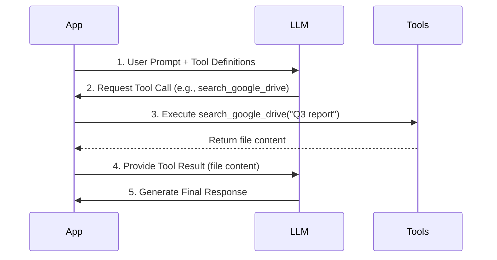
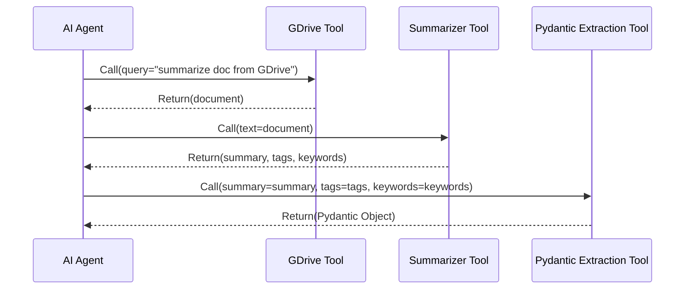
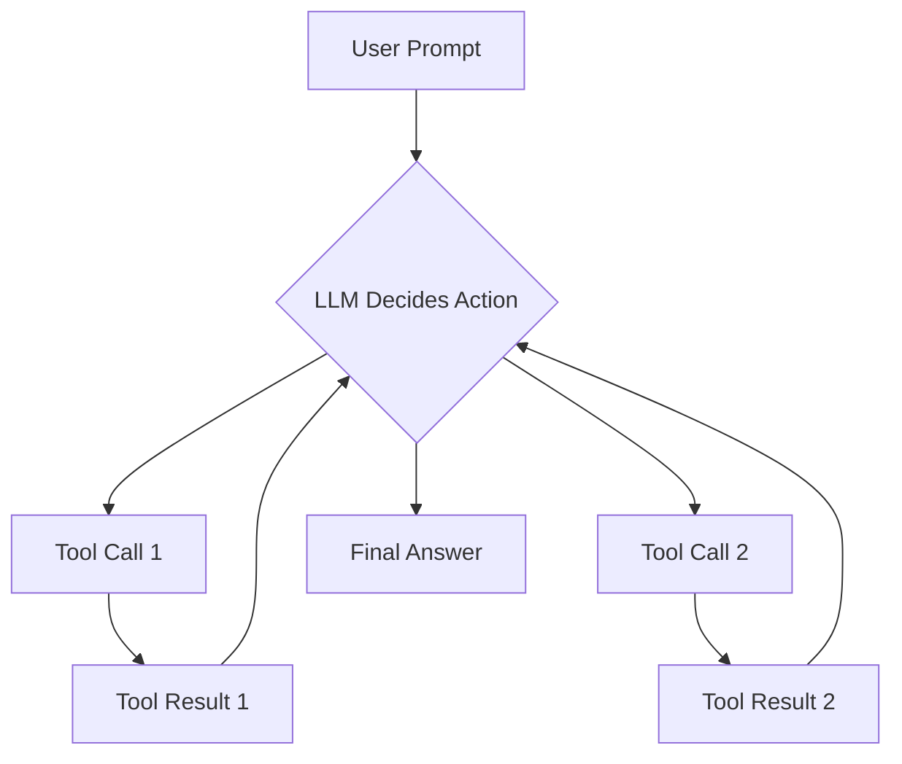

# LLMs: Master Tool Calling
### Give your LLM a hand and a brain

## Introduction

In previous lessons, we covered the fundamentals of Large Language Model (LLM) workflows. You learned context engineering, how to implement structured outputs, and basic patterns like chaining and routing. Now, we will focus on tools, the components that allow an LLM to perform actions. This lesson will show you how to give your LLM this capability, a necessary skill for any AI Engineer who needs to build, debug, and monitor applications that interact with external systems.

## Understanding why agents need tools

Large Language Models (LLMs) are sophisticated pattern matchers, but they have a fundamental limitation: they cannot interact with the external world on their own. They cannot browse the web, access a database, or even check the current time. Their knowledge is static, frozen at the time of their last training run, which means they cannot access real-time information or update themselves with new events [[1]](https://www.projectpro.io/article/llm-limitations/1045), [[2]](https://memgraph.com/blog/llm-limitations-query-enterprise-data), [[3]](https://arxiv.org/html/2412.04503v1), [[4]](https://learnprompting.org/docs/basics/pitfalls). Tools are the engineering solution to this problem.

You can think of an LLM as the "brain" of an operation, capable of reasoning and planning. Tools, then, act as its "hands and senses," providing the connection to the external environment. They allow the LLM to execute actions and interface with external systems, overcoming its inherent static nature [[5]](https://arxiv.org/html/2504.14872v1), [[6]](https://www.edpb.europa.eu/system/files/2025-04/ai-privacy-risks-and-mitigations-in-llms.pdf). This enables an LLM to organize and execute external tasks, compensating for its inability to interact autonomously with the outside world [[7]](https://arxiv.org/html/2507.08034v1), [[8]](https://www.mercity.ai/blog-post/guide-to-integrating-tools-and-apis-with-language-models).

*Figure 1: An LLM using a retrieval tool to access external data before replying to the user.*

Giving an agent access to a set of functions helps it overcome its inherent limitations. Common categories of tools you integrate into production agents include [[7]](https://arxiv.org/html/2507.08034v1), [[8]](https://www.mercity.ai/blog-post/guide-to-integrating-tools-and-apis-with-language-models):
*   **API Access:** Interacting with external services to get real-time information, like today's weather or the latest news from a search engine [[9]](https://www.business-standard.com/technology/tech-news/microsoft-brings-copilot-ai-powered-web-search-mode-on-bing-how-it-works-125022500477_1.html).
*   **Database Interaction:** Querying structured databases (e.g., PostgreSQL, Snowflake) to retrieve specific business data.
*   **Memory Access:** Connecting to a vector database to retrieve relevant information from its long-term memory, a process central to Retrieval-Augmented Generation (RAG). We will discuss agent memory in Lesson 9 and RAG in Lesson 10.
*   **Code Execution:** Running code, typically in a sandboxed Python environment, to perform precise calculations, data manipulation, or statistical analysis [[10]](https://aman.ai/primers/ai/agents/).

## Implementing tool calls from scratch

The best way to understand how tools work is to build a tool-calling framework from scratch. This will show you the mechanics of tool definition, schema structure, how an LLM discovers tools, and how it interprets their outputs.

Our goal is to provide the LLM with a list of available tools and allow it to decide which one to use and what arguments to pass based on your prompt. The high-level flow operates as follows:

1.  **Application:** We provide the LLM with a list of available tools and their descriptions via a system prompt.
2.  **LLM:** It analyzes your query and responds with a `function_call` request, specifying the tool's name and arguments in a structured format like JSON.
3.  **Application:** We parse this request and execute the corresponding function in our code.
4.  **Application:** We send the function's output back to the LLM as additional context.
5.  **LLM:** It uses the tool's output to formulate a final, user-facing response [[11]](https://python.langchain.com/docs/how_to/function_calling/), [[12]](https://blog.christoolivier.com/p/llms-and-functiontool-calling).

This request-execute-respond loop is the fundamental pattern for tool use in AI agents.

*Figure 2: The five-step flow of an LLM tool call, from initial prompt to final response.*

With the high-level flow established, we will now implement this process in code. We will build a simple agent capable of searching for a mock document on Google Drive, summarizing its content, and then sending that summary to a Discord channel.

### Setting Up the Environment and Mock Data
1.  First, we set up our environment by importing the necessary libraries and initializing the Gemini client. We also define a sample financial document to simulate the content of a file found on Google Drive.
    ```python
    import json
    from google import genai
    from google.genai import types
    
    client = genai.Client()
    MODEL_ID = "gemini-1.5-flash"
    
    DOCUMENT = """
    # Q3 2023 Financial Performance Analysis
    
    The Q3 earnings report shows a 20% increase in revenue and a 15% growth in user engagement,
    beating market expectations.
    ...
    """
    ```

### Defining Mock Tools
2.  Next, we define our three tools as simple Python functions. For this example, they are mocked to return predefined data, which allows us to focus on the tool-calling logic itself.
    ```python
    def search_google_drive(query: str) -> dict:
        """
        Searches for a file on Google Drive and returns its content or a summary.
    
        Args:
            query (str): The search query to find the file, e.g., 'Q3 earnings report'.
    
        Returns:
            dict: A dictionary representing the search results, including file names and summaries.
        """
        return {
            "files": [
                {
                    "name": "Q3_Earnings_Report_2024.pdf",
                    "id": "file12345",
                    "content": DOCUMENT,
                }
            ]
        }
    ```
    ```python
    def send_discord_message(channel_id: str, message: str) -> dict:
        """
        Sends a message to a specific Discord channel.
    
        Args:
            channel_id (str): The ID of the channel to send the message to, e.g., '#finance'.
            message (str): The content of the message to send.
    
        Returns:
            dict: A dictionary confirming the action, e.g., {"status": "success"}.
        """
        return {
            "status": "success",
            "status_code": 200,
            "channel": channel_id,
            "message_preview": f"{message[:50]}...",
        }
    ```
    ```python
    def summarize_financial_report(text: str) -> str:
        """
        Summarizes a financial report.
    
        Args:
            text (str): The text to summarize.
    
        Returns:
            str: The summary of the text.
        """
        return "The Q3 2023 earnings report shows strong performance across all metrics..."
    ```

### Creating Tool Schemas
3.  For the LLM to understand these tools, we must provide a schema for each one. This schema, typically in JSON format, describes the tool's name, its purpose, and the parameters it accepts, including their types and whether they are required [[13]](https://www.promptingguide.ai/applications/function_calling). This is the industry standard used by major providers like OpenAI, Google, and Anthropic.
    ```python
    search_google_drive_schema = {
        "name": "search_google_drive",
        "description": "Searches for a file on Google Drive and returns its content or a summary.",
        "parameters": {
            "type": "object",
            "properties": {
                "query": {
                    "type": "string",
                    "description": "The search query to find the file, e.g., 'Q3 earnings report'.",
                }
            },
            "required": ["query"],
        },
    }
    ```
    ```python
    send_discord_message_schema = {
        "name": "send_discord_message",
        "description": "Sends a message to a specific Discord channel.",
        "parameters": { "type": "object", "properties": { "channel_id": { "type": "string", "description": "The ID of the channel to send the message to, e.g., '#finance'." }, "message": { "type": "string", "description": "The content of the message to send." } }, "required": ["channel_id", "message"] },
    }
    
    summarize_financial_report_schema = {
        "name": "summarize_financial_report",
        "description": "Summarizes a financial report.",
        "parameters": { "type": "object", "properties": { "text": { "type": "string", "description": "The text to summarize." } }, "required": ["text"] },
    }
    ```

### Building the Tool Registry
4.  We then create a tool registry to map tool names to their handler functions and aggregate the schemas.
    ```python
    TOOLS = {
        "search_google_drive": {
            "handler": search_google_drive,
            "declaration": search_google_drive_schema,
        },
        "send_discord_message": {
            "handler": send_discord_message,
            "declaration": send_discord_message_schema,
        },
        "summarize_financial_report": {
            "handler": summarize_financial_report,
            "declaration": summarize_financial_report_schema,
        },
    }
    TOOLS_BY_NAME = {tool_name: tool["handler"] for tool_name, tool in TOOLS.items()}
    TOOLS_SCHEMA = [tool["declaration"] for tool in TOOLS.values()]
    ```
    The `TOOLS_BY_NAME` mapping looks like this:
    ```
    Tool name: search_google_drive
    Tool handler: <function search_google_drive at 0x104c7df80>
    ---------------------------------------------------------------------------
    Tool name: send_discord_message
    Tool handler: <function send_discord_message at 0x104c7de40>
    ---------------------------------------------------------------------------
    ...
    ```
    And an entry in `TOOLS_SCHEMA` is the JSON we defined earlier:
    ```json
     {
        "name": "search_google_drive",
        "description": "Searches for a file on Google Drive and returns its content or a summary.",
        "parameters": {
          "type": "object",
          "properties": {
            "query": {
              "type": "string",
              "description": "The search query to find the file, e.g., 'Q3 earnings report'."
            }
          },
          "required": [
            "query"
          ]
        }
      }
    ```

### Crafting the System Prompt
5.  Now, we need a system prompt to instruct the LLM on how to use these tools. This prompt explains the guidelines, the expected output format for a tool call, and provides the list of available tools enclosed in XML tags.
    ```python
    TOOL_CALLING_SYSTEM_PROMPT = """
    You are a helpful AI assistant with access to tools that enable you to take actions and retrieve information.

    ## Tool Usage Guidelines
    ...
    ## Tool Call Format

    When you need to use a tool, output ONLY the tool call in this exact format:

    <tool_call>
    {{"name": "tool_name", "args": {{"param1": "value1", "param2": "value2"}}}}
    </tool_call>
    ...
    ## Available Tools

    <tool_definitions>
    {tools}
    </tool_definitions>
    ...
    """
    ```
    The LLM uses the `description` field in the tool schema to decide if a tool is suitable for a user's query. This means clear, unambiguous descriptions are important for building reliable agents. For instance, if you have two tools with similar descriptions, such as "Tool used to search documents" and "Tool used to search files," the LLM might become confused. We must be explicit: "Tool used to search documents on Google Drive" versus "Tool used to search files on the local disk."

    Clear tool descriptions and explicit user prompts ensure the agent selects the correct tool. This becomes important as you scale to dozens of tools per agent. We will explore scaling methods in Parts 2 and 3 of this course. Once a tool is selected, the LLM generates the function name and arguments as a structured output. This capability is not magic; models are specifically instruction fine-tuned to interpret these schemas and produce valid tool call requests.

### Testing the Tool Calling Mechanism
6.  We will ask the model to find the latest quarterly report.
    ```python
    USER_PROMPT = "Can you help me find the latest quarterly report and share key insights with the team?"
    messages = [TOOL_CALLING_SYSTEM_PROMPT.format(tools=str(TOOLS_SCHEMA)), USER_PROMPT]
    
    response = client.models.generate_content(
        model=MODEL_ID,
        contents=messages,
    )
    ```
    The model correctly identifies the `search_google_drive` tool and generates the necessary arguments:
    ```
    <tool_call>
      {"name": "search_google_drive", "args": {"query": "latest quarterly report"}}
    </tool_call>
    ```

7.  Let's try another example. We will ask the model to find the Q3 earnings report and send a summary to Discord.
    ```python
    USER_PROMPT = """
    Please find the Q3 earnings report on Google Drive and send a summary of it to
    the #finance channel on Discord.
    """
    
    messages = [TOOL_CALLING_SYSTEM_PROMPT.format(tools=str(TOOLS_SCHEMA)), USER_PROMPT]
    
    response = client.models.generate_content(
        model=MODEL_ID,
        contents=messages,
    )
    ```
    The model correctly identifies the `search_google_drive` tool and generates the necessary arguments:
    ```
    <tool_call>
      {"name": "search_google_drive", "args": {"query": "Q3 earnings report"}}
    </tool_call>
    ```

### Parsing the LLM Response and Executing the Tool
8.  Now, let's parse this response and execute the function. First, we extract the JSON string from the LLM's response.
    ```python
    def extract_tool_call(response_text: str) -> str:
        """
        Extracts the tool call from the response text.
        """
        return response_text.split("<tool_call>")[1].split("</tool_call>")[0].strip()
    
    tool_call_str = extract_tool_call(response.text)
    # '{"name": "search_google_drive", "args": {"query": "Q3 earnings report"}}'
    ```

9.  Next, we parse the string into a Python dictionary.
    ```python
    import json
    tool_call = json.loads(tool_call_str)
    # {'name': 'search_google_drive', 'args': {'query': 'Q3 earnings report'}}
    ```

10. We retrieve the actual Python function from our `TOOLS_BY_NAME` registry.
    ```python
    tool_handler = TOOLS_BY_NAME[tool_call["name"]]
    # <function search_google_drive at 0x104c7df80>
    ```

11. Finally, we execute the function with the arguments provided by the LLM.
    ```python
    tool_result = tool_handler(**tool_call["args"])
    ```
    This returns our mocked document content:
    ```json
    {
      "files": [
        {
          "name": "Q3_Earnings_Report_2024.pdf",
          "id": "file12345",
          "content": "\n# Q3 2023 Financial Performance Analysis\n\nThe Q3 earnings report shows..."
        }
      ]
    }
    ```

### Streamlining Tool Execution with a Helper Function
12. We can wrap this logic in a helper function, `call_tool`, to streamline the process.
    ```python
    def call_tool(response_text: str, tools_by_name: dict):
        tool_call_str = extract_tool_call(response_text)
        tool_call = json.loads(tool_call_str)
        tool_name = tool_call["name"]
        tool_args = tool_call["args"]
        tool = tools_by_name[tool_name]
        return tool(**tool_args)
    
    # Using the helper function
    call_tool(response.text, tools_by_name=TOOLS_BY_NAME)
    ```
    The output is the same as before:
    ```json
    {
      "files": [
        {
          "name": "Q3_Earnings_Report_2024.pdf",
          "id": "file12345",
          "content": "\n# Q3 2023 Financial Performance Analysis\n\nThe Q3 earnings report shows..."
        }
      ]
    }
    ```

### Interpreting Tool Output with the LLM
13. The final step in the loop is to send the `tool_result` back to the LLM. This allows it to either formulate a final answer for the user or decide on the next action to take.
    ```python
    response = client.models.generate_content(
        model=MODEL_ID,
        contents=f"Interpret the tool result: {json.dumps(tool_result, indent=2)}",
    )
    ```
    The LLM then provides a natural language summary based on the tool's output:
    ```
    The tool result provides the content of a file named `Q3_Earnings_Report_2024.pdf`.

    This document is a **Q3 2023 Financial Performance Analysis** and details exceptionally strong results, significantly beating market expectations.

    **Key highlights from the report include:**
    *   **Revenue Growth:** A 20% increase in revenue.
    *   **User Engagement:** 15% growth in user engagement.
    ...
    ```
This completes our foundational understanding of tool calling. We have successfully implemented the entire request-execute-respond loop from scratch.

## Implementing a tool calling framework from scratch

Manually defining a JSON schema for every function becomes tedious and unscalable as you add more tools. This approach violates the Don't Repeat Yourself (DRY) principle. Modern agentic frameworks like LangGraph address this by using decorators like `@tool` to automate schema generation [[14]](https://python.langchain.com/docs/concepts/tools/), [[15]](https://langchain-opentutorial.gitbook.io/langchain-opentutorial/15-agent/01-tools).

We can build a small framework to achieve the same automation. Our goal is to create a `@tool` decorator that automatically generates the schema by inspecting a function's signature, its type hints, and its docstring. This centralizes the schema generation logic, making our code cleaner and easier to maintain. This method also follows good software engineering principles, as we standardize how we gather tool schemas in a single, modular place.

Let's refactor our previous implementation to use this decorator-based approach.

1.  First, we define a `ToolFunction` class. This class will hold both the callable function and its automatically generated schema, allowing us to bundle them together.
    ```python
    from typing import Any, Callable, Dict
    
    class ToolFunction:
        def __init__(self, func: Callable, schema: Dict[str, Any]) -> None:
            self.func = func
            self.schema = schema
            self.__name__ = func.__name__
            self.__doc__ = func.__doc__
    
        def __call__(self, *args: Any, **kwargs: Any) -> Any:
            return self.func(*args, **kwargs)
    ```

2.  Next, we implement the `@tool` decorator. In Python, a decorator is a function that takes another function as an argument and extends or modifies its behavior without explicitly changing its source code. Our `@tool` decorator inspects the decorated function's signature and docstring to automatically build the JSON schema.
    ```python
    from inspect import Parameter, signature
    
    def tool(description: str = None) -> Callable[[Callable], ToolFunction]:
        """
        A decorator that creates a tool schema from a function.
        """
        def decorator(func: Callable) -> ToolFunction:
            sig = signature(func)
            properties = {}
            required = []
    
            for param_name, param in sig.parameters.items():
                param_schema = {
                    "type": "string",  # Default, can be enhanced
                    "description": f"The {param_name} parameter",
                }
                if param.default == Parameter.empty:
                    required.append(param_name)
                properties[param_name] = param_schema
    
            schema = {
                "name": func.__name__,
                "description": description or func.__doc__ or f"Executes the {func.__name__} function.",
                "parameters": {
                    "type": "object",
                    "properties": properties,
                    "required": required,
                },
            }
            return ToolFunction(func, schema)
        return decorator
    ```

3.  Now, we can redefine our tools by simply applying the `@tool` decorator to each function. This eliminates the boilerplate of manual schema creation.
    ```python
    @tool()
    def search_google_drive_example(query: str) -> dict:
        """Search for files in Google Drive."""
        # Mock implementation
        return {"files": ["Q3 earnings report"]}
    
    @tool()
    def send_discord_message_example(channel_id: str, message: str) -> dict:
        """Send a message to a Discord channel."""
        return {"message": "Message sent successfully"}
    
    @tool()
    def summarize_financial_report_example(text: str) -> str:
        """Summarize the contents of a financial report."""
        return "Financial report summarized successfully"
    ```
    The decorated function is now a `ToolFunction` object. We can inspect its auto-generated schema, which is identical to the one we wrote manually.

    First, let's define our list of tools and the mappings to access them by name and schema:
    ```python
    tools = [
        search_google_drive_example,
        send_discord_message_example,
        summarize_financial_report_example,
    ]
    tools_by_name = {tool.schema["name"]: tool.func for tool in tools}
    tools_schema = [tool.schema for tool in tools]
    ```
    Now, let's inspect the type of our decorated `search_google_drive_example` function:
    ```python
    print(type(search_google_drive_example))
    ```
    It outputs:
    ```
    <class '__main__.ToolFunction'>
    ```
    As you can see, it is now a `ToolFunction` object. We can also inspect its auto-generated schema:
    ```python
    print(json.dumps(search_google_drive_example.schema, indent=2))
    ```
    The schema is generated correctly:
    ```json
    {
      "name": "search_google_drive_example",
      "description": "Search for files in Google Drive.",
      "parameters": {
        "type": "object",
        "properties": {
          "query": {
            "type": "string",
            "description": "The query parameter"
          }
        },
        "required": [
          "query"
        ]
      }
    }
    ```
    The functional handler can be accessed via the `.func` attribute:
    ```python
    print(search_google_drive_example.func)
    ```
    It outputs:
    ```
    <function __main__.search_google_drive_example at 0x...>
    ```
    Now, let's see how this new method works with LLMs. We will use the same `USER_PROMPT` as before.
    ```python
    USER_PROMPT = """
    Please find the Q3 earnings report on Google Drive and send a summary of it to 
    the #finance channel on Discord.
    """
    
    messages = [TOOL_CALLING_SYSTEM_PROMPT.format(tools=str(tools_schema)), USER_PROMPT]
    
    response = client.models.generate_content(
        model=MODEL_ID,
        contents=messages,
    )
    print(response.text)
    ```
    The LLM correctly identifies the `search_google_drive_example` tool and generates the necessary arguments:
    ```
    <tool_call>
      {"name": "search_google_drive_example", "args": {"query": "Q3 earnings report"}}
    </tool_call>
    ```
    We can then use our `call_tool` function to execute the tool based on the LLM's response:
    ```python
    print(json.dumps(call_tool(response.text, tools_by_name=tools_by_name), indent=2))
    ```
    It outputs:
    ```json
    {
      "files": [
        "Q3 earnings report"
      ]
    }
    ```
    We have our own tool calling framework. This decorator-based approach provides a scalable and maintainable way to manage tools, similar to production-grade frameworks such as LangGraph.

## Implementing production-level tool calls with Gemini

While building from scratch provides insight, production systems benefit from the robustness and optimization of native APIs. We will now use the Gemini API for tool calling, which simplifies the process.

Instead of crafting a detailed system prompt, we can pass our tool definitions directly to the model using its `GenerateContentConfig`. This offloads the instruction-following logic to the API provider, who has fine-tuned the model specifically for this task, leading to more reliable behavior. This approach ensures type-safety, simplifies prompting, and can lead to more explicit refusals from the model when a request cannot be fulfilled according to the schema.

1.  First, we define our tools and configuration for the Gemini model. We use the same schemas we created earlier. The key difference is that we pass them inside a `types.Tool` object and set the `tool_config` to force the model to call a function.
    ```python
    from google.genai import types
    
    tools = [
        types.Tool(
            function_declarations=[
                types.FunctionDeclaration(**search_google_drive_schema),
                types.FunctionDeclaration(**send_discord_message_schema),
            ]
        )
    ]
    config = types.GenerateContentConfig(
        tools=tools,
        tool_config=types.ToolConfig(function_calling_config=types.FunctionCallingConfig(mode="ANY")),
    )
    ```

2.  Now, we can call the model with just the user prompt. The complex system prompt is no longer needed.
    ```python
    USER_PROMPT = """
    Please find the Q3 earnings report on Google Drive and send a summary of it to 
    the #finance channel on Discord.
    """
    
    response = client.models.generate_content(
        model=MODEL_ID,
        contents=[USER_PROMPT],
        generation_config=config,
    )
    ```

3.  The Gemini API returns a structured `FunctionCall` object directly, eliminating the need for manual parsing.
    ```python
    response_message_part = response.candidates[0].content.parts[0]
    function_call = response_message_part.function_call
    # FunctionCall(name='search_google_drive', args={'query': 'Q3 earnings report'})
    ```
    We can then inspect the arguments returned by the model:
    ```python
    print(function_call.args)
    ```
    It outputs:
    ```
    {'query': 'Q3 earnings report'}
    ```

4.  We then extract the handler and arguments to execute the tool, just as before.
    ```python
    tool_handler = TOOLS_BY_NAME[function_call.name]
    tool_result = tool_handler(**function_call.args)
    ```
    This returns our mocked document content:
    ```json
    {
      "files": [
        {
          "name": "Q3_Earnings_Report_2024.pdf",
          "id": "file12345",
          "content": "\n# Q3 2023 Financial Performance Analysis\n\nThe Q3 earnings report shows a 20% increase in revenue and a 15% growth in user engagement,\nbeating market expectations.\n..."
        }
      ]
    }
    ```
    The Gemini Python SDK simplifies this even further by automatically creating schemas from Python functions. You can pass the function callables directly into the `tools` configuration, reducing lines of schema definition and decorator code to just a few.

5.  To simplify the implementation even more, and avoid computing the tool schemas manually or through a `@tool` decorator, Google's `genai` Python SDK supports taking functions directly as input. We create a new `config` object by passing directly the `search_google_drive` and `send_discord_message` functions. The SDK automatically creates the schema based on the signature, type hints, and docstrings of each function, as we did so far with our from-scratch implementations.
    ```python
    config = types.GenerateContentConfig(
        tools=[search_google_drive, send_discord_message],
        tool_config=types.ToolConfig(function_calling_config=types.FunctionCallingConfig(mode="ANY")),
    )
    ```

6.  Now, we call the LLM again with this new configuration.
    ```python
    response = client.models.generate_content(
        model=MODEL_ID,
        contents=[USER_PROMPT],
        generation_config=config,
    )
    ```
    The LLM response is the same as before:
    ```
    FunctionCall(name='search_google_drive', args={'query': 'Q3 earnings report'})
    ```

7.  We can streamline the tool execution with a helper function that directly accepts the `function_call` object.
    ```python
    def call_tool(function_call):
        tool_name = function_call.name
        tool_args = function_call.args
    
        tool_handler = TOOLS_BY_NAME[tool_name]
    
        return tool_handler(**tool_args)
    ```

8.  Using this helper function, we can call the tool from the LLM response in one go:
    ```python
    print(call_tool(response.candidates[0].content.parts[0].function_call))
    ```
    The output is identical:
    ```json
    {
      "files": [
        {
          "name": "Q3_Earnings_Report_2024.pdf",
          "id": "file12345",
          "content": "\n# Q3 2023 Financial Performance Analysis\n\nThe Q3 earnings report shows a 20% increase in revenue and a 15% growth in user engagement,\nbeating market expectations.\n..."
        }
      ]
    }
    ```
    By using Gemini's native SDK, we reduced the tool implementation from dozens of lines of code to just a few. This native approach is not unique to Gemini. Other major APIs from providers like OpenAI and Anthropic follow a similar logic, allowing you to transfer these skills across different platforms [[16]](https://platform.openai.com/docs/guides/function-calling). By using the native SDK, you write less code, reduce potential errors, and build more robust, production-ready agents.

## Using Pydantic models as tools for on-demand structured outputs

In Lesson 4, we covered structured outputs. We can combine that concept with tool calling by using Pydantic models as tools. This approach provides a clean way to get validated, structured data when an agent needs it.

Instead of forcing a structured output at every step, an agent can use unstructured text for intermediate reasoning, which is often easier for an LLM. The agent then dynamically decides to call the Pydantic "tool" only when it needs to generate a structured final answer [[17]](https://xebia.com/blog/enforce-and-validate-llm-output-with-pydantic/). This pattern is particularly useful for agents that interact with other systems expecting a specific, validated data format.

*Figure 3: An agent using multiple tools sequentially, with the final step being a Pydantic tool for structured data extraction.*

Let's see how to implement this.

1.  First, we define our `DocumentMetadata` Pydantic model, which specifies the exact structure we want to extract.
    ```python
    from pydantic import BaseModel, Field
    
    class DocumentMetadata(BaseModel):
        """A class to hold structured metadata for a document."""
        summary: str = Field(description="A concise, 1-2 sentence summary of the document.")
        tags: list[str] = Field(description="A list of 3-5 high-level tags relevant to the document.")
        keywords: list[str] = Field(description="A list of specific keywords or concepts mentioned.")
        quarter: str = Field(description="The quarter of the financial year...")
        growth_rate: str = Field(description="The growth rate of the company...")
    ```

2.  Next, we define this Pydantic model as a tool. We create a function declaration named `extract_metadata` and pass its schema to the `parameters` field using `DocumentMetadata.model_json_schema()`. This automatically generates a JSON schema from our Pydantic model, ensuring consistency between our Python data model and the schema the LLM uses for structured output.
    ```python
    extraction_tool = types.Tool(
        function_declarations=[
            types.FunctionDeclaration(
                name="extract_metadata",
                description="Extracts structured metadata from a financial document.",
                parameters=DocumentMetadata.model_json_schema(),
            )
        ]
    )
    config = types.GenerateContentConfig(
        tools=[extraction_tool],
        tool_config=types.ToolConfig(function_calling_config=types.FunctionCallingConfig(mode="ANY")),
    )
    ```

3.  We prompt the LLM to analyze our document and extract the metadata.
    ```python
    prompt = f"""
    Please analyze the following document and extract its metadata.
    
    Document:
    --- 
    {DOCUMENT}
    --- 
    """
    
    response = client.models.generate_content(model=MODEL_ID, contents=[prompt], generation_config=config)
    ```

4.  The LLM responds with a `function_call` to `extract_metadata`, with the arguments perfectly matching our Pydantic schema. We then instantiate the Pydantic object, which automatically validates the structure and types of the extracted data. This validation step is important; if the LLM's output does not conform to the `DocumentMetadata` schema, Pydantic raises a `ValidationError`, preventing malformed data from proceeding in your application [[18]](https://docs.pydantic.dev/latest/concepts/models/).
    ```python
    function_call = response.candidates[0].content.parts[0].function_call
    # FunctionCall(name='extract_metadata', args={'growth_rate': '20%', 'summary': '...', ...})
    
    try:
        document_metadata = DocumentMetadata(**function_call.args)
        print("Validation successful!")
        print(document_metadata.model_dump_json(indent=2))
    except Exception as e:
        print(f"Validation failed: {e}")
    ```
This pattern ensures that an agent's final output is structured, validated, and ready for reliable use in downstream applications.

## The downsides of running tools in a loop

So far, we have focused on single tool calls. However, many tasks require multiple steps, chaining several tools together. The next logical step is to run tools in a loop, allowing the LLM to decide the next tool to call based on the previous output. This approach provides flexibility and the ability to handle complex user requests.

*Figure 4: A diagram illustrating the iterative tool-calling loop.*

Let's implement a loop to handle a request that requires finding a report, summarizing it, and then sending the summary.

1.  First, we set up our tools and configuration, making all three functions available to the model.
    ```python
    tools = [
        types.Tool(
            function_declarations=[
                types.FunctionDeclaration(**search_google_drive_schema),
                types.FunctionDeclaration(**send_discord_message_schema),
                types.FunctionDeclaration(**summarize_financial_report_schema),
            ]
        )
    ]
    config = types.GenerateContentConfig(
        tools=tools,
        tool_config=types.ToolConfig(function_calling_config=types.FunctionCallingConfig(mode="ANY")),
    )
    ```

2.  We start a conversation with the user's multi-step request and make the first call to the LLM.
    ```python
    USER_PROMPT = """
    Please find the Q3 earnings report on Google Drive and send a summary of it to 
    the #finance channel on Discord.
    """
    messages = [types.Content(role="user", parts=[types.Part.from_text(USER_PROMPT)])]
    
    response = client.models.generate_content(
        model=MODEL_ID,
        contents=messages,
        generation_config=config,
    )
    ```
    The LLM correctly identifies the first step, which is to search Google Drive, and generates the corresponding function call:
    ```
    FunctionCall(name='search_google_drive', args={'query': 'Q3 earnings report'})
    ```

3.  Now, we implement the loop. At each step, we execute the tool call, append the result to our message history, and send it back to the LLM to decide the next action.
    ```python
    max_iterations = 3
    while response.candidates[0].content.parts[0].function_call and max_iterations > 0:
        # Append the model's function call request to history
        messages.append(response.candidates[0].content)
        
        # Execute the tool
        function_call = response.candidates[0].content.parts[0].function_call
        tool_result = call_tool(function_call)
    
        # Append the tool result to history
        function_response_part = types.Part.from_function_response(
            name=function_call.name,
            response={"result": tool_result},
        )
        messages.append(types.Content(role="model", parts=[function_response_part]))
    
        # Call the model again to decide the next step
        response = client.models.generate_content(
            model=MODEL_ID,
            contents=messages,
            generation_config=config,
        )
        max_iterations -= 1
    ```
    The agent successfully chains the tools: `search_google_drive` -> `summarize_financial_report` -> `send_discord_message`.

Running tools in a loop is powerful for multi-step tasks, but this approach has limitations. It assumes the agent should call a tool at each iteration and does not provide explicit opportunities for the model to reason about tool outputs before deciding on the next action. The agent immediately moves to the next function call without pausing to think about what it learned or whether it should change strategy. This can lead to inefficient tool usage or getting stuck in repetitive loops [[19]](https://arxiv.org/pdf/2503.13657), [[20]](https://arxiv.org/html/2412.01130v2). For example, agents might repeat the same actions without making progress, show a disconnect between their reasoning and actions, or fail to verify if a tool call achieved its intended effect [[19]](https://arxiv.org/pdf/2503.13657).

To further optimize tool calling, when tools are independent of each other, we can run them in parallel. This means multiple tools can be called simultaneously, such as fetching financial news and stock prices at the same time. The core benefit of parallel execution is reduced latency, as the agent does not have to wait for one tool's result before initiating another. Modern LLM APIs, including Google's Gemini, support parallel function calling, allowing for more efficient data gathering or action execution [[21]](https://atamel.dev/posts/2024/08-06_deepdive_function_calling_gemini/), [[22]](https://cloud.google.com/vertex-ai/generative-ai/docs/multimodal/function-calling), [[23]](https://ai.google.dev/gemini-api/docs/function-calling).

These limitations of simple loops pushed the industry to develop more sophisticated patterns like ReAct (Reasoning and Acting), which explicitly interleaves reasoning steps with tool calls. We will explore ReAct patterns in Lesson 7 and Lesson 8.

## Going through popular tools used within the industry

To ground these concepts in real-world applications, we will survey the common categories of tools that power production AI agents.

### Knowledge & Memory Access
These tools enable an agent to retrieve information from external knowledge sources. They form the basis for building agents that answer questions about private data or recent events. Examples include tools for querying vector databases, document stores, or graph databases. A more advanced pattern, text-to-SQL, allows a tool to construct and execute SQL queries against traditional databases based on natural language. We will cover agentic RAG in Lesson 10 and agent memory in Lesson 9.

### Web Search & Browsing
This is one of the most visible applications of tool use. Agents like Google's Gemini, Perplexity AI, and Microsoft Copilot use tools that interface with search engine APIs. This allows them to fetch up-to-date information from the internet [[24]](https://gaper.io/perplexity-ai-vs-google-gemini-vs-chatgpt/), [[25]](https://support.microsoft.com/en-us/topic/copilot-in-bing-our-approach-to-responsible-ai-45b5eae8-7466-43e1-ae98-b48f8ff8fd44). More advanced versions include web scraping tools. These can extract and parse content directly from web pages, enabling agents to perform in-depth research.

### Code Execution
Giving an agent a code interpreter, usually a sandboxed Python environment, unlocks powerful capabilities. This includes data analysis, computation, and visualization [[26]](https://arxiv.org/html/2506.18096v1). Instead of trying to perform math with its limited reasoning abilities, the agent can write and execute code to get a precise answer.

⚠️ This is also the most dangerous tool. Executing LLM-generated code poses security risks. It is important to run it in a secure, isolated sandbox. This prevents arbitrary code execution or unauthorized system access [[27]](https://dida.do), [[28]](https://dida.do/blog/setting-up-a-secure-python-sandbox-for-llm-agents).

### Other Popular Tools
Beyond these core categories, other popular tools enhance AI agents. These include interacting with external APIs for calendar, email, or project management. Such tools are common in enterprise AI applications. File system operations, like reading or writing files and listing directories, are also widely used in productivity AI applications that interact with your operating system.

## Conclusion

Tool calling is the mechanism that allows an LLM to interact with the world. Understanding how to define, implement, and orchestrate tools is a core skill for building, monitoring, and debugging any serious AI application. In this lesson, we showed you how to build this capability from scratch, use production APIs, and chain tools together to solve complex problems.

We also identified the limitations of simple loops, which sets the stage for our next topic. In Lesson 7, we will explore the theory behind planning and the ReAct pattern. We will also learn about agent memory in Lesson 9 and RAG in Lesson 10.

## References

- [1] [10 Major Limitations of Large Language Models (LLMs) in 2024](https://www.projectpro.io/article/llm-limitations/1045)
- [2] [LLM Limitations: Why LLMs Can't Query Your Enterprise Data](https://memgraph.com/blog/llm-limitations-query-enterprise-data)
- [3] [Pre-training of Large Language Models](https://arxiv.org/html/2412.04503v1)
- [4] [Pitfalls](https://learnprompting.org/docs/basics/pitfalls)
- [5] [LLMOrch: A System for Orchestrating Large Language Model-based Agents](https://arxiv.org/html/2504.14872v1)
- [6] [AI, Privacy Risks and Mitigations in Large Language Models](https://www.edpb.europa.eu/system/files/2025-04/ai-privacy-risks-and-mitigations-in-llms.pdf)
- [7] [Athena: A Framework for the Integration of External Tools with Large Language Models](https://arxiv.org/html/2507.08034v1)
- [8] [Comprehensive Guide to Integrating Tools and APIs with Language Models](https://www.mercity.ai/blog-post/guide-to-integrating-tools-and-apis-with-language-models)
- [9] [Microsoft brings Copilot AI-powered web search mode on Bing: How it works](https://www.business-standard.com/technology/tech-news/microsoft-brings-copilot-ai-powered-web-search-mode-on-bing-how-it-works-125022500477_1.html)
- [10] [AI Agents Primer (Part 1)](https://aman.ai/primers/ai/agents/)
- [11] [How to use tools with LLMs](https://python.langchain.com/docs/how_to/function_calling/)
- [12] [LLMs and Function/Tool Calling](https://blog.christoolivier.com/p/llms-and-functiontool-calling)
- [13] [Function Calling](https://www.promptingguide.ai/applications/function_calling)
- [14] [Concepts - Tools](https://python.langchain.com/docs/concepts/tools/)
- [15] [Tools](https://langchain-opentutorial.gitbook.io/langchain-opentutorial/15-agent/01-tools)
- [16] [Function calling](https://platform.openai.com/docs/guides/function-calling)
- [17] [Enforce and validate LLM output with Pydantic](https://xebia.com/blog/enforce-and-validate-llm-output-with-pydantic/)
- [18] [Models - Pydantic](https://docs.pydantic.dev/latest/concepts/models/)
- [19] [An Empirical Study of Failure Modes in Multi-Agent LLM Systems](https://arxiv.org/pdf/2503.13657)
- [20] [A Systematic Investigation of Function-Calling LLMs](https://arxiv.org/html/2412.01130v2)
- [21] [A Deep Dive into Function Calling in Gemini](https://atamel.dev/posts/2024/08-06_deepdive_function_calling_gemini/)
- [22] [Function calling](https://cloud.google.com/vertex-ai/generative-ai/docs/multimodal/function-calling)
- [23] [Function calling with the Gemini API](https://ai.google.dev/gemini-api/docs/function-calling)
- [24] [Perplexity AI vs Google Gemini vs ChatGPT: The Ultimate Comparison](https://gaper.io/perplexity-ai-vs-google-gemini-vs-chatgpt/)
- [25] [Copilot in Bing: Our approach to responsible AI](https://support.microsoft.com/en-us/topic/copilot-in-bing-our-approach-to-responsible-ai-45b5eae8-7466-43e1-ae98-b48f8ff8fd44)
- [26] [Deep Research Agents: The Future of Scientific Discovery](https://arxiv.org/html/2506.18096v1)
- [27] [Setting Up a Secure Python Sandbox for LLM Agents](https://dida.do)
- [28] [Setting up a secure Python sandbox for LLM agents](https://dida.do/blog/setting-up-a-secure-python-sandbox-for-llm-agents)