# AI Agents: Beyond the Hype
### Tools & structured outputs for LLM agents

## Beyond the Hype: The Real Engineering Behind AI Agent Tools and Structured Outputs

The hype around AI agents is deafening. We’re promised autonomous systems that can handle any task, but the reality is that Large Language Models (LLMs) are, by themselves, just sophisticated text generators. They can't do much in the real world. To build something genuinely useful, you need to go beyond the model and engineer a system that can reliably perform actions.

This article cuts through the noise. We'll get straight to the engineering truth of what it takes to build functional AI agents. We’ll start by looking at why LLMs are powerless on their own and introduce the two foundational components that give them capabilities: tools and structured outputs. Tools are what allow an agent to interact with the outside world, and structured outputs are what make those interactions predictable and reliable enough for production.

We’ll move from theory and from-scratch implementations to show you how modern libraries like Gemini streamline the process. This is a no-nonsense guide to the core engineering you need to master to build real-world AI applications.

## Why Agents Are Powerless Without Tools

Let's be clear: a Large Language Model (LLM) is a text prediction engine. It's trained on a massive, static dataset, so its knowledge is frozen in time. An LLM has no awareness of real-time events, no access to your private data, and no ability to interact with external systems. It can't check the weather, query a database, or execute code.

Because its core function is to predict the next word, an LLM can also generate plausible-sounding but false information, a phenomenon known as "hallucinations." In its raw form, an LLM is a brain in a jar, completely disconnected from the real world [1](https://leehanchung.github.io/blogs/2024/05/09/tools-for-llms/).

This is where tools come in. Tools are the bridge between the LLM's reasoning capabilities and the outside world. They are simply functions or APIs that the agent's orchestrator can execute based on the LLM's instructions. You can think of tools as the agent's hands and senses. They provide the mechanism for the agent to perceive new information and to take action. Without them, an agent is just a chatbot.


For an agent to do anything useful—like fetching real-time stock prices or sending an email—it needs access to the right tools. The LLM acts as the decision-making component, determining *which* tool to use and *what* parameters to pass, but it is your application's code that actually executes the tool and returns the result. This loop of decision, action, and observation is the fundamental operating principle of any functional AI agent [1](https://leehanchung.github.io/blogs/2024/05/09/tools-for-llms/).

This separation of concerns is critical. The LLM is responsible for reasoning and planning, while the tools handle the actual interaction with external systems. This architecture allows you to grant an agent specific, controlled capabilities, ensuring it operates within defined guardrails. You define the tools, you control their execution, and the LLM simply directs their use.

## How Tool Calling Actually Works: A From-Scratch Implementation

The concept of "tool calling" might sound complex, but the underlying mechanism is a straightforward loop: the LLM suggests a tool, your code executes it, and you feed the result back to the LLM. Let's break down how it works by building a simple implementation from scratch to understand the core logic.


First, you define your tools as Python functions. The docstrings are critical, as they serve as the descriptions the LLM uses to understand what each tool does and when to use it [2](https://platform.openai.com/docs/guides/function-calling).

```python
import json

def search_google_drive(query: str) -> str:
    """
    Searches for a file on Google Drive and returns its content or a summary.

    Args:
        query (str): The search query to find the file, e.g., 'Q3 earnings report'.

    Returns:
        str: A JSON string representing the search results.
    """
    print(f"---> Searching Google Drive for: '{query}'")
    if "q3 earnings report" in query.lower():
        return json.dumps({"files": [{"name": "Q3_Earnings_Report_2024.pdf", "summary": "The Q3 earnings report shows a 20% increase in revenue."}]})
    return json.dumps({"files": []})

def send_discord_message(channel_id: str, message: str) -> str:
    """
    Sends a message to a specific Discord channel.

    Args:
        channel_id (str): The ID of the channel to send the message to, e.g., '#finance'.
        message (str): The content of the message to send.

    Returns:
        str: A JSON string confirming the action.
    """
    print(f"---> Sending message to Discord channel '{channel_id}': '{message}'")
    return json.dumps({"status": "success"})
```

Next, you provide the LLM with a machine-readable schema for each tool. This schema, typically in JSON Schema format, formally describes the tool's name, purpose, and input parameters. This is how the LLM knows the exact arguments it needs to generate.

```python
search_google_drive_declaration = {
    "name": "search_google_drive",
    "description": "Searches for a file on Google Drive and returns its content or a summary.",
    "parameters": {
        "type": "object",
        "properties": {
            "query": {
                "type": "string",
                "description": "The search query to find the file, e.g., 'Q3 earnings report'.",
            }
        },
        "required": ["query"],
    },
}

send_discord_message_declaration = {
    "name": "send_discord_message",
    "description": "Sends a message to a specific Discord channel.",
    "parameters": {
        "type": "object",
        "properties": {
            "channel_id": {"type": "string", "description": "The ID of the channel, e.g., '#finance'."},
            "message": {"type": "string", "description": "The content of the message to send."},
        },
        "required": ["channel_id", "message"],
    },
}

TOOLS_SCHEMA = [search_google_drive_declaration, send_discord_message_declaration]
TOOLS_BY_NAME = {
    "search_google_drive": search_google_drive,
    "send_discord_message": send_discord_message,
}
```

With the schemas defined, you construct a system prompt. This prompt includes the user's query, the tool schemas, and explicit instructions on how to format the output when calling a tool. This manual instruction is the essence of a from-scratch implementation.

```python
SYSTEM_PROMPT = f"""
You are a helpful assistant that can use tools. To use a tool, output its name and arguments in this format:
TOOL_CALL: {{"name": "tool_name", "args": {{"arg1": "value1"}}}}

<tool_definitions>
{json.dumps(TOOLS_SCHEMA, indent=2)}
</tool_definitions>
"""

USER_PROMPT = "Please find the Q3 earnings report and send a summary to the #finance channel."

messages = [SYSTEM_PROMPT, USER_PROMPT]
```

The LLM processes this prompt and, instead of a conversational reply, generates a `TOOL_CALL` string in the exact format you specified. This is a structured instruction for your application.

```python
# Assume `client` is an initialized LLM client
response = client.models.generate_content(
    model="gemini-1.5-flash-latest",
    contents=messages,
)

# LLM Output:
# 'TOOL_CALL: {"name": "search_google_drive", "args": {"query": "Q3 earnings report"}}'
```

Your application code then parses this `TOOL_CALL` string to extract the tool's name and arguments. It looks up the corresponding Python function and executes it with the provided arguments.

```python
# 1. Parse the tool call from the LLM's text response
tool_call_str = response.text.split("TOOL_CALL:")[1].strip()
tool_call = json.loads(tool_call_str)

# 2. Execute the function
tool_name = tool_call["name"]
tool_args = tool_call["args"]
tool_handler = TOOLS_BY_NAME[tool_name]
tool_result = tool_handler(**tool_args)

# tool_result will be:
# '{"files": [{"name": "Q3_Earnings_Report_2024.pdf", "summary": "The Q3 earnings report shows a 20% increase in revenue."}]}'
```

Finally, you send the `tool_result` back to the LLM. This closes the loop, providing the model with the "observation" from its action. The LLM uses this new information to either call another tool or formulate a final response for the user. This manual, step-by-step flow is exactly what modern LLM libraries automate, but understanding it is key to debugging and building robust agentic systems.

## Simplifying Tool Calls with the Gemini API

Building the tool-calling loop from scratch is insightful, but it's inefficient and error-prone for production. Modern LLM APIs from Google, OpenAI, or Anthropic provide built-in support for tool calling that abstracts away the manual parsing and prompting.

Let's refactor our previous example using the Gemini API. The principle is the same: define tools, let the model choose, execute the tool, and return the result. The library, however, handles the low-level details. First, you define your tools and wrap them in the library's `Tool` structure.

```python
from google.genai import types, GenerativeModel

# Tool declarations (dictionaries) remain the same as before
search_google_drive_declaration = {
    "name": "search_google_drive",
    "description": "Searches for a file on Google Drive and returns its content or a summary.",
    "parameters": {
        "type": "object",
        "properties": {"query": {"type": "string", "description": "The search query to find the file."}},
        "required": ["query"],
    },
}
send_discord_message_declaration = {
    "name": "send_discord_message",
    "description": "Sends a message to a specific Discord channel.",
    "parameters": {
        "type": "object",
        "properties": {
            "channel_id": {"type": "string", "description": "The ID of the channel."},
            "message": {"type": "string", "description": "The content of the message."},
        },
        "required": ["channel_id", "message"],
    },
}

tools = types.Tool(
    function_declarations=[
        types.FunctionDeclaration(**search_google_drive_declaration),
        types.FunctionDeclaration(**send_discord_message_declaration),
    ]
)
```

Next, you configure the model to use these tools by passing the `tools` object and setting the `tool_config` to `AUTO`. This tells the model it can decide whether to call a function or respond directly. The API response will contain a structured `FunctionCall` object, which you can use to execute the tool and send the result back. The library handles the loop until a final text response is generated.

```python
model = GenerativeModel(
    model_name="gemini-1.5-flash-latest",
    tools=[tools],
    tool_config={"function_calling_config": "AUTO"}
)
chat = model.start_chat()
response = chat.send_message("Please find the Q3 earnings report and send a summary to the #finance channel.")

# The library handles the tool call detection and parsing
# You would add logic here to execute the function call from the response
# and send the result back to the chat to get the final answer.
```

This approach is cleaner, more robust, and standard across major LLM providers.

## Enforcing Sanity: Why Your Agent Needs Structured Outputs

Relying on an LLM to generate free-form text and then trying to parse it with regular expressions is a recipe for failure in a production environment. LLMs are non-deterministic; a slight change in the model or prompt can alter the output format, breaking your parsing logic. For an agent to be reliable, its outputs must be predictable and machine-readable.

This is where structured outputs come in. By compelling the LLM to respond in a specific format, like JSON, your application can programmatically and reliably use its output. The primary benefit is reliability. Instead of hoping the model includes "Name:" and "Date:", you force it to return a JSON object with `{"name": "...", "date": "..."}`. This eliminates fragile parsing logic and makes your system more robust [3](https://openai.com/index/introducing-structured-outputs-in-the-api/).

Common use cases include:
*   **Entity Extraction:** Pulling specific information like names or dates from text.
*   **Data Formatting:** Converting unstructured input into a format required by another API.
*   **Classification:** Forcing the model to categorize input into predefined categories.
*   **Agentic Final Answers:** Ensuring an agent's final output is a structured object.

Consider it a way to enforce a contract on the LLM's output. You trade some of its generative freedom for the predictability required to build stable software.

```mermaid
graph TD
    subgraph Fragile Approach
        A[Unstructured Text] --> B{LLM};
        B --> C["Free-form text response with entities"];
        C --> D["Parse with Regex/String Splitting"];
        D --> E((Broken System 👎));
    end

    subgraph Robust Approach
        F[Unstructured Text] --> G{LLM with Schema};
        G --> H["Guaranteed JSON Output"];
        H --> I["Parse with json.loads()"];
        I --> J((Reliable System 👍));
    end
```



## From-Scratch Structured Outputs Using JSON Schemas

The most fundamental way to enforce structured outputs is by explicitly telling the LLM to generate JSON that conforms to a specific schema. This from-scratch method involves modifying the prompt to include the desired JSON structure and configuring the model to output in JSON format. This gives you a clear understanding of the underlying mechanics.

Let's consider extracting metadata from a document. We need a summary, tags, and keywords. First, we define the exact JSON structure we expect directly in the prompt. The clearer the schema, the better the LLM will perform.

```python
document = """
# Article: The Rise of AI Agents

This article discusses the recent advancements in AI, focusing on autonomous agents.
We explore how Large Language Models (LLMs) are moving beyond simple text generation
to perform complex, multi-step tasks.
"""

# Define the desired JSON structure within the prompt
prompt = f"""
Please analyze the following document and extract metadata from it.
The output must be a single, valid JSON object with the following structure:
{{
  "summary": "A concise summary of the article.",
  "tags": ["list", "of", "relevant", "tags"],
  "keywords": ["list", "of", "key", "concepts"]
}}

Document:
---
{document}
---
"""
```

To guarantee the output is syntactically correct JSON, we configure the API call to enforce it. Most modern LLM APIs, including Google's Gemini, provide a parameter to set the response's MIME type to `application/json`. This is often called "JSON mode" and is a crucial step in ensuring machine-readability, though it doesn't strictly enforce adherence to a complex schema beyond basic validity [3](https://openai.com/index/introducing-structured-outputs-in-the-api/).

```python
from google.genai import types
import json

# Configure the model to output JSON
config = types.GenerateContentConfig(response_mime_type="application/json")

# Assume `client` is an initialized Gemini client
response = client.models.generate_content(
    model="gemini-1.5-flash-latest",
    contents=prompt,
    config=config
)

print("--- Raw LLM Output ---")
print(response.text)
```

Because we forced the output to be JSON, we can now reliably parse this string into a Python dictionary using `json.loads()`. This is a significant improvement over trying to extract data from unstructured text using fragile string manipulation or regular expressions.

```python
# You can now reliably parse the JSON string
try:
    metadata_obj = json.loads(response.text)
    print("\n--- Parsed JSON Object ---")
    print(metadata_obj)
    # Now you can access keys like metadata_obj['summary']
except json.JSONDecodeError:
    print("Failed to parse JSON.")
```

This explicit method is powerful, but managing complex schemas as raw strings in prompts can become cumbersome. It can also lead to issues like "schema drift" if the Python code and the prompt's schema fall out of sync [4](https://techinfotech.tech.blog/2025/06/09/best-practices-to-build-llm-tools-in-2025/). That’s where data validation libraries like Pydantic provide a more robust solution.

## The Pydantic Advantage: Robust Structured Outputs

While manually injecting JSON schemas into prompts works, it's clunky and offers no data validation. If the LLM returns a string for a field where you expect an integer, your code might fail. This is why Pydantic has become the industry standard for defining structured data in Python-based AI applications.

Pydantic lets you define data structures as Python classes, providing a single source of truth for your schema and automatic type checking. If the LLM's data doesn't match your defined types, Pydantic raises an error, preventing bad data from propagating through your system [3](https://openai.com/index/introducing-structured-outputs-in-the-api/).

Let's refactor our metadata extraction example using Pydantic. First, we define our `DocumentMetadata` class. The field descriptions also serve as valuable instructions for the LLM.

```python
from pydantic import BaseModel, Field
from typing import List

class DocumentMetadata(BaseModel):
    """A class to hold structured metadata for a document."""
    summary: str = Field(description="A concise, 1-2 sentence summary.")
    tags: List[str] = Field(description="A list of 3-5 high-level tags.")
    keywords: List[str] = Field(description="A list of specific keywords.")
```

You can generate a JSON schema from the Pydantic model using `.model_json_schema()` and inject it into the prompt. This is more robust than writing JSON by hand because the schema is always in sync with your Python code, preventing schema drift [4](https://techinfotech.tech.blog/2025/06/09/best-practices-to-build-llm-tools-in-2025/).

```python
# Generate schema from the Pydantic model
schema = DocumentMetadata.model_json_schema()

prompt = f"""
Please analyze the document and extract metadata conforming to this JSON Schema:
```json
{json.dumps(schema, indent=2)}```
...
"""
# After getting the LLM response...
validated_metadata = DocumentMetadata.model_validate_json(response.text)
```

A more powerful approach, especially in agentic workflows, is to define the Pydantic model as a **tool**. You instruct the agent to "call" a function whose parameters are defined by your Pydantic model. The LLM's "arguments" for this function call will be your structured data, already validated against your model. This is particularly useful when you want the final output of an agent to be a structured object [3](https://openai.com/index/introducing-structured-outputs-in-the-api/).

## Industry Best Practice: Gemini and Pydantic Integration

The industry best practice combines tool calling with Pydantic for maximum reliability. You define your desired output structure as a Pydantic model and declare it as the single tool the agent can use. This forces the model's final output to be a validated, structured object.

This approach is the most robust way to get structured data from an LLM. It's concise, type-safe, and leverages the native tool-calling features of modern APIs, making it ideal for production systems. Many modern libraries, like Gemini's, can accept a Pydantic model directly in the tool definition, simplifying the process even further.

```python
from pydantic import BaseModel, Field
from typing import List
import google.generativeai as genai

class DocumentMetadata(BaseModel):
    """Tool to extract structured metadata from a document."""
    summary: str = Field(description="A concise summary.")
    tags: List[str] = Field(description="A list of relevant tags.")

# Assume `genai` is configured with an API key
model = genai.GenerativeModel(
    model_name="gemini-1.5-flash-latest",
    tools=[DocumentMetadata] # Pass the Pydantic model directly
)
chat = model.start_chat(enable_automatic_function_calling=True)

prompt = "Analyze this document and extract its metadata: The Rise of AI Agents..."
response = chat.send_message(prompt)

# The library automatically calls the tool and returns the result.
# The final response text would contain the extracted data in a user-friendly format.
print(response.text)
```

## An Overview of Essential Agent Tools in the Wild

Now that we understand the mechanics, let's survey the most common tool categories in production-grade systems. Equipping an agent with the right tools transforms it from a simple text processor into a capable system.

### Knowledge and Memory Access
One of the biggest limitations of LLMs is their static knowledge. Tools that provide access to external information are fundamental.

*   **Retrieval-Augmented Generation (RAG) Tools:** These are arguably the most critical tools for knowledge-intensive tasks. A RAG tool allows an agent to query a vector database to fetch relevant information before generating a response. This gives the agent access to up-to-date or proprietary knowledge, acting as its long-term memory [5](https://www.promptingguide.ai/research/llm-agents).
*   **Database Query Tools:** For structured data, agents can use tools to construct and execute SQL or NoSQL queries. This allows them to answer questions like "How many users signed up last month?" by directly querying a production database.

### Interaction with the Outside World
To be useful, agents need to perceive and act upon the dynamic world.

*   **Web Search and Browsing:** This classic tool gives agents access to real-time information on the internet. By integrating with search APIs, an agent can answer questions about current events or look up the latest documentation.
*   **API Interaction:** This category is incredibly powerful. By giving an agent tools to interact with external APIs, you enable it to perform almost any action: send an email, schedule a calendar event, or post a message to Slack.

### Code Execution
LLMs are notoriously bad at precise math and complex logic. Offloading these tasks to a code interpreter is essential.

*   **Python Interpreter:** A sandboxed Python environment is one of the most versatile tools an agent can have. It allows the agent to write and execute code to perform calculations or manipulate data. Security is paramount; you must securely sandbox the execution environment to prevent malicious actions [6](https://dida.do/blog/setting-up-a-secure-python-sandbox-for-llm-agents).

## Conclusion

AI agents are not magic. They are engineered systems built on a few core principles. We started by acknowledging the inherent limitations of LLMs—they are powerful reasoners but are disconnected from the real world. We then introduced tools as the essential bridge, giving agents the "hands and senses" needed to interact with external systems, access data, and perform actions.

We demystified tool calling, starting with a from-scratch implementation to understand its core mechanics and moving to modern libraries like Gemini for an efficient, industry-standard approach. We also established why structured outputs are non-negotiable. Forcing an LLM's output into predictable, machine-readable JSON, and validating it with Pydantic, builds robust production systems.

Mastering the use of tools and structured outputs is a fundamental step for any engineer looking to move beyond simple chatbots. These are the building blocks that transform a text generator into a functional agent capable of solving real-world problems.

## References

- [1] [Tools for Large Language Model Agents](https://leehanchung.github.io/blogs/2024/05/09/tools-for-llms/)
- [2] [Function calling - OpenAI API](https://platform.openai.com/docs/guides/function-calling)
- [3] [Introducing Structured Outputs in the API | OpenAI](https://openai.com/index/introducing-structured-outputs-in-the-api/)
- [4] [Best practices to build LLM tools in 2025](https://techinfotech.tech.blog/2025/06/09/best-practices-to-build-llm-tools-in-2025/)
- [5] [LLM Agents](https://www.promptingguide.ai/research/llm-agents)
- [6] [Setting up a secure Python sandbox for LLM agents](https://dida.do/blog/setting-up-a-secure-python-sandbox-for-llm-agents)