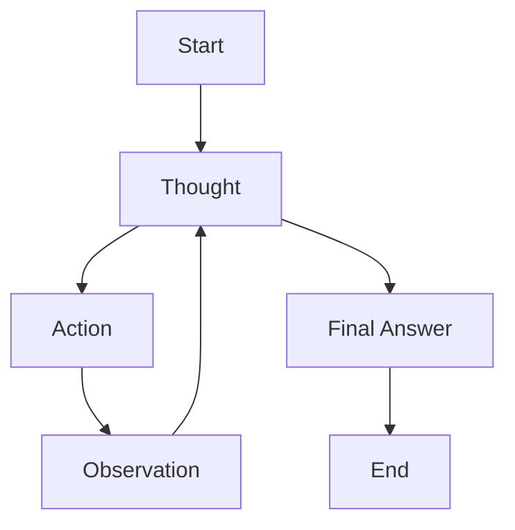
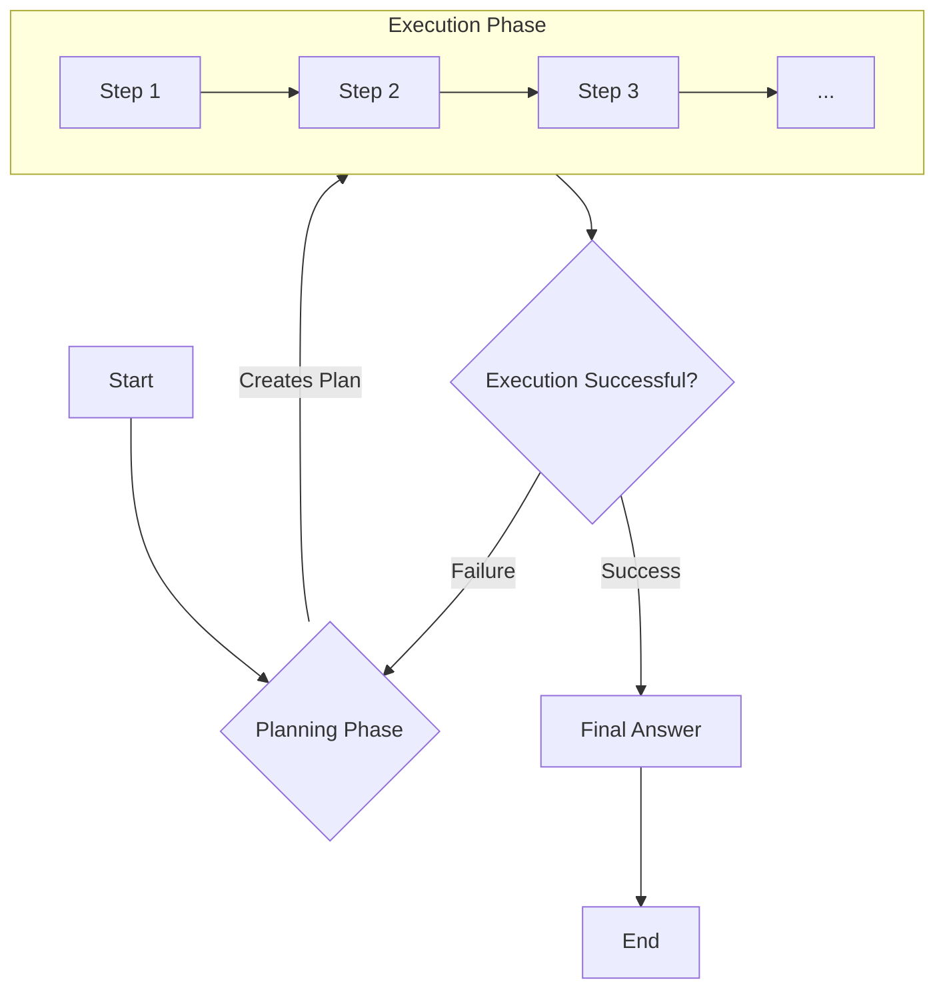

# AI Agents: Think Before You Act
### Why your AI agent needs to think first

## Why Your Agent Needs to Think Before It Acts

Artificial intelligence is transforming how we work, streamlining tasks and enhancing productivity. A major leap in this evolution is the rise of agentic reasoning: an approach that enables AI systems to plan, execute, and adapt like dynamic problem-solvers. This allows AI to break down complex problems, gather information, and respond in context—all while learning and refining its approach.

In the previous lessons, you learned the foundational components for building AI systems. You learned how to give models tools to interact with the world (Lesson 6), how to ensure they return data in a reliable format (Lesson 4), and how to chain these actions together into workflows (Lesson 5). But these ingredients alone are not enough to build a truly autonomous agent.

This article introduces the core concepts of planning and reasoning. We will explore why standard Large Language Models (LLMs) often fall short on complex, multi-step tasks that demand adaptation and foresight.

You will learn about the core strategies that give agents their 'thinking' ability, such as ReAct and Plan-and-Execute. These patterns provide a structured way for agents to decompose goals, interact with tools, and even correct their own mistakes, moving beyond simple command-response bots to tackle real-world challenges.

## What a Non-Reasoning Model Does And Why It Fails on Complex Tasks

Let's consider a practical example: a "Technical Research Assistant Agent." Your goal is to give it a high-level task, such as "Produce a comprehensive technical report on the latest developments in edge AI deployment." This involves finding recent papers, summarizing their findings, identifying trends, and writing a structured report.

If you give this prompt to a standard Large Language Model (LLM), even one equipped with tools, it will likely fail. The model will try to generate a single, monolithic answer. It might call a search tool to find some papers and then immediately start writing a summary based on the first few results it gets. It treats the entire complex request as one big text generation problem.

This approach breaks down quickly. What if the initial search results are outdated or irrelevant? A non-reasoning model has no mechanism to evaluate the quality of the information it receives and adjust its strategy. It does not break the problem down into logical sub-goals like "find sources," "verify sources," "synthesize findings," and "draft report." It just executes without foresight.

In previous lessons, we explored how tools and structured outputs provide essential building blocks for AI systems. Tools enable an agent to interact with the world and take actions, while structured outputs ensure it returns data in a reliable format. However, for complex tasks where the path forward is not predictable, these components alone are insufficient. The agent needs a deeper reasoning layer to orchestrate these actions, to decide which tool to use next based on previous results, and crucially, to adapt its strategy when unexpected issues arise. Without this reasoning capability, the agent produces superficial outputs and cannot iterate on partial results or correct its course, leading to unreliable and often useless outcomes for any non-trivial challenge [[1]](https://arxiv.org/pdf/2503.13657), [[2]](https://huyenchip.com/2025/01/07/agents.html). To address this, we first "teach" the model to produce a reasoning trace, which means thinking before answering.

## Teaching Models to “Think”: Chain-of-Thought and Its Limits

To fix the failures of non-reasoning models, the first and simplest step is to teach the model to "think" before it acts. The most basic way to do this is with a technique called Chain-of-Thought (CoT) prompting. The idea is simple: you instruct the Large Language Model (LLM) to think step by step, writing out its reasoning process before giving the final answer. It is like asking someone to show their work in a math problem.

Researchers found that for large enough models, simply adding the phrase "think step by step" could dramatically improve performance on complex reasoning tasks [[3]](https://arxiv.org/abs/2201.11903). For our Technical Research Assistant Agent, a CoT prompt might look like this: "Before answering, think step by step about how you will research and verify sources on edge AI deployment. Then provide the final report."

When you use this prompt, the model first generates a reasoning trace. This trace outlines a high-level plan: search for recent papers, read abstracts for relevance, compare claims, and then synthesize the findings into a report. This is a clear improvement, as the model is now performing some level of planning.

However, CoT has a major limitation: it mixes the reasoning and the final answer into a single text output. This makes the process difficult to control and parse from an engineering perspective. The model might generate a great initial plan but then deviate from it when writing the final report. There is no clean separation between the "thinking" and the "doing."

This lack of separation means we cannot easily build an iterative loop where the agent acts on one step of the plan, observes the result, and then uses that observation to inform the next step. The entire process is a single, uninterruptible generation. To gain that level of control and build a truly adaptive agent, we need to more formally separate the two processes.

## Separating Planning from Answering: Foundations of ReAct and Plan-and-Execute

The core idea that unlocks more advanced agentic behavior is the explicit separation of the planning and reasoning process from the action and answering process. Instead of asking the model to think and then answer in one go, we create a system where these are distinct steps [[4]](https://blog.langchain.com/planning-agents/), [[5]](https://dev.to/jamesli/react-vs-plan-and-execute-a-practical-comparison-of-llm-agent-patterns-4gh9).

This separation is critical for building robust and controllable agents [[6]](https://arxiv.org/html/2404.11584v1). It gives us a clear window into the agent's thought process, allowing us to inspect its plan before it acts. More importantly, it enables the creation of iterative loops. The agent can form a thought, take an action, observe the outcome, and then use that new information to form its next thought. This feedback loop allows an agent to adapt to unexpected results, correct its own mistakes, and handle tasks where the path forward is not known in advance.

Two fundamental patterns implement this separation: ReAct and Plan-and-Execute [[5]](https://dev.to/jamesli/react-vs-plan-and-execute-a-practical-comparison-of-llm-agent-patterns-4gh9).

ReAct (Reason-Act) works by interleaving thoughts, actions, and observations in a tight loop. The agent thinks about what to do, performs an action, sees what happened, and then thinks again [[4]](https://blog.langchain.com/planning-agents/).

Plan-and-Execute, on the other hand, involves two distinct phases. First, the agent creates a complete, multi-step plan. Then, it enters an execution phase where it carries out that plan step by step [[4]](https://blog.langchain.com/planning-agents/), [[5]](https://dev.to/jamesli/react-vs-plan-and-execute-a-practical-comparison-of-llm-agent-patterns-4gh9).

Both patterns are built on the same principle of separating thought from action, but they offer different trade-offs in terms of flexibility and predictability. We will now explore each of them in depth.

## ReAct in Depth: The Loop of Thought, Action, and Observation

The ReAct (Reason-Act) framework emerged to bridge the gap between pure reasoning, like in Chain-of-Thought, and pure action-taking. We realize that human intelligence seamlessly combines task-oriented actions with verbal reasoning or "inner speech." You can think of it like how we think to decide what to do next, and our actions provide us with new information that shapes our next thoughts [[7]](https://arxiv.org/pdf/2210.03629). Researchers designed ReAct to mimic this synergistic process in AI agents.

The framework operates on a simple, iterative loop: Thought → Action → Observation. The agent first generates a reasoning trace, which we call a thought, to break down the problem and decide on the next immediate step. Based on that thought, it chooses an action to take, such as calling a tool. The system then receives an observation, which is the result of that action. It feeds this observation back into the context, and the agent generates a new thought to assess its progress and decide what to do next. This cycle repeats until the agent determines the task is complete and produces a final answer.

Figure 1: The ReAct loop, where the agent iteratively cycles through Thought, Action, and Observation until it can produce a final answer.

Let's walk through how our Technical Research Assistant Agent uses the ReAct pattern to tackle its task:

1.  **Thought:** "I need to find recent, trustworthy sources on edge AI deployment. I'll start by searching academic and industry websites for papers from 2024."
2.  **Action:** `search("latest developments in edge AI deployment 2024 site:arxiv.org OR site:nature.com")`
3.  **Observation:** The search returns a list of candidate papers with titles and URLs.
4.  **Thought:** "The search returned several papers. I need to select the most relevant ones. I'll pick three that are highly cited and one industry report to get a balanced view. I will check their publication dates and and venues to ensure they are credible."
5.  **Action:** `fetch_and_extract(["paper_url_1", "paper_url_2", "report_url_1"])`
6.  **Observation:** The tool returns the extracted abstracts and metadata for the selected sources.
7.  **Thought:** "Now I have the summaries. I will compare their claims about adoption rates. I need to be careful and flag any conflicts in the data."
8.  **Action:** `summarize_and_compare(extractions)`
9.  **Observation:** The result shows that Paper A claims a 40% adoption rate, while Paper B claims 25%. There's a conflict.
10. **Thought:** "A conflict has been detected in the adoption rates. I need to resolve this. I will search for a third-party market analysis to act as a tie-breaker."
11. **Action:** `search("edge AI deployment adoption market analysis 2024")`
12. **Observation:** A credible market analysis report is found.
13. **Thought:** "I have the market report. I will use it to resolve the conflict and then finalize my summary of trends and gaps."
14. **Final Answer:** The agent generates a structured report, citing all sources and explaining how it resolved the conflicting statistics.

## Plan-and-Execute in Depth: Structure and Predictability

While ReAct excels at exploratory tasks, its iterative nature can be inefficient for problems with a more predictable structure. An alternative pattern is Plan-and-Execute, which, as its name suggests, separates the process into two distinct phases: first, creating a comprehensive plan, and second, executing that plan.

This approach is often more efficient because it minimizes the number of calls to the main, powerful Large Language Model (LLM). A planner model (typically a large, capable LLM) generates a detailed, step-by-step plan once upfront. Then, an executor—which can be a simpler agent or even just a loop running tool calls—carries out the plan. You only consult the planner again if the plan needs to be updated due to an unexpected issue or a significant deviation from the expected outcome [[4]](https://blog.langchain.com/planning-agents/). This separation of a heavyweight planner from the execution runtime helps reduce latency and cost compared to continuously looping a single LLM after every tool call.

Figure 2: The Plan-and-Execute pattern, showing a clear separation between the initial Planning phase and the sequential Execution phase.

Let's revisit your Technical Research Assistant Agent and see how it would operate using this pattern.

### Planning Phase

You first prompt the agent to create a complete plan to fulfill the request. It outputs a structured list of tasks, like this:

1.  Define the scope and success criteria for the report on "edge AI deployment." This involves understanding the target audience and the desired depth of analysis.
2.  Execute parallel searches across academic databases (e.g., arXiv) and industry news sites for content from the last 18 months. Use specific keywords to ensure relevance.
3.  From the search results, select the top 5 academic papers and top 3 industry reports based on relevance, citation count, and source credibility. Prioritize recent and highly influential works.
4.  For each selected source, extract the abstract, key findings, and any specific data on adoption rates or performance benchmarks. Store this information in a structured format for easy comparison.
5.  Synthesize the extracted information, comparing findings across sources to identify consistent trends, emerging technologies, and notable conflicts or gaps in the research. Highlight areas of consensus and divergence.
6.  Draft a detailed outline for the final report, including sections for Introduction, Key Trends, Technical Challenges, Industry Adoption, and Conclusion. Ensure a logical flow and comprehensive coverage.
7.  Write the full report based on the outline, ensuring all claims are supported by citations and including a methodology section explaining the research process. This ensures transparency and verifiability.

### Execution Phase

The agent now systematically works through the plan, executing step 1, then step 2, and so on. It stores the results of each step and uses them as input for subsequent steps. For example, the URLs found in step 2 are used in step 3. The system returns to the planning phase only if a step fails completely (e.g., no relevant sources are found) or if a predefined trigger for re-planning is met. This creates a more controlled and predictable workflow, as the main LLM does not constantly re-evaluate every micro-step.

## Pros and Cons: ReAct vs. Plan-and-Execute

Choosing between the two depends on your task’s uncertainty, structure, and latency/cost constraints. Use the comparison below to quickly decide which pattern (or hybrid) best fits your scenario.

| Approach | Pros | Cons |
| --- | --- | --- |
| ReAct | - High interpretability; explicit thoughts each step enable debugging and trust [[7]](https://arxiv.org/pdf/2210.03629) - Natural error recovery via observe-think loops; adapts to unexpected results [[6]](https://arxiv.org/html/2404.11584v1) | - Slower and costlier due to iterative LLM calls at each step [[4]](https://blog.langchain.com/planning-agents/) - Requires tight control; can loop or drift without guardrails [[8]](https://galileo.ai/blog/why-most-ai-agents-fail-and-how-to-fix-them) |
| Plan-and-Execute | - Efficient and predictable for well-defined multi-step tasks; fewer planner calls [[4]](https://blog.langchain.com/planning-agents/), [[5]](https://dev.to/jamesli/react-vs-plan-and-execute-a-practical-comparison-of-llm-agent-patterns-4gh9) - Strong fit for structured pipelines; coherent outputs from upfront plan [[5]](https://dev.to/jamesli/react-vs-plan-and-execute-a-practical-comparison-of-llm-agent-patterns-4gh9) | - Rigid; can fail when reality diverges from the initial plan [[9]](https://www.willowtreeapps.com/craft/building-ai-agents-with-plan-and-execute) - Less adaptable for exploratory problems where next steps depend on new findings |

In practice, many production systems blend these strengths: they adopt Plan-and-Execute for overall structure and insert ReAct-style inner loops where uncertainty or verification is needed. Let’s look at how this hybridization shows up in real “Deep Research” workflows.

## Where This Shows Up in Practice: Deep Research–Style Systems

The theoretical patterns of ReAct and Plan-and-Execute are not just academic exercises. Instead, you will find they form the backbone of sophisticated, real-world AI systems designed for complex analysis and reporting. A prime example is what we call "Deep Research" systems. We use these for tasks like market analysis, scientific literature reviews, or complex financial diligence.

We see these systems operationalize planning and reasoning to tackle long-horizon tasks. These tasks are often too complex for a single LLM call. They start by breaking down a high-level goal, such as "analyze the competitive landscape for quantum computing," into a series of smaller sub-goals [[10]](https://www.glean.com/blog/a-complete-guide-to-agentic-reasoning). This decomposition might involve steps like identifying key companies, finding recent research papers, analyzing patent filings, and summarizing news sentiment.

The agent then enters an iterative cycle. This involves searching for information, reading and extracting key data, comparing findings from different sources, and verifying claims [[11]](https://www.ayadata.ai/how-ai-agents-actually-think-planning-reasoning-and-why-it-matters-for-enterprise-ai/). Think of our research assistant agent's process of finding conflicting adoption rates and seeking a third source to verify data. This is a micro-version of what these deep research systems do at scale. They perform many micro-cycles of searching, extracting, verifying statistics, and updating internal notes before synthesizing the final report.

In practice, many of these systems use a hybrid approach. They might use a Plan-and-Execute pattern to structure the overall workflow. However, they also implement ReAct-like loops within each major step to handle uncertainty and verification [[12]](https://serjhenrique.com/react-wese-plan-and-execute-and-chatdb-architectures-applied-to-question-answer-database-use-case/). This combination gives them both the structure to manage complexity and the flexibility to adapt to new information. This shows you how these foundational patterns are essential for building powerful, reliable agents.

## Modern Reasoning Models: Thinking vs. Answer Streams and Interleaved Thinking

As Large Language Models (LLMs) continue to evolve, they are beginning to internalize some of the reasoning structures we have discussed. Instead of relying solely on external frameworks to orchestrate thinking, developers now design modern models with built-in reasoning capabilities. Broadly, two model-side patterns mirror the system patterns we covered: a think-then-answer mode that parallels Plan-and-Execute, and an interleaved reasoning mode that parallels ReAct.

Think-then-answer (parallel to Plan-and-Execute). Some models separate "thinking" and "answer" streams and can perform an explicit "extended thinking" phase before emitting the final answer [[13]](https://docs.aws.amazon.com/bedrock/latest/userguide/claude-messages-extended-thinking.html), [[14]](https://cloud.google.com/vertex-ai/generative-ai/docs/partner-models/claude). In effect, the model runs a one-shot planning pass—breaking down the problem, evaluating options, and selecting an approach—then generates the answer. This mirrors Plan-and-Execute's heavy upfront planning followed by a largely linear execution path. In some platforms, the private reasoning trace can be surfaced for inspection or debugging [[13]](https://docs.aws.amazon.com/bedrock/latest/userguide/claude-messages-extended-thinking.html).

Interleaved reasoning (parallel to ReAct). Newer models support reasoning that alternates with actions, especially during tool use [[13]](https://docs.aws.amazon.com/bedrock/latest/userguide/claude-messages-extended-thinking.html), [[15]](https://platform.openai.com/docs/guides/reasoning). The model can think, call a tool, observe the result, and think again—repeating until completion. This is essentially the ReAct loop embedded within the model: Thought → Action → Observation → Thought. For example, Claude 3.5 Sonnet can operate a virtual computer by interleaving actions with natural-language reasoning [[16]](https://www.anthropic.com/news/3-5-models-and-computer-use), and models like Claude Opus and Sonnet pair this with large context windows and strong reasoning to support multi-step tool use [[17]](https://docs.anthropic.com/en/docs/about-claude/models/overview), [[18]](https://www.anthropic.com/news/claude-3-5-sonnet).

What this means for agent developers. Even with model-internal reasoning, you still need to manage reasoning at the system level:

- Define guardrails and termination: max steps, time/budget limits, and clear success/exit criteria.
- Orchestrate tools and data: capability routing, schema validation, retries/backoffs, and idempotent execution.
- Handle failures and re-planning: triggers to re-invoke planning, fallbacks, and safe degradation when tools or sources fail.
- Preserve memory and provenance: logging thoughts/actions, citations, and auditability for trust and compliance.
- Ensure reproducibility and evaluation: consistent traces for regression testing and quality measurement across runs.
- Optimize cost/latency: decide when to enable extended thinking versus fast paths based on SLAs and budgets.

Internalized reasoning complements—rather than replaces—ReAct and Plan-and-Execute. These patterns remain your levers for control, debuggability, and reliability, even when the LLM can “think” on its own.

## Advanced Agent Capabilities Enabled by Planning: Goal Decomposition and Self-Correction

Effective planning and reasoning unlock more advanced agentic capabilities essential for true autonomy. Two of the most important are goal decomposition and self-correction.

### Goal Decomposition

Goal decomposition is the ability to break a large, complex task into smaller, manageable sub-goals. Instead of simply following a linear plan, a sophisticated agent creates a hierarchy of goals. For our research assistant, the top-level goal is to "produce a report." It might decompose this into sub-goals like "gather data," "analyze data," and "write report." You can further decompose the "gather data" sub-goal into "search academic sources" and "search industry sources."

You can design prompting strategies to explicitly encourage this behavior, leading to more robust and thorough task execution. For instance, you can decompose a complex task into independent components, which simplifies troubleshooting by isolating failures to specific steps. Crafting focused prompts with only the information needed for each subtask reduces distraction and improves accuracy. This also enables the use of smaller, specialized models for sub-tasks, potentially reducing cost and improving efficiency [[19]](https://www.amazon.science/blog/how-task-decomposition-and-smaller-llms-can-make-ai-more-affordable). When you break down complex prompts into smaller, sequential sub-prompts, you improve the LLM's performance by guiding multi-step reasoning and reducing failures on complex instructions [[20]](https://silicondales.com/ai/decomposed-prompting/).

### Self-Correction

Self-correction is the agent's ability to detect when something has gone wrong and update its plan to fix it. This is where the iterative nature of reasoning loops becomes powerful. An agent can identify failures, such as a tool call returning an error, contradictions in information, or low-confidence results. When it detects an issue, it dynamically adjusts its plan.

Let's return to our example of the conflicting adoption rates (40% vs. 25%). A self-correcting agent recognizes this contradiction. Instead of ignoring it or just picking one, it inserts a new sub-goal into its plan: "Verify the correct adoption rate." This might lead it to perform a new search for a more authoritative source, like a market analysis report. Once it resolves the conflict, it proceeds with its original plan, now with more reliable information.

You can induce this process through specific prompting techniques. For example, you can ask the agent to act as a "critic" of its own work, or to always verify facts against trusted sources [[21]](https://galileo.ai/blog/self-evaluation-ai-agents-performance-reasoning-reflection), [[22]](https://www.lionbridge.com/blog/ai-training/ai-self-correction/). Techniques like "CRITIC prompting" involve generating an initial response, performing critical analysis, and then refining the output [[23]](https://relevanceai.com/prompt-engineering/learn-to-use-critic-prompting-for-self-correction-in-ai-responses). Another approach is "self-consistency," where the agent generates multiple reasoning paths and compares the results to flag inconsistencies and select the most reliable answer [[21]](https://galileo.ai/blog/self-evaluation-ai-agents-performance-reasoning-reflection). This iterative refinement significantly improves the accuracy and trustworthiness of the agent's outputs.

Even with powerful models that have some of these capabilities built-in, understanding the underlying patterns of ReAct and Plan-and-Execute is essential. These frameworks give you the tools to design, debug, and control your agents. They provide a clear structure for tracing the agent's behavior—the sequence of thoughts, actions, and observations—ensuring consistency and providing a shared mental model for how the agent is "thinking." This understanding is crucial for building production-grade AI systems that are reliable and maintainable.

## Conclusion: From Theory to Action

In this lesson, we moved from basic actions to intelligent planning and reasoning, the capabilities that truly define an autonomous agent. We've seen that building reliable agents requires more than just giving an LLM access to tools; it requires a structured way for the agent to think, plan, and adapt.

We explored the two foundational patterns for agentic reasoning: the iterative and flexible ReAct, which excels at exploratory tasks, and the structured and predictable Plan-and-Execute, which is better for well-defined workflows. Both are built on the critical principle of separating thought from action, which is the key to control, debuggability, and reliability.

We also saw how these concepts are not just theoretical. They are being implemented in large-scale research systems and are even being built directly into the architecture of modern LLMs. However, even as models become more capable of internal reasoning, these foundational patterns remain vital for you as an engineer. They provide the mental models and control structures needed to build systems that are not just powerful, but also consistent and trustworthy.

Now that you understand the theory, it's time to put it into practice. In Lesson 8, you will implement the ReAct pattern from scratch, building your first true reasoning agent. From there, we will continue to build on this foundation, exploring how to give agents memory in Lesson 9 and how to augment them with advanced knowledge retrieval in Lesson 10.

## References

- [[1]](https://arxiv.org/pdf/2503.13657) Yao, S., et al. (2025). *A Taxonomy for Multi-Agent LLM Systems*. arXiv.
- [[2]](https://huyenchip.com/2025/01/07/agents.html) Huyen, C. (2025). *Agents*.
- [[3]](https://arxiv.org/abs/2201.11903) Wei, J., et al. (2022). *Chain-of-Thought Prompting Elicits Reasoning in Large Language Models*. arXiv.
- [[4]](https://blog.langchain.com/planning-agents/) LangChain. (2024). *Planning Agents*. LangChain Blog.
- [[5]](https://dev.to/jamesli/react-vs-plan-and-execute-a-practical-comparison-of-llm-agent-patterns-4gh9) Li, J. (2024). *ReAct vs. Plan-and-Execute: A Practical Comparison of LLM Agent Patterns*. DEV Community.
- [[6]](https://arxiv.org/html/2404.11584v1) Wang, G., et al. (2024). *Architectural theme: Successful goal execution hinges on planning and self-correction*. arXiv.
- [[7]](https://arxiv.org/pdf/2210.03629) Yao, S., et al. (2022). *ReAct: Synergizing Reasoning and Acting in Language Models*. arXiv.
- [[8]](https://galileo.ai/blog/why-most-ai-agents-fail-and-how-to-fix-them) Galileo. (n.d.). *Why Most AI Agents Fail (And How to Fix Them)*.
- [[9]](https://www.willowtreeapps.com/craft/building-ai-agents-with-plan-and-execute) WillowTree. (2023). *Building AI Agents with Plan and Execute*.
- [[10]](https://www.glean.com/blog/a-complete-guide-to-agentic-reasoning) Glean. (n.d.). *A Complete Guide to Agentic Reasoning*.
- [[11]](https://www.ayadata.ai/how-ai-agents-actually-think-planning-reasoning-and-why-it-matters-for-enterprise-ai/) Aya Data. (n.d.). *How AI Agents Actually Think: Planning, Reasoning, and Why It Matters for Enterprise AI*.
- [[12]](https://serjhenrique.com/react-wese-plan-and-execute-and-chatdb-architectures-applied-to-question-answer-database-use-case/) Henrique, S. (n.d.). *ReAct, Plan and Execute, and ChatDB Architectures Applied to Question-Answer Database Use Case*.
- [[13]](https://docs.aws.amazon.com/bedrock/latest/userguide/claude-messages-extended-thinking.html) Amazon Web Services. (n.d.). *Use extended thinking with Claude on Amazon Bedrock*. AWS Documentation.
- [[14]](https://cloud.google.com/vertex-ai/generative-ai/docs/partner-models/claude) Google Cloud. (n.d.). *Use Claude models in Vertex AI*.
- [[15]](https://platform.openai.com/docs/guides/reasoning) OpenAI. (n.d.). *Reasoning*. OpenAI Documentation.
- [[16]](https://www.anthropic.com/news/3-5-models-and-computer-use) Anthropic. (2024). *Claude 3.5 Sonnet and computer use*.
- [[17]](https://docs.anthropic.com/en/docs/about-claude/models/overview) Anthropic. (n.d.). *Models overview*. Anthropic Documentation.
- [[18]](https://www.anthropic.com/news/claude-3-5-sonnet) Anthropic. (2024). *Introducing Claude 3.5 Sonnet*.
- [[19]](https://www.amazon.science/blog/how-task-decomposition-and-smaller-llms-can-make-ai-more-affordable) Amazon Science. (2024). *How task decomposition and smaller LLMs can make AI more affordable*.
- [[20]](https://silicondales.com/ai/decomposed-prompting/) Silicon Dales. (n.d.). *Decomposed Prompting*.
- [[21]](https://galileo.ai/blog/self-evaluation-ai-agents-performance-reasoning-reflection) Galileo. (n.d.). *Self-Evaluation in AI Agents: Enhancing Performance Through Reasoning and Reflection*.
- [[22]](https://www.lionbridge.com/blog/ai-training/ai-self-correction/) Lionbridge. (n.d.). *AI Self-Correction*.
- [[23]](https://relevanceai.com/prompt-engineering/learn-to-use-critic-prompting-for-self-correction-in-ai-responses) Relevance AI. (n.d.). *Learn to Use CRITIC Prompting for Self-Correction in AI Responses*.