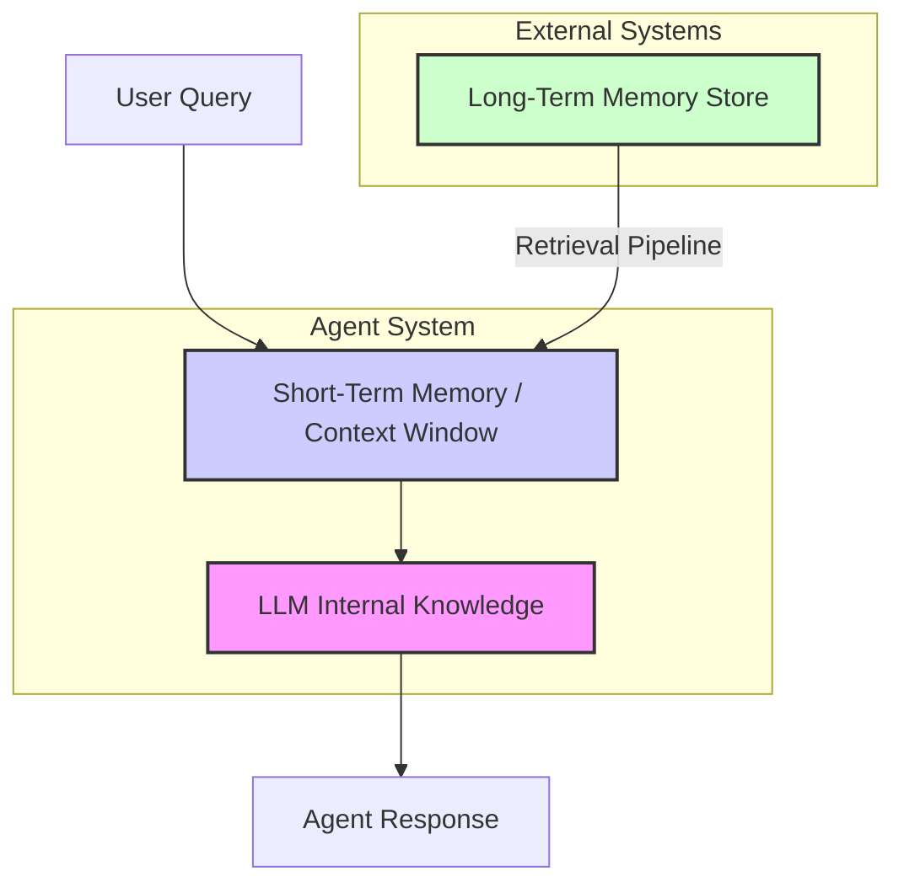

# AI Agents: Give them memory!
### Why stateless LLMs are a dead end

## Why Agents Need a Memory

Large Language Models (LLMs) are powerful, but they have a fundamental flaw: they are brilliant experts with amnesia. Their knowledge is vast but frozen at the time of their training, and they cannot recall your last conversation any more than a goldfish can. This limitation is a hard ceiling on what we can build. Without memory, we are not building intelligent agents; we are just building fancy, stateless calculators.

The obvious, but wrong, solution is to use the context window as the agent’s working memory. You can stuff the entire conversation history into the prompt, and the LLM will have the context it needs. This is a naive approach that quickly breaks down in any real-world application. The context window is finite, and constantly feeding it a growing conversation thread is not feasible. Costs skyrocket, latency increases, and you run into the "needle in a haystack" problem, where the model struggles to find relevant information amidst all the noise. The context window alone is not enough.

Memory is the engineering solution to this problem. It gives an agent continuity, allowing it to learn from past interactions and adapt its behavior over time. Early attempts at building personal AI companions, like the simple pattern-matching chatbot ELIZA, hit these limits decades ago. They could only react to immediate input, lacking any persistent understanding of the user. To build agents that are truly useful, we have to engineer systems that can remember.

## The Layers of Memory: Internal, Short-Term, and Long-Term

To build agents that remember, we need to think about memory in layers. It is not a single, monolithic system but a hierarchy of different components, each serving a distinct purpose. An effective agent architecture relies on three fundamental layers of memory working in concert.

First is the **Internal Knowledge**. This is the static, pre-trained knowledge baked into the LLM's weights during its training. It is the model's understanding of language, facts about the world, and general reasoning capabilities. This layer is immense but also immutable; it does not update with new information from user interactions. It provides the raw intelligence, but it knows nothing about you or your specific needs.

Next is **Short-Term Memory**, which is the agent's active context window. Think of it as volatile RAM. It holds the immediate context of the current conversation, allowing the agent to follow the back-and-forth of a dialogue. It is fast and essential for real-time interaction, but it is also limited in size and ephemeral. Once the conversation ends or the context window is full, the information vanishes unless you deliberately save it elsewhere [[1]](https://research.aimultiple.com/ai-agent-memory/).

Finally, we have **Long-Term Memory**. This is an external, persistent storage system where an agent can save and retrieve information across different sessions. This is the agent's hard drive, where it builds a lasting understanding of users, tasks, and past events. Long-term memory is what enables personalization, learning, and continuity over time [[2]](https://www.ibm.com/think/topics/ai-agent-memory).

The critical dynamic is the flow of information between these layers. To become actionable, you must retrieve information from long-term memory and load it into the short-term memory. A "retrieval pipeline" often handles this, querying the long-term store for relevant memories, ranking them, and presenting the most important ones to the LLM. No single layer can do it all. We need the general intelligence of internal knowledge, the immediacy of short-term memory, and the persistence of long-term memory to create truly effective agents.


Figure 1: The hierarchical flow of memory in an AI agent, showing how long-term memory is retrieved into the short-term context window to inform the LLM's response.

## The Three Pillars of Long-Term Memory: Semantic, Episodic, and Procedural

Long-term memory is not a single entity. Inspired by human cognition, we break it down into three distinct pillars: semantic, episodic, and procedural memory. Each type stores different kinds of information and serves a unique role in making an agent more capable and intelligent [[3]](https://arxiv.org/html/2309.02427v1). Understanding these pillars is key to designing a memory architecture that actually works.

### Semantic Memory (Facts & Knowledge)

Semantic memory is the agent's encyclopedia. It stores general knowledge, facts, concepts, and structured information about a specific domain. This is where an agent keeps its understanding of the world, separate from its personal experiences. In practical terms, we often use semantic memory to provide an LLM with access to private or proprietary data. For example, you can load your company's internal documentation, technical manuals, or product specifications into a semantic memory store. When a user asks a question about a specific feature, the agent retrieves the relevant facts from this knowledge base to provide an accurate, grounded answer instead of relying solely on its pre-trained knowledge [[1]](https://research.aimultiple.com/ai-agent-memory/).

### Episodic Memory (Experiences & History)

If semantic memory is the encyclopedia, episodic memory is the agent's personal diary. It records the history of past interactions, user preferences, and specific events or "episodes" from conversations. This is where the dynamic of processing short-term interactions and saving them into long-term memory truly comes alive. It is the difference between a system that knows facts and one that knows *you*. A simple episodic memory might just be a fact: "User's brother is named Mark." But a much richer memory captures the nuance of the interaction: "User expressed frustration that their brother, Mark, always forgets their birthday, indicating a sensitive point in their relationship." This level of detail allows for far more personalized and empathetic responses. For a more complex example, an agent can process an unstructured email thread about a team offsite. It then creates structured, linked episodic memories for the event's date, location, and attendee list. This makes the information instantly recallable later [[4]](https://relevanceai.com/agent-templates-tasks/email-thread-summarization).

### Procedural Memory (Skills & How-To)

Procedural memory is the agent's "muscle memory." It stores knowledge about how to perform tasks, execute workflows, and use tools. Unlike semantic memory (what to know) and episodic memory (what happened), procedural memory is about *how to do* things [[2]](https://www.ibm.com/think/topics/ai-agent-memory). In most agentic systems, this is not an abstract concept; we implement it directly in the agent's code as a reusable tool or function. For instance, an agent might have a stored procedure called `MonthlyReportIntent`. When a user asks for a monthly update, the agent triggers this procedure. It defines a clear sequence of steps: 1) Query the sales database for the last 30 days of data. 2) Use an LLM to summarize the key findings and trends. 3) Ask the user if they want the summary emailed to them or displayed directly in the chat. This encapsulates a complex workflow into a single, callable skill that the agent can execute reliably [[1]](https://research.aimultiple.com/ai-agent-memory/).

## Creating Memories: How Agents Learn and Remember

While Retrieval-Augmented Generation (RAG) is the core pattern for *retrieving* information from long-term memory, the *creation* of high-quality memories is an equally critical engineering challenge. How an agent learns and remembers, especially from unstructured conversations, determines its ability to personalize and improve over time.

The most straightforward approach is simple **"Fact Extraction."** You can prompt an agent to pull out key pieces of information from a conversation. For example, from the sentence "My favorite programming language is Python, which I use for data analysis," it might extract the fact: "User's favorite language is Python." While this is a start, it is a blunt instrument. It often misses crucial context, sentiment, and the relationships between different pieces of information, leading to a shallow and fragmented memory.

A more robust method involves using **"Structured Schemas."** Instead of just extracting raw facts, the agent organizes information into predefined categories, often represented as JSON. This creates a much more organized and queryable memory store. Structured schemas allow AI agents to store experiences as rich, structured "episodes," capturing not just factual events but also their full contextual richness [[5]](https://www.klover.ai/the-ai-that-remembers-unlocking-context-aware-decisions-with-episodic-memory-in-your-enterprise-agents/). This level of detail enables agents to adapt their behavior based on specific prior episodes, supporting context-aware decision-making and case-based reasoning [[2]](https://www.ibm.com/think/topics/ai-agent-memory). For instance, an agent could maintain schemas for "Professional Skills," "Personal Interests," or "Favorite Coffee Orders." This structure makes it far easier to retrieve specific types of information later on.

You can automate this entire pipeline—extracting, structuring, and storing memories—with specialized tools. Frameworks like **Mem0** provide a persistent memory layer for AI agents. With a simple API call, you can add conversational data, and Mem0 handles the background process of extracting salient facts and storing them in an organized way. It associates each memory unit with timestamps and uses vector embeddings to semantically encode and retrieve relevant information [[6]](https://dev.to/yigit-konur/mem0-the-comprehensive-guide-to-building-ai-with-persistent-memory-fbm), [[7]](https://docs.mem0.ai/core-concepts/memory-types).

For example, a conceptual implementation might look like this:
```python
from mem0 import Memory

# Initialize Mem0 client
memory_agent = Memory()

# Add a user preference to memory
memory_agent.add("User's favorite programming language is Python, which they use for data analysis.", user_id="user_123")
```
Behind the scenes, the tool processes this text, extracts the key information, and stores it in the user's memory profile for future retrieval [[8]](https://docs.mem0.ai), [[9]](https://github.com/mem0ai/mem0/blob/main/README.md).

Other powerful tools are also emerging in this space. **Zep** is an open-source service that stores, summarizes, and searches long-term chat histories [[10]](https://github.com/getzep/zep/blob/main/README.md). **MemoBase** offers another memory backend and provides the **Locomo Benchmark** for evaluating the performance of different memory systems [[11]](https://github.com/memodb-io/memobase/tree/main/docs/experiments/locomo-benchmark). While vector databases are the common foundation for these memory stores, we also use more advanced techniques like **GraphRAG** with graph databases like Neo4j. Knowledge graphs excel at modeling complex relationships between entities, providing a structured backbone for detailed reasoning that goes beyond simple similarity searches [[12]](https://www.redpanda.com/blog/vector-databases-vs-knowledge-graphs/), [[13]](https://writer.com/engineering/vector-database-vs-graph-database/), [[14]](https://airbyte.com/data-engineering-resources/vector-database-vs-graph-database/).

## Real-World Lessons: Challenges and Best Practices

Building a memory system is not just about choosing the right tools; it is about navigating the practical challenges that arise in real-world applications. Abstract theories are cheap. Let us talk about the hard-won lessons and engineering best practices that actually matter when you are trying to ship a product.

### Challenge: Forgetting & Relevancy

A memory that never forgets becomes a liability. As an agent interacts more, its memory store can become bloated with outdated or irrelevant information. This creates noise that degrades retrieval performance. The abstract solution is to "prune" old memories, but a more concrete and effective practice is to implement a multi-system memory architecture [[15]](https://diamantai.substack.com/p/memory-optimization-strategies-in). Instead of a single, monolithic memory, you separate different types of memory based on their volatility. For example, you can maintain a static **"Core Profile"** for a user—containing stable information like their name and job—which you update infrequently. In parallel, you can have a transient **"Daily Summary"** that captures recent conversations and you regularly summarize or discard [[2]](https://www.ibm.com/think/topics/ai-agent-memory), [[16]](https://ai.gopubby.com/building-a-customer-support-agent-with-dual-memory-architecture-long-and-short-term-memory-c39ab176046e). This separation ensures that we always prioritize high-value, stable information, while time-sensitive data does not pollute the long-term context [[17]](https://techcommunity.microsoft.com/blog/azure-ai-services-blog/memory-management-for-ai-agents/4406359).

```python
def extract_and_update_core_profile(conversation_segment: str, user_id: str) -> None:
    """
    Extracts a key fact and conceptually updates the user's core profile.
    """
    # This would involve an LLM call or a specialized fact extraction module
    extracted_fact = extract_fact_with_llm(conversation_segment)

    # Conceptual update to a 'Core Profile' memory store
    print(f"Extracted for user {user_id}: '{extracted_fact}'")
    print(f"Updating user's Core Profile with new fact.")

def extract_fact_with_llm(text: str) -> str:
    """Simulates an LLM call to extract a salient fact."""
    if "favorite programming language is Python" in text:
        return "User's favorite programming language is Python."
    return "No salient fact extracted."

# Example usage:
conversation_snippet = "My favorite programming language is Python."
extract_and_update_core_profile(conversation_snippet, "user_123")
```

### Challenge: Memory Organization

Simply storing memories is not enough; you must organize them for efficient retrieval. A common failure mode is asking users to manually manage or "garden" their AI's memories, which quickly becomes overwhelming [[18]](https://www.youtube.com/watch?v=W2HVdB4Jbjs). A practical solution is to automate this organization using metadata. Instead of asking a user to categorize a memory, the agent can do it behind the scenes. For instance, the agent can automatically tag a memory like "User is planning a vacation to Japan in April" with structured metadata like `{type: 'event', topic: 'travel', location: 'Japan', status: 'planning'}` [[19]](https://business.adobe.com/products/experience-manger/assets/smart-tagging.html). This allows for fast, filtered queries later on without burdening the user.

```python
def tag_memory_automatically(memory_text: str) -> dict:
    """
    Automatically generates structured metadata tags for a given memory text.
    """
    # Simulate LLM-based tagging based on keywords
    tags = {}
    if "vacation" in memory_text and "Japan" in memory_text:
        tags = {'type': 'event', 'topic': 'travel', 'location': 'Japan'}
    elif "favorite coffee" in memory_text:
        tags = {'type': 'preference', 'category': 'food_drink'}
    else:
        tags = {'type': 'general', 'topic': 'unclassified'}
    
    print(f"Memory: '{memory_text}'")
    print(f"Generated Tags: {tags}")
    return tags

# Example usage:
memory_to_tag = "User is planning a vacation to Japan in April."
tag_memory_automatically(memory_to_tag)
```

### Challenge: Continuous Learning & Architecture Evolution

The AI landscape is changing at an absurd pace. An architecture that makes sense today might be obsolete tomorrow. As LLM context windows get larger and cheaper, the heavy reliance on pre-computed summaries is diminishing. Instead of summarizing every conversation to save tokens, it is becoming more feasible to perform **real-time Q&A over larger chunks of raw conversation history** [[20]](https://www.td.org/content/atd-blog/decoding-ai-agents-for-learning-and-development). The raw data is always the best source of truth, and compression techniques introduce a risk of losing nuance [[18]](https://www.youtube.com/watch?v=W2HVdB4Jbjs). The best practice is to constantly re-evaluate your assumptions and simplify your architecture whenever the underlying technology allows it.

## Conclusion: Building Agents That Remember

We have moved past the point where a large context window is a sufficient solution for memory. Building truly intelligent agents requires a deliberate, engineered approach to how they learn, retain, and recall information. Relying on stateless LLM calls is a dead end; memory is the defining feature that transforms a simple chatbot into an adaptive, personalized assistant.

This starts with understanding the distinct memory layers: the LLM's static internal knowledge, the volatile short-term context window, and the crucial, persistent long-term store. Within long-term memory, the pillars of semantic, episodic, and procedural knowledge provide the structure to handle facts, experiences, and skills. Creating and retrieving these memories requires robust engineering practices to manage relevancy, organization, and continuous learning.

For any AI Engineer looking to build the next generation of AI applications, mastering these memory systems is no longer optional. It is the critical skill required to create agents that offer real value—agents that do not just respond, but remember.

## References

- [1] [Memory in AI agents](https://research.aimultiple.com/ai-agent-memory/)
- [2] [What is AI agent memory?](https://www.ibm.com/think/topics/ai-agent-memory)
- [3] [Cognitive Architectures for Language Agents](https://arxiv.org/html/2309.02427v1)
- [4] [Email Thread Summarization Agent Template | Relevance AI](https://relevanceai.com/agent-templates-tasks/email-thread-summarization)
- [5] [The AI that Remembers: Unlocking Context-Aware Decisions with Episodic Memory in Your Enterprise Agents](https://www.klover.ai/the-ai-that-remembers-unlocking-context-aware-decisions-with-episodic-memory-in-your-enterprise-agents/)
- [6] [Mem0: The Comprehensive Guide to Building AI with Persistent Memory](https://dev.to/yigit-konur/mem0-the-comprehensive-guide-to-building-ai-with-persistent-memory-fbm)
- [7] [Mem0 Docs: Memory Types](https://docs.mem0.ai/core-concepts/memory-types)
- [8] [Mem0 Docs](https://docs.mem0.ai)
- [9] [mem0/README.md at main · mem0ai/mem0](https://github.com/mem0ai/mem0/blob/main/README.md)
- [10] [zep/README.md at main · getzep/zep](https://github.com/getzep/zep/blob/main/README.md)
- [11] [memobase/docs/experiments/locomo-benchmark at main · memodb-io/memobase](https://github.com/memodb-io/memobase/tree/main/docs/experiments/locomo-benchmark)
- [12] [Vector Databases vs. Knowledge Graphs for RAG](https://www.redpanda.com/blog/vector-databases-vs-knowledge-graphs)
- [13] [Vector database vs. graph database: What’s the difference?](https://writer.com/engineering/vector-database-vs-graph-database/)
- [14] [Vector Database vs. Graph Database: Which Is Better?](https://airbyte.com/data-engineering-resources/vector-database-vs-graph-database/)
- [15] [Memory Optimization Strategies in Large Language Models](https://diamantai.substack.com/p/memory-optimization-strategies-in)
- [16] [Building a Customer Support Agent with Dual Memory Architecture](https://ai.gopubby.com/building-a-customer-support-agent-with-dual-memory-architecture-long-and-short-term-memory-c39ab176046e)
- [17] [Memory management for AI Agents](https://techcommunity.microsoft.com/blog/azure-ai-services-blog/memory-management-for-ai-agents/4406359)
- [18] [AI Memory: Building AI to Remember](https://www.youtube.com/watch?v=W2HVdB4Jbjs)
- [19] [Smart Tagging in AEM Assets | Adobe Experience Manager](https://business.adobe.com/products/experience-manger/assets/smart-tagging.html)
- [20] [Decoding AI Agents for Learning and Development](https://www.td.org/content/atd-blog/decoding-ai-agents-for-learning-and-development)