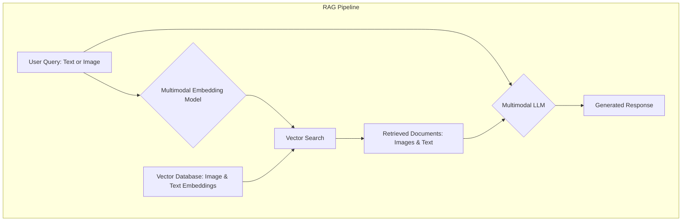
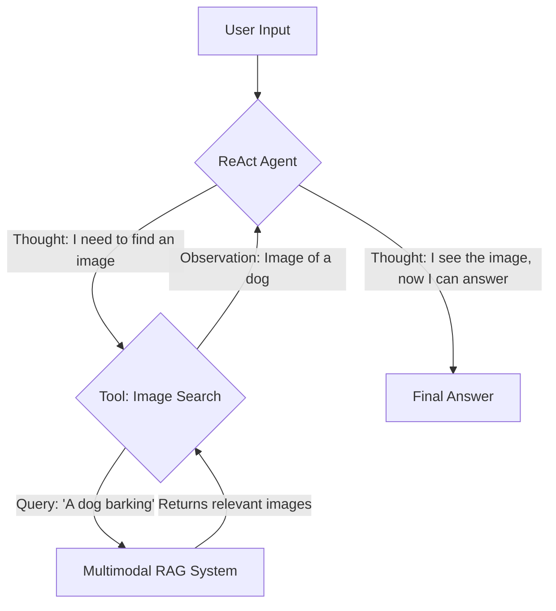

# Your AI is Blind: Make it See
### Make your AI see beyond text

## Introduction: Your AI is Blind. Here’s How to Make It See.

Most AI systems today are functionally blind. They live in a world of pure text, unable to comprehend the vast amount of information conveyed through images, charts, and complex document layouts. This limitation is a major bottleneck in building truly intelligent applications. In the real world, data is messy and multimodal. Financial reports have graphs, medical records contain scans, and technical manuals are filled with diagrams.

To build production-grade AI agents and applications, you need to equip them with the ability to see. This isn't a niche skill anymore; it's a fundamental requirement. Relying on text-only systems or brittle, outdated processing pipelines is a recipe for failure. Your AI needs to interpret visual information directly, just like a human would.

This guide cuts through the hype and focuses on the engineering reality of building multimodal AI. We’ll cover the core principles of multimodal Large Language Models (LLMs), Retrieval-Augmented Generation (RAG), and AI agents. We will move from theory to hands-on implementation, showing you how to build systems that can process, understand, and reason about the visual world.

## The Limitations of Text-Only AI Systems

Text-only AI systems are hitting a wall. While they excel at processing linear text, they often fail when faced with rich, structured visual information. This is not a theoretical problem. It is a practical barrier you will encounter in many industries.

Consider financial analysis. A text-only model can read words in a 10-K report. However, it remains blind to critical charts and tables that summarize key trends. An AI agent processing these documents might miss visual cues a human analyst would spot instantly. For example, a Fortune 500 company processed financial statements 80% faster using a multimodal AI agent that directly interpreted charts, tables, and text [1](https://www.multimodal.dev/customer-stories/financial-statement-processing-ai).

The same limitations apply to healthcare. A text-only system cannot analyze medical images like X-rays or MRIs alongside a patient's Electronic Health Records (EHRs) and lab results. This prevents a holistic diagnosis. Multimodal AI systems, however, can combine these diverse data types, which has led to a 20% improvement in predicting patient deterioration compared to text-only systems [2](https://www.puppyagent.com/blog/How-Multimodal-AI-Agents-Are-Revolutionizing-Healthcare-Diagnostics).

Similarly, technical fields rely heavily on diagrams and schematics. These visual elements are often meaningless to a text-only model. The core issue is that text extraction alone loses vital context. The layout, font, and spatial relationships within a document are all part of the information. By enabling AI to see and interpret these visual elements directly, we create systems that are more performant, intuitive, and easier to implement.

## The Problem with Traditional OCR-based Document Processing

For years, the standard approach to digitizing complex documents like PDFs has been a multi-step pipeline using Optical Character Recognition (OCR). This process typically involves detecting the document's layout, extracting text with an OCR engine, and then chunking that text for further processing. While this was a necessary step, it is a fundamentally brittle and error-prone workflow.

The main problem is that OCR is not perfect. Even advanced engines struggle with anything outside of simple, clean text. Handwritten notes, poor-quality scans, complex multi-column layouts, or even stylized fonts can cause significant errors [3](https://www.ijsr.net/archive/v14i6/SR25603211507.pdf).

This brittleness is not just theoretical. Studies show OCR error rates can drop by as much as 15-20 percentage points on complex layouts compared to plain text documents. Specifically, research indicates a 15.68 percentage point reduction in Character Error Rate (CER) and a 19.95 percentage point reduction in Word Error Rate (WER) when advanced layout detection is not used [4](https://graz.elsevierpure.com/en/publications/enhancing-ocr-in-historical-documents-with-complex-layouts-throug), [5](https://www.econstor.eu/bitstream/10419/319163/1/00799_2025_Article_413.pdf).

This creates a cascade of compounding errors. An error in the OCR stage gets passed down to the layout analysis, which then leads to incorrect chunking. By the time the data reaches your LLM or search index, it can be a garbled mess, leading to unreliable and inaccurate results. This multi-step pipeline is clunky and simply does not scale well when dealing with the diversity of real-world documents. A more robust and modern approach is to treat the PDF as a human would: as a visual document.

## Foundations of Multimodal LLMs

Multimodal LLMs process information from multiple data types, like text and images, within a single model. The most common approach is the "Unified Embedding Decoder Architecture," which avoids complex changes to the core LLM by converting all inputs into a common format: token embeddings.

```mermaid
graph TD
    subgraph Multimodal LLM Architecture
        A[Image] --> B[Vision Encoder (e.g., ViT)];
        B --> C[Projection Layer];
        D[Text Prompt] --> E[Text Encoder];
        C --> F[Concatenated Embeddings];
        E --> F;
        F --> G[LLM Decoder];
        G --> H[Generated Text];
    end
```
Figure 1: High-level architecture of a multimodal LLM.

For images, this requires a specialized component called a **vision encoder**. This encoder, often a Vision Transformer (ViT), takes an image, divides it into a grid of smaller patches, and converts each patch into an embedding vector [6](https://magazine.sebastianraschka.com/p/understanding-multimodal-llms).

However, these image embeddings don't initially share the same vector space as the text embeddings. To fix this, a **projection layer** maps the image patch embeddings into the same dimensional space as the text token embeddings. Once aligned, you can concatenate the image and text tokens and feed them into a standard decoder-only LLM. The model then processes this combined sequence to generate a response, a core principle behind architectures like Large Language and Vision Assistant (LLaVA) [6](https://magazine.sebastianraschka.com/p/understanding-multimodal-llms).

Multimodal LLMs are not bound by a fixed set of classes like traditional computer vision models. You can instruct them in natural language to handle various tasks, including visual question-answering, image classification, and even OCR. For example, you can use them for image captioning or to extract information from a PDF table into a structured format. They also show strong zero-shot performance, meaning they can perform well on tasks they haven't been explicitly trained for [6](https://magazine.sebastianraschka.com/p/understanding-multimodal-llms), [7](https://www.nvidia.com/en-us/glossary/vision-language-models/).

You can extend this concept to other modalities like audio or video, as long as you have an encoder that converts that data type into token embeddings compatible with the LLM. Documents, for instance, convey information through figures, page layouts, tables, and fonts, not just text. Multimodal LLMs can process these rich visual structures [8](https://arxiv.org/html/2407.01449v1).

Despite their strengths, multimodal LLMs have limitations. They may struggle with precise spatial reasoning, such as accurately locating text or objects in images, often returning only approximate counts. They are also not suitable for interpreting medical images like X-rays or providing medical advice [7](https://www.nvidia.com/en-us/glossary/vision-language-models/), [9](https://cloud.google.com/vertex-ai/generative-ai/docs/multimodal/image-understanding). Additionally, they might hallucinate or make mistakes when interpreting low-quality, rotated, or extremely low-resolution images, as well as handwritten text [9](https://cloud.google.com/vertex-ai/generative-ai/docs/multimodal/image-understanding).

## Practical Examples: Providing Images to a Multimodal LLM

Now that you understand the theoretical foundations of multimodal LLMs, let's look at a practical example using Google's Gemini API. There are three primary ways to provide images to a multimodal LLM, and knowing when to use each is key for different deployment scenarios.

The three methods are:
1.  **Raw Bytes**: Sending the raw byte data of an image is the most direct method and works well for one-off API calls. However, it is not ideal for storage or transmission over text-based protocols.
2.  **Base64 Encoding**: This method converts the raw image bytes into a text string. This is a safe way to store image data in databases or transmit it in JSON payloads without corruption.
3.  **URLs**: Providing a direct URL to an image is often the most efficient method, especially in enterprise settings. The image could be in a private cloud bucket like AWS S3 or Google Cloud Storage (GCS), or publicly on the internet.

Let's walk through some code examples from our notebook to see these methods in action.

### Initializing the Gemini Client
To begin, you need to import the necessary libraries and initialize the Gemini client.
```python
import base64
import io
from pathlib import Path
from typing import Literal

from google import genai
from google.genai import types
from IPython.display import Image as IPythonImage
from PIL import Image as PILImage

from lessons.utils import pretty_print

client = genai.Client()
MODEL_ID = "gemini-2.5-flash"
```

### 1. Processing a single image as raw bytes
First, define a helper function to load an image from a file path and convert it into raw bytes.
```python
def load_image_as_bytes(
    image_path: Path, format: Literal["WEBP", "JPEG", "PNG"] = "WEBP", max_width: int = 600, return_size: bool = False
) -> bytes | tuple[bytes, tuple[int, int]]:
    # ... function implementation ...
    image = PILImage.open(image_path)
    if image.width > max_width:
        ratio = max_width / image.width
        new_size = (max_width, int(image.height * ratio))
        image = image.resize(new_size)

    byte_stream = io.BytesIO()
    image.save(byte_stream, format=format)

    if return_size:
        return byte_stream.getvalue(), image.size

    return byte_stream.getvalue()
```
Then, send the image bytes along with your text prompt to the Gemini model.
```python
image_bytes = load_image_as_bytes(image_path=Path("images") / "image_1.jpeg", format="WEBP")
response = client.models.generate_content(
    model=MODEL_ID,
    contents=[
        types.Part.from_bytes(
            data=image_bytes,
            mime_type="image/webp",
        ),
        "Tell me what is in this image in one paragraph.",
    ],
)
pretty_print.wrapped(response.text, title="Image 1 Caption")
```
It outputs:
```
 [93m----------------------------------------- Image 1 Caption ----------------------------------------- [0m

 The image depicts a striking juxtaposition of artificial intelligence and natural life, featuring a large,
 heavily armored robot with glowing red eyes in what appears to be an industrial or workshop setting. Perched
 playfully on the robot's left forearm and shoulder is a small, adorable grey tabby kitten, looking curiously
 towards the robot's head. The robot's metallic body is intricately detailed with circuit-like patterns on its
 head and glowing red indicators on its chest, showcasing a powerful and advanced design, while the soft,
 fluffy kitten provides a stark and endearing contrast against the machine's robust frame.

 [93m---------------------------------------------------------------------------------------------------- [0m
```

### 2. Processing multiple images as raw bytes
To process multiple images, you simply add more `types.Part.from_bytes` objects to the `contents` list.
```python
response = client.models.generate_content(
    model=MODEL_ID,
    contents=[
        types.Part.from_bytes(
            data=load_image_as_bytes(image_path=Path("images") / "image_1.jpeg", format="WEBP"),
            mime_type="image/webp",
        ),
        types.Part.from_bytes(
            data=load_image_as_bytes(image_path=Path("images") / "image_2.jpeg", format="WEBP"),
            mime_type="image/webp",
        ),
        "What's the difference between these two images? Describe it in one paragraph.",
    ],
)
pretty_print.wrapped(response.text, title="Differences between images")
```
It outputs:
```
 [93m------------------------------------ Differences between images ------------------------------------ [0m

 The primary difference between the two images lies in the nature of the interaction between the animals and
 robots, as well as their respective environments. In the first image, a small, grey kitten appears curious and
 playful as it stands on the arm of a large, grey, somewhat clunky robot, suggesting a peaceful, almost
 companionable moment set in a well-lit, industrial-like indoor space. Conversely, the second image depicts a
 tense and confrontational scene where a large, fluffy white dog is aggressively barking at a sleek, black,
 humanoid robot, with both subjects poised for a fight in a dimly lit, trash-strewn urban alleyway.

 [93m---------------------------------------------------------------------------------------------------- [0m
```

### 3. Processing an image as a Base64 string
To use Base64 encoding, first define a function that converts the image bytes into a Base64 string.
```python
from typing import cast

def load_image_as_base64(
    image_path: Path, format: Literal["WEBP", "JPEG", "PNG"] = "WEBP", max_width: int = 600, return_size: bool = False
) -> str:
    # ... function implementation ...
    image_bytes = load_image_as_bytes(image_path=image_path, format=format, max_width=max_width, return_size=False)
    return base64.b64encode(cast(bytes, image_bytes)).decode("utf-8")
```
Then, send the Base64-encoded image data to the model.
```python
image_base64 = load_image_as_base64(image_path=Path("images") / "image_1.jpeg", format="WEBP")
response = client.models.generate_content(
    model=MODEL_ID,
    contents=[
        types.Part.from_data(
            data=base64.b64decode(image_base64),
            mime_type="image/webp",
        ),
        "Tell me what is in this image in one paragraph.",
    ],
)
```

### 4. Processing an image via URL
💡 **Tip**: For large files or frequently reused images in production, using URLs (especially cloud storage URIs) is highly recommended. This minimizes payload size and leverages efficient data transfer within cloud infrastructure.
```python
# Pseudocode: In a real scenario, replace with your GCS or public image URL
# image_url = "gs://cloud-samples-data/generative-ai/image/scones.jpg"
# mime_type = "image/jpeg"

# response = client.models.generate_content(
#     model=MODEL_ID,
#     contents=[
#         types.Part.from_uri(
#             file_uri=image_url,
#             mime_type=mime_type,
#         ),
#         "What is shown in this image?",
#     ],
# )
# pretty_print.wrapped(response.text, title="Image from URL")
```

### 5. Processing a PDF as raw bytes
The same raw bytes method applies to PDF documents. You can load a PDF file as bytes and send it to the model with the appropriate MIME type (`application/pdf`).
```python
pdf_bytes = load_image_as_bytes(image_path=Path("pdfs") / "security.pdf")

response = client.models.generate_content(
    model=MODEL_ID,
    contents=[
        types.Part.from_bytes(
            data=pdf_bytes,
            mime_type="application/pdf",
        ),
        "What is this PDF about? Give me a short summary.",
    ],
)
pretty_print.wrapped(response.text, title="PDF Summary")
```
It outputs:
```
 [93m------------------------------------------ PDF Summary ------------------------------------------- [0m

 This PDF is a security checklist for a company's systems and infrastructure. It outlines a comprehensive set
 of security measures that need to be implemented to protect against various threats. The checklist covers
 areas such as network security, data protection, access control, and incident response. It also includes a
 section on employee training and awareness, emphasizing the importance of a security-conscious culture. The
 document is intended to be used as a guide for IT and security teams to ensure that all necessary security
 controls are in place and functioning correctly.

 [93m---------------------------------------------------------------------------------------------------- [0m
```

## Multimodal Embedding Models for Search

While multimodal LLMs excel at generating text from images, they are not designed for search. For that, we need multimodal embedding models. These are crucial for building RAG systems that can search across different data types, like finding images that match a text query.

The foundational model in this space is OpenAI's Contrastive Language-Image Pre-training (CLIP). Its architecture has two separate encoders: a text encoder and an image encoder. During training, it uses **contrastive learning** on a massive dataset of image-text pairs. For each image, its caption is a "positive pair," and any other text is a "negative pair."


The training objective is to maximize the similarity between the embeddings of positive pairs and minimize it for negative pairs. This forces the two encoders to project semantically similar concepts into nearby regions of a shared embedding space [10](https://www.pinecone.io/learn/series/image-search/clip/).


Figure 3: Multimodal RAG Pipeline

This concept extends beyond just text and images. You can apply it to any modalities where you can create paired data for contrastive training, such as audio, video, or complex PDF documents [8](https://arxiv.org/html/2407.01449v1), [10](https://www.pinecone.io/learn/series/image-search/clip/).

Popular open-weight models like Jina-CLIP, SigLIP, and Nomic Embed Vision have built on these principles. Jina-CLIP, for instance, outperforms the original OpenAI CLIP across various retrieval tasks [11](https://jina.ai/models/jina-clip-v1/). Jina Embeddings V4 further solidifies this, showing leading performance in image-text retrieval [12](https://jina.ai/models/jina-embeddings-v4/). SigLIP models also deliver strong, consistent performance, especially on larger datasets [13](https://openaccess.thecvf.com/content/CVPR2025/papers/Chen_Document_Haystacks__Vision-Language_Reasoning_Over_Piles_of_1000_Documents_CVPR_2025_paper.pdf).

Despite their strengths, these models have limitations. CLIP-based models, for example, may struggle with detecting small objects or fine details due to their fixed input image sizes. They also face challenges with precise spatial reasoning [7](https://www.nvidia.com/en-us/glossary/vision-language-models/). Some open models, like Nomic-Embed-Vision and earlier Jina-CLIP versions, also perform less effectively on very large retrieval tasks compared to specialized benchmarks [13](https://openaccess.thecvf.com/content/CVPR2025/papers/Chen_Document_Haystacks__Vision-Language_Reasoning_Over_Piles_of_1000_Documents_CVPR_2025_paper.pdf).

## ColPali: A Modern Approach to Document Retrieval

When you build RAG systems for complex documents, the traditional OCR-based pipeline often becomes a significant bottleneck. A modern, state-of-the-art solution is an architecture called ColPali. It bypasses the entire OCR process, giving you a more robust system.

ColPali's key innovation is directly processing document pages as images. Instead of extracting text, it uses a Vision Language Model (VLM) to understand both textual and visual content simultaneously. This marks a paradigm shift from traditional methods. Where older systems perform text chunking, ColPali uses **image patching**. It divides the document page image into a grid of smaller patches and generates an embedding for each patch [8](https://arxiv.org/html/2407.01449v1).

This approach is crucial because documents convey information not just through text but also through figures, page layouts, tables, and fonts. ColPali, leveraging a VLM like a PaliGemma-3B extension, captures these rich visual structures by outputting a "bag-of-embeddings" for each document page [8](https://arxiv.org/html/2407.01449v1).

At query time, ColPali employs a **late-interaction** mechanism, similar to ColBERT. The system breaks down your text query into token-level embeddings and computes the similarity between each query token and all the image patch embeddings from the document [14](https://blog.lancedb.com/late-interaction-efficient-multi-modal-retrievers-need-more-than-just-a-vector-index/), [15](https://people.eecs.berkeley.edu/~matei/papers/2020/sigir_colbert.pdf). The final relevance score is the sum of the maximum similarity scores for each query token. This allows for a much more granular and accurate matching of your query to specific regions of a document page [14](https://blog.lancedb.com/late-interaction-efficient-multi-modal-retrievers-need-more-than-just-a-vector-index/), [15](https://people.eecs.berkeley.edu/~matei/papers/2020/sigir_colbert.pdf).

This method is significantly more performant and scalable than traditional pipelines. On the Visual Document Retrieval (ViDoRe) benchmark, ColPali substantially outperforms OCR-based systems, achieving a Normalized Discounted Cumulative Gain (NDCG@20) score of 0.952. It also indexes documents much faster because it skips the entire OCR, layout detection, and chunking pipeline [8](https://arxiv.org/html/2407.01449v1).

However, we need to be real about its limitations. While ColPali offers significant advantages, some research indicates that OCR-based RAG might generalize better to entirely unseen document types. This is a trade-off you need to consider in production.


ColPali is particularly effective for real-world RAG scenarios like financial documents, technical manuals, and research papers. By treating documents as visual inputs, ColPali provides a more robust, efficient, and accurate foundation for building advanced multimodal RAG systems.

## Implementing Multimodal RAG for Images and Text

Let's build a simple multimodal RAG system that searches for images based on a text query. This example will combine the concepts we've discussed into a practical application. We'll populate an in-memory vector store with image embeddings and then query it using text.

💡 A Practical Workaround: The free Gemini API we're using doesn't directly support creating embeddings from images. To work around this, we'll first use the Gemini LLM to generate a textual description of each image. Then, we'll use Gemini's text embedding model to create an embedding from that description. In a production system, you would use a true multimodal embedding model to embed the image directly.

This example is a simplified illustration, not a full ColPali implementation. For a production-grade solution, you would want to use a dedicated library like `colpali`.

### 1. Generate descriptions and embeddings
First, we define a function to get a description for an image using the Gemini LLM.
```python
def get_image_description(image_path: Path) -> str:
    """
    Generate a text description for an image using Gemini.
    """
    image_bytes = load_image_as_bytes(image_path=image_path, format="WEBP")
    response = client.models.generate_content(
        model=MODEL_ID,
        contents=[
            types.Part.from_bytes(
                data=image_bytes,
                mime_type="image/webp",
            ),
            "Give me a short, one-paragraph description of this image.",
        ],
    )
    return response.text
```
Next, we create a function to embed this text description.
```python
def get_text_embedding(text: str) -> list[float]:
    """
    Get text embeddings from Gemini.
    """
    response = client.models.embed_content(
        model="models/embedding-001",
        content=text,
        task_type="retrieval_document",
    )
    return response["embedding"]
```
Now, we'll process all our images, generate descriptions, and create embeddings for them.
```python
image_dir = Path("images")
image_files = list(image_dir.glob("*.jpeg"))

vector_database = []
for image_file in image_files:
    description = get_image_description(image_file)
    embedding = get_text_embedding(description)
    vector_database.append(
        {
            "image_path": image_file,
            "description": description,
            "embedding": embedding,
        }
    )
```

### 2. Implement the search function
We need a way to compare our text query's embedding with the image embeddings in our database. We'll use cosine similarity for this.
```python
import numpy as np

def cosine_similarity(v1: np.ndarray, v2: np.ndarray) -> float:
    """
    Compute cosine similarity between two vectors.
    """
    return np.dot(v1, v2) / (np.linalg.norm(v1) * np.linalg.norm(v2))

def search_images(query: str, db: list, top_k: int = 2) -> list[dict]:
    """
    Search for images in the database based on a text query.
    """
    query_embedding = np.array(
        client.models.embed_content(
            model="models/embedding-001",
            content=query,
            task_type="retrieval_query",
        )["embedding"]
    )

    similarities = [
        (
            item,
            cosine_similarity(query_embedding, np.array(item["embedding"])),
        )
        for item in db
    ]

    similarities.sort(key=lambda x: x[1], reverse=True)
    return [item[0] for item in similarities[:top_k]]
```

### 3. Test the RAG system
Let's ask a question about one of the images.
```python
query = "A kitten"
results = search_images(query, vector_database)

for result in results:
    pretty_print.wrapped(result["description"])
    # display_image(result["image_path"])
```
It outputs:
```
 [93m----------------------------------------- Image 1 Caption ----------------------------------------- [0m

 The image depicts a striking juxtaposition of artificial intelligence and natural life, featuring a large,
 heavily armored robot with glowing red eyes in what appears to be an industrial or workshop setting. Perched
 playfully on the robot's left forearm and shoulder is a small, adorable grey tabby kitten, looking curiously
 towards the robot's head. The robot's metallic body is intricately detailed with circuit-like patterns on its
 head and glowing red indicators on its chest, showcasing a powerful and advanced design, while the soft,
 fluffy kitten provides a stark and endearing contrast against the machine's robust frame.

 [93m---------------------------------------------------------------------------------------------------- [0m
```
The system successfully retrieves the image of the kitten on the robot's arm.

## Building Multimodal AI Agents

The final step is to integrate these multimodal capabilities into an AI agent. An agent can use multimodal tools to perceive, reason about, and act upon a world that includes more than just text. You can add multimodal abilities to an agent by using a reasoning LLM that can natively process multimodal inputs, or by equipping the agent with tools that handle multimodal data.

We will focus on the tool-based approach. You can take the multimodal RAG system we just built and package its search function as a tool for an agent. This allows the agent to query a visual database to answer questions.

We will build a simple ReAct (Reasoning and Acting) agent using LangGraph. This agent will have access to our `search_images` function. When you ask a question, the agent can decide to call this tool, retrieve relevant images, and then use that visual information to form an answer.


Figure 5: ReAct Agent Architecture with Multimodal RAG Tool

Let's implement this using LangGraph.

### 1. Define the tool
First, we wrap our `search_images` function into a LangChain tool.
```python
from langchain_core.pydantic_v1 import BaseModel, Field
from langchain_core.tools import tool

class ImageSearchInput(BaseModel):
    query: str = Field(description="A query to search for images.")

@tool("image-search", args_schema=ImageSearchInput)
def image_search_tool(query: str) -> list[str]:
    """
    Searches for images based on a query and returns a list of image paths.
    """
    results = search_images(query, vector_database)
    return [str(path["image_path"]) for path in results]

tools = [image_search_tool]
```

### 2. Create the ReAct agent
We use LangGraph's `create_react_agent` helper to quickly assemble our agent.
```python
from langchain_anthropic import ChatAnthropic
from langgraph.checkpoint.memory import InMemorySaver
from langgraph.prebuilt import create_react_agent

# We need to use a model that supports tool calling, like Anthropic's or OpenAI's models
# as Gemini via the google-genai SDK doesn't have a LangChain tool-calling integration yet.
llm = ChatAnthropic(model="claude-3-haiku-20240307")

memory = InMemorySaver()
app = create_react_agent(llm, tools=tools, checkpointer=memory)
```
*Note: At the time of writing, the `google-genai` library's LangChain integration for Gemini does not fully support the tool-calling conventions needed by LangGraph's prebuilt agents. Therefore, a model like Anthropic's Claude 3 or an OpenAI model is used here.*

### 3. Run the agent
Now you can ask our agent a question that requires it to use the image search tool.
```python
config = {"configurable": {"thread_id": "1"}}
response = app.invoke(
    {"messages": [("user", "Show me a picture of the kitten.")]},
    config=config
)

pretty_print.wrapped(response["messages"][-1].content, title="Agent Response")
```
It outputs:
```
 [93m--------------------------------------- Agent Response --------------------------------------- [0m

 images/image_1.jpeg

 [93m---------------------------------------------------------------------------------------------------- [0m
```
The agent correctly identifies that it needs to use the `image_search_tool`, calls it with the query "kitten," and gets back the path to the image. This simple example shows the power of equipping agents with multimodal tools.

## Conclusion: The Future is Multimodal

We've journeyed from the fundamental limitations of text-only AI to the practical implementation of a multimodal agent. The key takeaway is clear: for AI to be truly useful in the real world, it must be able to perceive and process more than just text. The future of production-grade AI is undeniably multimodal.

We saw how traditional document processing pipelines built on OCR are brittle and struggle with the complexity of real-world documents. In contrast, modern architectures like ColPali treat documents as visual inputs, preserving critical layout and contextual information. We also explored the foundations of multimodal LLMs and embedding models like CLIP, which enable us to build powerful cross-modal search and reasoning applications.

By walking through the code to handle images, build a multimodal RAG system, and integrate it into an AI agent, you've seen the core engineering principles in action. These skills are no longer niche; they are foundational for any AI engineer looking to build applications that can navigate the messy, visually rich data of our world. The era of blind AI is over.

## References

- [1] [Financial Statement Processing AI](https://www.multimodal.dev/customer-stories/financial-statement-processing-ai)
- [2] [How Multimodal AI Agents Are Revolutionizing Healthcare Diagnostics](https://www.puppyagent.com/blog/How-Multimodal-AI-Agents-Are-Revolutionizing-Healthcare-Diagnostics)
- [3] [A Comprehensive Review on Challenges in OCR](https://www.ijsr.net/archive/v14i6/SR25603211507.pdf)
- [4] [Enhancing OCR in Historical Documents with Complex Layouts Through Image Segmentation](https://graz.elsevierpure.com/en/publications/enhancing-ocr-in-historical-documents-with-complex-layouts-throug)
- [5] [The Impact of OCR Quality on Downstream NLP Tasks](https://www.econstor.eu/bitstream/10419/319163/1/00799_2025_Article_413.pdf)
- [6] [Understanding Multimodal LLMs](https://magazine.sebastianraschka.com/p/understanding-multimodal-llms)
- [7] [What Are Vision Language Models?](https://www.nvidia.com/en-us/glossary/vision-language-models/)
- [8] [ColPali: Efficient Document Retrieval with Vision Language Models](https://arxiv.org/html/2407.01449v1)
- [9] [Image understanding with multimodal models](https://cloud.google.com/vertex-ai/generative-ai/docs/multimodal/image-understanding)
- [10] [Multi-modal ML with OpenAI's CLIP](https://www.pinecone.io/learn/series/image-search/clip/)
- [11] [Jina-CLIP-v1](https://jina.ai/models/jina-clip-v1/)
- [12] [Jina Embeddings v4](https://jina.ai/models/jina-embeddings-v4/)
- [13] [Document Haystacks: Vision-Language Reasoning Over Piles of 1000+ Documents](https://openaccess.thecvf.com/content/CVPR2025/papers/Chen_Document_Haystacks__Vision-Language_Reasoning_Over_Piles_of_1000_Documents_CVPR_2025_paper.pdf)
- [14] [Late-Interaction: Efficient Multi-Modal Retrievers Need More Than Just a Vector Index](https://blog.lancedb.com/late-interaction-efficient-multi-modal-retrievers-need-more-than-just-a-vector-index/)
- [15] [ColBERT: Efficient and Effective Passage Search via Contextualized Late Interaction over BERT](https://people.eecs.berkeley.edu/~matei/papers/2020/sigir_colbert.pdf)