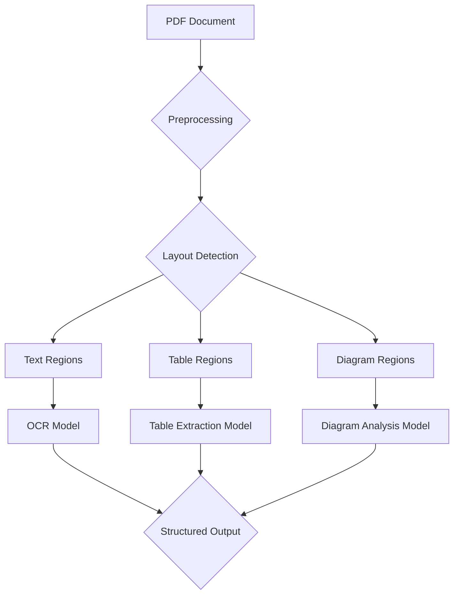
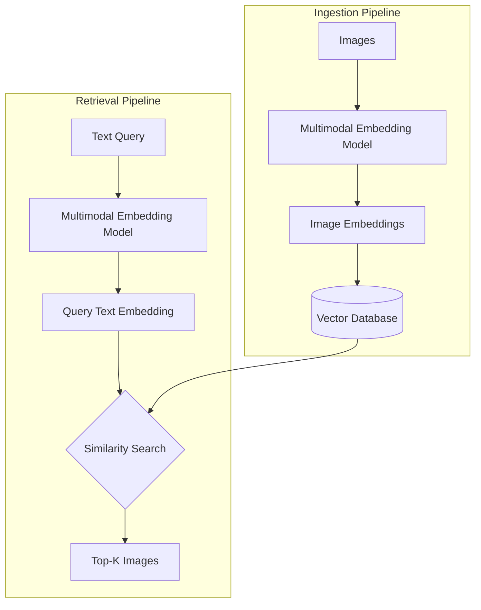
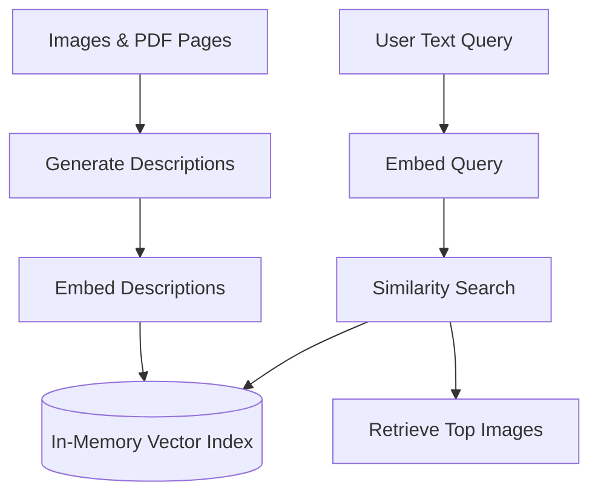

# Multimodal AI: See, Hear, Feel
### Beyond text: See, hear, and feel AI

## Introduction: The need for multimodal AI

In the previous lessons, we built a solid foundation for creating AI applications. You learned the difference between structured workflows and autonomous agents, mastered context engineering, and implemented core patterns like ReAct and Retrieval-Augmented Generation (RAG). We have covered the essentials of building systems that can reason and access external knowledge. Now, it is time to add the final piece of the puzzle for this part of the course: multimodal data. Real-world, enterprise-grade AI applications rarely deal with text alone. They must understand and process images, documents, charts, and tables. Text-only systems limit tasks like object detection, image captioning, or analyzing complex financial reports, medical documents, and building sketches. To build truly useful AI, you need to interpret this rich, visual information. This lesson shows you how.

## Limitations of traditional document processing

For years, the standard approach to handling complex documents like invoices, reports, or technical manuals in AI systems was to normalize everything to text. This process typically relies on Optical Character Recognition (OCR) and involves a convoluted, multi-step pipeline. Suppose you need to process a PDF that contains a mix of text, tables, and diagrams. This traditional workflow is a house of cards.

First, the system performs preprocessing, such as noise removal. Then, it needs to perform layout detection to identify different regions within the document—this is a title, this is a paragraph, this is a table. It then sends the text regions to an OCR model for extraction. For other structures, it needs specialized models: one for tables, another for charts, and so on. The final output is a structured format, like JSON, that pieces together the extracted text and metadata.

*Figure 1: A traditional, multi-step document processing pipeline.*

This entire process is fundamentally flawed. It is rigid because it fails if it encounters a new data structure it was not trained on. It is slow and costly, requiring multiple model calls for a single document. It is also fragile. Errors compound at each stage; a mistake in layout detection cascades into the OCR step, leading to garbled text that makes downstream RAG systems useless [[1]](https://www.mixedbread.com/blog/the-hidden-ceiling). Traditional OCR systems struggle with handwritten notes, poor-quality scans, and complex layouts like architectural drawings, where performance can drop significantly [[2]](https://arxiv.org/html/2412.02210v2), [[3]](https://www.dataunboxed.io/blog/ocr-vs-vlm-ocr-naive-benchmarking-accuracy-for-scanned-documents). Benchmarks show that even state-of-the-art OCR solutions underperform compared to perfect text extraction, creating a "performance ceiling" that limits retrieval and question-answering accuracy, especially in documents with dense tables, formulas, or embedded diagrams [[1]](https://www.mixedbread.com/blog/the-hidden-ceiling), [[5]](https://www.3rdaiautomation.com/blog/benchmarking-QA-on-complex-indestrial-PDFs).


*Figure 2: Complex layouts like this floor plan are a significant challenge for traditional OCR systems. (Media from [Hackernoon](https://hackernoon.com/complex-document-recognition-ocr-doesnt-work-and-heres-how-you-fix-it))*

This approach might work for niche, highly-specialized tasks, but it does not scale for the flexible and fast AI agents we need today. Modern AI solutions use multimodal Large Language Models (LLMs) that can directly interpret images and PDFs as native inputs, completely bypassing this brittle OCR workflow. Let us explore how they work.

## Foundations of multimodal LLMs

Before we dive into the code, you need a high-level intuition for how multimodal LLMs operate. You do not need to be a researcher to use them, but understanding the basics helps you build, deploy, and optimize them effectively.

Multimodal LLMs typically use one of two designs: a unified embedding‑decoder that concatenates projected image patch embeddings with text into an unmodified LLM decoder, or a cross‑modality attention approach where text queries connect to visual features via the cross‑attention module. The images are attached to the LLMs via image encoders (often ViTs) which produce patch embeddings that are linearly projected to the LLM’s embedding size [[6]](https://magazine.sebastianraschka.com/p/understanding-multimodal-llms).


*Figure 3: The two primary architectural approaches for building multimodal LLMs. (Media from [Sebastian Raschka's Magazine](https://magazine.sebastianraschka.com/p/understanding-multimodal-llms))*

Let us look closer at the **unified embedding decoder** approach, which is simpler and more common. In this setup, the system passes image information to the LLM as a sequence of input tokens concatenated to the text tokens. The main components are an image encoder, a projector, and the LLM backbone itself [[7]](https://www.nvidia.com/en-us/glossary/multimodal-large-language-models/). In this design, the image is converted into patch embeddings by a vision encoder and then linearly projected to the LLM’s embedding dimension so the image tokens can be concatenated with text tokens and processed by an otherwise unmodified decoder [[6]](https://magazine.sebastianraschka.com/p/understanding-multimodal-llms). Many recent systems train this stack in stages—first fitting the projector (with encoders frozen) before unfreezing components for end-to-end fine-tuning for stability [[6]](https://magazine.sebastianraschka.com/p/understanding-multimodal-llms).


*Figure 4: The Unified Embedding Decoder Architecture concatenates image and text embeddings as input to the LLM. (Media from [Sebastian Raschka's Magazine](https://magazine.sebastianraschka.com/p/understanding-multimodal-llms))*

The **cross-modality attention** architecture takes a different route. Instead of adding image tokens to the input sequence, it injects the visual information directly into the attention mechanism of the LLM during the decoding step. This allows the model to dynamically "look" at the image features while processing the text [[8]](https://blog.premai.io/multimodal-llms-architecture-techniques-and-use-cases/). Concretely, the text stream queries visual features via cross-attention, attending to image keys/values when needed rather than carrying all image tokens through the sequence. This pattern can be more efficient for high-resolution inputs and long contexts while preserving tight text–vision coupling [[6]](https://magazine.sebastianraschka.com/p/understanding-multimodal-llms).


*Figure 5: The Cross-modality Attention Architecture integrates visual data via attention mechanisms. (Media from [Sebastian Raschka's Magazine](https://magazine.sebastianraschka.com/p/understanding-multimodal-llms))*

Both approaches rely on an **image encoder**. The image encoder takes as input the image and it splits it into multiple patches, similar to how we split text into multiple tokens. During patching, we split the image into fixed-size patches. Then the image the encoder (e.g., a ViT) processes these patches with transformer layers to produce semantic embeddings. Ultimately, a lightweight linear projection maps these vectors to the LLM’s embedding size so they are compatible with the language model’s inputs [[6]](https://magazine.sebastianraschka.com/p/understanding-multimodal-llms). During projection, we ensure that the image and text embeddings are within the same vector space for the LLM to interpret them together.


*Figure 6: Image patching is analogous to text tokenization, converting visual data into a sequence of embeddings. (Media from [Sebastian Raschka's Magazine](https://magazine.sebastianraschka.com/p/understanding-multimodal-llms))*

A Vision Transformer (ViT) often handles this process, processing these patches to create embeddings that capture the visual information [[9]](https://www.ionio.ai/blog/a-comprehensive-guide-to-multimodal-llms-and-how-they-work).


*Figure 7: A Vision Transformer converts image patches into embeddings. (Media from [Sebastian Raschka's Magazine](https://magazine.sebastianraschka.com/p/understanding-multimodal-llms))*

The magic happens when these image embeddings and text embeddings align in the same vector space. Models can achieve this alignment through a technique called contrastive learning, which trains them to place semantically similar images and text descriptions close to each other in the embedding space [[10]](https://github.com/openai/CLIP). This shared space enables semantic similarity searches across different data types; you can use a text query to find a relevant image because their vector representations are close to one another [[11]](https://huggingface.co/docs/transformers/v4.22.1/en/model_doc/clip). Contrastive learning achieves this by training the model to maximize the similarity between "positive pairs" (like an image and its correct caption) and minimize the similarity between "negative pairs" (an image and an irrelevant caption) [[12]](https://towardsdatascience.com/multimodal-embeddings-an-introduction-5dc36975966f), [[13]](https://www.pinecone.io/learn/series/image-search/clip/). This ensures that semantically related content, regardless of its original modality, is positioned closely in the shared vector space [[12]](https://towardsdatascience.com/multimodal-embeddings-an-introduction-5dc36975966f). Popular choices for these image encoders include CLIP (Contrastive Language-Image Pre-Training), OpenCLIP, or SigLIP. These models are specifically designed to align image and text embeddings into a shared vector space, making them ideal for multimodal tasks [[10]](https://github.com/openai/CLIP), [[11]](https://huggingface.co/docs/transformers/v4.22.1/en/model_doc/clip).


*Figure 8: Multimodal embeddings align text and image representations in a shared vector space. (Media from [Towards Data Science](https://towardsdatascience.com/multimodal-embeddings-an-introduction-5dc36975966f))*

Each architectural approach has its trade-offs. The unified embedding model is generally simpler to implement and often performs better on OCR-related tasks. The cross-attention model can be computationally efficient, especially with high-resolution images, because it avoids lengthening the input sequence with image tokens [[6]](https://magazine.sebastianraschka.com/p/understanding-multimodal-llms). Hybrid approaches also exist, aiming to combine the best of both worlds. The core takeaway is that multiple architectures can succeed, where often the most successful use a hybrid architecture.

Today, most state-of-the-art models are multimodal. In the open-source community, we have models like Llama 4, Gemma 2, Qwen3, and DeepSeek R1/V3. In the proprietary space, models like OpenAI's GPT-5, Google's Gemini 2.5, and Anthropic's Claude series all have strong multimodal capabilities. This modular encoder-based design also allows us to extend it to other data types like audio or video by simply adding the appropriate encoder [[8]](https://blog.premai.io/multimodal-llms-architecture-techniques-and-use-cases/).

It is important to distinguish these multimodal LLMs from generative diffusion models like Midjourney or Stable Diffusion. While models like GPT-4o can generate images, their core architecture differs from diffusion models. For our purposes in building AI agents, we focus on multimodal LLMs for their reasoning and understanding capabilities, though we can integrate diffusion models as tools [[14]](https://blog.google/technology/ai/google-gemini-ai/).

The field of multimodal AI is evolving rapidly. The goal of this section was not to be exhaustive but to give you a solid intuition for why these models are superior to older OCR-based methods. Now that you understand how LLMs can directly process images and documents, let us see how it works in practice.

## Applying multimodal LLMs to images and PDFs

To see multimodal LLMs in action, we will walk through some practical examples using Gemini. First, you need to understand the three primary ways to pass multimodal data to an LLM API: as raw bytes, as Base64-encoded strings, or as URLs.

**Raw bytes** offer the most direct way to handle files and work well for simple, one-off API calls. However, storing raw binary data in many databases can be problematic. Databases often interpret binary input as text, which can lead to data corruption.

**Base64 encoding** solves this storage problem by converting binary data into a string format. This is a common practice for embedding images directly in web pages. For our use case, it ensures that images or documents can be safely stored in a text-friendly database like PostgreSQL or MongoDB. The main downside is that Base64 strings are about 33% larger than the original binary data, which can increase latency and storage costs [[15]](https://www.turing.com/resources/building-high-quality-multimodal-data-pipelines-for-llms).

**URLs** are the most efficient method for enterprise-scale applications. Instead of passing large files back and forth over the network, you can store your data in a private data lake like Amazon S3 or Google Cloud Storage. You then simply pass a secure URL to the LLM. The model's server fetches the data directly, reducing client-side bandwidth and improving performance [[16]](https://arxiv.org/html/2506.06579v1). This method is also useful for public data, as some models can directly access and process content from a public URL.

```mermaid
graph TD
    subgraph "Base64 + Database Flow"
        CB["Client"]
        DB_B[("Database")]
        LLM_API_B["LLM API"]
        CB --> DB_B
        DB_B --> CB
        CB --> LLM_API_B
    end

    subgraph "URL + Data Lake Flow"
        CU["Client"]
        DB_U[("Database")]
        DL["Data Lake"]
        LLM_API_U["LLM API"]
        CU --> DB_U
        DB_U --> CU
        CU --> LLM_API_U
        LLM_API_U --> DL
        DL --> LLM_API_U
    end

    %% Apply styling to match the image exactly
    classDef defaultStyle fill:#2d2d2d,stroke:#e0e0e0,stroke-width:1px,color:#ffffff
    classDef subgraphStyle fill:#2d2d2d,stroke:#87ceeb,stroke-width:1px
    classDef nodeStyle fill:#2d2d2d,stroke:#e0e0e0,stroke-width:1px,color:#ffffff

    class CB,CU,DB_B,DB_U,LLM_API_B,LLM_API_U,DL nodeStyle
```

*Figure 9: Comparison of data flow for Base64 vs. URL-based multimodal data handling.*

💡 **Tip:** Use raw bytes for quick, local tests. Use Base64 when you need to store media files directly in a traditional database. Use URLs for scalable, production systems that leverage cloud storage or need to access public web content.

Now, let us get into the code. We will start by processing an image as raw bytes to generate a caption.

1.  First, we display our sample image: a cat interacting with a robot.
    ```python
    from pathlib import Path
    from IPython.display import Image as IPythonImage, display
    
    def display_image(image_path: Path) -> None:
        image = IPythonImage(filename=image_path, width=400)
        display(image)
    
    display_image(Path("images") / "image_1.jpeg")
    ```
    


    *Figure 10: A fluffy grey tabby kitten playfully perched on the arm of a large, dark metallic robot. (Media from [Towards AI](https://raw.githubusercontent.com/towardsai/course-ai-agents/dev/lessons/11_multimodal/images/image_1.jpeg))*

2.  Next, we define a function to load the image as bytes. We convert it to the `WEBP` format because it is generally efficient for web use.
    ```python
    import io
    from typing import Literal
    from PIL import Image as PILImage
    
    def load_image_as_bytes(
        image_path: Path, format: Literal["WEBP", "JPEG", "PNG"] = "WEBP", max_width: int = 600, return_size: bool = False
    ) -> bytes | tuple[bytes, tuple[int, int]]:
        image = PILImage.open(image_path)
        if image.width > max_width:
            ratio = max_width / image.width
            new_size = (max_width, int(image.height * ratio))
            image = image.resize(new_size)
    
        byte_stream = io.BytesIO()
        image.save(byte_stream, format=format)
    
        if return_size:
            return byte_stream.getvalue(), image.size
    
        return byte_stream.getvalue()
    
    image_bytes = load_image_as_bytes(image_path=Path("images") / "image_1.jpeg", format="WEBP")
    ```
    The `image_bytes` variable now holds the image data. Its size is 44392 bytes.

3.  With the image loaded as bytes, we can pass it to the Gemini model along with a text prompt to generate a caption.
    ```python
    import google.generativeai as genai
    from google.generativeai import types
    
    # Configure your Gemini client
    # genai.configure(api_key="YOUR_GOOGLE_API_KEY")
    client = genai.Client()
    MODEL_ID = "gemini-2.5-flash"
    
    response = client.models.generate_content(
        model=MODEL_ID,
        contents=[
            types.Part.from_bytes(
                data=image_bytes,
                mime_type="image/webp",
            ),
            "Tell me what is in this image in one paragraph.",
        ],
    )
    print(response.text)
    ```
    The model returns a detailed description:
    ```
    This striking image features a massive, dark metallic robot, its powerful form detailed with intricate circuit patterns on its head and piercing red glowing eyes. Perched playfully on its right arm is a small, fluffy grey tabby kitten, its front paw raised as if exploring or batting at the robot's armored limb, while its gaze is directed slightly off-frame. The robot's large, segmented hand is visible beneath the kitten. The background suggests an industrial or workshop environment, with hints of metal structures and natural light filtering in from an unseen window, creating a dramatic contrast between the soft, vulnerable kitten and the formidable, mechanical sentinel.
    ```

4.  We can scale this method by passing multiple images simultaneously and asking the LLM to compare them. Let's display a second image: a dog interacting with a robot.
    ```python
    display_image(Path("images") / "image_2.jpeg")
    ```
    


    *Figure 11: A fluffy white dog in a tense, aggressive stance facing a sleek black robot in a cluttered urban alleyway. (Media from [Towards AI](https://raw.githubusercontent.com/towardsai/course-ai-agents/dev/lessons/11_multimodal/images/image_2.jpeg))*

    Now, we ask the model to describe the differences between the two images.
    ```python
    response = client.models.generate_content(
        model=MODEL_ID,
        contents=[
            types.Part.from_bytes(
                data=load_image_as_bytes(image_path=Path("images") / "image_1.jpeg", format="WEBP"),
                mime_type="image/webp",
            ),
            types.Part.from_bytes(
                data=load_image_as_bytes(image_path=Path("images") / "image_2.jpeg", format="WEBP"),
                mime_type="image/webp",
            ),
            "What's the difference between these two images? Describe it in one paragraph.",
        ],
    )
    print(response.text)
    ```
    The LLM response highlights the differences:
    ```
    The primary difference between the two images lies in the nature of the interaction depicted and their respective settings. In the first image, a small, grey kitten is shown curiously interacting with a large, metallic robot, gently perched on its arm within what appears to be a clean, well-lit workshop or industrial space. Conversely, the second image portrays a tense and aggressive confrontation between a fluffy white dog and a sleek black robot, both in combative stances, amidst a cluttered and grimy urban alleyway filled with trash and graffiti.
    ```

5.  We can follow a similar process for Base64 encoding. We define a helper function to convert the image bytes to a Base64 string.
    ```python
    import base64
    from typing import cast
    
    def load_image_as_base64(
        image_path: Path, format: Literal["WEBP", "JPEG", "PNG"] = "WEBP", max_width: int = 600
    ) -> str:
        image_bytes = load_image_as_bytes(image_path=image_path, format=format, max_width=max_width)
        return base64.b64encode(cast(bytes, image_bytes)).decode("utf-8")
    
    image_base64 = load_image_as_base64(image_path=Path("images") / "image_1.jpeg", format="WEBP")
    ```
    The `image_base64` variable now holds the Base64 string. It starts with `UklGRmCtAABXRUJQVlA4IFStAABQ7AKdASpYAlgCPm0ylEekIqInJnQ7gOANiWdtk7FnEo2gDknjPixW9SNSb5P7IbBNhLn87Vtp...` and has a size of 59192 characters. As expected, the Base64 string is about 33% larger than the raw bytes. The API call is nearly identical, simply passing the `image_base64` data instead.

6.  For public URLs, Gemini has a built-in `url_context` tool that can automatically parse content from a link. Here, we ask it to summarize the original ReAct paper directly from its arXiv URL.
    ```python
    response = client.models.generate_content(
        model=MODEL_ID,
        contents="Based on the provided paper as a PDF, tell me how ReAct works: https://arxiv.org/pdf/2210.03629",
        config=types.GenerateContentConfig(tools=[{"url_context": {}}]),
    )
    print(response.text)
    ```
    The LLM response provides a detailed summary of how ReAct works:
    ```
    ReAct is a novel paradigm for large language models (LLMs) that combines reasoning (Thought) and acting (Action) in an interleaved manner to solve diverse language and decision-making tasks. This approach allows the model to:

    *   **Reason to Act:** Generate verbal reasoning traces to induce, track, and update action plans, and handle exceptions.
    *   **Act to Reason:** Interface with and gather additional information from external sources (like knowledge bases or environments) to incorporate into its reasoning.

    **How it works:**

    Instead of just generating a direct answer (Standard prompting) or a chain of thought without external interaction (CoT), or only actions (Act-only), ReAct augments the LLM's action space to include a "language space" for generating "thoughts" or reasoning traces.

    1.  **Thought:** The model explicitly generates a thought, which is a verbal reasoning trace. This thought helps the model to:
        *   Decompose task goals and create action plans.
        *   Inject commonsense knowledge.
        *   Extract important information from observations.
        *   Track progress and adjust action plans.
        *   Handle exceptions.
    2.  **Action:** Based on the current thought and context, the model performs a task-specific action. This could involve:
        *   Searching external databases (e.g., Wikipedia API using `search[entity]` or `lookup[string]`).
        *   Interacting with an environment (e.g., `go to cabinet 1`, `take pepper shaker 1`).
        *   Finishing the task with an answer (`finish[answer]`).
    3.  **Observation:** The environment provides an observation feedback based on the executed action.

    This cycle of Thought, Action, and Observation continues until the task is completed.
    ```

7.  When working with private data lakes, such as Google Cloud Storage (GCS) or Amazon S3, the process is similar. At the time of writing this lesson, Gemini works well primarily with GCS links. For simplicity, we will provide only pseudocode. You would change the `uri` and ensure the LLM has the necessary permissions to your GCS bucket.
    ```python
    response = client.models.generate_content(
        model=MODEL_ID,
        contents=[
            types.Part.from_uri(uri="gs://gemini-images/image_1.jpeg", mime_type="image/webp"),
            "Tell me what is in this image in one paragraph.",
        ],
    )
    ```

8.  A more advanced use case is object detection. We can ask the model to identify prominent items in an image and return their bounding box coordinates. We define a Pydantic schema to ensure the output is structured correctly.
    ```python
    from pydantic import BaseModel, Field
    
    class BoundingBox(BaseModel):
        ymin: float
        xmin: float
        ymax: float
        xmax: float
        label: str
    
    class Detections(BaseModel):
        bounding_boxes: list[BoundingBox]
    
    prompt = """
    Detect all of the prominent items in the image. 
    The box_2d should be [ymin, xmin, ymax, xmax] normalized to 0-1000.
    Also, output the label of the object found within the bounding box.
    """
    image_bytes, image_size = load_image_as_bytes(
        image_path=Path("images") / "image_1.jpeg", format="WEBP", return_size=True
    )
    
    config = types.GenerateContentConfig(
        response_mime_type="application/json",
        response_schema=Detections,
    )
    
    response = client.models.generate_content(
        model=MODEL_ID,
        contents=[
            types.Part.from_bytes(data=image_bytes, mime_type="image/webp"),
            prompt,
        ],
        config=config,
    )
    
    detections = cast(Detections, response.parsed)
    ```
    The model correctly identifies the "robot" and "kitten" and provides their coordinates. The image size is (600, 600). The detected bounding boxes are:
    *   ymin=1.0 xmin=450.0 ymax=997.0 xmax=1000.0 label='robot'
    *   ymin=269.0 xmin=39.0 ymax=782.0 xmax=530.0 label='kitten'

    We can then use a helper function to visualize these boxes on the original image.
    ```python
    import matplotlib.pyplot as plt
    import matplotlib.patches as patches
    import numpy as np
    
    def visualize_detections(detections: Detections, image_path: Path) -> None:
        plt.clf()
        image = PILImage.open(image_path)
        image_array = np.array(image)
        img_height, img_width = image_array.shape[:2]
        fig, ax = plt.subplots(1, 1, figsize=(8, 6))
        ax.imshow(image_array)
    
        for bbox in detections.bounding_boxes:
            xmin = (bbox.xmin / 1000) * img_width
            ymin = (bbox.ymin / 1000) * img_height
            xmax = (bbox.xmax / 1000) * img_width
            ymax = (bbox.ymax / 1000) * img_height
            width = xmax - xmin
            height = ymax - ymin
            rect = patches.Rectangle((xmin, ymin), width, height, linewidth=3, edgecolor="red", facecolor="none")
            ax.add_patch(rect)
            ax.text(
                xmin, ymin + 5, bbox.label[:15],
                fontsize=12, color="red", fontweight="bold",
                bbox=dict(boxstyle="round,pad=0.3", facecolor="white", alpha=0.8),
            )
        ax.set_xticks([])
        ax.set_yticks([])
        ax.set_title(f"Object Detection Results: {image_path.name}", fontsize=14, fontweight="bold")
        plt.tight_layout()
        plt.show()
    
    visualize_detections(detections, Path("images") / "image_1.jpeg")
    ```
    


    *Figure 12: The sample image with red bounding boxes drawn around the robot and the kitten, with corresponding labels. (Media from [Towards AI](https://raw.githubusercontent.com/towardsai/course-ai-agents/dev/lessons/11_multimodal/images/object_detection_1.png))*

9.  Working with PDFs follows the same principles. Since we use the same Gemini model and interface, the process is almost identical to what we did for images. We can load a PDF as bytes or Base64 and ask the model to summarize it. Let's use the legendary "Attention Is All You Need" paper as an example. Here is how the first page of the PDF looks:
    ```python
    display_image(Path("images") / "attention_is_all_you_need_0.jpeg")
    ```
    


    *Figure 13: The first page of the "Attention Is All You Need" paper, featuring the title, authors, and abstract. (Media from [Towards AI](https://raw.githubusercontent.com/towardsai/course-ai-agents/dev/lessons/11_multimodal/images/attention_is_all_you_need_0.jpeg))*

    We can pass PDFs as raw bytes:
    ```python
    pdf_bytes = (Path("pdfs") / "attention_is_all_you_need_paper.pdf").read_bytes()
    ```
    Now, we call the LLM to summarize the document:
    ```python
    response = client.models.generate_content(
        model=MODEL_ID,
        contents=[
            types.Part.from_bytes(data=pdf_bytes, mime_type="application/pdf"),
            "What is this document about? Provide a brief summary of the main topics.",
        ],
    )
    print(response.text)
    ```
    The LLM response provides a summary of the PDF:
    ```
    This document introduces the **Transformer**, a novel neural network architecture designed for **sequence transduction tasks** (like machine translation).

    Its main topics include:

    1.  **Dispensing with Recurrence and Convolutions**: Unlike previous dominant models (RNNs and CNNs), the Transformer relies *solely* on **attention mechanisms**, eliminating the need for sequential computation.
    2.  **Attention Mechanisms**: It details the **Scaled Dot-Product Attention** and **Multi-Head Attention** as its core building blocks, explaining how they allow the model to weigh different parts of the input sequence.
    3.  **Parallelization and Efficiency**: The paper highlights that the Transformer's architecture allows for significantly more parallelization during training, leading to **faster training times** compared to prior models.
    4.  **Superior Performance**: It demonstrates that the Transformer achieves **state-of-the-art results** on machine translation tasks (English-to-German and English-to-French) and generalizes well to other tasks like English constituency parsing.
    ```

10. Alternatively, we can process PDFs as Base64 encoded strings.
    ```python
    def load_pdf_as_base64(pdf_path: Path) -> str:
        with open(pdf_path, "rb") as f:
            return base64.b64encode(f.read()).decode("utf-8")
    
    pdf_base64 = load_pdf_as_base64(pdf_path=Path("pdfs") / "attention_is_all_you_need_paper.pdf")
    ```
    Now, we call the LLM to summarize the document using the Base64 string:
    ```python
    response = client.models.generate_content(
        model=MODEL_ID,
        contents=[
            "What is this document about? Provide a brief summary of the main topics.",
            types.Part.from_bytes(data=pdf_base64, mime_type="application/pdf"),
        ],
    )
    print(response.text)
    ```
    The LLM response provides a similar summary of the PDF.

11. To further emphasize how you can input PDFs to LLMs as images, especially when they contain complex layouts, let's perform object detection on a page from the "Attention Is All You Need" paper. The choice between processing PDFs as Base64 or as images is primarily an architectural decision. It depends on how you store PDFs in your database and how they fit into your overall AI architecture. Here is the PDF page we will use as an example for detecting the diagram:
    ```python
    display_image(Path("images") / "attention_is_all_you_need_1.jpeg")
    ```
    


    *Figure 14: A page from the "Attention is All You Need" paper with a red bounding box around the Transformer model architecture diagram. (Media from [Towards AI](https://raw.githubusercontent.com/towardsai/course-ai-agents/dev/lessons/11_multimodal/images/attention_is_all_you_need_1.jpeg))*

    We define the object detection prompt and load the image as bytes.
    ```python
    prompt = """
    Detect all the diagrams from the provided image as 2d bounding boxes. 
    The box_2d should be [ymin, xmin, ymax, xmax] normalized to 0-1000.
    Also, output the label of the object found within the bounding box.
    """
    
    image_bytes, image_size = load_image_as_bytes(
        image_path=Path("images") / "attention_is_all_you_need_1.jpeg", format="WEBP", return_size=True
    )
    ```
    Now, we call the LLM to detect the diagram from the PDF page as an image:
    ```python
    config = types.GenerateContentConfig(
        response_mime_type="application/json",
        response_schema=Detections,
    )
    response = client.models.generate_content(
        model=MODEL_ID,
        contents=[
            types.Part.from_bytes(data=image_bytes, mime_type="image/webp"),
            prompt,
        ],
        config=config,
    )
    detections = cast(Detections, response.parsed)
    ```
    The image size is (600, 776). The detected bounding box is:
    *   ymin=88.0 xmin=309.0 ymax=515.0 xmax=681.0 label='diagram'

    Finally, we visualize the detections:
    ```python
    visualize_detections(detections, Path("images") / "attention_is_all_you_need_1.jpeg")
    ```
    


    *Figure 15: The retrieved image, which is a page from the "Attention is All You Need" paper showing the Transformer architecture diagram. (Media from [Towards AI](https://raw.githubusercontent.com/towardsai/course-ai-agents/dev/lessons/11_multimodal/images/object_detection_2.png))*

These examples show how easily modern LLMs can ingest and reason over visual data, making complex, multi-step OCR pipelines redundant for many use cases.

## Foundations of multimodal RAG

One of the most impactful applications of multimodal embeddings is in RAG systems. As we discussed in Lesson 10, feeding large amounts of context into an LLM is inefficient. This problem becomes even more evident with large files like high-resolution images or multi-page PDFs. Trying to fit thousands of document pages into a context window leads to high latency, soaring costs, and degraded performance. RAG is the clear solution.

A generic multimodal RAG architecture for text and images involves two main pipelines: ingestion and retrieval. For example, let's assume that we want to store images in our vector database and query them using text inputs. To achieve that, **during ingestion**, we use a multimodal embedding model, such as CLIP, to convert our collection of images into vector embeddings. We then store these embeddings in our vector database of choice for efficient searching. As the image embedding is just a vector similar to a text embedding, you are not limited to any particular vector database.

**During retrieval**, we convert a user's text query into an embedding using the same CLIP model. The system then queries the vector database to find the `top-k` image embeddings most similar to the query embedding, typically using cosine similarity. Since text and image embeddings exist in a shared vector space, this cross-modal search is working effectively. This is the core technology behind image search engines like Google Images or Apple Photos.

*Figure 16: A generic multimodal RAG architecture for text-to-image retrieval.*

For enterprise use cases focused on documents, the state-of-the-art architecture as of 2025 is ColPali [[34]](https://arxiv.org/abs/2407.01449). ColPali standardized the architecture on how we can completely bypass the traditional OCR pipeline when building multimodal RAG systems, while achieveing on par or better results. Instead of extracting text, it treats each document page as an image and processes it directly with multimodal LLMs. As discussed in previous sections, this preserves all the rich visual context—tables, figures, charts, and layout—that is lost during text extraction [[24]](https://dev.to/aws/beyond-text-building-intelligent-document-agents-with-vision-language-models-and-colpali-and-oc).

ColPali's architecture is built on several key innovations. The problem it solves is the loss of visual information when documents are converted to text. Its innovation lies in processing document images directly using LLMs to understand both textual and visual content simultaneously, bypassing the entire OCR pipeline that typically involves text extraction, layout detection, chunking, and embedding [[24]](https://dev.to/aws/beyond-text-building-intelligent-document-agents-with-vision-language-models-and-colpali-and-oc). This approach works exceptionally well for documents with tables, figures, and other complex visual layouts [[25]](https://learnopencv.com/multimodal-rag-with-colpali/).

The **offline indexing**, or the **ingestion pipeline**, converts PDF documents into high-quality images, similar to what we did in previous sections. These images are then processed by the ColPali model, which generates multi-vector embeddings from the document images. These embeddings capture spatial relationships, formatting context, and the interplay between text and visual elements [[26]](https://decodingml.substack.com/p/the-king-of-multi-modal-rag-colpali). Ultimately, the embeddings are stored into a vector database like Qdrant for efficient similarity search [[26]](https://decodingml.substack.com/p/the-king-of-multi-modal-rag-colpali).

Instead of creating a single embedding for an entire page, ColPali generates a "bag-of-embeddings" or "multi-vector" representation, with one embedding for each image patch. This captures fine-grained details within the document [[25]](https://learnopencv.com/multimodal-rag-with-colpali/).

ColPali commonly uses a PaliGemma‑3B backbone that combines a SigLIP vision encoder with a Gemma‑2B language decoder via a multimodal projection, leveraging the **Unified Embedding Decoder Architecture** presented in the multimodal LLM architecture section. The paper also reports a Qwen‑based variant, called ColQwen2, that swaps the backbone to a Qwen2‑VL family model and achieves the strongest results on the ViDoRe benchmark, which is designed to test how well document retrieval systems can handle documents that contain both text and complex visual elements [[27]](https://blog.vespa.ai/retrieval-with-vision-language-models-colpali/), [[28]](https://arxiv.org/html/2407.01449v6).

For the **online query logic**, ColPali uses a late-interaction mechanism called MaxSim. This algorithm computes similarities by comparing each token from the query embedding against all the patch embeddings of a document image to find the maximum similarity. These maximum similarity values are then summed up into a single aggregate similarity score that is used to rank the documents from the most relevant to least [[25]](https://learnopencv.com/multimodal-rag-with-colpali/). Thus, this query engine can be used as a reranker to reduce the context window by keeping only the most relevant retrieved items.

This approach has proven to be considerably faster and more accurate than OCR-based pipelines, outperforming them on complex document retrieval benchmarks [[2]](https://arxiv.org/html/2412.02210v2). It achieves an 81.3% average nDCG@5 score on the ViDoRe benchmark, showcasing its superior performance [[28]](https://arxiv.org/pdf/2407.01449v6). ColPali demonstrates improved latency and fewer failure points compared to traditional OCR pipelines, which require text extraction, layout detection, and chunking [[28]](https://arxiv.org/pdf/2407.01449v6).


*Figure 17: Comparison of a standard retrieval pipeline vs. the ColPali architecture. (Media from [ColPali Paper](https://arxiv.org/pdf/2407.01449v6))*

To conclude, most modern multimodal RAG architecture use ColPali or a derivate from it to build their multimodal RAG application involving visually complex PDFs or images, such as financial reports with charts and tables or technical manuals with diagrams. The official `colpali` implementation can be found on GitHub at `illuin-tech/colpali`. Now that we have covered the theory, let us see how this works in practice and build a simple multimodal RAG system from scratch.

## Implementing multimodal RAG for images, PDFs and text

To connect everything we have learned in this lesson and Lesson 10 on RAG, we will build a simple multimodal RAG system. For this mini-project, we will populate an in-memory vector database with a mix of images, including pages from the "Attention Is All You Need" paper treated as images. This demonstrates how to handle diverse visual content in a single retrieval system.

Our simplified RAG system works by generating a textual description for each image and then embedding this description to create a vector representation. These vectors are stored in our in-memory index. When you provide a text query, we embed it and perform a similarity search against the vectors in our index to find the most relevant images.

*Figure 18: Architecture of our simplified multimodal RAG example.*

Now, let us get to the code.

1.  First, we display the images that we will embed and load into our mocked vector index. This collection includes standard images and pages from the "Attention Is All You Need" paper, which we treat as images to demonstrate handling diverse visual content.
    ```python
    def display_image_grid(image_paths: list[Path], rows: int = 2, cols: int = 2, figsize: tuple = (8, 6)) -> None:
        fig, axes = plt.subplots(rows, cols, figsize=figsize)
        axes = axes.ravel()
        for idx, img_path in enumerate(image_paths[: rows * cols]):
            img = PILImage.open(img_path)
            axes[idx].imshow(img)
            axes[idx].axis("off")
        plt.tight_layout()
        plt.show()

    display_image_grid(
        image_paths=[
            Path("images") / "image_1.jpeg",
            Path("images") / "image_2.jpeg",
            Path("images") / "image_3.jpeg",
            Path("images") / "image_4.jpeg",
            Path("images") / "attention_is_all_you_need_1.jpeg",
            Path("images") / "attention_is_all_you_need_2.jpeg",
        ],
        rows=2,
        cols=3,
    )
    ```
    


    *Figure 19: A grid of images used for our multimodal RAG system. (Media from [Towards AI](https://raw.githubusercontent.com/towardsai/course-ai-agents/dev/lessons/11_multimodal/images/image_grid.png))*

2.  We define the `create_vector_index` function, which takes a list of image paths, generates a description for each using Gemini, and then creates a text embedding for that description. For this example, we mock the vector index as a simple Python list because we have only a few images. In a real-world application, you would use a dedicated vector database, such as Qdrant or Milvus, which employs efficient indexing algorithms like HNSW to scale for millions of documents.

    ⚠️ **A Quick Note on a Necessary Workaround:** The Gemini API via the `google-genai` library does not currently support creating embeddings directly from images. To keep this example self-contained, we generate a text description of each image using Gemini and then embed that description using a text embedding model. As we discussed earlier, translating images to text is generally not recommended in production systems because it can lead to information loss. However, once you have access to a true multimodal embedding model, you can directly embed the image bytes, and the rest of the RAG system remains conceptually the same, as image and text embeddings reside in the same vector space. Popular multimodal embedding models you could easily integrate include Voyage, Cohere, Google Embeddings on Vertex AI, or open-source CLIP models [[10]](https://github.com/openai/CLIP), [[11]](https://huggingface.co/docs/transformers/v4.22.1/en/model_doc/clip), [[29]](https://docs.oracle.com/en/database/oracle/oracle-database/23/vecse/onnx-pipeline-models-multi-modal-embedding.html), [[30]](https://docs.oracle.com/en/database/oracle/oracle-database/23/vecse/generate-multi-modal-embeddings-using-clip.html), [[31]](https://docs.weaviate.io/weaviate/model-providers/transformers/embeddings-multimodal).

    Here is how it would look with a true multimodal model:
    ```python
    image_bytes = # ... load image bytes
    # SKIPPED !
    # image_description = generate_image_description(image_bytes)
    image_embeddings = embed_with_multimodal_model(image_bytes)
    ```
    Here is our implementation using the description workaround:

```python
def create_vector_index(image_paths: list[Path]) -> list[dict]:
    vector_index = []
    for image_path in image_paths:
        image_bytes = cast(bytes, load_image_as_bytes(image_path, format="WEBP"))
        image_description = generate_image_description(image_bytes)
        image_embedding = embed_text_with_gemini(image_description)

        if image_embedding is not None:
            vector_index.append({
                "content": image_bytes,
                "filename": image_path,
                "description": image_description,
                "embedding": image_embedding,
            })
    return vector_index

image_paths = list(Path("images").glob("*.jpeg"))
vector_index = create_vector_index(image_paths)
```

After calling the `create_vector_index` function, we successfully create seven embeddings under the `vector_index` variable. The first element in our `vector_index` has keys for `content`, `filename`, `description`, and `embedding`. The `embedding` is a 3072-dimensional vector, and its description begins with "This image is a page from a technical or scientific document...".

```python
def generate_image_description(image_bytes: bytes) -> str:
    try:
        img = PILImage.open(io.BytesIO(image_bytes))
        prompt = "Describe this image in detail for semantic search purposes."
        response = client.models.generate_content(model=MODEL_ID, contents=[prompt, img])
        return response.text.strip() if response and response.text else ""
    except Exception:
        return ""
```

```python
def embed_text_with_gemini(content: str) -> np.ndarray | None:
    try:
        result = client.models.embed_content(model="gemini-embedding-001", contents=[content])
        return np.array(result.embeddings[0].values) if result and result.embeddings else None
    except Exception:
        return None
```

3.  Next, we define our `search_multimodal` function. This function takes a text query, embeds it, and then calculates the cosine similarity against all the embeddings in our `vector_index` to find the top `k` results.
    ```python
    from sklearn.metrics.pairwise import cosine_similarity
    
    def search_multimodal(query_text: str, vector_index: list[dict], top_k: int = 3) -> list[dict]:
        query_embedding = embed_text_with_gemini(query_text)
        if query_embedding is None:
            return []
    
        embeddings = [doc["embedding"] for doc in vector_index]
        similarities = cosine_similarity([query_embedding], embeddings).flatten()
    
        top_indices = np.argsort(similarities)[::-1][:top_k]
        
        results = []
        for idx in top_indices.tolist():
            results.append({**vector_index[idx], "similarity": similarities[idx]}) 
        
        return results
    ```

4.  Now, let us test our multimodal RAG system. We will search for the architecture of the Transformer network. The system correctly retrieves the page from the paper containing the model diagram.
    ```python
    query = "what is the architecture of the transformer neural network?"
    results = search_multimodal(query, vector_index, top_k=1)
    
    if results:
        display_image(Path(results[0]["filename"]))
    ```
    


    *Figure 20: The retrieved image for the query about the Transformer architecture.*

5.  Let us try another query: "a kitten with a robot." Again, the system finds the correct image with high similarity.
    ```python
    query = "a kitten with a robot"
    results = search_multimodal(query, vector_index, top_k=1)
    
    if results:
        display_image(Path(results[0]["filename"]))
    ```
    


    *Figure 21: The retrieved image for the query "a kitten with a robot."*

This simple implementation demonstrates the power of multimodal RAG. By treating all visual content as images and leveraging a shared embedding space, we can build a unified search system that handles diverse data types. We used the same image vector index to search for both images and PDF pages because we normalized everything to images. You could extend this even further by sampling video footage or translating audio data to spectrograms for similar processing.

## Building multimodal AI agents

Now, we integrate our RAG system into a ReAct agent, bringing together the core skills from Part 1 of this course. We can add multimodal capabilities to AI agents in three primary ways: by enabling the model to handle multimodal inputs and outputs, by using specialized multimodal tools, or by connecting with external systems that process multimodal data. For this example, we focus on the first two methods. The third approach, interacting with external multimodal systems like deep research tools or Media Control Protocol (MCP) servers, will be explored in Part 2 and Part 3 of this course when we build a larger, more complex project.

We will build a ReAct agent that uses our `search_multimodal` function as a tool. The agent's task is to answer a question that requires finding a specific image and reasoning about its content. This creates a complete, albeit simple, agentic RAG workflow.
```mermaid
graph TD
    A[User Query] --> B{**ReAct Agent**};
    B --> C{Thought: Need to find an image};
    C --> D[Generate Query];
    D --> E[Action: Call multimodal_search_tool()];
    E --> F[(Vector Index)];
    F --> G[Observation: Retrieved Image];
    G --> B;
    B --> H{Thought: Analyze image};
    H --> I[Final Answer];
```
*Figure 22: The workflow of our multimodal ReAct agent.*

Let us implement this.

1.  First, we wrap our `search_multimodal` function into a tool that the agent can call. The tool's output will include both the image description and the image itself, which the multimodal LLM can process.
    ```python
    from langchain_core.tools import tool
    from typing import Any
    
    @tool
    def multimodal_search_tool(query: str) -> dict[str, Any]:
        """
        Search through a collection of images to find relevant content based on a text query.
        """
        results = search_multimodal(query, vector_index, top_k=1)
    
        if not results:
            return {"role": "tool_result", "content": "No relevant content found."}
        
        result = results[0]
        content = [
            {"type": "text", "text": f"Image description: {result['description']}"},
            types.Part.from_bytes(data=result["content"], mime_type="image/jpeg"),
        ]
        return {"role": "tool_result", "content": content}
    ```

2.  Next, we use LangGraph to create the ReAct agent. We will cover LangGraph in detail in Part 2 of the course, but for now, you can think of it as a powerful way to define agentic workflows.
    ```python
    from langchain_google_genai import ChatGoogleGenerativeAI
    from langgraph.prebuilt import create_react_agent
    
    def build_react_agent() -> Any:
        tools = [multimodal_search_tool]
        system_prompt = "You are a helpful AI assistant that can search through images and text to answer questions."
        llm = ChatGoogleGenerativeAI(model="gemini-1.5-pro-latest", convert_system_message_to_human=True)
        agent_executor = create_react_agent(llm, tools, messages_modifier=system_prompt)
        return agent_executor
    
    react_agent = build_react_agent()
    ```
    


    *Figure 23: A high-level view of the LangGraph ReAct agent architecture. (Media from [Google Cloud Blog](https://cloud.google.com/blog/products/ai-machine-learning/build-multimodal-agents-using-gemini-langchain-and-langgraph))*

3.  Finally, we ask the agent a question: "what color is my kitten?". The agent correctly reasons that it needs to search for an image of a kitten, calls our tool, receives the image, and then analyzes it to provide the final answer.
    ```python
    test_question = "what color is my kitten?"
    
    for chunk in react_agent.stream({"messages": [("user", test_question)]}):
        print(chunk)
        print("---")
    ```
    The agent's thought process is transparent. It first receives your query, then decides to call the `multimodal_search_tool` with "kitten" as the query. After the tool executes and retrieves the image and its description, the agent processes this observation. Finally, it formulates the answer based on the visual evidence.

    Here is a simplified representation of the agent's output:
    ```
    {'messages': [HumanMessage(content='what color is my kitten?')]}
    ---
    {'messages': [AIMessage(content='', tool_calls=[{'name': 'multimodal_search_tool', 'args': {'query': 'kitten'}}])]}
    ---
    {'messages': [ToolMessage(content=[{'type': 'text', 'text': 'Image description: ...'}, {'type': 'image_url', 'image_url': {'url': 'data:image/jpeg;base64,...'}}], name='multimodal_search_tool')]}
    ---
    {'messages': [AIMessage(content='The kitten in the image is a fluffy grey tabby.')]}
    ---
    ```
    The final answer is "The kitten in the image is a fluffy grey tabby."

    


    *Figure 24: The image retrieved by the agent to answer the question.*

This example combines structured outputs, tools, ReAct, RAG, and multimodal processing to create a functional multimodal agentic RAG proof-of-concept.

## Conclusion

This lesson completes our journey through the fundamentals of AI engineering in Part 1. We have seen how to move beyond text-only systems and build powerful multimodal agents that can see and interpret the world more like humans do. By combining concepts like structured outputs, tools, ReAct, and RAG, we constructed a proof-of-concept that can reason about visual data.

These skills will be important for the capstone project in Part 2, where we will build a multi-agent system. The research agent will need to process PDFs and images, passing that rich visual information to the writer agent. This avoids the information loss inherent in text-only pipelines. With the foundations now firmly in place, you are ready to move from individual components to building a complete, production-grade agentic pipeline.

## References

- [1] [The Hidden Ceiling of OCR in RAG](https://www.mixedbread.com/blog/the-hidden-ceiling)
- [2] [CC-OCR: A Comprehensive Benchmark for Chinese Commercial OCR](https://arxiv.org/html/2412.02210v2)
- [3] [OCR vs VLM-OCR: A Naive Benchmarking of Accuracy for Scanned Documents](https://www.dataunboxed.io/blog/ocr-vs-vlm-ocr-naive-benchmarking-accuracy-for-scanned-documents)
- [4] [Complex Document Recognition: OCR Doesn’t Work and Here’s How You Fix It](https://hackernoon.com/complex-document-recognition-ocr-doesnt-work-and-heres-how-you-fix-it)
- [5] [Benchmarking QA on Complex Industrial PDFs](https://www.3rdaiautomation.com/blog/benchmarking-QA-on-complex-indestrial-PDFs)
- [6] [Understanding Multimodal LLMs](https://magazine.sebastianraschka.com/p/understanding-multimodal-llms)
- [7] [What are Vision Language Models (VLMs)?](https://www.nvidia.com/en-us/glossary/vision-language-models/)
- [8] [Multimodal LLMs: Architectures, Techniques, and Use Cases](https://blog.premai.io/multimodal-llms-architecture-techniques-and-use-cases/)
- [9] [A Comprehensive Guide to Multimodal LLMs and How They Work](https://www.ionio.ai/blog/a-comprehensive-guide-to-multimodal-llms-and-how-they-work)
- [10] [OpenAI CLIP GitHub](https://github.com/openai/CLIP)
- [11] [Hugging Face Transformers: CLIP](https://huggingface.co/docs/transformers/v4.22.1/en/model_doc/clip)
- [12] [Multimodal Embeddings: An Introduction](https://towardsdatascience.com/multimodal-embeddings-an-introduction-5dc36975966f)
- [13] [Multi-modal ML with OpenAI's CLIP](https://www.pinecone.io/learn/series/image-search/clip/)
- [14] [Google Gemini: The next generation of AI](https://blog.google/technology/ai/google-gemini-ai/)
- [15] [Building high-quality multimodal data pipelines for LLMs](https://www.turing.com/resources/building-high-quality-multimodal-data-pipelines-for-llms)
- [16] [Efficient Multi-LLM Inference: A Survey](https://arxiv.org/html/2506.06579v1)
- [17] [Towards AI: Multimodal Lesson Image 1](https://raw.githubusercontent.com/towardsai/course-ai-agents/dev/lessons/11_multimodal/images/image_1.jpeg)
- [18] [Towards AI: Multimodal Lesson Image 2](https://raw.githubusercontent.com/towardsai/course-ai-agents/dev/lessons/11_multimodal/images/image_2.jpeg)
- [19] [Towards AI: Multimodal Lesson Object Detection 1](https://raw.githubusercontent.com/towardsai/course-ai-agents/dev/lessons/11_multimodal/images/object_detection_1.png)
- [20] [Towards AI: Multimodal Lesson Attention Paper Page 0](https://raw.githubusercontent.com/towardsai/course-ai-agents/dev/lessons/11_multimodal/images/attention_is_all_you_need_0.jpeg)
- [21] [Towards AI: Multimodal Lesson Attention Paper Page 1](https://raw.githubusercontent.com/towardsai/course-ai-agents/dev/lessons/11_multimodal/images/attention_is_all_you_need_1.jpeg)
- [22] [Towards AI: Multimodal Lesson Object Detection 2](https://raw.githubusercontent.com/towardsai/course-ai-agents/dev/lessons/11_multimodal/images/object_detection_2.png)
- [23] [Use ColPali with Milvus](https://milvus.io/docs/use_ColPali_with_milvus.md)
- [24] [Beyond Text: Building Intelligent Document Agents with Vision Language Models and ColPali](https://dev.to/aws/beyond-text-building-intelligent-document-agents-with-vision-language-models-and-colpali-and-oc)
- [25] [Multimodal RAG with ColPali](https://learnopencv.com/multimodal-rag-with-colpali/)
- [26] [The King of Multi-Modal RAG: ColPali](https://decodingml.substack.com/p/the-king-of-multi-modal-rag-colpali)
- [27] [Retrieval with Vision Language Models: ColPali](https://blog.vespa.ai/retrieval-with-vision-language-models-colpali/)
- [28] [ColPali: Efficient Document Retrieval with Vision Language Models](https://arxiv.org/pdf/2407.01449v6)
- [29] [ONNX Pipeline Models for Multi-Modal Embedding](https://docs.oracle.com/en/database/oracle/oracle-database/23/vecse/onnx-pipeline-models-multi-modal-embedding.html)
- [30] [Generate Multi-Modal Embeddings Using CLIP](https://docs.oracle.com/en/database/oracle/oracle-database/23/vecse/generate-multi-modal-embeddings-using-clip.html)
- [31] [Weaviate: Multimodal Embeddings](https://docs.weaviate.io/weaviate/model-providers/transformers/embeddings-multimodal)
- [32] [LangGraph ReAct Agent Architecture](https://storage.googleapis.com/gweb-cloudblog-publish/images/1_Ai6ddoG.max-1800x1800.png)
- [33] [Build multimodal agents using Gemini, LangChain, and LangGraph](https://cloud.google.com/blog/products/ai-machine-learning/build-multimodal-agents-using-gemini-langchain-and-langgraph)
- [34] [ColPali: Efficient Document Retrieval with Vision Language Models](https://arxiv.org/abs/2407.01449)