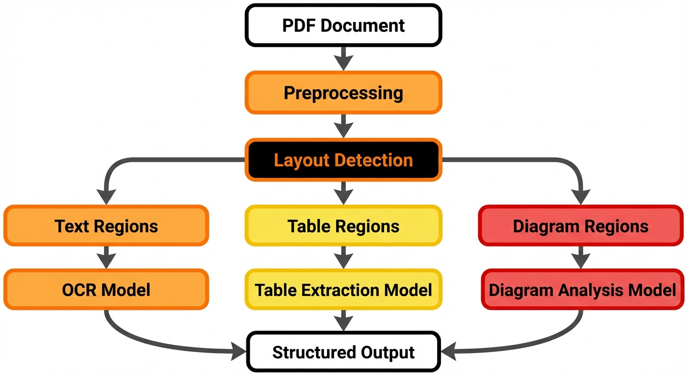
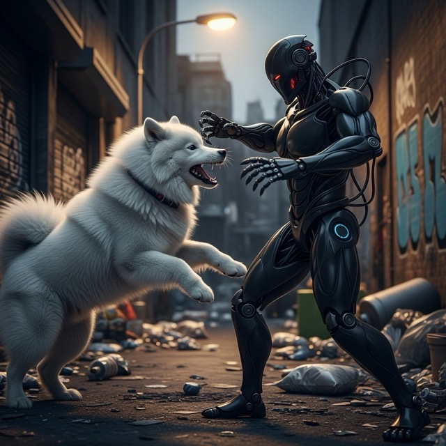
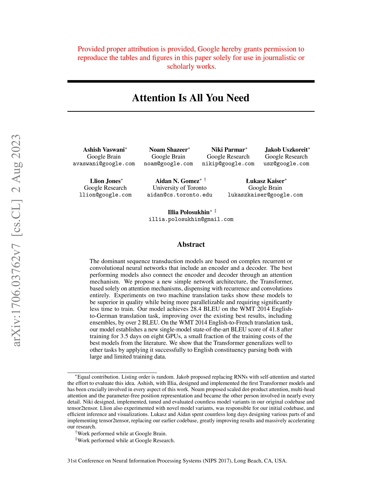
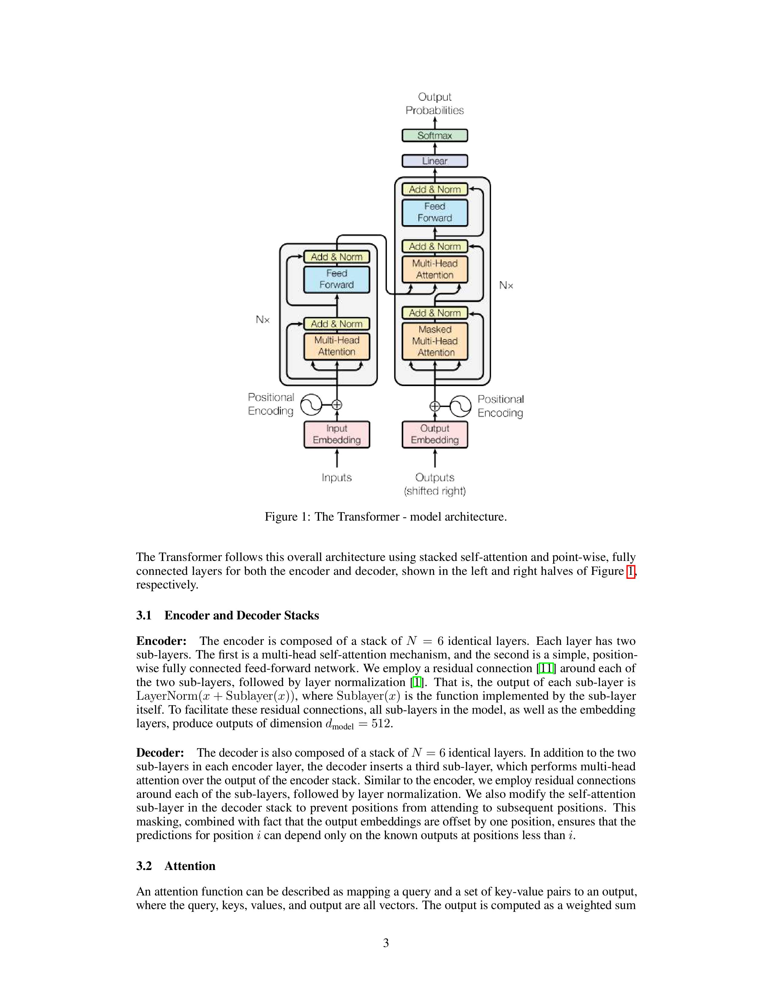

# Lesson 11: Multimodal Data

In the previous lessons, we built a solid foundation for creating AI apps. You learned the difference between structured LLM workflows and autonomous AI agents, mastered context engineering, and understood core patterns like ReAct and Retrieval-Augmented Generation (RAG). We have covered the essentials of building systems that can reason and access external knowledge. In this lesson, we will focus on the final piece of the puzzle for the first part of the course: multimodal data. 

Multimodal data is essential because in the real world, enterprise-grade AI applications rarely deal with text alone. They must understand and process images, documents, charts, and tables. Text-only systems are limited to tasks like analyzing complex financial reports, medical documents, and building sketches. To build truly useful AI, you need to interpret this rich, visual information. This lesson covers the ‘how’.

## Limitations of Traditional Document Processing

For years, the standard approach to handling complex documents like invoices, reports, or technical manuals in AI systems was to normalize everything to text. This process typically relies on Optical Character Recognition (OCR) and involves a convoluted, multi-step pipeline. Suppose you need to process a PDF that contains a mix of text, tables, and diagrams.

As illustrated in Figure 1, such a system first starts with preprocessing, such as noise removal. Then, it needs to perform layout detection to identify different regions within the document, such as titles, paragraphs, tables, or diagrams. It then sends the text regions to an OCR model for extraction. For other structures, it needs specialized models: one for tables, another for diagrams, and so on. The final output is a structured format, like JSON, that pieces together the extracted text and metadata.



*Figure 1: A traditional, multi-step document processing pipeline.*

This entire process is fundamentally flawed. It is rigid because it fails when encountering a new data type it was not trained on. Unseen structures (e.g., a new chart type) bypass your detectors and vanish from output. It is fragile, slow, and costly, requiring multiple model calls for a single document and errors compound at each stage. For example, a mistake in layout detection cascades into the OCR step, leading to poorly extracted text that makes downstream RAG systems useless [[1]](https://www.mixedbread.com/blog/the-hidden-ceiling). Traditional OCR systems struggle with handwritten notes, poor-quality scans, and complex layouts like architectural drawings, where performance can drop significantly [[2]](https://arxiv.org/html/2412.02210v2), [[3]](https://www.dataunboxed.io/blog/ocr-vs-vlm-ocr-naive-benchmarking-accuracy-for-scanned-documents). Benchmarks show that even state-of-the-art OCR solutions underperform compared to perfect text extraction, creating a "performance ceiling" that limits retrieval and question-answering accuracy, especially in documents with dense tables, formulas, or embedded diagrams [[1]](https://www.mixedbread.com/blog/the-hidden-ceiling).

)*](article_media/669eda55-7a5b-4beb-bc0b-b769e5a6d708.png)

*Figure 2: Complex layouts like this floor plan are a significant challenge for traditional OCR systems. (Media from [Hackernoon](https://hackernoon.com/complex-document-recognition-ocr-doesnt-work-and-heres-how-you-fix-it))*

This approach might work for niche, highly specialized tasks, but it does not scale for the flexible and fast AI agents we need today. Modern AI solutions use multimodal LLMs that can directly interpret images and PDFs as native inputs, completely bypassing this brittle OCR workflow. Let us explore how multimodal LLMs work.

## Foundations of Multimodal LLMs
Before diving into the code, it's helpful to have a high-level understanding of how multimodal LLMs work. To build AI agents, we don't need to understand every detail, but understanding the basics helps you implement, deploy, and optimize them effectively.

Multimodal LLMs typically use one of two designs: a unified embedding‑decoder that concatenates projected image patch embeddings with text embeddings into an unmodified LLM decoder, or a cross‑modality attention approach where text queries connect to visual features via the cross‑attention module.


*Figure 3: The two primary architectural approaches for building multimodal LLMs - Source* [Understanding Multimodal LLMs](https://magazine.sebastianraschka.com/p/understanding-multimodal-llms) [4]

Let us look closer at the **unified embedding decoder** approach, which is simpler and more common. In this setup, the system passes image information to the LLM as a sequence of input tokens concatenated to the text tokens. The main components are an image encoder, a projector, and the LLM backbone itself [[5]](https://www.nvidia.com/en-us/glossary/vision-language-models/). In this design, the image is converted into patch embeddings by an image encoder (often ViTs) and then linearly projected to the LLM’s embedding dimension so the image tokens can be concatenated with text tokens and processed by a unmodified decoder. Many recent systems train this stack in stages—first fitting the projector (with encoders frozen) before unfreezing components for end-to-end fine-tuning for stability [[4]](https://magazine.sebastianraschka.com/p/understanding-multimodal-llms).


*Figure 4: The Unified Embedding Decoder Architecture concatenates image and text embeddings as input to the LLM - Source* [Understanding Multimodal LLMs](https://magazine.sebastianraschka.com/p/understanding-multimodal-llms) [4]

The **cross-modality attention** architecture takes a different route. Instead of adding image tokens to the input sequence, it injects the visual information directly into the attention mechanism of the LLM during the decoding step. This allows the model to dynamically "look" at the image features while processing the text. Concretely, the text stream queries visual features via cross-attention, attending to image keys/values when needed rather than carrying all image tokens through the sequence. This pattern can be more efficient for high-resolution inputs and long contexts while preserving tight text–vision coupling [[4]](https://magazine.sebastianraschka.com/p/understanding-multimodal-llms).


*Figure 5: The Cross-modality Attention Architecture integrates visual data via attention mechanisms - Source* [Understanding Multimodal LLMs](https://magazine.sebastianraschka.com/p/understanding-multimodal-llms) [4]

Both approaches rely on an **image encoder**. The image encoder takes as input the image and splits it into multiple fixed-size patches. Similar to how we split text into multiple tokens, this process is known as image tokenization.


*Figure 6: Image patching is analogous to text tokenization, converting visual data into a sequence of embeddings - Source* [Understanding Multimodal LLMs](https://magazine.sebastianraschka.com/p/understanding-multimodal-llms) [4]

Then the image encoder (e.g., a ViT) processes these patches with transformer layers to produce semantic image embeddings. Ultimately, a lightweight linear projection maps these vectors to the LLM’s embedding size so they are compatible with the language model’s inputs [[4]](https://magazine.sebastianraschka.com/p/understanding-multimodal-llms). During projection, we ensure that the image and text embeddings are within the same vector space for the LLM to interpret them together.


*Figure 7: A Vision Transformer converts image patches into embeddings - Source* [Understanding Multimodal LLMs](https://magazine.sebastianraschka.com/p/understanding-multimodal-llms) [4]

The real value emerges when the image embeddings and text embeddings align in the same vector space. Models can achieve this alignment through a technique called contrastive learning, which trains them to place semantically similar images and text descriptions close to each other in the embedding space [[6]](https://github.com/openai/CLIP). This shared space enables semantic similarity searches across different data types; you can use a text query to find a relevant image because their vector representations are close to one another [[7]](https://huggingface.co/docs/transformers/v4.22.1/en/model_doc/clip). Contrastive learning achieves this by training the model to maximize the similarity between "positive pairs" (like an image and its correct caption) and minimize the similarity between "negative pairs" (an image and an irrelevant caption) [[8]](https://towardsdatascience.com/multimodal-embeddings-an-introduction-5dc36975966f), [[9]](https://www.pinecone.io/learn/series/image-search/clip/). This ensures that semantically related content, regardless of its original modality, is positioned closely in the shared vector space [[8]](https://towardsdatascience.com/multimodal-embeddings-an-introduction-5dc36975966f). Popular choices for these image encoders include CLIP (Contrastive Language-Image Pre-Training), OpenCLIP, or SigLIP [[6]](https://github.com/openai/CLIP), [[7]](https://huggingface.co/docs/transformers/v4.22.1/en/model_doc/clip).


*Figure 8: Multimodal embeddings align text and image representations in a shared vector space - Source* [Multimodal Embeddings: An Introduction](https://towardsdatascience.com/multimodal-embeddings-an-introduction-5dc36975966f/) [8]

Each architectural approach has its trade-offs. The unified embedding model is generally simpler to implement and often performs better on OCR-related tasks. The cross-attention model can be computationally efficient, especially with high-resolution images, because it avoids lengthening the input sequence with image tokens [[4]](https://magazine.sebastianraschka.com/p/understanding-multimodal-llms). Hybrid approaches also exist, aiming to combine the best of both worlds. The core takeaway is that multiple architectures can succeed, often with hybrid architectures proving the most successful.

Today, most state-of-the-art models are multimodal, but the level of multimodality can be highly varied. In the open-source community, we have models like Llama 4, Gemma 2, Qwen3, and DeepSeek R1/V3. In the proprietary space, models like OpenAI's GPT-5, Google's Gemini 2.5, and Anthropic's Claude series all have strong multimodal capabilities. This modular encoder-based design also allows us to extend it to other data types like audio or video by simply adding the appropriate encoder.

It is essential to distinguish between the multimodal LLMs presented in this section and generative diffusion models like Midjourney or Stable Diffusion used to generate high-quality images or videos. While models like Gemini 2.5 can create pictures, their core architecture differs from diffusion models. Therefore, for building AI agents, we focus only on multimodal LLMs for their reasoning capabilities and ability to understand different types of inputs. On the other hand, as diffusion models are used only to generate multimodal data, they are not the focus of this course. Still, if necessary, they could easily be integrated as tools, extending the agent's generation capabilities [[10]](https://blog.google/technology/ai/google-gemini-ai/).

The field of multimodal AI is evolving rapidly. The goal of this section was not to be exhaustive but to give you a solid intuition for why these models are superior to older OCR-based methods. Now that you understand how LLMs can directly process images or other data modalities, let us see how it works in practice.

## Applying Multimodal LLMs to Images and PDFs

To understand how LLMs work with multimodal data, we will walk you through some hands-on examples using the three primary ways to pass multimodal data, such as images and PDFs, to an LLM API: as raw bytes, as Base64-encoded strings, or as URLs. To support our ideas, we will implement multiple use cases using Gemini, including extracting image captions, comparing multiple images, and, as a more interesting use case, performing 2D object detection on images. Ultimately, to grasp the differences between the two, we will repeat the same process, with PDFs instead of images.

Before digging into the implementation, let’s quickly review some pros and cons of the three core options for passing multimodal data to LLMs.

**Raw bytes** offer the most direct way to handle files and work well for simple, one-off API calls. However, storing raw binary data in many databases can be problematic. Databases often interpret binary input as text, which can lead to data corruption.

**Base64 encoding** solves this storage problem by converting binary data into a string format. This is a common practice for embedding images directly in web pages. For our use case, it ensures that images or documents can be safely stored in a text-friendly database like PostgreSQL or MongoDB. The main downside is that Base64 strings are about 33% larger than the original binary data, which can increase latency and storage costs [[11]](https://www.turing.com/resources/building-high-quality-multimodal-data-pipelines-for-llms).


*Figure 9: Comparison of data flow for Base64 vs. URL-based multimodal data handling.*

**URLs** are the most efficient method for enterprise-scale applications. Instead of passing large files back and forth over the network, you can store your data in a private data lake like Amazon S3 or Google Cloud Storage. You then simply pass a secure URL to the LLM. The model's server fetches the data directly, reducing client-side bandwidth and improving performance [[12]](https://arxiv.org/html/2506.06579v1). This method is also useful for public data, as some models can directly access and process content from a public URL.

<aside>
💡

**Tip:** Use raw bytes for quick, local tests. Use Base64 when you need to store media files directly in a traditional database. Use URLs for scalable, production systems that leverage cloud storage or need to access public web content.

</aside>

<aside>
💡

You can experiment with the code of this lesson with this [Colab](https://colab.research.google.com/github/louisfb01/agent-course-notebooks/blob/main/notebooks/lesson_11_notebook.ipynb#scrollTo=9h4WD9-LlcLR).

Alternatively, you can find the code of this lesson in the notebook of lesson 11, in the GitHub repository of the course.

</aside>

Now, let us get into the code. We will start by processing an image as raw bytes to generate a caption:

1. First, let’s display our sample image: a cat interacting with a robot.

```python
from pathlib import Path
from IPython.display import Image as IPythonImage, display

def display_image(image_path: Path) -> None:
    image = IPythonImage(filename=image_path, width=400)
    display(image)

display_image(Path("images") / "image_1.jpeg")
```


Figure 10: A fluffy grey tabby kitten playfully perched on the arm of a large, dark metallic robot

1. Next, we define a function to load the image as bytes. We convert it to the `WEBP` format because it is one of the most storage-efficient formats out there:
    
    ```python
    import io
    from typing import Literal
    from PIL import Image as PILImage
    
    def load_image_as_bytes(
        image_path: Path, format: Literal["WEBP", "JPEG", "PNG"] = "WEBP", max_width: int = 600, return_size: bool = False
    ) -> bytes | tuple[bytes, tuple[int, int]]:
        image = PILImage.open(image_path)
        if image.width > max_width:
            ratio = max_width / image.width
            new_size = (max_width, int(image.height * ratio))
            image = image.resize(new_size)
    
        byte_stream = io.BytesIO()
        image.save(byte_stream, format=format)
    
        if return_size:
            return byte_stream.getvalue(), image.size
    
        return byte_stream.getvalue()
    
    image_bytes = load_image_as_bytes(image_path=Path("images") / "image_1.jpeg", format="WEBP")
    ```
    
    The `image_bytes` variable now holds the image data. Its size is 44392 bytes.
    
2. With the image loaded as bytes, we can pass it to the Gemini model along with a text prompt to generate a caption.
    
    ```python
    from google import genai
    from google.genai import types
    
    # Configure your Gemini client via the GOOGLE_API_KEY environment variable
    client = genai.Client()
    MODEL_ID = "gemini-3.5-flash"
    
    response = client.models.generate_content(
        model=MODEL_ID,
        contents=[
            types.Part.from_bytes(
                data=image_bytes,
                mime_type="image/webp",
            ),
            "Tell me what is in this image in one paragraph.",
        ],
    )
    print(response.text)
    ```
    
    The model returns a detailed description:
    
    ```
    This striking image features a massive, dark metallic robot, its powerful form detailed with intricate circuit patterns on its head and piercing red glowing eyes. Perched playfully on its right arm is a small, fluffy grey tabby kitten, its front paw raised as if exploring or batting at the robot's armored limb, while its gaze is directed slightly off-frame. The robot's large, segmented hand is visible beneath the kitten. The background suggests an industrial or workshop environment, with hints of metal structures and natural light filtering in from an unseen window, creating a dramatic contrast between the soft, vulnerable kitten and the formidable, mechanical sentinel.
    ```
    
3. We can easily adapt this method to pass multiple images simultaneously. For example, we can ask the LLM to compare the previous image with the one below:



Figure 11: A fluffy white dog in a tense, aggressive stance facing a sleek black robot in a cluttered urban alleyway.

1. Now, we ask the model to describe the differences between the two images:
    
    ```python
    response = client.models.generate_content(
        model=MODEL_ID,
        contents=[
            types.Part.from_bytes(
                data=load_image_as_bytes(image_path=Path("images") / "image_1.jpeg", format="WEBP"),
                mime_type="image/webp",
            ),
            types.Part.from_bytes(
                data=load_image_as_bytes(image_path=Path("images") / "image_2.jpeg", format="WEBP"),
                mime_type="image/webp",
            ),
            "What's the difference between these two images? Describe it in one paragraph.",
        ],
    )
    print(response.text)
    ```
    
    The LLM response highlights the differences:
    
    ```
    The primary difference between the two images lies in the nature of the 
    interaction depicted and their respective settings. In the first image, 
    a small, grey kitten is shown curiously interacting with a large, metallic robot,
    gently perched on its arm within what appears to be a clean, well-lit workshop 
    or industrial space. Conversely, the second image 
    portrays a tense and aggressive confrontation between a 
    fluffy white dog and a sleek black robot, both in combative stances, 
    amidst a cluttered and grimy urban alleyway filled with trash and graffiti.
    ```
    
2. We can follow a similar process for Base64 encoding. We define a helper function to convert the image bytes to a Base64 string.
    
    ```python
    import base64
    from typing import cast
    
    def load_image_as_base64(
        image_path: Path, format: Literal["WEBP", "JPEG", "PNG"] = "WEBP", max_width: int = 600
    ) -> str:
        image_bytes = load_image_as_bytes(image_path=image_path, format=format, max_width=max_width)
        return base64.b64encode(cast(bytes, image_bytes)).decode("utf-8")
    
    image_base64 = load_image_as_base64(image_path=Path("images") / "image_1.jpeg", format="WEBP")
    ```
    
    The `image_base64` variable now holds the Base64 string. The encoded image starts with the following string `UklGRmCtAABXRUJQVlA4IFStAABQ7AKdASpYAlgCPm0ylEekIqInJnQ7gOANiWdtk7FnEo2gDknjPixW9SNSb5P7IbBNhLn87Vtp...` and has a size of 59192 bytes. 
    
3. As expected, the Base64 string is about 33% larger than the raw bytes. Running the code below:
    
    ```python
    print(f"Image as Base64 is {(len(image_base64) - len(image_bytes)) / len(image_bytes) * 100:.2f}% larger than as bytes")
    ```
    
    Outputs:
    
    ```
    Image as Base64 is 33.34% larger than as bytes
    ```
    
4. The API call is nearly identical, simply passing the `image_base64` data instead:
    
    ```python
    response = client.models.generate_content(
        model=MODEL_ID,
        contents=[
            types.Part.from_bytes(data=image_base64, mime_type="image/webp"),
            "Tell me what is in this image in one paragraph.",
        ],
    )
    ```
    
5. For public URLs, Gemini has a built-in `url_context` tool that can automatically parse content from a link. Here, we ask it to summarize the original ReAct paper directly from its arXiv URL:
    
    ```python
    response = client.models.generate_content(
        model=MODEL_ID,
        contents="Based on the provided paper as a PDF, tell me how ReAct works: https://arxiv.org/pdf/2210.03629",
        config=types.GenerateContentConfig(tools=[{"url_context": {}}]),
    )
    print(response.text)
    ```
    
    The LLM response provides a detailed summary of how ReAct works:
    
    ```
    ReAct is a novel paradigm for large language models (LLMs) that combines reasoning (Thought) and acting (Action) in an interleaved manner to solve diverse language and decision-making tasks. This approach allows the model to:
    
    *   **Reason to Act:** Generate verbal reasoning traces to induce, track, and update action plans, and handle exceptions.
    *   **Act to Reason:** Interface with and gather additional information from external sources (like knowledge bases or environments) to incorporate into its reasoning.
    
    **How it works:**
    
    Instead of just generating a direct answer ...
    
    This cycle of Thought, Action, and Observation continues until the task is completed.
    ```
    
6. When working with private data lakes, such as Google Cloud Storage (GCS) or Amazon S3, the process is similar, except you have to use the `from_uri` method:
    
    ```python
    response = client.models.generate_content(
        model=MODEL_ID,
        contents=[
            types.Part.from_uri(uri="gs://gemini-images/image_1.jpeg", mime_type="image/webp"),
            "Tell me what is in this image in one paragraph.",
        ],
    )
    ```
    
7. A more advanced and exciting use case for multimodal LLMs is object detection. We can ask the model to identify prominent items in an image and return their bounding box coordinates. To do that, let’s begin by defining a Pydantic schema to ensure the output is structured correctly:
    
    ```python
    from pydantic import BaseModel, Field
    
    class BoundingBox(BaseModel):
        ymin: float
        xmin: float
        ymax: float
        xmax: float
        label: str
    
    class Detections(BaseModel):
        bounding_boxes: li. st[BoundingBox]
    
    image_bytes, image_size = load_image_as_bytes(
        image_path=Path("images") / "image_1.jpeg", format="WEBP", return_size=True
    )
    
    ```
    
    1. Next, we define the prompt that guides the LLM to detect 2D bounding boxes normalized to a range of 0-1000 to avoid being sensitive to the image shape:
    
    ```python
    prompt = """
    Detect all of the prominent items in the image.
    The box_2d should be [ymin, xmin, ymax, xmax] normalized to 0-1000.
    Also, output the label of the object found within the bounding box.
    """
    ```
    
    1. Ultimately, we load the image and call the LLM:
    
    ```python
    config = types.GenerateContentConfig(
        response_mime_type="application/json",
        response_schema=Detections,
    )
    
    response = client.models.generate_content(
        model=MODEL_ID,
        contents=[
            types.Part.from_bytes(data=image_bytes, mime_type="image/webp"),
            prompt,
        ],
        config=config,
    )
    
    detections = cast(Detections, response.parsed)
    ```
    
    The model correctly identifies the "robot" and "kitten" and provides their coordinates. For our example, the image size is (600, 600) and the detected bounding boxes are:
    
    - ymin=1.0 xmin=450.0 ymax=997.0 xmax=1000.0 label='robot'
    - ymin=269.0 xmin=39.0 ymax=782.0 xmax=530.0 label='kitten'
    
    We can then use a helper function to visualize these boxes on the original image.
    
    ```python
    import matplotlib.pyplot as plt
    import matplotlib.patches as patches
    import numpy as np
    
    def visualize_detections(detections: Detections, image_path: Path) -> None:
        plt.clf()
        image = PILImage.open(image_path)
        image_array = np.array(image)
        img_height, img_width = image_array.shape[:2]
        fig, ax = plt.subplots(1, 1, figsize=(8, 6))
        ax.imshow(image_array)
    
        for bbox in detections.bounding_boxes:
            xmin = (bbox.xmin / 1000) * img_width
            ymin = (bbox.ymin / 1000) * img_height
            xmax = (bbox.xmax / 1000) * img_width
            ymax = (bbox.ymax / 1000) * img_height
            width = xmax - xmin
            height = ymax - ymin
            rect = patches.Rectangle((xmin, ymin), width, height, linewidth=3, edgecolor="red", facecolor="none")
            ax.add_patch(rect)
            ax.text(
                xmin, ymin + 5, bbox.label[:15],
                fontsize=12, color="red", fontweight="bold",
                bbox=dict(boxstyle="round,pad=0.3", facecolor="white", alpha=0.8),
            )
        ax.set_xticks([])
        ax.set_yticks([])
        ax.set_title(f"Object Detection Results: {image_path.name}", fontsize=14, fontweight="bold")
        plt.tight_layout()
        plt.show()
    
    visualize_detections(detections, Path("images") / "image_1.jpeg")
    
    ```
    


Figure 12: The sample image with red bounding boxes drawn around the robot and the kitten, with their corresponding labels.

**Working with PDFs** follows the same principles. Since we use the same Gemini model and interface, the process is almost identical to what we did for images. We can load a PDF as bytes or Base64 and ask the model to summarize it. Let's use the legendary *"Attention Is All You Need"* paper as an example. 

1. Here is how the first page of the PDF looks:
    
    ```python
    display_image(Path("images") / "attention_is_all_you_need_0.jpeg")
    
    ```
    



Figure 13: The first page of the "Attention Is All You Need" paper, featuring the title, authors, and abstract

1. First, let’s process the entire PDF as raw bytes:
    
    ```python
    pdf_bytes = (Path("pdfs") / "attention_is_all_you_need_paper.pdf").read_bytes()
    ```
    
2. Now, we call the LLM to summarize the document:
    
    ```python
    response = client.models.generate_content(
        model=MODEL_ID,
        contents=[
            types.Part.from_bytes(data=pdf_bytes, mime_type="application/pdf"),
            "What is this document about? Provide a brief summary of the main topics.",
        ],
    )
    print(response.text)
    ```
    
    The LLM response provides a summary of the PDF:
    
    ```
    This document introduces the **Transformer**, a novel neural network architecture designed for **sequence transduction tasks** (like machine translation).
    
    Its main topics include:
    
    1.  **Dispensing with Recurrence and Convolutions**: Unlike previous dominant models (RNNs and CNNs), the Transformer relies *solely* on **attention mechanisms**, eliminating the need for sequential computation.
    2.  **Attention Mechanisms**: It details the **Scaled Dot-Product Attention** and **Multi-Head Attention** as its core building blocks, explaining how they allow the model to weigh different parts of the input sequence.
    3.  **Parallelization and Efficiency**: The paper highlights that the Transformer's architecture allows for significantly more parallelization during training, leading to **faster training times** compared to prior models.
    4.  **Superior Performance**: It demonstrates that the Transformer achieves **state-of-the-art results** on machine translation tasks (English-to-German and English-to-French) and generalizes well to other tasks like English constituency parsing.
    ```
    
3. Alternatively, we can process the PDF as Base64 encoded strings:
    
    ```python
    def load_pdf_as_base64(pdf_path: Path) -> str:
        with open(pdf_path, "rb") as f:
            return base64.b64encode(f.read()).decode("utf-8")
    
    pdf_base64 = load_pdf_as_base64(pdf_path=Path("pdfs") / "attention_is_all_you_need_paper.pdf")
    
    ```
    
    Now, we call the LLM to summarize the document using the Base64 string:
    
    ```python
    response = client.models.generate_content(
        model=MODEL_ID,
        contents=[
            "What is this document about? Provide a brief summary of the main topics.",
            types.Part.from_bytes(data=pdf_base64, mime_type="application/pdf"),
        ],
    )
    print(response.text)
    ```
    
    The LLM response is similar to the one that inputs raw bytes.
    
4. To further emphasize how you can input PDFs to LLMs as images, especially when they contain complex layouts, let's perform object detection on a page from the *"Attention Is All You Need"* paper. Here is the PDF page we will use as an example for detecting the diagram:
    
    ```python
    display_image(Path("images") / "attention_is_all_you_need_1.jpeg")
    
    ```
    



Figure 14: A page from the "Attention is All You Need" paper with a red bounding box around the Transformer model architecture diagram.

1. We define the object detection prompt and load the image as bytes:
    
    ```python
    prompt = """
    Detect all the diagrams from the provided image as 2d bounding boxes.
    The box_2d should be [ymin, xmin, ymax, xmax] normalized to 0-1000.
    Also, output the label of the object found within the bounding box.
    """
    
    image_bytes, image_size = load_image_as_bytes(
        image_path=Path("images") / "attention_is_all_you_need_1.jpeg", format="WEBP", return_size=True
    )
    ```
    
2. Now, we call the LLM to detect the diagram from the PDF page as an image:
    
    ```python
    config = types.GenerateContentConfig(
        response_mime_type="application/json",
        response_schema=Detections,
    )
    response = client.models.generate_content(
        model=MODEL_ID,
        contents=[
            types.Part.from_bytes(data=image_bytes, mime_type="image/webp"),
            prompt,
        ],
        config=config,
    )
    detections = cast(Detections, response.parsed)
    ```
    
    The image size is (600, 776), while the detected bounding box is:
    
    ```
    ymin=88.0 xmin=309.0 ymax=515.0 xmax=681.0 label='diagram'
    ```
    
    1. Finally, we visualize the detections:
    
    ```python
    visualize_detections(detections, Path("images") / "attention_is_all_you_need_1.jpeg")
    ```
    


Figure 15: The retrieved image, which is a page from the "Attention is All You Need" paper showing the Transformer architecture diagram.

These examples show how easily modern LLMs can ingest and reason over multimodal data, such as images and PDFs, thereby making complex, multi-step OCR pipelines obsolete.

## Foundations of Multimodal RAG
One of the most impactful applications of multimodal embeddings is in RAG systems. As we discussed in Lesson 10, feeding large amounts of context into an LLM is inefficient. This problem becomes even more evident with large files like high-resolution images or multi-page PDFs. Trying to fit thousands of document pages into a context window leads to high latency, soaring costs, and degraded performance.

A generic multimodal RAG architecture for text and images involves two main pipelines: ingestion and retrieval. For example, let's assume that we want to store images in our vector database and query them using text inputs. To achieve this, **during ingestion**, we use a multimodal embedding model, such as CLIP, to convert our collection of images into vector embeddings. We then store these embeddings in our vector database of choice for efficient searching. As the image embedding is just a vector similar to a text embedding, you are not limited to any particular vector database.

**During retrieval**, we convert a user's text query into an embedding using the same CLIP embedding model. The system then queries the vector database to find the `top-k` image embeddings most similar to the query text embedding, typically using cosine similarity. Since text and image embeddings exist in a shared vector space, this cross-modal search is working effectively. This is the core technology behind image search engines like Google Images or Apple Photos.


*Figure 16: A generic multimodal RAG architecture for text-to-image retrieval.*

For enterprise use cases focused on document retrieval, as of late 2024, every SOTA approach is based on the ColPali-style architecture, making ColPali a fundamental concept to understand how modern multimodal RAG works [[17]](https://arxiv.org/pdf/2407.01449v6). ColPali standardized the architecture for completely bypassing the traditional OCR pipeline that typically involves text extraction, layout detection, chunking, and embedding in multimodal RAG systems, achieving on-par or better results. Instead of extracting text, it treats each document page as an image and processes it directly with multimodal LLMs to understand both textual and visual content simultaneously. As discussed in previous sections, this preserves all the rich visual context, tables, figures, charts, and layout that is lost during text extraction [[13]](https://dev.to/aws/beyond-text-building-intelligent-document-agents-with-vision-language-models-and-colpali-and-oc). The problem it solves is the loss of visual information when documents are converted to text. This approach works exceptionally well for documents with tables, figures, and other complex visual layouts [[14]](https://learnopencv.com/multimodal-rag-with-colpali/).

The **offline indexing**, or the **ingestion pipeline**, converts PDF documents into high-quality images, similar to what we did in previous sections. These images are then processed by the ColPali model, which generates multi-vector embeddings from the document images. These embeddings capture spatial relationships, formatting context, and the interplay between text and visual elements. Ultimately, the embeddings are stored in a vector database like Qdrant for efficient similarity search [[15]](https://decodingml.substack.com/p/the-king-of-multi-modal-rag-colpali).

Instead of creating a single embedding for an entire page, ColPali generates a "bag-of-embeddings" or "multi-vector" representation, with one embedding for each image patch. This captures fine-grained details within the document [[14]](https://learnopencv.com/multimodal-rag-with-colpali/).

ColPali commonly uses a PaliGemma‑3B backbone that combines a SigLIP vision encoder with a Gemma‑2B language decoder via a multimodal projection, leveraging the **Unified Embedding Decoder Architecture** presented in the multimodal LLM architecture section. The paper also reports a Qwen‑based variant, called ColQwen2, that swaps the backbone to a Qwen2‑VL family model and achieves the strongest results on the ViDoRe benchmark, which is designed to test how well document retrieval systems can handle documents that contain both text and complex visual elements [[16]](https://blog.vespa.ai/retrieval-with-vision-language-models-colpali/), [[17]](https://arxiv.org/pdf/2407.01449v6).

For the **online query logic**, ColPali uses a late-interaction mechanism called MaxSim. This algorithm computes similarities by comparing each token from the query embedding against all the patch embeddings of a document image to find the maximum similarity. These maximum similarity values are then summed up into a single aggregate similarity score that is used to rank the documents from the most relevant to least [[14]](https://learnopencv.com/multimodal-rag-with-colpali/). Thus, this query engine can be used as a reranker to reduce the context window by keeping only the most relevant retrieved items.

This approach has proven to be considerably faster and more accurate than OCR-based pipelines, outperforming them on complex document retrieval benchmarks [[2]](https://arxiv.org/html/2412.02210v2). It achieves an 81.3% average nDCG@5 score on the ViDoRe benchmark, showcasing its superior performance. ColPali demonstrates improved latency and fewer failure points compared to traditional OCR pipelines, which require text extraction, layout detection, and chunking [[17]](https://arxiv.org/pdf/2407.01449v6).

As innovations happen quickly in the space, as of 2025, the original ColPali method is no longer the state-of-the-art, as it can be seen in the [ViDoRe Benchmark V2 [21]](https://huggingface.co/blog/manu/vidore-v2) (an extension of the original benchmark containing more complex retrieval scenarios). Still, what is important to remember is that ColPali’s architecture inspired all future SOTA methods used for document retrieval, making it a fundamental concept required for multimodal RAG.


*Figure 17: Comparison of a standard retrieval pipeline vs. the ColPali architecture. (Media from [ColPali Paper](https://arxiv.org/pdf/2407.01449v6))*

Most modern multimodal RAG architectures use ColPali or a derivative of it to build their multimodal RAG application involving visually complex PDFs or images, such as financial reports with charts and tables or technical manuals with diagrams. The official `colpali` implementation can be found on GitHub at `illuin-tech/colpali`. 

Now that we have covered the theory, let us see how this works in practice and build a simple multimodal RAG system from scratch.

## Implementing Multimodal RAG for Images, PDFs, and Text
To connect everything we have learned in this lesson and lesson 10 on RAG, we will build a simple multimodal RAG system. For this mini-project, we will populate an in-memory vector index with a mix of images, raw text snippets, and a PDF. This demonstrates how to handle diverse content types in a single retrieval system, with no text-description workaround.


*Figure 18: Architecture of our simplified multimodal RAG example.*

Our RAG system embeds each item — image, PDF, or text — **directly** into a shared vector space using `gemini-embedding-2`, Gemini's multimodal embedding model [[22]](https://ai.google.dev/gemini-api/docs/embeddings). Because every modality sits in the same space, no intermediate text description is required. These vectors are stored in our in-memory index. When you provide a query (text *or* an image), we embed it with the **same** model and run a cosine-similarity search against the index to find the most relevant items.

Now, let us get to the code.

1. First, we display the images that we will embed and load into our mocked vector index. This collection includes standard images mixed with pages from the *"Attention Is All You Need"* paper, which we treat as images to demonstrate handling diverse visual content:

```python
display_image_grid(
    image_paths=[
        Path("images") / "image_1.jpeg",
        Path("images") / "image_2.jpeg",
        Path("images") / "image_3.jpeg",
        Path("images") / "image_4.jpeg",
        Path("images") / "attention_is_all_you_need_1.jpeg",
        Path("images") / "attention_is_all_you_need_2.jpeg",
    ],
    rows=2,
    cols=3,
)
```


Figure 19: A grid of images used within our multimodal RAG system example.

1. First, we define the core embedding function. It embeds **either** a text string **or** raw bytes (an image or PDF) with `gemini-embedding-2`, returning a vector in the shared embedding space. The optional `output_dimensionality` argument lets us shrink that vector (more on that shortly):
    
    ```python
    import asyncio
    from typing import Any
    import numpy as np

    MimeType = Literal["image/webp", "image/png", "image/jpeg", "application/pdf", "audio/mpeg", "video/mp4"]

    def embed(
        content: str | bytes,
        mime_type: MimeType | None = None,
        output_dimensionality: int | None = None,
    ) -> np.ndarray | None:
        if isinstance(content, bytes):
            if mime_type is None:
                raise ValueError("mime_type is required when content is bytes")
            contents: list = [types.Part.from_bytes(data=content, mime_type=mime_type)]
        else:
            contents = [content]

        config = (
            types.EmbedContentConfig(output_dimensionality=output_dimensionality)
            if output_dimensionality is not None
            else None
        )

        kwargs: dict[str, Any] = {"model": "gemini-embedding-2", "contents": contents}
        if config is not None:
            kwargs["config"] = config
        result = client.models.embed_content(**kwargs)

        return np.array(result.embeddings[0].values) if result and result.embeddings else None
    ```
    
    The key change from earlier versions: the **same** function handles text and image bytes — there is no separate "describe the image, then embed the description" path. A quick sanity check confirms that a text string and an image both come back as a `3072`-dimensional vector in the same space, so we can compare them directly with cosine similarity.
    
2. To index many items efficiently, we add an `embed_batch` helper that fans the embedding calls out concurrently with `asyncio`, instead of sending them one at a time. It runs over Gemini's *stable* async endpoint rather than the cheaper but **experimental** `client.batches.create_embeddings` batch API, so our code won't break as the SDK evolves — reach for the batch API only for huge offline jobs once it stabilises [[24]](https://ai.google.dev/gemini-api/docs/batch-api):
    
    ```python
    async def embed_batch(
        items: list[tuple[str | bytes, MimeType | None]],
        output_dimensionality: int | None = None,
        max_concurrency: int = 8,
    ) -> list[np.ndarray | None]:
        config = (
            types.EmbedContentConfig(output_dimensionality=output_dimensionality)
            if output_dimensionality is not None
            else None
        )
        semaphore = asyncio.Semaphore(max_concurrency)

        async def _embed_one(content: str | bytes, mime_type: MimeType | None) -> np.ndarray | None:
            if isinstance(content, bytes):
                if mime_type is None:
                    raise ValueError("mime_type is required when content is bytes")
                contents: list = [types.Part.from_bytes(data=content, mime_type=mime_type)]
            else:
                contents = [content]

            kwargs: dict[str, Any] = {"model": "gemini-embedding-2", "contents": contents}
            if config is not None:
                kwargs["config"] = config

            async with semaphore:
                result = await client.aio.models.embed_content(**kwargs)
            return np.array(result.embeddings[0].values) if result and result.embeddings else None

        return list(await asyncio.gather(*(_embed_one(c, m) for c, m in items)))
    ```
    
3. With the embedding functions in place, `create_vector_index` simply loads each image as bytes and embeds them all in one batched call. For this example, we mock the vector index as a simple Python list because we have only a few items. In a real-world application, you would use a dedicated vector database, such as Qdrant or Milvus, which employs efficient indexing algorithms like HNSW to scale to millions of documents:
    
    ```python
    from typing import cast

    async def create_vector_index(image_paths: list[Path]) -> list[dict]:
        image_bytes_list = [
            cast(bytes, load_image_as_bytes(p, format="WEBP", return_size=False)) for p in image_paths
        ]

        embeddings = await embed_batch([(b, "image/webp") for b in image_bytes_list])

        return [
            {
                "content": b,
                "type": "image",
                "filename": p,
                "mime_type": "image/webp",
                "embedding": e,
            }
            for p, b, e in zip(image_paths, image_bytes_list, embeddings)
        ]

    image_paths = list(Path("images").glob("*.jpeg"))
    vector_index = await create_vector_index(image_paths)
    ```
    
    After calling `create_vector_index`, we successfully create seven embeddings under the `vector_index` variable. Each element now has keys for `content`, `type`, `filename`, `mime_type`, and `embedding`, where `embedding` is a 3072-dimensional vector embedded **directly** from the image bytes — no text description involved.
    
4. Next, we define our `search_multimodal` function. It accepts **either** a text query **or** a `(bytes, mime_type)` tuple (for image or PDF queries), embeds it with the same `gemini-embedding-2` model, and ranks the index by cosine similarity to return the top `k` results:
    
    ```python
    from sklearn.metrics.pairwise import cosine_similarity

    def search_multimodal(
        query: str | tuple[bytes, str],
        vector_index: list[dict],
        top_k: int = 3,
    ) -> list[dict]:
        if isinstance(query, tuple):
            query_bytes, query_mime = query
            query_embedding = embed(query_bytes, mime_type=query_mime)
        else:
            query_embedding = embed(query)

        if query_embedding is None:
            return []

        embeddings = [doc["embedding"] for doc in vector_index]
        similarities = cosine_similarity([query_embedding], embeddings).flatten()

        top_indices = np.argsort(similarities)[::-1][:top_k]

        return [{**vector_index[idx], "similarity": similarities[idx]} for idx in top_indices.tolist()]
    ```
    
5. Now, let us test our multimodal RAG system. We will search with a text query for an image containing the architecture of the Transformer network. The system correctly retrieves the page from the paper containing the model diagram:
    
    ```python
    query = "what is the architecture of the transformer neural network?"
    results = search_multimodal(query, vector_index, top_k=1)
    
    if results:
        display_image(Path(results[0]["filename"]))
    ```
    


Figure 20: The retrieved image for the query about the Transformer architecture.

1. Let us try another query: *"a kitten with a robot."* Again, the system finds the correct image:
    
    ```python
    query = "a kitten with a robot"
    results = search_multimodal(query, vector_index, top_k=1)
    
    if results:
        display_image(Path(results[0]["filename"]))
    ```
    


Figure 21: The retrieved image for the query "a kitten with a robot.

This simple implementation demonstrates the power of multimodal RAG. Because every item — standard images and PDF pages alike — is embedded **directly** into one shared vector space, we use the same unified vector index to search across all of them with a single text query. You could extend this even further by sampling video footage or translating audio data to spectrograms.

## Going Deeper with Multimodal Embeddings

Because every modality now lives in the **same** vector space, a few patterns open up that simply were not possible with a text-only embedder:

- **Reverse search** — query the index *with an image* (or a PDF) instead of text.
- **A truly multimodal index** — text snippets, images, and PDFs interleaved in one index, all reachable from a single text query.
- **Matryoshka dimensions** — ask the API for a smaller embedding and still get a usable subspace of the full 3072-dim vector, trading a little accuracy for cheaper storage and faster search.

### Image-as-Query (Reverse Search)

Since text and image embeddings share a space, we can flip the query side: feed an **image** into the same `search_multimodal` function and retrieve the most visually similar items from the index. Here we use the kitten-and-robot photo as the query, where the index returns that same image first (a sanity check), then the next most-similar item:

```python
query_image_path = Path("images") / "image_1.jpeg"
query_bytes = cast(bytes, load_image_as_bytes(query_image_path, format="WEBP", return_size=False))

results = search_multimodal((query_bytes, "image/webp"), vector_index, top_k=3)
for r in results:
    print(f"  similarity={r['similarity']:.3f}  type={r['type']:<5} filename={r['filename']}")
```

This prints the query image itself as the top hit — a perfect `1.000` self-match (our sanity check) — followed by the next most visually similar photos in the index:

```
  similarity=1.000  type=image filename=images/image_1.jpeg
  similarity=0.834  type=image filename=images/image_4.jpeg
  similarity=0.811  type=image filename=images/image_2.jpeg
```

### A Truly Multimodal Index: Text + Images + PDFs

Until now the index has held only image bytes. Because `gemini-embedding-2` embeds **any** modality into the same space, we can extend the existing `vector_index` with raw text snippets and a PDF — and a single text query will retrieve across all three modalities transparently. First, two small helpers to add items of any type:

```python
def add_text_to_index(vector_index: list[dict], text: str, title: str) -> None:
    embedding = embed(text)
    vector_index.append(
        {"content": text, "type": "text", "title": title, "filename": None, "embedding": embedding}
    )

def add_pdf_to_index(vector_index: list[dict], pdf_path: Path) -> None:
    pdf_bytes = pdf_path.read_bytes()
    embedding = embed(pdf_bytes, mime_type="application/pdf")
    vector_index.append(
        {
            "content": pdf_bytes,
            "type": "pdf",
            "filename": pdf_path,
            "mime_type": "application/pdf",
            "embedding": embedding,
        }
    )
```

We add a couple of text facts and the full paper PDF — leaving the index with 10 items (7 images, 2 text snippets, and 1 PDF) — then run a set of queries that should each match a *different* modality:

```python
add_text_to_index(vector_index, text="The Pacific Ocean is the largest and deepest of Earth's five oceans ...", title="Pacific Ocean facts")
add_text_to_index(vector_index, text="A traditional French baguette is a long, thin loaf of bread ...", title="French baguette description")
add_pdf_to_index(vector_index, Path("pdfs") / "attention_is_all_you_need_paper.pdf")

cross_modal_queries = [
    "Vaswani et al 2017 paper",                                   # -> PDF
    "what is the deepest ocean on Earth?",                        # -> text
    "a long thin loaf of crusty french bread",                   # -> text
    "a fluffy kitten sitting on a robot",                        # -> image
    "a diagram of the Transformer encoder-decoder architecture", # -> image
]
for q in cross_modal_queries:
    top = search_multimodal(q, vector_index, top_k=1)[0]
    label = top.get("title") or top.get("filename")
    print(f"Q: {q!r} -> [{top['type']}] {label} (sim={top['similarity']:.3f})")
```

Running the loop prints one hit per query, each resolved to a different modality:

```
Q: 'Vaswani et al 2017 paper' -> [pdf] pdfs/attention_is_all_you_need_paper.pdf (sim=0.544)
Q: 'what is the deepest ocean on Earth?' -> [text] Pacific Ocean facts (sim=0.816)
Q: 'a long thin loaf of crusty french bread' -> [text] French baguette description (sim=0.723)
Q: 'a fluffy kitten sitting on a robot' -> [image] images/image_1.jpeg (sim=0.426)
Q: 'a diagram of the Transformer encoder-decoder architecture' -> [image] images/attention_is_all_you_need_1.jpeg (sim=0.486)
```

<aside>
💡

**A note for production: cross-modal score calibration.** In practice, text↔text cosine similarities tend to sit in a different (usually higher) range than text↔image or text↔PDF similarities, so a single global threshold biases retrieval toward whichever modality dominates your corpus. Three common fixes are: **per-modality score normalisation** (z-score or min-max within each modality bucket before merging), **modality-aware re-ranking** (retrieve top-K per modality, then re-rank with a cross-encoder, e.g. a small Gemini call that scores each candidate against the query), and **hybrid scoring** (combine dense similarity with a sparse signal like BM25 or filename keywords to break ties). This is not unique to Gemini. Every multimodal embedding model has this type of bias.

</aside>

### Matryoshka: Flexible Dimensions to Cut Cost and Latency

`gemini-embedding-2` is trained with **Matryoshka Representation Learning** (MRL), so you can request a smaller embedding (down to 128 dims) and still get a usable subspace of the full 3072-dim vector [[23]](https://arxiv.org/abs/2205.13147). In production this trades a small accuracy hit for cheaper storage and faster approximate-nearest-neighbour (ANN) lookups. We just pass `output_dimensionality` to `embed`/`embed_batch`:

```python
DIM_SMALL = 768

small_image_bytes = [cast(bytes, load_image_as_bytes(p, format="WEBP", return_size=False)) for p in image_paths]
small_embeddings = await embed_batch([(b, "image/webp") for b in small_image_bytes], output_dimensionality=DIM_SMALL)

query = "what is the architecture of the transformer neural network?"
query_emb = embed(query, output_dimensionality=DIM_SMALL)

sims = cosine_similarity(
    [query_emb],
    [d["embedding"] for d in small_index],
).flatten()
top = int(np.argsort(sims)[::-1][0])

pretty_print.wrapped(f"Top-1 @ 768 dims for {query!r}:\n  -> {small_index[top]['filename']}  (sim={sims[top]:.3f})")
```

Running the full re-embedding and search at 768 dimensions prints:

```
Built 7 items at dim=768
Storage savings vs 3072 dims: ~75%

Top-1 @ 768 dims for 'what is the architecture of the transformer neural network?':
  -> images/attention_is_all_you_need_1.jpeg  (sim=0.494)
```

At 768 dims the Transformer page is still the top hit, at roughly 4× less storage than the full 3072-dim vectors. In a real system you would benchmark recall@k across several dimensions (e.g. 256 / 768 / 1536 / 3072) on a held-out query set and pick the smallest that meets your quality bar — the same index data structure works at every dimension; only storage and compute cost change.

## Building Multimodal AI Agents
Now, we will integrate our RAG system into a ReAct agent, bringing together the core skills from Part 1 of this course. We can add multimodal capabilities to AI agents in two primary ways: by enabling the model to handle multimodal inputs and outputs or by using specialized multimodal tools that connect to external systems that process multimodal data. 

Let’s illustrate both methods within a single use case. We will build a ReAct agent that uses our `search_multimodal` function defined in the previous section as a tool. The agent's task is to answer a question that requires finding a specific image and reasoning about its content. This creates a complete multimodal agentic RAG workflow.


*Figure 22: The workflow of our multimodal ReAct agent.*

Let us implement this.

1. First, we wrap our `search_multimodal` function into a tool the agent can call, using LangChain's `@tool` decorator. The tool returns the **top-`k` candidates** and hands each one back to the model in its native form. A text snippet stays text, while an image or PDF is returned as a Gemini `Part`. This lets the multimodal LLM re-rank and reason over the raw content itself instead of a description:
    
    ```python
    from langchain_core.tools import tool
    from typing import Any

    @tool
    def multimodal_search_tool(query: str, top_k: int = 3) -> dict[str, Any]:
        """Search the unified index (text + images + PDFs) and return the top-k candidates."""
        results = search_multimodal(query, vector_index, top_k=top_k)
        if not results:
            return {"role": "tool_result", "content": "No relevant content found for your query."}

        content: list = []
        for rank, result in enumerate(results, start=1):
            item_type = result.get("type", "image")
            label = result.get("filename") or result.get("title") or "(no name)"
            header = f"Candidate #{rank} (type={item_type}, similarity={result['similarity']:.3f}): {label}"

            if item_type == "text":
                content.append({"type": "text", "text": f"{header}\n{result['content']}"})
            elif item_type == "pdf":
                content.append({"type": "text", "text": header})
                content.append(types.Part.from_bytes(data=result["content"], mime_type="application/pdf"))
            else:  # image
                content.append({"type": "text", "text": header})
                content.append(types.Part.from_bytes(data=result["content"], mime_type=result.get("mime_type", "image/jpeg")))

        return {"role": "tool_result", "content": content}
    ```
    
2. Next, we build the agent with LangChain's `create_agent` and point it at `gemini-2.5-pro`. The system prompt is the important part: because cross-modal similarity scores can be biased (see the production note above), we explicitly tell the agent to **always search first** and to **inspect every returned candidate** rather than blindly trusting rank #1:
    
    ```python
    from langchain.agents import create_agent
    from langchain_google_genai import ChatGoogleGenerativeAI

    def build_react_agent() -> Any:
        system_prompt = """You are a multimodal retrieval assistant with access to a single
        unified index of text snippets, images and PDF documents.

        For ANY user question:
        1. Always call `multimodal_search_tool` first, before answering.
        2. The tool returns the top candidates ranked by cosine similarity. Cross-modal
           scores can be biased, so inspect ALL candidates and pick the one that actually
           answers the question (prefer the image for "what does X look like", the text or
           PDF for factual questions).
        3. Only say "I don't know" after inspecting the candidates.
        """
        return create_agent(
            model=ChatGoogleGenerativeAI(model="gemini-2.5-pro", temperature=0.1),
            tools=[multimodal_search_tool],
            system_prompt=system_prompt,
        )

    react_agent = build_react_agent()
    ```
    
    The ReAct agent looks like this:
    


Figure 23: A high-level view of the LangGraph ReAct agent architecture.

1. Now we can test it. Because the tool returns candidates from every modality, the same agent handles visual, factual, and document questions. We invoke it with `react_agent.invoke(...)` and read the final message:
    
    ```python
    for question in [
        "what color is my kitten?",                                  # -> image candidate
        "What is the deepest point on Earth, and how deep is it?",   # -> text candidate
        "Summarise the Vaswani et al 2017 paper in one paragraph.",  # -> PDF candidate
    ]:
        response = react_agent.invoke(input={"messages": question})
        final = response["messages"][-1].content
        if isinstance(final, list):
            final = "".join(p.get("text", "") for p in final if isinstance(p, dict))
        print(f"Q: {question}\nA: {final}\n")
    ```
    
    For the kitten question the agent picks the **image** candidate and answers from the pixels, for the deepest-point question it picks the **text** snippet and for the paper summary it pulls back the **PDF** and summarises it directly. All from the same tool and the same index. For example, the kitten answer is:
    
    ```
    The kitten in the image is a fluffy grey tabby.
    ```
    


Figure 24: The image retrieved by the agent to answer the question.

### Passing an Image Directly to the Agent

So far every question has been **text**. But because the underlying model is multimodal, we can also hand the agent an **image** straight in the user message (LangChain's standard `image` content block) and let it reason over the raw pixels before deciding what to retrieve. Here we pass a photo and ask the agent to find and explain the *related* images in the index — explicitly telling it **not** to describe the input picture itself:

```python
image_path = Path("images") / "image_1.jpeg"
image_base64 = load_image_as_base64(image_path, format="JPEG")
question = (
    "Search my knowledge base for images related to the picture I'm sharing, then explain "
    "what those retrieved images show. Do NOT describe the picture I gave you."
)

message = {
    "role": "user",
    "content": [
        {"type": "text", "text": question},
        {"type": "image", "base64": image_base64, "mime_type": "image/jpeg"},
    ],
}
response = react_agent.invoke(input={"messages": [message]})
```

Running it prints the tool's candidates and the agent's explanation of the *retrieved* images (note that it never describes the input photo):

```
🔍 Tool executing search for: a kitten with a robot
🔍 Found 3 candidates:
  #1 [image] images/image_1.jpeg (sim=0.467)
  #2 [image] images/image_2.jpeg (sim=0.345)
  #3 [image] images/image_4.jpeg (sim=0.298)

🤖 Agent response:
Based on my search, here is what the retrieved images show:

*   The first image shows a small, fluffy white kitten playfully interacting with a small, friendly-looking white robot on a wooden floor.
*   The second image shows a robot's hands gently holding a small ginger kitten in an outdoor garden setting.
*   The third image shows a robot sitting on a couch and petting a ginger cat that is resting on its lap.
```

The same pattern works for **documents**. We pass a single page of the *Attention Is All You Need* paper as the image input and ask the agent to pull back every related item — the paper's other pages and the full source PDF (same `message` + `invoke` scaffolding as above; only the image and question change):

```python
image_path = Path("images") / "attention_is_all_you_need_0.jpeg"
question = (
    "Here's a page from a paper. Find every related item in my knowledge base — the other "
    "pages of the same paper and the full source document — and tell me exactly what you retrieved."
)
# ... build the same image message and call react_agent.invoke(...)
```

This time the search spans modalities, and the agent reports the related pages plus the full PDF:

```
🔍 Tool executing search for: Attention Is All You Need
🔍 Found 5 candidates:
  #1 [image] images/attention_is_all_you_need_0.jpeg (sim=0.517)
  #2 [pdf]   pdfs/attention_is_all_you_need_paper.pdf (sim=0.509)
  #3 [image] images/attention_is_all_you_need_2.jpeg (sim=0.505)
  #4 [text]  Pacific Ocean facts (sim=0.473)
  #5 [image] images/attention_is_all_you_need_1.jpeg (sim=0.469)

🤖 Agent response:
Based on the page you provided, I found the following related items in my knowledge base:

*   The full PDF document of the paper "Attention Is All You Need".
*   Two other pages from the same paper, specifically pages 1 and 2.
```

Notice candidate #4 — an unrelated *Pacific Ocean* text snippet — slips in through cross-modal score bias (see the calibration note above), but because the agent inspects every candidate it correctly reports only the related pages and the PDF. Same tool, same index, same embedding model — only the input modality changes.

This example combines structured outputs, tools, ReAct, RAG, native multimodal embeddings, and both text and image inputs to create a functional multimodal agentic RAG proof-of-concept.

## Conclusion

This lesson completes our journey through the fundamentals of AI engineering in Part 1. We have seen how to move beyond text-only systems and build powerful multimodal agents that can see and interpret the world more like humans do. By combining concepts like structured outputs, tools, ReAct, and RAG, we constructed a proof-of-concept that can reason about visual data.

These skills will be crucial for the capstone project in Part 2, where we will develop a multi-agent system capable of handling multiple data formats. The research agent will need to process PDFs, videos, and images to extract information or rank relevant resources. Then it will be passed to the writer agent, which will need to process all this information to properly extract key facts from the research when writing.

## References

1. Mixedbread Team. (n.d.). The Hidden Ceiling: How OCR Quality Limits RAG Performance. Mixedbread. [https://www.mixedbread.com/blog/the-hidden-ceiling](https://www.mixedbread.com/blog/the-hidden-ceiling)
2. CC-OCR: A Comprehensive and Challenging OCR Benchmark for Evaluating Large Multimodal Models in Literacy. (n.d.). arXiv. [https://arxiv.org/html/2412.02210v2](https://arxiv.org/html/2412.02210v2)
3. OCR vs VLM-OCR: Accuracy Benchmark for Scanned Documents in 2025. (n.d.). Data Unboxed. [https://www.dataunboxed.io/blog/ocr-vs-vlm-ocr-naive-benchmarking-accuracy-for-scanned-documents](https://www.dataunboxed.io/blog/ocr-vs-vlm-ocr-naive-benchmarking-accuracy-for-scanned-documents)
4. Raschka, S. (n.d.). Understanding Multimodal LLMs. Sebastian Raschka Magazine. [https://magazine.sebastianraschka.com/p/understanding-multimodal-llms](https://magazine.sebastianraschka.com/p/understanding-multimodal-llms)
5. What are Vision-Language Models? (n.d.). NVIDIA. [https://www.nvidia.com/en-us/glossary/vision-language-models/](https://www.nvidia.com/en-us/glossary/vision-language-models/)
6. CLIP (Contrastive Language-Image Pretraining). (n.d.). GitHub. [https://github.com/openai/CLIP](https://github.com/openai/CLIP)
7. CLIP. (n.d.). Hugging Face. [https://huggingface.co/docs/transformers/v4.22.1/en/model_doc/clip](https://huggingface.co/docs/transformers/v4.22.1/en/model_doc/clip)
8. Talebi, S. (2024, November 29). Multimodal Embeddings: An Introduction. Towards Data Science. [https://towardsdatascience.com/multimodal-embeddings-an-introduction-5dc36975966f](https://towardsdatascience.com/multimodal-embeddings-an-introduction-5dc36975966f)
9. Multi-modal ML with OpenAI’s CLIP. (n.d.). Pinecone. [https://www.pinecone.io/learn/series/image-search/clip/](https://www.pinecone.io/learn/series/image-search/clip/)
10. Introducing Gemini: Our Largest and Most Capable AI Model. (2023, December 6). Google. [https://blog.google/technology/ai/google-gemini-ai/](https://blog.google/technology/ai/google-gemini-ai/)
11. Building High-Quality Multimodal Data Pipelines for LLMs. (n.d.). Turing. [https://www.turing.com/resources/building-high-quality-multimodal-data-pipelines-for-llms](https://www.turing.com/resources/building-high-quality-multimodal-data-pipelines-for-llms)
12. Towards Efficient Multi-LLM Inference: Characterization and Analysis of LLM Routing and Hierarchical Techniques. (n.d.). arXiv. [https://arxiv.org/html/2506.06579v1](https://arxiv.org/html/2506.06579v1)
13. Integrating Vision-Language Models into Agentic RAG Systems with ColPali. (n.d.). DEV Community. [https://dev.to/aws/beyond-text-building-intelligent-document-agents-with-vision-language-models-and-colpali-and-oc](https://dev.to/aws/beyond-text-building-intelligent-document-agents-with-vision-language-models-and-colpali-and-oc)
14. Jaykumaran. (2024, September 17). ColPali: Redefining Multimodal RAG with Gemini. LearnOpenCV. [https://learnopencv.com/multimodal-rag-with-colpali/](https://learnopencv.com/multimodal-rag-with-colpali/)
15. Ovalle, J. (n.d.). The King of Multi-Modal RAG: ColPali. Decoding AI. [https://decodingml.substack.com/p/the-king-of-multi-modal-rag-colpali](https://decodingml.substack.com/p/the-king-of-multi-modal-rag-colpali)
16. jobergum. (2024, July 15). PDF Retrieval with Vision Language Models. Vespa Blog. [https://blog.vespa.ai/retrieval-with-vision-language-models-colpali/](https://blog.vespa.ai/retrieval-with-vision-language-models-colpali/)
17. ColPali: Efficient Document Retrieval with Vision Language Models. (n.d.). arXiv. [https://arxiv.org/pdf/2407.01449v6](https://arxiv.org/pdf/2407.01449v6)
18. ONNX Pipeline Models for Multi-Modal Embedding. (n.d.). Oracle Help Center. [https://docs.oracle.com/en/database/oracle/oracle-database/23/vecse/onnx-pipeline-models-multi-modal-embedding.html](https://docs.oracle.com/en/database/oracle/oracle-database/23/vecse/onnx-pipeline-models-multi-modal-embedding.html)
19. Generate Multi-Modal Embeddings Using CLIP. (n.d.). Oracle Help Center. [https://docs.oracle.com/en/database/oracle/oracle-database/23/vecse/generate-multi-modal-embeddings-using-clip.html](https://docs.oracle.com/en/database/oracle/oracle-database/23/vecse/generate-multi-modal-embeddings-using-clip.html)
20. Multimodal (CLIP) Embeddings. (n.d.). Weaviate. [https://docs.weaviate.io/weaviate/model-providers/transformers/embeddings-multimodal](https://docs.weaviate.io/weaviate/model-providers/transformers/embeddings-multimodal)
21. ViDoRe Benchmark V2: Raising the Bar for Visual Retrieval. (n.d.). Hugging Face. [https://huggingface.co/blog/manu/vidore-v2](https://huggingface.co/blog/manu/vidore-v2)
22. Embeddings. (n.d.). Google AI for Developers — Gemini API. [https://ai.google.dev/gemini-api/docs/embeddings](https://ai.google.dev/gemini-api/docs/embeddings)
23. Kusupati, A., et al. (2022). Matryoshka Representation Learning. arXiv. [https://arxiv.org/abs/2205.13147](https://arxiv.org/abs/2205.13147)
24. Batch Mode. (n.d.). Google AI for Developers — Gemini API. [https://ai.google.dev/gemini-api/docs/batch-api](https://ai.google.dev/gemini-api/docs/batch-api)
