# Multimodal AI: See, Hear, Act
### Beyond text: See, hear, and act with AI

## The Need for Multimodal AI: Beyond Text-Only Systems

Most AI systems today operate in a limited way. They process text, a simplified, one-dimensional view of a much richer world. While Large Language Models (LLMs) have become incredibly proficient with text, the reality is that most real-world knowledge does not exist in clean, text-only formats. Instead, we find it locked away in PDFs, images, presentations, and videos. In these formats, visual context is not just helpful; it is essential.

Think about the data you encounter every day. A financial report, for example, is more than just words. It contains charts and tables where the spatial relationships between numbers tell the actual story. Similarly, a medical document includes X-rays and MRI scans. Words alone cannot fully describe these visual elements. Technical manuals also rely on complex diagrams to explain processes effectively.

In these scenarios, stripping away the visual information and feeding only the extracted text to an AI is like asking a human to understand a movie by reading only the subtitles. You lose most of the meaning and critical context. This information loss is the core problem we must tackle.

For AI to evolve from a clever text processor into a truly useful partner, it needs to see and interpret the world as we do. It must understand that a rising line on a graph indicates growth, that a highlighted cell in a table holds importance, and that an engineering schematic represents a physical object.

This article focuses on building AI systems that process this rich, multimodal data. We will explore how to build applications that not only read text but also interpret the visual and structural information that gives it meaning. This approach leads to more intuitive, robust, and powerful AI.

## Why Traditional Document Processing Fails

For years, the standard approach to digitizing documents has been a clunky, multi-step pipeline: we run Optical Character Recognition (OCR) to extract text, use a layout detection model to guess the structure, chunk the resulting text, and then embed it for search. This approach is the default for a reason—it works for simple, text-heavy documents. However, for the complex, visually rich documents common in any enterprise, this pipeline is fundamentally broken.

The main issue is that these traditional methods are brittle and error-prone. OCR technology, despite decades of development, still struggles with real-world complexity. While it can achieve over 95% accuracy for printed text, this drops significantly for handwritten text, depending on clarity [[1]](https://www.octaria.com/blog/what-are-advancements-in-ocr-technologies-in-q1-2025-using-llms). Even with high-quality scans, OCR engines often fail on complex layouts, such as nested tables, multi-column formats, or non-standard reading orders. This creates an "OCR ceiling" that limits the performance of any downstream AI task [[2]](https://www.mixedbread.com/blog/the-hidden-ceiling).

Because it is a pipeline, errors compound. A single mistake by the OCR—a misplaced decimal, a misread number—cascades through the system. The layout parser might misinterpret the structure, the chunker might split a table in half, and the retrieval system will ultimately fail to find the right information. The result is an AI that gives incomplete, nonsensical, or factually incorrect answers.

This is not a failure of the LLM; it is a garbage-in, garbage-out problem originating from a flawed data processing strategy. The more modern approach, which we will explore, is to treat documents as visual inputs. By processing the document page as an image, we can bypass the fragile OCR pipeline entirely and build systems that understand both the text and the visual context in which it appears.


Figure 1: Traditional OCR often fails to recognize rotated or unconventionally placed text, a common feature in technical documents [[3]](https://hackernoon.com/complex-document-recognition-ocr-doesnt-work-and-here-s-how-you-fix-it).

## How Multimodal LLMs Understand a Visual World

To understand how AI can process both text and images, we need to look at the architecture of multimodal LLMs. These models are not built from scratch; they typically extend existing, powerful text-only LLMs by giving them the ability to "see." We can use a popular architecture like LLaVA (Large Language and Vision Assistant) as a concrete example to break down the components [[4]](https://galileo.ai/blog/multimodal-llm-guide-evaluation), [[5]](https://arxiv.org/html/2409.02889v1).

A typical text-image multimodal LLM consists of three core parts:

1.  **Vision Encoder:** This component processes the image. It is usually a pre-trained vision model, like a Vision Transformer (ViT). The vision encoder takes an image, divides it into a grid of smaller patches, and converts each patch into a numerical representation, or embedding. This process is analogous to how a tokenizer breaks down text into tokens. We often keep the vision encoder "frozen" during training, meaning its weights are not updated [[6]](https://arxiv.org/html/2503.15621v1).
2.  **Projection Layer:** The embeddings from the vision encoder are in a "vision space," which the text-based LLM does not understand. The projection layer acts as a translator. It is a simple neural network that maps the image embeddings into the same vector space as the text embeddings. This is often the only new component we need to train from scratch [[7]](https://pauliusztin.substack.com/p/understanding-multimodal-llms).
3.  **Language Model Backbone:** This is a standard, pre-trained LLM like Llama or Gemma. Once the image embeddings are projected into the text embedding space, we treat them just like text tokens. We concatenate them with the text tokens from the user's prompt and feed the combined sequence into the LLM to generate a response.

Multimodal LLM training typically begins with a pre-trained, instruction-tuned text-only LLM as the base model. During the pretraining phase, the LLM part is often kept frozen, focusing only on training the projection layer. Given the projection layer's limited learning capacity, the LLM is often unfrozen during multimodal instruction fine-tuning to allow for more comprehensive updates [[6]](https://arxiv.org/html/2503.15621v1).


Figure 2: The architecture of a multimodal LLM, showing the vision encoder, projector, and language model [[7]](https://pauliusztin.substack.com/p/understanding-multimodal-llms).

This architectural pattern can be extended to other modalities as well. For audio or video, you would simply replace the vision encoder with a corresponding audio or video encoder. The principle remains the same: encode the non-text data into embeddings and project them into the LLM's language space. This modularity enables capabilities such as image captioning, visual question answering, and object detection.

It is also important to distinguish these models from image generation models like Stable Diffusion or Midjourney. While a multimodal LLM like GPT-4o can generate images, its architecture is fundamentally different from diffusion models. Diffusion models are specialized systems that start with random noise and iteratively refine it into an image based on a text prompt [[8]](https://www.assemblyai.com/blog/diffusion-models-for-machine-learning-introduction/), [[9]](https://jalammar.github.io/illustrated-stable-diffusion/). They are a different family of models, and while we can integrate them as powerful tools within an AI agent, their internal workings are distinct.

## Hands-On: Working with Images and PDFs in Multimodal LLMs

Theory is useful, but engineering is about practical application. Let's see how to use a multimodal model like Google's Gemini to process images and PDFs. There are three primary ways to provide visual data to an LLM: as raw bytes, as Base64-encoded strings, or via URLs. Understanding the trade-offs is key to building robust systems.

*   **Raw Bytes:** This is the most direct method. You read a file into memory and send the byte stream in your API call. It is simple and works well for one-off tasks. However, raw bytes can be problematic for storage if not handled correctly, as they can easily be corrupted when stored in text-based systems not designed for binary data.
*   **Base64 Encoding:** Base64 is a method for converting binary data into a string format. This is useful because it allows you to store images directly in text-based formats like JSON or a database field without worrying about data corruption. The downside is that Base64 encoding increases the file size by about 33-40%, which means more data to send over the network [[10]](https://community.openai.com/t/why-docs-say-to-use-url-instead-of-base64/780453).
*   **URLs:** This is often the most efficient method for enterprise applications. Instead of sending the image data itself, you provide a URL pointing to where the image is stored, for example, in a cloud bucket like Amazon S3 or Google Cloud Storage (GCS). The LLM service then fetches the image directly. This minimizes network payload and is ideal for cloud-native systems where data is already stored remotely [[10]](https://community.openai.com/t/why-docs-say-to-use-url-instead-of-base64/780453), [[11]](https://langfuse.com/docs/tracing-features/multi-modality).

Let's walk through some code examples from our notebook to see these methods in action. First, we will set up our Gemini client.
```python
import base64
import io
from pathlib import Path
from typing import Literal

from google import genai
from google.genai import types
from IPython.display import Image as IPythonImage
from PIL import Image as PILImage

# Initialize the Gemini Client
client = genai.Client()
MODEL_ID = "gemini-2.5-flash"
```

### 1. Processing an Image as Raw Bytes
We can load an image from a local file, convert it to bytes, and pass it to the model to generate a caption.
```python
def load_image_as_bytes(
    image_path: Path, format: Literal["WEBP", "JPEG", "PNG"] = "WEBP", max_width: int = 600, return_size: bool = False
) -> bytes | tuple[bytes, tuple[int, int]]:
    # ... (function implementation from notebook) ...

image_bytes = load_image_as_bytes(image_path=Path("images") / "image_1.jpeg", format="WEBP")

response = client.models.generate_content(
    model=MODEL_ID,
    contents=[
        types.Part.from_bytes(
            data=image_bytes,
            mime_type="image/webp",
        ),
        "Tell me what is in this image in one paragraph.",
    ],
)
print(response.text)
```
It outputs:
```
This image features a striking contrast between a large, imposing robot and a small, delicate kitten...
```
The model correctly identifies the scene. You can even pass multiple images in the same request to ask for comparisons.

### 2. Processing an Image as a Base64 String
The process is very similar to using raw bytes. We first encode our image bytes into a Base64 string.
```python
def load_image_as_base64(
    image_path: Path, format: Literal["WEBP", "JPEG", "PNG"] = "WEBP", max_width: int = 600, return_size: bool = False
) -> str:
    # ... (function implementation from notebook) ...

image_base64 = load_image_as_base64(image_path=Path("images") / "image_1.jpeg", format="WEBP")

response = client.models.generate_content(
    model=MODEL_ID,
    contents=[
        types.Part.from_bytes(data=image_base64, mime_type="image/webp"),
        "Tell me what is in this image in one paragraph.",
    ],
)
print(response.text)
```
It outputs:
```
The image features a striking juxtaposition of a large, imposing humanoid robot and a small, fluffy grey tabby kitten...
```
The output is identical, as the model receives the same underlying image data.

### 3. Processing PDFs
We can handle PDFs in the exact same way as images. You can pass the PDF file as raw bytes or as a Base64-encoded string. Here, we will pass the bytes of a PDF and ask for a summary.
```python
pdf_bytes = (Path("pdfs") / "decoding_ml_article.pdf").read_bytes()

response = client.models.generate_content(
    model=MODEL_ID,
    contents=[
        types.Part.from_bytes(data=pdf_bytes, mime_type="application/pdf"),
        "What is this document about? Provide a brief summary of the main topics.",
    ],
)
print(response.text)
```
It outputs:
```
This document is an article titled "5 Books to Ship AI Products in 2025" by Paul Iusztin...
```
The model provides a concise summary of the article, demonstrating its ability to process entire PDF documents visually.

### 4. Object Detection with an LLM
For a more advanced example, we can use the LLM to perform object detection by asking it to return structured JSON output containing bounding box coordinates.
```python
from pydantic import BaseModel, Field

class BoundingBox(BaseModel):
    ymin: float
    xmin: float
    ymax: float
    xmax: float
    label: str = Field(default="The object found within the bounding box.")

class Detections(BaseModel):
    bounding_boxes: list[BoundingBox]

prompt = """
Detect all of the prominent items in the image. The box_2d should be [ymin, xmin, ymax, xmax] normalized to 0-1000.
"""
# ... (rest of the code from the notebook to generate and visualize detections) ...
```
The code then processes the image and extracts bounding box coordinates.
It outputs:
```
Image size:  600 600
ymin=163 xmin=21 ymax=473 xmax=321 label='The object found within the bounding box.'
ymin=0 xmin=223 ymax=598 xmax=600 label='The object found within the bounding box.'
```
By providing a Pydantic schema, we instruct the model to return the coordinates for detected objects, which we can then use to draw boxes on the original image. This shows how multimodal models can be used for classic computer vision tasks without training a specialized model. While multimodal LLMs excel at understanding visual content, another crucial aspect is retrieving it efficiently. This leads us to multimodal embedding models.

## Foundations of Multimodal Embedding Models

While multimodal LLMs excel at generative tasks like image captioning or visual question answering, another crucial application is retrieval. To build systems that can search across different data types, such as finding images with a text query, we need multimodal embedding models. The most foundational model in this area is OpenAI's CLIP (Contrastive Language-Image Pre-training).

The core idea behind CLIP is to create a shared embedding space where text and images that are semantically similar are located close to each other [[12]](https://www.pinecone.io/learn/series/image-search/clip/). This is achieved through contrastive learning, a process that learns by maximizing the similarity between positive pairs and minimizing it for negative pairs [[13]](https://towardsdatascience.com/multimodal-embeddings-an-introduction-5dc36975966f).

During training, the model is shown a large batch of (image, text) pairs. Positive pairs consist of an image and its correct caption, while negative pairs involve an image and an incorrect caption from another image in the same batch. The model, which includes a text encoder and an image encoder, is trained to maximize the similarity of embeddings for positive pairs while minimizing it for negative pairs. After training on millions of such pairs, these encoders learn to map related concepts into the same region of a high-dimensional vector space.


Figure 3: The architecture of CLIP consists of a text encoder and an image encoder. They are trained to produce similar embeddings for corresponding text-image pairs [[12]](https://www.pinecone.io/learn/series/image-search/clip/).

This shared embedding space forms the backbone of multimodal Retrieval-Augmented Generation (RAG). You can embed a massive library of images using the image encoder and store these embeddings in a vector database. When a user enters a text query, you embed the query using the text encoder and perform a similarity search in the vector database to find the most relevant images. This allows for semantic search across modalities, overcoming the limitations of unimodal models [[13]](https://towardsdatascience.com/multimodal-embeddings-an-introduction-5dc36975966f).

```mermaid
graph TD
    subgraph "User Interaction"
        A["User Query: Show me pictures of dogs playing"]
    end

    subgraph "Retrieval"
        A -->|"text"| B["Text Encoder"]
        B -->|"text_embedding"| C[("Vector Database")]
        D["Image Collection"] -->|"image"| E["Image Encoder"]
        E -->|"image_embeddings"| C
        C -->|"Semantic Search"| F["Top-K Relevant Images"]
    end

    subgraph "Generation"
        A -->|"Original Query"| G["LLM"]
        F -->|"Retrieved Images"| G
        G -->|"Generates Answer"| H["Response: Here are some images of dogs playing..."]
    end
```

Figure 4: A diagram illustrating how multimodal embeddings are used in a RAG system to retrieve images based on a text query.

This concept extends beyond text and images. Models like CLAP (Contrastive Language-Audio Pretraining) align audio and text embeddings, enabling tasks such as matching humming to music tracks or searching sound libraries with text queries [[14]](https://milvus.io/ai-quick-reference/how-are-audio-embeddings-integrated-into-multimodal-search-systems). For video, frameworks combine visual, aural, and subtitle information to enable fine-grained retrieval from long-form content [[15]](https://arxiv.org/html/2504.04572v1), [[16]](https://www.twelvelabs.io/blog/multimodal-embeddings). Building on this foundation, we can now explore advanced architectures like ColPali, which improve document retrieval by leveraging these principles.

## Advanced Multimodal RAG: The ColPali Architecture

When it comes to building RAG systems for complex documents, the traditional OCR-based pipeline is flawed. A state-of-the-art architecture called ColPali represents a paradigm shift by completely bypassing this fragile process. Instead of treating a PDF as a source of text to be extracted, ColPali treats each page as an image, leveraging vision-language models to understand the content directly [[17]](https://arxiv.org/pdf/2407.01449v6).

The core innovation of ColPali is inspired by ColBERT, a model known for fine-grained text retrieval. ColPali applies this "late interaction" mechanism to the visual domain. Instead of chunking text, it splits each document page (as an image) into smaller patches. It then individually embeds each patch using a vision-language model, creating a "bag-of-embeddings" for the page [[18]](https://huggingface.co/blog/manu/colpali), [[19]](https://learnopencv.com/multimodal-rag-with-colpali/).

This is a crucial difference from traditional methods, which generate a single embedding for an entire chunk of text. A single vector often loses specific details, especially in a chunk with mixed content like text, tables, and figures. By creating multiple vectors per page, ColPali preserves a richer, more granular representation, capturing localized visual information and inherently understanding spatial relationships in complex layouts [[20]](https://arxiv.org/html/2407.01449v5).

When a user submits a query, we also break it down into token-level embeddings. The retrieval process then uses a late interaction mechanism, computing the maximum similarity between each query embedding and all the patch embeddings for a document. This allows for incredibly precise matching, pinpointing the exact region of a page most relevant to a specific part of the query, making ColPali highly effective as a reranking system [[17]](https://arxiv.org/pdf/2407.01449v6), [[21]](https://blog.vespa.ai/scaling-colpali-to-billions/).


Figure 5: ColPali simplifies the document retrieval pipeline by processing pages as images, outperforming standard methods in both speed and accuracy [[17]](https://arxiv.org/pdf/2407.01449v6).

This approach represents a significant paradigm shift from standard retrieval methods. While traditional RAG relies on a multi-step pipeline of OCR, layout detection, text chunking, and indexing, ColPali directly processes and indexes documents as images using a multimodal multi-vector embedding model.

This leads to superior performance. By skipping the slow and error-prone OCR and layout analysis steps, the offline indexing process becomes much faster and more accurate. ColPali also demonstrates better accuracy and scalability, especially for visually complex documents, making it a powerful example of how treating documents visually leads to more effective RAG systems [[22]](https://arxiv.org/html/2407.01449v2). With this understanding of advanced retrieval, let's now implement a simplified multimodal RAG system ourselves.

## Building a Simple Multimodal RAG System

Now, let's combine these concepts to build a simple multimodal RAG system for searching images with text queries. We will use the Gemini API and an in-memory list to act as our vector store. This keeps the example simple and accessible.

A key challenge with the Gemini Dev API is that it does not currently provide a direct multimodal embedding model. It cannot take an image and output a vector directly. To work around this, we will use a practical, two-step approach. First, we use the Gemini vision model to generate a rich, detailed text description of each image. Then, we use the Gemini text embedding model to embed this generated description.

💡 **Note:** This is a workaround for a simple, self-contained example. In a production system, you would use a true multimodal embedding model from providers like Voyage, Cohere, or Google on Vertex AI. This would skip the description generation step entirely. The rest of the RAG pipeline would remain the same.

Let's start by creating a function that generates a description and an embedding for each image.
```python
from io import BytesIO
from typing import Any, cast
import numpy as np
from sklearn.metrics.pairwise import cosine_similarity

def create_multimodal_embeddings(image_paths: list[Path]) -> list[dict]:
    """
    Create embeddings for a list of images by generating and embedding their descriptions.
    """
    docs = []
    for image_path in image_paths:
        image_bytes = cast(bytes, load_image_as_bytes(image_path, format="WEBP", return_size=False))
        
        # Step 1: Generate a detailed description for the image
        image_description = generate_image_description(image_bytes)
        
        # Step 2: Embed the text description
        image_embedding = embed_text_with_gemini(image_description)
        
        docs.append(
            {
                "content": image_bytes,
                "type": "image",
                "filename": image_path,
                "description": image_description,
                "embedding": image_embedding,
            }
        )
    return docs

# Helper functions generate_image_description and embed_text_with_gemini
# are defined in the notebook.

image_paths = list(Path("images").glob("*.jpeg"))
all_docs = create_multimodal_embeddings(image_paths)
```
This code iterates through our images, generates a detailed description for each one, and then creates a text embedding from that description. We now have a list of documents, `all_docs`, where each document contains the image bytes, its description, and its embedding.

Next, we will create a search function. This function takes a text query, embeds it, and then calculates the cosine similarity between the query embedding and all the image description embeddings in our list.
```python
def search_multimodal(query_text: str, docs: list[dict], top_k: int = 3) -> list[Any]:
    """
    Search for the most similar documents to a query using cosine similarity.
    """
    query_embedding = embed_text_with_gemini(query_text)
    if query_embedding is None:
        return []

    embeddings = [doc["embedding"] for doc in docs]
    similarities = cosine_similarity([query_embedding], embeddings).flatten()

    top_indices = np.argsort(similarities)[::-1][:top_k]
    
    results = []
    for idx in top_indices.tolist():
        results.append({**docs[idx], "similarity": similarities[idx]})
        
    return results
```
Now we can test our simple RAG system. Let's search for an image of a kitten with a robot.
```python
query = "a kitten with a robot"
results = search_multimodal(query, all_docs, top_k=1)

if results:
    result = results[0]
    print(f"Found: {result['filename']} with similarity {result['similarity']:.3f}")
    display_image(Path(result["filename"]))
```
It outputs:
```
🔍 Embedding query: 'a kitten with a robot'
✅ Query embedded successfully
---------------------------- Results for query = a kitten with a robot ---------------------------- 
Similarity 0.808
---------------------------------------------------------------------------------------------------- 
Filename images/image_1.jpeg
---------------------------------------------------------------------------------------------------- 
Description `This image depicts a striking juxtaposition of advanced technology and innocent nature...`
---------------------------------------------------------------------------------------------------- 
```
The system correctly retrieves `images/image_1.jpeg` with a high similarity score. This example, while simplified, demonstrates the core logic of a multimodal RAG system. It also highlights that this is not a full ColPali implementation. For a production use case with complex documents, you would want to use a more advanced library like the official `colpali` implementation. Now that we have a working RAG system, let's see how to integrate it into an AI agent.

## Building Your First Multimodal AI Agent

Our final step is to elevate our RAG system into a fully-fledged AI agent. An agent is an entity that can reason, make decisions, and use tools to accomplish tasks. You can integrate multimodal capabilities into agents in a few ways:

1.  **Multimodal Reasoning LLM:** The core LLM of the agent can be a multimodal model like Gemini, allowing it to directly process and reason about visual inputs.
2.  **Multimodal Tools:** You can equip the agent with specialized tools that handle multimodal data. Our RAG system is a perfect example of a multimodal retrieval tool. Other tools could interact with external APIs to fetch images or analyze video streams [[23]](https://www.sparkouttech.com/multi-model-ai-agent/), [[24]](https://www.ema.co/additional-blogs/addition-blogs/understanding-multimodal-ai-agents/).

Let's build a simple agent that uses our multimodal RAG system as a tool. We will use LangGraph to construct a ReAct (Reasoning and Acting) agent. The agent's task will be to answer questions by visually searching through our collection of images.

First, wrap your `search_multimodal` function into a tool that the agent can call. The `@tool` decorator from LangChain makes this easy.
```python
from langchain_core.tools import tool

@tool
def multimodal_search_tool(query: str) -> dict[str, Any]:
    """
    Search through a collection of images and their text descriptions to find relevant content.
    """
    results = search_multimodal(query, all_docs, top_k=1)
    if not results:
        return {"role": "tool_result", "content": "No relevant content found."}
    
    result = results[0]
    content = [
        {"type": "text", "text": f"Image description: {result['description']}"},
        types.Part.from_bytes(data=result["content"], mime_type="image/jpeg"),
    ]
    return {"role": "tool_result", "content": content}
```
Next, build the ReAct agent using LangGraph's `create_react_agent` helper function. Provide it with a model (Gemini 2.5 Pro), our new tool, and a system prompt that instructs the agent on how to behave [[25]](https://langchain-ai.github.io/langgraph/how-tos/react-agent-from-scratch/).
```python
from langchain_google_genai import ChatGoogleGenerativeAI
from langgraph.prebuilt import create_react_agent

def build_react_agent() -> Any:
    """
    Build a ReAct agent with multimodal search capabilities.
    """
    tools = [multimodal_search_tool]
    system_prompt = """You are a helpful AI assistant that can search through images and text to answer questions.
    When asked about visual content, use the multimodal_search_tool to find relevant images.
    Analyze the image and its description to provide a clear answer."""

    agent = create_react_agent(
        model=ChatGoogleGenerativeAI(model="gemini-2.5-pro", temperature=0.1),
        tools=tools,
        prompt=system_prompt,
    )
    return agent

react_agent = build_react_agent()
```
You can visualize the agent's workflow as a graph where it cycles between reasoning and acting.

Figure 6: The ReAct agent workflow, showing the loop of reasoning, tool use, and observation.

Finally, ask your agent a question that requires it to use its new tool.
```python
test_question = "what color is my kitten?"
response = react_agent.invoke(input={"messages": test_question})
final_message = response.get("messages", [])[-1].content
print(final_message)
```
It outputs:
```
The kitten is a grey tabby.
```
The agent first reasons that it needs to use the `multimodal_search_tool` with a query like "kitten". The tool executes our RAG function, finds the relevant image, and returns it. The agent then receives the image and its description, sees that the kitten is grey, and formulates the final answer. This simple example showcases a powerful and practical application of multimodal AI.

## From Theory to Practice: The Future is Multimodal

We explored the journey from text-only AI limitations to practical multimodal solutions. The core lesson is clear: AI must process data in its native, rich formats to solve real-world problems. Moving past traditional OCR and treating documents as visual inputs is crucial. This approach builds more capable and intelligent systems. For our capstone project, we will use these multimodal skills. Research and writer agents will collaborate by exchanging images and PDFs directly. This preserves full context and avoids any lossy text translations.

## References

*   [1] [Advancements in OCR Technologies in Q1 2025 Using LLMs](https://www.octaria.com/blog/what-are-advancements-in-ocr-technologies-in-q1-2025-using-llms)
*   [2] [The Hidden Ceiling of Large Language Models](https://www.mixedbread.com/blog/the-hidden-ceiling)
*   [3] [Complex Document Recognition: OCR Doesn't Work and Here's How You Fix It](https://hackernoon.com/complex-document-recognition-ocr-doesnt-work-and-here-s-how-you-fix-it)
*   [4] [A Developer’s Guide to Multimodal LLMs](https://galileo.ai/blog/multimodal-llm-guide-evaluation)
*   [5] [LLaVA-NeXT: Improving Large Language and Vision Models with Real-World Multi-Modal Instruction Data](https://arxiv.org/html/2409.02889v1)
*   [6] [LLaVA-Gemma: Accelerating Multimodal Foundation Models with a Compact Language Model](https://arxiv.org/html/2503.15621v1)
*   [7] [Understanding Multimodal LLMs](https://pauliusztin.substack.com/p/understanding-multimodal-llms)
*   [8] [An Introduction to Diffusion Models for Machine Learning](https://www.assemblyai.com/blog/diffusion-models-for-machine-learning-introduction/)
*   [9] [The Illustrated Stable Diffusion](https://jalammar.github.io/illustrated-stable-diffusion/)
*   [10] [Why docs say to use URL instead of base64?](https://community.openai.com/t/why-docs-say-to-use-url-instead-of-base64/780453)
*   [11] [Multi-modality in Langfuse](https://langfuse.com/docs/tracing-features/multi-modality)
*   [12] [Multi-modal ML with OpenAI's CLIP](https://www.pinecone.io/learn/series/image-search/clip/)
*   [13] [Multimodal Embeddings: An Introduction](https://towardsdatascience.com/multimodal-embeddings-an-introduction-5dc36975966f)
*   [14] [How are audio embeddings integrated into multimodal search systems?](https://milvus.io/ai-quick-reference/how-are-audio-embeddings-integrated-into-multimodal-search-systems)
*   [15] [Video-LLaMA: An Instruction-tuned Audio-Visual Language Model for Video Understanding](https://arxiv.org/html/2504.04572v1)
*   [16] [What are Multimodal Embeddings?](https://www.twelvelabs.io/blog/multimodal-embeddings)
*   [17] [ColPali: Efficient Document Retrieval with Vision Language Models](https://arxiv.org/pdf/2407.01449v6)
*   [18] [ColPali: a new paradigm for Multimodal RAG on Documents](https://huggingface.co/blog/manu/colpali)
*   [19] [Multimodal RAG with ColPali](https://learnopencv.com/multimodal-rag-with-colpali/)
*   [20] [ColPali: Efficient Document Retrieval with Vision Language Models (HTML Version)](https://arxiv.org/html/2407.01449v5)
*   [21] [Scaling ColPali to Billions of Documents with Vespa](https://blog.vespa.ai/scaling-colpali-to-billions/)
*   [22] [ColPali: Efficient Document Retrieval with Vision Language Models (HTML Version)](https://arxiv.org/html/2407.01449v2)
*   [23] [What is a Multi-Modal AI Agent?](https://www.sparkouttech.com/multi-model-ai-agent/)
*   [24] [Understanding Multimodal AI Agents](https://www.ema.co/additional-blogs/addition-blogs/understanding-multimodal-ai-agents/)
*   [25] [How to build a ReAct agent from scratch](https://langchain-ai.github.io/langgraph/how-tos/react-agent-from-scratch/)