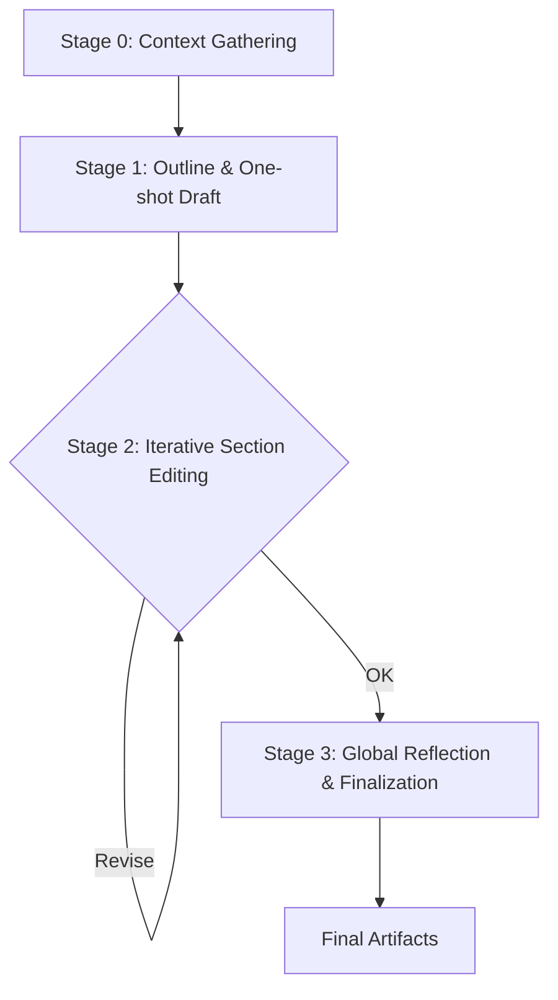

# AI Agents: Build vs. Buy
### Steerable research, reliable writing

## Introduction

In Part 1 of this course, we laid the groundwork, moving from the core distinction between structured workflows and autonomous agents to practical patterns like Retrieval-Augmented Generation (RAG) and ReAct. You learned how to engineer context, enforce structured outputs, and give Large Language Models (LLMs) the ability to use tools. These are the foundational building blocks of AI engineering.

Now, in Part 2, we shift from theory to practice. This lesson scopes and designs the central project you will build over the next ten lessons: a system of two specialized AI agents that collaborate to produce a publish-ready technical article. We will introduce Nova, an adaptable, steerable research agent implemented with the Model Context Protocol (MCP) and FastMCP. Nova focuses on automatic context ingestion from diverse sources like web pages, GitHub repositories, YouTube transcripts, and local files. It also runs iterative research rounds with Perplexity.

Alongside Nova, we will design Brown, a reliable writing workflow implemented with LangGraph. Brown emphasizes determinism, statefulness, and auditability, using writing profiles and reflection scores to reduce the "AI slop" effect. This lesson covers the high-level architecture, reasoning, and tradeoffs for building this production-minded system, including a build-vs-buy analysis and where human-in-the-loop fits into each agent's process.

This comprehensive design wasn't obvious from the start; it emerged from a classic engineering scar. When we first prototyped this project, we tried to build a single, monolithic system for both research and writing. That attempt failed. Tuning the system for open-ended, exploratory research made the writing process brittle and unpredictable. Conversely, tuning for deterministic, high-quality drafting killed its ability to explore and adapt.

After several painful iterations, we split the system in two. This decision provides clear mental models for when to prefer steerable agents for exploration and reliable workflows for quality. It also shows you how to integrate external tools without ballooning token costs and how to design for essential features like pause/resume, monitoring, and auditability. This lesson explains the reasoning behind that split, helping you future-proof your AI engineering decisions by focusing on core concepts and problem-fit, rather than chasing a single framework "winner" in a fast-moving ecosystem.

## The Build vs. Buy Trade-off: Why Not Just Use Off-the-Shelf Tools?

Before writing a single line of code for a custom AI system, you have to answer a question: should you build this at all? Off-the-shelf "deep research" tools from OpenAI, Google, and Perplexity are fast, polished, and convenient. For many use cases, they are the right answer. But they were not for us.

The core problem we aimed to solve was transforming a simple article guideline into in-depth research and then into a structured technical article that reflected a specific, opinionated style. This went beyond what off-the-shelf tools could offer. While fast and convenient for many tasks, these tools lacked the granular control we needed.

We required a system that was controllable, customizable, and deeply integrated into our existing processes. This meant the ability to change research topics mid-stream, approve subsequent search queries, and weave in context from diverse sources like local files, GitHub repositories, and YouTube transcripts. Such dynamic interaction and specialized data ingestion are often cumbersome or impossible with turnkey solutions.

Beyond research, we also needed a deterministic writing process. This included features like style gates, reflection scores, and auditable checkpoints to guarantee consistent quality and adherence to our specific writing profile. Off-the-shelf tools, optimized for general use, could not reliably provide this level of precision or integration with our continuous integration/continuous delivery (CI/CD) pipeline.

This led us to adopt a hybrid strategy. We chose to acquire commodity capabilities where they excel, such as using Perplexity’s API for its real-time, web-scale search capabilities. Perplexity's API provides up-to-date, cited information, which is essential for multi-round research cycles. However, we built the custom orchestration, policies, and quality guarantees that were missing from these off-the-shelf offerings. We are not rebuilding robust web scrapers or transcription services; instead, we integrate and use what is readily available, focusing our development efforts only where we require precise control and customization.

Table 1 summarizes the specific limitations we encountered that guided our decision.

| Capability | Off-the-Shelf Tool Limitation | Our Custom System’s Advantage |
| :--- | :--- | :--- |
| **Custom Structure** | We could not programmatically require specific sections, layouts, or the generation of Mermaid diagrams. | Enforceable contracts with required sections, diagrams, or tables are baked directly into the workflow. |
| **Stylistic Control** | There was no reliable way to ban "AI slop" or automatically enforce our personal writing profile. | An automated "style judge" node enforces tone, bans overused terms, and triggers revision loops. |
| **Planning Heuristics** | We needed to prioritize academic sources over blogs, but the tools did not let us inject that rule. | Custom heuristics and evaluation criteria steer research toward higher-quality, more authoritative sources. |
| **Integration Contract** | Piping the output into a CI/CD pipeline was brittle; there was no versioned, structured contract for the output. | Structured JSON schemas govern handoffs, enabling replay, testing, and long-term maintainability. |
| **Context Ingestion** | Most tools rely on manual source uploads, which slows down iteration and is not scalable. | Automated ingestion of URLs, repositories, and local files removes the manual bottleneck. |

Table 1: Build vs. Buy Comparison for a Custom Research & Writing System

These limitations were not hypothetical; each one was a real blocker we encountered during development. The inability to enforce our house style meant wasting hours manually removing clichés like “in today’s fast-paced world” or generic "AI slop" that eroded our content's authenticity. Off-the-shelf tools simply did not offer the granular stylistic control needed to ban specific terms or enforce our unique writing profile.

Similarly, the lack of automated context ingestion at scale meant we were stuck in a repetitive cycle of curating links and manually uploading files, which slowed down our iteration speed. Our system needed to automatically discover and normalize context from various sources without manual intervention. This automation removed a major bottleneck, allowing our agents to operate more efficiently. This need for granular control became especially clear when we tackled the writing process, where the generic output of LLMs presents a significant challenge.

## Why LLMs Still Struggle at Writing (and How to Fix It Manually)

LLMs quickly proved useful for writing tasks like drafting emails or summarizing text. However, their shortcomings become most apparent in these same areas. We have all seen the generic voice, the verbosity, the hedging, formulaic openings and closings, and that unmistakable "AI sound." This is the language of lines you have probably encountered countless times: "It is not just about X - it is about Y," which adds words but no real substance.

This is not just a minor annoyance; it is a systemic issue that impacts the authenticity and credibility of content. After the public release of models like ChatGPT, we observed a noticeable increase in certain stylistic words across professional and scientific writing. Analyses of the PubMed database show a spike in terms like "meticulous," "commendable," and "intricate" starting in 2023, consistent with widespread LLM-assisted drafting [[1]](https://www.medrxiv.org/content/10.1101/2024.05.14.24307373v2.full), [[2]](https://arxiv.org/abs/2412.11385). The word "delve" saw its usage frequency increase by over 650% between 2020 and 2023 [[1]](https://www.medrxiv.org/content/10.1101/2024.05.14.24307373v2.full).

A plausible cause for this phenomenon is the reinforcement learning feedback loop. Preference tuning rewards outputs that human raters "like." If a significant share of these raters favor a certain formal, slightly verbose phrasing, then the model learns to overvalue and produce that register more often. When millions of users then copy this AI-authored phrasing, the style feeds back into the public web and scientific corpora, amplifying the loop. The result is **AI slop**: language that feels synthetic because it optimizes for average likability, not an authentic human voice.

We treat these stylistic tells as bugs that need to be caught and eliminated. Our writing workflow is designed to enforce precision over puffery and to prioritize narrative over needless lists. Beyond just banning words, we enforce strict rules for mechanics and structure to ensure high-quality output. Our system will actively ban specific markers of AI slop, such as 'leverage,' 'harness,' 'navigate,' 'tapestry,' 'endeavour,' and 'pivotal,' along with formulaic phrases.

We also enforce:
*   **Mechanics:** Active voice, domain-appropriate abbreviations, and specific targets for sentence and paragraph length, along with consistent tense.
*   **Structure:** Proper code block formatting, correct placement of figures, and reliable rendering of diagrams.
*   **Media:** Using media as input context during generation (like figures or transcripts) and emitting media (such as diagrams) as part of the final output.
*   **App Layer:** The final output is more than just text. We rely on an application layer to render media, package all artifacts, and integrate with our website or CI/CD pipeline.

The takeaway is clear: if you do not actively constrain an LLM’s style, you will get statistically safe, generic language. To achieve high-quality output that truly reflects your voice, you have to be prescriptive and deliberate. Here are the manual best practices that work today, which our system will automate to ensure consistency and quality:
*   **Don’t outsource your thinking:** Always bring your own outline, angle, and expertise to the table first.
*   **Front-load context:** Attach all source documents and data, and strictly forbid external speculation by the model.
*   **Be prescriptive:** Specify the audience, tone, desired length, overall structure, a list of banned words, allowed jargon, and precise formatting rules.
*   **Combat verbosity:** Enforce word economy and aim for a high insight-per-sentence ratio.
*   **Maintain an anti-slop list:** Keep a running ban list of overused AI tells.
*   **Iterate deliberately:** Ask for specific revisions, not just generic "edits," as models often summarize instead of truly improving.
*   **Use cross-model critique:** Have one model critique another’s draft to spot unsupported claims and stylistic slop.
*   **Relentless fact-checking:** Demand citations, spot-check key claims, and verify dates rigorously.

These tactics are effective but repetitive and painful to implement manually. That is why we are building a system to automate them.

## Two Agents, Two Philosophies (MCP vs. LangGraph)

You rarely design a perfect system on day one. Our initial plan was to build everything using a single framework, but we quickly learned that a "one-framework-for-everything" approach was not effective. The problem shapes diverged, and so did our tools. The split is not about which framework is "better," but which is the right fit for the job.

Our **research agent** prioritizes steerability. We first tried building it as a LangGraph workflow, but testing revealed that research is a highly interactive process that needs flexibility to pause, accept user feedback, and run tools in parallel. We shifted to a **Model Context Protocol (MCP)** server that exposes a set of tools and a single prompt describing the "agentic recipe" for research [[3]](https://www.solo.io/topics/ai-infrastructure/what-is-mcp), [[4]](https://en.wikipedia.org/wiki/Model_Context_Protocol), [[5]](https://www.cloudflare.com/it-it/learning/ai/what-is-model-context-protocol-mcp/). This open standard provides a universal, model-agnostic interface for connecting LLMs to external tools and data sources. Its client-server architecture allows our agent to discover tools at runtime, follow the workflow, and pause for human-in-the-loop (HITL) feedback at predefined gates [[6]](https://www.descope.com/learn/post/mcp), [[7]](https://developers.openai.com/apps-sdk/concepts/mcp-server/). This approach focuses on active control and risk mitigation, enabling real-time intervention to guide the agent's actions [[8]](https://www.permit.io/blog/human-in-the-loop-for-ai-agents-best-practices-frameworks-use-cases-and-demo), [[9]](https://www.zenml.io/blog/steerable-deep-research-building-production-ready-agentic-workflows-with-controlled-autonomy).

Our **writing agent** prioritizes reliability. For this task, which demands auditability and durability, LangGraph was a good fit. LangGraph is a low-level orchestration framework for building and deploying long-running, stateful agents [[10]](https://langchain-ai.github.io/langgraph/), [[11]](https://docs.langchain.com/oss/python/langgraph/overview). It manages a multi-stage state machine—outline, draft, reflection loops, and refinement—allowing for state persistence, explicit evaluation rules, and self-critique loops to fix stylistic defects [[12]](https://activewizards.com/blog/a-deep-dive-into-langgraph-for-self-correcting-ai-agents), [[13]](https://cognitiveclass.ai/courses/build-a-self-reflective-deep-research-agent-using-langgraph). For reliable workflows, HITL ensures process integrity and compliance, acting as a safety net to prevent errors [[14]](https://orkes.io/blog/human-in-the-loop/). LangGraph's graph-based structure supports the cyclical processes and conditional branching essential for these iterative refinement loops [[15]](https://www.ema.co/additional-blogs/addition-blogs/building-ai-agents-langgraph).

The key takeaway is clear: when the process is exploratory and unpredictable, choose steerable agents. When the process is well-defined and long-running, choose stateful workflows with checkpoints and monitoring. This split lets us specialize: the research agent maximizes adaptation, while the writing agent maximizes consistency and quality.

## Agents Design

With the high-level philosophy established, let's look at the concrete architecture. We organize the entire system around a central handoff artifact: the `research.md` file. The research agent produces it, and the writing agent consumes it.

```mermaid
graph TD
    subgraph System Architecture
        A[Article Guideline.md] --> B{Research Agent (MCP)};
        B --> C[research.md];
        A --> D{Writing Agent (LangGraph)};
        C --> D;
        E[Writing Profiles] --> D;
        D --> F[Final Article + SEO + Scores];
        F --> G[App Layer];
    end
```
Figure 1: High-level architecture of the two-agent system.

### Research Agent (Nova)
Nova focuses on flexible, steerable research. It takes a guideline file and produces a comprehensive research document.

*   **Inputs:** An `article_guideline.md` file containing the topic, audience, outline, and candidate sources.
*   **Outputs:** A `research.md` file with curated notes, citations, and collapsible sections.

A single MCP prompt defines the agent's entire workflow, acting as an "agentic recipe" [[16]](https://stytch.com/blog/model-context-protocol-introduction/), [[17]](https://modelcontextprotocol.info/docs/), [[18]](https://modelcontextprotocol.io/specification/latest), [[19]](https://cloud.google.com/discover/what-is-model-context-protocol). This makes the process transparent and allows any MCP-compatible client to execute the research. The workflow consists of six main stages:

```mermaid
graph TD
    A[1. Setup & Extract URLs] --> B(2. Parallel Processing);
    subgraph 2. Parallel Processing
        B1[Local Files]
        B2[Scrape URLs]
        B3[Process GitHub Repos]
        B4[Transcribe YouTube Videos]
    end
    B --> C{3. Research Loop (3 Rounds)};
    C -- Queries --> P1[Perplexity API];
    P1 -- Results --> C;
    C --> D[4. Quality Filtering];
    D --> E[5. Selective Full Scrapes];
    E --> F[6. Create Final research.md];
```
Figure 2: Workflow of the Nova research agent.

1.  **Setup:** The agent explains its workflow and extracts all source references (URLs, local files) from the guideline.
2.  **Parallel Processing:** It processes all initial sources simultaneously—copying local files, scraping web pages, summarizing GitHub repositories, and transcribing YouTube videos.
3.  **Research Loop (3 Rounds):** It analyzes the existing material to identify knowledge gaps, generates new search queries, and uses the Perplexity API to find answers [[20]](https://zuplo.com/learning-center/perplexity-api), [[21]](https://www.perplexity.ai/hub/blog/introducing-the-perplexity-search-api), [[22]](https://www.perplexity.ai/help-center/en/articles/10352995-api-settings), [[23]](https://www.perplexity.ai/hub/blog/introducing-the-sonar-pro-api), [[24]](https://docs.perplexity.ai).
4.  **Quality Filtering:** The agent automatically evaluates all sources for trustworthiness and relevance, keeping only the high-quality ones.
5.  **Selective Full Scrapes:** It identifies up to five of the most authoritative sources and performs a deep scrape of their full content.
6.  **Final Research File:** The agent consolidates all curated materials into the final `research.md` file.

A key feature is its **Critical Failure Policy:** if any tool fails completely (e.g., 0 out of 7 URLs scraped), the agent stops immediately and asks for human guidance. This prevents silent failures and ensures data integrity.

### Writing Agent (Brown)
While Nova handles exploratory research, Brown manages the structured and reliable process of drafting the article. Brown implements its workflow in LangGraph, making it deterministic, stateful, and auditable [[25]](https://docs.aws.amazon.com/prescriptive-guidance/latest/agentic-ai-frameworks/langchain-langgraph.html), [[26]](https://langchain-ai.github.io/langgraph/concepts/why-langgraph/), [[27]](https://www.langchain.com/langgraph), [[28]](https://www.ibm.com/think/tutorials/build-agentic-workflows-langgraph-granite), [[29]](https://duplocloud.com/blog/langchain-vs-langgraph/), [[30]](https://docs.langchain.com/langgraph-platform/faq), [[31]](https://blog.langchain.com/how-to-think-about-agent-frameworks/).

*   **Inputs:** The `article_guideline.md`, the `research.md` file from Nova, and writing profiles.
*   **Outputs:** The final `article.md`, SEO metadata, reflection scores, and other artifacts.

The workflow is a state machine that moves the article through distinct stages, from initial context gathering to finalization.


Figure 3: Workflow of the Brown writing agent.

*   **Stage 0 - Context Gathering:** Parse all inputs.
*   **Stage 1 - Outline and One-shot Draft:** Plan the article structure and generate a complete first draft.
*   **Stage 2 - Iterative Section Editing Loop:** Score each section against predefined quality and style rules. If a section fails, a reflection step identifies the issue, and the section is revised. This loop continues until quality targets are met [[32]](https://learnopencv.com/langgraph-self-correcting-agent-code-generation/), [[33]](https://blog.langchain.com/agentic-rag-with-langgraph/), [[34]](https://www.truefoundry.com/blog/langchain-vs-langgraph).
*   **Stage 3 - Global Reflection and Finalization:** Apply global edits for consistency, generate the title and SEO metadata, and save all final artifacts.

For example, if the guideline says, "Explain MCP prompts," the research agent extracts links to MCP documentation, finds more sources via Perplexity, and compiles everything into `research.md`. The writing agent then takes that research, drafts the section, runs it through the style-check loop, and emits the final text along with a Mermaid diagram block, which our app layer then renders.

## Conclusion

We designed this system around a core philosophy: use steerability for exploration and reliability for quality. This split between a research agent and a writing workflow clarifies responsibilities, reduces unintended coupling, and makes the entire process more robust. This approach helps us future-proof our AI engineering decisions by focusing on core concepts and problem-fit, rather than chasing a single framework "winner" in a fast-moving ecosystem.

This clear division also sets the stage for Part 3 of the course, where we will dive into evaluation and observability. Because each agent produces inspectable artifacts, such as the `research.md` file and detailed reflection scores, we can easily apply metrics, trace behavior, and audit the results. This ensures our agent system is not just functional, but also reliable and transparent. The entire loop, from initial inputs through human-in-the-loop agenting to polished outputs, is completed by automatic context ingestion and a dedicated application layer for media.

This lesson provided the high-level design and the core reasoning behind our choices. In the upcoming lessons, we will move from design to implementation. Lesson 13 will offer a deep dive into the frameworks, comparing MCP and LangGraph and justifying our choices in greater detail. Then, from Lessons 15 to 22, we will walk through the complete, hands-on implementation of both the research and writing agents, turning this design into a functional, production-minded system.

## References

- [1] [Delving into PubMed Records: Some Terms in Medical Writing Have Drastically Changed after the Arrival of ChatGPT](https://www.medrxiv.org/content/10.1101/2024.05.14.24307373v2.full)
- [2] [Why Does ChatGPT "Delve" So Much? Exploring the Sources of Lexical Overrepresentation in Large Language Models](https://arxiv.org/abs/2412.11385)
- [3] [What is the Model-Context Protocol (MCP) and how does it facilitate steerable, human-in-the-loop AI agent workflows?](https://www.solo.io/topics/ai-infrastructure/what-is-mcp)
- [4] [Model Context Protocol](https://en.wikipedia.org/wiki/Model_Context_Protocol)
- [5] [What is the Model Context Protocol (MCP) and how does it facilitate steerable, human-in-the-loop AI agent workflows?](https://www.cloudflare.com/it-it/learning/ai/what-is-model-context-protocol-mcp/)
- [6] [What is the Model Context Protocol (MCP)?](https://www.descope.com/learn/post/mcp)
- [7] [MCP Server](https://developers.openai.com/apps-sdk/concepts/mcp-server/)
- [8] [Human-in-the-Loop for AI Agents: Best Practices, Frameworks, Use Cases, and Demo](https://www.permit.io/blog/human-in-the-loop-for-ai-agents-best-practices-frameworks-use-cases-and-demo)
- [9] [Steerable Deep Research: Building Production-Ready Agentic Workflows with Controlled Autonomy](https://www.zenml.io/blog/steerable-deep-research-building-production-ready-agentic-workflows-with-controlled-autonomy)
- [10] [LangGraph](https://langchain-ai.github.io/langgraph/)
- [11] [Overview](https://docs.langchain.com/oss/python/langgraph/overview)
- [12] [A Deep Dive into LangGraph for Self-Correcting AI Agents](https://activewizards.com/blog/a-deep-dive-into-langgraph-for-self-correcting-ai-agents)
- [13] [Build a Self-Reflective Deep Research Agent using LangGraph](https://cognitiveclass.ai/courses/build-a-self-reflective-deep-research-agent-using-langgraph)
- [14] [Human in the Loop Workflows](https://orkes.io/blog/human-in-the-loop/)
- [15] [Building AI Agents with LangGraph](https://www.ema.co/additional-blogs/addition-blogs/building-ai-agents-langgraph)
- [16] [What is the Model Context Protocol (MCP)? An introduction](https://stytch.com/blog/model-context-protocol-introduction/)
- [17] [Model Context Protocol Docs](https://modelcontextprotocol.info/docs/)
- [18] [Model Context Protocol Specification](https://modelcontextprotocol.io/specification/latest)
- [19] [What is Model Context Protocol (MCP)?](https://cloud.google.com/discover/what-is-model-context-protocol)
- [20] [How to use the Perplexity API](https://zuplo.com/learning-center/perplexity-api)
- [21] [Introducing the Perplexity Search API: Real-time, Factual Answers from the Web](https://www.perplexity.ai/hub/blog/introducing-the-perplexity-search-api)
- [22] [API Settings](https://www.perplexity.ai/help-center/en/articles/10352995-api-settings)
- [23] [Introducing the Sonar Pro API: Our Most Advanced Model for Generative Search](https://www.perplexity.ai/hub/blog/introducing-the-sonar-pro-api)
- [24] [Perplexity API Documentation](https://docs.perplexity.ai)
- [25] [Agentic AI frameworks for building generative AI applications on AWS](https://docs.aws.amazon.com/prescriptive-guidance/latest/agentic-ai-frameworks/langchain-langgraph.html)
- [26] [Why LangGraph?](https://langchain-ai.github.io/langgraph/concepts/why-langgraph/)
- [27] [LangGraph by LangChain](https://www.langchain.com/langgraph)
- [28] [Build intelligent, agentic workflows with LangGraph and Granite](https://www.ibm.com/think/tutorials/build-agentic-workflows-langgraph-granite)
- [29] [LangChain vs. LangGraph: What's the Difference?](https://duplocloud.com/blog/langchain-vs-langgraph/)
- [30] [Frequently Asked Questions](https://docs.langchain.com/langgraph-platform/faq)
- [31] [How to think about Agent Frameworks](https://blog.langchain.com/how-to-think-about-agent-frameworks/)
- [32] [LangGraph: Building a Self-Correcting Agent for Code Generation](https://learnopencv.com/langgraph-self-correcting-agent-code-generation/)
- [33] [Agentic RAG with LangGraph](https://blog.langchain.com/agentic-rag-with-langgraph/)
- [34] [LangChain vs LangGraph: A Comprehensive Comparison](https://www.truefoundry.com/blog/langchain-vs-langgraph)