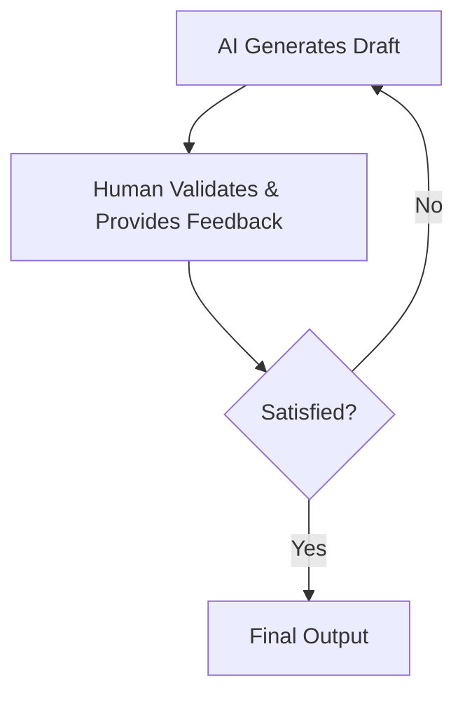

# Human-in-the-Loop for AI Writing Workflows
### How to build editing workflows that combine human expertise with AI automation for a coding-like writing experience.

In the last few lessons, we designed and built Brown, our AI writing workflow. We started in Lesson 22 by laying the foundations, applying the orchestrator-worker pattern to generate media items and using context engineering to produce high-quality articles. In Lesson 23, we introduced the evaluator-optimizer pattern to automatically review and edit the generated content, enforcing adherence to our requirements.

After generating an article, you will likely want to refine it further. Writing is subjective, and even the best AI-generated content benefits from human review. The perfect balance is to use AI to generate and automate the grunt work, then have you, as the domain expert, review and refine it. This lesson will show you exactly how to build this collaborative loop.

By the end of this lesson, you will know how to:
- Understand the AI generation/human validation loop and why it matters for building practical AI apps
- Introduce human feedback into the article reviewer node
- Implement two new editing workflows: edit article and edit selected text
- Serve Brown as an MCP server with tools, prompts, and resources
- Integrate Brown with MCP clients like Cursor for a coding-like writing experience

## Understanding the AI Generation Human Validation Loop

AI-generated results are imperfect. LLMs can hallucinate, display "jagged intelligence" by being superhuman at one task and failing at a simpler one, and make mistakes no human would [[1]](https://www.youtube.com/shorts/lZZZjaQepHI). This creates the need for a balance between AI output and human input. You must cooperate with the AI, where you do most of the thinking while delegating the monotonous work to the AI. Your role is to plan, give instructions, and validate the AI’s output, not to delegate the thinking itself.

This balance is best described as the AI generation/human validation loop. It is a simple, iterative process:
1. The AI generates a draft.
2. A human validates it and provides feedback.
3. This loop repeats until the human decides the output is good enough.

Andrej Karpathy argues that the goal is to make this loop spin as fast as possible to maximize productivity [[2]](https://www.latent.space/p/s3), [[3]](https://catalaize.substack.com/p/andrej-karpathy-software-is-changing). He outlines two key strategies for this.

```mermaid
graph TD
    subgraph "Application Reliability (Y-axis)"
        direction TD
        
        subgraph "Higher"
            direction LR
            A["Workflow (Lower Control)"]
        end
        
        B[""]
        C[""]
        
        subgraph "Lower"
            direction LR
            D["Autonomous agent (Higher Control)"]
        end
        
        A --> B
        B --> C
        C --> D
    end
```
Image 1: Inverse relationship between an AI agent's level of control and application reliability. (Source: Decoding ML)

First, you must speed up verification. Application-specific Graphical User Interfaces (GUI) help humans audit AI work faster by using visual representations. For example, showing code diffs in red and green reduces cognitive load compared to reading raw text. Direct actions, like accepting or rejecting changes with a simple command, are far more efficient than typing out new instructions [[2]](https://www.latent.space/p/s3).

Second, you need to keep the AI on a tight leash. An AI can be overreactive; receiving a 10,000-line code diff is not useful because a human must still verify it. It is better to work in small, incremental chunks focused on a "single concrete thing" and use concrete prompts to increase the probability of a successful verification. Using auditable intermediate artifacts, like a course syllabus, also helps constrain the AI and prevent it from getting "lost in the woods" [[3]](https://catalaize.substack.com/p/andrej-karpathy-software-is-changing).

This connects directly to the autonomy slider we discussed in Lesson 2. As you give an application more autonomy, you reduce the need for human intervention. Karpathy suggests building products that are "less Iron Man robots and more Iron Man suits," focusing on human augmentation rather than full autonomy [[2]](https://www.latent.space/p/s3).


Image 2: A flowchart illustrating the iterative AI generation and human validation loop. (Source: Decoding ML)

## Adding Human-In-The-Loop In Our Writing Workflow

Now that we have the generation step from Lessons 22 and 23, how do we introduce a human into the loop? We need a way for a human to review the generated article, validate it, and provide further instructions for improvement.

Writing an article is similar to writing code. As engineers, this parallel was obvious to us. We decided to introduce the human-in-the-loop much like AI-powered IDEs such as Cursor do: you specify what you want, pass that feedback to the AI, and the AI returns the changes as a diff between the old and new versions [[4]](https://cursor.com/docs/agent/overview).

Our solution was to implement two new editing workflows that apply the evaluator-optimizer pattern with human feedback:
1.  **Edit Article Workflow**: Reviews and edits the entire article.
2.  **Edit Selected Text Workflow**: Reviews and edits only a specific portion of the article.

These workflows accept human feedback, which is plugged directly into the review process. We instructed the evaluator-optimizer loop to always prioritize this human feedback over all other criteria.

To enable this flexible approach, we decoupled the article generation workflow from the editing workflows using MCP servers. The `generate_article`, `edit_article`, and `edit_selected_text` workflows are each exposed as independent MCP tools. This architecture allows you to generate an article, review it, and then selectively apply editing workflows with your feedback until you are satisfied.

https://raw.githubusercontent.com/iusztinpaul/agentic-ai-engineering-course-data/main/images/l24_writing_workflow.png
Image 3: A flowchart illustrating the Brown writing workflow with human-in-the-loop, showing three independent MCP tools and a human feedback loop. (Source: [https://raw.githubusercontent.com/iusztinpaul/agentic-ai-engineering-course-data/main/images/l24_writing_workflow.png](https://raw.githubusercontent.com/iusztinpaul/agentic-ai-engineering-course-data/main/images/l24_writing_workflow.png))

Editing the entire article can be an overreaction, as it might make changes where you do not want any. This is why we also implemented the `edit_selected_text` workflow. It allows you to apply the same logic but only to a selected portion of the text, giving you precise control.

Now that we understand the overall design, let's see how we introduced human feedback into the article reviewer.

## Introducing Human Feedback Into the Article Reviewer

This section explains how we added human feedback support to our `ArticleReviewer` node. We will start with the `HumanFeedback` entity, show how it is integrated into the node, and walk through a working example.

1.  The `HumanFeedback` entity is a Pydantic model that encapsulates human feedback. It contains a `content` field and a `to_context()` method that wraps the content in XML tags for the LLM.

    ```python
    class HumanFeedback(BaseModel, ContextMixin):
        content: str
    
        def to_context(self) -> str:
            return f"""
    <{self.xml_tag}>
        {self.content}
    </{self.xml_tag}>
    """
    ```

2.  The `ArticleReviewer` class was updated to accept an optional `human_feedback` parameter in its `__init__` method. This allows the reviewer to work with or without human input.

    ```python
    def __init__(
        self,
        to_review: Article | SelectedText,
        article_guideline: ArticleGuideline,
        model: Runnable,
        article_profiles: ArticleProfiles,
        human_feedback: HumanFeedback | None = None,
    ) -> None:
        self.to_review = to_review
        self.article_guideline = article_guideline
        self.article_profiles = article_profiles
        self.human_feedback = human_feedback
    
        super().__init__(model, toolkit=Toolkit(tools=[]))
    ```

3.  The system prompt for the reviewer now includes a dedicated section for human feedback. It instructs the LLM to use the feedback to guide its review process and extract one or more action points. Each action point becomes a review with `profile="human_feedback"`.

    ```python
    system_prompt_template = """
    You are Brown, an expert article writer, editor and reviewer specialized in reviewing technical, educative and informational articles.
    
    ...
    
    ## Human Feedback
    
    Along with the expected requirements, a human already reviewed the article and provided the following feedback:
    
    {human_feedback}
    
    If empty, completely ignore it, otherwise the feedback will ALWAYS be used in two ways:
    1. First you will use the <human_feedback> to guide your reviewing process against the requirements. This will help you understand 
    on what rules to focus on as this directly highlights what the user wants to improve.
    2. Secondly you will extract one or more action points based on the <human_feedback>. Depending on how many ideas, topics or suggestions 
    the <human_feedback> contains you will generate from 1 to N action points. Each <human_feedback> review will contain a single action point. 
    3. As long the <human_feedback> is not empty, you will always return at least 1 action point, but you will return more action points 
    if the feedback touches multiple ideas. 
    
    Here is an example of a reviewed based on the human feedback:
    <example_of_human_feedback_action_point>
    Review(
        profile="human_feedback",
        location="Article level",
        comment="Add all the points from the article guideline to the article."
    )
    </example_of_human_feedback_action_point>
    
    ...
    """
    ```

4.  When the reviewer's `ainvoke` method is called, it injects the human feedback into the system prompt. If feedback is provided, it is converted to its XML context format; otherwise, an empty string is used.

    ```python
    async def ainvoke(self) -> ArticleReviews | SelectedTextReviews:
        system_prompt = self.system_prompt_template.format(
            human_feedback=self.human_feedback.to_context() if self.human_feedback else "",
            ...
        )
        ...
    ```

5.  Let's see a practical example. We start by loading our sample article, guideline, and profiles.

    ```python
    pretty_print.wrapped("STEP 1: Loading Context", width=100)
    
    # Load guideline
    guideline_loader = MarkdownArticleGuidelineLoader(uri=Path("article_guideline.md"))
    article_guideline = guideline_loader.load(working_uri=SAMPLE_DIR)
    
    # Load profiles
    profiles_input = {
        "article": PROFILES_DIR / "article_profile.md",
        "character": PROFILES_DIR / "character_profiles" / "paul_iusztin.md",
        "mechanics": PROFILES_DIR / "mechanics_profile.md",
        "structure": PROFILES_DIR / "structure_profile.md",
        "terminology": PROFILES_DIR / "terminology_profile.md",
        "tonality": PROFILES_DIR / "tonality_profile.md",
    }
    profiles_loader = MarkdownArticleProfilesLoader(uri=profiles_input)
    profiles = profiles_loader.load()
    
    # Load examples
    examples_loader = MarkdownArticleExampleLoader(uri=EXAMPLES_DIR)
    article_examples = examples_loader.load()
    
    article_loader = MarkdownArticleLoader(uri="article.md")
    article = article_loader.load(working_uri=SAMPLE_DIR)
    ```

    It outputs:
    ```text
    ----------------------------------------------------------------------------------------------------
    STEP 1: Loading Context
    ----------------------------------------------------------------------------------------------------
    ✓ Guideline: 6,751 characters
    ✓ Article: 6,982 characters
    ✓ Profiles: 6 profiles loaded
    ✓ Examples: 2 article examples
    ```
    Here is a reminder of how the article looks:
    ```text
    --------------------------------- Article (first 4000 characters) ---------------------------------
    <article>
        # Workflows vs. Agents: The Critical Decision Every AI Engineer Faces
    ### How to choose between predictable control and autonomous flexibility when building AI applications.
    
    When building AI applications, engineers face a critical architectural decision early on. Should you create a predictable, step-by-step workflow where you control every action, or build an autonomous agent that can think and decide for itself? This choice impacts everything from development time and cost to reliability and user experience. It is a fundamental decision that often determines if an AI application will be successful in production.
    
    By the end of this lesson, you will understand the fundamental differences between LLM workflows and AI agents, know when to use each, and recognize how to combine their strengths in hybrid approaches.
    
    ## Understanding the Spectrum: From Workflows to Agents
    
    To make the right choice, you first need to understand what LLM workflows and AI agents are. We will look at their core properties and how they are used, rather than their technical specifics.
    
    ### LLM Workflows
    
    An LLM workflow is a sequence of tasks orchestrated by developer-written code. It can include LLM calls, but also other operations like reading from a database or calling an API. Think of it like a recipe where each step is explicitly defined. The key characteristic is that the path is determined in advance, resulting in a deterministic or rule-based system. This gives you predictable execution, explicit control over the application's flow, and makes the system easier to test and debug. Because you control every step, you know exactly where a failure occurred and how to fix it.
    
    ```mermaid
    graph TD
        A["Start"] --> B["LLM Call"]
        B --> C["Process Data"]
        C --> D["Store Data"]
        D --> E["End"]
    ```
    Image 1: A flowchart illustrating a deterministic LLM workflow with clear start and end points, including an LLM call and data operations.
    
    ### AI Agents
    
    AI agents are systems where an LLM dynamically decides the sequence of steps, reasoning, and actions to achieve a goal. The path is not predefined. Instead, the agent uses a reasoning process to plan its actions based on the task and the current state of its environment. This process is often modeled on frameworks like ReAct (Reason, Act, Observe). This allows agents to be adaptive and capable of handling new or unexpected situations through LLM-driven autonomy. They can select tools, execute actions, evaluate the outcomes, and correct their course until the goal is achieved [[1]](https://www.youtube.com/watch?v=kQxr-uOxw2o&t=1s).
    
    ```mermaid
    graph TD
        A["Start"] --> B["Agent (LLM) Receives Goal"]
        B --> C["Plan/Reason (LLM)"]
        C --> D["Select Tool"]
        D --> E["Execute Action (Tool Call)"]
        E --> F["Observe Environment/Feedback"]
        F --> G{"Evaluate Outcome"}
        G -->|"Satisfactory"| H["Stop/Achieve Goal"]
        G -->|"Needs Adjustment"| C
    ```
    Image 2: Flowchart illustrating an AI agent's dynamic decision-making process driven by an LLM.
    
    ## Choosing Your Path
    
    The core difference between these two approaches lies in a single trade-off: developer-defined logic versus LLM-driven autonomy [[2]](https://decodingml.substack.com/p/llmops-for-production-agentic-rag), [[3]](https://towardsdatascience.com/a-developers-guide-to-building-scalable-ai-workflows-vs-agents/). Workflows offer high reliability at the cost of flexibility, while agents offer high flexibility at the cost of reliability.
    
    https://substackcdn.com/image/fetch/w_1456,c_limit,f_webp,q_auto:good,fl_progressive:steep/https%3A%2F%2Fsubstack-post-media.s3.amazonaws.com%2Fpublic%2Fimages%2F5e64d5e0-7ef1-4e7f-b441-3bf1fef4ff9a_1276x818.png 
    Image 3: The trade-off between an agent's level of control and application reliability. (Image by Iusztin, P. from [Exploring the difference between agents and workflows [2]](https://decodingml.substack.com/p/llmops-for-production-agentic-rag))
    
    ### When to use LLM workflows
    
    W
    ----------------------------------------------------------------------------------------------------
    ```

6.  Next, we create a `HumanFeedback` instance and run the `ArticleReviewer`.

    ```python
    human_feedback = HumanFeedback(
        content="""Make the introduction more engaging and catchy. 
    Also, expand on the definition of both workflows and agents from the first section"""
    )
    
    # Create the article reviewer
    model = get_model(SupportedModels.GOOGLE_GEMINI_25_FLASH)
    article_reviewer = ArticleReviewer(
        to_review=article,
        article_guideline=article_guideline,
        model=model,
        article_profiles=profiles,
        human_feedback=human_feedback,
    )
    
    print("Running article review with human feedback...")
    reviews = await article_reviewer.ainvoke()
    print(f"\nGenerated {len(reviews.reviews)} reviews")
    ```

    It outputs:
    ```text
    Running article review with human feedback...
    
    Generated 19 reviews
    ```

7.  When we examine the reviews, we find two that were generated directly from our feedback.

    ```python
    human_feedback_reviews = [r for r in reviews.reviews if r.profile == "human_feedback"]
    ```

    It outputs:
    ```text
    -------------------------------------- Human Feedback Reviews --------------------------------------
    Found 2 reviews based on human feedback
    ----------------------------------------------------------------------------------------------------
    ------------------------------------- 1. Human Feedback Review -------------------------------------
    {
        "profile": "human_feedback",
        "location": "Article level",
        "comment": "Make the introduction more engaging and catchy."
    }
    ----------------------------------------------------------------------------------------------------
    ------------------------------------- 2. Human Feedback Review -------------------------------------
    {
        "profile": "human_feedback",
        "location": "Understanding the Spectrum: From Workflows to Agents - First section",
        "comment": "Expand on the definition of both workflows and agents from the first section."
    }
    ----------------------------------------------------------------------------------------------------
    ```
    The reviewer also generates reviews based on the other profiles:
    ```text
    --------------------------------------- All Reviews Summary ---------------------------------------
    Generated reviews from 7 different profile types: article_guideline, article_profile, human_feedback, mechanics_profile, structure_profile, terminology_profile, tonality_profile
    ----------------------------------------------------------------------------------------------------
    
    ----------------------------------------------------------------------------------------------------
    ARTICLE_GUIDELINE: 7 reviews
    ----------------------------------------------------------------------------------------------------
      1. [Introduction: The Critical Decision Every AI Engineer Faces - Article level] The introduction's length is 123 words, exceeding the guideline of 100 words....
      2. [Understanding the Spectrum: From Workflows to Agents - Second paragraph] The article states 'We will look at their core properties and how they are used, rather than their t...
    
    ----------------------------------------------------------------------------------------------------
    ARTICLE_PROFILE: 3 reviews
    ----------------------------------------------------------------------------------------------------
      1. [Introduction: The Critical Decision Every AI Engineer Faces - First paragraph] The introduction, while stating the problem, is not as engaging and captivating as it could be, as h...
      2. [Introduction: The Critical Decision Every AI Engineer Faces - First paragraph] The introduction is primarily focused on the 'why' (problem) and then states 'By the end of this les...
    
    ...
    ```

The reviewer generates reviews from multiple sources: human feedback for our specific requests and profile-based reviews to ensure adherence to style guidelines. The `human_feedback` reviews create action points that the `ArticleWriter` will use to edit the article according to our instructions.

Now that we understand how human feedback integrates with the article reviewer, let's explore the `edit_article` workflow.

## Implementing the Article Editing Workflow

The `edit_article` workflow reviews and edits an existing article based on human feedback and predefined requirements. It consists of a single loop of the reviewing-editing logic we used in the `generate_article` workflow. It follows the same clean architecture, using the app layer to orchestrate nodes and entities. Because our entities and nodes are orthogonal, we can reuse them as-is; we only need to implement the glue code in the app layer to wrap them for this new business use case.

1.  The workflow is built using LangGraph's functional API. The `build_edit_article_workflow` function is a factory that creates the workflow with a checkpointer for persistence.

    ```python
    def build_edit_article_workflow(checkpointer: BaseCheckpointSaver):
        """Create an edit article workflow with checkpointer."""
        return entrypoint(checkpointer=checkpointer)(_edit_article_workflow)
    
    class EditArticleInput(TypedDict):
        dir_path: Path
        human_feedback: str
    ```

2.  The main workflow function, `_edit_article_workflow`, orchestrates the editing process. It loads the context, creates a `HumanFeedback` entity, generates reviews, edits the article based on those reviews, and finally returns the edited article along with instructions for the MCP client.

    ```python
    async def _edit_article_workflow(inputs: EditArticleInput, config: RunnableConfig) -> str:
        writer = get_stream_writer()
    
        # Progress: Loading context
        writer(WorkflowProgress(progress=0, message="Loading context").model_dump(mode="json"))
        # ... load context ...
        human_feedback = HumanFeedback(content=inputs["human_feedback"])
        writer(WorkflowProgress(progress=5, message="Loaded context").model_dump(mode="json"))
    
        # Progress: Reviewing
        writer(WorkflowProgress(progress=20, message="Reviewing article").model_dump(mode="json"))
        reviews = await generate_reviews(...)
        writer(WorkflowProgress(progress=40, message="Generated reviews").model_dump(mode="json"))
    
        # Progress: Editing
        writer(WorkflowProgress(progress=60, message="Editing article").model_dump(mode="json"))
        article = await edit_based_on_reviews(...)
        writer(WorkflowProgress(progress=80, message="Edited article").model_dump(mode="json"))
    
        # Progress: Complete
        writer(WorkflowProgress(progress=100, message="Article editing completed").model_dump(mode="json"))
    
        return f"""
    Here is the edited article:
    {article.to_context()}
    
    Here is what you have to do with the edited article:
    - print the edited article to the console for the user to see
    - give a quick summary of the changes you made
    - always apply the changes to the source file without waiting for the user to explicitly ask you to do so
    - in case you haven't changed anything, just say that you haven't changed anything
    """
    ```

3.  The `generate_reviews` task creates an `ArticleReviewer` with the article, guideline, profiles, and human feedback. It uses LangGraph's `@task` decorator with a retry policy for resilience.

    ```python
    @task(retry_policy=retry_policy)
    async def generate_reviews(...) -> ArticleReviews:
        model, _ = build_model(app_config, node="review_article")
        article_reviewer = ArticleReviewer(...)
        reviews = await article_reviewer.ainvoke()
        return cast(ArticleReviews, reviews)
    ```

4.  The `edit_based_on_reviews` task uses the `ArticleWriter` node. When provided with `reviews`, the writer operates in "editing mode," using the reviews to make specific changes rather than writing from scratch.

    ```python
    @task(retry_policy=retry_policy)
    async def edit_based_on_reviews(...) -> Article:
        model, _ = build_model(app_config, node="edit_article")
        article_writer = ArticleWriter(...)
        article = await article_writer.ainvoke()
        return cast(Article, article)
    ```

5.  Let's run the workflow. We build it with an in-memory checkpointer, configure it with a unique thread ID, and stream the events.

    ```python
    async with build_in_memory_checkpointer() as checkpointer:
        workflow = build_edit_article_workflow(checkpointer=checkpointer)
        config = {"configurable": {"thread_id": str(uuid.uuid4())}}
    
        async for event in workflow.astream(
            {
                "dir_path": SAMPLE_DIR,
                "human_feedback": """
    Make the introduction more engaging, catchy and shorter. 
    Also, expand on the definition of both workflows and agents from the first section""",
            },
            config=config,
            stream_mode=["custom", "values"],
        ):
            # ... handle events ...
    ```

    The workflow reports its progress and returns the final edited article. This demonstrates a key advantage of our architecture: we can use fewer review loops during initial generation to make it faster and cheaper, and then run additional, targeted review cycles guided by your feedback. You can repeat this process until you are satisfied with the result.

While editing the entire article is useful, you will often want to refine just a specific section. Let's explore the `edit_selected_text` workflow next.

## Implementing the Selected Text Editing Workflow

The `edit_selected_text` workflow enables precise, focused edits on selected portions of text. Its structure is almost identical to `edit_article`, but it operates on a `SelectedText` entity instead of a full `Article`. This avoids overreacting when we know exactly what and where we want to edit, making the process faster, cheaper, and easier to validate.

1.  The workflow builder follows the same pattern. The input, `EditSelectedTextInput`, includes the directory path, human feedback, the selected text, and its starting and ending line numbers to locate it within the full article.

    ```python
    def build_edit_selected_text_workflow(checkpointer: BaseCheckpointSaver):
        """Create an edit selected text workflow with checkpointer."""
        return entrypoint(checkpointer=checkpointer)(_edit_selected_text_workflow)
    
    class EditSelectedTextInput(TypedDict):
        dir_path: Path
        human_feedback: str
        selected_text: str
        number_line_before_selected_text: int
        number_line_after_selected_text: int
    ```

2.  The main workflow function, `_edit_selected_text_workflow`, is also similar. It loads the full article context, but then creates a `SelectedText` entity that contains the selected portion, the full article for context, and the line numbers. The review and edit steps then operate on this `SelectedText` object.

    ```python
    async def _edit_selected_text_workflow(inputs: EditSelectedTextInput, config: RunnableConfig) -> str:
        # ... load context ...
        selected_text = SelectedText(
            article=context["article"],
            content=inputs["selected_text"],
            first_line_number=inputs["number_line_before_selected_text"],
            last_line_number=inputs["number_line_after_selected_text"],
        )
        # ... generate reviews for selected_text ...
        # ... edit selected_text based on reviews ...
        return f"""
    Here is the edited selected text:
    {selected_text.to_context()}
    ...
    """
    ```

3.  The `generate_reviews` task for selected text is nearly identical to the article version. The `ArticleReviewer` node is smart enough to handle both cases. When given a `SelectedText` object, it focuses its reviews on that portion while using the full article as context.

    ```python
    @task(retry_policy=retry_policy)
    async def generate_reviews(...) -> SelectedTextReviews:
        # ... creates ArticleReviewer with to_review=selected_text ...
        reviews = await selected_text_reviewer.ainvoke()
        return cast(SelectedTextReviews, reviews)
    ```

4.  Similarly, the `edit_based_on_reviews` task uses the same `ArticleWriter` node, which seamlessly handles both full article and selected text editing.

    ```python
    @task(retry_policy=retry_policy)
    async def edit_based_on_reviews(...) -> SelectedText:
        # ... creates ArticleWriter with reviews=SelectedTextReviews ...
        edited_selected_text = cast(SelectedText, await article_writer.ainvoke())
        return edited_selected_text
    ```

5.  This workflow is important because most of the time, we do not want to edit the whole article, but just a small section. It enables faster, cheaper, and more precise changes, giving you better control over the editing process.

6.  Let's run the workflow. First, we extract a portion of the sample article to edit.

    ```python
    article = MarkdownArticleLoader(uri="article.md").load(working_uri=SAMPLE_DIR)
    
    start_line = 8
    end_line = 42
    selected_text = "\n".join(article.content.split("\n")[start_line:end_line])
    ```

7.  Then, we call the workflow with the selected text and human feedback.

    ```python
    async with build_in_memory_checkpointer() as checkpointer:
        workflow = build_edit_selected_text_workflow(checkpointer=checkpointer)
        config = {"configurable": {"thread_id": str(uuid.uuid4())}}
    
        async for event in workflow.astream(
            {
                "dir_path": SAMPLE_DIR,
                "human_feedback": "Expand on the definition of both workflows and agents.",
                "selected_text": selected_text,
                "number_line_before_selected_text": start_line,
                "number_line_after_selected_text": end_line,
            },
            config=config,
            stream_mode=["custom", "values"],
        ):
            # ... handle events ...
    ```

    It outputs the edited text within a `<selected_text>` XML block, ready to be applied back to the original document.

Now that we have both editing workflows implemented, let's see how to serve them as an MCP server for integration with tools like Cursor.

## Serving Brown as an MCP Server

All our MCP code lives in the `brown.mcp` module, keeping the serving layer separate from the domain, app, and infrastructure layers. This allows us to potentially serve Brown through different interfaces, like a CLI or FastAPI, without changing the core logic. We covered MCP concepts in detail in the Nova research agent lessons, so here we will jump straight into the implementation.

We will serve Brown as an MCP server with three tools, three prompts, and two resources.

[Image placeholder: Screenshot of Brown integrated with Cursor]
Image 4: Brown's tools and prompts appearing inside the Cursor AI assistant.

1.  The MCP server is initialized using FastMCP. We define three tools: `generate_article`, `edit_article`, and `edit_selected_text`. Each tool builds the appropriate workflow, creates a unique thread ID, and streams progress updates to the MCP client. The detailed pydocs and function signatures allow the client to understand what tool to call and how.

    ```python
    mcp = McpServer(title="brown", description="A writing workflow.")
    
    @mcp.tool()
    async def generate_article(dir_path: Path, ctx: ToolContext) -> str:
        # ... builds and runs generate_article_workflow ...
    
    @mcp.tool()
    async def edit_article(article_path: Path, human_feedback: str, ctx: ToolContext) -> str:
        # ... builds and runs edit_article_workflow ...
    
    @mcp.tool()
    async def edit_selected_text(
        article_path: Path,
        human_feedback: str,
        selected_text: str,
        first_line_number: int,
        last_line_number: int,
        ctx: ToolContext,
    ) -> str:
        # ... builds and runs edit_selected_text_workflow ...
    ```

2.  A helper function, `parse_message`, parses workflow streaming messages and reports progress to the MCP client using `ctx.info()` and `ctx.report_progress()`.

    ```python
    def parse_message(message: str, ctx: ToolContext) -> None:
        # ... parses message and reports progress ...
    ```

3.  To test the `edit_selected_text` tool, we create an in-memory client and call the tool directly.

    ```python
    mcp_client = Client(mcp)
    
    result = await mcp_client.call_tool(
        "edit_selected_text",
        {
            "article_path": SAMPLE_DIR / "article.md",
            "human_feedback": "Expand on the definition of both workflows and agents.",
            "selected_text": selected_text,
            "first_line_number": start_line,
            "last_line_number": end_line,
        },
    )
    ```

4.  The instructions returned by the tool tell the MCP client, like Cursor, what to do with the edited text. This enables the "diff" experience where you can manually review and accept the changes, enhancing the human-in-the-loop workflow.

5.  We also define three prompts that make it easy for users to trigger the tools without reading documentation.

    ```python
    @mcp.prompt()
    def generate_article_prompt(dir_path: Path) -> str:
        # ... returns prompt message for generating an article ...
    
    @mcp.prompt()
    def edit_article_prompt(human_feedback: str | None = None) -> str:
        # ... returns prompt message for editing an article ...
    
    @mcp.prompt()
    def edit_selected_text_prompt(human_feedback: str | None = None) -> str:
        # ... returns prompt message for editing selected text ...
    ```

6.  Finally, we expose two resources that provide read-only access to configuration and state.

    ```python
    @mcp.resource(path="/config/app")
    def get_app_config() -> str:
        # ... returns app configuration as JSON ...
    
    @mcp.resource(path="/profiles/character")
    def get_character_profile() -> str:
        # ... returns character profile markdown ...
    ```

This clean separation of the MCP layer ensures our core application logic remains independent. The serving layer instantiates the app components (our workflows) and injects the necessary infrastructure (checkpoints, loaders), allowing us to easily adapt Brown to other interfaces in the future.

Now let's see how to connect to the MCP server from MCP clients.

## Hooking to the MCP Server

There are two primary ways to connect to Brown's MCP server: using our CLI script or integrating directly with Cursor.

### Option 1 - Brown CLI Script

Brown includes a command-line interface at `lessons/writing_workflow/scripts/brown_mcp_cli.py` that provides three commands: `generate-article`, `edit-article`, and `edit-selected-text`. These commands use the in-memory MCP client to call the server's tools.

<aside>
💡

These commands can only be run from the Brown standalone project at `lessons/writing_workflow`.

</aside>

Here are some usage examples:

```bash
# Generate an article
python scripts/brown_mcp_cli.py generate-article --dir-path /path/to/article

# Edit an entire article
python scripts/brown_mcp_cli.py edit-article \
    --dir-path /path/to/article \
    --human-feedback "Make the introduction more engaging"

# Edit selected text
python scripts/brown_mcp_cli.py edit-selected-text \
    --dir-path /path/to/article \
    --human-feedback "Make this shorter. Remove all em-dashes." \
    --first-line 10 \
    --last-line 20
```

### Option 2 - Cursor Integration

To integrate with Cursor, you configure the MCP server in the `.cursor/mcp.json` file. This tells Cursor the server's name, how to launch it, and where to find its working directory and environment variables. For just Brown, the configuration looks like this:

```json
{
    "servers": [
        {
            "name": "brown",
            "command": [
                "uv",
                "run",
                "python",
                "-m",
                "brown.mcp.server"
            ],
            "workingDirectory": "{project_root}/lessons/writing_workflow",
            "envFile": "{project_root}/.env"
        }
    ]
}
```
To use both Nova and Brown together, you can add both to the servers list:
```json
{
    "servers": [
        {
            "name": "nova",
            "command": ["uv", "run", "python", "-m", "nova.mcp.server"],
            "workingDirectory": "{project_root}/lessons/deep_research_agent",
            "envFile": "{project_root}/.env"
        },
        {
            "name": "brown",
            "command": ["uv", "run", "python", "-m", "brown.mcp.server"],
            "workingDirectory": "{project_root}/lessons/writing_workflow",
            "envFile": "{project_root}/.env"
        }
    ]
}
```

After configuring, you can verify the connection in Cursor's "Tools & MCP" settings, where `brown` should appear with a green light.

This integration creates a collaborative writing experience. You can generate an initial draft with the `generate_article` tool, review it with your domain expertise, and then use the `edit_article` or `edit_selected_text` tools to refine it based on your feedback. You can repeat this process until the article is perfect, creating a fast, iterative workflow where you maintain full control.

<aside>
💡

We will show how to use remote, HTTP-based transports in Part 3 when we cover deployment. For more details on running Brown as a standalone project, see the documentation at `lessons/writing_workflow/README.md`.

</aside>

## Running Brown Through the MCP Server (Video)

This section provides a video demonstration showing how to use Brown's human-in-the-loop features through the MCP Server in Cursor.

The video walks through configuring the MCP server and demonstrates the end-to-end workflow: generating an initial article, reviewing it, and using the editing tools with human feedback for iterative refinement. It also shows the diff experience in Cursor, where you can accept or reject changes, and how prompts make it easy to trigger workflows.

As proof of our process, we generated this very lesson using the exact methods we have explained here. It is a real-world demonstration of the human-in-the-loop writing process.

[Link to video demonstration will be provided]

## Conclusion

Understanding how to properly add humans in the loop is essential for building practical AI applications. AI systems are imperfect; they hallucinate and make reasoning mistakes. The balance we have built with Brown allows the AI to handle the heavy lifting of writing and editing while keeping you, the human expert, in control.

In this lesson, you learned how to:
- Design AI workflows that balance automation with human expertise using the AI generation/human validation loop.
- Integrate human feedback directly into the article review process.
- Implement workflows for editing both entire articles and selected text.
- Serve these workflows as tools, prompts, and resources via an MCP server.
- Create a coding-like writing experience by integrating with clients like Cursor.

You can extend this project by hooking Brown to other clients like Claude Desktop, parameterizing the writing profiles as resources, serving Brown through a FastAPI for web integrations, or creating a workflow to review and edit your article guidelines themselves.

With this lesson, we have wrapped up our exploration of the Brown writing workflow. We covered its foundational architecture in Lesson 22, the evaluator-optimizer pattern in Lesson 23, and now, human-in-the-loop integration. In Part 2D, we will orchestrate Nova and Brown as a multi-agent system to automate the entire research-to-article pipeline. Then, in Part 3, we will cover production engineering practices like AI Evals, monitoring, and deployment.

## References

1.  Karpathy, A. (n.d.). *Andrej Karpathy on "jagged intelligence"* [Video]. YouTube. https://www.youtube.com/shorts/lZZZjaQepHI
2.  Latent Space. (n.d.). *Software 3.0*. https://www.latent.space/p/s3
3.  Catalaize. (n.d.). *Andrej Karpathy: Software is changing*. https://catalaize.substack.com/p/andrej-karpathy-software-is-changing
4.  Cursor. (n.d.). *Agent overview*. https://cursor.com/docs/agent/overview
5.  Zapier. (n.d.). *What is human-in-the-loop?* https://zapier.com/blog/human-in-the-loop/
6.  WorkOS. (n.d.). *Why AI still needs you: Exploring human-in-the-loop systems*. https://workos.com/blog/why-ai-still-needs-you-exploring-human-in-the-loop-systems
7.  WitnessAI. (n.d.). *Human-in-the-loop (HITL) AI: A comprehensive guide*. https://witness.ai/blog/human-in-the-loop-ai/
8.  metaphacts. (n.d.). *Human-in-the-loop for AI: A collaborative future in research workflows*. https://blog.metaphacts.com/human-in-the-loop-for-ai-a-collaborative-future-in-research-workflows
9.  Davis, C. (n.d.). *Human-in-the-loop for AI agents* [Video]. YouTube. https://www.youtube.com/watch?v=YCFGjLjNOyw
10. Permit.io. (n.d.). *Human-in-the-loop for AI agents: Best practices, frameworks, use cases, and demo*. https://www.permit.io/blog/human-in-the-loop-for-ai-agents-best-practices-frameworks-use-cases-and-demo
11. IBM. (n.d.). *Build a human-in-the-loop AI agent with LangGraph and watsonx.ai*. https://www.ibm.com/think/tutorials/human-in-the-loop-ai-agent-langraph-watsonx-ai
12. Orkes. (n.d.). *Human-in-the-loop in agentic AI workflows*. https://orkes.io/blog/human-in-the-loop/
13. Cursor. (n.d.). *Features*. https://cursor.com/features
14. DataCamp. (n.d.). *Cursor AI code editor tutorial*. https://www.datacamp.com/tutorial/cursor-ai-code-editor
15. Young, A. (n.d.). *How to use Cursor AI*. Alexander F. Young. https://blog.alexanderfyoung.com/how-to-use-cursor-ai/
16. Amazon Web Services. (n.d.). *Serverless generative AI architectural patterns - Part 2*. AWS Blog. https://aws.amazon.com/blogs/compute/part-2-serverless-generative-ai-architectural-patterns/
17. Carpintero, D. (n.d.). *Design patterns for building agentic workflows*. Hugging Face. https://huggingface.co/blog/dcarpintero/design-patterns-for-building-agentic-workflows
18. Emergent Mind. (n.d.). *Decoupled Explanation API*. https://www.emergentmind.com/topics/decoupled-explanation-api
19. Prompts.ai. (n.d.). *Decoupled AI pipelines & dependency management best practices*. https://www.prompts.ai/en/blog/decoupled-ai-pipelines-dependency-management-best-practices
20. paella doc. (n.d.). *Stop guessing: 5 AI architecture patterns*. https://paelladoc.com/blog/stop-guessing-5-ai-architecture-patterns/
21. Catio. (n.d.). *Emerging architecture patterns for the AI-native enterprise*. https://www.catio.tech/blog/emerging-architecture-patterns-for-the-ai-native-enterprise
22. UXness. (2024, June). *7 principles of UX design for AI-driven products*. https://www.uxness.in/2024/06/7-principles-of-ux-design-for.html
23. Aufait UX. (n.d.). *10 usability principles for designing AI interfaces*. https://www.aufaitux.com/blog/ai-interface-usability-principles/
24. Eleken. (n.d.). *9 AI usability principles to follow*. https://www.eleken.co/blog-posts/ai-usability-principles
25. UX studio. (n.d.). *10 AI UX principles*. https://www.uxstudioteam.com/ux-blog/ai-ux-5f836
26. Hatchet. (n.d.). *Evaluator-optimizer*. Icepick. https://icepick.hatchet.run/patterns/evaluator-optimizer
27. PraisonAI. (n.d.). *Agentic Evaluator-Optimizer*. https://docs.praison.ai/docs/features/evaluator-optimiser
28. Spring. (2025, January 21). *Building effective agents: Spring AI agentic patterns*. https://spring.io/blog/2025/01/21/spring-ai-agentic-patterns
29. Java AI Dev. (n.d.). *Evaluator-Optimizer*. https://javaaidev.com/docs/agentic-patterns/patterns/evaluator-optimizer
30. BootcampToProd. (n.d.). *spring-ai-evaluator-optimizer-workflow*. GitHub. https://github.com/BootcampToProd/spring-ai-evaluator-optimizer-workflow
31. Roach, C. (n.d.). *Building self-correcting LLM systems: The evaluator-optimizer pattern*. DEV Community. https://dev.to/clayroach/building-self-correcting-llm-systems-the-evaluator-optimizer-pattern-169p
32. Amazon Web Services. (n.d.). *Workflow for evaluators and reflect-refine loops*. AWS Prescriptive Guidance. https://docs.aws.amazon.com/prescriptive-guidance/latest/agentic-ai-patterns/workflow-for-evaluators-and-reflect-refine-loops.html
33. Castillo, D. (n.d.). *Evaluator-optimizer with Pydantic AI*. https://dylancastillo.co/til/evaluator-optimizer-pydantic-ai.html
34. Karpathy, A. (n.d.). *Andrej Karpathy on human-in-the-loop* [Video]. YouTube. https://www.youtube.com/shorts/hTT5o2AoewQ
35. Code Conductor. (n.d.). *How to build an AI project that doesn’t fail*. https://codeconductor.ai/blog/build-ai-project-that-dont-fail/
36. AIPM Guru. (n.d.). *AI architecture patterns 101: Workflows, agents, and MCP*. https://aipmguru.substack.com/p/ai-architecture-patterns-101-workflows
37. uibakery.io. (n.d.). *Claude Code vs Cursor*. https://uibakery.io/blog/claude-code-vs-cursor
38. Graphite. (n.d.). *Programming with AI workflows: Claude, Copilot, and Cursor*. https://graphite.com/guides/programming-with-ai-workflows-claude-copilot-cursor
39. People + AI Research. (n.d.). *Design AI feedback loops*. https://pair.withgoogle.com/guidebook/chapters/feedback-and-controls/design-ai-feedback-loops
40. Becoming Human. (n.d.). *UX design for implicit and explicit feedback in an AI product*. https://becominghuman.ai/ux-design-for-implicit-and-explicit-feedback-in-an-ai-product-9497dce737ea
41. UX Design.cc. (n.d.). *UX design principles for AI products*. https://uxdesign.cc/ux-design-principles-for-ai-products-8989aa55819d
42. Tentackles. (n.d.). *AI-first UX/UI principles*. https://tentackles.com/blog/ai-first-ux-ui-principles-zero-click
43. Anthropic. (n.d.). *Building effective agents*. https://www.anthropic.com/research/building-effective-agents
44. Amazon Web Services. (n.d.). *Evaluator reflect-refine loop patterns*. AWS Prescriptive Guidance. https://docs.aws.amazon.com/prescriptive-guidance/latest/agentic-ai-patterns/evaluator-reflect-refine-loop-patterns.html
45. ASAPP. (n.d.). *Designing APIs for GenerativeAgent*. https://docs.asapp.com/generativeagent/configuring/connect-apis/designing-apis-for-generativeagent
46. Databricks. (n.d.). *Generative AI developer workflow*. https://docs.databricks.com/aws/en/generative-ai/tutorials/ai-cookbook/genai-developer-workflow
47. Amazon Web Services. (n.d.). *Best practices to build generative AI applications on AWS*. AWS Blog. https://aws.amazon.com/blogs/machine-learning/best-practices-to-build-generative-ai-applications-on-aws/
48. Nordic APIs. (n.d.). *How to design robust generative AI APIs*. https://nordicapis.com/how-to-design-robust-generative-ai-apis/
49. Google. (n.d.). *Gemini Canvas overview*. Gemini. https://gemini.google/overview/canvas/
50. Canva. (n.d.). *Canva AI assistant*. https://www.canva.com/ai-assistant/
51. JetBrains. (n.d.). *JetBrains AI Assistant*. https://www.jetbrains.com/ai-assistant/
52. Google. (n.d.). *Gemini Code Assist*. https://codeassist.google
53. Augment Code. (n.d.). *Augment Code*. https://www.augmentcode.com
54. AI Patterns. (n.d.). *AI patterns for document editors*. https://aipatterns.substack.com/p/ai-patterns-for-document-editors
55. Koru UX. (n.d.). *AI patterns for UI design*. https://www.koruux.com/ai-patterns-for-ui-design/
56. Userpilot. (n.d.). *AI UX design*. https://userpilot.com/blog/ai-ux-design/
57. UX studio. (n.d.). *AI design patterns in SaaS products*. https://www.uxstudioteam.com/ux-blog/ai-design-patterns-in-saas-products
58. Aufait UX. (n.d.). *Agentic AI design patterns: An enterprise guide*. https://www.aufaitux.com/blog/agentic-ai-design-patterns-enterprise-guide/
59. UX Design.cc. (n.d.). *20 GenAI UX patterns*. https://uxdesign.cc/20-genai-ux-patterns-examples-and-implementation-tactics-5b1868b7d4a1
60. Google Cloud. (n.d.). *Human-in-the-loop*. https://cloud.google.com/discover/human-in-the-loop
61. Tredence. (n.d.). *Human-in-the-loop (HITL)*. https://www.tredence.com/blog/hitl-human-in-the-loop
62. Parseur. (n.d.). *Human-in-the-loop AI*. https://parseur.com/blog/human-in-the-loop-ai
63. Digital Divide Data. (n.d.). *Human-in-the-loop for generative AI*. https://www.digitaldividedata.com/blog/human-in-the-loop-for-generative-ai
64. Coconote. (n.d.). *Evaluator and human involvement*. https://coconote.app/notes/0c65cec5-0763-416d-b71a-006037c13ee2/transcript
65. OpenAI. (n.d.). *Best practices for prompt engineering with the OpenAI API*. https://help.openai.com/en/articles/6654000-best-practices-for-prompt-engineering-with-the-openai-api
66. Anthropic. (n.d.). *Best practices for prompt engineering*. Claude. https://claude.com/blog/best-practices-for-prompt-engineering
67. Microsoft. (n.d.). *Prompt engineering techniques*. Azure. https://learn.microsoft.com/en-us/azure/ai-foundry/openai/concepts/prompt-engineering
68. Google Cloud. (n.d.). *What is prompt engineering?* https://cloud.google.com/discover/what-is-prompt-engineering
69. Mirascope. (n.d.). *Prompt engineering best practices*. https://mirascope.com/blog/prompt-engineering-best-practices