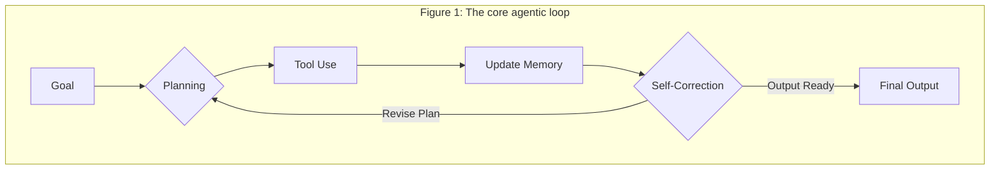

# AI Workflows vs. Agents
### Workflows vs. Agents: The AI dilemma

## Introduction

AI agents are a hot topic, with many demos showcasing autonomous systems tackling complex tasks. It is easy to assume that simply plugging in a Large Language Model (LLM) will solve all your problems. But as engineers, we know the reality is more nuanced. Building robust, reliable AI systems requires deliberate architectural choices, not just wishful thinking. The most critical decision you will make is where your system falls on the spectrum between a predictable workflow and a dynamic agent.

This article provides a clear, engineering-focused guide. We will define and contrast two fundamental architectural approaches: LLM Workflows and Agentic Systems. We will explore the crucial difference between developer-defined logic and LLM-driven autonomy, helping you understand which path to choose for your specific use case.

You will learn to identify the right problems for each architecture, see how state-of-the-art agents actually work under the hood, and get a realistic look at the common design patterns and the persistent challenges we still face. By the end, you will have a practical framework for designing and building sophisticated AI solutions that are effective, not just impressive on Twitter.

## Defining the Spectrum: LLM Workflows vs. Agentic Systems

Before you can build anything, you need to speak the language. The terms "workflow" and "agent" are often used interchangeably, creating confusion. Let's establish a clear distinction, because your choice between them defines your system's architecture, predictability, and capabilities.

A Large Language Model (LLM) Workflow is a system where developer-written code largely predefines and orchestrates the sequence of tasks. Think of it as a sophisticated assembly line. Each step is a discrete function—it might be a call to an LLM, a database query, or an API request—but the path is laid out in advance. The developer defines the logic, the conditionals, and the flow of data. These systems can have branches and loops, but those paths are explicitly coded. A workflow executes a plan you created [1](https://www.anthropic.com/research/building-effective-agents).

An Agentic System, in contrast, is one where an LLM acts as the brain of the operation. It dynamically decides the sequence of steps, reasons about the problem, and chooses its own actions to achieve a goal. Instead of following an assembly line, it is more like a skilled expert tackling a problem they have not seen before. The LLM itself determines the plan and the execution path, after you give the system a high-level objective and a set of tools. This grants the system a high degree of autonomy and adaptability [1](https://www.anthropic.com/research/building-effective-agents).

The core difference is simple: developer-defined logic versus LLM-driven autonomy. As you grant more "agency" to the LLM, the system's predictability decreases. Workflows are reliable and deterministic, while agents are flexible and less predictable. This trade-off is fundamental. Most production systems blend workflows and agents, combining structured workflows with agentic components for dynamic decision-making [2](https://blog.langchain.dev/how-to-think-about-agent-frameworks/).

Both approaches require an orchestration layer to manage the process. In a workflow, the orchestrator acts like a foreman, ensuring each step of a known blueprint executes in order. This orchestration streamlines processes and ensures harmonious operation among multiple models, delivering efficient and context-aware outputs [2](https://blog.langchain.dev/how-to-think-about-agent-frameworks/), [3](https://orq.ai/blog/llm-orchestration). In an agentic system, the orchestrator is more of a facilitator. It provides the LLM with the tools and environment it needs to create and execute its own dynamic plan, allowing it to adapt in response to changing requirements and real-time feedback [2](https://blog.langchain.dev/how-to-think-about-agent-frameworks/), [4](https://openreview.net/forum?id=3Hy00Wvabi).

## Choosing Your Path: Use Cases and Considerations

Choosing between a workflow and an agent is not about which is "better." It is about which is right for the job. Over-engineering a simple task with a complex agent is as bad as trying to solve a dynamic problem with a rigid workflow. The key is to match the architecture to the problem's nature.

You should use LLM Workflows for tasks that are predictable and can be broken down into a well-defined sequence of steps. Their strength lies in reliability and control. Because the logic is hard-coded, you can debug them more easily and be confident in their output. Workflows are linear and structured, ensuring the AI system operates within programmed boundaries, which makes them transparent and explainable [5](https://devops.com/why-you-shouldnt-forget-workflows-with-agentic-ai-systems/).

Good examples include structured data extraction, where you pull specific fields from a document and format them. Another is automated report generation, where an LLM fills a template from a known data source. Other ideal use cases are content pipelines, like summarizing an article and then translating that summary into three different languages. These tasks are repeatable and benefit from the consistency of a predefined path [6](https://www.arkeoai.com/blog/investors-guide-llm-vs-agentic-architecture), [7](https://www.louisbouchard.ai/agents-vs-workflows/).

Agentic Systems are the right choice when you face open-ended, complex problems where the solution path is not known upfront. Their value comes from their ability to adapt and handle ambiguity. These systems leverage chain-of-thought reasoning and orchestration frameworks to dynamically break down problems and select tools. Scenarios that demand this level of autonomy include advanced research and synthesis, where an agent might need to explore multiple avenues, evaluate sources, and construct an argument dynamically [5](https://devops.com/why-you-shouldnt-forget-workflows-with-agentic-ai-systems/).

Another strong use case is dynamic problem-solving, such as a code-debugging agent that must analyze an error, form hypotheses, inspect files, and test potential fixes iteratively. Complex, multi-turn customer support, where an agent needs to understand a novel issue, access multiple systems, and perform actions, also falls into this category. While agentic systems offer flexibility, their autonomy can introduce new, unforeseen errors, making them harder to interpret and debug [5](https://devops.com/why-you-shouldnt-forget-workflows-with-agentic-ai-systems/).

In reality, many production-grade solutions are hybrid systems. You might use a structured workflow to handle the initial intake of a customer request, then hand it off to a specialized agent if the problem requires dynamic troubleshooting. This approach gives you the reliability of workflows for predictable tasks and the flexibility of agents for unpredictable ones. This combination can lead to more consistent outcomes, as agents can adapt and recover from certain failures on the fly. Always start with the simplest solution, often a workflow, and only introduce agentic complexity when it is truly necessary [1](https://www.anthropic.com/research/building-effective-agents/), [6](https://www.arkeoai.com/blog/investors-guide-llm-vs-agentic-architecture).

## State-of-the-Art Agent Examples (2025) - A Closer Look

To make this less abstract, let's look at a few state-of-the-art examples that showcase what agentic systems are capable of today. These are not just theoretical concepts; they are functioning systems highlighting the power of LLM-driven autonomy.

### Devin: The AI Software Engineer
Devin stands as the first AI software engineer, developed by Cognition AI to tackle real-world software engineering tasks from start to finish. Given a high-level prompt, like a bug report from a GitHub issue, it can autonomously navigate a codebase, write code, execute tests, and fix errors. On the SWE-bench benchmark, which involves resolving actual issues from open-source projects, Devin achieved a resolution rate of 13.86%, significantly outperforming previous models [8](https://cognition.ai/blog/introducing-devin).

Devin's agentic nature comes from its entire operational loop. It does not follow a fixed script. Instead, it plans its approach, interacts with a full developer environment (shell, editor, browser), and iterates based on feedback from test results and error messages. This continuous cycle of planning, acting, and learning is the essence of an agent. It also supports features like automatic documentation generation and an interactive search engine for codebases [8](https://cognition.ai/blog/introducing-devin), [9](https://en.wikipedia.org/wiki/Devin_AI).

### Deep Research Agents
OpenAI developed Deep Research agents for complex, open-ended research tasks that require synthesizing information from numerous sources. A user can give it a complex research question, and the agent will break it down, formulate search queries, browse the web, read through sources, extract relevant information, and compile a comprehensive report with citations [10](https://openai.com/index/introducing-deep-research/).

Its agentic nature lies in its dynamic strategy. It does not just run a few predefined searches. It adapts its research path based on what it finds, deciding which leads to follow and which to discard. This mimics the process of a human researcher far more closely than a simple Retrieval-Augmented Generation (RAG) workflow. Deep Research agents balance structured workflows with LLM-driven autonomy, dynamically refining queries and prioritizing sources as needed [10](https://openai.com/index/introducing-deep-research/).

### OpenAI's Operator
Finally, consider systems like OpenAI's Operator, which controls computer applications. These agents leverage vision models to interpret screen content and generate actions like mouse clicks and keyboard inputs. This allows them to complete tasks within a graphical user interface (GUI). For example, you could ask it to "order groceries for me." It would then open a browser, navigate to a store's website, add items to the cart, and proceed to checkout [11](https://openai.com/index/introducing-operator/).

This system is agentic because it requires the LLM to plan a sequence of actions within an unfamiliar and dynamic environment. It translates a high-level goal into low-level UI interactions. Operator maintains context over extended workflows, tracking user instructions and task progress across sessions [11](https://openai.com/index/introducing-operator/).

## How AI Agents Work

State-of-the-art agents may seem like magic, but they operate on understandable, though complex, engineering principles. When we deconstruct their inner workings, we see the combination of planning, tool use, and iteration that drives their autonomy.

### Devin: The AI Software Engineer
An advanced code agent like Devin operates in a tight, iterative loop that mirrors the workflow of a human developer. Its process is not a straight line but a cycle of planning, acting, and learning, designed to autonomously handle complex engineering tasks requiring thousands of discrete decisions [8](https://cognition.ai/blog/introducing-devin).

1.  **Goal Understanding & Planning:** When Devin receives a task, its first step is to understand the goal and create a high-level plan. The LLM decomposes the abstract request into a sequence of concrete, achievable sub-tasks. These might include setting up the project environment, replicating the bug, identifying the faulty code, writing a patch, and running tests. Devin's ability to recall relevant context over extended timescales allows it to manage these multi-step workflows effectively [8](https://cognition.ai/blog/introducing-devin).
2.  **Environment Interaction:** Devin uses a suite of tools to interact with a sandboxed development environment, much like a human engineer. It can use a shell to list files, read their contents, and navigate directories. This interaction is crucial for gathering context about the project structure and existing code. It also supports an interactive search engine for codebases, allowing it to query and receive immediate, contextually relevant answers [9](https://en.wikipedia.org/wiki/Devin_AI).
3.  **Code Generation & Modification:** Based on its plan and the context it has gathered, the agent writes or edits code. This is not a one-shot process. It might start by adding logging statements to trace an error, or it could write a small, targeted change to a specific function. Devin can automate code-writing for both basic and complex algorithms, streamlining development [12](https://devtrain.co/can-devin-ai-really-replace-software-engineers-in-2025/).
4.  **Execution & Testing:** After modifying the code, Devin executes it within its environment. It runs the program, uses a linter to check for syntax errors, and, most importantly, runs the project's test suite. The feedback from these actions is critical for its progress. Devin evaluates whether the code ran successfully, if tests passed or failed, and if the original bug disappeared [12](https://devtrain.co/can-devin-ai-really-replace-software-engineers-in-2025/).
5.  **Debugging & Iteration:** If tests fail or the bug persists, the agent enters a debugging phase. It analyzes error messages and test failures to understand what went wrong, which feeds back into its planning module, causing it to revise its strategy. It might try a different code modification or use a browser tool to search for solutions online. This continuous loop continues until all tests pass and the original goal is achieved. Devin can also review collaborative work and propose improvements, further enhancing team output [12](https://devtrain.co/can-devin-ai-really-replace-software-engineers-in-2025/).

### Deep Research Agents
Deep Research agents tackle knowledge-intensive tasks through a multi-step process focused on information gathering and synthesis. Their mechanism focuses less on manipulating a local environment and more on navigating the vast, unstructured environment of the web. These agents demonstrate advanced reasoning by balancing structured workflows with LLM-driven autonomy [10](https://openai.com/index/introducing-deep-research/).

1.  **Query Formulation & Planning:** The process begins with the agent breaking down a broad research topic into specific questions. It plans a strategy, deciding what keywords to search for and what types of sources are likely to be most valuable. This initial planning often involves a "manager agent" that interprets user instructions and coordinates the overall workflow [13](https://aisecuritychronicles.org/a-comparison-of-deep-research-ai-agents-52492ee47ca7).
2.  **Iterative Search:** The agent uses tools, such as a search engine API, to execute its plan. It performs a series of searches and analyzes the results of each search to refine subsequent queries. If an initial search is too broad, it will narrow it; if it is a dead end, it will try a different angle. This dynamic adaptation of its research path mimics a human researcher far more closely than a simple RAG workflow [10](https://openai.com/index/introducing-deep-research/).
3.  **Information Extraction & Filtering:** As the agent finds promising sources, it "reads" them by processing their text content. It identifies and extracts the specific pieces of information relevant to its research questions, discarding irrelevant details. "Tool-calling agents" often perform these rule-based operations, such as querying search APIs or extracting data from web pages [13](https://aisecuritychronicles.org/a-comparison-of-deep-research-ai-agents-52492ee47ca7).
4.  **Synthesis & Analysis:** This is the core reasoning step. The agent does not just list facts; it synthesizes the information it has gathered from multiple sources. It looks for patterns, identifies contradictions, and builds a coherent narrative or argument. The agent's ability to adapt its workflow based on intermediate findings allows for flexible strategies for information gathering and synthesis [14](https://www.sequoiacap.com/podcast/training-data-deep-research/).
5.  **Citation & Reporting:** Finally, the agent generates a structured output, such as a detailed report. A key feature of advanced research agents is their ability to provide citations, linking their synthesized claims back to the original sources. Transparency, through visible citations and explicit reasoning, helps users trust the agent’s conclusions [10](https://openai.com/index/introducing-deep-research/), [14](https://www.sequoiacap.com/podcast/training-data-deep-research/).

### Computer Control Agents
Agents designed to operate computers, like OpenAI's Operator, bridge the gap between language-based instructions and visual, interactive environments. Operator is designed to handle a wide variety of repetitive browser tasks, such as filling out forms and ordering groceries [11](https://openai.com/index/introducing-operator/).

Their core mechanism relies on a combination of vision and action. A multimodal LLM "sees" the screen, interpreting GUI elements like buttons and text fields. Based on the user's high-level goal, the agent plans a sequence of actions needed to navigate the application. It then maps these planned actions to low-level commands, such as moving the mouse to specific coordinates, clicking, and typing text.

Operator maintains context over extended workflows, tracking user instructions, preferences, and task progress across sessions. This system combines structured, rule-based steps with the autonomy of LLM-powered reasoning, allowing it to make decisions in ambiguous situations. The primary challenge for these agents is robustness; they can easily fail if a website's UI changes, demonstrating the brittleness that still plagues many agentic systems today [11](https://openai.com/index/introducing-operator/).

## Common Patterns and Enduring Challenges in Agent Design

As we build more of these systems, common architectural patterns are emerging. However, these patterns also highlight the significant and persistent challenges that make building reliable agents a difficult engineering problem. Anyone who tells you otherwise is selling you something.

### Common Architectural Patterns
Most advanced agentic systems are built from a few fundamental components that work together in a loop. Understanding these patterns is key to designing your own agents.

1.  **Planning:** This is the agent's ability to decompose a high-level goal into smaller, actionable steps. A plan provides a roadmap, but unlike a rigid workflow, this plan can be updated dynamically based on new information. This dynamic planning often leverages chain-of-thought reasoning, where the agent thinks step-by-step to create a roadmap for execution. The agent essentially creates its own workflow on the fly [15](https://blog.dailydoseofds.com/p/5-agentic-ai-design-patterns).
2.  **Tool Use:** Agents need to interact with the world to be useful. Tools are the bridge between the agent's reasoning and the external environment, allowing it to extend its capabilities. As shown in the diagram below, the agent performs an action on the environment. These can be anything from a search engine API to a code interpreter or a database query function. The ability to select and use the right tool for a given sub-task is a cornerstone of agentic behavior [16](https://www.youtube.com/watch?v=MrD9tCNpOvU).
3.  **Memory:** For an agent to perform any non-trivial task, it needs memory. We typically split this into two types. **Short-term memory** holds the context for the current task, like the conversation history. **Long-term memory** allows the agent to retain and recall information across sessions, enabling it to learn from past experiences. To implement this, agents often store information as embeddings in a vector database and query it to find relevant data using semantic similarity [17](https://www.lindy.ai/blog/ai-agent-architecture), [18](https://techcommunity.microsoft.com/blog/azure-ai-services-blog/memory-management-for-ai-agents/4406359).
4.  **Self-Correction:** This pattern, also known as reflection, means the agent evaluates its own work. After generating a piece of code or a plan, the agent can use another LLM call to critique its own output against the original goal. This feedback loop, represented in the diagram below, allows the agent to iteratively refine its results, catching errors and improving quality without human intervention [19](https://www.alvarezandmarsal.com/insights/ready-ai-automation-use-large-language-model-agentic-workflow-power-your-business).

These patterns often work together in a cyclical process. A goal initiates a planning phase, which leads to tool use. The results of that action are stored in memory and used for a self-correction step, which can either lead to a final output or feed back into the planning phase for another iteration.

### Enduring Challenges in Agent Design
Despite the progress, building production-ready agents is still incredibly hard. The hype often papers over the deep engineering challenges that teams face every day.

*   **LLM Reliability:** The core engine of any agent is an LLM, and LLMs are not perfectly reliable. They can hallucinate, misinterpret instructions, or produce inconsistent reasoning. An error in a single reasoning step can derail an entire multi-step task, leading to a cascade of failures. The hard part is ensuring the LLM has the appropriate context at each step and controlling the process. This is the single biggest obstacle to deploying agents in mission-critical applications [2](https://blog.langchain.dev/how-to-think-about-agent-frameworks/).
*   **Long-Context Management:** Agents that perform complex tasks often need to maintain context over thousands of tokens. While context windows are getting longer, LLMs can still struggle to pay attention to the right information in a vast sea of text. The "lost in the middle" problem, where models ignore information in the middle of their context, is a real issue that can cause agents to forget critical details [2](https://blog.langchain.dev/how-to-think-about-agent-frameworks/).
*   **Error Detection and Recovery:** When a rigid workflow fails, it usually fails in a predictable way. When an agent fails, diagnosing the root cause is difficult due to its dynamic nature. Building robust error-handling and recovery mechanisms for a system that generates its own path is a significant challenge. How does an agent know it is stuck in a loop, or how does it recover from a tool that unexpectedly fails? To address this, agentic architectures often use orchestration frameworks to structure the reasoning process and include validation stages [5](https://devops.com/why-you-shouldnt-forget-workflows-with-agentic-ai-systems/).
*   **Scalability and Cost:** Agentic systems often involve multiple LLM calls for a single user request—one for planning, several for tool use and reflection. This can make them slow and expensive to operate at scale. The cost of an agent that makes ten LLM calls is ten times that of a simple workflow. When moving from a single agent to systems with multiple agents working in coordination, the complexity and cost can increase significantly.
*   **Security:** Giving an autonomous agent access to powerful tools like a file system or external APIs creates significant security risks. A poorly designed agent could execute harmful commands, delete files, or leak sensitive data. Securing these systems requires careful sandboxing, robust oversight, and restricting the use of unsanctioned tools. Multi-agent frameworks are particularly vulnerable, as interconnected agents can amplify the impact of a single compromised node [20](https://oliverpatel.substack.com/p/top-12-papers-on-agentic-ai-governance/), [21](https://omdia.tech.informa.com/blogs/2025/may/mitigating-risks-maximising-potential).
*   **Evaluation:** How do you evaluate an agent designed for open-ended tasks? Traditional metrics like exact match accuracy do not apply. Evaluating these systems requires more sophisticated methods, such as scenario-based testing and human-in-the-loop (HITL) review. Trajectory analysis, which tracks the quality of the agent's decision-making process, is also vital. Frameworks like AgentBench are emerging, but evaluating agent performance remains a major research area [22](https://orq.ai/blog/agent-evaluation), [23](https://metadesignsolutions.com/benchmarking-ai-agents-in-2025-top-tools-metrics-performance-testing-strategies/), [24](https://enthu.ai/blog/evaluate-agent-performance/), [25](https://galileo.ai/blog/ai-agent-evaluation).

## Conclusion

The distinction between LLM Workflows and Agentic Systems is not just academic; it is a fundamental architectural decision that will shape the reliability, flexibility, and cost of your AI application. Workflows, with their developer-defined logic, offer predictability and control, making them ideal for structured, repeatable tasks. Agents, driven by LLM autonomy, provide the adaptability needed to tackle complex, open-ended problems where the solution path is unknown.

Building effective agents requires more than just a powerful LLM. It demands solid engineering, centered around common patterns like planning, tool use, memory, and self-correction. These patterns form the building blocks of autonomous systems.

However, the path to production is filled with challenges. The unreliability of LLM reasoning, the difficulty of managing long contexts, and the complexities of error recovery, security, and evaluation are not minor details—they are the core engineering problems we must solve. The hype is temporary, but these challenges are real. As engineers, our job is to move beyond the demos and build systems that are not only intelligent but also robust, reliable, and secure.