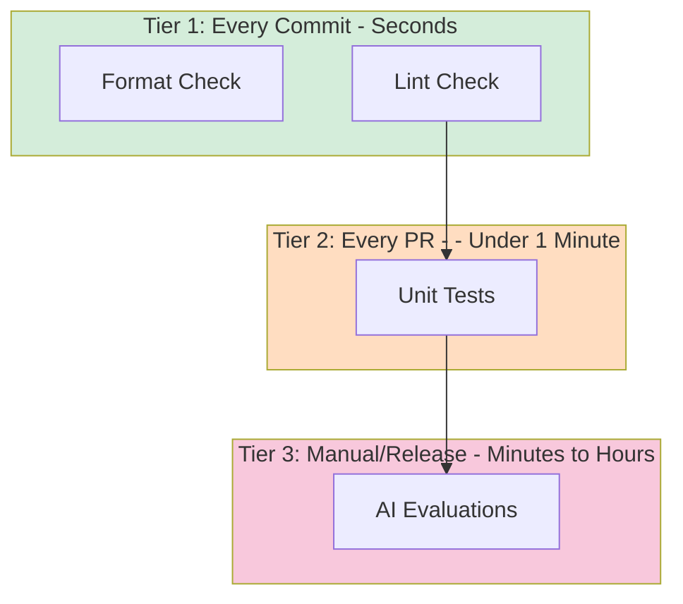

# Continuous Integration for AI Engineering

In our last lessons, we introduced agent observability with Opik, started building our offline evaluation dataset, and covered the evaluation-driven development framework. We learned that improving a system requires seeing what it does and capturing data to test against. Now, we shift focus to Continuous Integration (CI): the automated infrastructure that keeps your codebase maintainable and prevents regressions from reaching production.

## What is Continuous Integration?

Continuous Integration is a software development practice where developers frequently merge code changes into a shared repository. Each merge triggers automated checks to detect integration issues early. The core principle is to catch bugs quickly and cheaply by testing every change automatically.

Traditional CI pipelines include several standard components:

-   **Build verification:** Ensure the code compiles and dependencies resolve correctly.
-   **Automated testing:** Run unit tests, integration tests, and sometimes end-to-end tests.
-   **Code quality checks:** Linting for bugs and formatting for consistent style.
-   **Security scanning:** Detect vulnerable dependencies.

For AI agent projects, CI follows the same principles but with unique challenges. Prompts change frequently, schemas evolve, and LLM outputs are non-deterministic. Traditional testing approaches, like asserting exact outputs or using real API calls, do not work well. Without proper CI, your repository becomes a minefield where small changes break existing features in subtle ways.

This lesson covers CI essentials for building production-ready AI agents. We focus on practical techniques you will use daily: automated quality checks, testing with mocked LLMs, and structuring CI pipelines around cost constraints. We will not cover comprehensive DevOps topics like Kubernetes or Terraform, as those deserve dedicated courses. Instead, we teach what you need to move from prototype to production-ready agents with confidence.

In this lesson, we will cover:

-   Why agent repositories need CI infrastructure from day one.
-   Setting up pre-commit hooks to enforce code quality automatically.
-   Configuring Ruff for linting and formatting.
-   Writing unit tests for deterministic agent code with mocked LLM responses.
-   Building a CI pipeline that runs automatically on every change.
-   Using AI evaluations as selective regression tests in CI.

This lesson includes a hands-on notebook where you will practice running formatting checks, linting, and tests on Brown, our writing agent.

## Why Repos Need CI Early

Deferring quality infrastructure leads to technical debt. For AI agent repositories, the problem compounds quickly. Agent codebases change rapidly: you tweak prompts, adjust schemas, and refactor tool definitions. Each change can have cascading effects.

Here are three failure modes that emerge quickly without CI:

1.  **Formatting churn and noisy diffs.** When team members use different formatters, every pull request becomes a mess of whitespace changes. Code reviews waste time debating indentation instead of logic.
2.  **"Works locally" syndrome.** A developer tests a change locally and pushes code. Hours later, the build fails in CI. The cause? They ran formatting checks but forgot to run tests. Without enforcement, manual checks get skipped.
3.  **Flaky tests dependent on external APIs.** The temptation with AI agents is to call real LLMs in tests to "verify actual behavior." But real API calls make tests slow, expensive, and non-deterministic. Your test suite becomes flaky, destroying confidence in your CI pipeline.

These problems compound as your team grows. The cost of fixing them increases exponentially.

### The Three-Tier CI Model for AI Agents

For AI agent projects, we adapt standard CI practices into three tiers based on cost and speed:

**Tier 1: Formatting and Linting (Always Run).** These checks are fast (seconds) and cheap (no API calls). They catch syntactic issues and enforce style consistency. Every commit should pass these checks. This tier is identical to traditional CI.

**Tier 2: Unit and Integration Tests (Always Run).** These verify deterministic logic—parsing, schema validation, routing—without calling external APIs. By mocking LLM responses, tests run quickly (under a minute) and reliably. Every pull request should pass the full test suite.

**Tier 3: AI Evaluations (Manual/Release).** This tier is unique to AI systems. It involves expensive, LLM-based quality checks that use real API calls to evaluate agent quality on a curated dataset. We run these selectively: before major releases or after significant prompt changes. They are the ultimate regression test but are too costly for every commit [[31]](https://dev.to/kuldeep_paul/a-practical-guide-to-integrating-ai-evals-into-your-cicd-pipeline-3mlb).



Image 1: A three-tier CI model for AI agents, showing the flow from commit checks to PR tests and finally to manual/release AI evaluations, with each tier distinctly colored.

This three-tier model balances speed, cost, and confidence. Fast checks run always; expensive checks run strategically. We omitted common CI components like type checking with mypy, security scanning, and code coverage reporting to keep the pipeline simple, but you can add them as your project matures.

## Pre-commit Hooks: Automated Local Guardrails

Pre-commit hooks are Git hooks that run automatically before you create a commit. They catch issues immediately in your local environment, providing a fast feedback loop. You fix problems in seconds, not minutes later when CI fails.

The **pre-commit** framework manages Git hooks using a declarative YAML configuration [[10]](https://pre-commit.com). You define hooks in `.pre-commit-config.yaml`, and the framework handles installation and execution. Hooks are defined as references to external repositories, so the community maintains hooks for popular tools.

### Brown's Pre-commit Configuration

Our Brown writing agent uses a pre-commit configuration found at `lessons/writing_workflow/.pre-commit-config.yaml`:

```yaml
fail_fast: false

repos:
  - repo: https://github.com/abravalheri/validate-pyproject
    rev: v0.24.1
    hooks:
      - id: validate-pyproject

  - repo: https://github.com/pre-commit/mirrors-prettier
    rev: v3.1.0
    hooks:
      - id: prettier
        types_or: [yaml, json5]

  - repo: https://github.com/astral-sh/ruff-pre-commit
    rev: v0.12.1
    hooks:
      - id: ruff-check
        args: [--fix, --exit-non-zero-on-fix]
      - id: ruff-format
```

Let's understand each hook:

-   **`validate-pyproject`**: This tool validates that your `pyproject.toml` file is structurally correct according to PEP standards. A malformed file can break the entire project.
-   **`prettier`**: A popular code formatter we use for configuration files like `.github/workflows/ci.yml`. Consistent formatting makes these files readable and reduces merge conflicts [[55]](https://talkpython.fm/episodes/show/482/pre-commit-hooks-for-python-devs).
-   **`ruff-check` and `ruff-format`**: These hooks run Ruff, a modern Python linter and formatter. The `--fix` flag automatically fixes issues, and `--exit-non-zero-on-fix` ensures the hook fails even after auto-fixing, forcing you to review and re-stage the changes [[34]](https://github.com/astral-sh/ruff-pre-commit). The `ruff-check` hook runs before `ruff-format` as recommended by Ruff's authors.

### Setting Up Pre-commit

After cloning the repository, set up pre-commit hooks with:

```bash
# Install dependencies (includes pre-commit)
uv sync --dev

# Install the Git hooks
pre-commit install
```

The `pre-commit install` command creates a Git hook at `.git/hooks/pre-commit` [[10]](https://pre-commit.com). Now, every time you run `git commit`, pre-commit runs automatically. You can also run hooks manually:

```bash
# Run all hooks on all files
make pre-commit
```

The workflow is simple: make changes, stage them with `git add`, and run `git commit`. If hooks fail, review the errors, fix them, re-stage, and commit again. This tight feedback loop catches issues in seconds.

## Ruff: Fast Python Linting and Formatting

Ruff is an extremely fast Python linter and formatter written in Rust. It replaces a collection of older tools like Black, isort, and Flake8, consolidating them into a single binary that runs in milliseconds.

It's important to understand the distinction between formatting and linting:

-   **Formatting** rewrites code to follow consistent style rules (indentation, line breaks). It is automatic and opinionated.
-   **Linting** analyzes code for bugs, suspicious patterns, and violations of best practices (unused variables, missing imports).

### Brown's Ruff Configuration

Ruff's configuration for Brown is in `lessons/writing_workflow/pyproject.toml`:

```toml
[tool.ruff]
target-version = "py312"
line-length = 140

[tool.ruff.lint]
select = [
    "F",    # Pyflakes
    "E",    # pycodestyle errors
    "I",    # isort
]

[tool.ruff.lint.isort]
known-first-party = ["src", "tests"]
```

-   `target-version = "py312"` tells Ruff which Python version to use for syntax checks [[43]](https://betterstack.com/community/guides/scaling-python/pyproject-explained/).
-   `line-length = 140` sets the maximum line length.
-   `select = ["F", "E", "I"]` enables rule sets for catching common bugs (Pyflakes), enforcing PEP 8 style (pycodestyle), and organizing imports (isort) [[16]](https://docs.astral.sh/ruff/linter/).
-   `known-first-party = ["src", "tests"]` tells isort how to group project-specific imports.

### Brown's Makefile QA Targets

Brown provides convenience wrappers for Ruff in `lessons/writing_workflow/Makefile`:

```makefile
# --- Tests & QA ---

QA_FOLDERS := src/ tests/ scripts/

format-fix: # Auto-format Python code using ruff formatter.
	uv run ruff format $(QA_FOLDERS)

lint-fix: # Auto-fix linting issues using ruff linter.
	uv run ruff check --fix $(QA_FOLDERS)

format-check: # Check code formatting without making changes.
	uv run ruff format --check $(QA_FOLDERS) 

lint-check: # Check code for linting issues without fixing them.
	uv run ruff check $(QA_FOLDERS)
```

Each target uses `uv run` to execute commands within the project's virtual environment, which is managed automatically and doesn't require manual activation [[51]](https://devcenter.upsun.com/posts/why-python-developers-should-switch-to-uv/). You can run these from the `writing_workflow/` directory to check or fix your code before committing.

### Hands-On Example: Fixing Formatting Issues

To see Ruff's formatter in practice, let's take a poorly formatted Python file.

1.  Create a file with inconsistent spacing and line breaks.

    ```python
    # test_formatting.py - intentionally poorly formatted
    def  badly_formatted_function(x,y,z):
        result=x+y+z
        my_list=[1,2,3,4,5,6,7,8,9,10]
    ```

2.  Check the formatting without making changes.

    ```bash
    ruff format --check test_formatting.py
    ```

    It outputs:

    ```text
    Would reformat: test_formatting.py
    1 file would be reformatted
    ```

3.  Auto-fix the formatting.

    ```bash
    ruff format test_formatting.py
    ```

    It outputs:

    ```text
    1 file reformatted
    ```

The file is now perfectly formatted, with consistent spacing and structure. This automation keeps the codebase clean with zero manual effort.

### Hands-On Example: Fixing Linting Issues

Linting catches bugs and quality issues.

1.  Create a file with an unused import and a duplicate import.

    ```python
    # test_linting.py
    import os
    import sys
    import json  # Unused import
    
    # ... some code ...
    
    # Duplicate import at the bottom
    import sys
    ```

2.  Check for linting issues.

    ```bash
    ruff check test_linting.py
    ```

    It outputs:

    ```text
    test_linting.py:3:8: F401 [*] `json` imported but unused
    test_linting.py:8:8: F811 [*] Redefinition of unused `sys` from line 2
    Found 2 errors.
    [*] 2 fixable with the `--fix` option.
    ```

3.  Auto-fix the issues.

    ```bash
    ruff check --fix test_linting.py
    ```

Ruff automatically removes the unused and duplicate imports. This demonstrates how linting catches and fixes potential bugs before they enter the codebase.

## Unit Tests for Agent Repos

Unit tests verify that code behaves correctly under controlled conditions. For AI agents, the core logic involves calling LLMs, which return non-deterministic outputs. Real API calls make tests slow, flaky, and expensive.

The solution is to **mock external dependencies**. Just as traditional apps mock databases, AI agents must mock LLM calls [[3]](https://brightsec.com/blog/unit-testing-best-practices/).

### What to Test in AI Agents

We do not unit test the LLM. We test our code around it. Focus on the deterministic parts of your agent:

-   **Parsing and rendering:** Does your markdown loader extract articles correctly?
-   **Schema validation:** Does your Pydantic model reject invalid data?
-   **Routing decisions:** Given a specific state, does your workflow route to the correct node?
-   **Utilities:** Do helper functions for URL extraction or text cleaning work correctly?

For nodes that call LLMs, you mock the LLM responses. This lets you test the node's logic—how it constructs prompts and processes responses—without making real API calls.

### Our Implementation: The FakeModel Pattern

In our Brown agent, we implement response injection with a `FakeModel` class that is compatible with LangChain's interface.

**Part 1: Configuration specifies the fake model**

The `debug.yaml` configuration at `lessons/writing_workflow/configs/debug.yaml` sets all nodes to use the fake model:

```yaml
nodes:
  write_article:
    model_id: "fake"
  review_article:
    model_id: "fake"
  edit_article:
    model_id: "fake"
```

**Part 2: Model factory returns FakeModel when configured**

Brown's `FakeModel` class is defined in `lessons/writing_workflow/src/brown/models/fake_model.py`. It extends LangChain's `FakeListChatModel` and can be pre-loaded with responses to return during tests [[25]](https://docs.langchain.com/oss/python/langchain/test).

**Part 3: Tests inject specific responses**

Brown's test structure is organized in `lessons/writing_workflow/tests/`. Here is an example test from `lessons/writing_workflow/tests/brown/nodes/test_article_writer.py`:

```python
@pytest.mark.asyncio
async def test_article_writer_ainvoke_success(
    # ... pytest fixtures for mock data
) -> None:
    """Test article generation with mocked response."""
    mock_response = '{"content": "# Generated Article..."}'
    
    app_config = get_app_config()
    model, _ = build_model(app_config, node="write_article")
    model.responses = [mock_response]
    
    writer = ArticleWriter(
        # ... inject dependencies
        model=model,
    )
    
    result = await writer.ainvoke()
    
    assert isinstance(result, Article)
    assert "# Generated Article" in result.content
```

The test creates a mock JSON response, builds a fake model, injects the response into it, and then instantiates the `ArticleWriter` node with that fake model. This pattern keeps tests fast, deterministic, and free.

### Running Brown's Tests

To run Brown's test suite, use the command from the `Makefile`:

```bash
# From the writing_workflow directory
make tests
```

This command runs `CONFIG_FILE=configs/debug.yaml uv run pytest`. The `debug.yaml` configuration ensures tests use the fake models and never call real LLMs. The complete test suite runs in under a minute.

## CI Workflows: Automated Enforcement

Local checks provide fast feedback, but they are optional. CI provides enforcement by running the same checks automatically on every push and pull request. If checks fail, the PR cannot be merged. We use GitHub Actions, but the principles apply to any CI platform.

### GitHub Actions Workflow Walkthrough

Our CI workflow is defined in `.github/workflows/ci.yml`.

**Triggers**

The workflow runs on:

-   `pull_request` to the `main` and `dev` branches.
-   `push` to the `main` branch.

**Jobs**

There are two jobs that run in parallel: `qa` and `tests`. Splitting them provides clear, fast feedback. If formatting fails, you see "QA job failed" immediately without waiting for tests to run [[6]](https://dev.to/cicube/how-to-run-jobs-in-parallel-with-github-actions-4png).

The `qa` job runs formatting and linting checks:

```yaml
  qa:
    runs-on: ubuntu-latest
    steps:
      - uses: actions/checkout@v4
      - uses: astral-sh/setup-uv@v4
      - uses: actions/setup-python@v5
        with:
          python-version-file: ".python-version"
      - run: uv sync --dev
      - run: uv run ruff format --check $QA_FOLDERS
      - run: uv run ruff check $QA_FOLDERS
```

The `tests` job runs the pytest suite:

```yaml
  tests:
    runs-on: ubuntu-latest
    steps:
      - uses: actions/checkout@v4
      - uses: astral-sh/setup-uv@v4
      - uses: actions/setup-python@v5
        with:
          python-version-file: ".python-version"
      - run: uv sync
      - run: CONFIG_FILE=configs/debug.yaml uv run pytest
```

A critical principle is that CI should run the exact same commands you run locally. This eliminates "works on my machine" problems. If tests pass locally, they will pass in CI.

## AI Evaluations as Regression Tests

AI evaluations serve a critical purpose: regression testing. A change might pass all unit tests but degrade the semantic quality of the agent's output. AI evaluations catch these regressions.

### Why AI Evals Are Unique to AI Systems

Traditional CI does not have an equivalent to Tier 3 evaluations because unit and integration tests are fast enough to run on every commit. For AI agents, semantic quality testing requires real LLM calls, which are slow and expensive [[21]](https://www.deepchecks.com/llm-evaluation/ci-cd-pipelines/).

A modest evaluation dataset of 10 samples could require 50-100 LLM calls. At an average cost of $0.05 per call, a single evaluation run might cost $2.50-$5.00. Running this on every commit for a team of five could cost thousands of dollars per month and slow development to a crawl. This is why we run them selectively.

### Manual-Trigger CI Workflow for AI Evals

We can create a CI workflow that runs evaluations on demand.

```yaml
# .github/workflows/eval.yml
name: AI Evaluations

on:
  workflow_dispatch:  # Manual trigger only

jobs:
  evaluate:
    runs-on: ubuntu-latest
    steps:
      - uses: actions/checkout@v4
      - uses: astral-sh/setup-uv@v4
      - uses: actions/setup-python@v5
        with:
          python-version-file: ".python-version"
      - run: uv sync
      - name: Run evaluations
        env:
          LLM_API_KEY: ${{ secrets.LLM_API_KEY }}
        run: |
          # Command to run evaluations with a production config
          CONFIG_FILE=./configs/production.yaml python -m scripts.run_eval
```

This workflow is triggered manually from the GitHub UI, uses real API keys stored securely in GitHub Secrets, and runs the full evaluation suite.

### When to Run AI Evals

The decision depends on your project's maturity:

-   **Early development:** Run manually to measure progress weekly or after major changes.
-   **Active development:** Run before merging significant changes to catch regressions.
-   **Mature product:** Run as part of your release process to ensure production quality never degrades.

## Daily Development Workflow and Conclusion

With these tools in place, a typical daily workflow looks like this:

1.  **Write code** and corresponding tests.
2.  **Run quick checks** periodically: `make lint-check` and `make format-check`.
3.  **Run tests** after changing logic: `make tests`.
4.  **Commit your changes.** Pre-commit hooks will run automatically.
5.  **Push and open a pull request.** CI runs automatically, enforcing all checks.
6.  **Before releasing, run AI evaluations** manually to check for quality regressions.

This workflow takes seconds for most commits and catches issues early.

### Conclusion

Continuous Integration for AI agents adapts traditional software engineering practices to the unique challenges of LLM-powered systems. The three-tier model—fast checks, deterministic tests with mocked LLMs, and selective AI evaluations—provides a robust framework for building maintainable and reliable agents. This infrastructure is not optional for production AI systems. The investment in CI pays for itself the first time it catches a regression before your customers see it.

The companion notebook for this lesson lets you practice every concept discussed: running checks, fixing issues automatically, and running Brown's test suite. This will transform these concepts from theory into muscle memory. In our next lessons, we will cover deployment essentials, building on the CI foundation we have established today.

## References

1.  (n.d.). pre-commit. [https://pre-commit.com](https://pre-commit.com)
2.  (n.d.). pre-commit/pre-commit-hooks. GitHub. [https://github.com/pre-commit/pre-commit-hooks](https://github.com/pre-commit/pre-commit-hooks)
3.  (n.d.). isort pre-commit Hook. isort. [https://pycqa.github.io/isort/docs/configuration/pre-commit.html](https://pycqa.github.io/isort/docs/configuration/pre-commit.html)
4.  (n.d.). Ruff Linter. Ruff. [https://docs.astral.sh/ruff/linter/](https://docs.astral.sh/ruff/linter/)
5.  (n.d.). Ruff Rules. Ruff. [https://docs.astral.sh/ruff/rules/](https://docs.astral.sh/ruff/rules/)
6.  (n.d.). How to run jobs in parallel with GitHub Actions. dev.to. [https://dev.to/cicube/how-to-run-jobs-in-parallel-with-github-actions-4png](https://dev.to/cicube/how-to-run-jobs-in-parallel-with-github-actions-4png)
7.  (n.d.). Getting started with GitHub Actions. GitHub Docs. [https://docs.github.com/articles/getting-started-with-github-actions](https://docs.github.com/articles/getting-started-with-github-actions)
8.  (n.d.). Running variations of jobs in a workflow. GitHub Docs. [https://docs.github.com/actions/writing-workflows/choosing-what-your-workflow-does/running-variations-of-jobs-in-a-workflow](https://docs.github.com/actions/writing-workflows/choosing-what-your-workflow-does/running-variations-of-jobs-in-a-workflow)
9.  (n.d.). Using jobs in a workflow. GitHub Docs. [https://docs.github.com/actions/using-jobs/using-jobs-in-a-workflow](https://docs.github.com/actions/using-jobs/using-jobs-in-a-workflow)
10. (n.d.). Control the concurrency of workflows and jobs. GitHub Docs. [https://docs.github.com/actions/writing-workflows/choosing-what-your-workflow-does/control-the-concurrency-of-workflows-and-jobs](https://docs.github.com/actions/writing-workflows/choosing-what-your-workflow-does/control-the-concurrency-of-workflows-and-jobs)
11. (n.d.). GitHub Actions Parallel Testing Guide & Examples. Testmo. [https://www.testmo.com/guides/github-actions-parallel-testing/](https://www.testmo.com/guides/github-actions-parallel-testing/)
12. (n.d.). A Practical Guide to Integrating AI Evals into Your CI/CD Pipeline. dev.to. [https://dev.to/kuldeep_paul/a-practical-guide-to-integrating-ai-evals-into-your-cicd-pipeline-3mlb](https://dev.to/kuldeep_paul/a-practical-guide-to-integrating-ai-evals-into-your-cicd-pipeline-3mlb)
13. (n.d.). LLM Evaluation for CI/CD Pipelines: A Practical Guide. Deepchecks. [https://www.deepchecks.com/llm-evaluation/ci-cd-pipelines/](https://www.deepchecks.com/llm-evaluation/ci-cd-pipelines/)
14. (n.d.). Testing. LangChain. [https://docs.langchain.com/oss/python/langchain/test](https://docs.langchain.com/oss/python/langchain/test)
15. (n.d.). How do I handle errors and exceptions in LlamaIndex workflows?. Milvus. [https://milvus.io/ai-quick-reference/how-do-i-handle-errors-and-exceptions-in-llamaindex-workflows](https://milvus.io/ai-quick-reference/how-do-i-handle-errors-and-exceptions-in-llamaindex-workflows)
16. (n.d.). pre-commit hook. Ruff. [https://github.com/astral-sh/ruff-pre-commit](https://github.com/astral-sh/ruff-pre-commit)
17. (n.d.). Integration with pre-commit. uv. [https://docs.astral.sh/uv/guides/integration/pre-commit/](https://docs.astral.sh/uv/guides/integration/pre-commit/)
18. (n.d.). pyproject.toml explained. BetterStack. [https://betterstack.com/community/guides/scaling-python/pyproject-explained/](https://betterstack.com/community/guides/scaling-python/pyproject-explained/)
19. (n.d.). Python's pyproject.toml: The Essential Guide. Real Python. [https://realpython.com/python-pyproject-toml/](https://realpython.com/python-pyproject-toml/)
20. (n.d.). Writing a pyproject.toml file. Python Packaging User Guide. [https://packaging.python.org/en/latest/guides/writing-pyproject-toml/](https://packaging.python.org/en/latest/guides/writing-pyproject-toml/)
21. (n.d.). pyproject.toml is the new home for your Python packaging configuration. Simon Willison's TILs. [https://til.simonwillison.net/python/pyproject](https://til.simonwillison.net/python/pyproject)
22. (n.d.). uv: Your All-in-One Python Project and Package Manager. DataCamp. [https://www.datacamp.com/tutorial/python-uv](https://www.datacamp.com/tutorial/python-uv)
23. (n.d.). Why Python developers should switch to uv. Upsun DevCenter. [https://devcenter.upsun.com/posts/why-python-developers-should-switch-to-uv/](https://devcenter.upsun.com/posts/why-python-developers-should-switch-to-uv/)
24. (n.d.). You're probably using uv wrong. Lerner Consulting. [https://lerner.co.il/2025/08/28/youre-probably-using-uv-wrong/](https://lerner.co.il/2025/08/28/youre-probably-using-uv-wrong/)
25. (n.d.). Virtual environments. uv. [https://docs.astral.sh/uv/pip/environments/](https://docs.astral.sh/uv/pip/environments/)
26. (n.d.). Python Finally Has A Good Package Manager. YouTube. [https://www.youtube.com/watch?v=flAneKTg8Nk](https://www.youtube.com/watch?v=flAneKTg8Nk)
27. (n.d.). Pre-commit Hooks for Python Devs. Talk Python To Me. [https://talkpython.fm/episodes/show/482/pre-commit-hooks-for-python-devs](https://talkpython.fm/episodes/show/482/pre-commit-hooks-for-python-devs)
28. (n.d.). Maximize Your Python Efficiency with Pre-Commit: A Complete but Concise Guide. dev.to. [https://dev.to/techishdeep/maximize-your-python-efficiency-with-pre-commit-a-complete-but-concise-guide-39a5](https://dev.to/techishdeep/maximize-your-python-efficiency-with-pre-commit-a-complete-but-concise-guide-39a5)
29. (n.d.). Pre-Commit Hooks. MLOps Coding Course. [https://mlops-coding-course.fmind.dev/5.%20Refining/5.2.%20Pre-Commit%20Hooks.html](https://mlops-coding-course.fmind.dev/5.%20Refining/5.2.%20Pre-Commit%20Hooks.html)
30. (n.d.). Git Hooks: The Ultimate Guide. Kinsta. [https://kinsta.com/blog/git-hooks/](https://kinsta.com/blog/git-hooks/)
31. (n.d.). Integration with GitHub Actions. uv. [https://docs.astral.sh/uv/guides/integration/github/](https://docs.astral.sh/uv/guides/integration/github/)
32. (n.d.). setup-python cache is 'alongside the runner', setup-uv uses a different cache. GitHub. [https://github.com/astral-sh/setup-uv/issues/724](https://github.com/astral-sh/setup-uv/issues/724)
33. (n.d.). Ambiguity in README about whether to use actions/setup-python. GitHub. [https://github.com/astral-sh/setup-uv/issues/197](https://github.com/astral-sh/setup-uv/issues/197)
34. (n.d.). Optimizing CI/CD, model management, and evaluation workflows with Weights & Biases. Weights & Biases. [https://wandb.ai/team-jdoc/wandb-webinar-cicd-2024/reports/Optimizing-CI-CD-model-management-and-evaluation-workflows-with-Weights-Biases--Vmlldzo5NTE1NjE5](https://wandb.ai/team-jdoc/wandb-webinar-cicd-2024/reports/Optimizing-CI-CD-model-management-and-evaluation-workflows-with-Weights-Biases--Vmlldzo5NTE1NjE5)
35. (n.d.). How To Add LLM Evaluations to CI/CD Pipelines. Arize AI. [https://arize.com/blog/how-to-add-llm-evaluations-to-ci-cd-pipelines/](https://arize.com/blog/how-to-add-llm-evaluations-to-ci-cd-pipelines/)
36. (n.d.). CI/CD for Machine Learning: A Practical Guide. DataCamp. [https://www.datacamp.com/tutorial/ci-cd-for-machine-learning](https://www.datacamp.com/tutorial/ci-cd-for-machine-learning)
37. (n.d.). Unit Testing Best Practices: 13 Ways to Improve Your Tests. Bright Security. [https://brightsec.com/blog/unit-testing-best-practices/](https://brightsec.com/blog/unit-testing-best-practices/)
38. (n.d.). Enhancing AI Model Experimentation With Multiple CI/CD Pipelines. CircleCI. [https://circleci.com/blog/enhancing-ai-model-experimentation-with-multiple-ci-cd-pipelines/](https://circleci.com/blog/enhancing-ai-model-experimentation-with-multiple-ci-cd-pipelines/)
39. (n.d.). Continuous Evaluation of Generative AI using CI/CD Pipelines. TELUS Digital. [https://www.telusdigital.com/insights/data-and-ai/article/continuous-evaluation-of-generative-ai-using-ci-cd-pipelines](https://www.telusdigital.com/insights/data-and-ai/article/continuous-evaluation-of-generative-ai-using-ci-cd-pipelines)
40. (n.d.). Official Ruff docs with comprehensive rule listings. Ruff. [https://docs.astral.sh/ruff/](https://docs.astral.sh/ruff/)
41. (n.d.). Pre-commit hook framework documentation. pre-commit. [https://pre-commit.com/](https://pre-commit.com/)
42. (n.d.). Complete GitHub Actions guide. GitHub Docs. [https://docs.github.com/en/actions](https://docs.github.com/en/actions)
43. (n.d.). Testing framework used in most Python projects. pytest. [https://docs.pytest.org/](https://docs.pytest.org/)