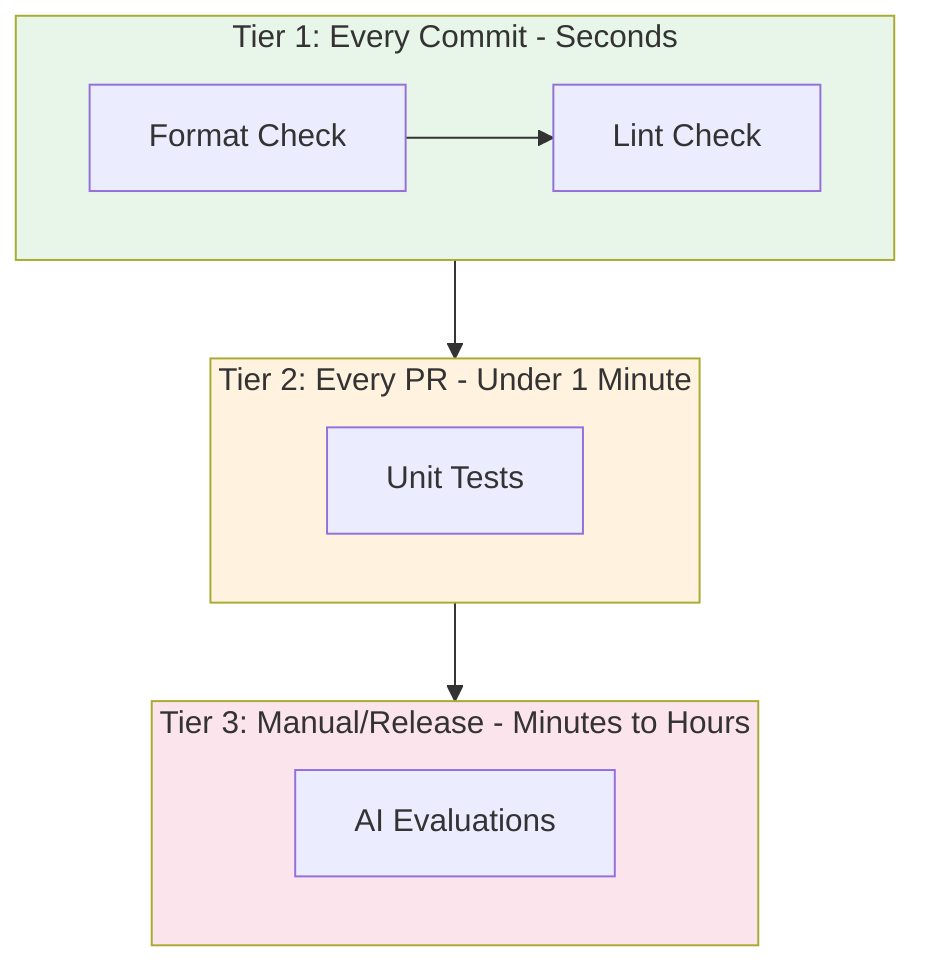

# Research

## Research Results

<details>
<summary>What are best practices for unit testing LLM-based applications without making live API calls?</summary>

### Source [3]: https://brightsec.com/blog/unit-testing-best-practices/

Query: What are best practices for unit testing LLM-based applications without making live API calls?

Answer: General unit testing best practices applicable to LLM apps emphasize avoiding live API calls. Key practices include: Write readable, simple tests for easier maintenance; ensure deterministic tests; test one scenario per test to isolate issues; automate tests; write isolated tests using test doubles like mocks or stubs to simulate components without real dependencies; avoid test interdependence; explicitly avoid active API calls by using mocks; combine with integration testing; ensure tests are repeatable and scalable; test boundary conditions, corner cases, and security issues. Use the testing pyramid with most tests at unit level for speed and stability.

-----

</details>

<details>
<summary>How does GitHub Actions CI parallelize jobs and why is it beneficial for build times?</summary>

### Source [6]: https://dev.to/cicube/how-to-run-jobs-in-parallel-with-github-actions-4png

Query: How does GitHub Actions CI parallelize jobs and why is it beneficial for build times?

Answer: GitHub Actions parallelizes jobs by allowing independent jobs to run simultaneously without dependencies, reducing overall build time. For example, in a Rust workflow, the 'test' job and 'lint' job start at the same time. The matrix strategy further parallelizes by running the same job across multiple configurations like different OS environments (ubuntu-latest, macos-latest, windows-latest), creating multiple job instances that execute in parallel. Each job runs on its own runner. Dependencies can be defined using `jobs.<job-id>.needs`, ensuring dependent jobs wait for prerequisites to complete, skipping unnecessary work if earlier jobs fail, which saves resources and reduces debugging time. Caching, like rust-cache, speeds up subsequent builds. This setup optimizes CI/CD pipelines for larger projects by minimizing total workflow duration and isolating tasks for easier debugging.

-----

-----

### Source [7]: https://docs.github.com/articles/getting-started-with-github-actions

Query: How does GitHub Actions CI parallelize jobs and why is it beneficial for build times?

Answer: GitHub Actions workflows contain one or more jobs that can run in sequential order or in parallel. By default, jobs have no dependencies and run in parallel, each on its own virtual machine runner or container. Job dependencies are configured explicitly; a dependent job waits for the specified jobs to complete before starting. A matrix strategy runs the same job multiple times with different variable combinations, such as operating systems or language versions, effectively parallelizing across variations. For instance, multiple build jobs for different architectures can run in parallel without dependencies, followed by a packaging job that depends on all builds completing successfully. This parallel execution enables faster workflow completion by processing independent tasks concurrently.

-----

-----

### Source [8]: https://docs.github.com/actions/writing-workflows/choosing-what-your-workflow-does/running-variations-of-jobs-in-a-workflow

Query: How does GitHub Actions CI parallelize jobs and why is it beneficial for build times?

Answer: GitHub Actions uses a matrix strategy to parallelize jobs by automatically creating multiple job runs from a single job definition based on combinations of variables. This allows running variations of the same job, such as across different operating systems, environments, or configurations, simultaneously. Each matrix combination executes as a separate job in parallel, provided there are no dependencies specified. This approach efficiently tests or builds across multiple setups without duplicating job definitions, reducing overall workflow time by leveraging parallel execution on available runners.

-----

</details>

<details>
<summary>What are the most effective pre-commit hook configurations for a collaborative Python project?</summary>

### Source [10]: https://pre-commit.com

Query: What are the most effective pre-commit hook configurations for a collaborative Python project?

Answer: pre-commit is a framework for managing multi-language pre-commit hooks. Users specify hooks in .pre-commit-config.yaml, where pre-commit handles installation and execution before every commit. Key fields include id, name, entry, and language. Install with 'pre-commit install' to set up git hooks, or 'pre-commit install --install-hooks --overwrite' for idempotent replacement. Use '--hook-type' for specific git hooks like pre-commit, pre-push. Run hooks with 'pre-commit run [hook-id]' options: --all-files for all repo files, --files for specific files, --verbose for output. Examples: 'pre-commit run --all-files' for CI, 'pre-commit run flake8' for specific hook. Supports git hooks: commit-msg (validates commit message), pre-commit (checks staged files, stashes unstaged), prepare-commit-msg, post-checkout, post-commit, post-merge, post-rewrite, pre-merge-commit, pre-push, pre-rebase. Pass args to hooks in config, e.g., repo: https://github.com/PyCQA/flake8, hooks: - id: flake8, args: [--max-line-length=131]. Custom local hooks require id, name, language, entry, files/types. pre-commit runs only on staged files to avoid false positives/negatives.

-----

-----

### Source [11]: https://github.com/pre-commit/pre-commit-hooks

Query: What are the most effective pre-commit hook configurations for a collaborative Python project?

Answer: pre-commit-hooks provides out-of-the-box hooks useful for Python projects. Relevant hooks: check-ast (verifies Python files parse as valid Python), check-builtin (disallows builtin name use as variables, allows constructors like list('abc'), builtins.list(), ignore specific types), check-shebang-scripts-are-executable (ensures shebang scripts are executable), check-symlinks (detects broken symlinks), check-toml/check-xml/check-yaml (verify syntax of TOML/XML/YAML files; YAML options: --allow-multiple-documents, --unsafe for syntax-only), no-commit-to-branch (protects branches like main/master from direct commits, configure with args: [--branch, staging, --branch, main]). Deprecated: check-byte-order-marker (use fix-byte-order-marker), fix-encoding-pragma (use pyupgrade). Install standalone via 'pip install pre-commit-hooks'. Integrate into .pre-commit-config.yaml under repos.

-----

-----

### Source [13]: https://pycqa.github.io/isort/docs/configuration/pre-commit.html

Query: What are the most effective pre-commit hook configurations for a collaborative Python project?

Answer: isort provides official pre-commit integration for Python import sorting. Add to .pre-commit-config.yaml: repos: - repo: https://github.com/PyCQA/isort, rev: 5.13.2 (use latest), hooks: - id: isort. This runs isort as a pre-commit hook to automatically sort imports in Python files before commits, ensuring consistent code style in collaborative projects.

-----

</details>

<details>
<summary>What is the recommended baseline set of Ruff linting rules for a production Python application?</summary>

### Source [16]: https://docs.astral.sh/ruff/linter/

Query: What is the recommended baseline set of Ruff linting rules for a production Python application?

Answer: Ruff's linter uses Flake8-style rule codes (e.g., F401 or prefix F). Recommended configuration guidelines include preferring lint.select over lint.extend-select for explicit rule sets, using ALL with discretion as it enables all rules and auto-disables conflicts. Ruff prioritizes CLI options over config files, using highest-priority select as base then applying extend-select and ignore. Configuration via pyproject.toml or ruff.toml allows selecting rules by code or prefix (e.g., E for pycodestyle, F for Pyflakes). Ignore rules globally via lint.ignore, per-file via lint.per-file-ignores, or inline with # ruff: noqa, disable/enable comments for ranges with matching codes and indentation.

-----

-----

### Source [18]: https://docs.astral.sh/ruff/rules/

Query: What is the recommended baseline set of Ruff linting rules for a production Python application?

Answer: Ruff supports over 800 lint rules, inspired by tools like Flake8, isort, pyupgrade, and others. Rules are organized by categories with codes for selection in configuration.

-----

-----

### Source [29]: https://docs.astral.sh/ruff/linter/

Query: What is the recommended baseline set of Ruff linting rules for a production Python application?

Answer: Ruff's linter uses Flake8-style rule codes (e.g., F401, prefixes like F). Configuration example enables all E (pycodestyle) and F (Pyflakes) rules except F401. Ruff disables conflicting rules when ALL is enabled. Recommended guidelines: Prefer lint.select over lint.extend-select for explicit rule sets; use ALL with discretion. Ruff prioritizes highest-priority select, then applies extend-select and ignore from pyproject.toml, inherited files, or CLI (--select). Fixes can be safe (e.g., F601) or unsafe (demoted for UP034), promoted via --fix --safe or prefixes like F. Inline disable/enable comments like # ruff: disable[E741, F841] and matching enable.

-----

</details>

<details>
<summary>How can CI/CD pipelines be configured to handle costly, long-running AI model evaluations selectively?</summary>

### Source [19]: https://circleci.com/blog/enhancing-ai-model-experimentation-with-multiple-ci-cd-pipelines/

Query: How can CI/CD pipelines be configured to handle costly, long-running AI model evaluations selectively?

Answer: CI/CD pipelines can be configured with multiple parallel pipelines to handle costly, long-running AI model evaluations selectively by splitting tasks like data preprocessing, model training, and evaluation into separate pipelines for each model or configuration. This enables parallel execution of preprocessing, training, and evaluation for multiple models simultaneously, drastically reducing overall experiment time compared to sequential single pipelines where each job waits for the previous one. For example, in a project testing four models, sequential processing in one pipeline takes longer, but multiple pipelines allow all processes to run in parallel, maximizing CI/CD system capabilities and supporting quick iterations for hyperparameter tuning. Sequential pipelines like preprocess_data_A → train_model_A → evaluate_model_A ensure smooth execution but are slow for experimentation with many models due to dependencies and waiting. Multiple pipelines avoid these risks, improve efficiency, enable safer testing of model versions without interference, and optimize resource allocation by focusing on tasks concurrently.

-----

-----

### Source [21]: https://www.deepchecks.com/llm-evaluation/ci-cd-pipelines/

Query: How can CI/CD pipelines be configured to handle costly, long-running AI model evaluations selectively?

Answer: CI/CD pipelines manage costly, long-running LLM evaluations selectively through automation at pipeline stages: unit tests for small-scale outputs, functional tests for scenarios, and load testing for stability, using tools like Deepchecks, Arize AI, OpenAI Evals, Hugging Face Evaluate for metrics, and monitoring with Grafana/Prometheus. Optimize by evaluating relative to previous models or data samples instead of full evaluations, leveraging lightweight mini/distilled models for quick performance checks, cloud solutions like AWS/Azure/Google Cloud for scalable on-demand resources, A/B testing for version comparison, and automated retraining triggers based on new data, feedback, or performance drops. This reduces computational burden, ensures quality at integration points, identifies issues early, and maintains efficiency without exhaustive runs every time.

-----

-----

### Source [22]: https://www.telusdigital.com/insights/data-and-ai/article/continuous-evaluation-of-generative-ai-using-ci-cd-pipelines

Query: How can CI/CD pipelines be configured to handle costly, long-running AI model evaluations selectively?

Answer: CI/CD pipelines enable continuous evaluation of generative AI by automating checks for unexpected or undesired changes in LLMs, allowing selective handling of long-running evaluations through structured automation that focuses on key changes rather than comprehensive runs.

-----

</details>

<details>
<summary>What are industry-standard patterns for mocking LLM responses in Python unit tests, especially within frameworks like LangChain or LlamaIndex?</summary>

### Source [25]: https://docs.langchain.com/oss/python/langchain/test

Query: What are industry-standard patterns for mocking LLM responses in Python unit tests, especially within frameworks like LangChain or LlamaIndex?

Answer: LangChain provides industry-standard patterns for mocking LLM responses in Python unit tests through in-memory stubs that avoid API calls. The primary tool is **GenericFakeChatModel**, which mocks text responses by accepting an iterator of responses such as AIMessages or strings, returning one per invocation. It supports both regular and streaming usage. For example:

```python
from langchain_core.language_models.fake_chat_models import GenericFakeChatModel

model = GenericFakeChatModel(messages=iter([
    AIMessage(content="", tool_calls=[ToolCall(name="foo", args={"bar": "baz"}, id="call_1")]),
    "bar"
]))

model.invoke("hello")
# Returns: AIMessage(content='', ..., tool_calls=[{'name': 'foo', 'args': {'bar': 'baz'}, 'id': 'call_1', 'type': 'tool_call'}])
```
Invoking the model again returns the next item in the iterator. This approach is ideal for testing logic without external dependencies, ensuring fast and reliable unit tests for chat model interactions.

-----

-----

### Source [26]: https://milvus.io/ai-quick-reference/how-do-i-handle-errors-and-exceptions-in-llamaindex-workflows

Query: What are industry-standard patterns for mocking LLM responses in Python unit tests, especially within frameworks like LangChain or LlamaIndex?

Answer: In LlamaIndex workflows, unit tests with mocked failures use Python's **unittest.mock** to simulate API outages and validate error-handling logic. This pattern is recommended for testing resilience in components like data loading, indexing, query execution, and LLM API calls. Mocking simulates exceptions such as **APIError**, **APIConnectionError**, **RateLimitError**, **ValueError**, or **QueryEngineError**. For example, mock external API calls to test retry logic with libraries like **tenacity** or **backoff**, which implement exponential backoff for transient errors. Combine with **try-except** blocks, logging (e.g., **logging** or **structlog**), and fallbacks like local caches. Defensive coding validates inputs upfront (file existence, permissions, URL accessibility). For async operations, catch exceptions in **async with** and **try** contexts. This mocking approach ensures robust testing of error-prone stages like data ingestion and external interactions without real API dependencies.

-----

</details>

<details>
<summary>How can CI/CD pipelines be configured to handle costly, long-running AI model evaluations selectively, such as using manual triggers or scheduled runs?</summary>

### Source [31]: https://dev.to/kuldeep_paul/a-practical-guide-to-integrating-ai-evals-into-your-cicd-pipeline-3mlb

Query: How can CI/CD pipelines be configured to handle costly, long-running AI model evaluations selectively, such as using manual triggers or scheduled runs?

Answer: CI/CD pipelines for AI evals can handle costly, long-running evaluations selectively by creating subsets for fast PR gates like smoke tests and full suites for nightly runs. Run smoke evals on every PR to fail builds on threshold violations quickly, while reserving comprehensive scenario-based simulations and full test suites for scheduled nightly runs or before merging major changes. This includes building datasets reflecting key scenarios, executing end-to-end workflows, scoring with deterministic checks, statistical metrics, and LLM-as-a-judge, then applying thresholds. For pre-release, simulate agents across personas and perturbations. Step 1: Define test suite with representative cases, fast PR subsets, and full nightly suites sourced from production logs. Step 4: Run scenario-based simulations pre-release for multi-turn behavior. Step 6: Close loop with data curation from production for targeted evals. Use versioning for prompts, evaluators, datasets; control randomness with rubrics and aggregates. Overall pipeline: smoke evals on PRs, full runs periodically.

-----

-----

### Source [33]: https://www.deepchecks.com/llm-evaluation/ci-cd-pipelines/

Query: How can CI/CD pipelines be configured to handle costly, long-running AI model evaluations selectively, such as using manual triggers or scheduled runs?

Answer: Configure CI/CD for selective costly evaluations by automating tests at pipeline stages: unit tests for small-scale outputs, functional tests for scenarios, and load testing for stability, using evaluation platforms like Deepchecks, Arize AI, OpenAI Evals, Hugging Face Evaluate integrated directly. For ongoing assessments, implement A/B testing to deploy and evaluate multiple model versions during real interactions, selecting the best based on engagement. Incorporate real-time user feedback to revise responses. While emphasizing automation after every update, this allows selective deeper evaluations via A/B and user inputs rather than running full costly evals on every change, supplemented by monitoring tools like Grafana and Prometheus for real-time issue detection.

-----

</details>

<details>
<summary>What are the most effective pre-commit hook configurations for a collaborative Python project using modern tools like Ruff and uv?</summary>

### Source [34]: https://github.com/astral-sh/ruff-pre-commit

Query: What are the most effective pre-commit hook configurations for a collaborative Python project using modern tools like Ruff and uv?

Answer: A pre-commit hook for Ruff is provided to run Ruff's linter and formatter. To use it, add the following to .pre-commit-config.yaml:

repos:
- repo: https://github.com/astral-sh/ruff-pre-commit
  rev: v0.14.0
  hooks:
    - id: ruff-check
    - id: ruff-format

To enable lint fixes, add --fix to the linter hook:

repos:
- repo: https://github.com/astral-sh/ruff-pre-commit
  rev: v0.14.0
  hooks:
    - id: ruff-check
      args: [--fix]
    - id: ruff-format

When using --fix, place the lint hook before the formatter hook and before other tools like Black or isort, as fixes may require reformatting. Without --fix, order is flexible if no linter-formatter conflicts exist.

To exclude Jupyter Notebooks, specify file types:

hooks:
  - id: ruff-check
    types_or: [python, pyi]
    args: [--fix]
  - id: ruff-format
    types_or: [python, pyi]

Ruff format after ruff check --fix is safe as it should not introduce new lint errors.

-----

-----

### Source [35]: https://docs.astral.sh/uv/guides/integration/pre-commit/

Query: What are the most effective pre-commit hook configurations for a collaborative Python project using modern tools like Ruff and uv?

Answer: An official pre-commit hook for uv is available at astral-sh/uv-pre-commit. Add to the repos list in .pre-commit-config.yaml to keep uv.lock up to date:

repos:
- repo: https://github.com/astral-sh/uv-pre-commit
  rev: 0.9.26
  hooks:
  - id: uv-export

To compile requirements files:

repos:
- repo: https://github.com/astral-sh/uv-pre-commit
  rev: 0.9.26
  hooks:
  - id: pip-compile
    args: [requirements.in, -o, requirements.txt]

For multiple files with specific patterns:

repos:
- repo: https://github.com/astral-sh/uv-pre-commit
  rev: 0.9.26
  hooks:
  - id: pip-compile
    name: pip-compile requirements.in
    args: [requirements.in, -o, requirements.txt]
  - id: pip-compile
    name: pip-compile requirements-dev.in
    args: [requirements-dev.in, -o, requirements-dev.txt]
    files: ^requirements-dev\.(in|txt)$

-----

</details>

<details>
<summary>How does GitHub Actions CI parallelize jobs, and why is splitting tasks like linting and testing into separate jobs beneficial for build times and developer feedback?</summary>

### Source [39]: https://docs.github.com/actions/using-jobs/using-jobs-in-a-workflow

Query: How does GitHub Actions CI parallelize jobs, and why is splitting tasks like linting and testing into separate jobs beneficial for build times and developer feedback?

Answer: In GitHub Actions, jobs are the primary unit for parallelization in workflows. By default, jobs with no dependencies run in parallel. You can configure a job's dependencies using the 'needs' keyword, where a job waits for its dependent jobs to complete before running. For example, multiple build jobs for different architectures can run in parallel without dependencies, and a subsequent packaging job depends on all builds completing successfully. The build jobs execute concurrently, reducing overall workflow time. You can also use a matrix strategy to run the same job multiple times in parallel with different variable combinations, such as operating systems or language versions. This enables efficient testing across environments simultaneously. Jobs are defined under the 'jobs' key in the workflow YAML file, and each job runs on a separate runner. Understanding job execution order and dependencies is key to optimizing workflows for speed and reliability.

-----

-----

### Source [40]: https://docs.github.com/articles/getting-started-with-github-actions

Query: How does GitHub Actions CI parallelize jobs, and why is splitting tasks like linting and testing into separate jobs beneficial for build times and developer feedback?

Answer: GitHub Actions workflows consist of jobs that run in parallel by default if no dependencies are specified. You configure job dependencies with the 'needs' keyword; dependent jobs wait for prerequisites to complete. For instance, multiple build jobs for different architectures run concurrently, and a packaging job runs only after all builds succeed. This parallel execution of independent jobs shortens total workflow duration. Additionally, a matrix can replicate a job multiple times with varying inputs like OS or versions, allowing parallel testing across configurations. The example illustrates build jobs parallelizing, followed by sequential packaging upon success.

-----

-----

### Source [41]: https://www.testmo.com/guides/github-actions-parallel-testing/

Query: How does GitHub Actions CI parallelize jobs, and why is splitting tasks like linting and testing into separate jobs beneficial for build times and developer feedback?

Answer: GitHub Actions parallelizes CI jobs, particularly for testing, using the 'strategy' setting with a matrix to run multiple instances of a job concurrently. For example, define 'matrix: ci_index: [0,1,2,3]' to launch four parallel 'test' jobs, each receiving environment variables like CI_INDEX and CI_TOTAL to identify their instance. Disable 'fail-fast: false' to ensure all instances complete even if one fails. Each parallel job executes a subset of tests (e.g., via a split script selecting files by index), covering the full suite across instances without duplication. This reduces build times significantly. Use 'needs' for job ordering: 'build' runs first, then parallel 'test' jobs, followed by 'deploy' only if all succeed. Benefits include faster feedback to developers and QA, quicker releases, and shorter wait times without reducing test coverage. Additional 'test-setup' and 'test-complete' jobs handle reporting, always running for completion even on failure.

-----

-----

### Source [42]: https://docs.github.com/actions/writing-workflows/choosing-what-your-workflow-does/control-the-concurrency-of-workflows-and-jobs

Query: How does GitHub Actions CI parallelize jobs, and why is splitting tasks like linting and testing into separate jobs beneficial for build times and developer feedback?

Answer: GitHub Actions allows multiple jobs to run concurrently by default. The 'concurrency' keyword controls this, ensuring only one workflow or job with a specific key runs at a time, canceling others if needed. For parallelization, omit concurrency or set it to allow multiples. Examples show concurrency groups like 'ci-${{ github.ref }}' for branch-specific runs, but default behavior supports parallel jobs. This setup prevents resource conflicts in scenarios like deployments while permitting parallelism elsewhere.

-----

</details>

<details>
<summary>What are the best practices for structuring a pyproject.toml file for a modern Python project that includes configurations for uv, Ruff, and pytest?</summary>

### Source [43]: https://betterstack.com/community/guides/scaling-python/pyproject-explained/

Query: What are the best practices for structuring a pyproject.toml file for a modern Python project that includes configurations for uv, Ruff, and pytest?

Answer: The pyproject.toml file uses TOML format for easy readability and is a declarative specification, unlike executable setup.py, reducing security issues and ensuring consistency. For Ruff, configure under [tool.ruff] with settings like line-length = 88, target-version = 'py38', and exclude patterns for files. Example: [tool.ruff] line-length = 88 target-version = 'py38' exclude = ['.git', 'build', 'dist'] [tool.ruff.mccabe] max-complexity = 10 [tool.ruff.per-file-ignores] 'tests/**' = ['S101'] For stricter type checking, use [tool.ruff] select = ['E', 'F', 'B'] ignore = ['E501'] [tool.ruff.mccabe] max-complexity = 10 [tool.ruff.isort] known-first-party = ['pyproject_demo'] Enable autofix with fixable = ['ALL'] and dummy-variable-rgx for unused variables. Ruff unifies linting, replacing multiple linters. For dynamic versioning, set [project] dynamic = ['version'] and [tool.setuptools.dynamic] version = {attr = 'pyproject_demo._version.__version__'}, referencing a __version__ in a module. Benefits include single source of truth, reduced cognitive load, easier onboarding, and version control efficiency. Most modern tools support pyproject.toml for centralized configuration.

-----

-----

### Source [44]: https://realpython.com/python-pyproject-toml/

Query: What are the best practices for structuring a pyproject.toml file for a modern Python project that includes configurations for uv, Ruff, and pytest?

Answer: The pyproject.toml unifies package setup, dependencies, and builds. Use [build-system] requires = ["setuptools", "setuptools-scm"] build-backend = "setuptools.build_meta" for setuptools. Define [project] with name, version, description, authors, requires-python, dependencies. For optional dependencies: [project.optional-dependencies] dev = ["black", "isort", "build", "twine"]. Scripts in [project.scripts] ssay = "snakesay.__main__:main". Dynamic metadata: [tool.setuptools.dynamic] version = {attr = "snakesay.__version__"}. Tool configs: [tool.setuptools.packages.find] where = ["."] [tool.black] line-length = 88 [tool.isort] profile = "black". Classifiers under [project] for Python versions and topics. Use src/ layout for source code to make location explicit and avoid testing issues. For task automation, define Python functions in scripts/ and reference in [project.scripts]. Poetry and tox also use [tool.poetry] and [tool.tox] sections. Install with pip using pyproject.toml handles dev dependencies if specified.

-----

-----

### Source [45]: https://packaging.python.org/en/latest/guides/writing-pyproject-toml/

Query: What are the best practices for structuring a pyproject.toml file for a modern Python project that includes configurations for uv, Ruff, and pytest?

Answer: pyproject.toml configures packaging tools and others like linters. Required [build-system] specifies requires (e.g., ["hatchling"]) and build-backend (e.g., "hatchling.build"). [project] table includes name, version, description, readme, requires-python, license, authors, urls, keywords, classifiers, dependencies. For scripts: [project.scripts] console_scripts = {my_script = "spam:main"}. GUI scripts: [project.gui-scripts]. Entry points: [project.entry-points."spam.magical"] tomatoes = "spam:main_tomatoes". Full example: [build-system] requires = ["hatchling"] build-backend = "hatchling.build" [project] name = "spam-eggs" dynamic = ["version", "description"] ... dependencies = [...] [project.optional-dependencies] docs = [...] test = [...] [project.scripts] ... Supports pytest via [project.optional-dependencies.test].

-----

-----

### Source [46]: https://til.simonwillison.net/python/pyproject

Query: What are the best practices for structuring a pyproject.toml file for a modern Python project that includes configurations for uv, Ruff, and pytest?

Answer: Package projects using single pyproject.toml with pip and build. Use [project.scripts] for console scripts: [project.scripts] demo_package_hello = "demo_package:say_hello" or alternative [project.scripts] db-build = "db_build.cli:cli". Simplifies to no other files needed beyond pyproject.toml for basic packaging.

-----

</details>

<details>
<summary>How does the `uv run` command manage environments and execute scripts compared to traditional tools like `venv` and `pip`?</summary>

### Source [50]: https://www.datacamp.com/tutorial/python-uv

Query: How does the `uv run` command manage environments and execute scripts compared to traditional tools like `venv` and `pip`?

Answer: UV is a modern, high-performance Python package manager and installer written in Rust, serving as a drop-in replacement for traditional tools like pip and virtualenv. Compared to pip and virtualenv, which handle package management and environment creation separately, UV integrates both functionalities into a single tool, streamlining workflows. UV offers 10-100x faster speed due to its Rust implementation, parallel downloads, and optimized dependency resolver, significantly reducing installation times from minutes to seconds. It uses less memory, provides clearer error messages, better conflict resolution, and ensures reproducibility with lockfiles for consistent environments. UV maintains compatibility with requirements.txt and pip's ecosystem. Common pip/virtualenv commands are replaced by UV equivalents, such as using UV for environment creation and package installation without manual activation. After migration, old virtualenv directories can be removed, and UV handles virtual environment management built-in.

-----

-----

### Source [51]: https://devcenter.upsun.com/posts/why-python-developers-should-switch-to-uv/

Query: How does the `uv run` command manage environments and execute scripts compared to traditional tools like `venv` and `pip`?

Answer: UV provides comprehensive project management beyond simple package installation, including built-in virtual environment management with no manual activation required. Traditional workflow with pip and venv involves multiple steps: mkdir, python -m venv venv, source venv/bin/activate, pip install (slow), and pip freeze > requirements.txt. UV transforms this into a streamlined process with automatic project initialization, intelligent dependency tracking separating production and dev packages, and Python version management. Compared to pip, UV offers ultra-fast installation speed (seconds vs minutes), advanced dependency resolution, automatic virtual environments, auto-generated project structure, and clean pyproject.toml instead of bloated requirements.txt. UV run ensures the environment is in sync with dependencies, replacing manual venv activation and pip install. Commands like uv sync --frozen ensure reproducible builds with locked dependencies.

-----

-----

### Source [52]: https://lerner.co.il/2025/08/28/youre-probably-using-uv-wrong/

Query: How does the `uv run` command manage environments and execute scripts compared to traditional tools like `venv` and `pip`?

Answer: In traditional venv-based projects, the workflow involves activating the venv, pip install, running the script, and then deactivating the venv. In contrast, with UV, dependencies are added to pyproject.toml using uv add, and scripts are executed with 'uv run' without manual activation or deactivation. The venv is still used underneath, but its management is hidden from the user, simplifying the process significantly.

-----

-----

### Source [53]: https://docs.astral.sh/uv/pip/environments/

Query: How does the `uv run` command manage environments and execute scripts compared to traditional tools like `venv` and `pip`?

Answer: UV requires using a virtual environment, unlike pip which does not enforce it. A virtual environment isolates packages from the Python installation's environment. UV manages environments to ensure isolation during package installation and script execution.

-----

-----

### Source [54]: https://www.youtube.com/watch?v=flAneKTg8Nk

Query: How does the `uv run` command manage environments and execute scripts compared to traditional tools like `venv` and `pip`?

Answer: UV replaces pip + venv workflows with faster, cleaner setup using commands like uv init, uv add, and uv run. Traditional setup requires python -m venv and pip install with manual activation. UV handles environments, dependencies, and Python versions automatically. 'uv run' executes scripts in sync with all dependencies, replacing virtual environments and pip install processes. It provides a single tool for solo developers, faster installs, and built-in Python management, demonstrated by building projects like a FastAPI app without manual venv handling.

-----

</details>

<details>
<summary>What are the most effective pre-commit hooks for ensuring code quality in a collaborative Python project, specifically for validating config files like YAML and pyproject.toml?</summary>

### Source [55]: https://talkpython.fm/episodes/show/482/pre-commit-hooks-for-python-devs

Query: What are the most effective pre-commit hooks for ensuring code quality in a collaborative Python project, specifically for validating config files like YAML and pyproject.toml?

Answer: Implementing and customizing pre-commit hooks in Python workflows ensures code consistency and developer efficiency by running checks before commits, catching formatting or logic issues early, and reducing code review friction. Install the pre-commit Python package and add a .pre-commit-config.yaml file. Prefer hooks that automatically fix issues, like adding missing trailing commas, to reduce busywork and prevent bypassing. Examples include an EXIF stripper hook that removes sensitive metadata from images (GPS coordinates, photographer details) to prevent data leaks and reduce file size. Combine pre-commit with CI, such as GitHub Actions, to run the same hooks in pull requests, ensuring team-wide consistency and avoiding merge surprises. Hooks enforce best practices early, from validating docstrings to stripping metadata, saving time and preventing errors in collaborative Python projects.

-----

-----

### Source [56]: https://dev.to/techishdeep/maximize-your-python-efficiency-with-pre-commit-a-complete-but-concise-guide-39a5

Query: What are the most effective pre-commit hooks for ensuring code quality in a collaborative Python project, specifically for validating config files like YAML and pyproject.toml?

Answer: Pre-commit ensures code quality in Python projects by running checks before commits via a .pre-commit-config.yaml file listing hooks; failed checks reject the commit. It enforces consistent style, detects syntax errors, and security vulnerabilities, integrating with linters, formatters, and static analysis. Example configuration: repo: https://github.com/PyCQA/flake8, rev: 3.9.2, hooks: - id: flake8 with args like --max-line-length=88, --ignore=E203,E501,W503, linting Python files for common errors. Customize existing hooks by adjusting severity, ignoring files/directories. Create custom hooks by defining name, script/command, arguments, e.g., checking specific comments. Benefits: improved code quality, consistency, readability, best practices. Integrate with CI (Jenkins, Travis CI, pre-commit.ci) to run hooks on changes, preventing merges of failing code. Use virtual environments for consistent tool versions, configure hooks for specific files to optimize performance and reduce build times.

-----

-----

### Source [57]: https://mlops-coding-course.fmind.dev/5.%20Refining/5.2.%20Pre-Commit%20Hooks.html

Query: What are the most effective pre-commit hooks for ensuring code quality in a collaborative Python project, specifically for validating config files like YAML and pyproject.toml?

Answer: For Python-based MLOps projects, a robust pre-commit-config.yaml includes hooks for code quality, formatting, and security using tools like Ruff. Use commit-msg hook (runs after pre-commit, before finalizing) to validate commit messages, e.g., enforcing Conventional Commits format. Best practices: Keep hooks fast (seconds ideal; linters/formatters good, full tests too slow). Pin dependencies with exact rev in .pre-commit-config.yaml for consistent tool versions across team, avoiding 'works on my machine' issues. Collaborate on configuration as a team decision for buy-in and standards. Balance local pre-commit with CI/CD for enforcement.

-----

-----

### Source [58]: https://pre-commit.com

Query: What are the most effective pre-commit hooks for ensuring code quality in a collaborative Python project, specifically for validating config files like YAML and pyproject.toml?

Answer: pre-commit runs hooks before commit finalization on staged files only (stashes unstaged changes to avoid false-positives/negatives), pointing out issues like missing semicolons, trailing whitespace, debug statements. Pass arguments to hooks via args in .pre-commit-config.yaml, e.g., repo: https://github.com/PyCQA/flake8, rev: 4.0.1, hooks: - id: flake8, args: [--max-line-length=131]. Also supports prepare-commit-msg git hook. Effective for collaborative Python projects to automatically enforce code quality standards before commits.

-----

-----

### Source [59]: https://kinsta.com/blog/git-hooks/

Query: What are the most effective pre-commit hooks for ensuring code quality in a collaborative Python project, specifically for validating config files like YAML and pyproject.toml?

Answer: Pre-commit hooks run before finalizing commits to enforce code styles, run tests, or check syntax errors, ideal for catching issues early in collaborative projects. Choose hooks compatible with your environment and tools. Example: Implement pre-commit hook to run tests (e.g., Jest for JS, adaptable to Python pytest) before commit to ensure only passing code is committed, maintaining quality.

-----

</details>

<details>
<summary>What are the key differences and advantages of using GitHub Actions' `setup-uv` action compared to the standard `setup-python` action for Python CI workflows?</summary>

### Source [61]: https://docs.astral.sh/uv/guides/integration/github/

Query: What are the key differences and advantages of using GitHub Actions' `setup-uv` action compared to the standard `setup-python` action for Python CI workflows?

Answer: The `astral-sh/setup-uv` action installs uv and can manage Python versions directly using `uv python install`, which respects the Python version pinned in the project. Alternatively, it recommends using the official `actions/setup-python` action first for faster Python installation because GitHub caches Python versions alongside the runner. Examples include setting `python-version-file: ".python-version"` or `pyproject.toml` with `setup-python` before `setup-uv` to use project-pinned versions or latest compatible with `requires-python`. For matrix testing, `setup-uv` supports `with: python-version: ${{ matrix.python-version }}` to install specific Python versions. Without `setup-uv`, set `UV_PYTHON` environment variable for Python version. After setup, use `uv sync --locked --all-extras --dev` to install project and `uv run` for commands. `setup-uv` enables best practices like pinning uv version (e.g., `version: "0.9.26"`). Using `setup-python` before `setup-uv` leverages GitHub's runner-side caching for speed, while `setup-uv` alone handles both uv and Python installation in one step.

-----

-----

### Source [62]: https://github.com/astral-sh/setup-uv/issues/724

Query: What are the key differences and advantages of using GitHub Actions' `setup-uv` action compared to the standard `setup-python` action for Python CI workflows?

Answer: GitHub Actions uses different caching mechanisms for `setup-python` and `setup-uv`. `setup-python` benefits from a cache 'alongside the runner', making it faster for Python installation. `setup-uv` uses a different cache mechanism. This difference highlights a potential speed gain for Python setup with `setup-python` compared to `setup-uv`.

-----

-----

### Source [63]: https://github.com/astral-sh/setup-uv/issues/197

Query: What are the key differences and advantages of using GitHub Actions' `setup-uv` action compared to the standard `setup-python` action for Python CI workflows?

Answer: There is ambiguity in the `setup-uv` FAQs README about whether to use `actions/setup-python`. The first FAQ answer suggests avoiding `actions/setup-python` and using uv-managed Python via `setup-uv` instead. This implies `setup-uv` can fully handle Python setup without needing `setup-python`, positioning it as a more integrated alternative for uv-based workflows.

-----

</details>

<details>
<summary>What are common strategies for managing and versioning datasets used for AI model evaluations within a CI/CD framework?</summary>

### Source [64]: https://dev.to/kuldeep_paul/a-practical-guide-to-integrating-ai-evals-into-your-cicd-pipeline-3mlb

Query: What are common strategies for managing and versioning datasets used for AI model evaluations within a CI/CD framework?

Answer: Common strategies for managing and versioning datasets in AI model evaluations within CI/CD include building datasets reflecting key scenarios from offline corpora, synthetic simulations, and samples curated from production logs. Create subsets for fast PR gates like smoke tests and full suites for nightly runs. Source hard cases from production logs via observability and promote them into datasets for regression prevention using data curation workflows. Continuously curate eval datasets from production failures and edge cases, enrich with human feedback, and re-run targeted evaluations in an observe-curate-evaluate-ship loop. Maxim’s workflows support human + LLM-in-the-loop evals and dataset versioning across modalities. This ensures test suites stay representative of real usage over time, with unified evaluation frameworks combining programmatic checks, statistical metrics, and LLM-as-a-judge rubrics.

-----

-----

### Source [65]: https://wandb.ai/team-jdoc/wandb-webinar-cicd-2024/reports/Optimizing-CI-CD-model-management-and-evaluation-workflows-with-Weights-Biases--Vmlldzo5NTE1NjE5

Query: What are common strategies for managing and versioning datasets used for AI model evaluations within a CI/CD framework?

Answer: Strategies for managing and versioning datasets in AI model evaluations within CI/CD emphasize dataset tracking to monitor progression and differences in source datasets alongside code repositories. Weights & Biases serves as a system of record to log and share datasets, models, and experiment metrics centrally. Track artifacts by reference with pointers to locally mounted drives or cloud buckets, avoiding full logging to save time. This facilitates collaboration, reproducibility, governance, and observability by tying datasets, configurations, and performance metrics together for model lineage understanding. Supports automations like retraining models in response to data drift through CI/CD workflows with human-in-the-loop data merge reviews.

-----

-----

### Source [67]: https://arize.com/blog/how-to-add-llm-evaluations-to-ci-cd-pipelines/

Query: What are common strategies for managing and versioning datasets used for AI model evaluations within a CI/CD framework?

Answer: Key strategies include using version control for models, data, and CI/CD configurations. Snapshot both model weights and evaluation datasets to ensure every model version is reproducible and evaluated consistently. This extends beyond code to datasets, enabling reliable AI performance in CI/CD pipelines through integrated LLM evaluations combining quantitative and qualitative assessments.

-----

-----

### Source [68]: https://www.datacamp.com/tutorial/ci-cd-for-machine-learning

Query: What are common strategies for managing and versioning datasets used for AI model evaluations within a CI/CD framework?

Answer: Strategies for dataset management in ML CI/CD focus on reproducibility through model and data versioning, alongside codified environments and configurations. This allows models to be rebuilt and retrained exactly the same way, with automated testing of new models before deployment. Integrates with monitoring tools post-deployment, ensuring consistent results via versioned datasets.

-----

</details>


## Sources Scraped From Research Results

<details>
<summary>https://docs.github.com/actions/writing-workflows/choosing-what-your-workflow-does/running-variations-of-jobs-in-a-workflow</summary>

The provided markdown content discusses advanced GitHub Actions features like matrix strategies, `fail-fast`, `continue-on-error`, and `max-parallel`. While these are relevant to CI, they are outside the specific scope and outline provided in the `article_guidelines` for this particular lesson. The guidelines explicitly focus on a walkthrough of the *repo's specific* `.github/workflows/ci.yml` and its components (triggers, specific jobs for QA and tests, and specific commands used). The content about matrix strategies, etc., is not mentioned as part of the lesson's core instruction or its "In scope" items. Therefore, it is considered irrelevant to the *specific* lesson context and should be removed.

</details>

<details>
<summary>https://docs.github.com/actions/using-jobs/using-jobs-in-a-workflow</summary>

# Using jobs in a workflow

## Prerequisites

To implement jobs in your workflows, you need to understand what jobs are. See [Understanding GitHub Actions](https://docs.github.com/en/actions/get-started/understanding-github-actions#jobs).

## Setting an ID for a job

Use `jobs.<job_id>` to give your job a unique identifier. The key `job_id` is a string and its value is a map of the job's configuration data. You must replace `<job_id>` with a string that is unique to the `jobs` object. The `<job_id>` must start with a letter or `_` and contain only alphanumeric characters, `-`, or `_`.

### Example: Creating jobs

In this example, two jobs have been created, and their `job_id` values are `my_first_job` and `my_second_job`.

```yaml
jobs:
  my_first_job:
    name: My first job
  my_second_job:
    name: My second job
```

## Setting a name for a job

Use `jobs.<job_id>.name` to set a name for the job, which is displayed in the GitHub UI.

## Defining prerequisite jobs

Use `jobs.<job_id>.needs` to identify any jobs that must complete successfully before this job will run. It can be a string or array of strings. If a job fails or is skipped, all jobs that need it are skipped unless the jobs use a conditional expression that causes the job to continue. If a run contains a series of jobs that need each other, a failure or skip applies to all jobs in the dependency chain from the point of failure or skip onwards. If you would like a job to run even if a job it is dependent on did not succeed, use the `always()` conditional expression in `jobs.<job_id>.if`.

### Example: Requiring successful dependent jobs

```yaml
jobs:
  job1:
  job2:
    needs: job1
  job3:
    needs: [job1, job2]
```

In this example, `job1` must complete successfully before `job2` begins, and `job3` waits for both `job1` and `job2` to complete.

The jobs in this example run sequentially:

1. `job1`
2. `job2`
3. `job3`

### Example: Not requiring successful dependent jobs

```yaml
jobs:
  job1:
  job2:
    needs: job1
  job3:
    if: ${{ always() }}
    needs: [job1, job2]
```

In this example, `job3` uses the `always()` conditional expression so that it always runs after `job1` and `job2` have completed, regardless of whether they were successful. For more information, see [Evaluate expressions in workflows and actions](https://docs.github.com/en/actions/learn-github-actions/expressions#status-check-functions).

## Using a matrix to run jobs with different variables

To automatically run a job with different combinations of variables, such as operating systems or language versions, define a `matrix` strategy in your workflow.

For more information, see [Running variations of jobs in a workflow](https://docs.github.com/en/actions/how-tos/writing-workflows/choosing-what-your-workflow-does/running-variations-of-jobs-in-a-workflow).

</details>

<details>
<summary>https://docs.astral.sh/uv/guides/integration/github/</summary>

The provided markdown content is an external reference about "Using uv in GitHub Actions," which the article guidelines specify as an *optional "golden source" for learners who want to adapt CI*, rather than core instructional content for the lesson itself. The lesson's core content for GitHub Actions involves walking through a *repo-specific* `ci.yml` file.

Therefore, this entire content is considered an "irrelevant section" in the context of the lesson's core content.

</details>

<details>
<summary>https://docs.langchain.com/oss/python/langchain/test</summary>

Agentic applications let an LLM decide its own next steps to solve a problem. That flexibility is powerful, but the model’s black-box nature makes it hard to predict how a tweak in one part of your agent will affect the rest. To build production-ready agents, thorough testing is essential.There are a few approaches to testing your agents:

- Unit tests exercise small, deterministic pieces of your agent in isolation using in-memory fakes so you can assert exact behavior quickly and deterministically.
- Integration tests test the agent using real network calls to confirm that components work together, credentials and schemas line up, and latency is acceptable.

Agentic applications tend to lean more on integration because they chain multiple components together and must deal with flakiness due to the nondeterministic nature of LLMs.

## Unit testing

### Mocking chat model

For logic not requiring API calls, you can use an in-memory stub for mocking responses.LangChain provides [`GenericFakeChatModel`](https://python.langchain.com/api_reference/core/language_models/langchain_core.language_models.fake_chat_models.GenericFakeChatModel.html) for mocking text responses. It accepts an iterator of responses (AIMessages or strings) and returns one per invocation. It supports both regular and streaming usage.

```
from langchain_core.language_models.fake_chat_models import GenericFakeChatModel

model = GenericFakeChatModel(messages=iter([\
    AIMessage(content="", tool_calls=[ToolCall(name="foo", args={"bar": "baz"}, id="call_1")]),\
    "bar"\
]))

model.invoke("hello")
# AIMessage(content='', ..., tool_calls=[{'name': 'foo', 'args': {'bar': 'baz'}, 'id': 'call_1', 'type': 'tool_call'}])
```

If we invoke the model again, it will return the next item in the iterator:

```
model.invoke("hello, again!")
# AIMessage(content='bar', ...)
```

### InMemorySaver checkpointer

To enable persistence during testing, you can use the [`InMemorySaver`](https://reference.langchain.com/python/langgraph/checkpoints/#langgraph.checkpoint.memory.InMemorySaver) checkpointer. This allows you to simulate multiple turns to test state-dependent behavior:

```
from langgraph.checkpoint.memory import InMemorySaver

agent = create_agent(
    model,
    tools=[],
    checkpointer=InMemorySaver()
)

# First invocation
agent.invoke(HumanMessage(content="I live in Sydney, Australia."))

# Second invocation: the first message is persisted (Sydney location), so the model returns GMT+10 time
agent.invoke(HumanMessage(content="What's my local time?"))
```

## Integration testing

Many agent behaviors only emerge when using a real LLM, such as which tool the agent decides to call, how it formats responses, or whether a prompt modification affects the entire execution trajectory. LangChain’s [`agentevals`](https://github.com/langchain-ai/agentevals) package provides evaluators specifically designed for testing agent trajectories with live models.AgentEvals lets you easily evaluate the trajectory of your agent (the exact sequence of messages, including tool calls) by performing a **trajectory match** or by using an **LLM judge**: [**Trajectory match** \
\
Hard-code a reference trajectory for a given input and validate the run via a step-by-step comparison.Ideal for testing well-defined workflows where you know the expected behavior. Use when you have specific expectations about which tools should be called and in what order. This approach is deterministic, fast, and cost-effective since it doesn’t require additional LLM calls.](https://docs.langchain.com/oss/python/langchain/test#trajectory-match-evaluator) [**LLM-as-judge** \
\
Use a LLM to qualitatively validate your agent’s execution trajectory. The “judge” LLM reviews the agent’s decisions against a prompt rubric (which can include a reference trajectory).More flexible and can assess nuanced aspects like efficiency and appropriateness, but requires an LLM call and is less deterministic. Use when you want to evaluate the overall quality and reasonableness of the agent’s trajectory without strict tool call or ordering requirements.](https://docs.langchain.com/oss/python/langchain/test#llm-as-judge-evaluator)

### Installing AgentEvals

```
pip install agentevals
```

Or, clone the [AgentEvals repository](https://github.com/langchain-ai/agentevals) directly.

### Trajectory match evaluator

AgentEvals offers the `create_trajectory_match_evaluator` function to match your agent’s trajectory against a reference trajectory. There are four modes to choose from:

| Mode | Description | Use Case |
| --- | --- | --- |
| `strict` | Exact match of messages and tool calls in the same order | Testing specific sequences (e.g., policy lookup before authorization) |
| `unordered` | Same tool calls allowed in any order | Verifying information retrieval when order doesn’t matter |
| `subset` | Agent calls only tools from reference (no extras) | Ensuring agent doesn’t exceed expected scope |
| `superset` | Agent calls at least the reference tools (extras allowed) | Verifying minimum required actions are taken |

Strict match

The `strict` mode ensures trajectories contain identical messages in the same order with the same tool calls, though it allows for differences in message content. This is useful when you need to enforce a specific sequence of operations, such as requiring a policy lookup before authorizing an action.

```
from langchain.agents import create_agent
from langchain.tools import tool
from langchain.messages import HumanMessage, AIMessage, ToolMessage
from agentevals.trajectory.match import create_trajectory_match_evaluator

@tool
def get_weather(city: str):
    """Get weather information for a city."""
    return f"It's 75 degrees and sunny in {city}."

agent = create_agent("gpt-4o", tools=[get_weather])

evaluator = create_trajectory_match_evaluator(
    trajectory_match_mode="strict",
)

def test_weather_tool_called_strict():
    result = agent.invoke({
        "messages": [HumanMessage(content="What's the weather in San Francisco?")]
    })

    reference_trajectory = [\
        HumanMessage(content="What's the weather in San Francisco?"),\
        AIMessage(content="", tool_calls=[\
            {"id": "call_1", "name": "get_weather", "args": {"city": "San Francisco"}}\
        ]),\
        ToolMessage(content="It's 75 degrees and sunny in San Francisco.", tool_call_id="call_1"),\
        AIMessage(content="The weather in San Francisco is 75 degrees and sunny."),\
    ]

    evaluation = evaluator(
        outputs=result["messages"],
        reference_outputs=reference_trajectory
    )
    # {
    #     'key': 'trajectory_strict_match',
    #     'score': True,
    #     'comment': None,
    # }
    assert evaluation["score"] is True
```

Unordered match

The `unordered` mode allows the same tool calls in any order, which is helpful when you want to verify that specific information was retrieved but don’t care about the sequence. For example, an agent might need to check both weather and events for a city, but the order doesn’t matter.

```
from langchain.agents import create_agent
from langchain.tools import tool
from langchain.messages import HumanMessage, AIMessage, ToolMessage
from agentevals.trajectory.match import create_trajectory_match_evaluator

@tool
def get_weather(city: str):
    """Get weather information for a city."""
    return f"It's 75 degrees and sunny in {city}."

@tool
def get_events(city: str):
    """Get events happening in a city."""
    return f"Concert at the park in {city} tonight."

agent = create_agent("gpt-4o", tools=[get_weather, get_events])

evaluator = create_trajectory_match_evaluator(
    trajectory_match_mode="unordered",
)

def test_multiple_tools_any_order():
    result = agent.invoke({
        "messages": [HumanMessage(content="What's happening in SF today?")]
    })

    # Reference shows tools called in different order than actual execution
    reference_trajectory = [\
        HumanMessage(content="What's happening in SF today?"),\
        AIMessage(content="", tool_calls=[\
            {"id": "call_1", "name": "get_events", "args": {"city": "SF"}},\
            {"id": "call_2", "name": "get_weather", "args": {"city": "SF"}},\
        ]),\
        ToolMessage(content="Concert at the park in SF tonight.", tool_call_id="call_1"),\
        ToolMessage(content="It's 75 degrees and sunny in SF.", tool_call_id="call_2"),\
        AIMessage(content="Today in SF: 75 degrees and sunny with a concert at the park tonight."),\
    ]

    evaluation = evaluator(
        outputs=result["messages"],
        reference_outputs=reference_trajectory,
    )
    # {
    #     'key': 'trajectory_unordered_match',
    #     'score': True,
    # }
    assert evaluation["score"] is True
```

Subset and superset match

The `superset` and `subset` modes match partial trajectories. The `superset` mode verifies that the agent called at least the tools in the reference trajectory, allowing additional tool calls. The `subset` mode ensures the agent did not call any tools beyond those in the reference.

```
from langchain.agents import create_agent
from langchain.tools import tool
from langchain.messages import HumanMessage, AIMessage, ToolMessage
from agentevals.trajectory.match import create_trajectory_match_evaluator

@tool
def get_weather(city: str):
    """Get weather information for a city."""
    return f"It's 75 degrees and sunny in {city}."

@tool
def get_detailed_forecast(city: str):
    """Get detailed weather forecast for a city."""
    return f"Detailed forecast for {city}: sunny all week."

agent = create_agent("gpt-4o", tools=[get_weather, get_detailed_forecast])

evaluator = create_trajectory_match_evaluator(
    trajectory_match_mode="superset",
)

def test_agent_calls_required_tools_plus_extra():
    result = agent.invoke({
        "messages": [HumanMessage(content="What's the weather in Boston?")]
    })

    # Reference only requires get_weather, but agent may call additional tools
    reference_trajectory = [\
        HumanMessage(content="What's the weather in Boston?"),\
        AIMessage(content="", tool_calls=[\
            {"id": "call_1", "name": "get_weather", "args": {"city": "Boston"}},\
        ]),\
        ToolMessage(content="It's 75 degrees and sunny in Boston.", tool_call_id="call_1"),\
        AIMessage(content="The weather in Boston is 75 degrees and sunny."),\
    ]

    evaluation = evaluator(
        outputs=result["messages"],
        reference_outputs=reference_trajectory,
    )
    # {
    #     'key': 'trajectory_superset_match',
    #     'score': True,
    #     'comment': None,
    # }
    assert evaluation["score"] is True
```

You can also set the `tool_args_match_mode` property and/or `tool_args_match_overrides` to customize how the evaluator considers equality between tool calls in the actual trajectory vs. the reference. By default, only tool calls with the same arguments to the same tool are considered equal. Visit the [repository](https://github.com/langchain-ai/agentevals?tab=readme-ov-file#tool-args-match-modes) for more details.

### LLM-as-Judge evaluator

You can also use an LLM to evaluate the agent’s execution path with the `create_trajectory_llm_as_judge` function. Unlike the trajectory match evaluators, it doesn’t require a reference trajectory, but one can be provided if available.

Without reference trajectory

```
from langchain.agents import create_agent
from langchain.tools import tool
from langchain.messages import HumanMessage, AIMessage, ToolMessage
from agentevals.trajectory.llm import create_trajectory_llm_as_judge, TRAJECTORY_ACCURACY_PROMPT

@tool
def get_weather(city: str):
    """Get weather information for a city."""
    return f"It's 75 degrees and sunny in {city}."

agent = create_agent("gpt-4o", tools=[get_weather])

evaluator = create_trajectory_llm_as_judge(
    model="openai:o3-mini",
    prompt=TRAJECTORY_ACCURACY_PROMPT,
)

def test_trajectory_quality():
    result = agent.invoke({
        "messages": [HumanMessage(content="What's the weather in Seattle?")]
    })

    evaluation = evaluator(
        outputs=result["messages"],
    )
    # {
    #     'key': 'trajectory_accuracy',
    #     'score': True,
    #     'comment': 'The provided agent trajectory is reasonable...'
    # }
    assert evaluation["score"] is True
```

With reference trajectory

If you have a reference trajectory, you can add an extra variable to your prompt and pass in the reference trajectory. Below, we use the prebuilt `TRAJECTORY_ACCURACY_PROMPT_WITH_REFERENCE` prompt and configure the `reference_outputs` variable:

```
evaluator = create_trajectory_llm_as_judge(
    model="openai:o3-mini",
    prompt=TRAJECTORY_ACCURACY_PROMPT_WITH_REFERENCE,
)
evaluation = evaluator(
    outputs=result["messages"],
    reference_outputs=reference_trajectory,
)
```

For more configurability over how the LLM evaluates the trajectory, visit the [repository](https://github.com/langchain-ai/agentevals?tab=readme-ov-file#trajectory-llm-as-judge).

### Async support

All `agentevals` evaluators support Python asyncio. For evaluators that use factory functions, async versions are available by adding `async` after `create_` in the function name.

Async judge and evaluator example

```
from agentevals.trajectory.llm import create_async_trajectory_llm_as_judge, TRAJECTORY_ACCURACY_PROMPT
from agentevals.trajectory.match import create_async_trajectory_match_evaluator

async_judge = create_async_trajectory_llm_as_judge(
    model="openai:o3-mini",
    prompt=TRAJECTORY_ACCURACY_PROMPT,
)

async_evaluator = create_async_trajectory_match_evaluator(
    trajectory_match_mode="strict",
)

async def test_async_evaluation():
    result = await agent.ainvoke({
        "messages": [HumanMessage(content="What's the weather?")]
    })

    evaluation = await async_judge(outputs=result["messages"])
    assert evaluation["score"] is True
```

## LangSmith integration

For tracking experiments over time, you can log evaluator results to [LangSmith](https://smith.langchain.com/), a platform for building production-grade LLM applications that includes tracing, evaluation, and experimentation tools.First, set up LangSmith by setting the required environment variables:

```
export LANGSMITH_API_KEY="your_langsmith_api_key"
export LANGSMITH_TRACING="true"
```

LangSmith offers two main approaches for running evaluations: [pytest](https://docs.langchain.com/langsmith/pytest) integration and the `evaluate` function.

Using pytest integration

```
import pytest
from langsmith import testing as t
from agentevals.trajectory.llm import create_trajectory_llm_as_judge, TRAJECTORY_ACCURACY_PROMPT

trajectory_evaluator = create_trajectory_llm_as_judge(
    model="openai:o3-mini",
    prompt=TRAJECTORY_ACCURACY_PROMPT,
)

@pytest.mark.langsmith
def test_trajectory_accuracy():
    result = agent.invoke({
        "messages": [HumanMessage(content="What's the weather in SF?")]
    })

    reference_trajectory = [\
        HumanMessage(content="What's the weather in SF?"),\
        AIMessage(content="", tool_calls=[\
            {"id": "call_1", "name": "get_weather", "args": {"city": "SF"}}\
        ]),\
        ToolMessage(content="It's 75 degrees and sunny in SF.", tool_call_id="call_1"),\
        AIMessage(content="The weather in SF is 75 degrees and sunny."),\
    ]

    # Log inputs, outputs, and reference outputs to LangSmith
    t.log_inputs({})
    t.log_outputs({"messages": result["messages"]})
    t.log_reference_outputs({"messages": reference_trajectory})

    trajectory_evaluator(
        outputs=result["messages"],
        reference_outputs=reference_trajectory
    )
```

Run the evaluation with pytest:

```
pytest test_trajectory.py --langsmith-output
```

Results will be automatically logged to LangSmith.

Using the evaluate function

Alternatively, you can create a dataset in LangSmith and use the `evaluate` function:

```
from langsmith import Client
from agentevals.trajectory.llm import create_trajectory_llm_as_judge, TRAJECTORY_ACCURACY_PROMPT

client = Client()

trajectory_evaluator = create_trajectory_llm_as_judge(
    model="openai:o3-mini",
    prompt=TRAJECTORY_ACCURACY_PROMPT,
)

def run_agent(inputs):
    """Your agent function that returns trajectory messages."""
    return agent.invoke(inputs)["messages"]

experiment_results = client.evaluate(
    run_agent,
    data="your_dataset_name",
    evaluators=[trajectory_evaluator]
)
```

Results will be automatically logged to LangSmith.

To learn more about evaluating your agent, see the [LangSmith docs](https://docs.langchain.com/langsmith/pytest).

## Recording & replaying HTTP calls

Integration tests that call real LLM APIs can be slow and expensive, especially when run frequently in CI/CD pipelines. We recommend using a library for recording HTTP requests and responses, then replaying them in subsequent runs without making actual network calls.You can use [`vcrpy`](https://pypi.org/project/vcrpy/1.5.2/) to achieve this. If you’re using `pytest`, the [`pytest-recording` plugin](https://pypi.org/project/pytest-recording/) provides a simple way to enable this with minimal configuration. Request/responses are recorded in cassettes, which are then used to mock the real network calls in subsequent runs.Set up your `conftest.py` file to filter out sensitive information from the cassettes:

conftest.py

```
import pytest

@pytest.fixture(scope="session")
def vcr_config():
    return {
        "filter_headers": [\
            ("authorization", "XXXX"),\
            ("x-api-key", "XXXX"),\
            # ... other headers you want to mask\
        ],
        "filter_query_parameters": [\
            ("api_key", "XXXX"),\
            ("key", "XXXX"),\
        ],
    }
```

Then configure your project to recognise the `vcr` marker:

pytest.ini

pyproject.toml

```
[pytest]
markers =
    vcr: record/replay HTTP via VCR
addopts = --record-mode=once
```

The `--record-mode=once` option records HTTP interactions on the first run and replays them on subsequent runs.

Now, simply decorate your tests with the `vcr` marker:

```
@pytest.mark.vcr()
def test_agent_trajectory():
    # ...
```

The first time you run this test, your agent will make real network calls and pytest will generate a cassette file `test_agent_trajectory.yaml` in the `tests/cassettes` directory. Subsequent runs will use that cassette to mock the real network calls, granted the agent’s requests don’t change from the previous run. If they do, the test will fail and you’ll need to delete the cassette and rerun the test to record fresh interactions.

When you modify prompts, add new tools, or change expected trajectories, your saved cassettes will become outdated and your existing tests **will fail**. You should delete the corresponding cassette files and rerun the tests to record fresh interactions.

</details>

<details>
<summary>https://docs.astral.sh/ruff/linter/</summary>

The provided markdown content is a detailed reference on the Ruff linter from its official documentation.
The article guidelines specify that this lesson section should focus on "Ruff linting + formatting (repo-specific)", including a beginner-friendly distinction between formatting and linting, showcasing the *repo's specific* Ruff configuration (`pyproject.toml`), and demonstrating *repo-specific* commands (using `make` and `uv run`).

The provided content, while informative about Ruff, is a general overview of its features, commands, rule selection, fixing capabilities, and error suppression mechanisms. It does not contain the specific "repo's Ruff config" (`pyproject.toml` settings like `target-version = "py312"`, `line-length = 140`, `known-first-party = ["src", "tests"]`), nor does it reference the `Makefile` commands (`make format-check`, `make lint-check`, etc.) as required by the guidelines. It also goes into much more depth on rule selection, fix safety, and error suppression than what is outlined for *this specific lesson's scope*.

Therefore, the entire provided markdown content is considered irrelevant to the *core textual content pertinent to the article guidelines* for this specific section, as it's general documentation rather than a tailored explanation of the repo's Ruff setup.

</details>


## Code Sources

_No code sources found._


## YouTube Video Transcripts

_No YouTube video transcripts found._


## Additional Sources Scraped

_No additional sources scraped._


## Local Files

<details>
<summary>ci_source.md</summary>

# Lesson 31: Continuous Integration (CI) for AI Engineering

In Lesson 27 and Lesson 28, we introduced agent observability with Opik and started building our offline evaluation dataset. We learned that improving a system requires seeing what it does and capturing data to test against. In Lesson 29, we covered the evaluation-driven development framework, including the optimization flywheel and using AI evaluations as regression tests.

Now, we shift focus to Continuous Integration (CI): the automated infrastructure that keeps your codebase maintainable and prevents regressions from reaching production.

## What is Continuous Integration?

Continuous Integration is a software development practice where developers frequently merge code changes into a shared repository, with each merge triggering automated checks to detect integration issues early. The core principle: **catch bugs quickly and cheaply by testing every change automatically.**

Traditional CI pipelines include several standard components:

- **Build verification:** Ensure the code compiles and dependencies resolve correctly.
- **Automated testing:** Run unit tests, integration tests, and sometimes end-to-end tests.
- **Code quality checks:** Linting (catching bugs and style violations) and formatting (ensuring consistent style).
- **Security scanning:** Detect vulnerable dependencies and security issues.
- **Deployment preparation:** Build artifacts ready for staging or production.

Popular CI/CD platforms include **GitHub Actions**, **GitLab CI**, **Jenkins**, **CircleCI**, and **Travis CI**. While each has different syntax and features, they all support the same fundamental practices.

CI best practices that apply universally:

- **Fail fast:** Run quick checks first (linting, formatting) to catch simple issues before expensive tests.
- **Keep builds reproducible:** Lock dependency versions, use consistent environments, document setup.
- **Test automation:** Every testable aspect of the system should be tested automatically.
- **Small, frequent commits:** Smaller changes are easier to review, test, and debug when issues arise.
- **Treat CI failures seriously:** If the build is red, fixing it becomes the top priority.

### CI for AI Agent Systems

For AI agent projects, CI follows the same principles but with unique challenges. Prompts change frequently, schemas evolve, routing logic shifts, and LLM outputs are non-deterministic. Traditional testing approaches—asserting exact outputs, using real API calls—don't work well for LLM-powered systems. Without proper CI, your repository becomes a minefield where small changes break existing features in subtle, hard-to-detect ways.

The key difference: AI agents require an additional tier of validation—**AI evaluations**—that supplements traditional testing but is too expensive to run on every commit.

### Scope of This Lesson

This lesson covers CI essentials for building production-ready AI agents. We focus on practical techniques you'll use daily: automated quality checks, testing with mocked LLMs, and structuring CI pipelines around cost constraints.

We deliberately keep the scope focused on what AI engineers need for agent development. Comprehensive DevOps topics—container orchestration with Kubernetes, infrastructure as code with Terraform, advanced monitoring and alerting, multi-region deployments—are beyond this course. Those topics deserve dedicated courses. Instead, we teach what you need to move from prototype to production-ready agents with confidence.

In this lesson, we will cover:

- Why agent repositories need CI infrastructure from day one.
- Setting up pre-commit hooks to enforce code quality automatically.
- Configuring Ruff for linting and formatting.
- Writing unit tests for deterministic agent code with mocked LLM responses.
- Building a CI pipeline that runs automatically on every change.
- Using AI evaluations as selective regression tests in CI.

**Companion Notebook:** This lesson includes a hands-on notebook where you'll practice running formatting checks, linting, and tests on Brown, our writing agent. The notebook lets you create files with issues and fix them automatically using the tools discussed in this lesson. [Access the notebook here](notebook.ipynb).

## Why Repos Need CI Early

Traditional software engineering has learned the hard way that deferring quality infrastructure leads to technical debt. For all software projects—and especially AI agent repositories—the problem compounds quickly. Agent codebases change rapidly: you tweak prompts, adjust schemas, modify routing logic, and refactor tool definitions. Each change can have cascading effects across your system.

Here are three failure modes that emerge quickly without CI:

**Formatting churn and noisy diffs.** When team members use different formatters or no formatter at all, every pull request becomes a mess of whitespace changes and style inconsistencies. Code reviews waste time debating indentation instead of logic. Worse, merge conflicts multiply because the same lines get reformatted differently. This is a universal software problem, not unique to AI.

**"Works locally" syndrome.** A developer makes a change, tests it locally, and pushes code. Hours later, the build fails in CI—or worse, there is no CI, and the broken code ships to production. The root cause? They ran formatting checks locally but forgot to run tests. Or they ran tests but didn't notice a linting error. Without enforcement, manual checks get skipped. Again, this affects all software projects.

**Flaky tests dependent on external APIs.** Traditional software mocks databases and external APIs to keep tests fast and deterministic. For AI agents, the challenge intensifies: the temptation is to call real LLMs in tests to "verify actual behavior." But real API calls make tests slow, expensive, and non-deterministic. Your test suite becomes flaky: it passes one run and fails the next because the LLM returned a slightly different response. This destroys confidence in your tests and makes CI unreliable.

These problems compound quickly. As your team grows and the codebase matures, the cost of fixing them increases exponentially.

### Standard CI Pipeline Components

Standard CI pipelines for Python projects typically include:

- **Dependency installation:** Installing packages with pinned versions for reproducibility.
- **Linting and formatting:** Tools like Ruff, Black, isort, Flake8, or pylint check code quality.
- **Unit and integration tests:** Running pytest or unittest suites.
- **Type checking:** Using mypy or pyright for static type analysis.
- **Security scanning:** Tools like Dependabot, Snyk, or Safety check for vulnerable dependencies.
- **Code coverage:** Measuring what percentage of code is tested.
- **Documentation generation:** Building docs with Sphinx or MkDocs.
- **Build artifacts:** Packaging wheels or Docker images for deployment.

Our Nova and Brown agent projects use many of these standard components: dependency installation (uv), linting and formatting (Ruff), and unit tests (pytest). We skip some common additions—type checking with mypy, security scanning, code coverage reports, documentation generation—to keep the CI pipeline focused and fast. You can add these as your project matures.

### The Three-Tier CI Model for AI Agents

For AI agent projects, we adapt standard CI practices into three tiers based on cost and speed:

**Tier 1: Formatting and Linting (Always Run).** These checks are fast (seconds) and cheap (no API calls). They catch syntactic issues, enforce style consistency, and validate configuration files. Every commit should pass these checks before it even enters version control. **This tier is identical to traditional CI.**

**Tier 2: Unit and Integration Tests (Always Run).** These verify deterministic logic—parsing, schema validation, routing decisions, and utilities—without calling external APIs. By mocking LLM responses (just as traditional apps mock databases), tests run quickly (under a minute) and reliably. Every pull request should pass the full test suite. **This tier adapts traditional CI practices to AI's non-deterministic LLM dependency.**

**Tier 3: AI Evaluations (Manual/Release).** This tier is **unique to AI systems**. Traditional CI doesn't have an equivalent because unit tests are fast enough to run on every commit. For AI agents, we need a separate tier of expensive, LLM-based quality checks. These use real LLM calls to evaluate agent quality on a curated dataset. They are expensive (multiple API calls per sample) and slow (minutes to hours depending on dataset size). We run these selectively: before major releases, after significant prompt changes, or when debugging regressions. They serve as the ultimate regression test but are too costly for every commit.

This three-tier model balances speed, cost, and confidence. Fast checks run always; expensive checks run strategically.



**What We Didn't Include (But You Might):**

Common CI components we omitted from our agents to keep the pipeline simple:
- **Type checking with mypy/pyright:** Useful for large teams and complex type hierarchies.
- **Security scanning:** Tools like Dependabot or Snyk detect vulnerable dependencies.
- **Code coverage reporting:** Tracks what percentage of code is tested.
- **Performance benchmarks:** Detect performance regressions in critical paths.
- **Documentation generation:** Auto-build docs on every commit.
- **Integration tests with staging:** Test against real services in a non-production environment.

You can add these as your project matures, but start with the essentials: format, lint, test.

Let's implement each tier for an AI agent project, using our Nova and Brown agents as concrete examples.

## Pre-commit Hooks: Automated Local Guardrails

Pre-commit hooks are Git hooks that run automatically before you create a commit. They catch issues immediately, in your local development environment, before the code ever touches CI. This fast feedback loop is invaluable: you fix problems within seconds, not minutes or hours later when CI fails.

### The Pre-commit Framework

**Pre-commit** (https://pre-commit.com/) is an open-source framework that manages Git hooks using a declarative YAML configuration. Instead of writing custom shell scripts in `.git/hooks/`, you define hooks in `.pre-commit-config.yaml` and the framework handles installation and execution.

Pre-commit's key innovation: hooks are defined as references to external repositories. This means the community maintains hooks for popular tools, and you just reference them. When you run `pre-commit install`, it downloads the specified hooks and sets up your local Git hooks automatically.

### Example Pre-commit Configuration

Here's a minimal pre-commit configuration for an AI agent project:

```yaml
# .pre-commit-config.yaml
fail_fast: false

repos:
  - repo: https://github.com/astral-sh/ruff-pre-commit
    rev: v0.12.1  # Use latest stable version
    hooks:
      - id: ruff-check
        args: [--fix, --exit-non-zero-on-fix]
      - id: ruff-format
```

This configuration runs Ruff's linter and formatter on every commit. Let's add more sophisticated hooks:

```yaml
# .pre-commit-config.yaml for an AI agent project
fail_fast: false

repos:
  # Validate pyproject.toml structure
  - repo: https://github.com/abravalheri/validate-pyproject
    rev: v0.24.1
    hooks:
      - id: validate-pyproject

  # Format YAML/JSON configuration files
  - repo: https://github.com/pre-commit/mirrors-prettier
    rev: v3.1.0
    hooks:
      - id: prettier
        types_or: [yaml, json5]

  # Lint and format Python code
  - repo: https://github.com/astral-sh/ruff-pre-commit
    rev: v0.12.1
    hooks:
      - id: ruff-check
        args: [--fix, --exit-non-zero-on-fix]
      - id: ruff-format
```

Let's understand each hook:

**`validate-pyproject` (from `abravalheri/validate-pyproject`):** This tool validates that your `pyproject.toml` file is structurally correct according to PEP 518 and PEP 621 standards. It's maintained by contributors to the Python Packaging Authority ecosystem. Since `pyproject.toml` defines dependencies, build configuration, and tool settings, a malformed file breaks the entire project. This hook catches syntax errors immediately.

**`prettier` (from `pre-commit/mirrors-prettier`):** Prettier is a popular opinionated code formatter originally built for JavaScript but with support for multiple languages including YAML, JSON, Markdown, and more. The `pre-commit/mirrors-prettier` repository is an official mirror maintained by the pre-commit team, providing Prettier as a pre-commit hook. We use it to format configuration files like `.github/workflows/ci.yml` and `configs/agent-config.yaml`. Consistent formatting makes these files readable and reduces merge conflicts.

**`ruff-check` and `ruff-format` (from `astral-sh/ruff-pre-commit`):** Ruff is a modern Python linter and formatter written in Rust by Astral (the creators of uv). The `astral-sh/ruff-pre-commit` repository provides official pre-commit hooks for Ruff. We'll discuss Ruff in detail in the next section, but key flags:
- `--fix` automatically fixes issues it can (unused imports, incorrect indentation, etc.)
- `--exit-non-zero-on-fix` causes the hook to fail even when it auto-fixes issues, forcing you to review and re-stage the changes

This ensures you see what was fixed and can verify it makes sense.

**Important:** The `ruff-format` hook always runs after `ruff-check` (per Ruff's recommendation) because linting can modify code that then needs reformatting.

**In our Nova and Brown agents, we use this exact configuration.** You can adapt it by adding or removing hooks based on your project's needs.

### Brown's Pre-commit Configuration

Our Brown writing agent uses this exact pre-commit configuration. You can find it at `lessons/writing_workflow/.pre-commit-config.yaml`:

```yaml
fail_fast: false

repos:
  - repo: https://github.com/abravalheri/validate-pyproject
    rev: v0.24.1
    hooks:
      - id: validate-pyproject

  - repo: https://github.com/pre-commit/mirrors-prettier
    rev: v3.1.0
    hooks:
      - id: prettier
        types_or: [yaml, json5]

  - repo: https://github.com/astral-sh/ruff-pre-commit
    rev: v0.12.1
    hooks:
      - id: ruff-check
        args: [--fix, --exit-non-zero-on-fix]
      - id: ruff-format
```

This configuration ensures that every commit to Brown's codebase is validated, formatted, and linted automatically. When you work with Brown in the accompanying notebook for this lesson, you'll see these hooks in action.

**Try it yourself:** The companion notebook walks you through running these pre-commit hooks manually on Brown's codebase. You'll see exactly what checks run and how they catch issues before code enters version control.

### Setting Up Pre-commit

After cloning an agent repository, set up pre-commit hooks with:

```bash
# Install dependencies (includes pre-commit)
uv sync --dev  # or: pip install pre-commit

# Install the Git hooks
pre-commit install
```

The `pre-commit install` command creates a Git hook at `.git/hooks/pre-commit`. Now every time you run `git commit`, pre-commit runs automatically.

You can also run hooks manually anytime:

```bash
# Run all hooks on all files
pre-commit run --all-files

# Or use a convenience wrapper (if you have a Makefile)
make pre-commit
```

This is useful when you want to check your changes before committing or after pulling changes from others.

### The Pre-commit Workflow

The workflow becomes:

1. Make code changes.
2. Run `git add` to stage files.
3. Run `git commit`. Pre-commit hooks execute automatically.
4. If hooks fail:
   - Review the changes and error messages.
   - Fix any issues (or accept auto-fixes).
   - Run `git add` again to re-stage modified files.
   - Run `git commit` again.
5. If hooks pass, the commit is created successfully.

This tight feedback loop catches formatting and linting issues within seconds, before they ever reach CI.

## Ruff: Fast Python Linting and Formatting

Ruff is an extremely fast Python linter and formatter written in Rust. Over the past two years, Ruff has rapidly become the Python community standard, replacing a collection of older tools:
- **Black** (formatter)
- **isort** (import sorter)
- **Flake8** (linter)
- **pyupgrade** (Python version upgrade helper)
- **pydocstyle** (docstring linter)

By consolidating these tools into a single binary, Ruff dramatically speeds up checks. In our repositories, Ruff runs in milliseconds even on hundreds of files. For comparison, the old tool chain (Black + isort + Flake8) could take several seconds on the same codebase.

### Formatting vs. Linting

It's important to understand the distinction:

**Formatting** rewrites code to follow consistent style rules (indentation, line breaks, quotes, spacing). It's automatic and opinionated. There's no "right" or "wrong"—just consistency. Running a formatter twice on the same code produces identical output (idempotent).

**Linting** analyzes code for bugs, suspicious patterns, and violations of best practices. It flags issues like unused variables, missing imports, complex expressions, and potential errors. Some issues can be auto-fixed; others require manual intervention.

Both are essential. Formatting keeps diffs clean; linting catches bugs before they reach production.

### Ruff Configuration for AI Agent Projects

Ruff configuration lives in `pyproject.toml`. Here's a template for an AI agent project:

```toml
# pyproject.toml
[tool.ruff]
target-version = "py312"  # Adjust to your Python version
line-length = 140          # Adjust based on team preference (88 is Black default, 120-140 common for modern teams)

[tool.ruff.lint]
select = [
    "F",    # Pyflakes - catches common bugs
    "E",    # pycodestyle errors - enforces PEP 8
    "I",    # isort - organizes imports
]

[tool.ruff.lint.isort]
known-first-party = ["src", "tests"]  # Adjust to your project structure
```

Let's break down each setting:

**`target-version = "py312"`** tells Ruff which Python version you're using, enabling syntax checks specific to that version. If you use Python 3.11, set this to `"py311"`.

**`line-length = 140`** sets the maximum line length. While PEP 8 recommends 79 characters, modern screens and syntax-aware editors make longer lines readable. Common choices: 88 (Black default), 120, or 140. Pick what works for your team.

**`select = ["F", "E", "I"]`** enables three rule sets:
- **F (Pyflakes):** Catches common bugs like undefined names, unused imports, and duplicate keys.
- **E (pycodestyle errors):** Enforces PEP 8 style guidelines like proper indentation and whitespace.
- **I (isort):** Sorts and groups imports consistently.

**Other popular lint rules you might add:**
- **B (bugbear):** Catches likely bugs and design problems (e.g., mutable default arguments).
- **N (naming):** Enforces PEP 8 naming conventions.
- **UP (pyupgrade):** Suggests modern Python syntax (e.g., type hints instead of comments).
- **W (pycodestyle warnings):** Additional style warnings beyond errors.
- **C90 (mccabe):** Checks code complexity.

**`known-first-party = ["src", "tests"]`** tells isort that `src` and `tests` are first-party modules (your code), ensuring imports are grouped correctly:
1. Standard library imports
2. Third-party imports
3. First-party imports (your code)
4. Local imports (relative imports)

**In our Nova and Brown agents, we use `line-length=140` and lint rules F, E, I.** Your project might need different settings based on team preferences and existing codebases.

### Brown's Ruff Configuration

Brown's actual Ruff configuration is defined in `lessons/writing_workflow/pyproject.toml`:

```toml
[tool.ruff]
target-version = "py312"
line-length = 140

[tool.ruff.lint]
select = [
    "F",    # Pyflakes
    "E",    # pycodestyle errors
    "I",    # isort
]

[tool.ruff.lint.isort]
known-first-party = ["src", "tests"]
```

This configuration uses Python 3.12, allows longer lines (140 characters) for readability on modern screens, and enables the three essential rule sets. When you work with Brown's codebase, these rules ensure consistent code quality across all contributions.

### Running Ruff Locally

Ruff provides two main commands:

**Check without changes:**
```bash
ruff format --check src/ tests/  # Check if code is formatted correctly
ruff check src/ tests/            # Check for linting issues
```

These commands exit with an error if issues are found but don't modify files. Useful for verifying everything is clean (e.g., in CI).

**Auto-fix issues:**
```bash
ruff format src/ tests/  # Reformat code automatically
ruff check --fix src/ tests/  # Fix linting issues automatically
```

These commands modify files in place. Run them before committing to ensure your changes pass CI.

**Using Make targets (convenience wrappers):**

For convenience, you can wrap these in Make targets or shell scripts:

```makefile
# Makefile
QA_FOLDERS := src/ tests/ scripts/

format-check:
	ruff format --check $(QA_FOLDERS)

lint-check:
	ruff check $(QA_FOLDERS)

format-fix:
	ruff format $(QA_FOLDERS)

lint-fix:
	ruff check --fix $(QA_FOLDERS)
```

Then run:
```bash
make format-check  # or: make lint-check
make format-fix    # or: make lint-fix
```

### Brown's Makefile QA Targets

Brown provides these exact convenience wrappers in `lessons/writing_workflow/Makefile`. Here are the key QA-related targets:

```makefile
# --- Tests & QA ---

QA_FOLDERS := src/ tests/ scripts/

tests: # Run tests.
	CONFIG_FILE=configs/debug.yaml uv run pytest

pre-commit: # Run pre-commit hooks.
	uv run pre-commit run --all-files

format-fix: # Auto-format Python code using ruff formatter.
	uv run ruff format $(QA_FOLDERS)

lint-fix: # Auto-fix linting issues using ruff linter.
	uv run ruff check --fix $(QA_FOLDERS)

format-check: # Check code formatting without making changes.
	uv run ruff format --check $(QA_FOLDERS) 

lint-check: # Check code for linting issues without fixing them.
	uv run ruff check $(QA_FOLDERS)
```

The `QA_FOLDERS` variable defines which directories to check (source code, tests, and scripts). Each target uses `uv run` to execute commands within the virtual environment. You can run these targets from the `writing_workflow/` directory:

```bash
cd lessons/writing_workflow
make format-check   # Check formatting
make lint-check     # Check linting
make format-fix     # Auto-fix formatting
make lint-fix       # Auto-fix linting issues
make tests          # Run test suite
```

The typical workflow:

1. Write code.
2. Run `ruff check --fix .` and `ruff format .` periodically to see if you've introduced issues.
3. Before committing, run these commands one final time.
4. Review the changes (with `git diff`) to ensure the fixes are correct.
5. Commit. Pre-commit hooks run the checks again as a safety net.

This iterative process becomes second nature and takes seconds per iteration.

### Hands-On Example: Fixing Formatting Issues

To understand Ruff's formatter in practice, let's create a simple Python file with formatting issues and fix them. This example demonstrates what the formatter does automatically.

**Step 1: Create a file with formatting issues**

```python
# test_formatting.py - intentionally poorly formatted
def  badly_formatted_function(x,y,z):
    result=x+y+z
    my_list=[1,2,3,4,5,6,7,8,9,10]
    my_dict={"key1":"value1","key2":"value2","key3":"value3"}
    if result>10:
        print("Result is greater than 10")
    else:
        print("Result is 10 or less")
    return result

class   BadlyFormattedClass:
    def __init__(self,name,age):
        self.name=name
        self.age=age
    def get_info(self):
        return f"{self.name} is {self.age} years old"
```

**Step 2: Check formatting (without fixing)**

```bash
ruff format --check test_formatting.py
```

Output:
```
Would reformat: test_formatting.py
1 file would be reformatted
```

The `--check` flag reports issues without modifying the file.

**Step 3: Auto-fix formatting**

```bash
ruff format test_formatting.py
```

Output:
```
1 file reformatted
```

**Step 4: View the result**

```python
# test_formatting.py - after Ruff formatting
def badly_formatted_function(x, y, z):
    result = x + y + z
    my_list = [1, 2, 3, 4, 5, 6, 7, 8, 9, 10]
    my_dict = {"key1": "value1", "key2": "value2", "key3": "value3"}
    if result > 10:
        print("Result is greater than 10")
    else:
        print("Result is 10 or less")
    return result


class BadlyFormattedClass:
    def __init__(self, name, age):
        self.name = name
        self.age = age

    def get_info(self):
        return f"{self.name} is {self.age} years old"
```

Notice how Ruff automatically:
- Fixed spacing around operators (`x+y+z` → `x + y + z`)
- Added proper spacing in function signatures
- Formatted lists and dictionaries consistently
- Fixed class definition spacing
- Added proper line breaks between class methods

This is the power of automated formatting: consistent style with zero manual effort. You can find this hands-on example in the companion notebook.

### Hands-On Example: Fixing Linting Issues

Linting goes beyond formatting—it checks for bugs and code quality issues. Let's see what Ruff's linter catches.

**Step 1: Create a file with linting issues**

```python
# test_linting.py
import os
import sys
import json  # Unused import

def calculate_sum(numbers):
    """Calculate sum of numbers."""
    total = 0
    for num in numbers:
        total = total + num
    return total

def process_data(data):
    """Process some data."""
    result = calculate_sum(data)
    print(f"Result: {result}")
    undefined_variable = some_undefined_function()  # Using undefined name
    return result

# Duplicate import at the bottom
import sys
```

**Step 2: Check for linting issues**

```bash
ruff check test_linting.py
```

Output:
```
test_linting.py:3:8: F401 [*] `json` imported but unused
test_linting.py:17:26: F821 Undefined name `some_undefined_function`
test_linting.py:21:8: F811 [*] Redefinition of unused `sys` from line 2
Found 3 errors.
[*] 2 fixable with the `--fix` option.
```

Ruff reports:
- **F401**: Unused import (`json`)
- **F821**: Undefined name (`some_undefined_function`)
- **F811**: Duplicate import (`sys`)

**Step 3: Auto-fix what can be fixed**

```bash
ruff check --fix test_linting.py
```

Output:
```
Fixed 2 errors:
- test_linting.py:3:8: F401 [*] `json` imported but unused
- test_linting.py:21:8: F811 [*] Redefinition of unused `sys` from line 2
Found 1 error (2 fixed, 1 remaining).
```

Ruff automatically removed the unused and duplicate imports. The undefined name requires manual intervention—it's a logic error, not a style issue.

**Step 4: View the result**

```python
# test_linting.py - after auto-fix
import os
import sys

def calculate_sum(numbers):
    """Calculate sum of numbers."""
    total = 0
    for num in numbers:
        total = total + num
    return total

def process_data(data):
    """Process some data."""
    result = calculate_sum(data)
    print(f"Result: {result}")
    undefined_variable = some_undefined_function()  # Still an error - requires manual fix
    return result
```

The unused `json` import and duplicate `sys` import are gone. The undefined function remains because Ruff can't guess what you intended.

**This demonstrates the two-tier approach:**
1. **Auto-fixable issues** (imports, formatting): Ruff handles automatically
2. **Logic errors** (undefined names): Require developer attention

You can try this example yourself in the companion notebook.

## Unit Tests for Agent Repos

Unit tests verify that your code behaves correctly under controlled conditions. For AI agents, this is tricky: the core logic involves calling LLMs, which return non-deterministic outputs. You can't assert exact outputs, and real API calls make tests slow and flaky.

The solution mirrors traditional software engineering: **mock external dependencies.** Just as traditional apps mock databases, APIs, and external services, AI agents must mock LLM calls.

### Standard Practice: Mocking External Dependencies

In traditional CI, mocking external dependencies is standard practice:
- **Database mocking:** Use in-memory SQLite instead of PostgreSQL, or mock the database layer entirely.
- **API mocking:** Return pre-scripted responses instead of calling real APIs.
- **File system mocking:** Use temporary directories that are cleaned up after tests.
- **Time mocking:** Control the clock to test time-dependent logic.

The reasons are universal:
- **Speed:** Real external calls add seconds or minutes to test runs.
- **Reliability:** External services can be down, slow, or rate-limited.
- **Determinism:** Mocked responses are consistent; real services return variable data.
- **Cost:** Some APIs charge per call.

For AI agents, the LLM is the most critical external dependency. Mocking it is essential.

### What to Test in AI Agents

Focus on deterministic parts of your agent:

- **Parsing and rendering:** Does your markdown loader correctly extract articles? Does your renderer format output properly?
- **Schema validation:** Does your Pydantic model reject invalid data? Do required fields enforce constraints?
- **Routing decisions:** Given a specific state, does your workflow route to the correct node?
- **Utilities:** Do helper functions like URL extraction, text cleaning, and file I/O work correctly?
- **State management:** Does your workflow correctly update and pass state between nodes?

These components have clear inputs and expected outputs. You can write fast, reliable tests without any LLM involvement.

For nodes that do call LLMs (writers, reviewers, editors, tool-calling agents), you mock the LLM responses. This lets you test the node's logic—how it constructs prompts, processes responses, updates state—without making expensive, non-deterministic API calls.

### Common LLM Mocking Approaches

There are several patterns for mocking LLM calls in tests:

**1. Response Injection (simplest):**
Create a fake model class that returns pre-scripted responses. This is what we use in our agents.

```python
class FakeLLM:
    def __init__(self, responses: list[str]):
        self.responses = responses
        self.call_count = 0
    
    def generate(self, prompt: str) -> str:
        response = self.responses[self.call_count % len(self.responses)]
        self.call_count += 1
        return response
```

**2. Fixture-based Mocking:**
Use pytest fixtures to provide consistent test data.

```python
@pytest.fixture
def mock_llm_response():
    return "This is a mocked LLM response."

def test_agent_node(mock_llm_response):
    agent = Agent(llm=FakeLLM([mock_llm_response]))
    result = agent.run("user input")
    assert "mocked" in result
```

**3. VCR/Cassette Pattern (record/replay):**
Record real LLM responses once, then replay them in tests. Libraries like `vcr.py` or `pytest-vcr` support this. Useful for testing against actual API behavior without repeated calls.

```python
@pytest.mark.vcr
def test_agent_with_real_response_once():
    # First run: makes real API call and records response
    # Subsequent runs: replays recorded response
    agent = Agent(llm=RealLLM())
    result = agent.run("test input")
    assert result is not None
```

For most AI agent projects, **response injection** (approach 1) provides the best balance of simplicity and control.

### Example Mocking Pattern

Here's a general pattern for testing an AI agent node with mocked responses:

```python
import pytest

# Generic agent node that calls an LLM
class AgentNode:
    def __init__(self, llm, guidelines: str, context: str):
        self.llm = llm
        self.guidelines = guidelines
        self.context = context
    
    async def execute(self) -> str:
        prompt = f"Guidelines: {self.guidelines}\nContext: {self.context}\nGenerate output:"
        response = await self.llm.generate(prompt)
        return self.process_response(response)
    
    def process_response(self, response: str) -> str:
        # Your processing logic here
        return response.strip()

# Simple fake LLM for testing
class FakeLLM:
    def __init__(self, responses: list[str]):
        self.responses = responses
        self.index = 0
    
    async def generate(self, prompt: str) -> str:
        response = self.responses[self.index]
        self.index += 1
        return response

# Test using the fake LLM
@pytest.mark.asyncio
async def test_agent_node_with_mocked_llm():
    mock_response = "Generated output based on guidelines"
    fake_llm = FakeLLM(responses=[mock_response])
    
    node = AgentNode(
        llm=fake_llm,
        guidelines="Write a summary",
        context="AI agents are useful"
    )
    
    result = await node.execute()
    
    assert result == "Generated output based on guidelines"
    assert fake_llm.index == 1  # Verify LLM was called once
```

### Our Implementation: The FakeModel Pattern

**In our Brown agent, we implement response injection with a `FakeModel` class that extends LangChain's `FakeListChatModel`.** This provides compatibility with LangChain's interface while allowing us to inject responses.

The pattern has three parts:

**Part 1: Configuration specifies the fake model**

Brown uses a YAML configuration file to specify which model to use for each node. The `debug.yaml` configuration at `lessons/writing_workflow/configs/debug.yaml` sets all nodes to use the fake model:

```yaml
nodes:
  write_article:
    model_id: "fake"
    model_config:
      temperature: 0.7
      include_thoughts: false
      thinking_budget: 6144
  review_article:
    model_id: "fake"
    model_config:
      temperature: 0.0
      include_thoughts: false
      thinking_budget: null
  edit_article:
    model_id: "fake"
    model_config:
      temperature: 0.1
      include_thoughts: false
      thinking_budget: 8192
```

When `model_id: "fake"` is specified, the model builder returns a `FakeModel` instance instead of a real LLM.

**Part 2: Model factory returns FakeModel when configured**

Brown's `FakeModel` class is defined in `lessons/writing_workflow/src/brown/models/fake_model.py`:

```python
class FakeModel(FakeListChatModel):
    def __init__(self, responses: list[str]) -> None:
        super().__init__(responses=responses)
        self._structured_output_type: Type[Any] | None = None
        self._include_raw: bool = False

    def bind_tools(self, tools, *args, **kwargs) -> Self:
        return self

    def with_structured_output(self, output_type: Type[Any], include_raw: bool = False) -> Self:
        self._structured_output_type = output_type
        self._include_raw = include_raw
        return self

    async def ainvoke(self, inputs, *args, **kwargs) -> Any:
        if len(self.responses) == 0:
            return []
        
        if self._structured_output_type is not None:
            response_content = self.responses[0]
            
            if isinstance(response_content, dict):
                structured_response = self._structured_output_type(**response_content)
            elif isinstance(response_content, str):
                data = json.loads(response_content)
                structured_response = self._structured_output_type(**data)
            # ... handle raw output if needed
            
            return structured_response
        
        # For non-structured output, use parent's implementation
```

This `FakeModel` supports both structured outputs (Pydantic models) and tool calling, making it compatible with Brown's various node types.

**Part 3: Tests inject specific responses**

Brown's test structure is organized in `lessons/writing_workflow/tests/`:

```
tests/
├── brown/
│   ├── conftest.py           # Brown-specific fixtures
│   ├── domain/               # Tests for domain entities
│   │   ├── test_articles.py
│   │   ├── test_guidelines.py
│   │   ├── test_research.py
│   │   └── test_reviews.py
│   ├── evals/                # Tests for evaluation code
│   │   └── metrics/
│   ├── nodes/                # Tests for agent nodes (with mocked LLMs)
│   │   ├── test_article_writer.py
│   │   ├── test_article_reviewer.py
│   │   └── test_media_generator.py
│   └── utils/                # Tests for utility functions
└── conftest.py               # Root fixtures
```

Here's an example test from `lessons/writing_workflow/tests/brown/nodes/test_article_writer.py`:

```python
@pytest.mark.asyncio
async def test_article_writer_ainvoke_success(
    mock_article_guideline: ArticleGuideline,
    mock_research: Research,
    mock_article_profiles: ArticleProfiles,
    mock_media_items: MediaItems,
    mock_article_examples: ArticleExamples,
) -> None:
    """Test article generation with mocked response."""
    mock_response = '{"content": "# Generated Article\\n### Mock Subtitle\\n\\nThis is a generated article about AI.\\n\\n## Section 1\\nMock section 1.\\n\\n## Conclusion\\nMock conclusion.\\n"}'
    
    app_config = get_app_config()
    model, _ = build_model(app_config, node="write_article")
    model.responses = [mock_response]
    
    writer = ArticleWriter(
        article_guideline=mock_article_guideline,
        research=mock_research,
        article_profiles=mock_article_profiles,
        media_items=mock_media_items,
        article_examples=mock_article_examples,
        model=model,
    )
    
    result = await writer.ainvoke()
    
    assert isinstance(result, Article)
    assert "# Generated Article" in result.content
```

The test:
1. Creates a mock JSON response matching the expected output schema
2. Builds a fake model using Brown's configuration system
3. Injects the mock response into the model's `responses` list
4. Instantiates the `ArticleWriter` node with the fake model
5. Calls the node and asserts on the output

This pattern keeps tests fast (no API calls), deterministic (same response every time), and free (no costs).

This three-part pattern is used throughout Brown's test suite. You'll see these patterns in action in the accompanying notebook for this lesson.

### Example: Testing Deterministic Components

Here's a simple test for a deterministic entity (no LLM involved):

```python
from pydantic import BaseModel

class AgentGuideline(BaseModel):
    content: str
    
    def to_prompt(self) -> str:
        return f"<guidelines>{self.content}</guidelines>"

def test_guideline_to_prompt():
    guideline = AgentGuideline(content="Write about AI")
    prompt = guideline.to_prompt()
    
    assert "<guidelines>" in prompt
    assert "</guidelines>" in prompt
    assert "Write about AI" in prompt
```

No mocking needed—just pure input/output testing.

### Example: Testing Nodes with Mocked Responses

Here's a pattern for testing a node that calls an LLM:

```python
@pytest.mark.asyncio
async def test_agent_node_generates_output():
    # Arrange: set up fake LLM with mocked response
    mock_response = '{"output": "Generated content about AI agents"}'
    fake_llm = FakeLLM(responses=[mock_response])
    
    # Arrange: create node with fake LLM
    node = AgentNode(
        llm=fake_llm,
        guidelines="Write about agents",
        context="AI context..."
    )
    
    # Act: execute the node
    result = await node.execute()
    
    # Assert: verify behavior
    assert "Generated content" in result
    assert fake_llm.call_count == 1
```

We're not testing whether the LLM generates good content—that's what AI evaluations are for (covered later). We're testing that our node correctly:
1. Constructs prompts from inputs
2. Calls the LLM
3. Parses and processes the response
4. Returns the expected output format

### Running Tests

Run your test suite with pytest:

```bash
pytest                          # Run all tests
pytest tests/test_nodes.py      # Run specific test file
pytest -v                       # Verbose output
pytest -k "test_agent"          # Run tests matching pattern
```

**Using configuration for test mode:**

```bash
# Set config to use fake models
CONFIG_FILE=configs/test.yaml pytest
```

Or in a Makefile:

```makefile
tests:
	CONFIG_FILE=configs/test.yaml pytest
```

**In our Nova and Brown agents, we run tests with:**

```bash
CONFIG_FILE=./configs/debug.yaml pytest
```

The `debug.yaml` configuration specifies fake models for all nodes, ensuring tests never call real LLMs.

### Running Brown's Tests

To run Brown's test suite, use the command specified in Brown's Makefile at `lessons/writing_workflow/Makefile`:

```bash
# From the writing_workflow directory
cd lessons/writing_workflow
CONFIG_FILE=configs/debug.yaml uv run pytest
```

Or use the convenience target:

```bash
make tests
```

Brown's test suite includes:
- **Domain tests**: Testing Pydantic models and data structures (no LLM calls)
- **Node tests**: Testing agent nodes with mocked LLM responses
- **Utility tests**: Testing helper functions and utilities
- **Evaluation tests**: Testing evaluation metrics and dataset handling

The complete test suite runs in under a minute and requires no API keys. Every test is deterministic: run it 100 times, get the same result every time. This reliability is essential for CI.

**Try it yourself:** The companion notebook includes exercises where you'll run Brown's test suite and see the three-tier CI model in action. You'll observe the speed difference between Tier 1 (formatting/linting in seconds), Tier 2 (tests in under a minute), and understand why Tier 3 (AI evals) must be run selectively.

## CI Workflows: Automated Enforcement

Local checks (pre-commit, tests) provide fast feedback, but they're optional. A developer can skip them—intentionally or accidentally—and push broken code. CI provides enforcement: it runs the same checks automatically on every push and pull request. If checks fail, the PR can't be merged.

### CI Platforms

While we use GitHub Actions in our agents, these principles apply to any CI platform:

- **GitHub Actions:** Native to GitHub, YAML-based, generous free tier, marketplace of reusable actions.
- **GitLab CI:** Native to GitLab, YAML-based, integrated with GitLab features.
- **Jenkins:** Self-hosted, highly customizable, scriptable, requires infrastructure management.
- **CircleCI:** Cloud-hosted, YAML-based, Docker-first, good free tier for open source.
- **Travis CI:** Cloud-hosted, YAML-based, popular for open source projects.

The core concepts translate across platforms: triggers, jobs/stages, steps/commands, environment variables, artifacts, and caching.

### Example GitHub Actions Workflow

Here's a CI workflow template for an AI agent project:

```yaml
# .github/workflows/ci.yml
name: CI

on:
  pull_request:
    branches: [main, dev]  # Run on PRs to these branches
  push:
    branches: [main]       # Run on direct pushes to main

env:
  # Customize these folders for your project
  QA_FOLDERS: "src/ tests/ scripts/"

jobs:
  # Job 1: Code quality checks (fast)
  qa:
    runs-on: ubuntu-latest
    steps:
      - name: Checkout code
        uses: actions/checkout@v4

      - name: Install uv (or pip/poetry)
        uses: astral-sh/setup-uv@v4

      - name: Set up Python
        uses: actions/setup-python@v5
        with:
          python-version-file: ".python-version"  # Or: python-version: "3.12"

      - name: Install dependencies
        run: uv sync --dev  # Or: pip install -r requirements-dev.txt

      - name: Format check
        run: uv run ruff format --check $QA_FOLDERS

      - name: Lint check
        run: uv run ruff check $QA_FOLDERS

  # Job 2: Run tests
  tests:
    runs-on: ubuntu-latest
    steps:
      - name: Checkout code
        uses: actions/checkout@v4

      - name: Install uv
        uses: astral-sh/setup-uv@v4

      - name: Set up Python
        uses: actions/setup-python@v5
        with:
          python-version-file: ".python-version"

      - name: Install dependencies
        run: uv sync  # Or: pip install -r requirements.txt

      - name: Run tests
        run: |
          CONFIG_FILE=configs/test.yaml uv run pytest
        # Or without config: pytest
```

### Key Workflow Components

**Triggers (`on:`):**
- `pull_request`: Runs when PRs are opened or updated.
- `push`: Runs on direct commits to specified branches.
- `schedule`: Runs on a cron schedule (e.g., nightly tests).
- `workflow_dispatch`: Manual trigger from GitHub UI.

**Jobs:**
- Jobs run in parallel by default (unless dependencies are specified).
- Each job runs in a fresh VM, isolated from other jobs.
- Use `needs:` to create dependencies between jobs.

**Steps:**
- Steps within a job run sequentially.
- Each step either runs a command (`run:`) or uses an action (`uses:`).
- Actions are reusable workflow components from the GitHub Marketplace.

**Common Actions:**
- `actions/checkout@v4`: Checks out your repository code.
- `actions/setup-python@v5`: Installs a specific Python version.
- `actions/cache@v4`: Caches dependencies for faster builds.
- `actions/upload-artifact@v4`: Uploads build artifacts (test reports, logs).

### Why Split Jobs?

We split QA and tests into separate jobs for two reasons:

**Parallelization:** Both jobs run simultaneously, reducing total CI time. If QA takes 30 seconds and tests take 60 seconds, total time is 60 seconds, not 90.

**Clear feedback:** If formatting fails, you see "QA job failed" immediately. You don't have to dig through test logs to find the formatting error. This speeds up debugging.

### Making CI Mirror Local Development

**Critical principle:** CI should run exactly the same commands you run locally. This eliminates "works on my machine" problems.

**Local commands:**
```bash
ruff format --check src/ tests/
ruff check src/ tests/
pytest
```

**CI commands (should be identical):**
```yaml
run: ruff format --check src/ tests/
run: ruff check src/ tests/
run: pytest
```

If tests pass locally, they'll pass in CI. If CI fails, you can reproduce the issue locally by running the same commands.

### Common CI Enhancements

**Dependency caching (speeds up builds):**
```yaml
- name: Cache dependencies
  uses: actions/cache@v4
  with:
    path: ~/.cache/uv  # Or ~/.cache/pip
    key: ${{ runner.os }}-uv-${{ hashFiles('**/pyproject.toml') }}
```

**Matrix testing (test multiple Python versions):**
```yaml
strategy:
  matrix:
    python-version: ["3.11", "3.12"]
steps:
  - uses: actions/setup-python@v5
    with:
      python-version: ${{ matrix.python-version }}
```

**Artifact uploads (save test reports):**
```yaml
- name: Upload test results
  if: always()
  uses: actions/upload-artifact@v4
  with:
    name: test-results
    path: test-reports/
```

**In our Nova and Brown agents, we use a two-job workflow:** one for QA (format + lint) and one for tests. The workflow uses `uv` for dependency management and reads the Python version from `.python-version` for reproducibility.

## AI Evals as Regression Tests

In Lesson 29, we discussed using AI evaluations to quantify system quality and guide optimization. But evaluations serve another critical purpose: regression testing.

Recall from Lesson 29:

> Your new feature might work perfectly on its own. However, because you touched parts of the code that affect other features, such as modifying a shared system_prompt to support a new tool, the likelihood of breaking other functionality is relatively high.

This is the regression testing problem. Every change risks breaking existing features. In traditional software, we write unit tests that verify specific behaviors and run them on every commit. **In AI systems, we supplement unit tests with AI evaluations that verify semantic quality.**

### Why AI Evals Are Unique to AI Systems

**Traditional CI doesn't have an equivalent to Tier 3 evaluations.** In traditional software:
- Unit tests are fast (milliseconds to seconds).
- Integration tests are moderate (seconds to minutes).
- End-to-end tests are slower (minutes) but still manageable.

All of these can run on every commit without breaking the bank.

**For AI agents, semantic quality testing requires real LLM calls:**
- Running your agent on evaluation inputs (LLM calls for generation).
- Computing metrics with LLM judges (more LLM calls for evaluation).
- Each sample might require 5-10 LLM calls.
- A modest dataset of 10 samples = 50-100 LLM calls per evaluation run.

### Cost Analysis

Let's do the math for a realistic AI agent evaluation:

**Assumptions:**
- Dataset: 10 test samples
- Per sample: 2 LLM calls for generation (with large context + thinking tokens), 2 metrics × 1 LLM call each for evaluation
- Total: ~40 LLM calls per evaluation run
- Average cost per call (Gemini 2.5 Pro with thinking): $0.05
- **Total cost per run: ~$2.00**

**Frequency implications:**
- Run on every commit (50/day for a team of 5): **$100/day = $2,000/month**
- Run before each release (weekly): **$8/month**
- Run manually when needed: **~$20/month**

For a team making dozens of commits daily, running evals on every commit would cost thousands of dollars monthly and slow development significantly (each run takes several minutes).

**This is why Tier 3 exists:** AI evaluations are too expensive and slow for continuous execution, so we run them selectively.

### Running AI Evals

For an AI agent project, you might run evaluations with a command like:

```bash
# Generic pattern
python -m scripts.run_eval \
    --dataset-name my-eval-dataset \
    --metrics metric1 \
    --metrics metric2 \
    --config configs/production.yaml
```

Or wrapped in a convenience command:

```bash
make run-eval
```

**In our Brown agent, we run evaluations with:**

```bash
CONFIG_FILE=./configs/course-gemini-2.5-pro.yaml python -m scripts.brown_run_eval \
    --dataset-name brown-course-lessons \
    --metrics follows_gt \
    --metrics user_intent \
    --split test \
    --cache-dir outputs/evals \
    --workers 1
```

Key points:
- Uses the production config (real model, not fake), to test actual behavior.
- Evaluates custom metrics relevant to our use case.
- Caches results to avoid redundant regeneration during iteration.

Results are typically saved locally and uploaded to an observability platform (like Opik) for analysis.

### Manual-Trigger CI Workflow for AI Evals

While we don't run AI evals automatically, we can create a CI workflow that runs them on demand. Here's a template:

```yaml
# .github/workflows/eval.yml
name: AI Evaluations

on:
  workflow_dispatch:  # Manual trigger only
    inputs:
      dataset:
        description: 'Dataset to evaluate'
        required: false
        default: 'production-eval-dataset'
      config:
        description: 'Config file'
        required: false
        default: 'configs/production.yaml'

jobs:
  evaluate:
    runs-on: ubuntu-latest
    steps:
      - name: Checkout code
        uses: actions/checkout@v4

      - name: Install dependencies
        uses: astral-sh/setup-uv@v4

      - name: Set up Python
        uses: actions/setup-python@v5
        with:
          python-version-file: ".python-version"

      - name: Install project
        run: uv sync

      - name: Run evaluations
        env:
          # Securely provide API keys via GitHub Secrets
          LLM_API_KEY: ${{ secrets.LLM_API_KEY }}
          EVAL_API_KEY: ${{ secrets.EVAL_API_KEY }}
        run: |
          python -m scripts.run_eval \
            --dataset ${{ github.event.inputs.dataset }} \
            --config ${{ github.event.inputs.config }}

      - name: Upload results
        uses: actions/upload-artifact@v4
        with:
          name: eval-results
          path: outputs/evals/
```

This workflow:
- Triggers manually via GitHub Actions UI ("Run workflow" button).
- Accepts input parameters (which dataset, which config).
- Runs the full evaluation suite with real LLM calls.
- Uploads results as downloadable artifacts.
- Stores API keys securely in GitHub Secrets (never hardcoded).

**Alternative: Scheduled Evaluations**

Some teams run nightly evaluations:

```yaml
on:
  schedule:
    - cron: '0 2 * * *'  # Every day at 2 AM UTC
  workflow_dispatch:     # Also allow manual trigger
```

This catches regressions daily without blocking development. The trade-off: you discover issues hours after they're introduced rather than immediately.

### When to Run AI Evals

The decision depends on your project's maturity and risk tolerance:

**Early development (prototype phase):**
- Run manually when you want to measure progress.
- Frequency: weekly or after major changes.
- Goal: track improvement over time.

**Active development (building features):**
- Run before merging significant changes (multi-day PRs, prompt refactors, schema changes).
- Frequency: a few times per week.
- Goal: catch regressions before they reach main branch.

**Mature product (in production):**
- Run as part of your release process. Treat evaluations as release gates.
- Frequency: before every release (weekly, biweekly, monthly).
- Goal: ensure production quality never degrades.

**During optimization:**
- Run after each change when actively optimizing (as described in Lesson 29's optimization flywheel).
- Goal: measure improvement from each iteration.

The key is making AI evals systematic without making them a bottleneck. Manual triggers give you control while keeping costs manageable.

**In our project:** We run evaluations manually before releases and when making significant changes to prompts or agent architecture. This balances cost, speed, and confidence.

## Daily Development Workflow

With all these tools in place, here's a recommended daily development workflow for AI agent projects:

**1. Start your work session:**
```bash
git checkout -b feature/my-feature
```

**2. Write code:**
- Make your changes to source files.
- Write or update tests as needed.

**3. Run quick checks periodically:**
```bash
# Direct commands (works for any project)
ruff format --check src/ tests/
ruff check src/ tests/

# Or using convenience wrappers (if available)
make lint-check
make format-check
```

This gives you fast feedback (< 1 second) on style issues.

**4. Before committing, fix issues:**
```bash
# Direct commands
ruff format src/ tests/
ruff check --fix src/ tests/

# Or using convenience wrappers
make format-fix
make lint-fix
```

Review changes with `git diff` to ensure auto-fixes are correct.

**5. Run tests if you changed logic:**
```bash
# Direct command
CONFIG_FILE=configs/test.yaml pytest

# Or using convenience wrapper
make tests
```

This takes under a minute and catches regressions in deterministic code.

**6. Commit your changes:**
```bash
git add .
git commit -m "Add feature X"
```

Pre-commit hooks run automatically (if installed). If they fail, fix issues and re-commit.

**7. Push and open a PR:**
```bash
git push origin feature/my-feature
```

Open a pull request on your platform (GitHub, GitLab, etc.). CI runs automatically.

**8. CI provides feedback:**
- If QA or tests fail, click the failing job to see logs.
- Fix issues locally, push again. CI re-runs automatically.
- Once CI passes and reviewers approve, merge the PR.

**9. Before releasing, run AI evals:**
```bash
# Generic command for your project
python -m scripts.run_eval --dataset your-dataset

# Or using convenience wrapper
make run-eval
```

Review metrics in your observability platform. If quality has regressed, investigate before releasing.

This workflow takes seconds for most commits and catches issues early. The faster the feedback loop, the cheaper bugs are to fix.

**Practice this workflow:** The companion notebook walks you through this entire workflow using Brown as a concrete example. You'll create files with issues, run checks, fix them automatically, and run tests—experiencing the complete CI cycle hands-on.

## Conclusion

Continuous Integration for AI agents adapts traditional software engineering practices to the unique challenges of LLM-powered systems. The core CI principles—automated testing, reproducible builds, fast feedback—remain the same. The adaptation is in the three-tier model: fast checks (always), deterministic tests with mocked LLMs (always), and expensive AI evaluations (selectively).

**Key takeaways:**

- **CI fundamentals apply to AI agents:** Formatting, linting, unit tests, and automated enforcement are standard practices we inherit from traditional software engineering.
- **Pre-commit hooks** catch formatting and linting issues in seconds, before code enters version control.
- **Ruff** consolidates multiple Python tools (Black, isort, Flake8) into a single fast binary.
- **Mocking LLMs** in tests (using response injection, fixtures, or VCR patterns) enables fast, deterministic testing without API calls or costs.
- **CI platforms** (GitHub Actions, GitLab CI, Jenkins, etc.) enforce checks automatically, preventing broken code from reaching production.
- **AI evaluations** are unique to AI systems: too expensive for every commit, they serve as selective regression tests before releases and major changes.

This infrastructure is not optional for production AI systems. The investment in CI pays for itself the first time it catches a regression before customers see it.

**Hands-on practice:** Don't just read about CI—experience it. The [companion notebook](notebook.ipynb) lets you practice every concept from this lesson:
- Run formatting and linting checks on real code
- Create files with issues and fix them automatically
- Run Brown's test suite with mocked LLMs
- See the three-tier CI model in action with actual timing measurements

The notebook transforms these concepts from theory into muscle memory.

### What We Covered (and What We Didn't)

In this lesson, we covered CI essentials for building production-ready AI agents:
- Automated quality checks (pre-commit, linting, formatting)
- Testing patterns for non-deterministic systems (mocked LLMs)
- CI workflow structure and best practices
- Cost-aware evaluation strategies (three-tier model)

**Topics beyond this lesson's scope:**

These important DevOps topics deserve dedicated courses and are beyond our focus on AI agent development:
- **Container orchestration:** Kubernetes, Docker Swarm, service meshes
- **Infrastructure as code:** Terraform, Pulumi, CloudFormation
- **Advanced monitoring:** Distributed tracing, log aggregation, alerting strategies
- **Multi-region deployment:** Load balancing, failover, geo-distribution
- **Security hardening:** Secrets management, network policies, compliance scanning
- **Performance optimization:** Caching strategies, CDNs, database tuning

**In Lessons 32-34, we'll cover deployment essentials:** Docker containerization, database state management, authentication with Descope, and continuous deployment with GitHub Actions. These lessons focus on getting your agents from localhost to production with confidence, building on the CI foundation we established today.

---

**Additional Resources:**

- [Ruff Documentation](https://docs.astral.sh/ruff/) - Official Ruff docs with comprehensive rule listings
- [Pre-commit Framework](https://pre-commit.com/) - Pre-commit hook framework documentation
- [GitHub Actions Documentation](https://docs.github.com/en/actions) - Complete GitHub Actions guide
- [uv GitHub Actions Integration](https://docs.astral.sh/uv/guides/integration/github/) - Using uv in CI/CD
- [pytest Documentation](https://docs.pytest.org/) - Testing framework used in most Python projects
- Lesson 29: Evaluation processes and optimization flywheel
- Lesson 28: Building the evaluation dataset
- Lesson 27: Agent observability with Opik

</details>