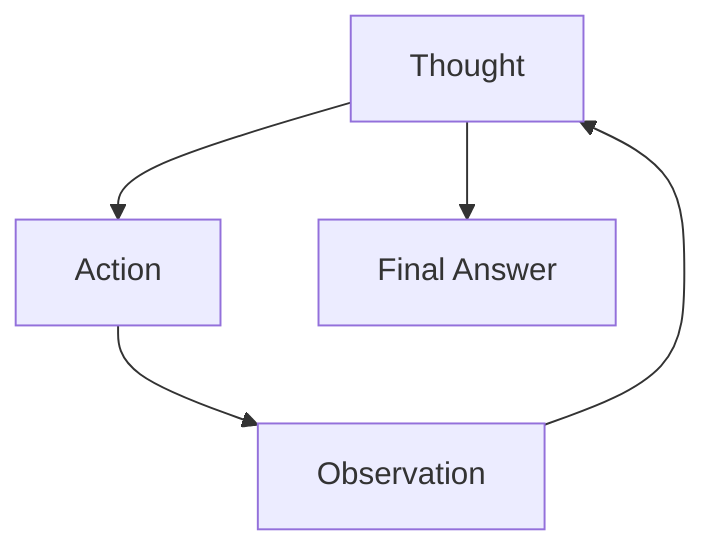
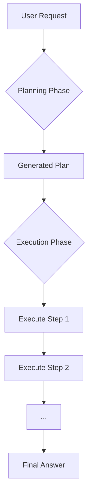

# Why your AI agent needs a plan
### Mastering ReAct and Plan-and-Execute

## Why Your Agent Needs a Plan: An Introduction to Planning and Reasoning

This article will introduce the foundational concepts of planning and reasoning for AI agents. We will explore why standard Large Language Models (LLMs) fall short on complex, multi-step tasks and how we can teach them to "think" before they act. You will learn about historically important and still relevant strategies like ReAct and Plan-and-Execute that provide structure to an agent's thought process. Understanding these fundamental patterns is crucial for any AI engineer aiming to build robust, reliable, and intelligent autonomous systems that can decompose goals and self-correct when faced with unforeseen challenges.

## What a Non-Reasoning Model Does And Why It Fails on Complex Tasks

Let's imagine you're building a "Technical Research Assistant Agent." Your goal is to give it a high-level task, like "Produce a comprehensive report on the latest developments in edge AI deployment," and have it return a structured, well-researched document. The agent needs to find recent papers, summarize their findings, identify trends, and flag any conflicting information.

A non-reasoning model, even one equipped with tools for web search, will likely fail at this task. It treats the entire request as a single prompt to be answered immediately. It might call a search tool, get a list of papers, and then generate a messy, superficial summary in one go. Because it doesn't have an internal plan, it has no concept of iterating on its work. It won't stop to ask, "Are these sources reliable?" or "Do these two papers contradict each other?"

This is a critical failure mode for complex tasks. The agent produces a weak, unreliable output because it cannot break the problem down into logical sub-goals, such as verifying sources or comparing claims. In previous lessons, we saw how workflows and structured outputs provide modularity, and how tools give an agent the ability to act [[1]](https://cdn.openai.com/business-guides-and-resources/a-practical-guide-to-building-agents.pdf). However, these components are just building blocks. Without an explicit reasoning process to guide them, the agent remains a brittle, linear system that can't adapt to unforeseen results. To fix this, we first need to teach the model how to think before it acts.

## Teaching Models to “Think”: Chain-of-Thought and Its Limits

The first step toward more intelligent agents is to get them to "think out loud." This is the core idea behind Chain-of-Thought (CoT) prompting, a technique that emerged around 2022 and showed that simply asking an LLM to explain its reasoning before giving an answer dramatically improves its performance on multi-step problems [[2]](https://arxiv.org/abs/2201.11903). It’s similar to how you might talk yourself through a difficult math problem.

For our Technical Research Assistant Agent, a CoT prompt might look like this: "Before answering, think step by step about how you will research and verify sources on edge AI deployment. Then, provide the final report." In response, the model would first generate a high-level plan, such as "First, I will search for recent papers on arXiv. Second, I will select the most relevant ones. Third, I will summarize their findings. Finally, I will synthesize these summaries into a report."

This is a significant improvement. The model is now creating an explicit plan [[3]](https://www.ibm.com/think/topics/ai-agent-planning). However, CoT has a major limitation for building robust agents: the plan and the final answer are mixed together in a single block of text. This makes it difficult to programmatically parse the plan, execute its steps one by one, and check the results along the way. The model produces its reasoning and its answer in one shot, without any mechanism for an iterative loop to refine or correct its plan based on what it finds. To gain the control needed for a true agent, we have to separate these two processes.

## Separating Planning from Answering: Foundations of ReAct and Plan-and-Execute

The fundamental shift from simple LLM calls to agentic behavior comes from one core idea: separating the planning and reasoning phase from the answering and action phase [[4]](https://blog.langchain.com/planning-agents/). By asking the model to first generate a plan and then, as a separate step, execute it, we gain critical advantages. This separation gives us control and interpretability; we can see the agent's "thoughts" before it acts.

Most importantly, this separation enables iterative loops. The agent can take one step of its plan, observe the outcome, and then use that new information to update or completely change its plan. This feedback loop is the essence of adaptive, intelligent behavior.

Two foundational strategies have emerged to implement this separation. The first is **ReAct**, which stands for "Reason and Act." In this pattern, the agent interleaves thoughts, actions, and observations in a continuous loop until the task is complete [[5]](https://arxiv.org/pdf/2210.03629.pdf). The second is **Plan-and-Execute**, where the agent first generates a complete, multi-step plan and then follows it, only stopping to re-plan if it hits a major roadblock. We will now explore each of these patterns in detail, starting with ReAct.

## ReAct in Depth: Loop, Evolving Example, Pros and Cons

The ReAct framework was developed to bridge the gap between pure reasoning, like in Chain-of-Thought, and pure acting, where a model just calls tools without explicit deliberation [[5]](https://arxiv.org/pdf/2210.03629.pdf). It achieves this by creating a simple yet powerful iterative loop: **Thought → Action → Observation**. The agent first thinks about what it needs to do, then takes an action (like calling a tool), observes the result, and uses that observation to inform its next thought. This cycle repeats until the agent determines it has enough information to provide a final answer.

Figure 1: The iterative loop of the ReAct framework, where the agent cycles through Thought, Action, and Observation until it can produce a Final Answer.

Let's trace how our Technical Research Assistant Agent would use the ReAct loop to tackle its task:

1.  **Thought:** "I need to find recent, trustworthy sources on the latest developments in edge AI deployment. I should start by searching academic databases and industry reports from 2024."
2.  **Action:** `search("latest developments in edge AI deployment 2024 site:arxiv.org OR site:nature.com")`
3.  **Observation:** The search tool returns a list of five academic papers with titles and URLs.
4.  **Thought:** "The first three papers seem most relevant based on their titles. I need to extract their abstracts to understand their core findings. Paper A is from a top conference, Paper B has many citations, and Paper C is very recent."
5.  **Action:** `fetch_and_extract(["url_A", "url_B", "url_C"])`
6.  **Observation:** The tool returns the abstracts for the three papers. The abstract for Paper A mentions a 40% adoption rate for a specific edge AI technique, while Paper B's abstract mentions a 25% adoption rate for a similar technique.
7.  **Thought:** "I have detected a conflict in the reported adoption rates between Paper A and Paper B. This is a key finding that needs to be resolved. I need to find a third-party market analysis report to verify these figures before I can write my summary."
8.  **Action:** `search("edge AI deployment adoption market analysis 2024")`
9.  **Observation:** The search returns a link to a credible industry report.
10. **Thought:** "Now I have the primary sources and a verification source. I can resolve the conflict, synthesize the key trends and gaps identified in the papers, and structure the final report."
11. **Final Answer:** The agent generates a structured report, citing all sources and explicitly noting the initial statistical conflict and how it was resolved using the market analysis.

This example highlights the main advantages of ReAct. It has high interpretability, as we can follow the agent's reasoning at each step. It's also excellent at error recovery and handling unexpected situations, like the conflicting data points, because the observation step allows it to adapt its plan on the fly [[6]](https://www.ibm.com/think/topics/react-agent). This makes it well-suited for exploratory tasks where the path to the solution is not clear from the start.

However, this flexibility comes at a cost. ReAct can be slower and more expensive, as it often requires more LLM calls—one for each "Thought" step [[7]](https://dev.to/jamesli/react-vs-plan-and-execute-a-practical-comparison-of-llm-agent-patterns-4gh9). The process can also be less predictable and may fall into loops without proper guardrails and a well-designed system prompt. For tasks with a more defined structure, the Plan-and-Execute pattern can be more efficient.

## Plan-and-Execute in Depth: Plan, Execution, Pros and Cons

In contrast to the step-by-step, adaptive nature of ReAct, the Plan-and-Execute strategy operates in two distinct phases. First, the agent uses an LLM to generate a complete, ordered plan to accomplish the goal. Second, an executor carries out each step of that plan, often without consulting the LLM again unless a step fails or new information requires the entire plan to be revised [[4]](https://blog.langchain.com/planning-agents/). This approach prioritizes structure and efficiency over moment-to-moment adaptability.

Figure 2: The two-phase structure of the Plan-and-Execute framework, separating the initial Planning phase from the sequential Execution phase.

Let's see how our Technical Research Assistant Agent would approach its task using this pattern.

**Planning Phase:**
Given the request, the planner LLM would output a detailed, step-by-step plan like this:
1.  **Scope Definition:** Define the scope of the report to cover developments from the last 18 months in edge AI deployment, focusing on hardware, software, and real-world use cases.
2.  **Source Identification:** Execute parallel searches on `arxiv.org`, `ieeexplore.org`, and Google Scholar to find academic papers. Execute a separate search for industry whitepapers and market analyses.
3.  **Source Selection:** From the search results, select the top 5 academic papers based on citation count and venue reputation, and the top 2 industry reports based on publisher credibility.
4.  **Information Extraction:** For each selected source, extract the abstract, key findings, and any quantitative data related to performance or adoption.
5.  **Data Synthesis:** Consolidate all extracted information. Compare the findings from different sources, explicitly identifying areas of agreement, conflict, or unique insight.
6.  **Outline Generation:** Create a structured outline for the final report, including an introduction, sections for hardware and software trends, a use case analysis, and a conclusion summarizing key gaps.
7.  **Report Drafting:** Write the full report based on the generated outline and synthesized data, ensuring all claims are properly cited.

**Execution Phase:**
The executor would then process this plan step-by-step. It would run the searches, apply filters to select sources, call an extraction tool, and so on. The powerful LLM is only called again if a step fails (e.g., a search returns no results) or to perform the final synthesis and writing tasks (steps 5-7).

The main advantage of Plan-and-Execute is its efficiency and reliability for well-defined tasks [[4]](https://blog.langchain.com/planning-agents/). By creating the full plan upfront, it minimizes the number of expensive LLM calls during execution. This makes the process faster, cheaper, and more predictable, which is ideal for production systems handling repeatable workflows.

The primary disadvantage is its inflexibility. If the initial plan is flawed or the environment is unpredictable, the agent can get stuck executing a suboptimal strategy [[8]](https://www.willowtreeapps.com/craft/building-ai-agents-with-plan-and-execute). While mechanisms for re-planning can be added, the pattern is less suited for highly exploratory problems where the next step is genuinely unknown until the results of the current one are observed.

## Where This Shows Up in Practice: Deep Research–Style Systems

The theoretical patterns of ReAct and Plan-and-Execute are not just academic exercises; they are the architectural backbones of real-world, large-scale agentic systems designed for deep research, market analysis, and scientific review. These systems operationalize planning and reasoning to tackle long-horizon tasks that would be impossible for a single LLM call to handle [[9]](https://www.glean.com/blog/a-complete-guide-to-agentic-reasoning).

In practice, a system tasked with creating a market analysis report will decompose the high-level goal into a series of sub-goals: gather sales data, search for competitor press releases, analyze customer sentiment from reviews, and verify economic indicators. The system then enters iterative cycles of searching, reading, comparing, and writing, which closely mirror the loops we've discussed [[10]](https://www.glean.com/blog/agentic-reasoning-future-ai).

Many of these systems implement a hybrid approach. They might use a Plan-and-Execute framework to structure the overall workflow (e.g., data collection phase, analysis phase, report generation phase). However, within each phase, they may use ReAct-like loops for more exploratory sub-tasks, like trying different search queries until a key piece of data is found [[11]](https://serjhenrique.com/react-wese-plan-and-execute-and-chatdb-architectures-applied-to-question-answer-database-use-case/). These production systems also add robust tooling and strict verification policies to reduce hallucinations and ensure the reliability of the final output. This demonstrates how foundational patterns are combined and adapted to build sophisticated, real-world AI applications.

## Modern Reasoning Models: Thinking vs. Answer Streams and Interleaved Thinking

As LLMs evolve, they are starting to internalize some of these explicit reasoning patterns. Leading model providers are designing architectures that more natively support agentic behavior. One key development is the separation of a model's output into two distinct streams: a private "thinking" stream and a public "answer" stream [[12]](https://docs.aws.amazon.com/bedrock/latest/userguide/claude-messages-extended-thinking.html).

When you send a request to such a model, it can first generate internal reasoning steps in the thinking stream. This might involve decomposing the problem, drafting a plan, or deciding which tool to call. This internal monologue is not shown to the end-user but is used by the model to guide its own process. Only after this internal reasoning is complete does it produce the final, polished response in the answer stream.

An even more advanced capability is **interleaved thinking**, where the model can update its plan after each action within a single turn. For example, the model can think, decide to call a tool, receive the tool's output, and then generate more thinking tokens to process that output before deciding on its next action [[13]](https://docs.anthropic.com/en/docs/build-with-claude/extended-thinking#interleaved-thinking). This effectively bakes a ReAct-like loop directly into the model's inference process.

While these advancements make it easier to build agents, they don't make the explicit patterns of ReAct and Plan-and-Execute obsolete. Relying solely on a model's implicit reasoning can create a "black box" that is difficult to debug and control. Explicitly structuring your agent with these patterns gives you a clear trace of its decision-making process, making it easier to identify failures, enforce constraints, and ensure reliable performance.

## Advanced Agent Capabilities Enabled by Planning: Goal Decomposition and Self-Correction

With a solid foundation in planning and reasoning, we can unlock more advanced agent capabilities that are essential for true autonomy: goal decomposition and self-correction. These abilities are what elevate an agent from a simple tool executor to a dynamic problem-solver.

**Goal decomposition** is the process of breaking a large, complex task into a hierarchy of smaller, more manageable sub-goals [[14]](https://www.amazon.science/blog/how-task-decomposition-and-smaller-llms-can-make-ai-more-affordable). In a Plan-and-Execute agent, this is the primary job of the planner. In a ReAct agent, decomposition happens more dynamically during the "Thought" steps, where the agent decides on the immediate next sub-goal. Effective prompting can guide the agent to perform this decomposition more robustly, ensuring that no critical steps are missed. For example, a prompt can instruct the agent to always include a "verification" sub-goal after a "data collection" sub-goal.

**Self-correction** is arguably the most critical capability for a robust agent. It's the ability to detect errors, contradictions, or low-confidence results during execution and dynamically update the plan to address them [[15]](https://galileo.ai/blog/self-evaluation-ai-agents-performance-reasoning-reflection). This is where the iterative nature of agentic loops truly shines. Let's revisit our research assistant agent. It found two papers with conflicting adoption rates (40% vs. 25%). A non-reasoning system might just average them or report both without comment. A self-correcting agent, however, recognizes the contradiction. It then inserts a new sub-goal into its plan: "Verify the conflicting statistics." It executes this new goal by searching for a more authoritative source, finds a market analysis, and uses it to resolve the discrepancy in its final report.

These capabilities are why the underlying patterns of ReAct and Plan-and-Execute remain so important. They provide the structure—the loops and the separation of thought from action—that makes self-correction possible. Even as models become more powerful, these explicit architectural patterns give us the tools to build more reliable, debuggable, and intelligent agents. In the next lesson (Lesson 8), we will put this theory into practice by implementing a ReAct agent from scratch. Soon after, we will explore how to give agents memory (Lesson 9) and dive deep into the advanced retrieval techniques that power knowledge-intensive agents (Lesson 10).

## Conclusion: From Simple Actions to Complex Strategies

In this lesson, we explored why planning and reasoning are essential for building autonomous agents capable of handling complex, multi-step tasks. We saw that without these capabilities, even LLMs equipped with powerful tools act as brittle, linear systems that fail when faced with ambiguity or unexpected outcomes.

We covered the two foundational patterns that provide structure to an agent's thought process: ReAct, with its iterative loop of Thought-Action-Observation, and Plan-and-Execute, with its distinct planning and execution phases. Understanding these strategies is key to controlling agent behavior, ensuring reliability, and enabling advanced capabilities like goal decomposition and self-correction.

These concepts form the cornerstone of agentic AI. In the upcoming lessons, we will build directly on this foundation. In Lesson 8, you will implement a ReAct agent from scratch to see these principles in action. Following that, we will explore how to give agents memory in Lesson 9 and dive deep into the advanced retrieval techniques that power knowledge-intensive agents in Lesson 10.

## References

- [1] [A practical guide to building agents](https://cdn.openai.com/business-guides-and-resources/a-practical-guide-to-building-agents.pdf)
- [2] [Chain-of-Thought Prompting Elicits Reasoning in Large Language Models](https://arxiv.org/abs/2201.11903)
- [3] [AI Agent Planning - IBM](https://www.ibm.com/think/topics/ai-agent-planning)
- [4] [Planning Agents - LangChain Blog](https://blog.langchain.com/planning-agents/)
- [5] [ReAct: Synergizing Reasoning and Acting in Language Models](https://arxiv.org/pdf/2210.03629.pdf)
- [6] [What is a ReAct agent? - IBM](https://www.ibm.com/think/topics/react-agent)
- [7] [ReAct vs Plan-and-Execute: A Practical Comparison of LLM Agent Patterns - dev.to](https://dev.to/jamesli/react-vs-plan-and-execute-a-practical-comparison-of-llm-agent-patterns-4gh9)
- [8] [Building AI Agents with the Plan and Execute Pattern - WillowTree](https://www.willowtreeapps.com/craft/building-ai-agents-with-plan-and-execute)
- [9] [A Complete Guide to Agentic Reasoning - Glean](https://www.glean.com/blog/a-complete-guide-to-agentic-reasoning)
- [10] [Agentic Reasoning Is the Future of AI in the Enterprise - Glean](https://www.glean.com/blog/agentic-reasoning-future-ai)
- [11] [ReAct-WESE, Plan and Execute and ChatDB Architectures applied to Question & Answer Database use case](https://serjhenrique.com/react-wese-plan-and-execute-a-practical-comparison-of-llm-agent-patterns-4gh9)
- [12] [Extended thinking with Claude - AWS](https://docs.aws.amazon.com/bedrock/latest/userguide/claude-messages-extended-thinking.html)
- [13] [Building with extended thinking - Anthropic](https://docs.anthropic.com/en/docs/build-with-claude/extended-thinking#interleaved-thinking)
- [14] [How task decomposition and smaller LLMs can make AI more affordable - Amazon Science](https://www.amazon.science/blog/how-task-decomposition-and-smaller-llms-can-make-ai-more-affordable)
- [15] [Self-Evaluation in AI Agents: Enhancing Performance Through Reasoning and Reflection - Galileo](https://galileo.ai/blog/self-evaluation-ai-agents-performance-reasoning-reflection)