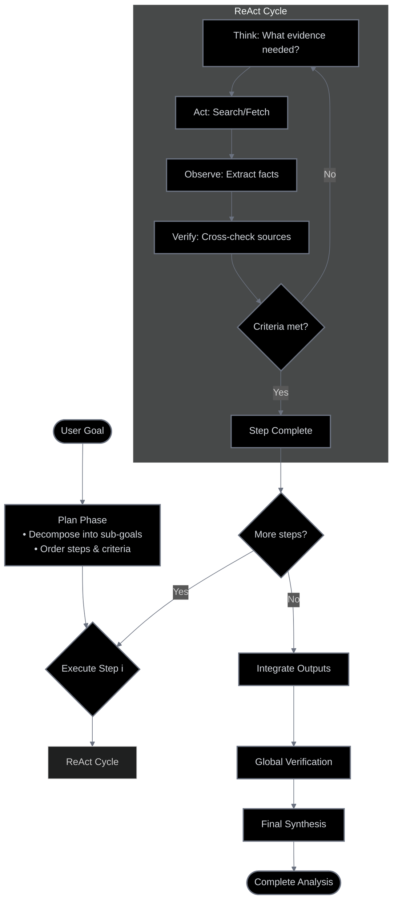

# Lesson 7: Planning and Reasoning

A major leap in AI progress is the rise of agentic reasoning: an approach that enables AI systems to plan, execute, and adapt like dynamic problem-solvers. Agentic reasoning allows AI to break down complex problems, gather information, and respond in context, all while autonomously learning and refining its approach.

In the previous lessons, you learned the foundational components for building AI systems. You learned how to ensure they return data in a reliable format (Lesson 4), how to chain these actions together into workflows (Lesson 5), and how to give models tools to interact with the world (Lesson 6). But these alone are not enough to build a truly autonomous agent.

This article introduces the core concepts of planning and reasoning. You will learn about the core strategies that give agents their 'thinking' ability, such as ReAct and Plan-and-Execute. We will also explore why standard LLMs often fall short on complex, multi-step tasks that demand adaptation and foresight.

## **What a Non-Reasoning Model Does And Why It Fails on Complex Tasks**

Let's consider a practical example using a technical research assistant agent. Your goal is to give it a high-level task, such as *producing a comprehensive technical report on the latest developments in edge AI deployment*. This involves finding recent papers, summarizing their findings, identifying trends, and writing a structured report.

If you give this prompt to a standard LLM, even one with tool access but no controller enforcing reflection/verification, it will likely fail. It treats the entire complex request as one big text generation problem. It might call a search tool to find some papers and then immediately start writing a summary based on the first few results it gets. This approach breaks down quickly due to several reasons. What if the initial search results are outdated or irrelevant? A non-reasoning model lacks the mechanism to evaluate the quality of the information it receives and adjust its strategy accordingly. It does not break the problem down into logical sub-goals like "find sources," "verify sources," "synthesize findings," and "draft report." It just executes without foresight.


Non-reasoning research agent does a one-shot search and draft without planning, verification, or iteration, resulting in superficial output.

While components like tools and structured outputs are essential building blocks for AI systems, they are insufficient for complex tasks with undertermined paths. Here, you need an agent with a deeper reasoning layer to orchestrate these actions [[25](https://www.ibm.com/think/topics/ai-agent-orchestration)], to decide which tool to use next based on previous results, and crucially, to adapt its strategy when unexpected issues arise. 

Without this reasoning capability, the agent produces superficial outputs and cannot iterate on partial results or correct its course, leading to unreliable and less useful outcomes for any non-trivial challenge [[1]](https://arxiv.org/pdf/2503.13657), [[2]](https://huyenchip.com/2025/01/07/agents.html). To address this, we first "teach" the model to produce a reasoning trace, which means thinking before answering.

## **Teaching Models to “Think": Chain-of-Thought and Its Limits**

To fix the failures of non-reasoning models, the first and simplest step is to teach the model to "think" before it acts. The most basic way to do this is with a technique called Chain-of-Thought (CoT) prompting. The idea is simple: you instruct the LLM to think step by step, writing out its reasoning process before giving the final answer. It is like asking someone to show their work in a math problem.

Researchers found that for large enough models, simply adding the phrase "think step by step" could dramatically improve performance on complex reasoning tasks [[3]](https://arxiv.org/abs/2201.11903). For our technical research assistant agent, a CoT prompt might look like this: "Before answering, think step by step about how you will research and verify sources on edge AI deployment. Then provide the final report."

When you use this prompt, the model first generates a reasoning trace. This trace outlines a high-level plan: search for recent papers, read abstracts for relevance, compare claims, and then synthesize the findings into a report. This is a clear improvement, as the model is now performing some level of planning.

However, this single-pass CoT setup has a practical limitation: it emits the *thinking* and the *answer* as one uninterrupted stream. There's no pause point to run tools, fetch fresh data, or verify claims before the model moves on. As a result, the model can write a plan and then immediately draft a report without ever executing the plan. Engineering-wise, this also makes the output hard to control and parse.


In a single-pass setup, Chain-of-Thought adds a step-by-step reasoning trace before the answer in an uninterruptible call. This improves performance, but limited control and no mid-course corrections.

<aside>
💡

**Note:** CoT is still valuable *inside each step* of an agent loop (even if kept internal). What fails is relying on a **single, free-form CoT pass** to both plan and execute a multi-step, tool-using task.

</aside>

Because there is no separation or interrupt boundary, you **cannot** build an iterative loop where the agent executes a step, observes the result, and uses that observation to guide the next step. Tool calls can't be executed, results can't be inspected, and claims can't be verified *before* the answer is produced. To enable verification, tool use, and adaptation, we must explicitly separate the planning/reasoning from the action/answering phases.

## **Separating Planning from Answering: Foundations of ReAct and Plan-and-Execute**

The key to building more advanced agents is to explicitly separate the planning and reasoning process from the action and answering process. Instead of asking the model to think and then answer in one go, we create a system where these are distinct steps [[4](https://blog.langchain.com/planning-agents/)], [[5](https://dev.to/jamesli/react-vs-plan-and-execute-a-practical-comparison-of-llm-agent-patterns-4gh9)].

Two fundamental patterns implement this separation: ReAct[[26](https://www.ibm.com/think/topics/react-agent)] and Plan-and-Execute [[5]](https://dev.to/jamesli/react-vs-plan-and-execute-a-practical-comparison-of-llm-agent-patterns-4gh9).

- **ReAct (Reason + Act)** works by interleaving thoughts, actions, and observations in a tight loop. The agent thinks about what to do, performs an action, sees what happened, and then thinks again [[4]](https://blog.langchain.com/planning-agents/).
- **Plan-and-Execute**, on the other hand, involves two distinct phases. First, the agent creates a complete, multi-step plan. Then, it enters an execution phase where it carries out that plan step by step [[4]](https://blog.langchain.com/planning-agents/), [[5]](https://dev.to/jamesli/react-vs-plan-and-execute-a-practical-comparison-of-llm-agent-patterns-4gh9).

Both patterns are built on the same principle of separating thought from action, but they offer different trade-offs in terms of flexibility and predictability[[24](https://www.ibm.com/think/topics/agentic-reasoning)]. 

## **ReAct in Depth: The Loop of Thought, Action, and Observation**

The ReAct (Reason + Act) framework emerged to bridge the gap between pure reasoning, like in Chain-of-Thought, and pure action-taking. We realize that human intelligence seamlessly combines task-oriented actions with verbal reasoning or "inner speech." You can think of it as how we decide what to do next, while our actions give us new information that influences our subsequent thoughts [[7]](https://arxiv.org/pdf/2210.03629). Researchers designed ReAct to mimic this synergistic process in AI agents.

The framework operates on a simple, iterative loop: Thought → Action → Observation. The agent first generates a reasoning trace, which we call a thought, to break down the problem and decide on the next immediate step. Based on that thought, it chooses an action to take, such as calling a tool. The system then receives an observation, which is the result of that action. It feeds this observation back into the context, and the agent generates a new thought to assess its progress and decide what to do next. This cycle repeats until the agent determines the task is complete and produces a final answer.


The ReAct loop, where the agent iteratively cycles through Thought, Action, and Observation until it can produce a final answer.

Let's walk through how our assistant agent could use the ReAct pattern to tackle its task:

1. **Thought:** "I need to find recent, trustworthy sources on edge AI deployment. I'll start by searching academic and industry websites for papers from 2024."
2. **Action:** search("latest developments in edge AI deployment 2024 site:arxiv.org OR site:nature.com")
3. **Observation:** The search returns a list of candidate papers with titles and URLs.
4. **Thought:** "The search returned several papers. I need to select the most relevant ones. I'll select three highly cited sources and one industry report to gain a balanced view. I will check their publication dates and venues to ensure they are credible."
5. **Action:** fetch_and_extract(["paper_url_1", "paper_url_2", "report_url_1"])
6. **Observation:** The tool returns the extracted abstracts and metadata for the selected sources.
7. **Thought:** "Now I have the summaries. I will compare their claims about adoption rates. I need to be careful and flag any conflicts in the data."
8. **Action:** summarize_and_compare(extractions)
9. **Observation:** The result shows that Paper A claims a 40% adoption rate, while Paper B claims 25%. There's a conflict.
10. **Thought:** "A conflict has been detected in the adoption rates. I need to resolve this. I will search for a third-party market analysis to act as a tie-breaker."
11. **Action:** search("edge AI deployment adoption market analysis 2024")
12. **Observation:** A credible market analysis report is found.
13. **Thought:** "I have the market report. I will use it to resolve the conflict and then finalize my summary of trends and gaps."
14. **Final Answer:** The agent generates a structured report, citing all sources and explaining how it resolved the conflicting statistics.

## **Plan-and-Execute in Depth: Structure and Predictability**

While ReAct excels at exploratory tasks, its iterative nature can be inefficient for problems with a more predictable structure, meaning tasks where the sequence of steps from input to output is known in advance and does not depend much on intermediate tool results. For example, a writing agent can follow a fixed pipeline consisting of: outline, draft sections, render Mermaid diagrams, extract images, and then compile the final article. An alternative pattern, Plan-and-Execute, fits this setting better. As its name suggests, it separates the process into two distinct phases: first, creating a comprehensive plan, and second, executing that plan.

This approach is often more efficient because it minimizes the number of calls to the main, powerful LLM. A planner model (typically a large, capable LLM) generates a detailed, step-by-step plan up front. Then, an executor, which can be a simpler agent or even just a loop running tool calls, carries out the plan. You only consult the planner again if the plan needs to be updated due to an unexpected issue or a significant deviation from the expected outcome [[4]](https://blog.langchain.com/planning-agents/). This separation of a heavyweight planner from the execution runtime helps reduce latency and cost compared to continuously looping a single LLM after every tool call.


The Plan-and-Execute pattern, showing a clear separation between the initial Planning phase and the sequential Execution phase.

Note that Orchestrator–Worker and Plan-and-Execute may sound similar but differ in scope. In an Orchestrator–Worker setup, the *developer* manually coordinates multiple agents or workers (e.g., one searches, one summarizes, one writes), often chaining them with fixed rules. In Plan-and-Execute, the *model itself* generates a structured plan and then carries it out step by step. Both involve a “planner” and an “executor,” but in Orchestrator–Worker the orchestration lives outside the model, while in Plan-and-Execute the reasoning pattern lives inside the agent.

Let's revisit our assistant agent and see how it would operate using this pattern.

### **Planning Phase**

You first prompt the agent to create a complete plan to fulfill the request. It outputs a structured list of tasks, like this:

1. Define the scope and success criteria for the report on "edge AI deployment." This involves understanding the target audience and the desired depth of analysis.
2. Execute parallel searches across academic databases (e.g., arXiv) and industry news sites for content from the last 18 months. Use specific keywords to ensure relevance.
3. From the search results, select the top 5 academic papers and top 3 industry reports based on relevance, citation count, and source credibility. Prioritize recent and highly influential works.
4. For each selected source, extract the abstract, key findings, and any specific data on adoption rates or performance benchmarks. Store this information in a structured format for easy comparison.
5. Synthesize the extracted information, comparing findings across sources to identify consistent trends, emerging technologies, and notable conflicts or gaps in the research. Highlight areas of consensus and divergence.
6. Draft a detailed outline for the final report, including sections for Introduction, Key Trends, Technical Challenges, Industry Adoption, and Conclusion. Ensure a logical flow and comprehensive coverage.
7. Write the full report based on the outline, ensuring all claims are supported by citations and including a methodology section explaining the research process. This ensures transparency and verifiability.

### **Execution Phase**

The agent now systematically works through the plan, executing step 1, then step 2, and so on. It stores the results of each step and uses them as input for subsequent steps. For example, the URLs found in step 2 are used in step 3. The system returns to the planning phase only if a step fails completely (e.g., no relevant sources are found), if the output of one step is incompatible with the expected input of the next (an interface mismatch), or if a predefined trigger for re-planning is met. These potential failure points highlight the inherent risk of committing to a full plan upfront: while efficient, it can break down if reality diverges from assumptions made during the planning phase. This creates a more controlled and predictable workflow overall, but one that must be designed with safeguards for error handling and re-planning.

## **Pros and Cons: ReAct vs. Plan-and-Execute**

Choosing between the two depends on your task's uncertainty, structure, and latency/cost constraints. Use the comparison below to quickly decide which pattern (or hybrid) best fits your scenario.

| **Approach** | **Pros** | **Cons** |
| --- | --- | --- |
| ReAct | - High interpretability; explicit thoughts at each step enable debugging and trust [[7]](https://arxiv.org/pdf/2210.03629)
- Natural error recovery via observe-think loops; adapts to unexpected results [[6]](https://arxiv.org/html/2404.11584v1) | - Can be slower and more costly on large, predictable tasks due to multiple LLM calls per step [[4]](https://blog.langchain.com/planning-agents/)
- Requires tight control; can loop or drift without guardrails [[8]](https://galileo.ai/blog/why-most-ai-agents-fail-and-how-to-fix-them) |
| Plan-and-Execute | - Efficient and predictable for well-defined multi-step tasks; fewer planner calls [[4]](https://blog.langchain.com/planning-agents/), [[5]](https://dev.to/jamesli/react-vs-plan-and-execute-a-practical-comparison-of-llm-agent-patterns-4gh9)
- Strong fit for structured pipelines; coherent outputs from upfront plan [[5]](https://dev.to/jamesli/react-vs-plan-and-execute-a-practical-comparison-of-llm-agent-patterns-4gh9) | - Rigid; can fail when reality diverges from the initial plan [[9]](https://www.willowtreeapps.com/craft/building-ai-agents-with-plan-and-execute)
- Less adaptable for exploratory problems where next steps depend on new findings |

There isn’t a universal answer for which approach is faster or cheaper, it depends on both the **complexity** of the task and how **predictable its structure** is.

- **What “predictable structure” means:** the task has a clear, repeatable sequence where each step’s input and output are well defined (e.g., *gather sources → extract data → synthesize → draft report*).
- **Unpredictable structure:** the next step depends on what you discover along the way, with branching or verification (e.g., resolving conflicting statistics, following new leads in research).

Now, combine this with task **complexity**:

- **Small/simple tasks:** ReAct often finishes faster, since it avoids heavy upfront planning.
- **Complex + predictable tasks:** Plan-and-Execute is usually faster and cheaper, as one large planning pass reduces repeated reasoning calls.
- **Complex + unpredictable tasks:** ReAct often wins, since it adapts mid-stream, while Plan-and-Execute may require costly re-planning if assumptions break.

Similarly, cost can vary based on the task. In one comparison on a data analysis problem, analyzing a CSV to compute sales statistics and generate a report [[5]](https://dev.to/jamesli/react-vs-plan-and-execute-a-practical-comparison-of-llm-agent-patterns-4gh9?utm_source=chatgpt.com), ReAct was slightly cheaper ($0.06–0.09) but less accurate (85%), while Plan-and-Execute cost a bit more ($0.09–0.14) and achieved higher accuracy (92%).

This example illustrates how the trade-off plays out: for stable and predictable tasks, the upfront cost of Plan-and-Execute translated into more reliable results. But in less predictable settings, such as when data requires unexpected cleaning or branching, its rigidity can be a drawback and ReAct’s adaptive loop may be a better fit.

In practice, many production systems blend these strengths along a **continuum**: using Plan-and-Execute for overall structure and ReAct-style loops where uncertainty or verification is needed. This reflects a spectrum rather than a binary choice. 

Let's look at how this hybridization shows up in real "Deep Research" workflows.

## **Deep Research–Style Systems**

The theoretical patterns of ReAct and Plan-and-Execute are the foundation for sophisticated, real-world AI systems designed for complex analysis and reporting. A prime example is what we call "Deep Research" systems. We use these for tasks like market analysis, scientific literature reviews, or complex financial diligence.

We see these systems operationalize planning and reasoning to tackle long-horizon tasks. These tasks are often too complex for a single LLM call. For example, an agent tasked with "analyze the competitive landscape for quantum computing" would begin by breaking the goal down into a series of smaller sub-goals [[10]](https://www.glean.com/blog/a-complete-guide-to-agentic-reasoning): identifying key companies, finding recent research papers, analyzing patent filings, and summarizing news sentiment.

Once the high-level plan is set, the system executes each step using an iterative cycle inspired by ReAct. Within a step, the agent may search for information, extract key data, compare findings, and verify claims [[11]](https://www.ayadata.ai/how-ai-agents-actually-think-planning-reasoning-and-why-it-matters-for-enterprise-ai/). For instance, if conflicting adoption rates are found, the agent seeks a third source before moving forward. These loops of reasoning, acting, and checking are how uncertainty is managed locally, while the overall direction remains guided by the plan.

In practice, Deep Research systems combine the two patterns. Plan-and-Execute provides the global scaffolding: it sets the overall workflow, determines the order of sub-goals, and allocates subtasks. ReAct-inspired cycles operate at the local level: within each sub-goal, they allow the system to adapt to missing data, resolve conflicts, and verify results. Some implementations, such as Anthropic’s multi-agent research system, extend this with a lead agent that coordinates multiple subagents working in parallel, which scales the process across larger information volumes [[28]](https://www.anthropic.com/engineering/multi-agent-research-system).



## **Reasoning Models: How LLMs’ “Reasoning and Planning" are Being Internalized in LLMs**

As LLMs continue to evolve, they are beginning to internalize some of the reasoning structures we have discussed. Instead of relying solely on external frameworks to orchestrate thinking, developers now design modern models with built-in reasoning capabilities. Broadly, two model-side patterns mirror the system patterns we covered: a think-then-answer mode that parallels Plan-and-Execute, and an interleaved reasoning mode that parallels ReAct.

- **Think-then-answer** (parallel to Plan-and-Execute): some models separate "thinking" and "answer" streams and can perform an explicit "extended thinking" phase before generating the final answer [[13]](https://docs.aws.amazon.com/bedrock/latest/userguide/claude-messages-extended-thinking.html), [[14]](https://cloud.google.com/vertex-ai/generative-ai/docs/partner-models/claude). In effect, the model runs a one-shot planning pass, breaking down the problem, evaluating options, and selecting an approach, then generates the answer. This mirrors Plan-and-Execute's heavy upfront planning followed by a largely linear execution path. In some platforms, the private reasoning trace can be surfaced for inspection or debugging [[13]](https://docs.aws.amazon.com/bedrock/latest/userguide/claude-messages-extended-thinking.html).
- **Interleaved reasoning** (parallel to ReAct): newer models support reasoning that alternates with actions, especially during tool use [[13]](https://docs.aws.amazon.com/bedrock/latest/userguide/claude-messages-extended-thinking.html), [[15]](https://platform.openai.com/docs/guides/reasoning). The model can think, call a tool, observe the result, and think again, repeating until completion. This is essentially the ReAct loop embedded within the model: Thought → Action → Observation → Thought. For example, Claude 3.5 Sonnet can operate a virtual computer by interleaving actions with natural-language reasoning [[16]](https://www.anthropic.com/news/3-5-models-and-computer-use), and models like Claude Opus and Sonnet pair this with large context windows and strong reasoning to support multi-step tool use [[17]](https://docs.anthropic.com/en/docs/about-claude/models/overview), [[18]](https://www.anthropic.com/news/claude-3-5-sonnet).

To create these models and internalize reasoning, LLM training has also shifted: the new "native reasoning" models are post-trained with large-scale reinforcement learning on problems with verifiable outcomes (such as math, code, and formal proofs), and where exact checking isn't possible, on AI outputs scored by AI-as-a-judge reward models. OpenAI's o1 family was the first high‑profile release on this front; DeepSeek‑R1 then made waves by showing how far pure RL (with minimal Supervised Fine Tuning) can push emergent reasoning behaviors. Google's Gemini 2.5 Pro and Flash, used heavily in this course, also now use built‑in “thinking” for complex tasks. All major AI labs now have a flagship reasoning model, and the recipe is converging: search‑and‑generate to explore solution candidates, reward modeling (increasingly with LLM‑judges) to score trajectories, and RL to shape longer, self‑correcting chains of thought. The post-training phase is no longer cheap polish; the compute used for these reinforcement learning steps is now in the same order of magnitude as next-token pre-training for flagship LLMs.

Reasoning models unlocked *step-change* capability: on olympiad-style math, o1-class models jumped from GPT-4o's ~12% on AIME'24 to 74%+ (problems from a prestigious high school mathematics competition) and even surpassed PhD-expert accuracy on GPQA (a multi choice benchmark of physics, biology, and chemistry problems). Coding moved from low-percentile performer to highly competitive on Codeforces (a competitive programming contest) and strong results on other software engineering tests. Tool calling has also significantly improved. Together, these had made these models much more capable for many agentic tasks. 

So, what does this shift mean for you, the agent developer? It raises a crucial question:

> *What will the LLM manage, and what is my responsibility?*
> 

The line between the two is blurry and constantly changing, but a clear trend is emerging. Your role is shifting from explicitly *orchestrating* every thought step to *enabling* the model with high-quality tools and clear objectives.

Previously, you had to write different, complex prompts *and* manage a multi-step loop yourself, making separate LLM calls just to produce a single thought and a subsequent action. Now, models with native reasoning handle the tool-selection logic internally.

Consider a simple agent that needs to check the weather and then book a flight.

### **The "Old Way" (Developer-Led Orchestration)**

The developer must manually chain LLM calls, using distinct prompts first to generate a thought and then to generate an action based on that thought.

```python
# Developer defines tools
def search_weather(location: str) -> str:
    """Searches for the weather in a given location."""
    # ... implementation ...

def book_flight(destination: str, date: str) -> str:
    """Books a flight to a destination on a specific date."""
    # ... implementation ...

TOOL_DESCRIPTIONS = """
<tools>
  <tool>
    <name>search_weather</name>
    <description>Searches for the weather in a given location.</description>
  </tool>
  <tool>
    <name>book_flight</name>
    <description>Books a flight to a destination on a specific date.</description>
  </tool>
</tools>
"""

# Prompts for two separate LLM calls
PROMPT_FOR_THOUGHT = f"Given the user query, what is the next logical step? Think it through. Tools available:{TOOL_DESCRIPTIONS}"
PROMPT_FOR_ACTION = f"Based on the thought, what is the exact tool call to make? Tools available:{TOOL_DESCRIPTIONS}"

# --- Step 1: First LLM Call (to generate a Thought) ---
user_query = "Is it sunny in Paris tomorrow? If so, book me a flight."
prompt_1 = f"{PROMPT_FOR_THOUGHT}\n\nUser Query: {user_query}"
thought = model(prompt_1) # Returns: "I need to check the weather in Paris first before I can decide to book a flight."

# --- Step 2: Second LLM Call (to generate an Action) ---
prompt_2 = f"{PROMPT_FOR_ACTION}\n\nUser Query: {user_query}\nThought: {thought}"
action_str = model(prompt_2) # Returns: '{"tool": "search_weather", "args": {"location": "Paris"}}'

# --- Step 3: Developer Parses and Executes ---
action = parse_json(action_str)
observation = search_weather(location=action["args"]["location"]) # Returns "The weather is sunny."

# The developer must repeat this entire 2-call sequence for the next step (booking the flight).
```

### **The "New Way" (Model-Native Reasoning)**

You define the tools and provide them directly to the model's API. The model handles the reasoning step internally. To give developers more control over this internal process, model APIs are introducing parameters like `thinking_budget` or `extended_reasoning`, allowing you to specify how much computational effort the model should dedicate to planning before acting.

```python
# Developer defines tools with clear docstrings
def search_weather(location: str) -> str:
    """Searches for the weather in a given location."""
    # ... implementation ...

def book_flight(destination: str, date: str) -> str:
    """Books a flight to a destination on a specific date."""
    # ... implementation ...

tools = [search_weather, book_flight]

# Developer makes one top-level API call; the model may take multiple steps
# (interleaving tool calls and reasoning) before returning a final answer.
user_query = "Is it sunny in Paris tomorrow? If so, book me a flight."
response = model.generate_content(user_query, tools=tools, thinking_budget="high")
```

While these advancements make building agents easier, they do not make the underlying patterns obsolete. As an engineer, understanding ReAct and Plan-and-Execute remains crucial. These patterns give you a mental model for how the agent *should* behave. This is essential for designing effective tools, setting up system-level guardrails, and debugging when the model's internal reasoning goes wrong. Even if the model handles the loop, you are still responsible for designing the system that enables and controls it.

## **Conclusion**

In this lesson, we moved from basic actions to intelligent planning and reasoning, the capabilities that separate a simple tool from an autonomous agent. We've seen that building reliable agents requires more than just giving an LLM access to tools; it requires a structured way for the agent to think, plan, and adapt.

We explored the two foundational patterns for agentic reasoning: the iterative and flexible ReAct, which excels at exploratory tasks, and the structured and predictable Plan-and-Execute, which is better for well-defined workflows. Both are built on the critical principle of separating thought from action, which is the key to control, debuggability, and reliability.

We also saw how these concepts are not just theoretical. They are being implemented in large-scale research systems and are even being built directly into the architecture of modern LLMs. However, even as models become more capable of internal reasoning, these foundational patterns remain vital for you as an engineer[[27](https://www.anthropic.com/engineering/building-effective-agents)]. They provide the mental models and control structures necessary to build systems that are not only powerful but also consistent and trustworthy.

Now that you understand the theory, it's time to put it into practice. In Lesson 8, you will implement the ReAct pattern from scratch, building your first true reasoning agent. From there, we will continue to build on this foundation, exploring how to augment agents with advanced knowledge retrieval in Lesson 9 and how to give them memory in Lesson 10.

## **References**

- [[1]](https://arxiv.org/pdf/2503.13657) Yao, S., et al. (2025). *A Taxonomy for Multi-Agent LLM Systems*. arXiv.
- [[2]](https://huyenchip.com/2025/01/07/agents.html) Huyen, C. (2025). *Agents*.
- [[3]](https://arxiv.org/abs/2201.11903) Wei, J., et al. (2022). *Chain-of-Thought Prompting Elicits Reasoning in Large Language Models*. arXiv.
- [[4]](https://blog.langchain.com/planning-agents/) LangChain. (2024). *Planning Agents*. LangChain Blog.
- [[5]](https://dev.to/jamesli/react-vs-plan-and-execute-a-practical-comparison-of-llm-agent-patterns-4gh9) Li, J. (2024). *ReAct vs. Plan-and-Execute: A Practical Comparison of LLM Agent Patterns*. DEV Community.
- [[6]](https://arxiv.org/html/2404.11584v1) Wang, G., et al. (2024). *Architectural theme: Successful goal execution hinges on planning and self-correction*. arXiv.
- [[7]](https://arxiv.org/pdf/2210.03629) Yao, S., et al. (2022). *ReAct: Synergizing Reasoning and Acting in Language Models*. arXiv.
- [[8]](https://galileo.ai/blog/why-most-ai-agents-fail-and-how-to-fix-them) Galileo. (n.d.). *Why Most AI Agents Fail (And How to Fix Them)*.
- [[9]](https://www.willowtreeapps.com/craft/building-ai-agents-with-plan-and-execute) WillowTree. (2023). *Building AI Agents with Plan and Execute*.
- [[10]](https://www.glean.com/blog/a-complete-guide-to-agentic-reasoning) Glean. (n.d.). *A Complete Guide to Agentic Reasoning*.
- [[11]](https://www.ayadata.ai/how-ai-agents-actually-think-planning-reasoning-and-why-it-matters-for-enterprise-ai/) Aya Data. (n.d.). *How AI Agents Actually Think: Planning, Reasoning, and Why It Matters for Enterprise AI*.
- [[12]](https://serjhenrique.com/react-wese-plan-and-execute-and-chatdb-architectures-applied-to-question-answer-database-use-case/) Henrique, S. (n.d.). *ReAct, Plan and Execute, and ChatDB Architectures Applied to Question-Answer Database Use Case*.
- [[13]](https://docs.aws.amazon.com/bedrock/latest/userguide/claude-messages-extended-thinking.html) Amazon Web Services. (n.d.). *Use extended thinking with Claude on Amazon Bedrock*. AWS Documentation.
- [[14]](https://cloud.google.com/vertex-ai/generative-ai/docs/partner-models/claude) Google Cloud. (n.d.). *Use Claude models in Vertex AI*.
- [[15]](https://platform.openai.com/docs/guides/reasoning) OpenAI. (n.d.). *Reasoning*. OpenAI Documentation.
- [[16]](https://www.anthropic.com/news/3-5-models-and-computer-use) Anthropic. (2024). *Claude 3.5 Sonnet and computer use*.
- [[17]](https://docs.anthropic.com/en/docs/about-claude/models/overview) Anthropic. (n.d.). *Models overview*. Anthropic Documentation.
- [[18]](https://www.anthropic.com/news/claude-3-5-sonnet) Anthropic. (2024). *Introducing Claude 3.5 Sonnet*.
- [[19]](https://www.amazon.science/blog/how-task-decomposition-and-smaller-llms-can-make-ai-more-affordable) Amazon Science. (2024). *How task decomposition and smaller LLMs can make AI more affordable*.
- [[20]](https://silicondales.com/ai/decomposed-prompting/) Silicon Dales. (n.d.). *Decomposed Prompting*.
- [[21]](https://galileo.ai/blog/self-evaluation-ai-agents-performance-reasoning-reflection) Galileo. (n.d.). *Self-Evaluation in AI Agents: Enhancing Performance Through Reasoning and Reflection*.
- [[22]](https://www.lionbridge.com/blog/ai-training/ai-self-correction/) Lionbridge. (n.d.). *AI Self-Correction*.
- [[23]](https://relevanceai.com/prompt-engineering/learn-to-use-critic-prompting-for-self-correction-in-ai-responses) Relevance AI. (n.d.). *Learn to Use CRITIC Prompting for Self-Correction in AI Responses*.
- [[24](https://www.ibm.com/think/topics/agentic-reasoning)] IBM. (n.d.). *Agentic Reasoning*. IBM Think.
- [[25](https://www.ibm.com/think/topics/ai-agent-orchestration)] IBM. (n.d.). *AI Agent Orchestration*. IBM Think.
- [[26](https://www.ibm.com/think/topics/react-agent)] IBM. (n.d.). *ReAct Agent*. IBM Think.
- [[27](https://www.anthropic.com/engineering/building-effective-agents)] Anthropic. (n.d.). *Building effective agents*. Anthropic.
- [[28](https://www.anthropic.com/engineering/multi-agent-research-system)] Anthropic. (n.d.). *How we built our multi-agent research system.* Anthropic