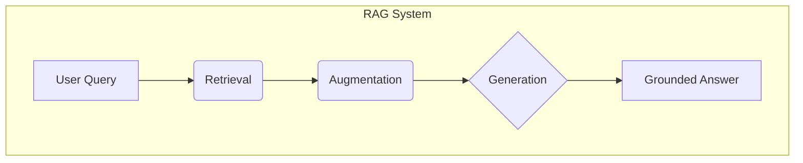
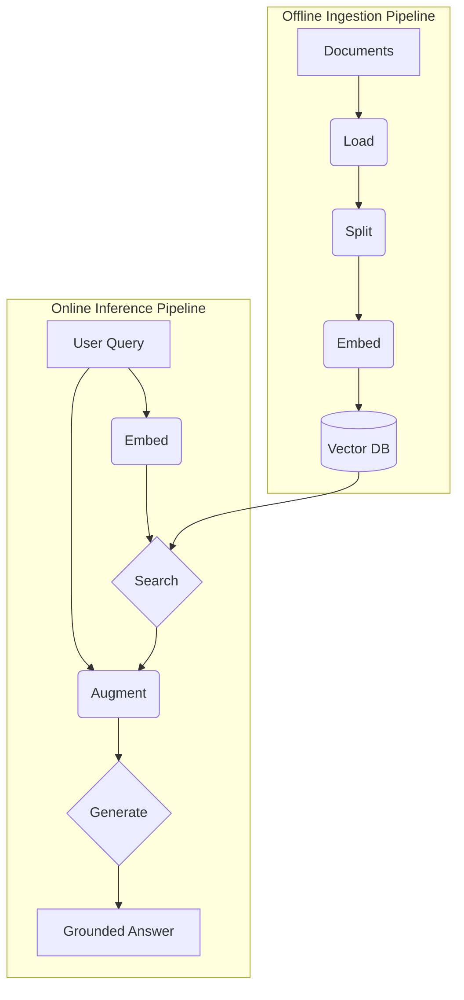
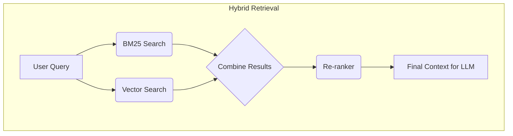
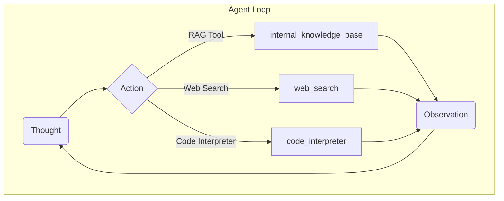

# Lesson 9: Retrieval-Augmented Generation (RAG)

Most LLMs today are trained *once* on a fixed corpus, which makes their internal knowledge *static*. Pre-training is essentially taking a "closed-book exam" on the world's information. This leads to familiar limits; models won’t natively know about post-cutoff events or private/proprietary data, and when forced to guess, they may hallucinate [[1]](https://decodingml.substack.com/p/rag-fundamentals-first?utm_source=publication-search), [[2]](https://highlearningrate.substack.com/p/the-rise-of-rag). 

Why not update the weights again? Methods like Supervised fine-tuning (SFT) can help, but in practice, it's resource-heavy and slow. Teams must curate datasets, run multi-day training jobs, and manage risks like catastrophic forgetting (improving performance on one task while losing it on previously learned ones) [[21](https://arxiv.org/abs/1312.6211)] [[19](https://arxiv.org/pdf/2406.04836)]. Ideally, we’d like models to adapt more like humans, updating from feedback and updating weights continuously. Reinforcement-learning approaches move in that direction, but they’re outside our scope here and remain an open research question [[22](https://arxiv.org/pdf/2411.15124v1)], [[23](https://arxiv.org/pdf/2309.00267v2)].

Today’s practical workaround is the **context window**, the model’s working memory (RAM). Instead of retraining, we *supply* the facts each time we call the model. But context is finite and costly: performance degrades with oversized prompts, and models are known to under-use information buried in the middle of very long inputs (“lost in the middle”) [[20](https://arxiv.org/abs/2307.03172v3)]. So “just put everything in the prompt” doesn’t scale. Even as context windows grow, selection beats stuffing; the practical path is to fetch only what’s needed, just in time, rather than cram everything in.

This is where Retrieval-Augmented Generation (RAG) comes in. With RAG, we store millions of tokens of external knowledge in a database and retrieve just the right snippets at runtime. We then place those snippets in context so that the model can answer accurately [[3]](https://blogs.nvidia.com/blog/what-is-retrieval-augmented-generation/). In other words, we turn a closed-book exam into an open-book one. In [Lesson 3](https://academy.towardsai.net/courses/take/agent-engineering/multimedia/67469652-lesson-3-context-engineering), we called this Context Engineering, the work of curating the information flow into the model. With RAG, our applications become more accurate, verifiable, and trustworthy because answers can be grounded in and cite their sources [[3]](https://blogs.nvidia.com/blog/what-is-retrieval-augmented-generation/).

We’ve made a video about RAG if you’d like a quick refresh:

[https://youtu.be/LAfrShnpVIk](https://youtu.be/LAfrShnpVIk)

Since the external knowledge base lives outside the model, the natural move in an *agentic* system is to expose it as a tool. In [Lesson 6](https://academy.towardsai.net/courses/take/agent-engineering/multimedia/67961180-lesson-6-tools) we learned how to build tools, and in [Lesson 8](https://academy.towardsai.net/courses/take/agent-engineering/multimedia/68166281-lesson-8-react-practice) we wired them into a ReAct loop so the model can decide when to call them. Give your assistant a retrieval tool that queries an external DB, and you’ve got what the industry calls “Agentic RAG”. An agent that thinks, issues retrieval calls when it needs external information, reads the results, and uses them to ground its answers with no manual document stuffing required.

From here, a new need will naturally emerge. As agents look things up, make decisions, and interact with users, people expect them to *remember* what mattered: preferences, past conversations, learned procedures, and facts discovered along the way. That’s the role of a memory system. In practice, we pair the read-path of RAG with a write-path that proposes additions, updates, or deletions to an external store, also called Long-Term memory. In this lesson, we’ll focus on retrieval. In the next lesson, Memory for Agents, we’ll see what a memory system is and how they are built.

We’ll start by decomposing RAG into its fundamental components and architecture. From there, we’ll explore the techniques required to make RAG production-ready and show how it becomes a great tool inside the agentic frameworks we’ve seen.

## The RAG System: Core Components

To properly design and implement a RAG system, you first need to understand its three conceptual pillars. These components work together as part of the Context Engineering process we discussed in Lesson 3 to ground an LLM's response in external facts. By breaking the system into these distinct parts, you can isolate responsibilities, troubleshoot issues more effectively, and ensure that the LLM always receives the most relevant and accurate information.

The first pillar is **Retrieval**. This component acts as the search engine of your RAG system. Its primary job is to take a user's query and efficiently find the most relevant information from your knowledge base [[4]](https://towardsai.net/p/l/a-complete-guide-to-rag).

The dominant technique is semantic search, which relies on vector embeddings. These are numerical representations of text where words and phrases with similar *meanings* are mapped to nearby points in a high-dimensional space. An embedding model processes an input, usually just text, capturing its semantic meaning and converting it into these dense vectors.


Figure 1: Different words “embedded” and projected into a new multidimensional space. Notice how words with similar meanings are closer together in the “embedding space”.

We create these embeddings for all your documents during an offline ingestion process and store them in a specialized vector database. When a user query arrives, we convert it into a vector using the same embedding model. Then, we compare this query vector against the document vectors in the database to find those that are semantically closest, often using a metric such as cosine similarity [[1]](https://decodingml.substack.com/p/rag-fundamentals-first?utm_source=publication-search).

The next pillar is **Augmentation**. Once the retrieval component finds the most relevant document chunks, we prepare this information for the LLM. Augmentation is the process of carefully formatting the retrieved text into the prompt sent to the language model. This step plays a key role in effective Context Engineering, as it involves creating a structured prompt that includes the original user query, the retrieved context, and clear instructions for the LLM on how to use that context to generate an accurate answer [[4]](https://towardsai.net/p/l/a-complete-guide-to-rag).

Finally, we have the **Generation** phase. We send the augmented prompt, now rich with relevant external information, to the LLM. The model's task is to synthesize this information and generate a coherent, factually grounded answer to the user's original question [[1]](https://decodingml.substack.com/p/rag-fundamentals-first?utm_source=publication-search). The quality of the final output depends heavily on the relevance of the retrieved context and the clarity of the instructions we provide in the augmented prompt.



*Figure 2: The three core components of a Retrieval-Augmented Generation system.*

Understanding these three components is the first step. Now, let us see how they fit into the end-to-end operational pipeline of a real-world RAG system.

## The RAG Pipeline: Ingestion and Retrieval

A production-ready RAG system operates in two distinct phases: an offline process for preparing data and an online process for answering queries in real-time. Separating these workflows is important for efficiency and scalability, as it allows you to handle computationally intensive data preparation independently from the low-latency demands required when the user interacts with your application [[5]](https://learn.microsoft.com/en-us/azure/developer/ai/advanced-retrieval-augmented-generation).

The first phase is **Offline Ingestion & Indexing**. This is where you build your knowledge base. The process begins by **loading** documents from various sources, such as PDFs, websites, or databases. 

Next, you **split** documents into smaller, manageable chunks. We do this to work around the LLM’s context window limit; very long PDFs or books won’t fit in their entirety, and just as importantly to improve retrieval precision. 

Most embedding models have an effective window and a training-length “sweet spot.” If a model mostly saw ~500 tokens per example during training, it tends to capture meaning most faithfully at roughly that scale. Too small and you lose context; too large and unrelated ideas get averaged together, weakening the signal. Aim for chunks that map to a single logical unit (a paragraph, a self-contained step, a short subsection), and use a small overlap (e.g., 10–20%) to avoid cutting ideas in half. In practice, we tune size empirically: we test a few ranges (e.g., 400–1,500, sometimes up to ~2,000) on a labeled set and pick what maximizes retrieval metrics (hit rate/recall, plus a ranked metric like MRR@k or nDCG@k).

<aside>
💡

Recent long-context embedding models ([Cohere’s `embed-v4`](https://docs.cohere.com/docs/semantic-search-embed) at ~128k tokens) can encode entire articles or procedures and still match with single-sentence queries when you mark inputs appropriately, e.g., `input_type="search_document”` or `input_type="search_query”`. This is asymmetric search. It makes it viable to index both granular chunks for pinpoint answers and whole documents for cases where the right outcome is to surface the complete policy/procedure rather than three adjacent chunks.

</aside>

You can use rule-based chunkers, like LangChain's `RecursiveCharacterTextSplitter`, or semantic chunkers to ensure that you do not cut ideas in half [[1]](https://decodingml.substack.com/p/rag-fundamentals-first?utm_source=publication-search).

After splitting, we pass each chunk to an embedding model to **embed** it, converting the text into a numerical vector that captures its semantic meaning. Popular embedding models include OpenAI's `text-embedding-3-large/small`, Google's `gemini-text-embedding-001`, or Cohere’s `embed-v4`. Finally, you **store** these embeddings and their corresponding text chunks in a vector database, creating an index that can be searched quickly. You can use local options, such as FAISS, or production-grade vector databases like Milvus, Qdrant, or Pinecone [[1]](https://decodingml.substack.com/p/rag-fundamentals-first).

The second phase is **Online Retrieval & Generation**, which happens every time a user submits a query. The user's **query** is the starting point. We then transform this query into a vector using the same embedding model from the ingestion phase to ensure consistency. The system then uses this query vector to **search** the vector database for the top-k most similar document chunks.

Once the relevant chunks are retrieved, we use them to augment the user's query in a prompt. Finally, the LLM **generates** an answer based on this augmented prompt. As we saw in Lesson 4, you can use structured outputs here to ensure the answer includes citations or is formatted in a specific way [[1]](https://decodingml.substack.com/p/rag-fundamentals-first).



*Figure 3: The end-to-end RAG pipeline, split into its offline ingestion and online inference phases.*


*Figure 4: The end-to-end RAG pipeline, split into its offline ingestion and online inference phases.*

With this end-to-end path in place, the next challenge is ensuring quality. A naive RAG pipeline often struggles with the messiness of real-world data, which is why we need advanced techniques to improve retrieval accuracy. If you’re curious about implementation details, we’ll build a minimal, from-scratch multimodal RAG and agentic RAG in Lesson 11.

## Advanced RAG Techniques

While a basic RAG pipeline is a good starting point, production systems need more advanced techniques to handle diverse data and complex queries. These methods improve the quality of the retrieved context, which directly impacts the accuracy of the final answer.


Figure 5 Example of a more robust RAG pipeline.

A helpful way to reason about improvements is to look at *where* they act on the pipeline. Some optimizations happen before retrieval (shaping the query, filtering the corpus), others during retrieval itself (how we search and score), and others after retrieval (re-ranking or restructuring context before generation). Thinking in these three categories makes diagnosing failures easier and deciding what to try next.

Now, let’s list some of these advanced techniques and see how they work. 

### Hybrid Search

Hybrid search combines traditional keyword-based search, such as BM25, with modern vector search. BM25 excels at exact terms, acronyms, codes, and jargon, while vector search captures semantic meaning and synonyms [[6]](https://www.elastic.co/what-is/hybrid-search). In practice, the most common way to improve retrieval breadth is to attach multiple indexes to your knowledge base so different signals can vote. A classic pairing is a search index (BM25 + field filters) alongside a vector index. But you don’t have to stop there; you can also fan out to SQL (for policy or catalog lookups), time-series queries, or any mechanism your data already supports, then fuse the results at scoring time.

For example, if a user asks about “RMD rules for 2025”, a keyword index surfaces pages that literally mention RMD (Required Minimum Distribution) and “2025”. A vector index brings in passages that say “mandatory retirement withdrawals next year” or “minimum distribution requirements” without the acronym. Similarly, a query for “GDPR Article 30 records” benefits from BM25 on “Article 30” while vectors catch “records of processing activities.” Combining both gives coverage and precision [[7]](https://blog.vectorchord.ai/hybrid-search-with-postgres-native-bm25-and-vectorchord)



*Figure 6: A hybrid retrieval flow combining keyword and vector search, followed by a re-ranking step.*

### Re-ranking

Re-ranking adds a second stage to the retrieval process. After an initial retrieval fetches a broad set of candidate documents, a more advanced model, like a cross-encoder, re-evaluates and re-orders these candidates. The cross-encoder examines the query and each document together to produce a more accurate relevance score, ensuring the most relevant documents are placed at the top [[8]](https://sbert.net/examples/sentence_transformer/applications/retrieve_rerank/README.html). This is important for the LLM's attention and improves the signal-to-noise ratio of the context [[9]](https://www.pinecone.io/learn/series/rag/rerankers/). Because a cross-encoder scores each (query, chunk) pair, it introduces meaningful latency and should be used when accuracy is critical or k is large. A tiny example:

Initial retrieval returns:

```python
chunk1
chunk2
chunk3
```

The reranker returns:

```python
chunk2
chunk3
chunk1
```

and we might choose to keep:

```python
chunk2
chunk3
```

In other words, we retrieve with a generous top-k, then keep the top-r only after re-ranking to ensure the context is small and relevant.

### Query Transformations

Query transformations modify the user's input to improve retrieval. One method is **decomposition**, which breaks a complex question into simpler sub-questions [[10]](https://wandb.ai/site/articles/rag-techniques/). Another method is **Hypothetical Document Embeddings (HyDE)**. Here, an LLM first generates a hypothetical ideal answer to the query. The embedding of this hypothetical answer is then used for the search, which often retrieves more relevant documents than the original, sometimes ambiguous, query [[11]](https://www.pondhouse-data.com/blog/advanced-rag-hypothetical-document-embeddings).

Suppose the question is, “What’s our travel policy for European conferences this year?” You can decompose to: where the policy lives, what qualifies as a “conference,” which rules apply to Europe, and what changed “this year.” Retrieve for each sub-question, to get the location of the authoritative doc, definition section, region-specific clauses, and the changelog, and then synthesize the final answer, citing the relevant excerpts.

### Advanced Chunking Strategies

Advanced chunking strategies move beyond fixed-size splitting, which can awkwardly cut sentences or ideas in half. **Semantic chunking** splits documents based on topical shifts, keeping related sentences together. For structured documents like PDFs or tables, **layout-aware chunking** preserves the document's inherent structure. Another approach is **context-enriched chunking**, which adds explanatory context to each chunk before embedding, improving retrieval accuracy [[12]](https://www.anthropic.com/news/contextual-retrieval).

### GraphRAG

GraphRAG uses knowledge graphs to answer questions about relationships that are hard to capture in isolated chunks. Conceptually, it is another index type alongside vector and keyword search: the index here is a graph of entities and typed edges, and retrieval is graph traversal plus path scoring [[13]](https://www.zyphra.com/post/understanding-graph-based-rag-and-multi-hop-question-answering). It's the type of index that can be useful when the relationships are discovered from messy, unstructured text. 

Consider the question, “Which incidents were caused by weekend deployments that also touched the login service?” In a graph, you might model:

- Entities: `Deployment`, `Service`, `Incident`, `ChangeTicket`, `CalendarDay`.
- Relationships: `Deployment --affects--> Service`, `Incident --linked_to--> Deployment`, `Deployment --has_change--> ChangeTicket`, `Deployment --happened_on--> CalendarDay`, `CalendarDay --is_weekend--> true`.

A traversal answers the question by filtering `Deployment` nodes where `CalendarDay.is_weekend = true`, intersecting with `Deployment --affects--> Service(name="login")`, and following `Incident --linked_to--> Deployment`to return the matching `Incident`nodes, optionally scoring by proximity or edge confidence [[14]](https://arxiv.org/html/2404.16130v2).

### Metadata Filtering

One of the most effective levers in production is metadata filtering. If each chunk carries fields like `source`, `department`, `country`, `language`, `policy_version`, or `effective_date`, you can filter the search space before scoring. This is especially important when documents are similar but scoped differently.

Temporal filters are particularly handy. If a user asks, “What changed between March and June 2025?”, restrict retrieval to chunks with `effective_date` within `2025-03-01` to `2025-06-30`, then retrieve within that slice. You can also apply bitemporal logic—filter by `effective_date` for what’s true on the ground while separately tracking `indexed_at` for data freshness—to avoid surfacing stale guidance.

These techniques improve retrieval quality. Next, we will see how retrieval becomes one of many tools an intelligent agent can choose to use as it reasons through a problem.

## Agentic RAG

As we explored in Lessons 7 and 8, the ReAct framework enables an agent to reason, act, and observe in a loop. Agentic RAG is the practical application of this concept, where RAG is not a rigid pipeline but a dynamic tool that a ReAct-style agent can choose to use. The core distinction is the shift from a linear workflow to an adaptive, iterative process controlled by an agent [[15]](https://www.digitalocean.com/community/conceptual_articles/rag-ai-agents-agentic-rag-comparative-analysis).

In practice, you expose your retrieval logic as a tool, for example, `retrieve_documents()` with arguments for query text, index choice, and metadata filters. This way, the agent can decide when to call it, with what parameters, and how many iterations to run. The agent can choose whether a single pass is sufficient or whether to refine the query and call the tool again [[16]](https://weaviate.io/blog/what-is-agentic-rag). It can also decide which knowledge source to consult based on the user’s goal, and whether external verification is required [[17]](https://arize.com/blog/understanding-agentic-rag/).

This agentic approach enables several advanced capabilities. The agent can iteratively use the RAG tool, refining its query based on initial results. It can also choose which knowledge base to search. For example, for an IT outage, it might query `search_incident_runbooks` instead of `search_marketing_materials`. Furthermore, the agent can fuse information from its RAG tool with outputs from other tools, like a web search or a code interpreter [[18]](https://workativ.com/ai-agent/blog/agentic-rag). The agent can even decide to update its knowledge base with new information it learns, a concept related to memory that we will explore in the next lesson.

Consider this conceptual thought process for an agent:

- **Thought:** The user is asking about "2024 EU data retention rules." Our internal policy cites 2023, which is likely outdated.
- **Action:** `retrieve(internal_policy, query="EU data retention 2024")`
- **Observation:** The retrieved document mentions amendments but is missing citations.
- **Thought:** I need external verification.
- **Action:** `web_search("EU data retention 2024 official")`
- **Observation:** Found a new directive published by the EU.
- **Thought:** I will synthesize and cite both, highlighting changes from 2023.

This transforms RAG from a simple database lookup into a conversation with a knowledgeable research assistant.



*Figure 7: An agent's reasoning loop, showing its ability to choose between multiple tools, including a RAG tool for internal knowledge.*

You now understand both a linear RAG pipeline and how an agent can control retrieval when needed. Let us wrap up by situating RAG in the wider AI Engineering toolkit and previewing what comes next.

## Conclusion

In this lesson, we covered RAG, from fundamentals to its role in advanced agentic systems. RAG mitigates core limitations like knowledge cutoffs and hallucinations by grounding models in external, verifiable data. This not only improves accuracy but also builds user trust by enabling systems to cite their sources.

For production-grade applications, moving beyond a basic implementation is necessary. Advanced techniques like hybrid search, re-ranking, and sophisticated chunking are important for achieving the quality and relevance needed in the real world. As we have seen, the future of knowledge retrieval is agentic. By treating RAG as a tool within an intelligent agent's toolkit, we move from rigid, linear pipelines to dynamic, adaptive systems that can reason about their information needs.

Mastering RAG is a foundational competency for any AI Engineer. It is an essential component of the broader discipline of Context Engineering, which is crucial to developing effective and trustworthy AI applications.

This lesson sets the stage for our next topic. In Lesson 10, we will explore Memory for Agents, examining how short-term and long-term memory systems complement the on-demand retrieval capabilities of RAG. We will also cover later in the course concepts such as retrieval quality evaluations and production monitoring, which are crucial for maintaining high-performing systems.

## References

- [1] [Retrieval-Augmented Generation (RAG) Fundamentals First](https://decodingml.substack.com/p/rag-fundamentals-first?utm_source=publication-search)
- [2] [The Rise of RAG](https://highlearningrate.substack.com/p/the-rise-of-rag)
- [3] [What Is Retrieval-Augmented Generation, aka RAG?](https://blogs.nvidia.com/blog/what-is-retrieval-augmented-generation/)
- [4] [A Complete Guide to RAG](https://towardsai.net/p/l/a-complete-guide-to-rag)
- [5] [Build advanced retrieval-augmented generation systems](https://learn.microsoft.com/en-us/azure/developer/ai/advanced-retrieval-augmented-generation)
- [6] [What is Hybrid Search?](https://www.elastic.co/what-is/hybrid-search)
- [7] [Hybrid Search with Postgres Native BM25 and VectorChord](https://blog.vectorchord.ai/hybrid-search-with-postgres-native-bm25-and-vectorchord)
- [8] [Retrieve & Re-Rank](https://sbert.net/examples/sentence_transformer/applications/retrieve_rerank/README.html)
- [9] [What Are Rerankers?](https://www.pinecone.io/learn/series/rag/rerankers/)
- [10] [Query Transformations for RAG](https://wandb.ai/site/articles/rag-techniques/)
- [11] [Advanced RAG: Hypothetical Document Embeddings](https://www.pondhouse-data.com/blog/advanced-rag-hypothetical-document-embeddings)
- [12] [Introducing Contextual Retrieval](https://www.anthropic.com/news/contextual-retrieval)
- [13] [Understanding Graph-Based RAG and Multi-Hop Question Answering](https://www.zyphra.com/post/understanding-graph-based-rag-and-multi-hop-question-answering)
- [14] [From Local to Global: A GraphRAG Approach to Query-Focused Summarization](https://arxiv.org/html/2404.16130v2)
- [15] [RAG vs. AI Agents vs. Agentic RAG: A Comparative Analysis](https://www.digitalocean.com/community/conceptual_articles/rag-ai-agents-agentic-rag-comparative-analysis)
- [16] [What is Agentic RAG?](https://weaviate.io/blog/what-is-agentic-rag)
- [17] [Understanding Agentic RAG](https://arize.com/blog/understanding-agentic-rag/)
- [18] [Agentic RAG: The Future of RAG-Based Applications](https://workativ.com/ai-agent/blog/agentic-rag)
- [19] [Revisiting Catastrophic Forgetting in Large Language Model Tuning](https://arxiv.org/pdf/2406.04836)
- [20] [Lost in the Middle: How Language Models Use Long Contexts](https://arxiv.org/abs/2307.03172v3)
- [21] [An Empirical Investigation of Catastrophic Forgetting in Gradient-Based Neural Networks](https://arxiv.org/abs/1312.6211)
- [22] [TÜLU 3: Pushing Frontiers in Open Language Model Post-Training](https://arxiv.org/pdf/2411.15124v1)
- [23] [RLAIF: Scaling Reinforcement Learning from Human Feedback with AI Feedback](https://arxiv.org/pdf/2309.00267v2)