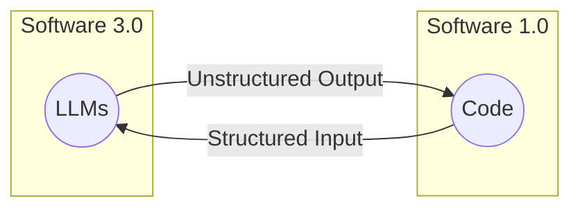
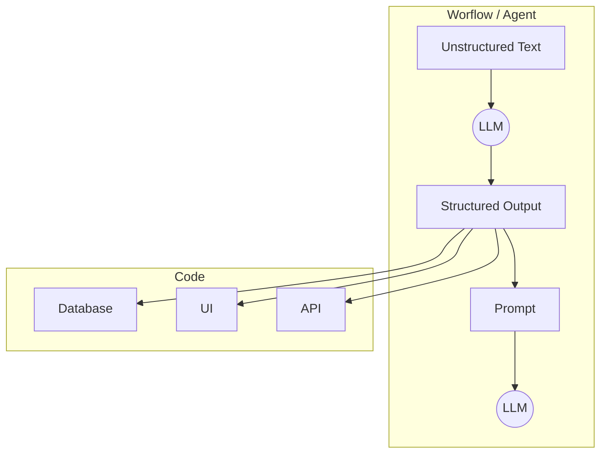

# Lesson 4: Structured Outputs

In our previous lessons, we laid the groundwork for AI Engineering. We explored the AI agent landscape, looked at the difference between rule-based LLM workflows and autonomous AI agents, and covered context engineering: the art of feeding the right information to an LLM. In this lesson, we will tackle a fundamental challenge: getting structured and reliable information *out* of an LLM.



Figure 1: The goal of structured outputs is to fill in the gap between Software 3.0 (LLM workflows & AI Agents) and Software 1.0 (Traditional Applications). **Side note:** Software 2.0 is referred to as the Machine Learning/Deep Learning world.

LLMs operate in a world of unstructured data and probabilities, where we input instructions in plain English and get results as plain text. This subdomain of engineering is often called "Software 3.0". Our application, however, relies on deterministic code and predictable data structures, which is known as "Software 1.0". Structured outputs are the bridge between these two worlds, a fundamental technique for forcing LLMs to return consistent, machine-readable data. Mastering this is essential for any AI engineer building production-grade systems.

## Why Structured Outputs Are Critical

Before we start coding, it is crucial to understand why structured outputs are foundational to building reliable AI applications. When an LLM returns a free-form string, you face the messy task of parsing it. This often involves fragile regular expressions or string-splitting logic. These methods easily break if the model changes its phrasing even slightly [[1]](https://pmc.ncbi.nlm.nih.gov/articles/PMC11751965/), [[2]](https://arxiv.org/html/2506.21585v1). Structured outputs solve this by forcing the model’s response into a predictable format like JSON.

This approach offers several key benefits.

First, structured outputs are easy to parse, manipulate, and debug. Instead of wrestling with raw text, you work with clean Python objects like dictionaries or, even better, Pydantic models. This allows you to programmatically access the data you need without guesswork, making your code cleaner and more predictable.

Second, using libraries like Pydantic adds a layer of data and type validation [[3]](https://www.speakeasy.com/blog/pydantic-vs-dataclasses), [[4]](https://codetain.com/blog/validators-approach-in-python-pydantic-vs-dataclasses/). If the LLM returns a string where an integer is expected, your application will not crash silently with a `TypeError` or `KeyError` down the line. Instead, it will raise a clear validation error immediately. This "fail-fast" behavior is essential for building reliable systems and preventing bad data from propagating through your application.

Structured outputs create a formal contract between the LLM and your application code, making it easier to pass data around the system. Engineers use this pattern everywhere. As seen in Figure 1, we leverage structured outputs to pass the right subset of information to the next LLM step or other downstream systems like databases, user interfaces, or APIs. For example, a popular use case is to extract properties like names, tags, and dates to build knowledge graphs for advanced RAG or natural language filters to filter records from the database [[5]](https://www.prompts.ai/en/blog-details/automating-knowledge-graphs-with-llm-outputs), [[6]](https://humanloop.com/blog/structured-outputs), [[7]](https://developers.redhat.com/articles/2025/06/03/structured-outputs-vllm-guiding-ai-responses).



Figure 2: A simplified flow showing how structured outputs bridge the gap between LLMs and downstream components.

To understand how structured outputs work in practice, we will explore three ways to implement them: from scratch with JSON, from scratch with Pydantic, and natively with the Gemini API.

## Implementing Structured Outputs From Scratch Using JSON

We will first implement structured outputs from scratch, guiding an LLM to generate structured outputs. This will help you build an intuition of what modern LLM APIs offer. 

<aside>
💡

You can find the code of this lesson in the notebook of Lesson 4, in the GitHub repository of the course.

</aside>

Our goal is to prompt the model to return a JSON object and then parse it into a Python dictionary. We will demonstrate this with a simple example where we extract key details, such as a summary, tags, keywords, and other statistics, from financial documents.

1. We begin by setting up our environment. This involves initializing the Gemini client from the [google-genai](https://googleapis.github.io/python-genai/index.html) Python package, which defines the model we will use. Gemini offers two core types of models: `flash` and `pro`. For our simple examples, we will use `gemini-2.5-flash`, which is fast and cost-effective. While `pro` models are bigger and more costly, they are more useful for intensive reasoning tasks, such as for ReAct agents. More information on Gemini models [here](https://ai.google.dev/gemini-api/docs/models).
    
    ```python
    import json
    
    from google import genai
    from lessons.utils import env
    
    env.load(required_env_vars=["GOOGLE_API_KEY"])
    
    client = genai.Client()
    
    MODEL_ID = "gemini-2.5-flash"
    ```
    
    <aside>
    💡
    
    In all our examples, we will use Google's [google-genai](https://googleapis.github.io/python-genai/index.html) official Python AI SDK to access their Gemini models. More docs on the package can be found in their [getting started guides](https://ai.google.dev/gemini-api/docs) or [SDK docs](https://googleapis.github.io/python-genai/index.html). To ensure everything works fine when running the code, follow all the steps from the course admin lesson first.
    
    </aside>
    
2. Next, we define a sample document for analysis.
    
    ```python
    DOCUMENT = """
    # Q3 2023 Financial Performance Analysis
    
    The Q3 earnings report shows a 20% increase in revenue and a 15% growth in user engagement,
    beating market expectations. These impressive results reflect our successful product strategy
    and strong market positioning.
    
    Our core business segments demonstrated remarkable resilience, with digital services leading
    the growth at 25% year-over-year. The expansion into new markets has proven particularly
    successful, contributing to 30% of the total revenue increase.
    
    Customer acquisition costs decreased by 10% while retention rates improved to 92%,
    marking our best performance to date. These metrics, combined with our healthy cash flow
    position, provide a strong foundation for continued growth into Q4 and beyond.
    """
    ```
    
3. Now, we craft a prompt that instructs the LLM to extract metadata and format it as JSON. Notice how we provide a clear example of the desired structure and use XML tags like `<document>` and `<json>` to separate the input data from the formatting instructions. This is a common and effective prompt engineering technique to improve clarity and guide the model's output [[8]](https://help.openai.com/en/articles/6654000-best-practices-for-prompt-engineering-with-the-openai-api), [[9]](https://aws.amazon.com/blogs/machine-learning/structured-data-response-with-amazon-bedrock-prompt-engineering-and-tool-use/). The key to good prompt engineering is providing a clear example of how the output should look.
    
    ```python
    prompt = f"""
    Analyze the following document and extract metadata from it.
    The output must be a single, valid JSON object with the following structure:
    <json>
    {{
        "summary": "A concise summary of the article.",
        "tags": ["list", "of", "relevant", "tags"],
        "keywords": ["list", "of", "key", "concepts"],
        "quarter": "Q...",
        "growth_rate": "...%",
    }}
    </json>
    
    Here is the document:
    <document>
    {DOCUMENT}
    </document>
    """
    ```
    
4. We send the prompt to the model and inspect the raw response. As expected, the model returns a JSON object, but it is often wrapped in Markdown code blocks.
    
    ```python
    response = client.models.generate_content(model=MODEL_ID, contents=prompt)
    ```
    
    It outputs:
    
    ```python
    ```json
    {
        "summary": "The Q3 2023 financial report highlights a strong performance with a 20% increase in revenue and 15% growth in user engagement, surpassing market expectations. This success is attributed to effective product strategy, strong market positioning, and successful expansion into new markets. The company also improved efficiency, reducing customer acquisition costs by 10% and achieving a 92% customer retention rate.",
        "tags": [
            "Financial Performance",
            "Q3 2023",
            "Earnings Report",
            "Revenue Growth",
            "User Engagement",
            "Market Expansion",
            "Customer Retention",
            "Business Strategy"
        ],
        "keywords": [
            "Q3",
            "Revenue",
            "Growth",
            "User engagement",
            "Digital services",
            "New markets",
            "Customer acquisition cost",
            "Retention rate",
            "Financial results"
        ],
        "quarter": "Q3",
        "growth_rate": "20%"
    }
    ```
    ```
    
5. To parse the generated output, we create a simple helper function to strip the Markdown JSON tags, leaving us with a clean JSON string.
    
    ```python
    def extract_json_from_response(response: str) -> dict:
        """
        Extracts JSON from a response string that is wrapped in <json> or ```json tags.
        """
    
        response = response.replace("<json>", "").replace("</json>", "")
        response = response.replace("```json", "").replace("```", "")
    
        return json.loads(response)
    ```
    
6. Finally, we parse the string into a Python dictionary, which can now be used in your application.
    
    ```python
    parsed_response = extract_json_from_response(response.text)
    ```
    
    It outputs:
    
    ```json
    {
      "summary": "The Q3 2023 financial report highlights a strong performance with a 20% increase in revenue and 15% growth in user engagement, surpassing market expectations. This success is attributed to effective product strategy, strong market positioning, and successful expansion into new markets. The company also improved efficiency, reducing customer acquisition costs by 10% and achieving a 92% customer retention rate.",
      "tags": [
        "Financial Performance",
        "Q3 2023",
        "Earnings Report",
        "Revenue Growth",
        "User Engagement",
        "Market Expansion",
        "Customer Retention",
        "Business Strategy"
      ],
      "keywords": [
        "Q3",
        "Revenue",
        "Growth",
        "User engagement",
        "Digital services",
        "New markets",
        "Customer acquisition cost",
        "Retention rate",
        "Financial results"
      ],
      "quarter": "Q3",
      "growth_rate": "20%"
    }
    ```
    

This "from scratch" method works, but it relies on manual parsing and lacks data validation. If the LLM makes a mistake, such as outputting an int or null instead of a string, our application will fail. Next, we will see how Pydantic solves this problem.

## Implementing Structured Outputs From Scratch Using Pydantic

While forcing JSON output is an improvement over parsing raw text, it still leaves you with a plain Python dictionary. You cannot be sure what is inside that dictionary, if the keys are correct, or if the values have the right type. This uncertainty can lead to bugs and make your code difficult to maintain. This is where Pydantic helps. Pydantic is a data validation library that enforces structure and type hints at runtime, ensuring data integrity from the moment data enters your application [[3]](https://www.speakeasy.com/blog/pydantic-vs-dataclasses). It provides a single, clear source of truth for your data structure and can automatically generate a JSON Schema from your Python class.

When an LLM produces output that does not match the structure and types defined in your Pydantic model, the library raises a `ValidationError`. This error clearly explains what went wrong, allowing you to quickly identify and fix issues. This "fail-fast" behavior is essential for building reliable systems, preventing bad data from moving through your application and causing hard-to-debug errors later.

Let's refactor our previous example to use Pydantic.

1. We define our desired data structure as a Pydantic class. This class acts as a single source of truth for your output format. We use standard Python type hints to define the expected type for each field. Pydantic works with Python’s `typing` module. Still, since Python 3.9, you can use built-in types like `list` directly, making the code cleaner. For example, `tags: list[str]` is now preferred over importing `List` from `typing`.
    
    ```python
    from pydantic import BaseModel, Field
    
    class DocumentMetadata(BaseModel):
        """A class to hold structured metadata for a document."""
    
        summary: str = Field(description="A concise, 1-2 sentence summary of the document.")
        tags: list[str] = Field(description="A list of 3-5 high-level tags relevant to the document.")
        keywords: list[str] = Field(description="A list of specific keywords or concepts mentioned.")
        quarter: str = Field(description="The quarter of the financial year described in the document (e.g, Q3 2023).")
        growth_rate: str = Field(description="The growth rate of the company described in the document (e.g, 10%).")
    ```
    
    You can also nest Pydantic models to represent more complex, hierarchical data. This allows you to define intricate relationships between different pieces of information, such as a `DocumentMetadata` model containing a `Summary` object and a list of `Tag` objects. Nesting helps organize your data logically and reflects the real-world complexity of information. However, it is a good practice to keep schemas from becoming overly complex, as it can confuse the LLM and lead to errors:
    
    ```python
    class Summary(BaseModel):
        text: str
        sentiment: float
    
    class Tag(BaseModel):
        label: str
        relevance: float
    
    class ComplexDocumentMetadata(BaseModel):
        summary: Summary
        tags: list[Tag]
    ```
    
2. With our Pydantic model defined, we can automatically generate a JSON Schema from it. A schema is the standard term for defining the structure and constraints of your data. Think of it as a formal contract between your application and the LLM. This contract precisely dictates the expected fields, their types, and any validation rules. We provide this generated schema to the LLM to guide its output, giving the model a clear blueprint for its response. This is similar to the technique used internally by APIs like Gemini and OpenAI to enforce a specific output format, ensuring their models adhere to predefined structures [[10]](https://ai.google.dev/gemini-api/docs/structured-output). More on this in the next section.
    
    ```python
    schema = DocumentMetadata.model_json_schema()
    ```
    
    The generated schema looks like this. Notice how the `description` defined in the `Field` type descriptor is present in the schema passed to the LLM to guide the structured output generation process. This makes Pydantic the perfect tool for defining your schemas:
    
    ```python
    ```json
    {'description': 'A class to hold structured metadata for a document.',
     'properties': {'summary': {'description': 'A concise, 1-2 sentence summary of the document.',
       'title': 'Summary',
       'type': 'string'},
      'tags': {'description': 'A list of 3-5 high-level tags relevant to the document.',
       'items': {'type': 'string'},
       'title': 'Tags',
       'type': 'array'},
      'keywords': {'description': 'A list of specific keywords or concepts mentioned.',
       'items': {'type': 'string'},
       'title': 'Keywords',
       'type': 'array'},
      'quarter': {'description': 'The quarter of the financial year described in the document (e.g, Q3 2023).',
       'title': 'Quarter',
       'type': 'string'},
      'growth_rate': {'description': 'The growth rate of the company described in the document (e.g, 10%).',
       'title': 'Growth Rate',
       'type': 'string'}},
     'required': ['summary', 'tags', 'keywords', 'quarter', 'growth_rate'],
     'title': 'DocumentMetadata',
     'type': 'object'}
     ```
    ```
    
3. We update our prompt to include this JSON Schema. This gives the model a much more precise set of instructions than our previous plain-text example.
    
    ```python
    prompt = f"""
    Please analyze the following document and extract metadata from it.
    The output must be a single, valid JSON object that conforms to the following JSON Schema:
    <json>
    {json.dumps(schema, indent=2)}
    </json>
    
    Here is the document:
    <document>
    {DOCUMENT}
    </document>
    """
    ```
    
4. Now we call the model and extract the JSON string, as in the previous example.
    
    ```python
    response = client.models.generate_content(model=MODEL_ID, contents=prompt)
    parsed_response = extract_json_from_response(response.text)
    ```
    
    It outputs:
    
    ```json
    {
        "summary": "The Q3 2023 financial report details a 20% increase in revenue and 15% growth in user engagement, surpassing market expectations. This strong performance is attributed to successful product strategy, market expansion, and improved customer acquisition and retention metrics, providing a solid foundation for continued growth.",
        "tags": [
            "Financial Performance",
            "Earnings Report",
            "Business Growth",
            "Revenue Growth",
            "Market Expansion"
        ],
        "keywords": [
            "Q3 2023",
            "revenue increase",
            "user engagement",
            "digital services",
            "new markets",
            "customer acquisition costs",
            "retention rates",
            "cash flow",
            "market expectations"
        ],
        "quarter": "Q3 2023",
        "growth_rate": "20%"
    }
    ```
    
5. Ultimately, we validate and parse it directly into our `DocumentMetadata` object.
    
    ```python
    try:
        document_metadata = DocumentMetadata.model_validate(parsed_response)
        print("Validation successful!")
    except Exception as e:
        print(f"Validation failed!")
    ```
    
    It outputs:
    
    ```
    Validation successful!
    ```
    
    The `document_metadata` Pydantic objects can now be safely used throughout your application, with full type-hinting and attribute access. This is the main advantage: you move away from unclear dictionaries, where you constantly check for missing keys or incorrect types, to clean, predictable Python objects.
    
6. For example, if for the tags attribute we had a simple string instead of a list of strings (as defined in the Pydantic model), such as.
    
    ```python
    tags = "Financial Performance, Earnings Report, Business Growth"
    ```
    
    The example, from above, would output:
    
    ```
    Validation failed!
    ```
    

Python’s built-in `dataclasses` or `TypedDict` can define structure, but they only provide type hints for static analysis tools [[3]](https://www.speakeasy.com/blog/pydantic-vs-dataclasses), [[4]](https://codetain.com/blog/validators-approach-in-python-pydantic-vs-dataclasses/), [[11]](https://dev.to/meeshkan/typeddict-vs-dataclasses-in-python-epic-typing-battle-onb). They do not perform runtime validation. This means if the LLM returns a string where an integer is expected, or if a required field is missing, a `dataclass` or `TypedDict` will not catch this error immediately. A type mismatch will go unnoticed until it causes an error during execution, potentially leading to difficult-to-debug issues later. While `TypedDict` can be faster for simple cases without validation, Pydantic's overhead is minimal for the robust data integrity it provides [[13]](https://docs.pydantic.dev/latest/concepts/performance/).

Overall, Pydantic’s runtime validation, type constraints, and clear schema definitions make it a strong option for structuring and validating data in LLM workflows and AI agent systems. Its features are well-suited for building reliable, production-ready applications.

While Pydantic brings structure and validation to LLM outputs, in this example, we still had to construct prompts and handle responses manually. Let’s see how we can configure modern LLM APIs like Gemini to natively output Pydantic structured outputs. 

## Implementing Structured Outputs Using Gemini and Pydantic

When working with modern APIs such as Gemini and OpenAI, the recommended way to generate structured outputs in JSON or Pydantic format is by leveraging their native features. As the prompt engineering is done directly by the vendor, it ensures that the most suitable method is used for their models. After all, they know best what the model was trained on.

Thus, using their native configuration is simpler, more accurate, and often more cost-effective than manual prompt engineering. Allowing you to focus on your application's logic instead of data wrangling [[10]](https://ai.google.dev/gemini-api/docs/structured-output), [[14]](https://www.vellum.ai/blog/when-should-i-use-function-calling-structured-outputs-or-json-mode), [[15]](https://www.googlecloudcommunity.com/gc/AI-ML/Structured-Output-in-vertexAI-BatchPredictionJob/m-p/866640), [[16]](https://news.ycombinator.com/item?id=41173223).

Let’s see how to achieve the same result using the Gemini API's native capabilities. The process becomes much simpler.

1. We define a `GenerateContentConfig` object, instructing the Gemini API to set the `response_mime_type` to `"application/json"` and the `response_schema` to our `DocumentMetadata` Pydantic model. This replicates the behaviour from the previous sections, as it configures the model to output JSON structures and converts them to the given Pydantic model.
    
    ```python
    from google.genai import types
    
    config = types.GenerateContentConfig(
    		response_mime_type="application/json",
    		response_schema=DocumentMetadata
    )
    ```
    
2. This configuration makes our prompt significantly shorter and cleaner, eliminating the need to manually inject JSON examples or full schemas. We simply ask the model to perform the task, as the instruction comes directly from the config.
    
    ```python
    prompt = f"""
    Analyze the following document and extract its metadata.
    
    Here is the document:
    <document>
    {DOCUMENT}
    </document>
    """
    ```
    
3. Now, we call the model, passing our simplified prompt and the new configuration object.
    
    ```python
    response = client.models.generate_content(
    		model=MODEL_ID,
    		contents=prompt,
    		config=config
    )
    ```
    
4. The Gemini client automatically parses the output for us. By accessing the `response.parsed` attribute, we receive a ready-to-use instance of our `DocumentMetadata` Pydantic model. This eliminates the need for custom parsing functions or manual validation steps.
    
    ```python
    document_metadata = response.parsed
    print(f"Type of the response: `{type(document_metadata)}`")
    ```
    
    It outputs:
    
    ```
    Type of the response: `<class '__main__.DocumentMetadata'>`
    ```
    

This native approach is the recommended way to generate structured outputs. It is robust, efficient, and requires less code, allowing you to focus on your application's logic instead of data wrangling.

## Structured Outputs Are Everywhere

We have covered the why and how of structured outputs, from manual prompting to native API integration. This technique is a fundamental pattern in AI engineering. It is the essential bridge connecting the probabilistic, free-form nature of LLMs with the deterministic, structured world of software applications. Whether you are building a simple workflow to summarize articles or a complex agent that analyzes financial data, you will use structured outputs. This ensures reliability and control.

This pattern will be a recurring theme throughout this course. In our next lesson, we will explore the basic ingredients of LLM workflows, where we will see how structured data flows between different components. Later, when we build agents that can take action or reason about the world, structured outputs will be how they parse information and decide what to do next. Mastering this technique is a key step toward building powerful and predictable AI systems.

## References

1. Ntinopoulos, V., Biefer, H. R. C., Tudorache, I., Papadopoulos, N., Odavic, D., Risteski, P., Haeussler, A., & Dzemali, O. (2025). Large language models for data extraction from unstructured and semi-structured electronic health records: a multiple model performance evaluation. BMJ Health & Care Informatics, 32(1), e101139. [https://pmc.ncbi.nlm.nih.gov/articles/PMC11751965/](https://pmc.ncbi.nlm.nih.gov/articles/PMC11751965/)

2. Evaluation of LLM-based Strategies for the Extraction of Food Product Information from Online Shops. (n.d.). arXiv. [https://arxiv.org/html/2506.21585v1](https://arxiv.org/html/2506.21585v1)

3. Team, S. (2024, August 29). Type Safety in Python: Pydantic vs. Data Classes vs. Annotations vs. TypedDicts | Speakeasy. Speakeasy. [https://www.speakeasy.com/blog/pydantic-vs-dataclasses](https://www.speakeasy.com/blog/pydantic-vs-dataclasses)

4. Validators approach in Python - Pydantic vs. Dataclasses. (n.d.). Codetain - End-to-end Software Development. [https://codetain.com/blog/validators-approach-in-python-pydantic-vs-dataclasses/](https://codetain.com/blog/validators-approach-in-python-pydantic-vs-dataclasses/)

5. Automating Knowledge Graphs with LLM Outputs. (n.d.). Prompts.ai. [https://www.prompts.ai/en/blog-details/automating-knowledge-graphs-with-llm-outputs](https://www.prompts.ai/en/blog-details/automating-knowledge-graphs-with-llm-outputs)

6. Kelly, C. (2025, February 13). Structured Outputs: everything you should know. Humanloop: LLM Evals Platform for Enterprises. [https://humanloop.com/blog/structured-outputs](https://humanloop.com/blog/structured-outputs)

7. Structured Outputs in vLLM: Guiding AI Responses. (n.d.). Red Hat Developer. [https://developers.redhat.com/articles/2025/06/03/structured-outputs-vllm-guiding-ai-responses](https://developers.redhat.com/articles/2025/06/03/structured-outputs-vllm-guiding-ai-responses)

8. Best practices for prompt engineering with the OpenAI API. (n.d.). OpenAI Help Center. [https://help.openai.com/en/articles/6654000-best-practices-for-prompt-engineering-with-the-openai-api](https://help.openai.com/en/articles/6654000-best-practices-for-prompt-engineering-with-the-openai-api)

9. Structured data response with Amazon Bedrock: Prompt Engineering and Tool Use | Amazon Web Services. (2025, June 26). Amazon Web Services. [https://aws.amazon.com/blogs/machine-learning/structured-data-response-with-amazon-bedrock-prompt-engineering-and-tool-use/](https://aws.amazon.com/blogs/machine-learning/structured-data-response-with-amazon-bedrock-prompt-engineering-and-tool-use/)

10. Structured output. (n.d.). Google AI for Developers. [https://ai.google.dev/gemini-api/docs/structured-output](https://ai.google.dev/gemini-api/docs/structured-output)

11. Solomon, M. (2020, March 27). TypedDict vs dataclasses in Python — Epic typing BATTLE! DEV Community. [https://dev.to/meeshkan/typeddict-vs-dataclasses-in-python-epic-typing-battle-onb](https://dev.to/meeshkan/typeddict-vs-dataclasses-in-python-epic-typing-battle-onb)

12. Lynn G. Kwong. (2024, October 1). Compare TypedDict, Named Tuple, Data Class, and Pydantic Model in Python (Python | Data Structure) [Video]. YouTube. [https://www.youtube.com/watch?v=WRiQD4lmnUk](https://www.youtube.com/watch?v=WRiQD4lmnUk)

13. Performance. (n.d.). Pydantic. [https://docs.pydantic.dev/latest/concepts/performance/](https://docs.pydantic.dev/latest/concepts/performance/)

14. Sharma, A. (2024, October 10). When should I use function calling, structured outputs or JSON mode? Vellum AI Blog. [https://www.vellum.ai/blog/when-should-i-use-function-calling-structured-outputs-or-json-mode](https://www.vellum.ai/blog/when-should-i-use-function-calling-structured-outputs-or-json-mode)

15. Structured Output in vertexAI BatchPredictionJob. (n.d.). Google Cloud Community. [https://www.googlecloudcommunity.com/gc/AI-ML/Structured-Output-in-vertexAI-BatchPredictionJob/m-p/866640](https://www.googlecloudcommunity.com/gc/AI-ML/Structured-Output-in-vertexAI-BatchPredictionJob/m-p/866640)

16. Hacker News Discussion on Structured Output. (n.d.). Hacker News. [https://news.ycombinator.com/item?id=41173223](https://news.ycombinator.com/item?id=41173223)

17. Structured output. (n.d.). Google AI for Developers. [https://ai.google.dev/gemini-api/docs/structured-output](https://ai.google.dev/gemini-api/docs/structured-output)

18. Automata Learning Lab. (2024, May 16). Structured Outputs with Pydantic & OpenAI Function Calling [Video]. YouTube. [https://www.youtube.com/watch?v=NGEZsqEUpC0](https://www.youtube.com/watch?v=NGEZsqEUpC0)

19. Structured Outputs with OpenAI. (n.d.). OpenAI Platform. [https://platform.openai.com/docs/guides/structured-outputs](https://platform.openai.com/docs/guides/structured-outputs)

20. Steering Large Language Models with Pydantic. (n.d.). Pydantic. [https://pydantic.dev/articles/llm-intro](https://pydantic.dev/articles/llm-intro)

21. How to return structured data from a model. (n.d.). LangChain. [https://python.langchain.com/docs/how_to/structured_output/](https://python.langchain.com/docs/how_to/structured_output/)

22. YAML vs. JSON: Which Is More Efficient for Language Models? (n.d.). Better Programming. [https://betterprogramming.pub/yaml-vs-json-which-is-more-efficient-for-language-models-5bc11dd0f6df](https://betterprogramming.pub/yaml-vs-json-which-is-more-efficient-for-language-models-5bc11dd0f6df)