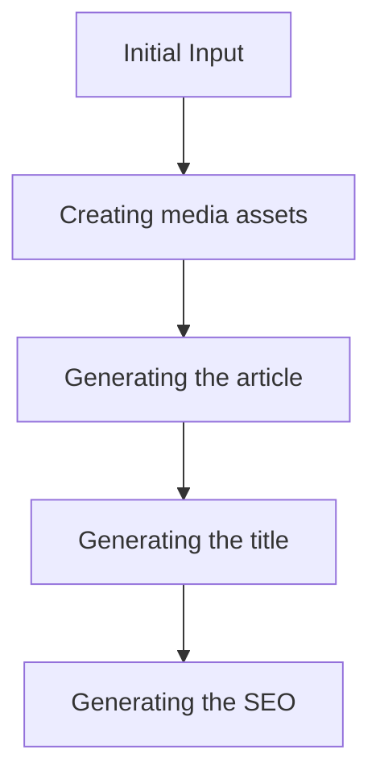
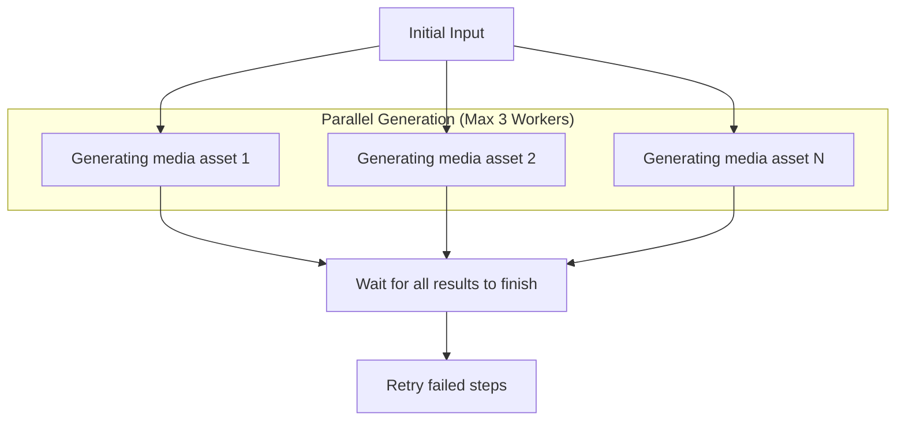
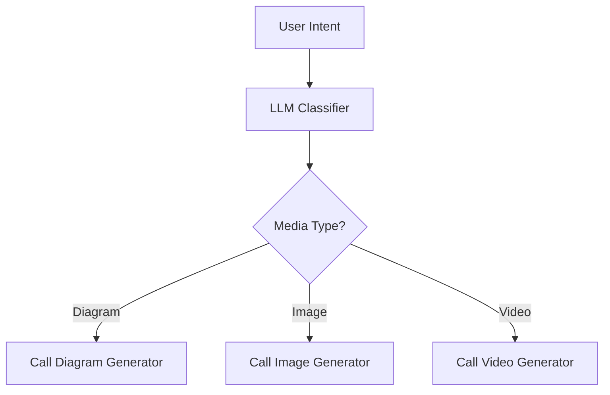
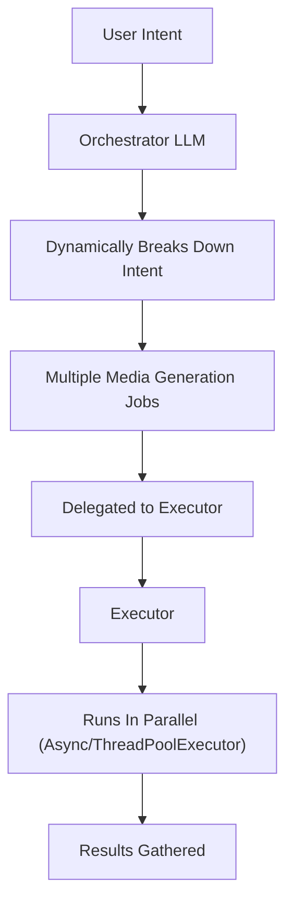
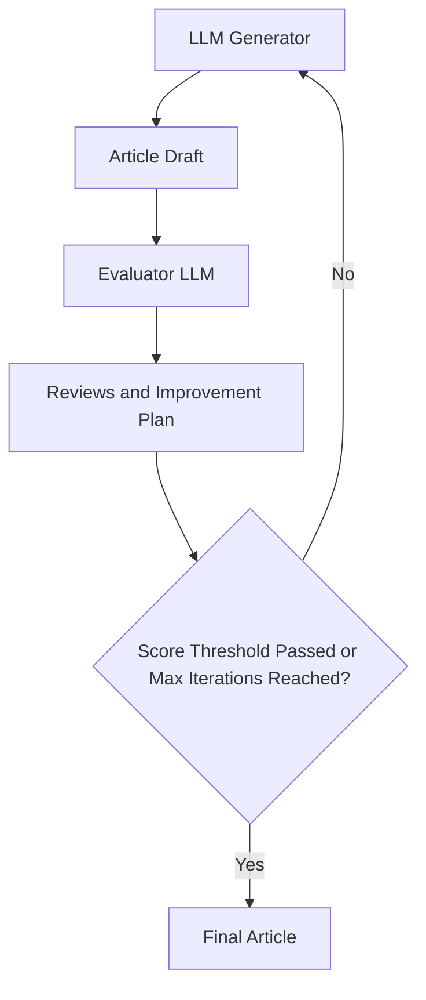

# Stop Building AI Agents. Use These 5 Patterns Instead.
### Master the workflow patterns that solve 95% of production problems.

In our previous articles, we covered the difference between workflows and agents, the art of context engineering, and how to get reliable structured outputs from LLMs. Now, we will explore the fundamental components for building robust LLM workflows.

When building **Brown**, my writer assistant capstone project for the AI Agents course I build together with Towards AI, I faced a critical challenge. The first iteration worked. It could generate articles. But it was slow, expensive, and the user experience was poor. More importantly, when I tried to rewrite it from scratch for better performance, I realized something crucial: the system was trying to do too much in single, massive LLM calls. One prompt was responsible for understanding content, following structure, matching tone, and generating diagrams. When something went wrong, I could not pinpoint where. This experience taught me that complex AI systems need to be broken down, but how?

A single, large LLM call for a complex task is often problematic. It makes pinpointing errors difficult, lacks modularity, and increases the likelihood of "lost in the middle" issues where the model ignores information in long contexts [[1]](https://arxiv.org/abs/2307.03172). You might think that when a single prompt fails, you should jump straight to AI Agents. But that is a trap.

Jumping to agents is often overkill for deterministic tasks. Most workflows have predictable steps. Agents add unnecessary complexity with their autonomous decision-making when you just need reliable execution. They introduce too many moving parts to debug, leading to unpredictable costs and reliability issues.

As Hugo Bowne notes from his experience building a multi-agent system, the researcher agent ignored its tools, the summarizer forgot its instructions, and the coordinator gave up entirely. Most agent systems break down from too much complexity, not too little.

The smarter approach is to start with simpler, more controllable patterns. Before considering agents, you should try to solve your problem using **these five core workflow patterns**:

1.  Prompt Chaining
2.  Parallelization
3.  Routing
4.  Orchestrator-Worker
5.  Evaluator-Optimizer

Let's start by examining the most fundamental of these patterns: prompt chaining.

## The Power of Modularity: Chain Specialized LLM Calls

Prompt chaining is the fundamental pattern of every workflow. It involves connecting multiple LLM calls or other processing steps sequentially, where the output of one step becomes the input for the next. This divide-and-conquer approach is a more manageable solution for complex tasks. By breaking a large problem into smaller, focused sub-tasks, each LLM call has a clearer, more constrained objective. This improves reliability, as simpler prompts are less likely to confuse the model or lead to incomplete results.

Chaining offers several benefits. It improves modularity, as each LLM call focuses on a specific, well-defined sub-task. This leads to enhanced accuracy because simpler, targeted prompts generally yield more reliable outputs. Debugging becomes easier since you can isolate issues to specific links in the chain. It also increases flexibility, allowing individual components to be swapped or optimized independently. For instance, you could use a cheaper, faster model for a simple classification step and a more powerful model for complex generation [[2]](https://aws.amazon.com/blogs/machine-learning/multi-llm-routing-strategies-for-generative-ai-applications-on-aws/), [[3]](https://cookbook.openai.com/examples/partners/model_selection_guide/model_selection_guide).

For our writing workflow, we can chain several steps to produce a final article: creating media assets, generating the article text, crafting a title, and then producing SEO metadata.


Image 1: The 'Prompt Chaining' workflow pattern applied to a writing workflow.

However, chaining has downsides. Some instructions may lose meaning when split across multiple steps, and context can be lost between prompts. This approach also increases costs and latency due to multiple LLM calls. Furthermore, if one step in the chain fails, the entire workflow can break, requiring proper error handling.

In theory, this pattern sounds sooo simple you think it's a no brainer. But in reality, there is a lot of experimentation until you find the sweet spot on how much you should divide your prompts.

For example, here is a high-level Python example illustrating the chaining pattern for our writing workflow.

```python
def writing_workflow(research_and_intent: str) -> dict:
    """
    A sequential workflow for generating an article.
    """

    # Step 1: Create media assets based on the initial input
    media_assets = create_media_assets(research_and_intent)
    
    # Step 2: Generate the article using the assets and the initial input
    article_draft = generate_article(research_and_intent, media_assets)
    
    # Step 3: Generate a title for the draft
    title = generate_title(article_draft)
    
    # Step 4: Generate SEO metadata for the final article
    seo_metadata = generate_seo(article_draft, title)
    
    return {
        "title": title,
        "article": article_draft,
        "seo": seo_metadata
    }

```

While chaining provides modularity and control, its sequential nature can create bottlenecks. The next logical step is to identify independent tasks within our workflow and execute them in parallel to improve speed and efficiency.

## Optimize Your Sequential Workflows With Proper Parallelization

While a sequential workflow is reliable, it can be slow. We can optimize it by running independent steps in parallel to reduce the total processing time. Parallelization simply means running as many steps as possible concurrently, as long as they do not depend on each other's outputs. This is particularly effective for tasks like data extraction from multiple sources or, in our case, generating various media assets at once.

This pattern is useful when tasks can be processed independently. However, it can introduce challenges like race conditions or timeouts. It is also important to be mindful of API rate limits, as making many concurrent calls can lead to errors. LLM APIs such as Gemini, OpenAI or Claude often have limits, known as Requests Per Minute (RPM) quotas, which must be managed in a production application [[4]](https://ai.google.dev/gemini-api/docs/rate-limits), [[5]](https://cloud.google.com/vertex-ai/generative-ai/docs/quotas). Thus, so your application should handle these gracefully, with running a maximum number of jobs in parallel using async semaphors or thread pools or retries strategies with exponential backoff.

In our writing workflow example, we can generate all the required media assets—like diagrams and images—in parallel. After initiating all tasks, the system waits for them to complete and can retry any that fail.


Image 2: The parallelization pattern applied to our writing workflow.

The following code shows how to implement this using Python's `asyncio` library.

```python
import asyncio

async def parallel_media_generation(research_and_intent, max_concurrent=3):
    """
    Generates all media assets in parallel with concurrency control.
    """
    asset_types = ["diagram", "image_1", "image_2", "image_3", "image_4"]
    
    # Create a semaphore to limit concurrent operations
    semaphore = asyncio.Semaphore(max_concurrent)
    
    async def generate_with_limit(asset_type):
        """Wrapper to control concurrency with semaphore."""
        async with semaphore:
            # Only max_concurrent tasks will execute simultaneously
            return await generate_media_asset(asset_type, research_and_intent)
    
    # Create a list of tasks to run concurrently (but controlled by semaphore)
    tasks = [generate_with_limit(atype) for atype in asset_types]
    
    # Wait for all tasks to complete
    media_assets = await asyncio.gather(*tasks)
    
    # Here you could add logic to retry failed tasks
    
    return media_assets
```

Parallelization is effective for uniform, independent tasks, but not all workflows are so straightforward. Often, the path forward depends on the nature of the input itself, requiring a more dynamic approach.

## Dynamic Decisions: Routing and Conditional Logic

Not all inputs should be processed in the same way. Routing, or conditional logic, addresses this by directing the workflow down different paths based on the input or an intermediate state. Think of it as a smart if-else statement where an LLM acts as a classifier to make branching decisions. This keeps prompts specialized and follows the "divide-and-conquer" principle, ensuring that each part of your workflow is optimized for a specific type of task.

Routing is ideal when you have distinct categories of inputs that require different handling. For example, a customer support tool could route queries to specialized handlers for technical support, billing, or general questions [[6]](https://googleapis.github.io/python-genai/), [[7]](https://github.com/google-gemini/cookbook), [[8]](https://cloud.google.com/vertex-ai/generative-ai/docs/model-reference/inference). This is preferable to optimizing a single, monolithic prompt for multiple input types, where often when optimizing for one use case degrades the performance on others. 

A critical best practice is to include a default or catch-all route to handle unexpected cases gracefully. This ensures your system is robust and can manage inputs that do not fit neatly into predefined categories.

For our writing workflow, we can use a router to decide which type of media to generate based on the user's intent. An LLM classifier determines if the user wants a diagram, an image, or a video, and calls the appropriate generation function.

<aside>
💡 For simple classification tasks like routing, using smaller, faster, and cheaper language models is a great way to optimize your workflow's performance and cost [[9]](https://arxiv.org/html/2502.00409v2).
</aside>


Image 3: The routing workflow pattern applied to our writing agent.

This Python code demonstrates how routing can be implemented.

```python
def routing_workflow(user_intent):
    """
    Routes the request to the correct media generator.
    """
    media_type = classify_media_intent(user_intent)
    
    if media_type == "diagram":
        return generate_diagram(user_intent)
    elif media_type == "image":
        return generate_image(user_intent)
    elif media_type == "video":
        return generate_video(user_intent)
    else:
        # Fallback for unknown types
        return handle_default(user_intent)
```

Routing manages predefined paths, but what if the tasks themselves need to be defined dynamically? This leads us to a more advanced pattern.

## Dynamic Task Decomposition: The Orchestrator-Worker

The orchestrator-worker pattern is a more advanced approach that combines routing with parallel processing. A central LLM, the orchestrator, dynamically breaks down a complex task into smaller sub-tasks and delegates them to specialized workers, which can run in parallel [[10]](https://www.anthropic.com/research/building-effective-agents), [[11]](https://langchain-ai.github.io/langgraphjs/tutorials/workflows/), [[12]](https://learn.microsoft.com/en-us/azure/architecture/ai-ml/guide/ai-agent-design-patterns), [[13]](https://microsoft.github.io/autogen/stable/user-guide/core-user-guide/design-patterns/mixture-of-agents.html).

The key difference from simple parallelization is that the number and type of the sub-tasks required to run are determined dynamically at runtime based on the input.

On a similar note, it's different from simple routing because it "classifies" each sub-task individually, rather than a single if-else path.

The pattern is very similar to the Map-Reduce strategy from data engineering, where we have multiple jobs running in parallel, while we aggregate the result at the end. It's similar, but with LLMs into the mix that determine what jobs should be run.

The main point of failure of this pattern is when the orchestrator creates the wrong jobs, or jobs with the wrong arguments, or not enough/too many jobs.

For our writing workflow, an orchestrator can analyze the user's intent and generate a list of media generation jobs. An executor then takes these jobs and runs them in parallel.

<aside>
💡 **Quick Tip**: Implement the set of possible jobs as "tools." The orchestrator can then output multiple tool calls with their corresponding arguments, which the executor can run in parallel.
</aside>


Image 4: The Orchestrator-Worker pattern applied to our writing workflow.

For example, this is how the pattern looks like in [Opik](https://www.comet.com/site/?utm_source=newsletter&utm_medium=partner&utm_campaign=paul), where we can see all the `mermaid_diagram_generator_tool` calls, together with the cost, latency, token usage, inputs and outputs of each step. Beutiful:


Image 5: The Orchestrator-Worker pattern seen in [Opik](https://www.comet.com/site/?utm_source=newsletter&utm_medium=partner&utm_campaign=paul)

🤭 As you can see, this pattern was actually used to generate the diagrams for this article.

Here is how this pattern could look in Python.

```python
from concurrent.futures import ThreadPoolExecutor

# Mock available tools
TOOLS = {
    "generate_diagram": lambda prompt: f"Diagram generated: {prompt}",
    "generate_image": lambda prompt: f"Image generated: {prompt}",
    "generate_video": lambda prompt: f"Video generated: {prompt}",
}

class LLM:
    """Mocked LLM class."""
    
    @staticmethod
    def call(user_intent, tools):
        """
        Mocked LLM call that returns tool calls based on user intent.
        In reality, this would be a call to OpenAI, Anthropic, etc.
        """

        # Mock logic to simulate LLM deciding which tools to call
        tool_calls = []
        if "chart of performance" in user_intent:
            tool_calls.append({
                "tool": "generate_diagram",
                "arguments": {"prompt": "Generate performance chart"}
            })
        if "photo of the team" in user_intent:
            tool_calls.append({
                "tool": "generate_image",
                "arguments": {"prompt": "Find team photo"}
            })

        return tool_calls

def orchestrator(user_intent):
    """Orchestrator that calls the LLM with available tools."""
    return LLM.call(user_intent=user_intent, tools=TOOLS)

def worker(tool_call):
    """Worker that executes a single tool call."""
    tool_name = tool_call["tool"]
    tool_function = TOOLS[tool_name]
    return tool_function(**tool_call["arguments"])

def orchestrator_worker_workflow(user_intent):
    """
    Manages the orchestrator and workers to generate media.
    """
    # 1. Orchestrator generates tool calls via LLM
    tool_calls = orchestrator(user_intent)
    
    # 2. Workers execute tool calls in parallel
    with ThreadPoolExecutor() as executor:
        results = list(executor.map(worker, tool_calls))
        
    return results

# Example usage:
user_request = "Create a chart of performance and find a photo of the team"
outputs = orchestrator_worker_workflow(user_request)
# outputs: ["Diagram generated: Generate performance chart", 
#           "Image generated: Find team photo"]
```
So far, our patterns have focused on executing tasks efficiently. But what about ensuring the quality of the final output? The next pattern introduces a feedback loop to do just that.

## Make LLMs Autocorrect Themself: The Evaluator-Optimizer

The evaluator-optimizer pattern is the closest we get to agent-like behavior while still maintaining a structured workflow. It creates a feedback loop to automatically improve and refine the output of an LLM. This is an effective pattern when output quality matters more than speed.

The system typically consists of a few key components [[14]](https://arxiv.org/html/2410.03131v3):
1.  A **generator** LLM produces an initial output.
2.  An **evaluator** LLM assesses the output against predefined criteria, generating a score and a plan for improvement.
3.  The generator takes the feedback from the evaluator to refine the output.
4.  This loop repeats until a certain quality score is met or a maximum number of iterations is reached.

The main failure mode for this pattern is an infinite optimization loop. Therefore, it is a best practice to set clear stop conditions, such as a well tweaked stop threshold or a maximum number of retries.

A more advanced implementation, that applies the divide and conquer patterns we just learned, uses multiple specialized evaluators. For instance, one evaluator could check for logical correctness, another for readability, and a third for syntax. This multi-faceted feedback provides a more comprehensive critique.

In our writing workflow, we can use this pattern to refine an article draft. The generator produces the text, and an evaluator provides feedback on clarity, tone, and structure. The generator then revises the draft based on this feedback until it meets our quality standards.


Image 6: The Evaluator-Optimizer workflow pattern applied to our writing agent.

As shown for the orchestrator-worker pattern, in Image 7 you can see how this pattern looks like in [Opik](https://www.comet.com/site/?utm_source=newsletter&utm_medium=partner&utm_campaign=paul), along with it's multimodal inputs, which are text and images in this use case. In this particular use case, we had 2 iterations of: generating the article, reviewing it and editing it.


Image 7: The Evaluator-Optimizer workflow pattern seen in [Opik](https://www.comet.com/site/?utm_source=newsletter&utm_medium=partner&utm_campaign=paul)

This code demonstrates the evaluator-optimizer loop.

```python
def generator(prompt, feedback=None):
    """Generates an article draft."""
    if feedback:
        prompt += f"\nIncorporate this feedback: {feedback}"

    return llm_call(prompt)

def evaluator(article_draft):
    """Evaluates the draft and provides a score and feedback."""
    evaluation = llm_evaluator_call(article_draft) # Returns score and feedback text

    return evaluation["score"], evaluation["feedback"]

def evaluator_optimizer_workflow(initial_prompt):
    """
    Iteratively refines an article until it meets quality standards.
    """
    max_iterations = 3
    score_threshold = 0.8
    
    article = generator(initial_prompt)
    
    for i in range(max_iterations):
        score, feedback = evaluator(article)
        
        if score >= score_threshold:
            print("Quality threshold met. Finalizing article.")
            return article
        
        print(f"Iteration {i+1}: Score={score}. Refining article with feedback.")
        article = generator(initial_prompt, feedback)
        
    print("Max iterations reached. Returning the latest version.")
    return article
```

## Stop Building AI Agents. Always Start With These 5 Patterns.

With these five patterns, you can solve most of the real-world problems you will encounter when building AI applications in. Choosing to build a full-fledged agent should be your last resort, reserved for when simpler, more controllable methods fail. As other vetted AI Engineers such as Hugo Bowne say: "Most use cases don't need agents. They need better workflow structure."

The strategy is simple:
1.  Start with the simplest solution (a single prompt).
2.  If it works, stop.
3.  If it does not, try these five workflow patterns.
4.  Only if all patterns fail, consider agents.

Remember that this article is part of a longer series of 8 pieces on the AI Agents Foundations that will give you the tools to morph from a Python developer to an AI Engineer.

**Here’s our roadmap:**
1. [Workflows vs. Agents](https://decodingml.substack.com/p/ai-workflows-vs-agents-the-autonomy)
2. [Structured Outputs](https://www.decodingai.com/p/llm-structured-outputs-the-only-way)
3. **The 5 Workflow Patterns** _← You just finished this one._
4. Tools ← _← Move to this one (available next Tuesday, 9:00 am CET)_
5. Planning: ReAct & Plan-and-Execute
6. Writing ReAct From Scratch
7. Memory
8. Multimodal Data

See you next week.

[Paul Iusztin](https://x.com/pauliusztin_)

## References

1. Liu, N. F., Lin, K., Hewitt, J., Paranjape, A., Bevilacqua, M., Petroni, F., & Liang, P. (2023). Lost in the Middle: How Language Models Use Long Contexts. *arXiv preprint arXiv:2307.03172*. https://arxiv.org/abs/2307.03172
2. (n.d.). *Multi-LLM routing strategies for generative AI applications on AWS*. Amazon Web Services. https://aws.amazon.com/blogs/machine-learning/multi-llm-routing-strategies-for-generative-ai-applications-on-aws/
3. (n.d.). *Model selection guide*. OpenAI Cookbook. https://cookbook.openai.com/examples/partners/model_selection_guide/model_selection_guide
4. (n.d.). *Gemini API Rate Limits*. Google AI for Developers. https://ai.google.dev/gemini-api/docs/rate-limits
5. (n.d.). *Generative AI on Vertex AI quotas and system limits*. Google Cloud. https://cloud.google.com/vertex-ai/generative-ai/docs/quotas
6. (n.d.). *Python Client for Google's Generative AI Models*. Google API Python Client. https://googleapis.github.io/python-genai/
7. (n.d.). *Welcome to the Gemini API Cookbook*. GitHub. https://github.com/google-gemini/cookbook
8. (n.d.). *Gemini API Reference*. Google Cloud. https://cloud.google.com/vertex-ai/generative-ai/docs/model-reference/inference
9. (n.d.). *Technical analysis of routing strategies in LLM-based systems*. arXiv. https://arxiv.org/html/2502.00409v2
10. Schluntz, E., & Zhang, B. (n.d.). *Building effective agents*. Anthropic. https://www.anthropic.com/research/building-effective-agents
11. (n.d.). *Workflows and Agents*. LangChain. https://langchain-ai.github.io/langgraphjs/tutorials/workflows/
12. (n.d.). *AI agent design patterns*. Azure Architecture Center. https://learn.microsoft.com/en-us/azure/architecture/ai-ml/guide/ai-agent-design-patterns
13. (n.d.). *Mixture of Agents*. Microsoft AutoGen. https://microsoft.github.io/autogen/stable/user-guide/core-user-guide/design-patterns/mixture-of-agents.html
14. Patel, B., Chakraborty, S., Suttle, W. A., Wang, M., Bedi, A. S., & Manocha, D. (2024). AIME: AI System Optimization via Multiple LLM Evaluators. *arXiv preprint arXiv:2410.03131*. https://arxiv.org/html/2410.03131v3

---

## Images

If not otherwise stated, all images are created by the author.