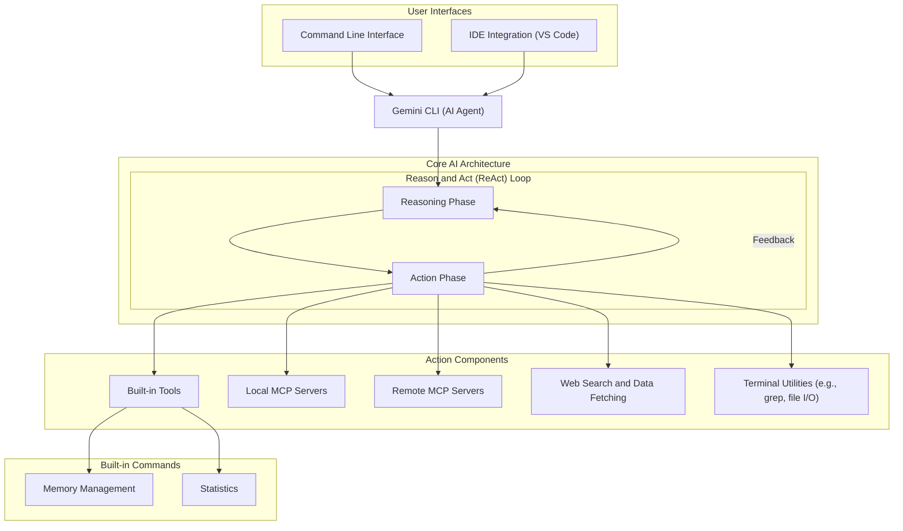

# AI Workflows vs. AI Agents: The Critical Decision Every Engineer Faces
### how to choose the right architecture for your AI product

## Introduction

Every AI engineer eventually faces a critical architectural decision: do you build a predictable, multi-step LLM workflow or a more autonomous, powerful AI agent? This choice is a fundamental trade-off between control and autonomy. Get it right, and you can ship a reliable product. Get it wrong, and you will be stuck in the Proof of Concept (PoC) purgatory, battling a system that is either too rigid to be useful or too unpredictable to be trusted.

Too many teams default to building agents because they look impressive in demos, only to find they are impossible to evaluate and maintain in production. Others build simple workflows that fail to solve complex, real-world problems. The truth is, the choice is not about which approach is better, but which is the right tool for the job. In this article, we will break down the spectrum from workflows to agents, provide a framework for choosing the right path, and explore the real-world patterns and challenges you will face.

## Understanding the Spectrum: From Workflows to Agents

The distinction between an AI workflow and an AI agent is best understood as a spectrum of autonomy. On one end, you have rule-based workflows, which are deterministic and fully controlled by the engineer. On the other end, you have autonomous agents that can reason, plan, and act on their own.

An **LLM workflow** is a sequence of pre-defined steps, often involving one or more LLM calls, connected by application code. It operates like a flowchart. Each step has a specific purpose, like summarizing a document, extracting structured data, or calling an API. The path is fixed. The system does exactly what you tell it to do, nothing more.

An **AI agent**, on the other hand, operates in a loop. It uses an LLM not just to execute a task, but to reason about what to do next. Given a goal, an agent can decide which tools to use, in what order, and how to interpret the results to achieve its objective. It is dynamic and can adapt its plan based on new information.

To understand what a modern agent architecture looks like, we can look at Google's Gemini CLI. It is an open-source AI agent that operates on a **Reason and Act (ReAct) loop**. The agent iteratively reasons about a problem and then takes action using a set of available tools. This architecture, shown in Image 1, is a great example of the complexity involved in building a truly autonomous system.

Image 1: A flowchart illustrating the architectural patterns of the Gemini CLI, an AI coding assistant, focusing on the Reason and Act (ReAct) loop and its interactions with various components and user interfaces.

This architectural complexity makes the initial choice between a simple workflow and a powerful agent even more critical.

## Choosing Your Path

Choosing between a workflow and an agent depends entirely on your use case. There is no single right answer, only a series of trade-offs. You need to evaluate your problem along a few key dimensions.

-   **Task Complexity and Predictability:** Is the task a linear, predictable process, or does it require dynamic adaptation? For tasks like summarizing meeting notes into a standard template, a workflow is perfect. For debugging a complex codebase, where the path to a solution is unknown, an agent is more suitable.
-   **Need for Control vs. Autonomy:** How much control do you need over the output? In high-stakes domains like finance or healthcare, you need deterministic, verifiable results. A workflow provides this control. For creative or exploratory tasks, you might want to give the AI more freedom to find novel solutions, which is where agents excel.
-   **Reliability and Evaluation:** How easy is it to test and validate the system? Workflows are easier to evaluate because their paths are fixed. You can write unit and integration tests for each step. Agents are notoriously difficult to evaluate. Because their behavior is emergent, you can never be 100% certain what they will do, making production monitoring essential.
-   **Cost and Latency:** Agents often require more powerful reasoning models and can get stuck in long, expensive loops of thought and action. A workflow, being more direct, is typically faster and cheaper to run.

If your task is well-defined and requires high reliability, start with a workflow. If the problem is open-ended and requires complex decision-making, an agent might be necessary. But always start with the simplest possible solution.

## Exploring Common Patterns

As you build, you will encounter common architectural patterns for both workflows and agents.

For **LLM workflows**, a simple but effective pattern is the **chain**. You pipe the output of one LLM call directly into the input of the next. For example, one call could summarize a document, and a second call could translate that summary into another language. For more complex tasks, you can use a **parallelization** pattern, where you run multiple steps at once and then aggregate the results, reducing latency.

For **AI agents**, the most common pattern is **ReAct (Reason and Act)**. As seen in the Gemini CLI architecture, the agent first reasons about the problem to form a plan ("I need to find recent articles, so I should use the web search tool"). Then, it acts by calling the chosen tool. The output of the tool is fed back into the reasoning step, and the loop continues until the goal is met. This allows the agent to perform complex, multi-step tasks that would be impossible with a single LLM call.

## Zooming In on Our Favorite Examples

Let's ground this in reality. A perfect example of an LLM workflow is a content repurposing system. You can build a workflow that takes a long-form article, generates a summary, extracts key takeaways for a Twitter thread, and drafts an email newsletter. Each step is a distinct, predictable LLM call. The process is reliable and repeatable.

For a powerful agent example, we look again at the **Gemini CLI**. It is designed to be a coding assistant that lives in your terminal. You can ask it to add a new feature, write unit tests, or fix a bug. It uses its ReAct loop to interact with your codebase. It can read files, write new code, and even run terminal commands like `grep` or `git`. Its power comes from its extensibility through Model Context Protocol (MCP) servers, which allow it to access a wide range of local and remote tools, including web search. This is a system that can reason and act on a complex environment—your computer—to achieve a high-level goal.

## The Challenges of Every AI Engineer

Neither path is easy. Building robust AI systems is hard, and both architectures come with their own set of challenges.

With **workflows**, the primary challenge is rigidity. If a step fails, the entire workflow can break. You need to build robust error handling, retries, and fallbacks for each component. They can also become incredibly complex to manage as you add more steps, turning into a tangled mess of dependencies.

With **agents**, the challenges are far greater and center on a single word: **reliability**. An autonomous agent can fail in spectacular and unpredictable ways. It can get stuck in a loop, hallucinate a tool that does not exist, or misinterpret the output of a tool and head down the wrong path. Evaluating an agent is a massive undertaking because you are not just testing a piece of code; you are testing a decision-making entity. This is why so few true agents have made it into production.

## Conclusion

The choice between an AI workflow and an AI agent is one of the most important architectural decisions you will make. It is a direct trade-off between the predictability of a controlled process and the power of an autonomous one. Workflows excel at well-defined, repeatable tasks where reliability is key. Agents are built for complex, dynamic problems that require reasoning and adaptation.

Understanding this spectrum is essential for any engineer looking to ship AI products that work. By carefully evaluating your task's complexity, your need for control, and the challenges of evaluation, you can choose the right architecture. This decision is a core part of AI engineering and is fundamental to building systems that are not just impressive in a demo, but robust and valuable in the real world.

## References