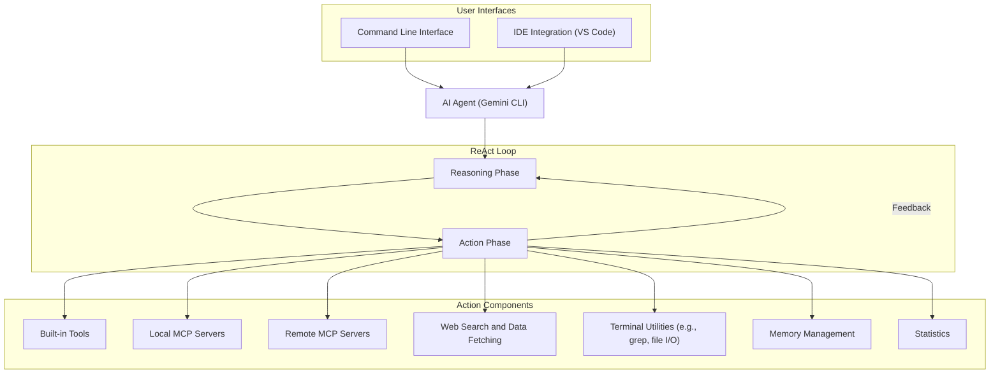

# AI Workflows vs. Agents: The Architectural Decision Every Engineer Faces
### How to choose between predictable control and dynamic autonomy to ship AI that works.

When I first started building **Brown**, my AI writing assistant, I fell into a classic trap. I was so focused on creating a fully autonomous system that I jumped straight into designing a complex agent. The result was a mess. It was slow, unpredictable, and a nightmare to debug. After weeks of frustration, I had to scrap it and start over.

That experience taught me a hard lesson: the choice between a predictable workflow and an autonomous agent is one of the most critical architectural decisions you will make as an AI Engineer. It impacts everything from development cost and reliability to the final user experience. Get it wrong, and you will either build a rigid system that can’t handle real-world complexity or an unpredictable agent that fails when you need it most.

The problem is that the hype around "AI agents" makes it seem like they are the only solution for complex tasks. But in production, reliability and predictability often matter more than pure autonomy. Most AI projects get stuck in the proof-of-concept stage because engineers over-engineer the solution, trying to build a sophisticated agent when a simple, robust workflow would have done the job.

In this article, we will cut through the noise. We will explore the spectrum from controlled workflows to autonomous agents, helping you understand the trade-offs so you can make the right architectural choice for your next AI product.

## Understanding the Spectrum: From Workflows to Agents

The first step is to understand the fundamental difference. An **AI workflow** is a sequence of tasks where the steps are predefined by the developer. It is a deterministic, rule-based system. Think of it as an assembly line: each station performs a specific, repeatable action, leading to a predictable outcome.

On the other hand, an **AI agent** is a system where an LLM dynamically decides the next action to achieve a goal. The path is not hardcoded. Instead, the agent uses a reasoning process to plan and execute steps based on the context and feedback from its environment. This is more like an autonomous drone navigating a complex space, adjusting its path in real-time.

State-of-the-art AI assistants like Google’s Gemini CLI are prime examples of this agentic architecture. At its core, it operates on a **Reason and Act (ReAct) loop**. The agent first *reasons* about the problem (e.g., "I need to add a new feature to this file") and then *acts* by selecting and executing a tool (e.g., `file_write`, `run_tests`). The outcome of that action is fed back into the loop, informing the next reasoning step until the goal is complete.

This architecture is designed for extensibility, integrating with both local and remote Model Context Protocol (MCP) servers to access a wide range of capabilities. It can use built-in tools for memory management, terminal utilities like `grep`, and even perform web searches to ground its actions in real-world information. The same core agent powers both the command line and IDE experiences, showcasing a consistent and powerful design.

Image 1: A flowchart illustrating the architectural patterns of the Gemini CLI, focusing on the Reason and Act (ReAct) loop and its interactions with various components and user interfaces.

The distinction is not about one being better than the other. It is about choosing the right tool for the job. The decision exists on a spectrum of autonomy, and your task as an engineer is to decide where your system needs to sit on that spectrum.

## Choosing Your Path

So, how do you decide? The choice depends entirely on the nature of the problem you are solving.

Use **workflows** for structured, repeatable tasks where the steps are well-defined. Examples include data extraction pipelines, content summarization, or routing customer support tickets. The primary advantage of a workflow is its predictability. Costs, latency, and outputs are consistent, which makes debugging straightforward and reliability high. This is why workflows are the default choice for most enterprise applications where consistency and control are non-negotiable.

Use **agents** for open-ended, dynamic problems where the solution path is unclear from the start. Complex research, automated coding, or strategic game-playing are all domains where agents excel. Their strength is adaptability. However, this comes at the cost of reliability. Agents are non-deterministic; their performance can vary significantly between runs, making them harder to debug and their costs less predictable.

My guiding principle is simple: **always start with the simplest possible solution**. If a single LLM call can solve the problem, stop there. If not, build a workflow. Only when a structured workflow proves too rigid to handle the problem's complexity should you consider building an agent. This minimalist approach will save you from the "PoC purgatory" where so many over-engineered projects end up.

## Exploring Common Patterns

When you decide to build a workflow, you are not limited to a simple, linear sequence. There are several powerful patterns you can use to build sophisticated yet controllable systems.

For instance, **Prompt Chaining** involves breaking a complex task into smaller, sequential LLM calls. The output of one step becomes the input for the next. This improves modularity and makes debugging easier, as you can isolate failures to a specific step in the chain.

Another common pattern is **Routing**. Here, a classifier (often a smaller, faster LLM) directs the input to a specialized sub-workflow based on its content. This allows you to handle different types of tasks with optimized logic instead of trying to create one monolithic prompt that does everything poorly.

These patterns give you the tools to build complex logic while retaining the control and predictability of a workflow. Mastering them is essential for any engineer serious about shipping production-grade AI.

## Zooming In on Our Favorite Examples

Let's make this concrete. A document summarization feature in a cloud service is a perfect use case for a workflow. The steps are clear: read the document, generate a summary with an LLM, extract key metadata, and save the results. The process is predictable, efficient, and reliable every time.

Now, contrast that with an AI coding assistant like the **Gemini CLI**. A user request like "Refactor the `ApiService` class to use async/await" is an open-ended problem. The exact steps—which files to read, what code to write, which tests to run—cannot be predefined.

This is where an agent shines. The Gemini CLI agent uses its ReAct loop to tackle the problem iteratively.
1.  **Reason:** "I need to understand the current `ApiService` implementation."
2.  **Act:** Use the `file_read` tool to load the relevant file.
3.  **Reason:** "Okay, I see it uses promises. I need to convert them to async/await syntax."
4.  **Act:** Use the `file_write` tool to apply the new code.
5.  **Reason:** "Now I must verify my changes didn't break anything."
6.  **Act:** Use the `run_tests` tool and analyze the output.

This iterative loop of reasoning and acting allows the agent to navigate the complexity of a codebase and converge on a solution. It leverages its tools, including web search for external information and memory for context, to dynamically plan its path to the goal. This is a level of autonomy that a predefined workflow simply cannot achieve.

## The Challenges of Every AI Engineer

The fine line between a robust workflow and a powerful agent is where most real-world AI engineering happens. Your job is not to obsess over labels but to consciously decide how much control to retain and how much autonomy to grant.

The biggest challenge is resisting the temptation to over-engineer. The allure of building a fully autonomous agent is strong, but it often leads to systems that are too complex, too expensive, and too unreliable for production. The best AI engineers know that the most elegant solution is often the simplest one that works.

Always start with a workflow. Decompose your problem into a series of controllable, deterministic steps. Use patterns like chaining and routing to manage complexity. Only when you have exhausted the capabilities of structured workflows should you begin to introduce agentic loops. By taking this pragmatic, step-by-step approach, you will move beyond building fancy demos and start shipping AI products that solve real problems.