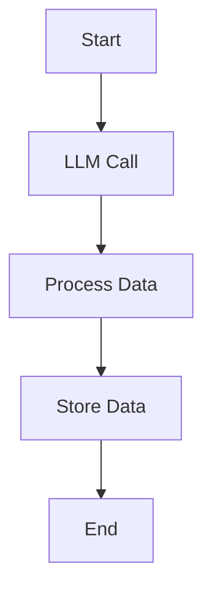
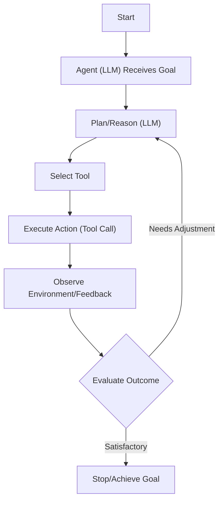
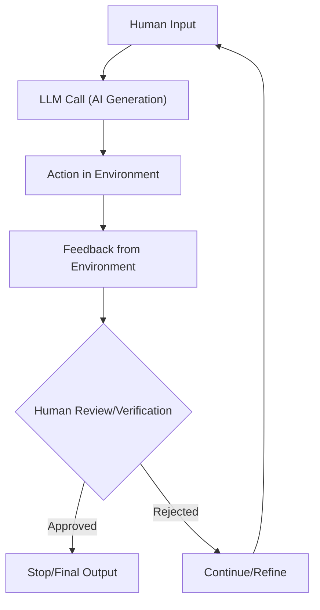

# Workflows vs. Agents: The Critical Decision Every AI Engineer Faces
### How to choose between predictable control and autonomous flexibility when building AI applications.

When building AI applications, engineers face a critical architectural decision early on. Should you create a predictable, step-by-step workflow where you control every action, or build an autonomous agent that can think and decide for itself? This choice impacts everything from development time and cost to reliability and user experience. It is a fundamental decision that often determines if an AI application will be successful in production.

By the end of this lesson, you will understand the fundamental differences between LLM workflows and AI agents, know when to use each, and recognize how to combine their strengths in hybrid approaches.

## Understanding the Spectrum: From Workflows to Agents

To make the right choice, you first need to understand what LLM workflows and AI agents are. We will look at their core properties and how they are used, rather than their technical specifics.

### LLM Workflows

An LLM workflow is a sequence of tasks orchestrated by developer-written code. It can include LLM calls, but also other operations like reading from a database or calling an API. Think of it like a recipe where each step is explicitly defined. The key characteristic is that the path is determined in advance, resulting in a deterministic or rule-based system. This gives you predictable execution, explicit control over the application's flow, and makes the system easier to test and debug. Because you control every step, you know exactly where a failure occurred and how to fix it.

Image 1: A flowchart illustrating a deterministic LLM workflow with clear start and end points, including an LLM call and data operations.

### AI Agents

AI agents are systems where an LLM dynamically decides the sequence of steps, reasoning, and actions to achieve a goal. The path is not predefined. Instead, the agent uses a reasoning process to plan its actions based on the task and the current state of its environment. This process is often modeled on frameworks like ReAct (Reason, Act, Observe). This allows agents to be adaptive and capable of handling new or unexpected situations through LLM-driven autonomy. They can select tools, execute actions, evaluate the outcomes, and correct their course until the goal is achieved [[1]](https://www.youtube.com/watch?v=kQxr-uOxw2o&t=1s).

Image 2: Flowchart illustrating an AI agent's dynamic decision-making process driven by an LLM.

## Choosing Your Path

The core difference between these two approaches lies in a single trade-off: developer-defined logic versus LLM-driven autonomy [[2]](https://decodingml.substack.com/p/llmops-for-production-agentic-rag), [[3]](https://towardsdatascience.com/a-developers-guide-to-building-scalable-ai-workflows-vs-agents/). Workflows offer high reliability at the cost of flexibility, while agents offer high flexibility at the cost of reliability.

https://substackcdn.com/image/fetch/w_1456,c_limit,f_webp,q_auto:good,fl_progressive:steep/https%3A%2F%2Fsubstack-post-media.s3.amazonaws.com%2Fpublic%2Fimages%2F5e64d5e0-7ef1-4e7f-b441-3bf1fef4ff9a_1276x818.png 
Image 3: The trade-off between an agent's level of control and application reliability. (Image by Iusztin, P. from [Exploring the difference between agents and workflows [2]](https://decodingml.substack.com/p/llmops-for-production-agentic-rag))

### When to use LLM workflows

Workflows are ideal for repeatable tasks with defined steps, like data extraction, report generation, or content repurposing. Their strength is predictability, ensuring reliable results, easier debugging, and lower costs by using specialized models. The main weakness is rigidity; they cannot handle unexpected scenarios, and adding features can become complex.

### When to use AI agents

Agents excel at dynamic problem-solving like open-ended research or complex customer support [[3]](https://towardsdatascience.com/a-developers-guide-to-building-scalable-ai-workflows-vs-agents/). Their strength is flexibility in handling ambiguity. However, this autonomy makes them less reliable, harder to debug, and costlier due to non-deterministic behavior. Without proper guardrails, they also pose security risks, especially with operations that can modify or delete data.

### Hybrid Approaches

Most real-world systems are not purely one or the other. They often blend elements of both, creating a hybrid system. A common pattern is to use a workflow for predictable parts of a task and delegate ambiguous steps to an agent. For example, a system might use a human-in-the-loop workflow, where the agent proposes an action, and a human verifies it before execution.

Image 4: A flowchart illustrating an AI generation and human verification loop with iterative refinement.

## The Challenges of Every AI Engineer

Understanding the spectrum from workflows to agents is a core part of AI engineering. This choice helps determine if your application will succeed in production. Building robust AI systems means navigating recurring challenges daily. These include building pipelines to pull information from Slack, web APIs, SQL databases, and data lakes; managing the cost-performance trap where sophisticated agents become too expensive per interaction; and mitigating security risks from autonomous agents that could send wrong emails or delete critical files.

In our next lesson, we will explore a foundational skill for building both workflows and agents: context engineering.

## References

1. Bouchard, L-F. (n.d.). Real agents vs. workflows: The truth behind AI 'agents'. YouTube. https://www.youtube.com/watch?v=kQxr-uOxw2o&t=1s
2. Iusztin, P. (n.d.). Exploring the difference between agents and workflows. Decoding AI Magazine. https://decodingml.substack.com/p/llmops-for-production-agentic-rag
3. (n.d.). A developer’s guide to building scalable AI: Workflows vs agents. Towards Data Science. https://towardsdatascience.com/a-developers-guide-to-building-scalable-ai-workflows-vs-agents/
4. Google. (n.d.). Gemini CLI. GitHub. https://github.com/google-gemini/gemini-cli/blob/main/README.md