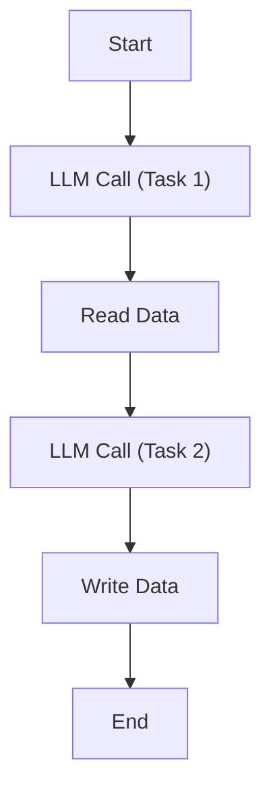
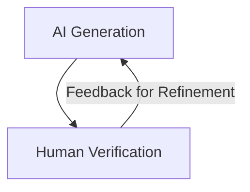
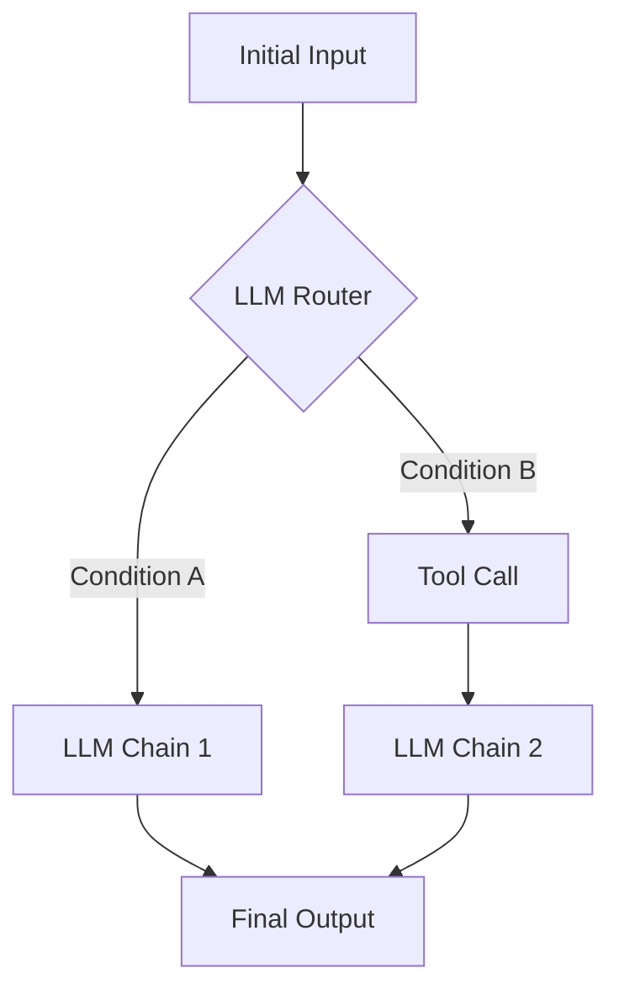
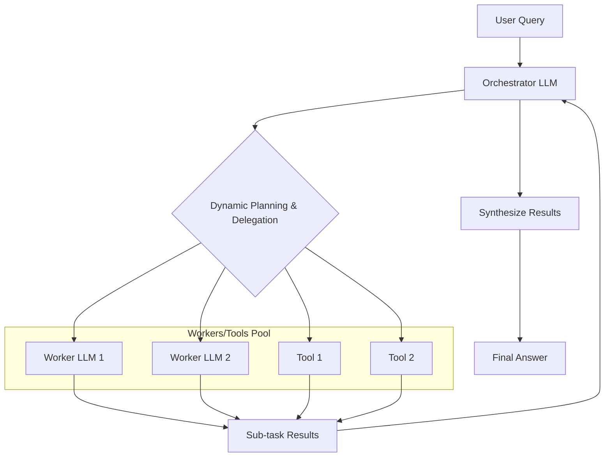
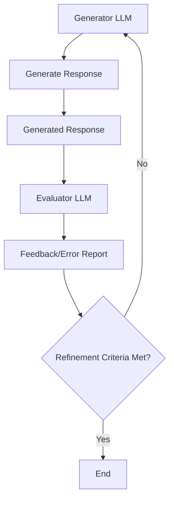
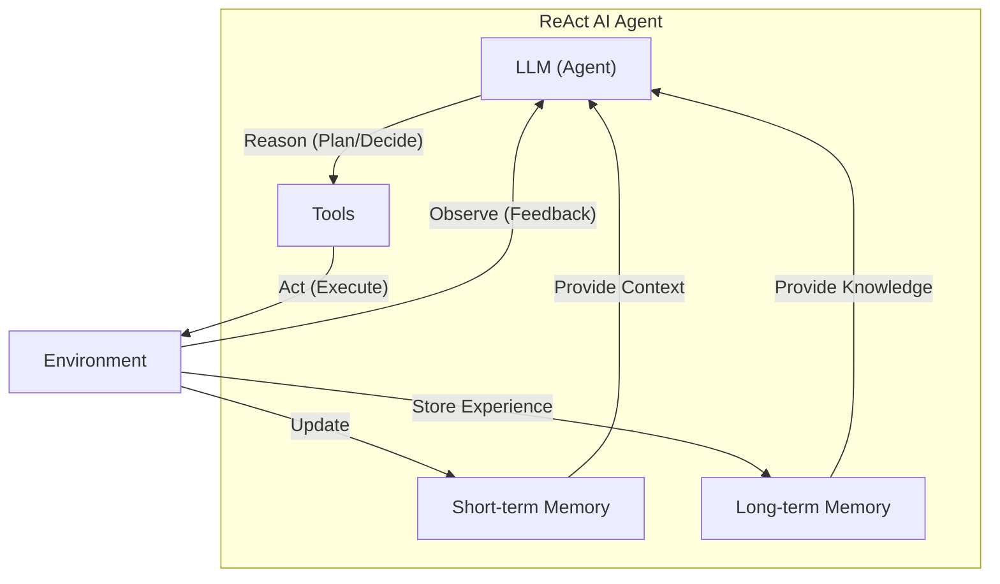
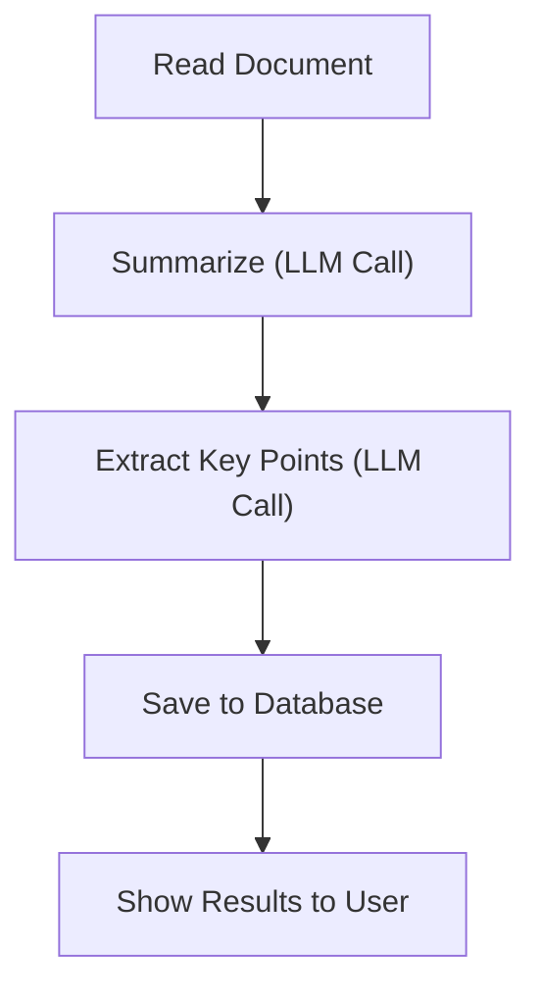
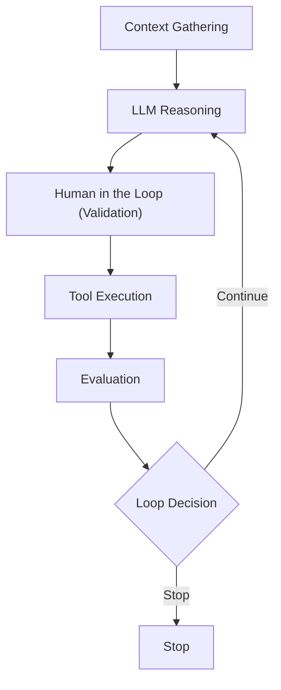
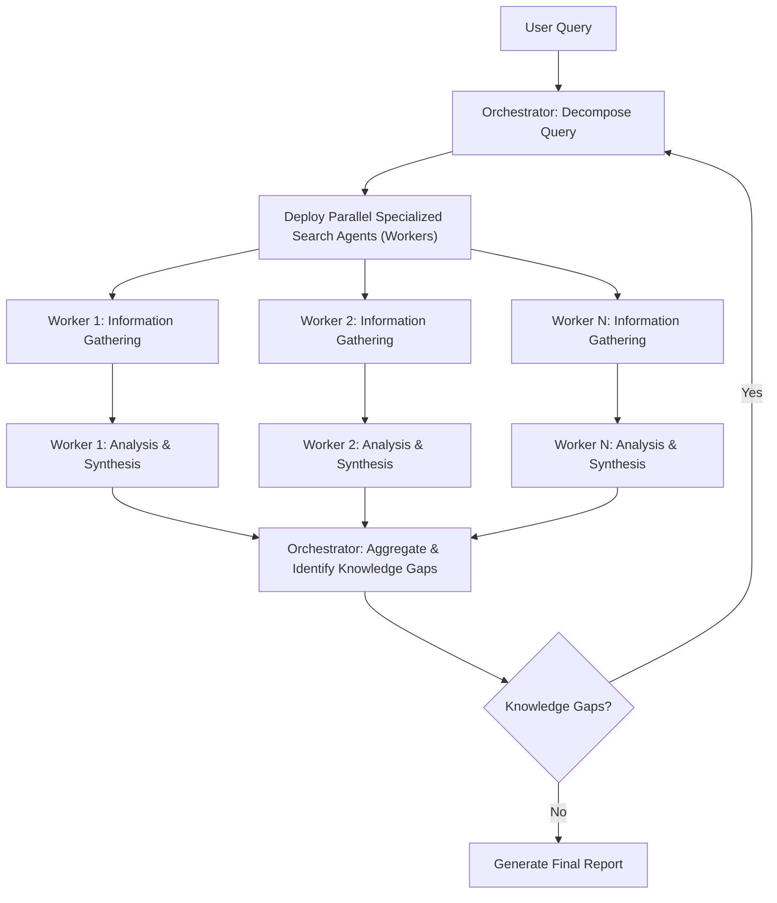

# AI Agents vs. LLM Workflows: The Critical Decision Every AI Engineer Faces
### A practical guide to choosing the right architecture for your AI application

When building AI applications, engineers face a critical architectural decision early on. This is not just a technical choice. It is a fundamental product strategy decision that impacts everything from development time and cost to reliability and user experience.

Choosing the wrong path can have severe consequences. You might build an overly rigid system that breaks the moment users deviate from expected patterns, making it brittle and difficult to extend. Alternatively, you could end up with an unpredictable agent that works brilliantly in controlled demos but fails catastrophically when it matters most, eroding user trust. Either mistake can lead to months of wasted development time rebuilding the architecture, frustrated users who cannot rely on the application, and executives shocked by operational costs that make the product economically unfeasible.

In the real world, billion-dollar AI startups succeed or fail based on this architectural decision. The most effective AI engineers and teams understand that the choice is not a simple binary. They know when to use workflows for stability, when to use agents for flexibility, and, most importantly, how to combine both approaches into effective hybrid systems.

By the end of this lesson, you will understand the fundamental differences between these two paradigms, learn common architectural patterns for each, and see how state-of-the-art systems like Gemini CLI and Perplexity AI apply them to solve real-world problems.

## Understanding the Spectrum: From Workflows to Agents

To make the right architectural choice, you first need to understand what you are choosing between. While the terms are often used interchangeably, LLM workflows and AI agents represent two distinct points on a spectrum of autonomy.

### LLM Workflows

An LLM workflow is a sequence of tasks involving one or more LLM calls, orchestrated by developer-written code [[3]](https://www.anthropic.com/engineering/building-effective-agents). You can think of it as a factory assembly line. Each station in the line performs a specific, well-defined task on the product before passing it to the next. The developer defines the steps in advance, resulting in a deterministic or rule-based path with a predictable execution flow. This structure makes it easier to maintain quality control and optimize individual components without disrupting the entire process. You, the engineer, are in complete control, acting as the factory foreman.

Image 1: A simple LLM workflow illustrating a data processing pipeline with predefined and orchestrated steps.

This explicit control makes workflows reliable and easier to debug. In future lessons, you will explore common workflow patterns like chaining, routing, and the orchestrator-worker model.

### AI Agents

In an AI agent, an LLM dynamically decides the sequence of steps and actions needed to achieve a goal [[3]](https://www.anthropic.com/engineering/building-effective-agents). Instead of following a predefined script, the agent reasons about the task and plans its own path. It is less like an assembly line and more like a skilled expert who adapts to solve a new problem. This expert might pause, gather more information, consult different resources, and change their strategy mid-task—something a rigid assembly line cannot do.

https://i.imgur.com/gO0vJzR.png 
Image 2: A simple agentic system involves a feedback loop between an LLM, an environment, and a human user.

This autonomy allows agents to handle unfamiliar scenarios and complex, open-ended tasks. To do this, they rely on core components like tools to interact with the world and memory to retain context. You will explore in detail how these components enable patterns like ReAct (Reason and Act) later in the course.

Both workflows and agents require an orchestration layer. In a workflow, this layer simply executes your predefined plan. In an agent, it facilitates the LLM's dynamic planning and execution, giving the model the freedom to choose its own adventure.

## Choosing Your Path

The core difference between workflows and agents comes down to a single question: who is in control? In a workflow, developer-defined logic dictates the path. With an agent, the LLM drives the reasoning and action selection. This distinction creates a spectrum of autonomy, and most real-world systems find their place somewhere in the middle.

https://i.imgur.com/Uv1Qk7u.png 
Image 3: The spectrum of AI systems ranges from highly structured workflows to fully autonomous agents, with reliability decreasing as the agent's control increases. (Source: [Decoding ML] [[6]](https://decodingml.substack.com/p/llmops-for-production-agentic-rag))

### When to use LLM workflows

Workflows excel when the task is well-defined and requires predictability. They are the backbone of most production AI systems today for good reason.

You should use a workflow for:
*   **Structured data processing:** Pipelines for extracting and transforming information from sources like Slack, Notion, or Google Drive.
*   **Automated content generation:** Generating reports from multiple data sources or repurposing articles into social media posts.
*   **Repetitive operational tasks:** Sending follow-up emails, responding to FAQs, or updating tasks in a project management tool.

Workflows are predictable, reliable, and easier to debug. Their operational costs and latency are also more consistent, as you can often use smaller, specialized models for each step. This makes them ideal for enterprise applications, regulated fields like finance and healthcare, and Minimum Viable Products (MVPs) that need to be deployed quickly. However, they can be rigid and time-consuming to build, as every step must be manually engineered.

### When to use AI agents

Agents are best suited for tasks that are open-ended, ambiguous, or require dynamic problem-solving.

You should consider an agent for:
*   **Open-ended research and synthesis:** Answering broad questions like "research the causes of World War II."
*   **Dynamic problem-solving:** Debugging code or handling complex, multi-turn customer support conversations.
*   **Interactive task completion:** Booking a flight without being told which websites to use.

The strength of agents is their adaptability to new situations. Their weakness is their unreliability. Because they are non-deterministic, their performance, latency, and costs can vary wildly with each run. They require powerful, expensive models to reason effectively and can pose security risks if given broad permissions. This unpredictability makes them notoriously difficult to debug and evaluate. Some developers have even joked about their agent deleting their entire codebase, saying, "Anyway, I wanted to start a new project."

### Hybrid Approaches: The Autonomy Slider

Most real-world systems are not purely a workflow or an agent. They are hybrids that blend the strengths of both. A useful mental model is the "autonomy slider," where you decide how much control to give the LLM versus the human user [[1]](https://www.youtube.com/watch?v=y_is_w4USaQ).

For example, the code editor Cursor offers different levels of autonomy. You can use simple tab-completion (low autonomy), ask it to edit a selected block of code with `Cmd+K` (medium autonomy), or let it modify the entire repository with `Cmd+I` (high autonomy). Similarly, Perplexity offers a quick search (workflow-like), a more detailed research mode, and a deep research feature that functions like a multi-step agent.

The ultimate goal of any AI application is to accelerate the loop between AI generation and human verification. A well-designed hybrid system, combined with a thoughtful UI, allows the user to slide the autonomy up or down depending on the task's complexity, making this loop as efficient as possible.

Image 4: AI generation and human verification loop with feedback.

## Exploring Common Patterns

To build an intuition for how these systems are constructed, you can explore some of the most common patterns used in AI engineering today. You will cover these in detail in future lessons, but for now, the goal is to understand the high-level concepts.

### LLM Workflow Patterns

Workflows are built by composing LLM calls and tools in structured ways.

*   **Chaining and Routing:** This is the simplest form of automation. A router, which can be an LLM call or simple conditional logic, directs an input to one of several possible paths or "chains" of LLM calls. This pattern is useful for separating concerns; for instance, you can route simple, high-volume queries to a small, fast, and cheap model, while sending complex, nuanced queries to a more powerful but expensive model. This allows you to optimize both cost and performance across your application.

Image 5: An LLM workflow with chaining and routing.

*   **Orchestrator-Worker:** In this pattern, a central "orchestrator" LLM analyzes a user's request, breaks it down into sub-tasks, and delegates them to specialized "worker" LLMs or tools. It then synthesizes the results into a final answer. This approach allows for parallel processing of sub-tasks and reduces the cognitive load on any single LLM, as each worker can focus on a smaller, more manageable problem. This pattern provides a smooth transition from rigid workflows to more dynamic, agent-like behavior.

Image 6: An Orchestrator-Worker LLM workflow illustrating dynamic action planning and synthesis.

*   **Evaluator-Optimizer Loop:** This pattern uses two LLMs to improve output quality. A "generator" LLM produces an initial response, and an "evaluator" LLM provides feedback based on predefined criteria. The generator then refines its response based on this feedback. This self-correction mechanism, often called reflection, mimics the iterative process a human writer uses to polish a document and is a key step toward more advanced reasoning capabilities in AI systems.

Image 7: An Evaluator-Optimizer loop in an LLM workflow.

### Core Components of a ReAct AI Agent

Nearly all modern agents are built using a pattern called ReAct, which enables an LLM to reason about a problem and act to solve it in a loop. The core components are:
*   **LLM:** The agent's "brain," responsible for reasoning, planning, and deciding which actions to take.
*   **Tools:** The agent's "hands." These are functions that allow the agent to interact with the external environment, such as searching the web, reading files, or calling an API. You will cover tools in Lesson 6.
*   **Short-Term Memory:** The agent's working memory, analogous to a computer's RAM. It holds the context of the current conversation and recent actions, allowing it to keep track of what it's doing.
*   **Long-Term Memory:** The agent's persistent knowledge base, like a personal library or notebook. It is used to access factual data and remember user preferences across sessions. You will explore memory in Lesson 9.

These components work together in a continuous cycle: the LLM **reasons** about the task, selects a **tool** to **act**, **observes** the result, and repeats the process until the goal is achieved.

Image 8: High-level dynamics of a ReAct AI agent, illustrating the Reason-Act-Observe loop and interaction with memory.

## Zooming In on Our Favorite Examples

To make these concepts more concrete, let's look at how they are applied in a few real-world products, from a simple workflow to a complex hybrid system.

### Document Summarization in Google Workspace: A Simple Workflow

**Problem:** Finding the right information in a shared drive can be a time-consuming hunt. In a collaborative environment, documents are often long and dense, making it hard to quickly determine which one contains the specific information you need. This friction slows down workflows and reduces productivity. A quick, embedded summary can guide your search and save valuable time.

This is a perfect use case for a pure, multi-step workflow. The process is linear and predictable, involving a chain of LLM calls to process a document without requiring dynamic decision-making.

Image 9: A Mermaid diagram illustrating a document summarization and analysis LLM workflow.

Here is how it works: the system reads the document, sends it to an LLM for summarization, makes another LLM call to extract key points, saves the structured results, and displays them to the user. Each step is clearly defined and executed in sequence, ensuring a consistent and reliable outcome every time.

### Gemini CLI: A Single-Agent System

**Problem:** Writing code is a slow process that often involves reading dense documentation or outdated blog posts. A coding assistant can dramatically speed up development in both new and existing codebases.

The open-source Gemini CLI is a great example of a single-agent system for coding [[5]](https://github.com/google-gemini/gemini-cli/blob/main/README.md). It uses a ReAct-style architecture to help developers write, debug, and understand code directly from their terminal.

This is how Gemini CLI works based on our latest research from August 2025. Here is a high-level overview of its operational loop:
1.  **Context Gathering:** The agent loads the current directory structure, available tools, and conversation history into its working memory.
2.  **LLM Reasoning:** The Gemini model analyzes the user's prompt and the current context to create a plan of action.
3.  **Human in the Loop:** Before executing, the agent often validates its plan with the user, ensuring the developer remains in control.
4.  **Tool Execution:** The agent executes tools for a wide range of tasks. It can use file system operations (`grep`, `ls`) to understand the codebase, ground its prompts with Google Search to fetch real-time information, or even automate complex `git` operations.
5.  **Evaluation:** The agent dynamically evaluates whether the task is complete, for example by running or compiling the code it just wrote.
6.  **Loop Decision:** The agent decides whether to stop or repeat the cycle to continue working on the task.

Image 10: Mermaid diagram illustrating the operational loop of the Gemini CLI coding assistant, based on the ReAct pattern.

### Perplexity Deep Research: A Hybrid System

**Problem:** Researching a new topic is daunting. You often don't know where to start, and sifting through countless sources is time-consuming. A research assistant that can quickly scan the internet and synthesize a comprehensive report is a massive productivity boost.

Perplexity's Deep Research feature is a powerful hybrid system that combines structured workflows with multiple autonomous agents. It performs dozens of searches across hundreds of sources to generate detailed reports in minutes. This is how the Perplexity Deep Research agent works based on our latest research from August 2025. While the system is closed-source, we can infer its likely architecture based on its behavior and common industry patterns.

Here is an oversimplified look at how it might work:
1.  **Research Planning & Decomposition:** An orchestrator agent analyzes the research question and breaks it down into targeted sub-questions. This is a classic orchestrator-worker pattern.
2.  **Parallel Information Gathering:** The orchestrator deploys multiple specialized worker agents in parallel, each tasked with researching one sub-question using tools like web search. This parallelization makes the process highly efficient.
3.  **Analysis & Synthesis:** Each worker agent gathers sources, validates their credibility, and summarizes the key findings for its sub-question.
4.  **Iterative Refinement & Gap Analysis:** The orchestrator aggregates the findings from all workers and identifies knowledge gaps. This step is crucial; it's what makes the research "deep." If gaps exist, the orchestrator generates follow-up queries and repeats the process, creating an evaluator-optimizer loop at the system level.
5.  **Report Generation:** Once all gaps are filled, the orchestrator synthesizes the information from all agents into a final, comprehensive report with inline citations.

Image 11: A Mermaid diagram illustrating Perplexity's Deep Research agent's iterative multi-step process.

This hybrid approach uses a structured orchestrator-worker workflow to supervise and coordinate multiple dynamic agents. This combines the reliability of a workflow with the flexibility of autonomous agents, achieving a result that would be difficult for either paradigm to accomplish alone.

## Conclusion: The Challenges of Every AI Engineer

Now that you understand the spectrum from LLM workflows to AI agents, it is important to recognize that this architectural choice is a fundamental challenge every AI engineer faces. It is one of the core decisions that determine whether an AI application succeeds in production or fails spectacularly.

Building reliable AI systems means battling a constant stream of issues:
*   **Reliability Issues:** Your agent works perfectly in demos but becomes unpredictable with real users. This is the "it works on my machine" problem amplified by non-determinism, where LLM reasoning failures can compound through multi-step processes, leading to unexpected and costly outcomes.
*   **Context Limits:** Systems struggle to maintain coherence across long conversations, gradually losing track of their purpose. Ensuring consistent output quality across different agent specializations presents a continuous challenge.
*   **Data Integration:** You will constantly be building pipelines to pull information from messy sources like Slack, web APIs, SQL databases, and data lakes while ensuring only high-quality data is passed to your AI system, following the "garbage-in, garbage-out" principle.
*   **Cost-Performance Trap:** Sophisticated agents deliver impressive results but can cost a fortune per user interaction, making them economically unfeasible for many applications. You might build a Ferrari engine but only be able to afford to drive it around the block.
*   **Security Concerns:** Autonomous agents with powerful write permissions could send wrong emails, delete critical files, or expose sensitive data if not properly sandboxed and monitored.

These challenges are solvable. In Lesson 3, we will introduce context engineering, the art of managing the information flow to an LLM. In later lessons, we will cover patterns for building reliable products through specialized evaluation and monitoring pipelines, strategies for building hybrid systems, and ways to keep costs and latency under control. This course will equip you with the architectural knowledge to build AI systems that are powerful, robust, and ready for the real world.

## References

1. Karpathy, A. (2024, May 22). *Software in the Era of AI* [Video]. YouTube. https://www.youtube.com/watch?v=y_is_w4USaQ
2. Bouchard, L-F. (2024, August 2). *Real Agents vs. Workflows: The Truth Behind AI 'Agents'* [Video]. YouTube. https://www.youtube.com/watch?v=kQxr-uOxw2o
3. Anthropic. (2024, July 16). *Building effective agents*. https://www.anthropic.com/engineering/building-effective-agents
4. Singh, M. (2024, June 26). *A Developer’s Guide to Building Scalable AI: Workflows vs Agents*. Towards Data Science. https://towardsdatascience.com/a-developers-guide-to-building-scalable-ai-workflows-vs-agents/
5. Google. (n.d.). *Gemini CLI*. GitHub. https://github.com/google-gemini/gemini-cli/blob/main/README.md
6. Iusztin, P. (2024, July 15). *Build a production-ready agentic RAG with LLMOps at its core*. Decoding ML. https://decodingml.substack.com/p/llmops-for-production-agentic-rag