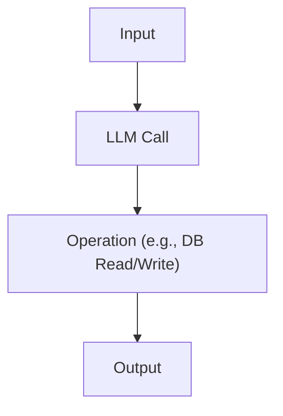
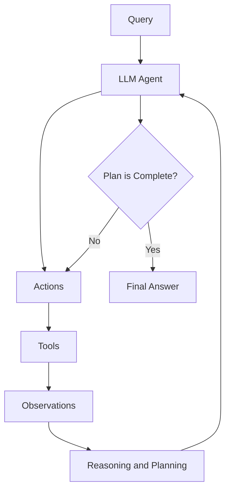
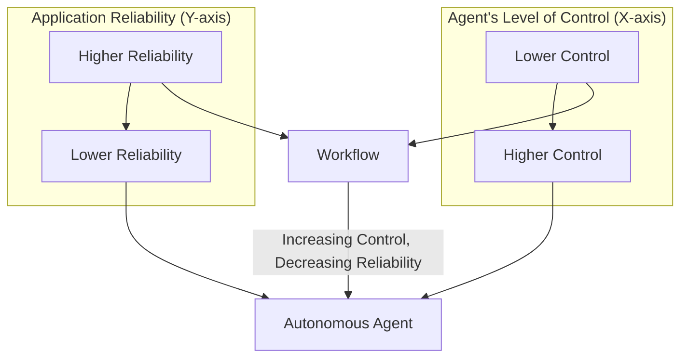
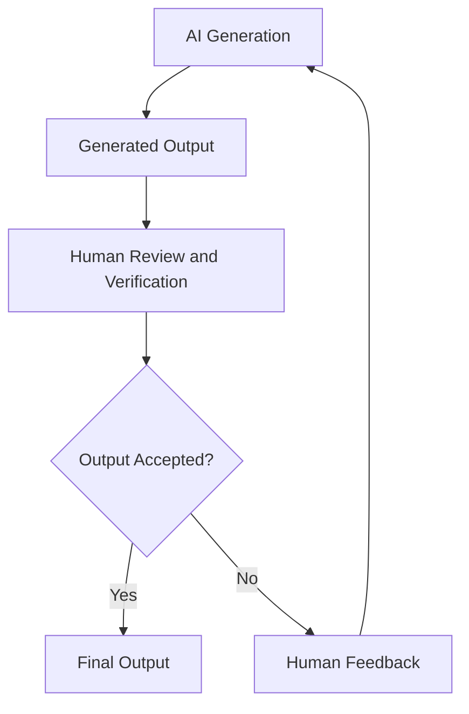
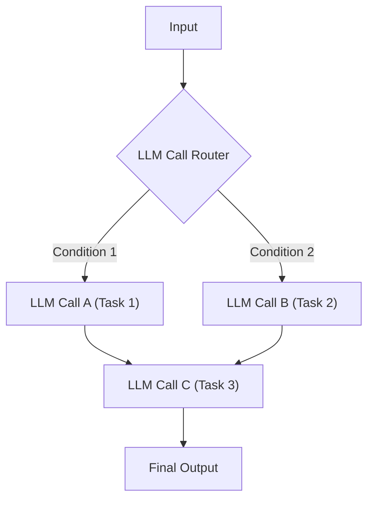
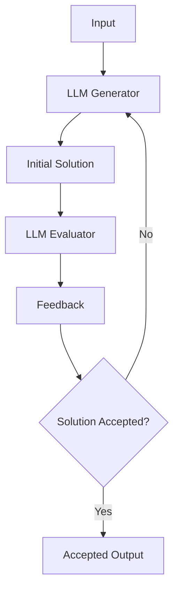
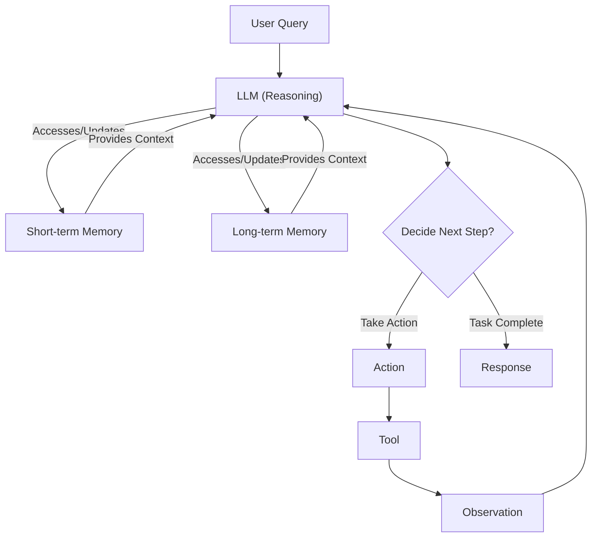
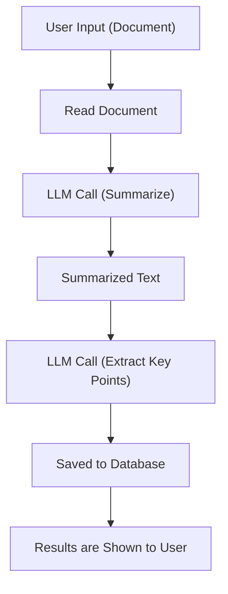
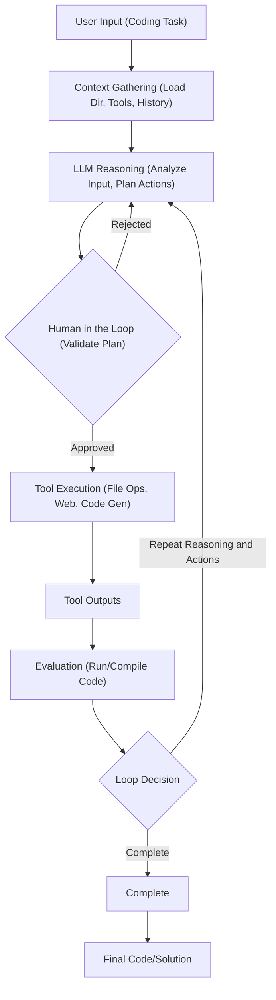
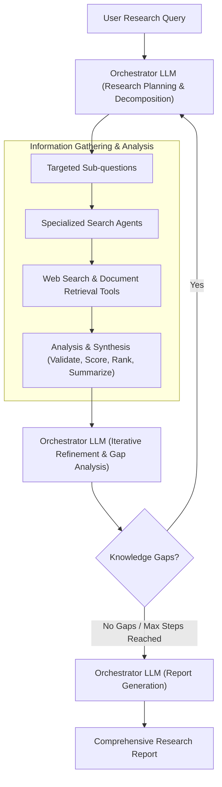

# Workflows, Agents, and The Autonomy Slider
### What only the top 10% of AI engineers who ship think about

As an AI engineer preparing to build your first real AI application, after narrowing down the problem you want to solve, one key decision is how to design your AI solution. Should it follow a predictable, step-by-step workflow, or does it demand a more autonomous approach, where the LLM makes self-directed decisions along the way? Thus one of the fundamental questions that will determine the success or failure of your project is: How should you architect your AI system?

When building AI applications, engineers face this critical architectural decision early in their development process. This choice will impact everything from development time and costs to reliability and user experience. Choose the wrong approach, and you might end up with an overly rigid system that breaks when users deviate from expected patterns. Or you could build an unpredictable agent that works brilliantly 80% of the time but fails spectacularly when it matters most, leading to frustrated users and executives staring at sky-high operational costs. In the worst case, you could waste months rebuilding the entire architecture.

In 2024-2025, we have seen billion-dollar AI startups succeed or fail based on this architectural decision. Successful companies like Glean and Anysphere have achieved massive valuations by focusing on reliable, workflow-centric products that solve specific enterprise problems [[34]](https://techcrunch.com/2025/06/18/here-are-the-24-us-ai-startups-that-have-raised-100m-or-more-in-2025/). The most effective AI engineers know when to use workflows versus agents and, more importantly, how to combine both approaches.

This lesson will provide you with a framework to make this critical decision confidently. We will explain the two core methodologies, explore use cases where each approach is most effective, and analyze state-of-the-art examples from leading AI companies. By the end, you will understand the fundamental trade-offs and be equipped to design systems that leverage the best of both worlds.

## Understanding the Spectrum: From Workflows to Agents

To begin, let's take a brief look at what LLM workflows and AI agents are. We will not focus on the technical specifics yet, but rather on their core properties and how they are used.

An **LLM workflow** is a sequence of tasks, including LLM calls and other operations like reading from a database, that is largely predefined and orchestrated by developer-written code. The steps are defined in advance, resulting in predictable, rule-based execution paths. Think of it as a factory assembly line, where each station performs a specific, repeatable action. In future lessons, we will explore common workflow patterns like chaining, routing, and orchestrator-worker in detail.


Image 1: A flowchart illustrating a simple LLM workflow.

**AI agents**, on the other hand, are systems where an LLM plays a central role in dynamically deciding the sequence of steps, reasoning, and actions to achieve a goal. The path is not predefined; instead, the agent plans its actions based on the task and feedback from its environment. This is like a skilled expert tackling an unfamiliar problem, adapting their approach with each new piece of information. These systems rely on concepts like tools and memory, which we will cover in future lessons, and often use a framework known as ReAct.


Image 2: A flowchart illustrating a simple AI agentic system.

Both workflows and agents require an orchestration layer, but its nature differs. In a workflow, the orchestrator executes a defined plan. In an agent, it facilitates the LLM's dynamic planning and execution. This distinction between developer-defined logic and LLM-driven autonomy is the fundamental difference between the two approaches.

## Choosing Your Path

In the previous section, we defined LLM workflows and AI agents independently. Now, we will explore their core differences to understand when to use each. The central trade-off is between developer-defined logic and LLM-driven autonomy.


Image 3: A graph illustrating the trade-off between application reliability and an agent's level of control.

**LLM workflows** are best for structured, repeatable tasks. Examples include pipelines for data extraction, automated report generation, and content repurposing. Their primary strength is predictability. Because the execution path is fixed, costs and latency are consistent, and debugging is straightforward [[18]](https://blog.gopenai.com/agentic-workflows-vs-autonomous-ai-agents-do-you-know-the-difference-c21c9bfb20ac), [[19]](https://www.lyzr.ai/blog/agentic-ai-vs-llm/), [[21]](https://www.louisbouchard.ai/agents-vs-workflows/). This reliability is essential in enterprise or regulated fields like finance and healthcare, where consistency and auditability are non-negotiable. However, workflows can be rigid, require more upfront development time, and struggle with unexpected scenarios [[13]](https://www.deloitte.com/us/en/insights/industry/technology/technology-media-and-telecom-predictions/2025/autonomous-generative-ai-agents-still-under-development.html).

**AI agents** excel at open-ended, dynamic problems where the solution path is unclear. This includes tasks like complex research, dynamic problem-solving like debugging code, or interactive task completion in unfamiliar environments. Their strength lies in adaptability and flexibility. The trade-off is a loss of reliability. Agents are non-deterministic, so their performance, cost, and latency can vary with each run. They are harder to debug and often require larger, more expensive LLMs to reason effectively. There are even stories of early coding agents deleting entire codebases, prompting jokes like, "Anyway, I wanted to start a new project." [[9]](https://ardor.cloud/blog/common-ai-agent-deployment-issues-and-solutions), [[11]](https://www.strata.io/blog/agentic-identity/hidden-identity-challenges-ai-agents-hybrid-environment-1a/).

Most real-world systems find a balance, creating **hybrid solutions**. The decision between workflows and agents exists on a spectrum, which you can think of as an "autonomy slider." At one end, you have fully controlled workflows, and at the other, fully autonomous agents. Successful applications like Cursor and Perplexity let the user control this slider, offering different levels of autonomy for different tasks. For example, Cursor offers simple code completion, file-level edits, and full-repo agentic changes, allowing the user to choose the appropriate level of AI intervention. Similarly, Perplexity provides basic search, focused research, and "deep research" modes [[8]](https://youtu.be/LCEmiRjPEtQ).

The ultimate goal is to accelerate the feedback loop between AI generation and human verification. This is often achieved through a well-designed architecture and a thoughtful user experience that puts the human in control.


Image 4: A flowchart illustrating the AI generation and human verification loop.

## Exploring Common Patterns

To build your intuition, let's look at the most common patterns used to build AI systems. We will explore these in depth in future lessons, but for now, we will keep the explanations high-level.

For **LLM workflows**, three patterns are fundamental:
*   **Chaining and routing** automate sequences of LLM calls. Chaining links steps together, while routing acts as a conditional gate, directing the workflow down different paths based on the input. This helps in breaking down complex tasks into manageable, specialized steps [[26]](https://www.revanthquicklearn.com/post/understanding-workflow-design-patterns-in-ai-systems), [[27]](https://www.philschmid.de/agentic-pattern), [[29]](https://docs.aws.amazon.com/prescriptive-guidance/latest/agentic-ai-patterns/workflow-for-routing.html).


Image 5: A flowchart illustrating LLM workflow patterns of chaining and routing.

*   The **orchestrator-worker** pattern involves a central orchestrator LLM that dynamically breaks down a task, delegates sub-tasks to specialized worker LLMs, and synthesizes the final result. This provides a bridge between structured workflows and dynamic agentic behavior [[16]](https://www.anthropic.com/research/building-effective-agents).

```mermaid
graph TD
    A["User Query"] --> B["Orchestrator LLM"]
    B --> C["Sub-tasks"]

    subgraph "Worker Layer"
        C --> D1["Worker LLM 1"]
        C --> D2["Worker LLM 2"]
        D1 --> E["Tools"]
        D2 --> E
    end

    D1 --> B: "Results"
    D2 --> B: "Results"
    B --> F["Synthesis"]
    F --> G["Final Answer"]
```
Image 6: A flowchart illustrating the Orchestrator-Worker LLM workflow pattern.

*   The **evaluator-optimizer** pattern creates a feedback loop for self-correction. A generator LLM produces an output, an evaluator LLM assesses it against certain criteria, and the generator refines the output based on the feedback. This repeats until a quality threshold is met, much like a human writer revising a draft [[14]](https://javaaidev.com/docs/agentic-patterns/patterns/evaluator-optimizer/), [[16]](https://www.anthropic.com/research/building-effective-agents).


Image 7: A flowchart illustrating the Evaluator-Optimizer LLM workflow pattern.

For **AI agents**, the most prominent pattern is **ReAct (Reason and Act)**. This is the core operational loop for most modern agents. The agent autonomously decides what action to take, interprets the output of that action, and repeats the cycle until the task is complete. This requires several core components: an LLM for reasoning, a set of tools for taking actions, and memory to maintain context. We will dedicate several future lessons to explaining ReAct, tools, and memory in detail.


Image 8: A high-level flowchart of an AI agent using the ReAct pattern.

## Zooming In on Our Favorite Examples

To make these concepts tangible, let's examine three examples, progressing from a simple workflow to a complex hybrid system.

### Document Summarization Workflow by Gemini in Google Workspace

A common problem in collaborative environments is finding the right information within large documents. A quick, embedded summary can save significant time. The summarization feature in Google Workspace is a perfect example of a pure, multi-step workflow [[22]](https://www.cnet.com/tech/services-and-software/how-to-summarize-text-using-googles-ai-tool/), [[23]](https://belitsoft.com/llm-summarization), [[24]](https://workspaceupdates.googleblog.com/2025/06/summarize-responses-with-gemini-google-forms.html), [[25]](https://workspace.google.com/blog/product-announcements/may-workspace-feature-drop-new-ai-features).


Image 9: A flowchart illustrating a simple document summarization and analysis workflow in Google Workspace.

The process is straightforward and predictable. The system reads a document, sends its content to an LLM to generate a summary, passes that summary to another LLM to extract key points, and finally saves and displays the results. Every step is predefined by the developer, ensuring a consistent, reliable, and cost-effective outcome.

### Gemini CLI Coding Assistant

Writing code can be a slow process, involving reading documentation, understanding new codebases, and learning new languages. A coding assistant can significantly speed this up. Gemini CLI is an open-source tool that leverages a single-agent architecture based on the ReAct pattern to assist developers [[3]](https://cloud.google.com/gemini/docs/codeassist/gemini-cli), [[4]](https://blog.google/technology/developers/introducing-gemini-cli-open-source-ai-agent/).


Image 10: Flowchart illustrating the operational loop of the Gemini CLI coding assistant, based on the ReAct pattern with human-in-the-loop validation.

Here is a high-level overview of its operational loop:
1.  **Context Gathering**: The agent loads the project's directory structure, available tools (like file system access and web search), and conversation history into its working memory.
2.  **LLM Reasoning**: The Gemini model analyzes the user's request and the current context to form a plan of action.
3.  **Human in the Loop**: Before executing, the agent presents its plan to the user for validation.
4.  **Tool Execution**: Once approved, the agent executes its planned actions, such as reading files, searching documentation online, or generating code.
5.  **Evaluation**: The agent attempts to compile or run the generated code to verify its correctness.
6.  **Loop Decision**: Based on the evaluation, the agent decides whether the task is complete or if another cycle of reasoning and action is needed.

### Perplexity Deep Research Agent

Researching a new topic can be daunting. Perplexity's Deep Research feature acts as an expert research assistant, and its architecture appears to be a sophisticated hybrid system that combines structured workflows with multiple specialized agents [[6]](https://arxiv.org/html/2506.18096v1), [[8]](https://www.langchain.com/breakoutagents/perplexity), [[38]](https://www.usaii.org/ai-insights/what-is-perplexity-deep-research-a-detailed-overview), [[39]](https://www.perplexity.ai/hub/blog/introducing-perplexity-deep-research), [[40]](https://www.langchain.com/breakoutagents/perplexity). While it is closed-source, we can infer its high-level design from public information.


Image 11: Flowchart illustrating Perplexity's Deep Research agent process.

The process likely works as follows:
1.  **Research Planning & Decomposition**: An orchestrator LLM analyzes the user's query and breaks it down into targeted sub-questions. This is a classic orchestrator-worker pattern.
2.  **Parallel Information Gathering**: Specialized search agents tackle each sub-question in parallel, using tools to search the web and retrieve documents.
3.  **Analysis & Synthesis**: Each agent analyzes its gathered sources, validates their credibility, and synthesizes the key findings.
4.  **Iterative Refinement**: The orchestrator reviews the synthesized information, identifies knowledge gaps, and initiates new research cycles if necessary.
5.  **Report Generation**: Once the research is complete, the orchestrator compiles all the findings into a single, comprehensive report with citations.

This hybrid approach combines the structured planning of a workflow with the dynamic, adaptive reasoning of multiple agents, allowing it to tackle complex, open-ended research tasks effectively.

## The Challenges of Every AI Engineer

Now that you understand the spectrum from LLM workflows to AI agents, it is important to recognize that every AI Engineer faces these same fundamental architectural decisions. This choice is one of the core factors that determine whether an AI application succeeds in production or fails spectacularly.

Every AI engineer battles a familiar set of challenges daily:
*   **Reliability Issues:** Your agent works perfectly in demos but becomes unpredictable with real users. LLM reasoning failures can compound, leading to unexpected and costly outcomes.
*   **Context Limits:** Systems struggle to maintain coherence across long conversations, losing track of their purpose.
*   **Data Integration:** Building pipelines to pull information from various sources while ensuring only high-quality data reaches your AI system is a constant struggle.
*   **Cost-Performance Trap:** Sophisticated agents deliver impressive results but can be too expensive per interaction, making them economically unfeasible.
*   **Security Concerns:** Autonomous agents with write permissions could send wrong emails, delete critical files, or expose sensitive data.

The good news is that these challenges are solvable. In upcoming lessons, we will cover structured outputs to improve reliability. We will also explore workflow patterns, tools, planning, and memory in detail. By the end of this course, you will have the knowledge to architect AI systems that are not only powerful but also robust, efficient, and safe. You will know when to use a workflow, when to deploy an agent, and how to build effective hybrid systems that work in the real world.

## References

1. (n.d.). *A developer’s guide to building scalable AI: Workflows vs agents*. Towards Data Science. https://towardsdatascience.com/a-developer-s-guide-to-building-scalable-ai-workflows-vs-agents/
2. (n.d.). *Building effective agents*. Anthropic. https://www.anthropic.com/engineering/building-effective-agents
3. (n.d.). *Gemini CLI*. Google Cloud. https://cloud.google.com/gemini/docs/codeassist/gemini-cli
4. (n.d.). *Introducing Gemini CLI: your open-source AI agent*. Google Blog. https://blog.google/technology/developers/introducing-gemini-cli-open-source-ai-agent/
5. (n.d.). *Agentic workflows vs autonomous AI agents — Do you know the difference?*. GOpenAI. https://blog.gopenai.com/agentic-workflows-vs-autonomous-ai-agents-do-you-know-the-difference-c21c9bfb20ac
6. (n.d.). *Evaluation of LLM-based Strategies for the Extraction of Food Product Information from Online Shops*. arXiv. https://arxiv.org/html/2506.18096v1
7. (n.d.). *Agentic AI vs LLM: Understanding the core differences*. Lyzr. https://www.lyzr.ai/blog/agentic-ai-vs-llm/
8. Karpathy, A. (n.d.). *Software in the era of AI*. Y Combinator. https://youtu.be/LCEmiRjPEtQ
9. (n.d.). *Common AI agent deployment issues and solutions*. Ardor. https://ardor.cloud/blog/common-ai-agent-deployment-issues-and-solutions
10. (n.d.). *Building Production-Ready RAG Applications: Jerry Liu*. YouTube. https://www.youtube.com/watch?v=TRjq7t2Ms5I
11. (n.d.). *Agentic identity: The hidden identity challenges of AI agents in a hybrid environment*. Strata. https://www.strata.io/blog/agentic-identity/hidden-identity-challenges-ai-agents-hybrid-environment-1a/
12. (n.d.). *What is an AI agent?*. Google Cloud. https://cloud.google.com/discover/what-are-ai-agents
13. (n.d.). *Autonomous generative AI agents are still under development*. Deloitte. https://www.deloitte.com/us/en/insights/industry/technology/technology-media-and-telecom-predictions/2025/autonomous-generative-ai-agents-still-under-development.html
14. (n.d.). *Evaluator-Optimizer*. Java AI Dev. https://javaaidev.com/docs/agentic-patterns/patterns/evaluator-optimizer/
15. (n.d.). *Introducing ChatGPT agent: bridging research and action*. OpenAI. https://openai.com/index/introducing-chatgpt-agent/
16. (n.d.). *Building effective agents*. Anthropic. https://www.anthropic.com/research/building-effective-agents
17. (n.d.). *Exploring the difference between agents and workflows*. Decoding ML. https://decodingml.substack.com/p/llmops-for-production-agentic-rag
18. (n.d.). *Agentic workflows vs autonomous AI agents — Do you know the difference?*. GOpenAI. https://blog.gopenai.com/agentic-workflows-vs-autonomous-ai-agents-do-you-know-the-difference-c21c9bfb20ac
19. (n.d.). *Agentic AI vs LLM: Understanding the core differences*. Lyzr. https://www.lyzr.ai/blog/agentic-ai-vs-llm/
20. (n.d.). *Real Agents vs. Workflows: The Truth Behind AI 'Agents'*. YouTube. https://www.youtube.com/watch?v=kQxr-uOxw2o&t=1s
21. Bouchard, L. (n.d.). *Real agents vs. workflows: The truth behind AI 'agents'*. Louis Bouchard. https://www.louisbouchard.ai/agents-vs-workflows/
22. (n.d.). *How to summarize text using Google's Gemini AI*. CNET. https://www.cnet.com/tech/services-and-software/how-to-summarize-text-using-googles-ai-tool/
23. (n.d.). *LLM Summarization: Use Cases, Models, and Prompts*. Belitsoft. https://belitsoft.com/llm-summarization
24. (2025, June). *Summarize responses with Gemini in Google Forms*. Google Workspace Updates. https://workspaceupdates.googleblog.com/2025/06/summarize-responses-with-gemini-google-forms.html
25. (2025, May). *New AI features to help you work smarter in Google Workspace*. Google Workspace Blog. https://workspace.google.com/blog/product-announcements/may-workspace-feature-drop-new-ai-features
26. (n.d.). *Understanding workflow design patterns in AI systems*. Revanth's Quick Learn. https://www.revanthquicklearn.com/post/understanding-workflow-design-patterns-in-ai-systems
27. Schmid, P. (n.d.). *Agentic patterns for building reliable LLM applications*. Phil Schmid's Blog. https://www.philschmid.de/agentic-pattern
28. (n.d.). *Stop Building AI Agents: Here’s what you should build instead*. Decoding ML. https://decodingml.substack.com/p/stop-building-ai-agents
29. (n.d.). *Agentic AI patterns for building AI assistants*. AWS Prescriptive Guidance. https://docs.aws.amazon.com/prescriptive-guidance/latest/agentic-ai-patterns/workflow-for-routing.html
30. (n.d.). *ChatGPT agents explained*. TechTarget. https://www.techtarget.com/whatis/feature/ChatGPT-agents-explained
31. (n.d.). *601 real-world gen AI use cases from the world's leading organizations*. Google Cloud. https://cloud.google.com/transform/101-real-world-generative-ai-use-cases-from-industry-leaders
32. (n.d.). *OpenAI's new ChatGPT agent is here — 5 features that change everything*. Tom's Guide. https://www.tomsguide.com/ai/openais-new-chatgpt-agent-is-here-5-features-that-change-everything
33. (n.d.). *Gemini CLI README.md*. GitHub. https://github.com/google-gemini/gemini-cli/blob/main/README.md
34. (2025, June 18). *Here are the 24 U.S. AI startups that have raised $100M or more in 2025*. TechCrunch. https://techcrunch.com/2025/06/18/here-are-the-24-us-ai-startups-that-have-raised-100m-or-more-in-2025/
35. (n.d.). *What is Gemini?*. Google Cloud. https://cloud.google.com/gemini/docs/codeassist/gemini-cli
36. (n.d.). *Google announces Gemini CLI, your open-source AI agent*. GitHub. https://github.com/google-gemini/gemini-cli
37. (n.d.). *Andrej Karpathy: Software in the Era of AI*. YouTube. https://www.youtube.com/watch?v=LCEmiRjPEtQ
38. (n.d.). *What is Perplexity Deep Research? A detailed overview*. USAii. https://www.usaii.org/ai-insights/what-is-perplexity-deep-research-a-detailed-overview
39. (n.d.). *Introducing Perplexity Deep Research*. Perplexity Blog. https://www.perplexity.ai/hub/blog/introducing-perplexity-deep-research
40. (n.d.). *How Perplexity is using LangSmith to build a better search experience*. LangChain Blog. https://www.langchain.com/breakoutagents/perplexity
