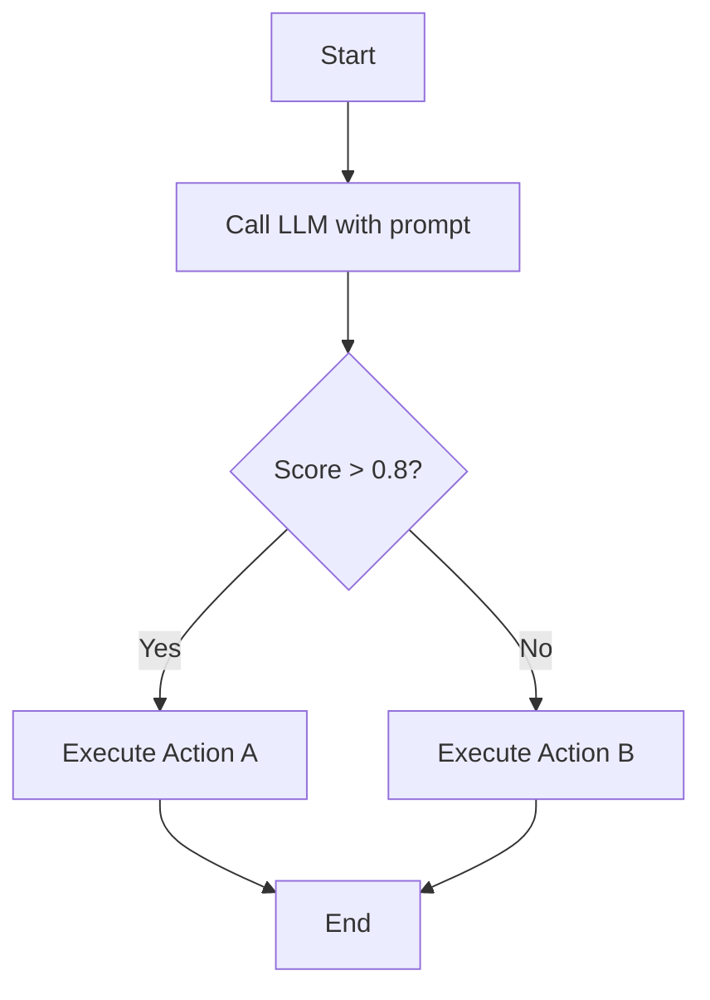
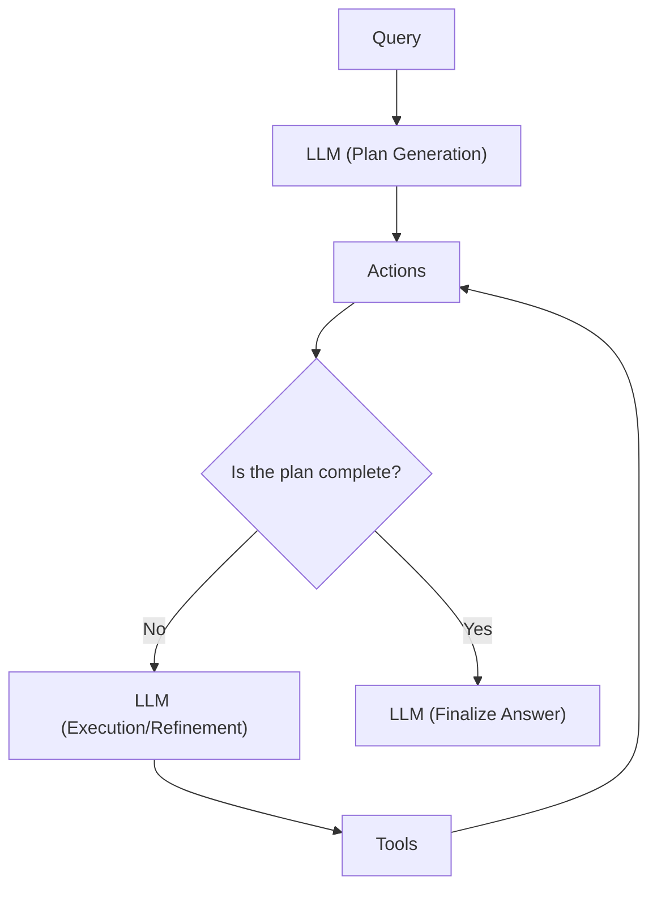
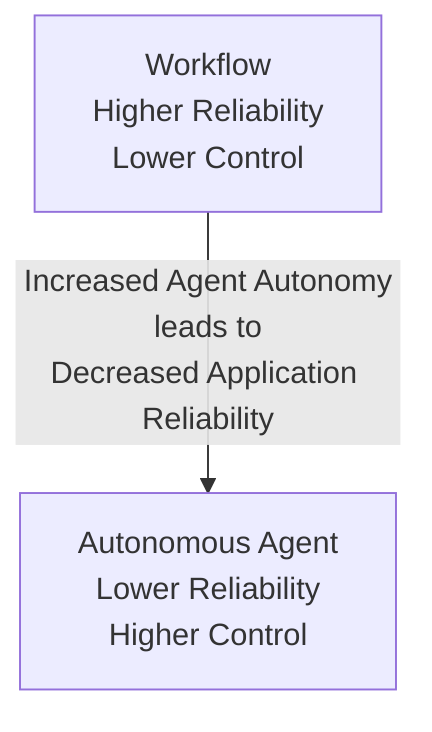
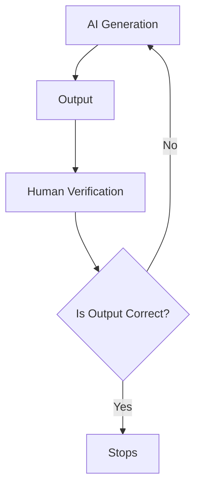
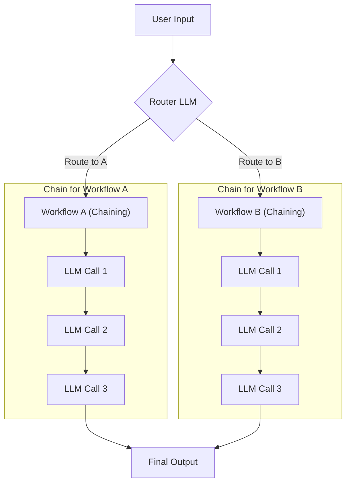
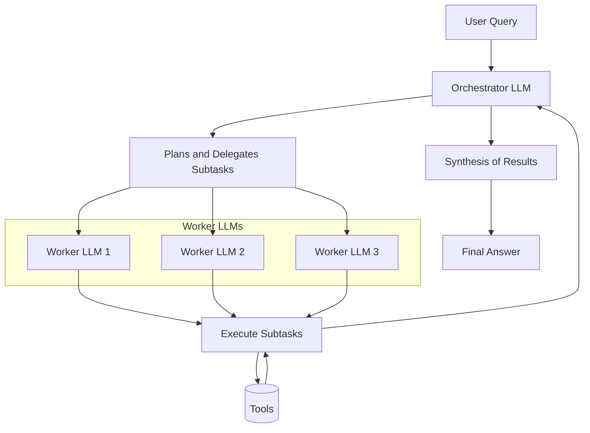
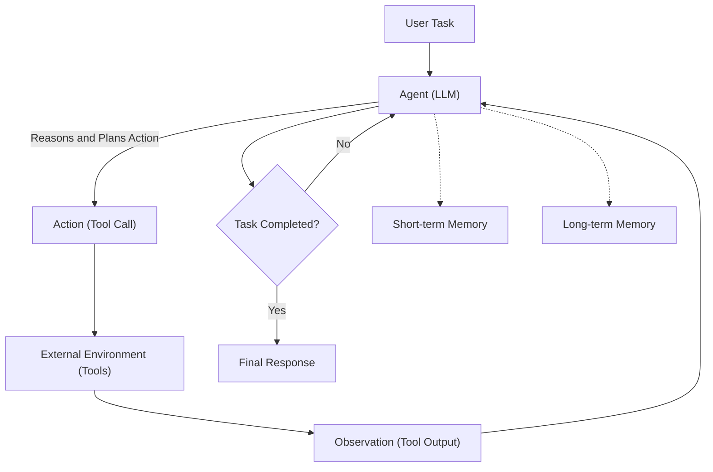
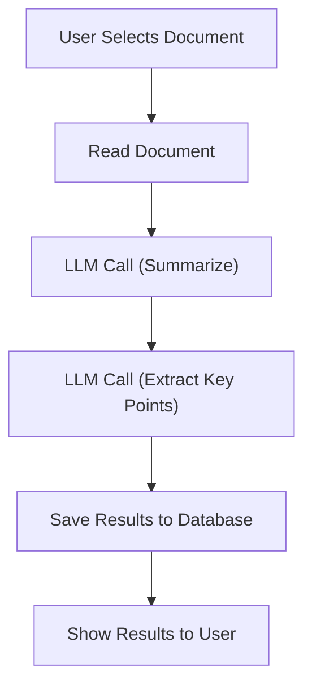
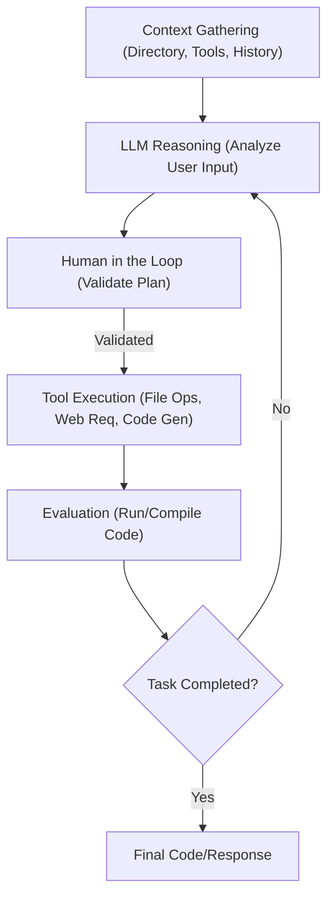

# Workflows vs. Agents: The Critical Decision Every AI Engineer Faces
### Understanding the fundamental architectural patterns for building reliable AI applications.

As an AI engineer preparing to build your first real AI application, one of the first questions you will face is how to design it. Should it follow a predictable, step-by-step workflow, or does it demand an autonomous approach where the LLM makes its own decisions? This is one of the most important architectural decisions you will make, and it will determine the success or failure of your project.

Choose the wrong path, and you might build a rigid system that breaks with unexpected user input, or an unpredictable agent that works brilliantly in demos but fails spectacularly when it matters most. You could waste months rebuilding, leaving you with frustrated users and executives questioning the high operational costs. This isn't a new problem. In 2024 and 2025, the success of billion-dollar AI startups has often been tied to this exact decision. Companies like Glean and Anysphere have achieved massive valuations by implementing robust, LLM-powered workflows that prioritize reliability over full autonomy [[1]](https://techcrunch.com/2025/06/18/here-are-the-24-us-ai-startups-that-have-raised-100m-or-more-in-2025/).

By the end of this lesson, you will have a framework to make this choice. You will understand the trade-offs between LLM workflows and AI agents, see real-world examples from leading AI companies, and learn how to design systems that use the best of both approaches.

## Understanding the Spectrum: From Workflows to Agents

To begin, let's look at what LLM workflows and AI agents are. At this stage, we will focus not on the technical specifics but on their core properties and how they differ in practice.

An **LLM workflow** is a sequence of tasks orchestrated by developer-written code [[2]](https://www.anthropic.com/engineering/building-effective-agents), [[3]](https://towardsdatascience.com/a-developer-s-guide-to-building-scalable-ai-workflows-vs-agents). The steps, which can include LLM calls, tool usage, or data manipulation, are defined in advance. This results in a predictable, rule-based execution path, much like a factory assembly line where each station performs a specific, repeatable action. In future lessons, we will explore common workflow patterns like chaining, routing, and orchestrator-worker.


Image 1: A flowchart illustrating a simple LLM Workflow with predefined paths.

```python
# Python pseudocode for the simple LLM workflow
def simple_llm_workflow(user_input: str) -> str:
    # Step 1: Call LLM with prompt
    llm_response = llm_client.generate(
        prompt=f"Analyze this input: {user_input}",
        temperature=0.1
    )
    
    # Step 2: Extract score from LLM response
    score = extract_score(llm_response)
    
    # Step 3: Conditional execution based on score
    if score > 0.8:
        result = execute_action_a(user_input, llm_response)
    else:
        result = execute_action_b(user_input, llm_response)
    
    return result

def execute_action_a(input_data: str, llm_response: str) -> str:
    # High confidence path - automated processing
    return process_automatically(input_data, llm_response)

def execute_action_b(input_data: str, llm_response: str) -> str:
    # Low confidence path - manual review or alternative processing
    return process_with_review(input_data, llm_response)
```

**AI agents**, on the other hand, are systems where an LLM dynamically decides the sequence of steps required to achieve a goal [[2]](https://www.anthropic.com/engineering/building-effective-agents), [[4]](https://www.louisbouchard.ai/agents-vs-workflows/). The path is not predefined; instead, the agent reasons, plans, and adapts its actions based on the task and feedback from its environment. This is comparable to a skilled expert tackling an unfamiliar problem, adjusting their approach with each new piece of information. These systems rely on concepts like tools, memory, and reasoning patterns, which we will cover in upcoming lessons.


Image 2: A flowchart illustrating a simple Agentic System.

Both workflows and agents require an orchestration layer, but its role is different in each context. In a workflow, the orchestrator simply executes a predefined plan. In an agentic system, the orchestrator facilitates the LLM's dynamic planning and execution, giving it the autonomy to make its own decisions. The core distinction lies in who is in control: the developer's code or the LLM's reasoning process.

## Choosing Your Path

The fundamental difference between these two approaches comes down to a trade-off between developer-defined logic and LLM-driven autonomy. This isn't a binary choice but a spectrum. Your task as an AI engineer is to decide where on this spectrum your application needs to be.


Image 3: A conceptual graph illustrating the trade-off between application reliability and an agent's level of control.

**LLM workflows** are best for structured, repeatable tasks like data extraction pipelines, automated report generation, and content repurposing. Their primary strength is predictability [[5]](https://www.louisbouchard.ai/agents-vs-workflows/). Because the execution path is fixed, costs and latency are consistent, and debugging is straightforward [[6]](https://blog.gopenai.com/agentic-workflows-vs-autonomous-ai-agents-do-you-know-the-difference-c21c9bfb20ac), [[7]](https://www.lyzr.ai/blog/agentic-ai-vs-llm/). This reliability makes them ideal for enterprise environments, especially in regulated fields like finance and healthcare, where consistency and auditability are non-negotiable [[8]](https://www.deloitte.com/us/en/insights/industry/technology/technology-media-and-telecom-predictions/2025/autonomous-generative-ai-agents-still-under-development.html).

**AI agents** excel at open-ended, dynamic problems where the solution path is unclear. Their strength lies in their adaptability. The trade-off is a loss of reliability. Agents are non-deterministic, so their performance, cost, and latency can vary with each run, making them harder to debug [[6]](https://blog.gopenai.com/agentic-workflows-vs-autonomous-ai-agents-do-you-know-the-difference-c21c9bfb20ac), [[7]](https://www.lyzr.ai/blog/agentic-ai-vs-llm/). They often require larger, more expensive LLMs and introduce potential security risks. There are plenty of stories of early adopters having their codebases deleted by a coding agent, with developers joking, "Anyway, I wanted to start a new project." This highlights the current brittleness of agentic systems.

Most real-world systems find a balance by implementing hybrid approaches. When you build an application, you are effectively deciding where to set the "autonomy slider." A manual process might involve a workflow with a human verifying each step. A more automated one gives the agent greater control with fewer human-in-the-loop checkpoints. Andrej Karpathy noted that successful applications like Cursor and Perplexity let the user control this slider, offering different levels of autonomy for different tasks [[9]](https://www.youtube.com/watch?v=LCEmiRjPEtQ). The ultimate goal is to speed up the AI generation and human verification loop, which is often achieved through a well-designed architecture and user interface.


Image 4: A flowchart illustrating the AI generation and human verification loop.

## Exploring Common Patterns

To build an intuition for AI engineering, let's explore some of the most common patterns used to build both workflows and agents. We will keep these explanations high-level, as each pattern will be covered in detail in future lessons.

### LLM Workflow Patterns

Workflows are typically built by combining several key patterns to orchestrate LLM calls and other operations.

**Chaining and routing** are fundamental patterns for automating sequences of LLM calls. Chaining connects the output of one LLM call to the input of the next, creating a sequential process. Routing uses an LLM to classify an input and direct it to the most appropriate downstream workflow, allowing for specialized handling of different task types [[10]](https://www.revanthquicklearn.com/post/understanding-workflow-design-patterns-in-ai-systems), [[11]](https://www.philschmid.de/agentic-pattern).


Image 5: Flowchart illustrating Chaining and Routing patterns in LLM workflows.

The **orchestrator-worker** pattern involves a central LLM (the orchestrator) that decomposes a complex task into smaller subtasks [[2]](https://www.anthropic.com/engineering/building-effective-agents). It then delegates these subtasks to specialized worker LLMs and synthesizes their results into a final answer. This pattern provides a smooth transition from rigid workflows to more dynamic, agent-like behavior.


Image 6: A flowchart illustrating the Orchestrator-Worker pattern.

The **evaluator-optimizer loop** is used to iteratively refine LLM outputs. In this pattern, one LLM generates a response, while a second LLM (the evaluator) provides feedback based on predefined criteria. The initial LLM then uses this feedback to optimize its response. This loop continues until the output meets the desired quality standard, mimicking how a human writer might refine a document based on an editor's comments [[2]](https://www.anthropic.com/engineering/building-effective-agents), [[12]](https://javaaidev.com/docs/agentic-patterns/patterns/evaluator-optimizer/).

```mermaid
graph TD
    A["Initial LLM Generation"] --> B["Output"]
    B --> C["Evaluator LLM"]
    C -->| "Provides Feedback" | D{"Output Meets Criteria?"}
    D -->| "No (Feedback)" | E["Optimizer LLM"]
    E -->| "Refines Output" | A
    D -->| "Yes" | F["Stops"]
    F --> G["Final Output"]
```
Image 7: Flowchart illustrating the Evaluator-Optimizer loop

### Core Components of a ReAct AI Agent

The **ReAct (Reason and Act)** pattern is a popular framework for building AI agents. It enables an agent to reason about a task, decide on an action, observe the outcome, and repeat this cycle until the task is complete. This iterative process is at the heart of most modern agentic systems.

The core components of a ReAct agent include:
*   An **LLM** to reason about the task, plan actions, and interpret the results from its environment.
*   **Tools** that allow the agent to take actions in an external environment, such as searching the web, running code, or accessing a database.
*   **Short-term memory** to keep track of the current conversation and recent actions, similar to how RAM functions in a computer.
*   **Long-term memory** to access factual knowledge and recall user preferences across multiple sessions.

We will explore the ReAct pattern in detail in future lessons, but this high-level overview provides an intuition for how agents operate autonomously.


Image 8: A flowchart illustrating the core components and dynamics of a high-level ReAct AI agent.

## Zooming In on Our Favorite Examples

To anchor these concepts in the real world, let's examine a few examples, progressing from a simple workflow to a sophisticated hybrid system. We will keep these explanations high-level, as you now have the foundational knowledge to understand their architecture without getting lost in technical jargon.

### Document Summarization Workflow in Google Workspace

**Problem:** Finding the right information within a team's shared documents can be a time-consuming process. An embedded summary can provide a quick overview and guide users to the relevant content more efficiently.

This feature is a perfect example of a pure, multi-step workflow. It follows a predictable sequence of LLM calls to process a document and present a concise summary to the user [[13]](https://www.cnet.com/tech/services-and-software/how-to-summarize-text-using-googles-gemini-ai/), [[14]](https://workspace.google.com/blog/product-announcements/may-workspace-feature-drop-new-ai-features), [[15]](https://workspaceupdates.googleblog.com/2025/06/summarize-responses-with-gemini-google-forms.html).


Image 9: A flowchart illustrating the Document Summarization and Analysis Workflow by Gemini in Google Workspace.

The workflow is straightforward: the system reads the document, uses one LLM call to summarize it, another to extract key points, and then saves and displays the results. Each step is predefined, making the process reliable and cost-effective.

### Gemini CLI Coding Assistant

**Problem:** Writing code, especially in an unfamiliar language or codebase, is a slow process. An AI coding assistant can speed up development by generating code, providing explanations, and helping engineers navigate new projects.

The open-source Gemini CLI is a single-agent system that uses the ReAct architecture to assist with coding tasks [[16]](https://blog.google/technology/developers/introducing-gemini-cli-open-source-ai-agent/), [[17]](https://cloud.google.com/gemini/docs/codeassist/gemini-cli).


Image 10: A flowchart illustrating the operational loop of the Gemini CLI coding assistant, based on the ReAct pattern.

Its operational loop follows the ReAct pattern:
1.  **Context Gathering:** The agent loads the current state, including the directory structure and available tools.
2.  **LLM Reasoning:** The Gemini model analyzes the user's request to create a plan of action.
3.  **Human in the Loop:** The agent presents its plan to the user for validation.
4.  **Tool Execution:** The agent uses its tools to execute the plan. These can include file system tools like `grep`, code interpreters, web search for documentation, and version control commands via `git`.
5.  **Evaluation:** It dynamically evaluates the generated code by attempting to run or compile it.
6.  **Loop Decision:** The agent determines if the task is complete or if another iteration is needed.

### Perplexity's Deep Research Agent

**Problem:** Researching a new topic is often difficult. A research assistant that can quickly scan the internet and compile a comprehensive report provides a massive productivity boost.

Perplexity's Deep Research feature is a sophisticated hybrid system that combines a structured workflow with multiple specialized agents to conduct expert-level research [[18]](https://www.perplexity.ai/hub/blog/introducing-perplexity-deep-research). While closed-source, its architecture uses an orchestrator to manage multiple search agents in parallel, allowing it to process hundreds of sources and generate a detailed report in minutes [[19]](https://www.langchain.com/breakoutagents/perplexity), [[20]](https://www.usaii.org/ai-insights/what-is-perplexity-deep-research-a-detailed-overview).

```mermaid
graph TD
    A["User Research Question"] --> B["Orchestrator (LLM Workflow)"]
    B --> C["Research Planning & Decomposition"]
    C --> D["Targeted Sub-questions"]
    D --> E["Parallel Search Agents (Tools: Web Search, Doc Retrieval)"]
    E --> F["Parallel Information Gathering"]
    F --> G["Analysis & Synthesis (Validate, Score, Rank, Summarize)"]
    G --> H{"Knowledge Gaps Identified?"}
    H -->|"Yes"| I["Generate Follow-up Queries"]
    I --> B
    H -->|"No" or "Max Steps Reached"| J["Report Generation (Final Report with Citations)"]
```
Image 11: Flowchart illustrating Perplexity's Deep Research agent process

This hybrid system operates as follows:
1.  **Research Planning:** An orchestrator agent decomposes the research query into targeted sub-questions.
2.  **Parallel Information Gathering:** Specialized search agents tackle each sub-question in parallel.
3.  **Analysis and Synthesis:** Each agent analyzes its findings, validates sources, and synthesizes the information.
4.  **Iterative Refinement:** The orchestrator reviews the results, identifies knowledge gaps, and initiates further research cycles if necessary.
5.  **Report Generation:** The orchestrator compiles all findings into a single, comprehensive report.

This approach combines the structured planning of a workflow with the dynamic capabilities of multiple autonomous agents, demonstrating the power of blending both patterns.

## The Challenges of Every AI Engineer

Let's be blunt: building reliable AI is hard. Everyone is talking about agents, but most production systems are still simple workflows for a reason. Agents are often unreliable, expensive, and insecure.

Here are some of the daily challenges every AI engineer battles:
*   **Reliability Issues:** Agents that work in demos often become unpredictable with real users. In production, only 30% of generative AI pilots succeed, largely due to a lack of trust in the system's output [[8]](https://www.deloitte.com/us/en/insights/industry/technology/technology-media-and-telecom-predictions/2025/autonomous-generative-ai-agents-still-under-development.html).
*   **Context Limits:** Systems struggle to maintain coherence across long conversations, losing track of their original purpose.
*   **Data Integration:** Building reliable pipelines to pull information from diverse sources is complex, and poor data quality leads to poor AI performance [[21]](https://ardor.cloud/blog/common-ai-agent-deployment-issues-and-solutions).
*   **Cost-Performance Trap:** Sophisticated agents can be impressive but often come with high operational costs, with some companies reporting annual increases of 30% as workloads rise [[21]](https://ardor.cloud/blog/common-ai-agent-deployment-issues-and-solutions).
*   **Security Concerns:** Autonomous agents with write permissions introduce significant risks, from exposing sensitive data to deleting critical files [[22]](https://www.strata.io/blog/agentic-identity/hidden-identity-challenges-ai-agents-hybrid-environment-1a/).

These challenges are solvable, but they require careful engineering. In our next lesson, we will explore structured outputs, a fundamental technique for ensuring reliability. As we progress, we will cover patterns for building robust systems, managing context, and controlling costs. By the end of this course, you will have the knowledge to architect AI systems that are not only powerful but also efficient and safe.

## References

1. (2025, June 18). *Here are the 24 US AI startups that have raised $100M or more in 2025*. TechCrunch. https://techcrunch.com/2025/06/18/here-are-the-24-us-ai-startups-that-have-raised-100m-or-more-in-2025/
2. (n.d.). *Building effective agents*. Anthropic. https://www.anthropic.com/engineering/building-effective-agents
3. (n.d.). *A developer's guide to building scalable AI: Workflows vs agents*. Towards Data Science. https://towardsdatascience.com/a-developer-s-guide-to-building-scalable-ai-workflows-vs-agents/
4. Bouchard, L. (n.d.). *Real agents vs. workflows: The truth behind AI 'agents'*. Louis Bouchard. https://www.louisbouchard.ai/agents-vs-workflows/
5. (n.d.). *Real Agents vs. Workflows: The Truth Behind AI 'Agents'*. YouTube. https://www.youtube.com/watch?v=kQxr-uOxw2o&t=1s
6. (n.d.). *Agentic workflows vs autonomous AI agents — Do you know the difference?*. GOpenAI. https://blog.gopenai.com/agentic-workflows-vs-autonomous-ai-agents-do-you-know-the-difference-c21c9bfb20ac
7. (n.d.). *Agentic AI vs LLM: Understanding the core differences*. Lyzr. https://www.lyzr.ai/blog/agentic-ai-vs-llm/
8. (n.d.). *Autonomous generative AI agents are still under development*. Deloitte. https://www.deloitte.com/us/en/insights/industry/technology/technology-media-and-telecom-predictions/2025/autonomous-generative-ai-agents-still-under-development.html
9. Karpathy, A. (n.d.). *Software in the era of AI*. Y Combinator. https://www.youtube.com/watch?v=LCEmiRjPEtQ
10. (n.d.). *Understanding workflow design patterns in AI systems*. Revanth's Quick Learn. https://www.revanthquicklearn.com/post/understanding-workflow-design-patterns-in-ai-systems
11. Schmid, P. (n.d.). *Agentic Pattern*. Phil Schmid. https://www.philschmid.de/agentic-pattern
12. (n.d.). *Evaluator-Optimizer*. Java AI Dev. https://javaaidev.com/docs/agentic-patterns/patterns/evaluator-optimizer/
13. (n.d.). *How to summarize text using Google's Gemini AI*. CNET. https://www.cnet.com/tech/services-and-software/how-to-summarize-text-using-googles-gemini-ai/
14. (2025, May). *New AI features to help you work smarter in Google Workspace*. Google Workspace Blog. https://workspace.google.com/blog/product-announcements/may-workspace-feature-drop-new-ai-features
15. (2025, June). *Summarize responses with Gemini in Google Forms*. Google Workspace Updates. https://workspaceupdates.googleblog.com/2025/06/summarize-responses-with-gemini-google-forms.html
16. (n.d.). *Introducing Gemini CLI: your open-source AI agent*. Google Blog. https://blog.google/technology/developers/introducing-gemini-cli-open-source-ai-agent/
17. (n.d.). *Gemini CLI*. Google Cloud. https://cloud.google.com/gemini/docs/codeassist/gemini-cli
18. (n.d.). *Introducing Perplexity Deep Research*. Perplexity Blog. https://www.perplexity.ai/hub/blog/introducing-perplexity-deep-research
19. (n.d.). *How Perplexity is using LangSmith to build a better search experience*. LangChain Blog. https://www.langchain.com/breakoutagents/perplexity
20. (n.d.). *What is Perplexity Deep Research? A detailed overview*. USAii. https://www.usaii.org/ai-insights/what-is-perplexity-deep-research-a-detailed-overview
21. (n.d.). *Common AI agent deployment issues and solutions*. Ardor. https://ardor.cloud/blog/common-ai-agent-deployment-issues-and-solutions
22. (n.d.). *The Hidden Identity Challenges of AI Agents in a Hybrid Environment*. Strata. https://www.strata.io/blog/agentic-identity/hidden-identity-challenges-ai-agents-hybrid-environment-1a/