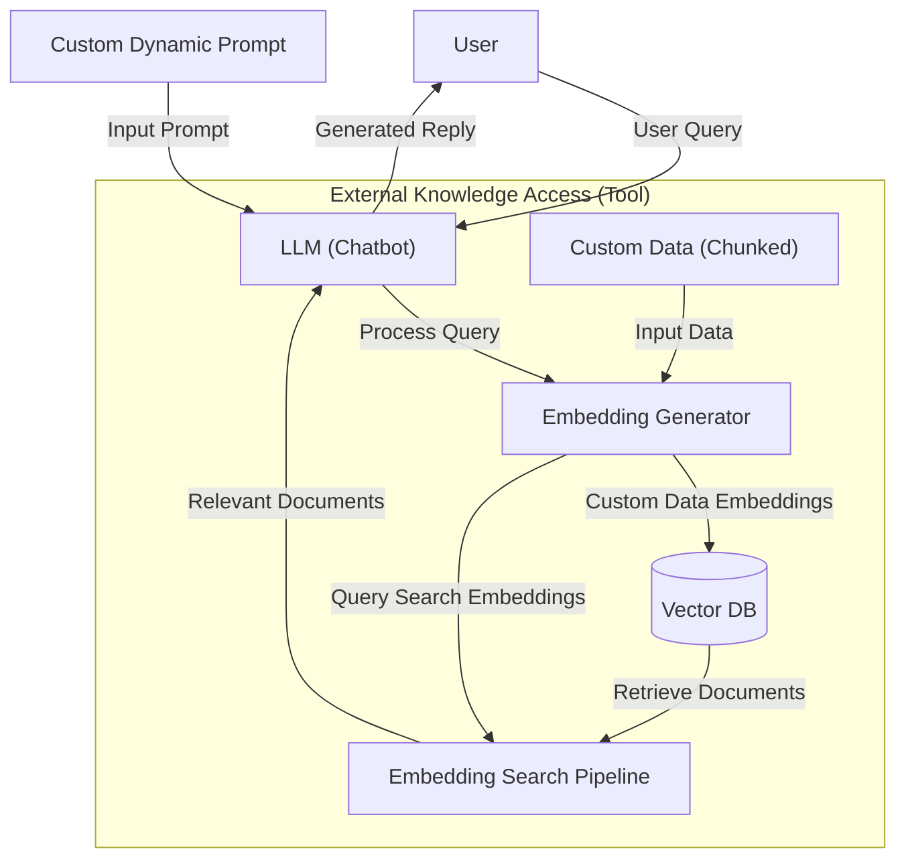
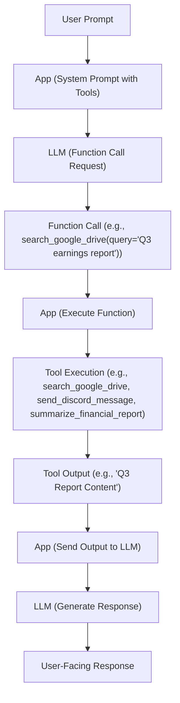
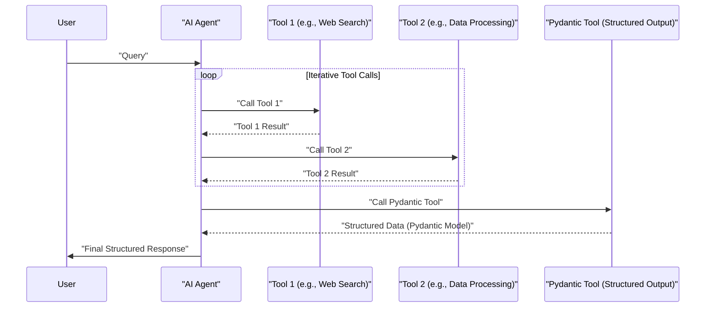
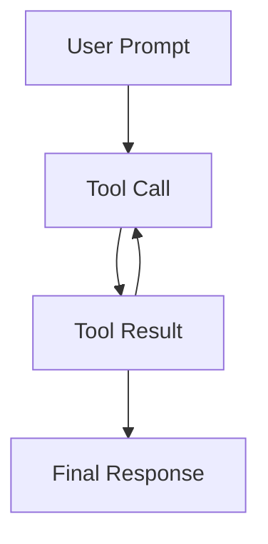

# The Engineer's Guide to AI Agent Tools & Function Calling
### Giving your LLM the ability to take action

In the previous lessons of our AI Agents Foundations series, we covered the difference between workflows and agents, the art of context engineering, how to get reliable structured outputs, and the five core workflow patterns. We have all the foundational pieces to build robust AI applications.

But there is a catch. So far, our systems can only process information. They cannot *act*. An LLM is a brain in a jar. It can think, but it has no hands to interact with the world. This is the lesson where we give it hands.

Tools, or function calling, are the solution. For an AI Engineer, they are what transform an LLM from a simple text generator into an agent that can take action. Understanding how an agent works with tools is critical to building, improving, debugging, and monitoring them. We will open the black box to understand the underlying mechanics.

To do that, we will build everything from the ground up:
1.  Understand why agents need tools in the first place.
2.  Implement tool definition and calling from scratch.
3.  Build a small tool-calling framework with a `@tool` decorator.
4.  Use a production-grade API like Gemini for tool calling.
5.  Use Pydantic models as on-demand tools for structured outputs.
6.  Chain tools in a loop and understand the limitations that lead to more advanced patterns.
7.  Review the most essential tool categories used in the industry.

## Understanding why agents need tools

Before we start coding, let's clarify why LLMs need tools. At their core, LLMs are powerful pattern matchers and text generators. They are trained on vast, static datasets and excel at language-based tasks. However, they have fundamental limitations: they cannot perform actions or access information outside of their training data on their own [[21]](https://www.projectpro.io/article/llm-limitations/1045). Their knowledge is fixed at the time of training, meaning they are unaware of any events that occurred after their knowledge cut-off date. This prevents them from answering questions about recent news or accessing real-time data [[22]](https://learnprompting.org/docs/basics/pitfalls).

Furthermore, LLMs are not designed for precise mathematical reasoning or executing external actions. Their strength lies in generating human-like text, not performing calculations or interacting with databases. Tools solve this problem. You can think of the LLM as the brain, while tools are its "hands and senses." They allow the LLM to perceive and act in the world beyond its textual interface, transforming it from a passive text generator into an active AI agent [[23]](https://www.deeplearning.ai/the-batch/agentic-design-patterns-part-3-tool-use/).


Image 1: High-level architectural diagram illustrating how an LLM (Chatbot) uses tools to interact with external knowledge.

With tools, an agent can execute specific instructions and interact with its environment. Some of the most common actions that power modern AI agents include:
*   Accessing real-time information through APIs, like fetching today's weather or the latest news [[1]](https://aman.ai/primers/ai/agents/), [[2]](https://www.mercity.ai/blog-post/guide-to-integrating-tools-and-apis-with-language-models).
*   Interacting with external databases or storage solutions like PostgreSQL or Snowflake [[3]](https://arxiv.org/html/2507.08034v1).
*   Accessing its long-term memory to recall information beyond its context window [[4]](https://www.weka.io/learn/guide/ai-ml/retrieval-augmented-generation/).
*   Executing code in languages like Python or JavaScript to perform precise calculations or data manipulation [[1]](https://aman.ai/primers/ai/agents/).

## Implementing tool calls from scratch

The best way to understand how tools work is to build the mechanism from scratch. This lesson will focus on showing you how to implement a simple tools framework and then how to use it with modern APIs like Gemini.

You will learn how a tool is defined, what its schema looks like, how the LLM discovers available tools, how to call them, and how to interpret their output.

Our goal is to provide the LLM with a list of available tools and let it decide which one to use, generating the correct arguments needed to call the function. The high-level process looks like this:

1.  **App:** You send the LLM a prompt and a list of available tools.
2.  **LLM:** The model responds with a `function_call` request, specifying the tool and its arguments.
3.  **App:** You execute the requested function in your code.
4.  **App:** You send the function's output back to the LLM.
5.  **LLM:** The model uses the tool's output to generate a final, user-facing response.

This request-execute-respond flow is the foundation of tool calling.


Image 2: A flowchart illustrating the 5-step request-execute-respond flow of calling a tool.

Now, let's implement a simple example where we mock searching for documents on Google Drive and sending their summaries to Discord.

1.  First, we set up our Gemini client and define some constants. The `DOCUMENT` constant will be used to mock the content of a PDF file.
    ```python
    import json
    from typing import Any
    
    from google import genai
    from google.genai import types
    from pydantic import BaseModel, Field
    
    client = genai.Client()
    
    MODEL_ID = "gemini-2.5-flash"
    
    DOCUMENT = """
    # Q3 2023 Financial Performance Analysis
    
    The Q3 earnings report shows a 20% increase in revenue and a 15% growth in user engagement, 
    beating market expectations. These impressive results reflect our successful product strategy 
    and strong market positioning.
    
    Our core business segments demonstrated remarkable resilience, with digital services leading 
    the growth at 25% year-over-year. The expansion into new markets has proven particularly 
    successful, contributing to 30% of the total revenue increase.
    
    Customer acquisition costs decreased by 10% while retention rates improved to 92%, 
    marking our best performance to date. These metrics, combined with our healthy cash flow 
    position, provide a strong foundation for continued growth into Q4 and beyond.
    """
    ```

2.  Next, we define three mock Python functions that will serve as our tools. To keep the code simple, these functions return hardcoded data instead of interacting with real APIs.
    ```python
    def search_google_drive(query: str) -> dict:
        """
        Searches for a file on Google Drive and returns its content or a summary.
    
        Args:
            query (str): The search query to find the file, e.g., 'Q3 earnings report'.
    
        Returns:
            dict: A dictionary representing the search results, including file names and summaries.
        """
        return {
            "files": [
                {
                    "name": "Q3_Earnings_Report_2024.pdf",
                    "id": "file12345",
                    "content": DOCUMENT,
                }
            ]
        }
    ```
    ```python
    def send_discord_message(channel_id: str, message: str) -> dict:
        """
        Sends a message to a specific Discord channel.
    
        Args:
            channel_id (str): The ID of the channel to send the message to, e.g., '#finance'.
            message (str): The content of the message to send.
    
        Returns:
            dict: A dictionary confirming the action, e.g., {"status": "success"}.
        """
        return {
            "status": "success",
            "status_code": 200,
            "channel": channel_id,
            "message_preview": f"{message[:50]}...",
        }
    ```
    ```python
    def summarize_financial_report(text: str) -> str:
        """
        Summarizes a financial report.
    
        Args:
            text (str): The text to summarize.
    
        Returns:
            str: The summary of the text.
        """
        return "The Q3 2023 earnings report shows strong performance across all metrics with 20% revenue growth, 15% user engagement increase, 25% digital services growth, and improved retention rates of 92%."
    ```

3.  For the LLM to understand these tools, we must define a schema for each one. The schema, typically in JSON format, describes the tool's name, its purpose, and the parameters it accepts.
    ```python
    search_google_drive_schema = {
        "name": "search_google_drive",
        "description": "Searches for a file on Google Drive and returns its content or a summary.",
        "parameters": {
            "type": "object",
            "properties": {
                "query": {
                    "type": "string",
                    "description": "The search query to find the file, e.g., 'Q3 earnings report'.",
                }
            },
            "required": ["query"],
        },
    }
    ```
    ```python
    send_discord_message_schema = {
        "name": "send_discord_message",
        "description": "Sends a message to a specific Discord channel.",
        "parameters": {
            "type": "object",
            "properties": {
                "channel_id": {
                    "type": "string",
                    "description": "The ID of the channel to send the message to, e.g., '#finance'.",
                },
                "message": {
                    "type": "string",
                    "description": "The content of the message to send.",
                },
            },
            "required": ["channel_id", "message"],
        },
    }
    ```
    ```python
    summarize_financial_report_schema = {
        "name": "summarize_financial_report",
        "description": "Summarizes a financial report.",
        "parameters": {
            "type": "object",
            "properties": {
                "text": {
                    "type": "string",
                    "description": "The text to summarize.",
                },
            },
            "required": ["text"],
        },
    }
    ```
    <aside>
    💡 This schema format is the industry standard for modern LLM providers like OpenAI and Google [[5]](https://platform.openai.com/docs/guides/function-calling), [[6]](https://ai.google.dev/gemini-api/docs/function-calling).
    </aside>

4.  We then create a tool registry to map tool names to their corresponding functions (handlers) and schemas.
    ```python
    TOOLS = {
        "search_google_drive": {
            "handler": search_google_drive,
            "declaration": search_google_drive_schema,
        },
        "send_discord_message": {
            "handler": send_discord_message,
            "declaration": send_discord_message_schema,
        },
        "summarize_financial_report": {
            "handler": summarize_financial_report,
            "declaration": summarize_financial_report_schema,
        },
    }
    TOOLS_BY_NAME = {tool_name: tool["handler"] for tool_name, tool in TOOLS.items()}
    TOOLS_SCHEMA = [tool["declaration"] for tool in TOOLS.values()]
    ```

5.  Here is what the `TOOLS_BY_NAME` mapping looks like.
    ```text
    Tool name: search_google_drive
    Tool handler: <function search_google_drive at 0x104c7df80>
    ---------------------------------------------------------------------------
    Tool name: send_discord_message
    Tool handler: <function send_discord_message at 0x104c7de40>
    ---------------------------------------------------------------------------
    Tool name: summarize_financial_report
    Tool handler: <function summarize_financial_report at 0x1274f5c60>
    ---------------------------------------------------------------------------
    ```

6.  And here is the schema for our first tool.
    ```json
    {
      "name": "search_google_drive",
      "description": "Searches for a file on Google Drive and returns its content or a summary.",
      "parameters": {
        "type": "object",
        "properties": {
          "query": {
            "type": "string",
            "description": "The search query to find the file, e.g., 'Q3 earnings report'."
          }
        },
        "required": [
          "query"
        ]
      }
    }
    ```

7.  Now, we create a system prompt to instruct the LLM on how to use these tools. This prompt includes guidelines, the expected output format, and the list of available tool schemas.
    ```python
    TOOL_CALLING_SYSTEM_PROMPT = """
    You are a helpful AI assistant with access to tools that enable you to take actions and retrieve information to better 
    assist users.
    
    ## Tool Usage Guidelines
    
    **When to use tools:**
    - When you need information that is not in your training data
    - When you need to perform actions in external systems and environments
    - When you need to a real-time, dynamic, or user-specific data
    - When computational operations are required
    
    **Tool selection:**
    - Choose the most appropriate tool based on the user's specific request
    - If multiple tools could work, select the one that most directly addresses the need
    - Consider the order of operations for multi-step tasks
    
    **Parameter requirements:**
    - Provide all required parameters with accurate values
    - Use the parameter descriptions to understand expected formats and constraints
    - Ensure data types match the tool's requirements (strings, numbers, booleans, arrays)
    
    ## Tool Call Format
    
    When you need to use a tool, output ONLY the tool call in this exact format:
    
    ```tool_call
    {{"name": "tool_name", "args": {{"param1": "value1", "param2": "value2"}}}}
    ```
    
    **Critical formatting rules:**
    - Use double quotes for all JSON strings
    - Ensure the JSON is valid and properly escaped
    - Include ALL required parameters
    - Use correct data types as specified in the tool definition
    - Do not include any additional text or explanation in the tool call
    
    ## Response Behavior
    
    - If no tools are needed, respond directly to the user with helpful information
    - If tools are needed, make the tool call first, then provide context about what you're doing
    - After receiving tool results, provide a clear, user-friendly explanation of the outcome
    - If a tool call fails, explain the issue and suggest alternatives when possible
    
    ## Available Tools
    
    <tool_definitions>
    {tools}
    </tool_definitions>
    
    Remember: Your goal is to be maximally helpful to the user. Use tools when they add value, but don't use them unnecessarily. Always prioritize accuracy and user experience.
    """
    ```

8.  In practice, the LLM uses the `description` field from the tool schema to decide if a tool is appropriate for a user's query. This is why clear and distinct tool descriptions are critical for building successful agents. Vague descriptions like "Tool used to search documents" and "Tool used to search files" can confuse the model. Instead, be explicit: "Tool used to search documents on Google Drive" and "Tool used to search files on the local disk." Another disambiguation method is to be as clear as possible in your user prompts. Instead of saying `search documents`, be explicit about where to search, such as `search documents on Google Drive`. Clear tool descriptions, combined with explicit user prompts, ensure the agent can match intent to the correct tool. This becomes vital when scaling to dozens of tools per agent. Once a tool is selected, the model generates the function name and arguments as a structured output, like JSON. This capability is not accidental; modern LLMs are specifically instruction-fine-tuned to interpret tool schemas and produce valid tool calls [[7]](https://python.langchain.com/docs/concepts/tools/).

9.  Let's test our prompt. We ask the model to find a report and share insights.
    ```python
    USER_PROMPT = """
    Can you help me find the latest quarterly report and share key insights with the team?
    """
    
    messages = [TOOL_CALLING_SYSTEM_PROMPT.format(tools=str(TOOLS_SCHEMA)), USER_PROMPT]
    
    response = client.models.generate_content(
        model=MODEL_ID,
        contents=messages,
    )
    ```
    It outputs:
    ```text
    <tool_call>
    {"name": "search_google_drive", "args": {"query": "latest quarterly report"}}
    </tool_call>
    ```

10. The model correctly identified the `search_google_drive` tool and generated the appropriate query.

11. Let's try a more complex, multi-step prompt.
    ```python
    USER_PROMPT = """
    Please find the Q3 earnings report on Google Drive and send a summary of it to 
    the #finance channel on Discord.
    """
    
    messages = [TOOL_CALLING_SYSTEM_PROMPT.format(tools=str(TOOLS_SCHEMA)), USER_PROMPT]
    
    response = client.models.generate_content(
        model=MODEL_ID,
        contents=messages,
    )
    ```
    It outputs:
    ```text
    <tool_call>
    {"name": "search_google_drive", "args": {"query": "Q3 earnings report"}}
    </tool_call>
    ```

12. Now, we need to parse the LLM's response and execute the function. First, we extract the JSON string from the Markdown block.
    ```python
    def extract_tool_call(response_text: str) -> str:
        """
        Extracts the tool call from the response text.
        """
        return response_text.split("```tool_call")[1].split("```")[0].strip()
    
    
    tool_call_str = extract_tool_call(response.text)
    ```
    It outputs:
    ```text
    '{"name": "search_google_drive", "args": {"query": "Q3 earnings report"}}'
    ```

13. Next, we parse the JSON string into a Python dictionary.
    ```python
    tool_call = json.loads(tool_call_str)
    ```
    It outputs:
    ```text
    {'name': 'search_google_drive', 'args': {'query': 'Q3 earnings report'}}
    ```

14. We retrieve the corresponding Python function from our `TOOLS_BY_NAME` dictionary.
    ```python
    tool_handler = TOOLS_BY_NAME[tool_call["name"]]
    ```
    It outputs:
    ```text
    <function __main__.search_google_drive(query: str) -> dict>
    ```

15. The `tool_handler` is a direct reference to our `search_google_drive` function.

16. Finally, we execute the function using the arguments generated by the LLM.
    ```python
    tool_result = tool_handler(**tool_call["args"])
    ```

17. The tool returns the mocked document content.
    ```json
    {
      "files": [
        {
          "name": "Q3_Earnings_Report_2024.pdf",
          "id": "file12345",
          "content": "\n# Q3 2023 Financial Performance Analysis\n\nThe Q3 earnings report shows a 20% increase in revenue and a 15% growth in user engagement, \nbeating market expectations. These impressive results reflect our successful product strategy \nand strong market positioning.\n\nOur core business segments demonstrated remarkable resilience, with digital services leading \nthe growth at 25% year-over-year. The expansion into new markets has proven particularly \nsuccessful, contributing to 30% of the total revenue increase.\n\nCustomer acquisition costs decreased by 10% while retention rates improved to 92%, \nmarking our best performance to date. These metrics, combined with our healthy cash flow \nposition, provide a strong foundation for continued growth into Q4 and beyond.\n"
        }
      ]
    }
    ```

18. We can wrap these steps into a single helper function.
    ```python
    def call_tool(response_text: str, tools_by_name: dict) -> Any:
        """
        Call a tool based on the response from the LLM.
        """
        tool_call_str = extract_tool_call(response_text)
        tool_call = json.loads(tool_call_str)
        tool_name = tool_call["name"]
        tool_args = tool_call["args"]
        tool = tools_by_name[tool_name]
    
        return tool(**tool_args)
    ```

19. Using this function, we can execute the tool call in one line.
    ```python
    call_tool(response.text, tools_by_name=TOOLS_BY_NAME)
    ```
    The output is identical to the one from step 17.

20. The final step in the loop is to send the tool's output back to the LLM. This allows the model to interpret the result and either generate a final response or decide on the next action.
    ```python
    response = client.models.generate_content(
        model=MODEL_ID,
        contents=f"Interpret the tool result: {json.dumps(tool_result, indent=2)}",
    )
    ```

21. The LLM provides a user-friendly summary of the tool's output.
    ```text
    The tool result provides the content of a file named `Q3_Earnings_Report_2024.pdf`.
    
    This document is a **Q3 2023 Financial Performance Analysis** and details exceptionally strong results, significantly beating market expectations.
    
    **Key highlights from the report include:**
    
    *   **Revenue Growth:** A 20% increase in revenue.
    *   **User Engagement:** 15% growth in user engagement.
    *   **Core Business Performance:** Digital services led growth at 25% year-over-year.
    *   **Market Expansion Success:** New markets contributed 30% of the total revenue increase.
    *   **Efficiency & Retention:**
        *   Customer acquisition costs decreased by 10%.
        *   Retention rates improved to 92%, marking the best performance to date.
    *   **Financial Health:** The company maintains a healthy cash flow position.
    
    The report attributes these impressive results to a successful product strategy and strong market positioning, indicating a robust foundation for continued growth into Q4 and beyond.
    ```
This covers the basic concepts of tool calling. We have successfully implemented a simple but complete function-calling flow from scratch.

## Implementing a tool calling framework from scratch

Manually defining JSON schemas for every tool is tedious and violates the Don't Repeat Yourself (DRY) software principle. Modern AI agent frameworks like LangGraph address this with a `@tool` decorator that automatically generates schemas from Python function signatures and docstrings [[7]](https://python.langchain.com/docs/concepts/tools/). This approach standardizes schema creation and keeps your code clean.

Let's build our own simple framework by creating a `@tool` decorator to automate the process.

1.  First, we define a `ToolFunction` class to wrap our function and its schema together.
    ```python
    from inspect import Parameter, signature
    from typing import Any, Callable, Dict, Optional
    
    
    class ToolFunction:
        def __init__(self, func: Callable, schema: Dict[str, Any]) -> None:
            self.func = func
            self.schema = schema
            self.__name__ = func.__name__
            self.__doc__ = func.__doc__
    
        def __call__(self, *args: Any, **kwargs: Any) -> Any:
            return self.func(*args, **kwargs)
    ```

2.  Next, we define the `tool` decorator. It inspects the decorated function's signature and docstring to generate the JSON schema automatically.
    ```python
    def tool(description: Optional[str] = None) -> Callable[[Callable], ToolFunction]:
        """
        A decorator that creates a tool schema from a function.
    
        Args:
            description: Optional override for the function's docstring
    
        Returns:
            A decorator function that wraps the original function and adds a schema
        """
    
        def decorator(func: Callable) -> ToolFunction:
            sig = signature(func)
            properties = {}
            required = []
    
            for param_name, param in sig.parameters.items():
                if param_name == "self":
                    continue
    
                param_schema = {
                    "type": "string",
                    "description": f"The {param_name} parameter",
                }
    
                if param.default == Parameter.empty:
                    required.append(param_name)
    
                properties[param_name] = param_schema
    
            schema = {
                "name": func.__name__,
                "description": description or func.__doc__ or f"Executes the {func.__name__} function.",
                "parameters": {
                    "type": "object",
                    "properties": properties,
                    "required": required,
                },
            }
    
            return ToolFunction(func, schema)
    
        return decorator
    ```

3.  Now, we can redefine our tools using the new decorator. The code is much cleaner without the manual schema definitions.
    ```python
    @tool()
    def search_google_drive_example(query: str) -> dict:
        """Search for files in Google Drive."""
        return {"files": ["Q3 earnings report"]}
    
    
    @tool()
    def send_discord_message_example(channel_id: str, message: str) -> dict:
        """Send a message to a Discord channel."""
        return {"message": "Message sent successfully"}
    
    
    @tool()
    def summarize_financial_report_example(text: str) -> str:
        """Summarize the contents of a financial report."""
        return "Financial report summarized successfully"
    ```

4.  We create our lists of tools, handlers, and schemas from the decorated functions.
    ```python
    tools = [
        search_google_drive_example,
        send_discord_message_example,
        summarize_financial_report_example,
    ]
    tools_by_name = {tool.schema["name"]: tool.func for tool in tools}
    tools_schema = [tool.schema for tool in tools]
    ```

5.  Let's inspect the `tools` list we created.
    ```python
    tools
    ```
    It outputs:
    ```text
    [<__main__.ToolFunction at 0x127508b80>, <__main__.ToolFunction at 0x127508d60>, <__main__.ToolFunction at 0x127508be0>]
    ```

6.  The decorated function is now a `ToolFunction` object. Let's inspect the first tool to see its attributes.
    ```python
    # Inspect the first tool
    first_tool = tools[0]
    
    print(f"Name: {first_tool.__name__}")
    print(f"Type: {type(first_tool)}")
    print(f"Schema: {json.dumps(first_tool.schema, indent=2)}")
    print(f"Handler: {first_tool.func}")
    ```
    It outputs:
    ```text
    Name: search_google_drive_example
    Type: <class '__main__.ToolFunction'>
    Schema: {
      "name": "search_google_drive_example",
      "description": "Search for files in Google Drive.",
      "parameters": {
        "type": "object",
        "properties": {
          "query": {
            "type": "string",
            "description": "The query parameter"
          }
        },
        "required": [
          "query"
        ]
      }
    }
    Handler: <function search_google_drive_example at 0x1275089d0>
    ```

7.  Let's test it. We use the same user prompt as before.
    ```python
    USER_PROMPT = """
    Please find the Q3 earnings report on Google Drive and send a summary of it to 
    the #finance channel on Discord.
    """
    
    messages = [TOOL_CALLING_SYSTEM_PROMPT.format(tools=str(tools_schema)), USER_PROMPT]
    
    response = client.models.generate_content(
        model=MODEL_ID,
        contents=messages,
    )
    ```
    It outputs:
    ```text
    ```tool_call
    {"name": "search_google_drive_example", "args": {"query": "Q3 earnings report"}}
    ```
    ```

8.  We execute the tool call using our `call_tool` function.
    ```python
    call_tool(response.text, tools_by_name=tools_by_name)
    ```
    It outputs:
    ```json
    {
      "files": [
        "Q3 earnings report"
      ]
    }
    ```
Voilà! We have our little tool-calling framework. This implementation is similar to what production frameworks like LangGraph do under the hood.

## Implementing production-level tool calls with Gemini

The "from scratch" approach is excellent for learning, but for production systems, it is better to use the native tool-calling features of APIs like Gemini or OpenAI. These are optimized for performance and reliability, and they save you from writing and maintaining complex prompt engineering logic [[6]](https://ai.google.dev/gemini-api/docs/function-calling), [[5]](https://platform.openai.com/docs/guides/function-calling).

Let's see how to achieve the same result using Gemini's native API.

1.  First, we define a `GenerateContentConfig` object and pass our tool schemas to it.
    ```python
    tools = [
        types.Tool(
            function_declarations=[
                types.FunctionDeclaration(**search_google_drive_schema),
                types.FunctionDeclaration(**send_discord_message_schema),
            ]
        )
    ]
    config = types.GenerateContentConfig(
        tools=tools,
        tool_config=types.ToolConfig(function_calling_config=types.FunctionCallingConfig(mode="ANY")),
    )
    ```

2.  With this configuration, we can call the model without our long, custom system prompt. The Gemini API handles the tool instructions internally, which is more robust and efficient.
    ```python
    response = client.models.generate_content(
        model=MODEL_ID,
        contents=USER_PROMPT,
        config=config,
    )
    ```

3.  The Gemini API returns a `FunctionCall` object directly, which is much cleaner than parsing a raw string.
    ```text
    FunctionCall(id=None, args={'query': 'Q3 earnings report'}, name='search_google_drive')
    ```

4.  To simplify even further, the `google-genai` Python SDK can automatically generate schemas from your Python functions. You can pass the function handlers directly into the `tools` configuration. The SDK inspects the function signature, type hints, and docstring, just like our custom decorator did.
    ```python
    config = types.GenerateContentConfig(
        tools=[search_google_drive, send_discord_message]
    )
    ```

5.  Let's call the model again with this simplified config. The response is the same `FunctionCall` object.
    The `function_call` object contains the `name` of the tool and the `args` as a dictionary. We can access the handler from our `TOOLS_BY_NAME` registry and execute it.

6.  We can simplify our `call_tool` function to work directly with Gemini's `FunctionCall` object.
    ```python
    def call_tool(function_call) -> Any:
        tool_name = function_call.name
        tool_args = function_call.args
    
        tool_handler = TOOLS_BY_NAME[tool_name]
    
        return tool_handler(**tool_args)
    ```

7.  Now, calling the tool is a single, clean step.
    ```python
    tool_result = call_tool(response.candidates[0].content.parts[0].function_call)
    ```
    It outputs the same mocked document content as before.

By using Gemini's native SDK, we reduced dozens of lines of manual setup to just a few. This approach is not unique to Google; other popular APIs like OpenAI and Anthropic use a similar logic, so the concepts you have learned here are broadly applicable [[5]](https://platform.openai.com/docs/guides/function-calling).

## Using Pydantic models as tools for on-demand structured outputs

In Lesson 4, we learned how to generate structured outputs. We can combine that knowledge with tool calling to create a powerful pattern: using a Pydantic model as a tool. This is useful in agentic workflows where you perform several intermediate steps that produce unstructured text (which is easy for an LLM to interpret) and then dynamically decide when to output the final answer in a structured format for downstream processing [[8]](https://xebia.com/blog/enforce-and-validate-llm-output-with-pydantic/), [[9]](https://pydantic.dev/articles/llm-intro).

This pattern allows an agent to call multiple tools in a sequence, with the final step being a call to a "Pydantic tool" that guarantees a validated, structured output.


Image 3: A sequence diagram illustrating an AI agent calling multiple tools in a loop, where the final step involves a tool call for structured outputs using a Pydantic model.

Let's see how to implement this.

1.  First, we define our Pydantic model for extracting metadata from a document.
    ```python
    class DocumentMetadata(BaseModel):
        """A class to hold structured metadata for a document."""
    
        summary: str = Field(description="A concise, 1-2 sentence summary of the document.")
        tags: list[str] = Field(description="A list of 3-5 high-level tags relevant to the document.")
        keywords: list[str] = Field(description="A list of specific keywords or concepts mentioned.")
        quarter: str = Field(description="The quarter of the financial year described in the document (e.g., Q3 2023).")
        growth_rate: str = Field(description="The growth rate of the company described in the document (e.g., 10%).")
    ```

2.  Next, we define our extraction tool. Instead of a Python function, the "tool" is a `FunctionDeclaration` whose parameters are defined by the Pydantic model's JSON schema.
    ```python
    extraction_tool = types.Tool(
        function_declarations=[
            types.FunctionDeclaration(
                name="extract_metadata",
                description="Extracts structured metadata from a financial document.",
                parameters=DocumentMetadata.model_json_schema(),
            )
        ]
    )
    config = types.GenerateContentConfig(
        tools=[extraction_tool],
        tool_config=types.ToolConfig(function_calling_config=types.FunctionCallingConfig(mode="ANY")),
    )
    ```

3.  We prompt the model to analyze the document and extract the metadata.
    ```python
    prompt = f"""
    Please analyze the following document and extract its metadata.
    
    Document:
    --- 
    {DOCUMENT}
    --- 
    """
    
    response = client.models.generate_content(model=MODEL_ID, contents=prompt, config=config)
    ```

4.  The LLM responds with a function call to our `extract_metadata` tool, with the arguments populated according to the Pydantic schema.
    It outputs:
    ```text
    Function Name: `extract_metadata
    Function Arguments: `{
        "growth_rate": "20%",
        "summary": "The Q3 2023 earnings report shows a 20% increase in revenue and 15% growth in user engagement, driven by successful product strategy and market expansion. This performance provides a strong foundation for continued growth.",
        "quarter": "Q3 2023",
        "keywords": [
            "Revenue",
            "User Engagement",
            "Market Expansion",
            "Customer Acquisition",
            "Retention Rates",
            "Digital Services",
            "Cash Flow"
        ],
        "tags": [
            "Financials",
            "Earnings",
            "Growth",
            "Business Strategy",
            "Market Analysis"
        ]
    }`
    ```

5.  Finally, we validate the arguments by instantiating our `DocumentMetadata` model with them.
    ```python
    function_call = response.candidates[0].content.parts[0].function_call
    document_metadata = DocumentMetadata(**function_call.args)
    ```
    The `document_metadata` object is now a validated, type-safe Pydantic object, ready for reliable use in our application. This pattern is a cornerstone of building robust AI agents that require structured data.

## The downsides of running tools in a loop

So far, we have focused on single-turn tool calls. The next logical step is to build more sophisticated agents that can run tools in a loop, chaining multiple calls together. This allows an agent to tackle complex, multi-step tasks by letting the LLM decide which tool to use at each step based on the output of previous ones. This allows us to build a complete agentic loop, which is the last component needed for a functional AI agent.


Image 4: A flowchart illustrating a generic tool calling loop.

This approach offers great flexibility and adaptability. Let's implement a loop where an agent finds a report on Google Drive, summarizes it, and then sends the summary to Discord.

1.  First, we configure our model with all three available tools.
    ```python
    tools = [
        types.Tool(
            function_declarations=[
                types.FunctionDeclaration(**search_google_drive_schema),
                types.FunctionDeclaration(**send_discord_message_schema),
                types.FunctionDeclaration(**summarize_financial_report_schema),
            ]
        )
    ]
    config = types.GenerateContentConfig(
        tools=tools,
        tool_config=types.ToolConfig(function_calling_config=types.FunctionCallingConfig(mode="ANY")),
    )
    ```

2.  We define the user's multi-step request.
    ```python
    USER_PROMPT = """
    Please find the Q3 earnings report on Google Drive and send a summary of it to 
    the #finance channel on Discord.
    """
    messages = [USER_PROMPT]
    ```

3.  We make the initial call to the model.
    ```python
    response = client.models.generate_content(
        model=MODEL_ID,
        contents=messages,
        config=config,
    )
    response_message_part = response.candidates[0].content.parts[0]
    messages.append(response.candidates[0].content)
    ```
    The model first requests to call `search_google_drive`.

4.  Now, we create a loop that continues as long as the model requests a function call. Inside the loop, we execute the tool, append the result to our message history, and call the model again.
    ```python
    max_iterations = 3
    while hasattr(response_message_part, "function_call") and max_iterations > 0:
        tool_result = call_tool(response_message_part.function_call)
    
        function_response_part = types.Part.from_function_response(
            name=response_message_part.function_call.name,
            response={"result": tool_result},
        )
        messages.append(function_response_part)
    
        response = client.models.generate_content(
            model=MODEL_ID,
            contents=messages,
            config=config,
        )
    
        response_message_part = response.candidates[0].content.parts[0]
        messages.append(response.candidates[0].content)
    
        max_iterations -= 1
    ```

5.  The loop executes as follows:
    *   **Iteration 1:** Calls `search_google_drive` and gets the document.
    *   **Iteration 2:** Calls `summarize_financial_report` with the document content.
    *   **Iteration 3:** Calls `send_discord_message` with the summary.
    *   After the third call, the model generates a final text response instead of another tool call, and the loop terminates.

While powerful, this simple loop has significant limitations [[10]](https://www.promptingguide.ai/techniques/react), [[1]](https://aman.ai/primers/ai/agents/):
*   **No Reasoning Between Steps:** The agent immediately moves to the next function call without pausing to think about what it learned or whether it should change its strategy.
*   **Limited Planning:** The model cannot plan ahead or consider multiple approaches. It just reacts to the last tool output.
*   **Inefficiency:** This can lead to inefficient tool usage or getting stuck in repetitive loops if the model doesn't make progress.

<aside>
💡 A quick optimization is to run independent tools in parallel. If a prompt requires fetching financial news and stock prices simultaneously, and these tasks don't depend on each other, calling them in parallel can significantly reduce latency [[6]](https://ai.google.dev/gemini-api/docs/function-calling).
</aside>

These limitations motivated the development of more advanced agentic patterns like **ReAct** (Reasoning and Acting). ReAct explicitly interleaves reasoning steps with tool calls, allowing the agent to think more deliberately. We will explore this pattern in detail in Lessons 7 and 8.

## Popular tools used within the industry

To ground these concepts in the real world, let's review some of the most popular tool categories used by AI engineers today.

1.  **Knowledge & Memory Access:** These tools connect agents to external knowledge sources. This includes querying vector databases for Retrieval-Augmented Generation (RAG), document stores, or even traditional SQL/NoSQL databases using text-to-SQL tools. This category is fundamental to building agents with memory, which we will cover in Lessons 9 and 10 [[4]](https://www.weka.io/learn/guide/ai-ml/retrieval-augmented-generation/), [[11]](https://mirascope.com/blog/llm-integration).

2.  **Web Search & Browsing:** Omnipresent in chatbots and research agents, these tools allow agents to access real-time information from the internet. They typically interface with search engine APIs (Google, Bing, Perplexity) or use web scraping libraries to fetch and parse content from web pages [[12]](https://www.business-standard.com/technology/tech-news/microsoft-brings-copilot-ai-powered-web-search-mode-on-bing-how-it-works-125022500477_1.html).

3.  **Code Execution:** A code interpreter tool, often a sandboxed Python environment, is invaluable for tasks requiring computation, data analysis, or visualization. It allows an agent to write and execute code to solve problems that go beyond pure language reasoning. While Python is most common, interpreters for other languages like JavaScript are also used [[13]](https://dida.do/blog/setting-up-a-secure-python-sandbox-for-llm-agents), [[14]](https://huggingface.co/docs/smolagents/en/tutorials/secure_code_execution).

4.  **Other Popular Tools:** Enterprise AI applications often integrate with external APIs for calendars, email, and project management. Productivity-focused agents might use tools for file system operations, like reading and writing files on your operating system [[2]](https://www.mercity.ai/blog-post/guide-to-integrating-tools-and-apis-with-language-models).

## Conclusion

Tool calling is the engine of modern AI agents. It is the fundamental skill that allows an LLM to interact with the world, turning it from a passive text generator into an active problem-solver. Mastering the mechanics of how tools are defined, called, and chained is essential for any AI Engineer looking to build, monitor, and debug robust AI applications.

We have seen how simple tool-calling loops can be powerful but also limited. This brings us to our next topic. In Lesson 7, we will dive into the theory behind more advanced agentic patterns like ReAct, which introduce a crucial layer of reasoning between actions to build smarter, more reliable agents. We will also continue to build on other concepts introduced here, such as memory and RAG, in future lessons.

## References

1. Aman.ai. (n.d.). *Primers*. Retrieved from https://aman.ai/primers/ai/agents/
2. Mercity.ai. (n.d.). *Comprehensive Guide to Integrating Tools and APIs with Language Models*. Retrieved from https://www.mercity.ai/blog-post/guide-to-integrating-tools-and-apis-with-language-models
3. (n.d.). *Deep Research (DR) agents*. (n.d.). arXiv. https://arxiv.org/html/2506.18096v1
4. Weka. (n.d.). *Retrieval-Augmented Generation: Everything You Need to Know About RAG in AI*. Retrieved from https://www.weka.io/learn/guide/ai-ml/retrieval-augmented-generation/
5. OpenAI. (n.d.). *Function calling*. Retrieved from https://platform.openai.com/docs/guides/function-calling
6. Google AI for Developers. (n.d.). *Function calling with the Gemini API*. Retrieved from https://ai.google.dev/gemini-api/docs/function-calling
7. LangChain. (n.d.). *Tools*. Retrieved from https://python.langchain.com/docs/concepts/tools/
8. Xebia. (n.d.). *Enforce and validate LLM output with Pydantic*. Retrieved from https://xebia.com/blog/enforce-and-validate-llm-output-with-pydantic/
9. Pydantic. (n.d.). *Validating LLM Output with Pydantic*. Retrieved from https://pydantic.dev/articles/llm-intro
10. Yao, S., Zhao, J., Yu, D., Du, N., Shafran, I., Narasimhan, K., & Cao, Y. (2022). *ReAct: Synergizing Reasoning and Acting in Language Models*. arXiv. https://www.promptingguide.ai/techniques/react
11. Mirascope. (n.d.). *LLM Integration*. Retrieved from https://mirascope.com/blog/llm-integration
12. Business Standard. (n.d.). *Microsoft brings Copilot AI-powered web search mode on Bing: How it works*. Retrieved from https://www.business-standard.com/technology/tech-news/microsoft-brings-copilot-ai-powered-web-search-mode-on-bing-how-it-works-125022500477_1.html
13. Dida.do. (n.d.). *Setting up a secure Python sandbox for LLM agents*. Retrieved from https://dida.do/blog/setting-up-a-secure-python-sandbox-for-llm-agents
14. Hugging Face. (n.d.). *Secure code execution*. Retrieved from https://huggingface.co/docs/smolagents/en/tutorials/secure_code_execution
15. (n.d.). *What is Tool Calling? Connecting LLMs to Your Data*. (n.d.). YouTube. https://www.youtube.com/watch?v=h8gMhXYAv1k
16. (n.d.). *ReAct vs Plan-and-Execute: A Practical Comparison of LLM Agent Patterns*. (n.d.). dev.to. https://dev.to/jamesli/react-vs-plan-and-execute-a-practical-comparison-of-llm-agent-patterns-4gh9
17. DeepLearning.AI. (n.d.). *Agentic Design Patterns Part 3, Tool Use*. Retrieved from https://www.deeplearning.ai/the-batch/agentic-design-patterns-part-3-tool-use/
18. Gao, S., Dwivedi-Yu, J., Yu, P., Tan, X. E., Pasunuru, R., Golovneva, O., Sinha, K., Celikyilmaz, A., Bosselut, A., & Wang, T. (n.d.). *Efficient Tool Use with Chain-of-Abstraction Reasoning*. arXiv. https://arxiv.org/pdf/2401.17464v3
19. Swirl AI. (n.d.). *Building AI Agents from scratch - Part 1: Tool use*. Retrieved from https://www.newsletter.swirlai.com/p/building-ai-agents-from-scratch-part
20. (n.d.). *Tool Calling Agent From Scratch*. (n.d.). YouTube. https://www.youtube.com/watch?v=ApoDzZP8_ck
21. ProjectPro. (n.d.). *LLM Limitations*. Retrieved from https://www.projectpro.io/article/llm-limitations/1045
22. Learn Prompting. (n.d.). *Pitfalls*. Retrieved from https://learnprompting.org/docs/basics/pitfalls
23. DeepLearning.AI. (n.d.). *Agentic Design Patterns Part 3, Tool Use*. Retrieved from https://www.deeplearning.ai/the-batch/agentic-design-patterns-part-3-tool-use/
