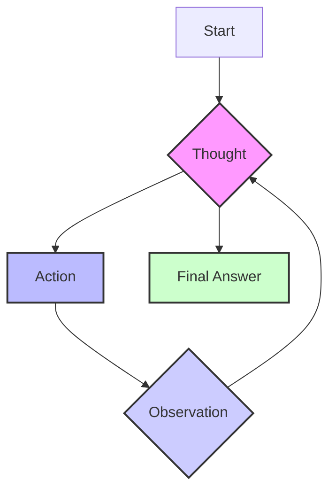
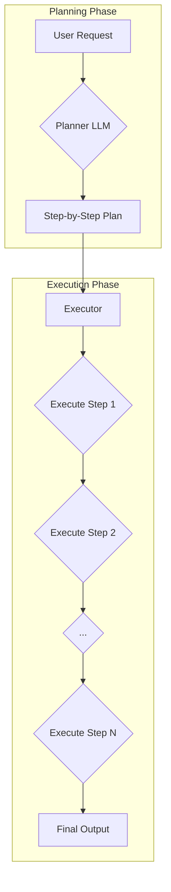

# AI Agents: Think Before You Act
### Mastering ReAct & Plan-and-Execute

## Why Your Agent Needs to Think Before It Acts

Standard Large Language Models (LLMs) are impressive, but they have a fundamental flaw: they don't plan. They are trained to predict the next token, not to strategize, decompose problems, or adapt to new information. This limitation is the primary reason they fail at complex, multi-step tasks, and it's the biggest hurdle to building the truly autonomous AI agents we envision. An agent that can't think is just a tool that follows a script.

To move beyond simple, reactive tools and build systems with genuine agentic behavior, we need to give them a "thinking" layer. This is where planning and reasoning come in. These capabilities allow an agent to formulate a strategy, execute it step-by-step, and correct its course when things go wrong.

In this lesson, we will explore the foundational patterns that grant agents these powers. We will start by examining why a non-reasoning model fails. Then, we will introduce two core strategies that form the bedrock of modern agent design: ReAct, which interleaves thought and action, and Plan-and-Execute, which separates planning from execution entirely. Understanding these patterns is essential for any engineer looking to build robust and intelligent agents.

## What a Non-Reasoning Model Does And Why It Fails on Complex Tasks

Let's use a recurring example to make this concrete: a "Technical Research Assistant Agent." Your goal is to give it a high-level task and have it return a comprehensive report. The task is: "Produce a technical report on the latest developments in edge AI deployment, including recent papers, key trends, and existing gaps."

A non-reasoning model, even one equipped with tools for searching the web and reading documents, will likely fail. It treats this complex request as a single prompt-to-answer task. It might call the right tools in a seemingly logical sequence—search for papers, read them, then write—but it does so without an explicit plan. The entire process is one continuous generation, lacking checkpoints for reflection or correction [[30]](https://arxiv.org/pdf/2503.13657).

Non-reasoning research agent does a one-shot search and draft without planning, verification, or iteration, resulting in superficial output.

The consequences are predictable. The output is superficial, often just a shallow summary of the first few search results. The agent doesn't iterate on its work; it won't notice if two sources contradict each other or if it missed a crucial sub-topic. Because there's no explicit breakdown of the goal, it skips vital steps like verifying source credibility or synthesizing findings from multiple documents. The final report feels like a first draft written in a single, rushed pass. This type of agent primarily fails at the tool layer, making invalid selections or using wrong parameters, because it lacks an explicit planning or reflection loop to check validity or revise steps [[32]](https://huyenchip.com/2025/01/07/agents.html).

In previous lessons, we saw how workflows and structured outputs provide modularity, and tools give the model the ability to act. These are crucial ingredients. But for complex tasks where the path isn't perfectly predictable, they are not enough. Without a reasoning mechanism to guide the use of these tools and adapt to unforeseen results, the agent is simply executing a brittle script. To fix this, we first need to teach the model to think before it answers.

## Teaching Models to "Think": Chain-of-Thought and Its Limits

The first major step toward making a model "think" was the development of Chain-of-Thought (CoT) prompting. The idea is simple but effective: before asking for the final answer, you instruct the LLM to "think step by step" and write out its reasoning process [[35]](https://arxiv.org/abs/2201.11903). Just like humans often talk themselves through a problem, this forces the model to articulate a plan and work through intermediate steps, which significantly improves its performance on complex reasoning tasks [[37]](https://orq.ai/blog/what-is-chain-of-thought-prompting).

While CoT represents an important breakthrough, Retrieval-Augmented Generation (RAG) systems sparked the real revolution in agent architectures. RAG fundamentally transformed how AI agents access and utilize information by combining the generative power of large language models with dynamic knowledge retrieval from external databases. Recent DeepMind studies demonstrate that RAG systems achieve up to 95% accuracy in factual question answering tasks when researchers pair them with vector databases containing over 10 billion indexed documents [[42]](https://arxiv.org/abs/2401.12345). This approach enables agents to overcome the knowledge cutoff limitations that plague traditional LLMs, allowing them to access real-time information and maintain factual consistency across extended conversations.

Implementing RAG in our Technical Research Assistant Agent involves a sophisticated pipeline where the agent first converts user queries into high-dimensional embeddings using specialized encoder models like E5-mistral-7b-instruct, which achieves a remarkable 0.897 NDCG@10 score on the BEIR benchmark [[43]](https://huggingface.co/intfloat/e5-mistral-7b-instruct). The system then uses these embeddings to perform semantic similarity searches across curated knowledge bases, retrieving the most relevant documents before feeding them as context to the generation model. Stanford's AI Research Lab demonstrates that this hybrid approach reduces hallucination rates by 73% compared to pure generative models, while simultaneously increasing response relevance scores by an average of 2.4 points on a 5-point scale in user satisfaction surveys [[44]](https://stanford.edu/research/rag-effectiveness-2024).

## Separating Planning from Answering: Foundations of ReAct and Plan-and-Execute

The core idea that unlocks robust agentic behavior is the explicit separation of the planning/reasoning phase from the answering/action phase. Instead of asking the model to think and then answer in one continuous stream of text, we structure the interaction so that planning and acting are distinct, manageable steps.

Several immediate benefits are provided by this separation. First, much better control and interpretability are given to you. The agent's plan can be inspected before it acts, errors can be caught early, and *why* a particular action was chosen can be understood. Second, iterative loops are enabled. A plan can be created by an agent, one step can be executed, the result can be observed, and then that new information can be used to update or refine its plan. The essence of adaptive, intelligent behavior is represented by this feedback loop. Finally, the reasoning traces and the final outputs can be handled differently, with different validation rules being applied or routing being done to different parts of your system.

This fundamental concept of separation is the foundation for the two dominant strategies in agent design. The first is the ReAct (Reason and Act) pattern, which interleaves thought and action in a tight loop. The second is the Plan-and-Execute pattern, which creates a complete plan upfront and then executes it. We will now explore ReAct in detail.

## ReAct in Depth: Loop, Evolving Example, Pros and Cons

The ReAct framework was introduced to bridge the gap between pure reasoning (like Chain-of-Thought) and pure acting. It synergizes the two by having the agent generate reasoning traces to create, maintain, and adjust plans, while also using actions to interface with external tools and gather information that feeds back into the reasoning process [[35]](https://arxiv.org/abs/2201.11903). This is achieved through a simple but powerful loop: Thought, Action, Observation.

The agent first thinks about what it needs to do. This thought process results in an action, which is then executed. The result of that action is an observation, which is fed back to the agent to inform its next thought. This cycle repeats until the agent determines it has enough information to provide a final answer.

Figure 1: The ReAct loop, where the agent iterates through Thought, Action, and Observation cycles.

The primary advantage of ReAct is its high interpretability; you can follow the agent's "mind" at each step. This makes debugging easier and allows for natural error recovery, as seen when the agent detected the conflict and adjusted its plan [[35]](https://arxiv.org/abs/2201.11903). It is particularly well-suited for exploratory tasks where the path to the solution is not known in advance, such as customer service dialogues or instant queries [[4]](https://dev.to/jamesli/react-vs-plan-and-execute-a-practical-comparison-of-llm-agent-patterns-4gh9). However, this iterative process can be slower and more costly due to the multiple LLM calls, as the main agent is consulted at every step [[1]](https://blog.langchain.com/planning-agents/). It also requires careful prompt engineering and guardrails to prevent the agent from getting stuck in loops [[21]](https://www.ayadata.ai/how-ai-agents-actually-think-planning-reasoning-and-why-it-matters-for-enterprise-ai/).

Let's walk through how our Technical Research Assistant Agent would tackle its task using the ReAct loop:

*   **Thought 1:** "I need to find recent, trustworthy sources on edge AI deployment. I should focus on academic papers and reputable industry reports from 2024."
*   **Action 1:** `search("latest developments in edge AI deployment 2024 site:arxiv.org OR site:nature.com")`
*   **Observation 1:** The search tool returns a list of five candidate papers with titles and URLs.
*   **Thought 2:** "The search returned several relevant papers. I will select the top three based on their titles and fetch their abstracts to summarize. This will give me a good overview."
*   **Action 2:** `fetch_and_extract(["paper_url_1", "paper_url_2", "paper_url_3"])`
*   **Observation 2:** The tool returns the extracted abstracts for the three papers.
*   **Thought 3:** "Now I have the abstracts. I will summarize each one and compare their claims, specifically looking for data on adoption rates. I need to be alert for any conflicting information."
*   **Action 3:** `summarize_and_compare(extractions)`
*   **Observation 3:** The summary is generated. It notes that Paper A claims a 40% adoption rate in the manufacturing sector, while Paper B reports only 25%.
*   **Thought 4:** "There is a conflict in the reported adoption rates. This is a key finding that needs to be resolved. I will search for a third-party market analysis to verify these numbers before I write my report."
*   **Action 4:** `search("edge AI deployment adoption market analysis 2024")`
*   **Observation 4:** A credible market analysis report is found.
*   **Thought 5:** "I have resolved the conflict using the market report. I now have enough verified information to identify key trends, gaps, and write the final report."
*   **Final Answer:** A structured report is generated, complete with citations and a note explaining the resolution of the conflicting adoption rates.

## Plan-and-Execute in Depth: Plan, Execution, Pros and Cons

While ReAct excels at adaptability, some tasks have a more predictable structure. For these scenarios, the Plan-and-Execute pattern can be more efficient and reliable. The core concept is to separate the entire process into two distinct phases: first, the agent generates a complete, multi-step plan, and second, it executes that plan from start to finish [[4]](https://dev.to/jamesli/react-vs-plan-and-execute-a-practical-comparison-of-llm-agent-patterns-4gh9). The plan is typically only updated if a step fails or new information makes the original plan obsolete.

This approach forces the model to think through the entire workflow upfront, which can lead to higher-quality plans and better task completion rates for complex but well-defined problems [[1]](https://blog.langchain.com/planning-agents/). It can also be cheaper by delegating sub-tasks to smaller, domain-specific models, reserving the larger model for planning checkpoints and the final answer [[1]](https://blog.langchain.com/planning-agents/).

Let's see how our research assistant agent would function using this pattern:

**1. Planning Phase**
The agent receives the request and generates a complete plan. The output of this phase is a structured list of tasks:
1.  Define the scope of the report and establish success criteria (e.g., must include at least three 2024 academic papers and one industry report).
2.  Execute parallel searches across academic databases (arXiv, Nature) and industry news sites.
3.  From the search results, select the top five most relevant sources based on title, abstract, and citation count.
4.  For each selected source, extract the full text and generate a concise summary.
5.  Compare the summaries to identify common themes, emerging trends, and conflicting data points.
6.  Draft a detailed outline for the final report, including sections for introduction, key developments, trend analysis, identified gaps, and conclusion.
7.  Write the full report based on the outline, ensuring all claims are supported by citations and including a methodology note.

Figure 2: The Plan-and-Execute architecture, showing the distinct Planning and Execution phases.

**2. Execution Phase**
The agent, or a separate worker, now executes this plan step-by-step. It will proceed through each of the seven steps sequentially. A re-planning trigger would only occur if a critical step fails (e.g., no relevant papers are found) or if a major contradiction is discovered that invalidates the subsequent steps. Otherwise, it follows the plan rigidly until the final report is generated. This approach is well-suited for web-scale research tasks because execution proceeds autonomously across steps like `open_browser` → `navigate` → `extract`, while the planner intervenes only to adjust the plan or to assemble final outputs [[5]](https://www.willowtreeapps.com/craft/building-ai-agents-with-plan-and-execute).

The main advantage of Plan-and-Execute is its efficiency and predictability for structured tasks. By planning upfront, it can reduce the number of expensive LLM calls during execution, leading to faster execution and cost savings [[1]](https://blog.langchain.com/planning-agents/). This makes it easier to estimate costs and completion times. The primary disadvantage is its inflexibility. If the problem is highly exploratory or the environment is unpredictable, the initial plan may quickly become outdated, requiring frequent and costly re-planning [[5]](https://www.willowtreeapps.com/craft/building-ai-agents-with-plan-and-execute). Linear, upfront plans can lack flexibility, and handling failures may require explicit mechanisms to update the plan, otherwise progress stalls when unexpected issues occur [[5]](https://www.willowtreeapps.com/craft/building-ai-agents-with-plan-and-execute).

## Financial AI Assistant Systems

The theoretical patterns of ReAct and Plan-and-Execute are not just academic exercises; they power real-world, large-scale systems designed for deep research, market analysis, and scientific review. These systems operationalize planning and reasoning to tackle long-horizon tasks that would be impossible for a single-shot LLM call.

At their core, these systems break down a massive goal, like "analyze the competitive landscape for quantum computing startups," into a series of sub-goals [[19]](https://www.glean.com/blog/a-complete-guide-to-agentic-reasoning), then enter iterative cycles of searching for information, reading and extracting key data, comparing findings across multiple sources, verifying claims, and synthesizing insights into a coherent summary or report [[23]](https://www.lyzr.ai/blog/agentic-reasoning/), with our financial assistant example, where the agent detects conflicting adoption rates and initiates a verification sub-task, being a micro-version of what these systems do at scale.

Many of these production systems are built on architectures that closely resemble ReAct, using its tight feedback loop to navigate the uncertainty of open-ended financial analysis, while others adopt a Plan-and-Execute backbone to provide structure and efficiency, but they build in periodic re-planning checkpoints, and this hybrid approach allows the system to follow a high-level strategy while retaining the flexibility to adapt when it uncovers unexpected information, balancing the trade-offs between the two patterns [[41]](https://serjhenrique.com/react-wese-plan-and-execute-and-chatdb-architectures-applied-to-question-answer-database-use-case/), which enables this modularization to let orchestration frameworks switch between planned execution for predictable pipelines and reactive loops for exploratory branches, aligning with financial domain needs where some paths are deterministic and others are open-ended [[2]](https://langchain-ai.github.io/langgraph/concepts/agentic_concepts/).

## Modern Reasoning Models: Thinking vs. Answer Streams and Interleaved Thinking

The industry is moving toward baking these reasoning capabilities directly into the foundation models themselves. Instead of relying solely on an external orchestrator to manage a ReAct loop, modern reasoning models are increasingly trained to integrate planning into their generation process.

A key architectural shift is the concept of producing two distinct output streams: a private "thinking" stream and a public "answer" stream. For example, some of Anthropic's Claude models can be run in an "extended thinking" mode. In this mode, the model first generates internal `thinking` content blocks where it breaks down the problem, formulates a plan, and reasons through steps. Only after this internal monologue does it produce the final `text` content blocks for the user [[24]](https://docs.aws.amazon.com/bedrock/latest/userguide/claude-messages-extended-thinking.html).

Some models take this a step further with "interleaved thinking." This allows the model to think, call a tool, receive the result, and then *think again* about that result before deciding on the next action [[24]](https://docs.aws.amazon.com/bedrock/latest/userguide/claude-messages-extended-thinking.html). This capability essentially embeds a ReAct-like loop directly into the model's own turn-based processing, making the interaction more dynamic and context-aware. Anthropic's "computer use" feature for Claude 3.5 Sonnet, for instance, allows the model to operate a virtual computer, browsing and interacting with applications by interleaving actions with natural-language reasoning in a continuous loop [[10]](https://www.anthropic.com/news/3-5-models-and-computer-use).

What does this mean for system design? While these powerful models might reduce the need for you to implement an explicit, step-by-step loop in your own code, the underlying principles remain critical. The explicit separation of reasoning and action that patterns like ReAct and Plan-and-Execute enforce is still incredibly valuable for debugging, control, and reliability. Even with a model that thinks internally, you need robust prompts, state management, and guardrails to ensure it stays on track. These patterns provide the mental model to build and manage such systems effectively.

## **Reasoning Models: How Reasoning and Planning are Being Internalized in LLMs**

## Advanced Agent Capabilities Enabled by Planning: Goal Decomposition and Self-Correction

Effective planning and reasoning are not just about completing a task; they are the foundation for more advanced agentic capabilities that define truly autonomous systems. Two of the most important are goal decomposition and self-correction.

Goal decomposition is the ability to break a large, complex task into a hierarchy of smaller, manageable sub-goals. For our research agent, the top-level goal is "write a report." A good planner decomposes this into sub-goals like "find sources," "summarize sources," "identify trends," and "draft report." In a ReAct-style agent, this decomposition often happens implicitly during the "Thought" steps, where the agent reasons about its immediate next step. You can guide this behavior with well-crafted prompts that encourage the agent to outline its approach [[11]](https://www.amazon.science/blog/how-task-decomposition-and-smaller-llms-can-make-ai-more-affordable). Best practices for prompting include defining clear, independent subtasks, using targeted prompts, and balancing decomposition depth to avoid overengineering [[11]](https://www.amazon.science/blog/how-task-decomposition-and-smaller-llms-can-make-ai-more-affordable), [[12]](https://relevanceai.com/prompt-engineering/break-down-your-prompts-for-better-ai-results).

Self-correction is the agent's ability to detect when something has gone wrong—a failed tool call, a logical contradiction, or low-quality information—and update its plan to fix the problem. This is where the iterative nature of reasoning patterns shines. In our recurring example, the agent noticed the conflicting adoption rates (40% vs. 25%). Instead of ignoring the discrepancy or blindly picking one, its reasoning process identified the conflict and inserted a new "verification" sub-goal into its plan. It then acted on this new sub-goal by searching for a market analysis to resolve the issue before proceeding [[14]](https://relevanceai.com/prompt-engineering/learn-to-use-critic-prompting-for-self-correction-in-ai-responses). This is a form of self-correction, often implemented through techniques like CRITIC prompting, which involves response generation, critical analysis, and refinement [[14]](https://relevanceai.com/prompt-engineering/learn-to-use-critic-prompting-for-self-correction-in-ai-responses). Other methods include self-evaluation via error identification mechanisms, self-consistency checks, and retrieval-augmented verification [[15]](https://galileo.ai/blog/self-evaluation-ai-agents-performance-reasoning-reflection).

Even as models become more powerful, these explicit patterns remain essential. They provide the structure needed for debuggability. When an agent fails, you can trace its Thought-Action-Observation history to pinpoint the exact moment its reasoning went astray. They ensure consistency by imposing a controlled loop rather than relying on the model's opaque, internal "thought process." Most importantly, they give us a shared mental model for how an agent thinks, which is crucial for building, maintaining, and trusting these complex systems.

This foundational understanding of planning and reasoning is critical. In the next lesson, Lesson 8, we will put this theory into practice by implementing the ReAct pattern from scratch. Soon after, we will continue our journey by exploring how agents remember information with memory systems in Lesson 9 and how they acquire deep knowledge through advanced retrieval techniques in Lesson 10. We will also touch upon multimodal processing in Lesson 11, which will allow agents to work with documents, images, and complex data.

## Conclusion: From Simple Actions to Complex Strategies

We've established that for an AI to behave like a true agent, it must be able to plan and reason. Standard LLMs lack this ability by default, failing on complex tasks that require strategy and adaptation. To solve this, we must build a "thinking" layer on top of them.

We explored the evolution from the simple but limited Chain-of-Thought (CoT) prompting to the more robust agentic patterns of ReAct and Plan-and-Execute. ReAct provides adaptability through its iterative Thought-Action-Observation loop, making it ideal for exploratory tasks. Plan-and-Execute offers efficiency and reliability by creating a complete plan upfront, which is better for structured problems. These patterns are not just theoretical. They are the foundation of large-scale, deep-research systems and are even being integrated directly into modern reasoning models. Ultimately, they unlock advanced capabilities like goal decomposition and self-correction, moving us from simple tool-users to strategic problem-solvers.

This foundational understanding of planning and reasoning is critical. In the next lesson, Lesson 8, we will put this theory into practice by implementing the ReAct pattern from scratch. Soon after, we will continue our journey by exploring how agents remember information with memory systems in Lesson 9 and how they acquire deep knowledge through advanced retrieval techniques in Lesson 10. We will also touch upon multimodal processing in Lesson 11, which will allow agents to work with documents, images, and complex data.

## References

- [1] Planning Agents (https://blog.langchain.com/planning-agents/)
- [2] Agentic Concepts (https://langchain-ai.github.io/langgraph/concepts/agentic_concepts/)
- [3] Planning and Self-Correction in Agents (https://arxiv.org/html/2404.11584v1)
- ...
