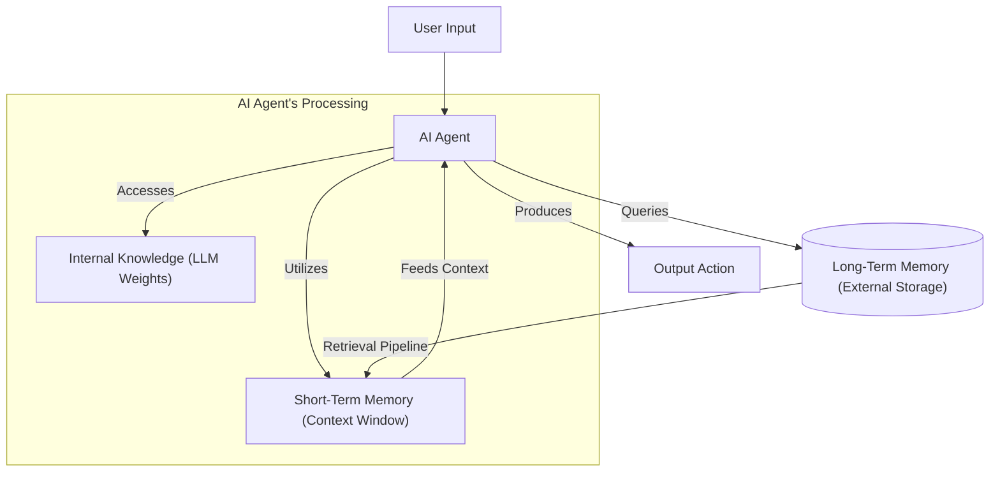
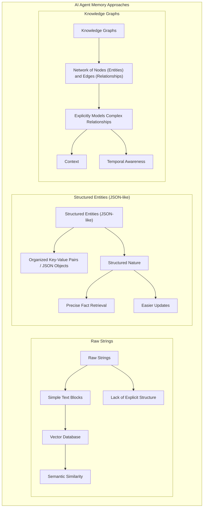

# AI Agent Memory: How to Make LLMs Learn from Experience
### From stateless chatbots to adaptive companions

I still remember the first time I tried to build a truly helpful coding assistant. I spent weeks crafting the perfect system prompts and integrating the best tools. The first conversation was magical. It helped me refactor a complex Python class and understood exactly how I liked my type hints. But the next day, disaster struck. I opened a new session to continue the work, and it was like meeting a stranger. It had forgotten my coding style. It had forgotten the project structure we discussed. It had forgotten *me*.

This experience highlights the fundamental limitation of Large Language Models (LLMs). They are like brilliant interns with amnesia. Every time you start a new session, the slate is wiped clean. This happens because LLMs are fundamentally stateless. Their "internal knowledge" is frozen at the moment of training. They cannot learn by updating their weights after deployment. This is a challenge known in the field as "continual learning".

In the previous lessons, we explored how to give LLMs the ability to act through tools and reason through planning. Now, we tackle the problem of persistence. To solve this, we rely on **Context Engineering**, which we introduced in Lesson 3. However, managing context is not just about formatting prompts. It is about deciding what information to keep. It is about how to store it. It is about when to retrieve it.

Memory solves this problem.

In the early days of building agents just two years ago, we constantly battled against small context windows. We had to build complex systems to compress conversations into tiny summaries. Today, with models like Gemini 1.5 Pro offering context windows of over a million tokens, the game has changed. Yet, simply dumping an entire database into the context window is not the solution. It introduces noise. It increases latency. It drives up costs. Furthermore, models suffer from the "lost in the middle" problem, where they struggle to retrieve information buried in the center of a massive context window.

Memory is the temporary engineering solution that bridges the gap between frozen model weights and the need for adaptive behavior. In this lesson, we will dissect the architecture of agent memory. We will look at the layers of memory. We will look at the specific types you need to implement. Finally, we will show you how to build them using tools like `mem0`. [[1]](https://www.dhiwise.com/post/the-gemini-context-window-and-its-role-in-ai-precision), [[2]](https://codingscape.com/blog/llms-with-largest-context-windows)

## The Layers of Memory: Internal, Short-Term, and Long-Term

To architect a robust system, we can borrow terminology from cognitive science to categorize how an agent handles information. We can visualize an agent's memory as three distinct layers. Each layer serves a specific function in the retrieval pipeline.

**Internal Knowledge** is the information baked into the model's weights during pre-training. This is the agent's general intelligence. It includes its understanding of language, code syntax, and world facts up to its training cutoff. It is vast but static. You cannot change it without fine-tuning. Fine-tuning is expensive and impractical for real-time learning.

**Short-Term Memory** is synonymous with the **context window**. This is the agent's "working memory" or RAM. It is the only place where the model can "learn" in real-time. When you paste a new API documentation into the chat, the model "learns" it only for the duration of that context window. It is fast and actionable. However, it is volatile and finite.

**Long-Term Memory** is an external, persistent storage system. This is the hard drive. Since the model cannot update its weights, we store new information in an external database. This includes user preferences, past conversation logs, and documents. The goal of a memory system is to retrieve relevant information from Long-Term Memory. Then, we inject it into Short-Term Memory right before the model generates a response.

This hierarchy is essential because no single layer can do it all. Internal knowledge lacks personalization. Short-term memory lacks persistence. Long-term memory lacks actionability until retrieved.


Image 1: A Mermaid diagram illustrating the hierarchy and flow of an AI agent's memory system, distinguishing between Internal Knowledge, Short-Term Memory, and Long-Term Memory, and depicting the information flow and retrieval pipeline.

By structuring memory this way, we treat the "learning" process as a retrieval problem. We are not teaching the model. We are curating its environment.

## Long-Term Memory: Semantic, Episodic, and Procedural

Just as humans use different parts of the brain to remember facts versus riding a bike, AI agents require different structures for different types of data. We categorize persistent long-term memory into three types: Semantic, Episodic, and Procedural. [[3]](https://arxiv.org/html/2309.02427), [[4]](https://langchain-ai.github.io/langgraph/concepts/memory/), [[5]](https://decodingml.substack.com/p/memory-the-secret-sauce-of-ai-agents)

### Semantic Memory (Facts & Knowledge)

Semantic memory is the agent's encyclopedia. It stores facts, concepts, and knowledge about the world or the user. This information is independent of the context in which it was learned.

For a personal assistant, semantic memory builds a **User Profile**. It stores atomic facts like `{"food_restrictions": "User is a vegetarian"}` or `{"music_taste": "User likes rock music"}`. When the user asks for a dinner recommendation, the agent doesn't need to scan months of chat logs to find this preference. It retrieves the explicit fact from its semantic store. For enterprise agents, semantic memory acts as the source of truth for proprietary data. This includes technical manuals or product catalogs.

### Episodic Memory (Experiences & History)

Episodic memory is the agent's personal diary. Unlike semantic memory, which stores timeless facts, episodic memory captures **events and experiences** anchored in time. It answers the question, "What happened, and when?"

This is useful for maintaining long-term conversational continuity. A simple semantic fact might record: `User's brother is named Mark`. However, episodic memory records the nuance: `[2025-08-25] The user expressed frustration that their brother, Mark, forgot their birthday again. I provided an empathetic response.`

If the user mentions "Mark" a week later, the agent can retrieve this episode. It can then respond with emotional intelligence. For example, it might say "I hope things are better with Mark after last week". This is better than just recalling his name. It allows the agent to understand the narrative arc of the user's life or work.

### Procedural Memory (Skills & How-To)

Procedural memory is the agent's muscle memory. It stores the "how-to" knowledge required to execute tasks. In humans, this is the unconscious ability to ride a bike. In agents, this is represented by learned workflows, scripts, or **tools**.

While tools are often hardcoded by developers, advanced agents can use procedural memory to store learned routines. For example, suppose a user frequently asks for a specific type of monthly report. The agent can save the sequence of steps as a named procedure in its memory. These steps might be: 1) Query database, 2) Summarize revenue, 3) Email output. When the request comes up again, the agent triggers this "macro" rather than reasoning through the steps from scratch. This ensures reliability and consistency for repetitive tasks. [[4]](https://langchain-ai.github.io/langgraph/concepts/memory/)

## Storing Memories: Pros and Cons of Different Approaches

Deciding *what* to store is only half the battle. You must also decide *how* to store it. The storage architecture directly impacts your agent's performance, cost, and complexity. There is no perfect solution. However, there are three common approaches we use in AI engineering. [[6]](https://www.geeksforgeeks.org/artificial-intelligence/ai-agent-memory/), [[7]](https://writer.com/engineering/vector-database-vs-graph-database/), [[8]](https://www.newsletter.swirlai.com/p/memory-in-agent-systems)

### 1. Raw Strings (Vector Databases)
The simplest method is to store raw conversation turns or document chunks as plain text and index them for vector search.

*   **Pros:** It is incredibly fast to set up. It preserves full nuance. You lose no information in translation because you are saving the raw input.
*   **Cons:** Retrieval can be imprecise. A semantic search for "Mark's job" might return every conversation where "Mark" and "job" were mentioned. This happens regardless of whether it answers the question. It also struggles with contradictions. If a user says "I'm vegan" on Monday and "I eat chicken" on Tuesday, a vector search retrieves both. It has no understanding of which is current.

### 2. Structured Entities (JSON)
Here, we use an LLM to extract unstructured text into a structured format like JSON. For example: `{"user": {"brother": {"name": "Mark", "job": "Engineer"}}}`.

*   **Pros:** This allows for precise, deterministic retrieval. You can filter exactly by field. It is also easier to update. If Mark becomes a doctor, you update the `job` field rather than appending a conflicting text log.
*   **Cons:** It requires designing a schema upfront. This can be rigid. If the user mentions something that doesn't fit your schema, the information might be discarded. For example, "Mark has a pet iguana". It also loses the emotional nuance of the original conversation.

### 3. Knowledge Graphs
This is the most advanced approach. It stores information as nodes (entities) and edges (relationships). For example: `(User)-[HAS_BROTHER]->(Mark)`.

*   **Pros:** It explicitly models complex relationships. It can handle temporal context. For example: `(User)-[WORKED_AT {end_date: 2024}]->(Company A)`. It offers high explainability and accuracy for multi-hop reasoning questions.
*   **Cons:** It has the highest engineering overhead. Constructing a graph from unstructured text is complex and costly. Graph traversals can also be slower than simple vector lookups. This potentially adds latency to the user experience. [[9]](https://neo4j.com/blog/genai/knowledge-graph-vs-vectordb-for-retrieval-augmented-generation/), [[10]](https://danielp1.substack.com/p/memex-20-memory-the-missing-piece)


Image 2: A Mermaid diagram visualizing three primary approaches for storing AI agent memories: Raw Strings, Structured Entities (JSON-like), and Knowledge Graphs, highlighting their structural characteristics and differences.

## Memory implementations with code examples

Now that we understand the theory, let's implement these memory types using `mem0`. `mem0` is an open-source library that simplifies the management of long-term memory for LLMs. It handles the vector storage and retrieval logic. This allows us to focus on the application layer. [[11]](https://arxiv.org/html/2504.19413)

In these examples, we will use the **Raw Strings** approach for simplicity. This allows us to focus on the *type* of memory rather than the database schema. We will use Google's Gemini model for embeddings and generation, and ChromaDB as our local vector store.

### Setup and Configuration

First, we configure `mem0` to use Gemini for the LLM and Embeddings, and ChromaDB for storage.

1. We import the necessary libraries and load our API keys.
    ```python
    import os
    import re
    from typing import Optional
    from google import genai
    from mem0 import Memory
    from lessons.utils import env

    env.load(required_env_vars=["GOOGLE_API_KEY"])
    
    client = genai.Client()
    MODEL_ID = "gemini-2.5-flash"
    ```

2. We define the `MEM0_CONFIG` to wire up our components.
    ```python
    MEM0_CONFIG = {
        "embedder": {
            "provider": "gemini",
            "config": {
                "model": "text-embedding-004",
                "embedding_dims": 768,
                "api_key": os.getenv("GOOGLE_API_KEY"),
            },
        },
        "vector_store": {
            "provider": "chroma",
            "config": {
                "collection_name": "lesson9_memories",
            },
        },
        "llm": {
            "provider": "gemini",
            "config": {
                "model": MODEL_ID,
                "api_key": os.getenv("GOOGLE_API_KEY"),
            },
        },
    }

    memory = Memory.from_config(MEM0_CONFIG)
    MEM_USER_ID = "lesson9_notebook_student"
    ```

3. We create helper functions to wrap the `mem0` functionality. Note that we use metadata to tag memories by category (`semantic`, `episodic`, `procedure`). This allows us to filter them later.
    ```python
    def mem_add_text(text: str, category: str = "semantic", **meta) -> str:
        """Add a single text memory. No LLM is used for extraction or summarization."""
        metadata = {"category": category}
        for k, v in meta.items():
            if isinstance(v, (str, int, float, bool)) or v is None:
                metadata[k] = v
            else:
                metadata[k] = str(v)
        memory.add(text, user_id=MEM_USER_ID, metadata=metadata, infer=False)
        return f"Saved {category} memory."

    def mem_search(query: str, limit: int = 5, category: Optional[str] = None) -> list[dict]:
        """Category-aware search wrapper."""
        res = memory.search(query, user_id=MEM_USER_ID, limit=limit) or {}
        items = res.get("results", [])
        if category is not None:
            items = [r for r in items if (r.get("metadata") or {}).get("category") == category]
        return items
    ```

### Implementing Semantic Memory

Semantic memory consists of atomic facts. In a production system, you would use an extraction pipeline to parse conversation logs into these facts. Before we look at the code, it is important to understand *how* the LLM extracts this information. We use a specific prompt to instruct the model to act as a knowledge extractor.

Here is an example of what that extraction prompt looks like:
```text
Extract persistent facts and strong preferences as short bullet points.
- Keep each fact atomic and context-independent. While reading the messages, make sure to notice the nuance or sublte details that might be important when saving these facts.
- 3–6 bullets max.

Text:
{My brother Mark is a software engineer, but his real passion is painting, he gifted me a painting a few years ago. Its really beautiful.}
```

The system would then output facts like: `Mark is the user's brother`, `Mark is a software engineer`, and `Mark's real passion is painting`.

Now, let's simulate this by adding facts directly to our memory store.

1. We add specific facts about the user to the memory store.
    ```python
    facts: list[str] = [
        "User prefers vegetarian meals.",
        "User has a dog named George.",
        "User is allergic to gluten.",
        "User's brother is named Mark and is a software engineer.",
    ]
    for f in facts:
        print(mem_add_text(f, category="semantic"))
    ```

2. We search for information using a natural language query. Notice how the query "brother job" retrieves the relevant fact about Mark.
    ```python
    print("\nSearch --> 'brother job':")
    print("\n".join(f"- {m}" for m in mem_search("brother job", limit=3)))
    ```
    It outputs:
    ```text
    Search --> 'brother job':
    - {'id': '...', 'memory': "User's brother is named Mark and is a software engineer.", ...}
    ```

### Implementing Episodic Memory

For episodic memory, we want to capture a sequence of events. We can take a raw conversation, summarize it into an "episode" using an LLM, and store that summary.

1. We define a conversation history and use the LLM to compress it into a concise summary.
    ```python
    dialogue = [
        {"role": "user", "content": "I'm stressed about my project deadline on Friday."},
        {"role": "assistant", "content": "I’m here to help—what’s the blocker?"},
        {"role": "user", "content": "Mainly testing. I also prefer working at night."},
        {"role": "assistant", "content": "Okay, we can split testing into two sessions."},
    ]

    episodic_prompt = f"""Summarize the following 3–4 turns as one concise 'episode' (1–2 sentences).
    Keep salient details and tone.
    {dialogue}
    """
    summary_resp = client.models.generate_content(model=MODEL_ID, contents=episodic_prompt)
    episode = summary_resp.text.strip()
    ```

2. We store this summary with the `episodic` category.
    ```python
    print(
        mem_add_text(
            episode,
            category="episodic",
            summarized=True,
            turns=4,
        )
    )
    ```
    It outputs:
    ```text
    Saved episodic memory.
    ```

3. We can now retrieve this "memory" based on the experience, not just keywords.
    ```python
    print("\nSearch --> 'deadline stress'")
    hits = mem_search("deadline stress", limit=3, category="episodic")
    for h in hits:
        print(f"- [created_at={h.get('created_at')}] {h['memory']}")
    ```
    It outputs:
    ```text
    Search --> 'deadline stress'
    - [created_at=...] Stressed about a looming Friday project deadline, the user identified testing as their main blocker...
    ```

### Implementing Procedural Memory

Procedural memory stores "how-to" guides. Advanced agents can learn these procedures dynamically from user interactions. To do this, we use a prompt that instructs the agent to convert a user's numbered list of steps into a reusable procedure.

Here is an example of the prompt used to create procedural memory:
```text
You are an agent that can learn new skills. When a user provides a numbered list of steps to accomplish a goal, your task is to run the "learn_procedure" tool, and convert these numbered list of steps into a reusable procedure. Identify the core actions and any variable parameters (e.g., dates, locations, names).

Examples:
User Input: "I want you to book a cabin for this summer. To do that, please remember to: 1. Search for cabins on CabinRentals.com my favorite website. 2. Filter for locations in the mountains, the closer to them, the better. 3. Make sure it's available around July. 4 to 8th. 5. Send me the top 3 options."

learn_procedure(name="find_summer_cabin", steps=first search for cabins on CabinRentals.com, then filter for locations in the mountains, check for distance to the mountains, then check availability around what the user wants, if the user hasn't specified a date, ask the user for a date, once you have a list of options, send the top 3 options)
```

In our code, we will simulate this learning process by manually formatting a procedure and storing it under the `procedure` category.

1. We define a helper to format and store a procedure.
    ```python
    def learn_procedure(name: str, steps: list[str]) -> str:
        body = "Procedure: " + name + "\nSteps:\n" + "\n".join(f"{i + 1}. {s}" for i, s in enumerate(steps))
        return mem_add_text(body, category="procedure", procedure_name=name)
    ```

2. We teach the agent a "monthly_report" skill.
    ```python
    print(
        learn_procedure(
            "monthly_report",
            [
                "Query sales DB for the last 30 days.",
                "Summarize top 5 insights.",
                "Ask user whether to email or display.",
            ],
        )
    )
    ```

3. When we need to "run" this procedure, we search for it by name and extract the steps.
    ```python
    def find_procedure(name: str) -> dict | None:
        hits = mem_search(name, limit=10, category="procedure")
        for h in hits:
            if (h.get("metadata") or {}).get("procedure_name") == name:
                return h
        return hits[0] if hits else None

    print("\nRetrieve and 'run' it:")
    proc = find_procedure("monthly_report")
    print(proc or "Not found.")
    ```
    It outputs:
    ```text
    Retrieve and 'run' it:
    {'id': '...', 'memory': 'Procedure: monthly_report\nSteps:\n1. Query sales DB...', ...}
    ```

## Real-World Lessons: Challenges and Best Practices

Moving from a notebook to production requires navigating complex trade-offs. Here are the lessons learned from building memory systems in the real world.

### Re-evaluating Compression

The most significant shift in memory architecture is the move away from aggressive compression. In the era of GPT-4's initial release, tokens were scarce and expensive. We engineered elaborate pipelines to summarize conversations into tiny, dense facts to fit them into context.

Today, with models like Gemini 1.5 Pro offering massive context windows at lower costs, this constraint has relaxed. The new best practice is to preserve **raw detail**. Summarization is lossy. It strips away the emotional subtext and subtle hesitations that make an agent feel "human". While a summarized fact might say "User likes dogs," the raw log reveals "User mentioned that walking their dog George is the only thing keeping them sane this week". That nuance is gold for a personalized agent. Use summarization for indexing and search. However, treat the raw log as your source of truth. [[1]](https://www.dhiwise.com/post/the-gemini-context-window-and-its-role-in-ai-precision), [[12]](https://cloud.google.com/vertex-ai/generative-ai/docs/models/gemini/2-5-pro)

### Designing for the Product

Avoid the trap of over-engineering. Just because you *can* build a complex system with Semantic, Episodic, and Procedural memory doesn't mean you *should*. Start from your product's core needs.

If you are building a Q&A bot for internal documentation, you likely only need **Semantic Memory** (a standard RAG pipeline). If you are building a therapeutic companion, **Episodic Memory** is critical to track the user's emotional journey over time. If you are building a coding agent, **Procedural Memory** allows it to learn and reuse debugging strategies. Let the product dictate the architecture. Do not let the architecture dictate the product. [[13]](https://www.speakeasy.com/mcp/ai-agents/architecture-patterns)

### The Human Factor

A common anti-pattern is exposing the memory management UI to the user. We have seen apps that let users "view and edit" their memory graph. While this seems transparent, it creates **cognitive overhead**. Users want to talk to an assistant. They do not want to manage a database.

Memory management should be autonomous. The agent should detect corrections naturally. For example, if the user says "Actually, my brother's name is Mark, not Mike", the agent should update its own memory in the background. If the user has to garden the agent's memory to make it useful, the agent has failed. [[14]](https://blog.savantly.net/intelligent-memory-management-for-ai-agents/)

## Conclusion

Memory is what transforms an AI from a transactional tool into an adaptive partner. By implementing layers of Semantic, Episodic, and Procedural memory, we can build agents that not only answer questions but understand the context, history, and preferences of the user.

While memory tools like `mem0` and vector databases provide a powerful workaround for the stateless nature of LLMs, they are still just that—a workaround. We are simulating "learning" by curating context.

In the next lesson, we will explore **Retrieval-Augmented Generation (RAG)** in detail. We will move beyond simple memory lookups to building complex knowledge retrieval pipelines. We will also touch on how to handle **Multimodal** data, ensuring your agent can remember images and documents as well as text.

## References

1. The Gemini context window and its role in AI precision. (2024, February 21). DhiWise.  https://www.dhiwise.com/post/the-gemini-context-window-and-its-role-in-ai-precision 

2. LLMs with Largest Context Windows. (2024, May 15). CodingScape.  https://codingscape.com/blog/llms-with-largest-context-windows 

3. Sumers, T. R., Yao, S., Narasimhan, K., & Griffiths, T. L. (2023). Cognitive Architectures for Language Agents. *arXiv preprint arXiv:2309.02427*.  https://arxiv.org/html/2309.02427 

4. Memory. (n.d.). LangChain.  https://langchain-ai.github.io/langgraph/concepts/memory/ 

5. Iusztin, P. (2024, May 28). Memory: The secret sauce of AI agents. Decoding AI Magazine.  https://decodingml.substack.com/p/memory-the-secret-sauce-of-ai-agents 

6. AI Agent Memory. (2024, July 22). GeeksforGeeks.  https://www.geeksforgeeks.org/artificial-intelligence/ai-agent-memory/ 

7. Vector database vs. graph database. (2023, October 24). Writer.  https://writer.com/engineering/vector-database-vs-graph-database/ 

8. Gricius, A. (2024, May 19). Memory in Agent Systems. Swirl AI.  https://www.newsletter.swirlai.com/p/memory-in-agent-systems 

9. Knowledge Graph vs. Vector Database for Retrieval-Augmented Generation. (2024, June 6). Neo4j.  https://neo4j.com/blog/genai/knowledge-graph-vs-vectordb-for-retrieval-augmented-generation/ 

10. P, D. (2024, May 20). Memex 2.0: Memory The Missing Piece for Real Intelligence. Substack.  https://danielp1.substack.com/p/memex-20-memory-the-missing-piece 

11. Mem0: Building Production-Ready AI Agents with Scalable Long-Term Memory. (2025, April 29). arXiv.  https://arxiv.org/html/2504.19413 

12. Gemini 2.5 Pro. (n.d.). Google Cloud.  https://cloud.google.com/vertex-ai/generative-ai/docs/models/gemini/2-5-pro 

13. AI Agent Architecture Patterns. (n.d.). Speakeasy.  https://www.speakeasy.com/mcp/ai-agents/architecture-patterns 

14. Intelligent Memory Management for AI Agents. (2024, June 12). Savantly.  https://blog.savantly.net/intelligent-memory-management-for-ai-agents/ 

15. What is the perfect memory architecture?. (2024, June 26). YouTube.  https://www.youtube.com/watch?v=7AmhgMAJIT4&list=PLDV8PPvY5K8VlygSJcp3__mhToZMBoiwX&index=112 

---

## Images

If not otherwise stated, all images are created by the author.