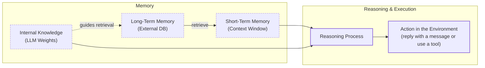

# Lesson 10: Memory for Agents

We’ve already explored many of the core components for building agents, from structured outputs, tool use, to orchestrating patterns like ReAct. But one critical piece is still missing. LLMs are immensely knowledgeable, yet their knowledge is frozen at the moment of training. Unlike humans, who refine their understanding through “continual learning” [[23]](https://www.nature.com/articles/s42256-022-00568-3), an LLM cannot learn from experience. It’s like working with an intern who has amnesia: capable of solving complex problems but unable to remember yesterday’s conversations. Tell such a system that you’re vegetarian and lactose-intolerant, and in the next session, it might eagerly suggest chicken alfredo for dinner.

To create agents that feel adaptive and genuinely personal, we need to engineer around this fundamental limitation. OpenAI has approached the problem in ChatGPT with an opt-in *Memory* feature, where small, user-approved details, like preferences, can persist across chats, and users remain in control, with options to review, edit, or delete that memory entirely  [[24](https://openai.com/index/memory-and-new-controls-for-chatgpt/),[25](https://help.openai.com/en/articles/8590148-memory-faq)].

The most immediate tool at our disposal is the *context window*, which functions as a form of working memory. By re-feeding past interactions, we can create an illusion of continuity. But this approach alone doesn’t scale. The context window is finite, expensive to fill, and prone to noise: LLMs often miss details buried in the middle of long inputs [[1]](https://www.meibel.ai/post/understanding-the-impact-of-increasing-llm-context-windows).

Engineering practices around memory have shifted with model capabilities. When context windows were capped at 8,000–16,000 tokens, developers were forced to aggressively compress and summarize information just to keep systems functional. Early attempts at personal AI companions quickly hit these walls, leading to elaborate external memory architectures built on summarization and extraction. Today, models with million-token windows reduce the pressure on compression but introduce a new challenge: filtering intelligently so that only the most relevant parts of a vast history are kept in play [[2]](https://storage.googleapis.com/deepmind-media/gemini/gemini_v2_5_report.pdf).

Even with these expanded capacities, the need for *persistent* memory remains. Long-term, external memory systems provide the stateful layer that allows agents to simulate learning, adapt over time, and sidestep the LLM’s core limitation: its inability to update its own weights once trained.

We can draw on biology and cognitive science to understand how memory works in humans and apply this knowledge to agents. Let’s see how the relationship between the two works in practice.

## The Layers of Memory: Internal, Short-Term, and Long-Term

Think of an agent's memory as having three distinct layers [[3]](https://connectai.blog/agents-memory), [[4]](https://www.marktechpost.com/2025/03/30/understanding-ai-agent-memory-building-blocks-for-intelligent-systems/).

**Internal Knowledge** refers to the static, pre-trained information embedded in the LLM’s weights. This gives the model a broad, general understanding of the world: facts, reasoning patterns, and language structure. However, it is strictly read-only. Without fine-tuning, we cannot add new, user-specific information. This immutability is a major limitation: the model cannot update its weights based on new experiences [[5]](https://www.ibm.com/think/topics/ai-agent-memory).

**Short-Term Memory** is the agent's active working memory within the LLM's context window. While volatile and limited, it is the only space where information becomes actionable. To enable the LLM to reason about data, we must load it into this short-term context [[5]](https://www.ibm.com/think/topics/ai-agent-memory).

**Long-Term Memory** is an external, persistent storage system, like a database, where the agent saves information across conversations. We store user preferences, past interactions, and learned skills, giving the agent continuity and a sense of history [[6]](https://decodingml.substack.com/p/memory-the-secret-sauce-of-ai-agents).

The real value comes from the dynamic interplay between these layers. We pull information from Long-Term Memory into Short-Term Memory for relevant context. This retrieval process, which is fundamentally a form of Retrieval Augmented Generation (RAG), is core to making an agent context-aware and intelligent. Internal knowledge provides general intelligence, short-term memory handles immediate tasks, and long-term memory offers context and personalization. No single layer performs all three functions effectively.



## Long-Term Memory: Semantic, Episodic, and Procedural

Building a truly capable agent requires more specificity about what we store in its long-term memory. As stated earlier, we can borrow from cognitive science to categorize long-term memory into three distinct types: semantic, episodic, and procedural. Each type serves a different purpose.

### Semantic Memory (Facts & Knowledge)

Semantic memory is the agent's personal encyclopedia. It serves as a repository for discrete, timeless facts about the world, specific domains, or, most importantly, the user. This is where the agent stores extracted concepts and relationships, such as user preferences or key entities. These facts can be individual, independent statements like "User is a vegetarian" or "User has a dog named George". Alternatively, they can be attached to an entity, such as a person, place, or object, like `{"food restrictions": "User is a vegetarian"}`. What you decide to store and how you structure this memory depends heavily on the agent's specific use case.

The primary role of semantic memory is to provide the agent with a reliable source of truth. For an enterprise agent, this might involve storing internal company documents, technical manuals, or an entire product catalog, allowing it to answer questions on proprietary topics such as "Google's revenue in 2025 was X" or "the approved procedure for handling customer support escalations." For a personal assistant, semantic memory forms the basis of a user profile, recalling specific information like preferences, relationships, or hard constraints. This structured knowledge within semantic memory is critical for effective RAG, enabling the agent to retrieve relevant information and provide personalized and accurate responses without sifting through noisy conversation histories.

### Episodic Memory (Experiences & History)

Episodic memory is the agent's personal diary. It functions as a chronological log of its experiences, specifically the interactions it has had with a user, answering what happened and when. Unlike the timeless facts in semantic memory, episodic memories focus on "what happened and when," adding an important element of *time* to the stored information. For instance, instead of merely knowing a user is frustrated with their brother, an episodic memory might record: "On Tuesday, the user expressed frustration that their brother, Mark, always forgets their birthday, and I provided an empathetic response."

This temporal context allows the agent to recall past events, understand the narrative of a relationship, and interact with more nuance and empathy. For example, an agent could say, "As you expressed last week, I know the topic of your brother's birthday can be sensitive..." if the subject arises again. 

With the time element, the agent can also answer questions like "What did we talk about on June 8th?" Depending on the use case, these episodic memories can group important events, facts, or insights that occurred over a day, a single conversation, or a week. These are all design choices you will make when building your own memory system. There is no one-size-fits-all solution; the optimal time scale depends on the product's needs.

### Procedural Memory (Skills & How-To)

Procedural memory is the agent's muscle memory, the collection of skills, workflows, and routines it knows how to execute. This "how-to" knowledge dictates its ability to perform multi-step tasks. It is often formalized and encoded within the agent's architecture, whether through explicit functions or tools written in languages like Python, Rust, or JavaScript, predefined configuration files, or structured prompt templates that guide specific multi-turn interactions. Advanced agent designs can even learn and extract new procedures dynamically from user instructions or successful task completions, effectively 'remembering' how to perform a sequence of actions for future use. For example, an agent might have a stored procedure called MonthlyReportIntent. When a user requests a monthly update, the agent does not need to reason from scratch. Instead, it retrieves and executes the stored procedure, which defines a clear series of steps: 1) Query the sales database for the last 30 days, 2) Summarize the key findings, and 3) Ask the user for their preferred output format.

This makes the agent's behavior on common, multi-step tasks highly reliable, efficient, and consistent. By encoding successful workflows, procedural memory allows an agent to improve its task completion efficiency over time, reducing errors and ensuring complex jobs are executed consistently every time.

Now that we have an idea of what to save and the attributes of specific “types” of memories, let’s understand how they can be saved or stored. 

## Storing Memories: Pros and Cons of Different Approaches

How an agent stores its memories is an important architectural decision. This choice impacts performance, complexity, and the ability to scale your product. No single solution fits all needs. The ideal approach depends entirely on your product's use case. Let's explore the trade-offs of three primary methods: storing memories as raw strings, as structured entities like JSON, and within a knowledge graph. As we compare them, keep in mind that real user data is *alive*: people correct themselves, change jobs, move, and adopt new habits. This creates a recurring need to update previously saved memories and resolve conflicts (old vs. new). Some memory systems, like ChatGPT’s, choose not to handle this aspect.

In practice, most “memory for agents” tools can address this by asking an LLM to propose memory operations (`ADD`, `UPDATE`, `DELETE`, or `NONE`)  on top of whatever storage you choose. The library then applies those operations and reindexes the underlying storage. This LLM-supervised approach can save significant engineering time by automating complex merge logic. However, relying solely on an LLM for memory management requires guardrails to ensure accuracy and consistency. These might include schema validation for structured memories, using low LLM temperature settings for deterministic outputs, applying recency rules to resolve conflicts, and incorporating human review for critical applications.

### Storing Memories As Raw Strings (Plain Text)

This simple method stores conversational turns or documents as plain text. We typically index them in a vector database for semantic search. 

(Side note: Refer to the previous lesson for details on retrieval and vector search)

- **Pros:** This method is easy and fast to implement, requiring little engineering effort. It preserves the full nuance of the original interaction, including emotional tone and subtle linguistic cues that structured formats might lose [[7]](https://www.geeksforgeeks.org/artificial-intelligence/ai-agent-memory/), [[8]](https://dev.to/foxgem/ai-agent-memory-a-comparative-analysis-of-langgraph-crewai-and-autogen-31dp). It’s also flexible; there is no schema to design up front.
- **Cons:** Retrieval can be imprecise (semantic matches that are contextually similar but factually off).Over time, the index can bloat as conversations grow, increasing storage, token costs, and introducing “noisy/useless” information. Updating the memory is also not trivial unless you build explicit deduplication, conflict-resolution, and timestamping to handle contradictory strings that linger (e.g., old job titles) [[9]](https://diamantai.substack.com/p/memory-optimization-strategies-in). You’ll also need explicit recency/validity scoring to prefer fresher statements and authoritative sources. As mentioned above, a commonly used merging solution is to let an LLM decide which memories to `ADD/UPDATE/DELETE/NONE`.

### Storing Memories as Entities (JSON-like Structures)

This approach shifts from unstructured text to structured data. We often use an LLM to extract information and store it in a format like JSON.

- **Pros:** We organize information into key-value pairs (e.g., `"brother": {"job": "Software Engineer"}`), which allows for precise, field-level queries and easy updates. This method is well-suited for managing semantic memory, such as user profiles and preferences [[10]](https://www.arxiv.org/pdf/2506.06326). It enables targeted upserts (edit just one field) and cleaner filtering/ranking via metadata.
- **Cons:** This method requires more upfront engineering to design a data schema. A rigid schema might fail to capture information that does not fit its structure. If you let an LLM create fields/entities on the fly, you risk schema drift and duplicates without a good entity resolution step. Furthermore, managing schema updates can be extremely challenging, requiring careful migration strategies and maintenance as the agent's needs or the data structure evolve. The extraction process can also strip away the rich nuance of the original conversation. For example, a structured fact like `{"best_part_of_day": "petting_cat"}`. It is easy to query and update, but it still lacks nuance compared to the original: “Petting my cat is the best part of my day.” The structured form encodes the ‘what’ but sheds tone, intensity, and surrounding context.

### Storing Memories in a Knowledge Graph

A knowledge graph offers the most advanced approach. It structures memories as a network of nodes (entities) and edges (relationships).

- **Pros:** Its core strength lies in explicitly representing complex relationships (e.g., `(User) -> [HAS_BROTHER] -> (Mark)`). This allows for complex, context-aware queries that simple vector search cannot handle. It also allows you to audit the agent's reasoning, as you can trace the exact path that led to an answer [[11]](https://writer.com/engineering/vector-database-vs-graph-database/), [[12]](https://neo4j.com/blog/genai/knowledge-graph-vs-vectordb-for-retrieval-augmented-generation/). Knowledge graphs can also model context and time as explicit properties of a relationship (e.g., `User -[RECOMMENDED_ON_DATE: "2025-10-25"]-> Restaurant`), providing more accurate and grounded retrieval than vector search alone [[12]](https://neo4j.com/blog/genai/knowledge-graph-vs-vectordb-for-retrieval-augmented-generation/).
- **Cons:** This approach introduces the highest complexity and cost. It requires substantial investment in data modeling, schema design, and maintenance. For many simpler use cases, a graph database adds unnecessary overhead [[13]](https://www.useparagon.com/blog/vector-database-vs-knowledge-graphs-for-rag), [[14]](https://www.elastic.co/blog/vector-database-vs-graph-database/). Also, graph traversals for complex queries can be slower than a simple vector lookup, which might impact real-time performance if not carefully optimized [[13]](https://www.useparagon.com/blog/vector-database-vs-knowledge-graphs-for-rag). Furthermore, if edges or nodes are LLM-generated, there's a risk of noisy or incorrect links accumulating without proper moderation, which means careful design is crucial to maintain graph integrity.

<aside>
💡

**Tip:** Let your product's core needs guide your choice of memory storage. Start with the simplest architecture that delivers value, and evolve it as your agent's demands grow more complex.

</aside>

| Approach | Structure Level | Relationality | Pros | Cons | Good For |
| --- | --- | --- | --- | --- | --- |
| Raw Strings | Low | Low | Simple; 
Preserves nuance;
no schema work | Imprecise; 
Hard updates without dedupe/conflict/recency logic | Quick notes, logs, prototypes, documentation |
| Structured Entities (JSON) | Medium | Limited (keys/IDs) | Structured; 
easy field updates; clean filters/metadata | Loses nuance; 
Schema design/drift; entity resolution; | Forms, user profiles, settings |
| Knowledge Graph | High | High (explicit edges) | Rich relationships; Context-aware; auditable paths | High complexity; Slower queries | Complex domains, cross-entity queries, personalization |

Table 1: A comparison of the three primary approaches to storing agent memories, we highlight the trade-offs between simplicity, structure, and relational complexity.

## Memory Implementations With Code Examples

Now that we’ve presented the types of memories and how they can be stored, let's look at some practical code examples. We use `mem0` locally, an open-source library designed to help manage agent memory. 

We use the simple "raw strings" storage approach for these examples to focus on the distinct creation process for each memory category. The focus is on seeing the interface/methods we use to interact with a memory system. 

<aside>
💡

You can experiment with the code of this lesson with this [Colab](https://github.com/louisfb01/agent-course-notebooks/blob/main/notebooks/lesson_10_notebook.ipynb).

Alternatively, you can find the code of this lesson in the notebook of lesson 10, in the GitHub repository of the course.

</aside>

In the snippets below, we directly use two helper functions, `mem_add_text` and `mem_search`, which wrap the core `memory.add` and `memory.search` methods provided by `mem0`. In an agentic application, you would expose these helpers as tools, allowing the agent to autonomously write to and read from its memory during a conversation. (see [Lesson 6: Tools](https://academy.towardsai.net/courses/take/agent-engineering/multimedia/67961180-lesson-6-tools) for defining tools, and [Lesson 8: ReAct Practice](https://academy.towardsai.net/courses/take/agent-engineering/multimedia/68166281-lesson-8-react-practice) for wiring them into the loop).

### Setup

First, let's set up the configuration for `mem0`'s `Memory`. It provides a unified interface for adding and searching memories, handling the underlying embedding models and vector stores for you. We configure it to use Google's Gemini for both embeddings and LLM tasks, with a local ChromaDB instance for vector embedding storage.

```python
from mem0 import Memory
import os

# Configuration for mem0
MEM0_CONFIG = {
    # Use Google's text-embedding-004 (768-dim) for embeddings
    "embedder": {
        "provider": "gemini",
        "config": {
            "model": "text-embedding-004",
            "embedding_dims": 768,
            "api_key": os.getenv("GOOGLE_API_KEY"),
        },
    },
    # Use ChromaDB as a local, in-notebook vector store (ephemeral, in-memory)
    "vector_store": {
        "provider": "chroma",
        "config": {
            "collection_name": "lesson9_memories",
        },
    },
    "llm": {
        "provider": "gemini",
        "config": {
            "model": "gemini-2.5-flash",
            "api_key": os.getenv("GOOGLE_API_KEY"),
        },
    },
}

memory = Memory.from_config(MEM0_CONFIG)
MEM_USER_ID = "lesson9_notebook_student"
memory.delete_all(user_id=MEM_USER_ID)
print("✅ Mem0 ready (Gemini embeddings + in-memory Chroma).")
```

It outputs:

```
✅ Mem0 ready (Gemini embeddings + in-memory Chroma).
```

And our two helper functions:

`mem_add_text` wraps around `memory.add()`. It saves a string to memory with a specific category tag (e.g., "semantic") in the metadata. It also handles any extra metadata you might provide, making sure all values are simple types like strings or numbers as required by mem0.

`mem_search` is a wrapper around `memory.search()` method. It first performs a general search and then filters the results to return only the memories that match the specified category tag in their metadata.

```python
def mem_add_text(text: str, category: str = "semantic", **meta) -> str:
    """Add a single text memory. No LLM is used for extraction or summarization."""
    metadata = {"category": category}
    for k, v in meta.items():
        if isinstance(v, (str, int, float, bool)) or v is None:
            metadata[k] = v
        else:
            metadata[k] = str(v)
    memory.add(text, user_id=MEM_USER_ID, metadata=metadata, infer=False)
    return f"Saved {category} memory."

def mem_search(query: str, limit: int = 5, category: Optional[str] = None) -> list[dict]:
    """
    Category-aware search wrapper.
    Returns the full result dicts so we can inspect metadata.
    """
    res = memory.search(query, user_id=MEM_USER_ID, limit=limit) or {}

    items = res.get("results", [])
    if category is not None:
        items = [r for r in items if (r.get("metadata") or {}).get("category") == category]
    return items
```

### Semantic Memory: Extracting Facts

Semantic memory stores discrete, timeless facts. An LLM can process unstructured text and extract these atomic pieces of information, turning conversational data into a structured knowledge base.

Here's how we add a list of facts using our `mem_add_text` helper. We will also attach metadata to each fact, for example, a `category` key with a value. Rich metadata makes it easier to filter and retrieve specific memories during search, if needed.

```python
facts = [
    "User prefers vegetarian meals.",
    "User has a dog named George.",
    "User is allergic to gluten.",
    "User's brother is named Mark and is a software engineer.",
]
for f in facts:
    mem_add_text(f, category="semantic")

print(f"Added {len(facts)} semantic memories.")
```

It outputs:

```
Saved semantic memory.
Saved semantic memory.
Saved semantic memory.
Saved semantic memory.
Added 4 semantic memories.
```

Then we search with a natural query (e.g., “brother job”) and see the relevant fact returned. We also specify the same `user_id` that was used to save memory. 

```python
# Search for a specific fact
# We print the memory string
# We print the whole dict that contains the memory

results = memory.search("brother job", user_id=MEM_USER_ID, limit=1)
print(results['results'][0]['memory'])
print(results['results'][0])
```

It outputs:

```
User's brother is named Mark and is a software engineer.

{'id': '85263670-9486-4be5-8408-9ee0c6eca3ec', 'memory': "User's brother is named Mark and is a software engineer.", 'hash': '9a01dbd8ea8b96f8ed9c84e9dcdb55a1', 'metadata': {'category': 'semantic'}, 'score': 0.9269160032272339, 'created_at': '2025-08-28T14:13:16.726448-07:00', 'updated_at': None, 'user_id': 'lesson9_notebook_student', 'role': 'user'}
```

When retrieving a memory with `mem0.search` semantic search is used in the background. This tries to find the most contextually relevant memory. For example, a query like *"brother job"* will find the stored memory *"User's brother is named Mark and is a software engineer"* because of their semantic similarity. You can see the semantic similarity score for this memory at `0.926`. 

### Episodic Memory: The Log of Events

Episodic memory functions as a chronological log. We create it by summarizing interactions over a period, like a day or a single conversation, and storing the summary with a timestamp. This captures the "what" and "when" of an interaction. These memories can be stored as a raw list of conversation messages or as summaries extracted by an LLM. The extraction prompt should be able to correctly guide the model in detecting key insights, facts, or events, which are then saved with a timestamp.

Let's take a short dialogue and create an episodic memory from it. In the following cell, we add an explicit step, asking an LLM to summarize it and then store it.

```python
dialogue = [
    {"role": "user", "content": "I'm stressed about my project deadline on Friday."},
    {"role": "assistant", "content": "I’m here to help—what’s the blocker?"},
    {"role": "user", "content": "Mainly testing. I also prefer working at night."},
    {"role": "assistant", "content": "Okay, we can split testing into two sessions."},
]

# Ask the LLM to write a clear episodic summary.
episodic_prompt = f"""Summarize the following 3–4 turns as one concise 'episode' (1–2 sentences).
Keep salient details and tone.

{dialogue}
"""
episode_summary = client.models.generate_content(model=MODEL_ID, contents=episodic_prompt)
episode = episode_summary.text.strip()
print(episode)
```

It outputs:

```
Stressed about a project deadline due to a testing bottleneck, the user mentions their preference for night work, prompting the assistant to suggest splitting the testing into two sessions.
```

Now, we can insert the generated summary into our memory database and search for it. We can also add additional metadata to make it easier to filter for specific memories. The metadata dictionary will contain values for `category`, `summarized` and `turns`.

```python
print(
    mem_add_text(
        episode,
        category="episodic",
        summarized=True,
        turns=4, 
    )
)
```

It outputs: 

```python
Saved episodic memory.
```

Let’s search for “deadline stress” and filter the results with `category="episodic"`.

```python
print("\nSearch --> 'deadline stress'\n")
hits = mem_search("deadline stress", limit=1, category="episodic")
for h in hits:
    print(f"{h['memory']}\n")
    print(h)
```

It outputs:

```
Search --> 'deadline stress'

A user, stressed about a project deadline, identifies testing as the main blocker, so the assistant suggests splitting the task into two manageable sessions.

{'id': 'e5227b1f-4f95-4c3f-8b23-8e483e765007', 'memory': 'A user, stressed about a project deadline, identifies testing as the main blocker, so the assistant suggests splitting the task into two manageable sessions.', 'hash': '716bba113c81e0c83638371e6ca97963', 'metadata': {'category': 'episodic', 'turns': 4, 'summarized': True}, 'score': 0.9457621574401855, 'created_at': '2025-08-28T14:39:37.647155-07:00', 'updated_at': None, 'user_id': 'lesson10_notebook_student', 'role': 'user'}
```

We can see the metadata values we added for `category`, `summarized` and `turns`. Notice how `mem0` adds a `created_at` timestamp for each added memory. That timestamp let us add simple recency controls, answer date-specific questions like “What did we talk about yesterday?” or run a normal semantic search and then re-rank the hits by freshness.

### Procedural Memory: Defining and Learning Skills

We create procedural memory in two ways: a developer defines it, or an agent learns it from user instructions. A developer can explicitly code a tool or function, like `book_flight()`, that an agent can trigger during a conversation. More advanced agents can learn new procedures dynamically from user interactions. When a user provides explicit steps for a task, the agent can save this sequence as a new, callable procedure for future use.

Let's teach our agent a procedure called `monthly_report` 

```python
procedure_name = "monthly_report"
steps = [
    "Query sales DB for the last 30 days.",
    "Summarize top 5 insights.",
    "Ask user whether to email or display.",
]
procedure_text = f"Procedure: {procedure_name}\nSteps:\n" + "\n".join(f"{i + 1}. {s}" for i, s in enumerate(steps))

mem_add_text(procedure_text, category="procedure", procedure_name=procedure_name)

print(f"Learned procedure: {procedure_name}")
```

It outputs:

```
Learned procedure: monthly_report
```

Now, let’s say the agent or a user wants to know if a procedure to create monthly reports exists:

```python
# Retrieve the procedure by name
results = mem_search("how to create a monthly report", category="procedure", limit=1)
if results:
    print(results[0]["memory"])
```

It outputs:

```
Procedure: monthly_report
Steps:
1. Query sales DB for the last 30 days.
2. Summarize top 5 insights.
3. Ask user whether to email or display.
```

With this retrieved procedure, the agent can now execute it. 

Retrieval for procedural memory is an intent-matching process. The agent receives descriptions of all available procedures, both built-in and user-taught. It then compares the user's current request against these descriptions. If the user says, *"Let's find a summer cabin again,"* the agent recognizes the semantic similarity to its learned `find_summer_cabin` procedure and executes it, showing a form of learning and adaptation.

While these code examples show the mechanics of creating different memory types, building a production-ready system involves more than just calling an API. Let's look at the hard-won lessons from deploying these systems in the real world.

## Real-World Challenges

The architectural patterns we have discussed provide a core foundation, but moving from a prototype to a production-ready system requires navigating complex trade-offs that are constantly reshaped by rapid technological advances. Here are two key lessons we learned from building and scaling agent memory systems.

### Re-evaluating Compression

The trade-off between compressing information and preserving its raw detail has fundamentally shifted. Just two years ago, context windows of 8–32k tokens were common, so we had to be more aggressive with compression. We distilled every interaction into concise summaries or facts to fit within tight constraints. This process was necessary, but it often lost the nuance and emotional subtext of a conversation or an important piece of documentation [[15]](https://www.youtube.com/watch?v=7AmhgMAJIT4&list=PLDV8PPvY5K8VlygSJcp3__mhToZMBoiX&index=112).

Today's models, with million-token context windows, change how you approach this [[2]](https://storage.googleapis.com/deepmind-media/gemini/gemini_v2_5_report.pdf). The best practice is now to use less compression. The raw conversational history is the **most faithful** source of truth about interactions. A semantic fact like *"User has a new bike and is excited about it"* is less valuable than the raw message *"I just got a new bike, it's so fun! Can you recommend me good trails around me?"* The latter contains rich context that is vital for a truly personalized agent.

To implement this, design your system to work with the most complete version of history that is economically and technically feasible. Use extraction and summarization to create efficient indexes for retrieval, but always treat the raw log as the ground truth. As context windows expand, your pipeline may need to do less *retrieving* and more intelligent *filtering* of a large, in-context history [[16]](https://arxiv.org/html/2406.06110v1).

### Designing for The Product

There is no *"perfect"* memory architecture. Semantic, episodic, and procedural memory are powerful *concepts*, but they are a toolkit, not a mandatory blueprint. The most common failure is over-engineering a complex system for a product that does not need it. You might feel tempted to build a system that handles all memory types from day one. This often leads to unnecessary complexity, higher maintenance costs, and slower performance.

To avoid this, start from first principles by defining the core function of your agent. The product's goal should dictate the memory architecture, not the other way around [[17]](https://www.speakeasy.com/mcp/ai-agents/architecture-patterns), [[18]](https://www.youtube.com/watch?v=W2HVdB4Jbjs). For a Q&A bot over internal documents, a simple knowledge base is enough. For a personal companion, rich episodic memory that captures the narrative of your relationship is key. For a task automation agent, procedural memory is the priority.

## Conclusion

Memory is a core component for transforming a simple stateless chatbot into a truly personalized and adaptive agent. By giving agents the ability to remember things like past interactions, user preferences, or learned skills, we enable them to build context, maintain continuity, and "learn" over time. The frameworks and techniques we have discussed, covering memory layers, types, and storage trade-offs, provide an essential toolkit for building robust AI agent applications.

It is important to remember that these external memory systems are, for now, a clever engineering workaround for the fundamental inability of current LLMs to achieve true continual learning. They are a temporary but highly effective solution that works today, bridging a critical gap in LLM capabilities. As LLMs gain more native learning abilities, our external memory strategies will need to adapt.

We have focused on how to create and categorize memories. Efficiently retrieving the right memory at the right time, often leveraging RAG principles as covered in Lesson 9, is crucial for agents. Our next step, in Lesson 11, will be to extend these capabilities by exploring multimodal data. From there, we will continue our journey by building, monitoring, and evaluating complete agentic systems, providing you with the knowledge to deploy, maintain, and continually improve sophisticated AI agents in real-world scenarios, moving ever closer to production-ready AI.

## References

- [1] [Understanding the Impact of Increasing LLM Context Windows](https://www.meibel.ai/post/understanding-the-impact-of-increasing-llm-context-windows)
- [2] [Gemini 2.5 Pro Technical Report](https://storage.googleapis.com/deepmind-media/gemini/gemini_v2_5_report.pdf)
- [3] [Agents memory](https://connectai.blog/agents-memory)
- [4] [Understanding AI Agent Memory: Building Blocks for Intelligent Systems](https://www.marktechpost.com/2025/03/30/understanding-ai-agent-memory-building-blocks-for-intelligent-systems/)
- [5] [What is AI agent memory?](https://www.ibm.com/think/topics/ai-agent-memory)
- [6] [Memory: The secret sauce of AI agents](https://decodingml.substack.com/p/memory-the-secret-sauce-of-ai-agents)
- [7] [AI Agent Memory](https://www.geeksforgeeks.org/artificial-intelligence/ai-agent-memory/)
- [8] [AI Agent Memory: A Comparative Analysis of LangGraph, CrewAI, and AutoGen](https://dev.to/foxgem/ai-agent-memory-a-comparative-analysis-of-langgraph-crewai-and-autogen-31dp)
- [9] [Memory Optimization Strategies in AI Agents](https://diamantai.substack.com/p/memory-optimization-strategies-in)
- [10] [MemoryOS: A Novel Memory Management System for AI Agents](https://www.arxiv.org/pdf/2506.06326)
- [11] [Vector database vs. graph database: What’s the difference?](https://writer.com/engineering/vector-database-vs-graph-database/)
- [12] [Knowledge Graph vs Vector Database for Retrieval-Augmented Generation](https://neo4j.com/blog/genai/knowledge-graph-vs-vectordb-for-retrieval-augmented-generation/)
- [13] [Vector Database vs Knowledge Graphs for RAG](https://www.useparagon.com/blog/vector-database-vs-knowledge-graphs-for-rag)
- [14] [Vector database vs. graph database](https://www.elastic.co/blog/vector-database-vs-graph-database)
- [15] [What is the perfect memory architecture?](https://www.youtube.com/watch?v=7AmhgMAJIT4&list=PLDV8PPvY5K8VlygSJcp3__mhToZMBoiX&index=112)
- [16] [Recurrent Context Compression: Efficiently Expanding the Context Window of LLM](https://arxiv.org/html/2406.06110v1)
- [17] [AI Agents: Architecture & Patterns](https://www.speakeasy.com/mcp/ai-agents/architecture-patterns)
- [18] [AI Agent Memory Management: A Deep Dive](https://www.youtube.com/watch?v=W2HVdB4Jbjs)
- [19] [Agent Memory](https://www.letta.com/blog/agent-memory)
- [20] [MemoryOS: A Novel Memory Management System for AI Agents](https://arxiv.org/html/2506.06326)
- [21] [Introducing Memento: A Memory-Based Learning Framework for AI Agents](https://www.vincirufus.com/posts/memory-based-agent-learning/)
- [22] [Memory management for AI agents](https://techcommunity.microsoft.com/blog/azure-ai-foundry-blog/memory-management-for-ai-agents/4406359)
- [23] [Three types of incremental learning](https://www.nature.com/articles/s42256-022-00568-3)
- [24] [Memory and new controls for ChatGPT](https://openai.com/index/memory-and-new-controls-for-chatgpt/)
- [25] [Memory FAQ and What is Memory? OpenAI Help Center](https://help.openai.com/en/articles/8590148-memory-faq)